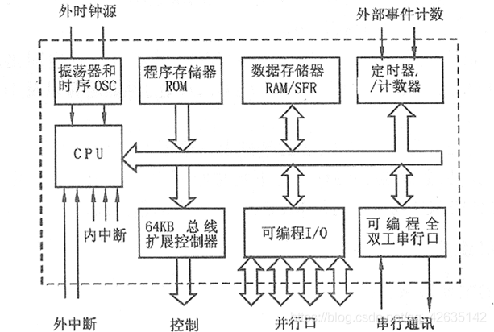
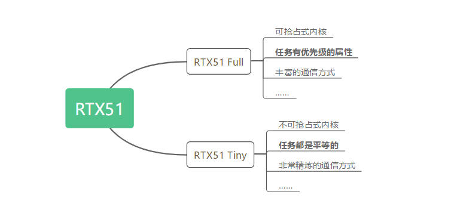

--

# emu8051

代码：

https://github.com/jarikomppa/emu8051

用法：

到这里下载二进制。可以下载windows版本的。

https://solhsa.com/8051.html

但是windows下面的界面是乱的。

所以还是ubuntu下来使用吧。

```
sudo apt-get install emu8051
```

会得到2个程序：

emu8051-cli

emu8051-gtk

gtk这个程序打开后，界面还是非常直观友好的。

这个程序看起来写得还是非常不错的。

看看手册和代码。都是这里可以下载到的。

https://solhsa.com/8051.html

# 51单片机架构说明




- 80C51=(1×8)CPU+128B RAM+4KB ROM+ (2×16)T/C + (4×8)I/O + 1个UART+5个中断源

单片机CPU = 控制器 + 运算器


https://zhuanlan.zhihu.com/c_1622755504114827264


单片机原理——MCS-51单片机结构及原理

这篇很好，看这一篇就够了。

https://blog.csdn.net/qq_42635142/article/details/104115430

# 51上面跑rtos

像Small RTOS、Keil 自带的RTX51 Tiny、大家熟悉的uCOS等这些都可以运行在51单片机上的RTOS。

像AtomThreads、 Chibios、 CMX-Tiny+、 embOS这些RTOS都对51单片机做了适配。

https://blog.csdn.net/ybhuangfugui/article/details/117267640

## small rtos51

https://d1.amobbs.com/bbs_upload782111/files_31/ourdev_570473.pdf

https://miaowlabs.com/wiki/Mwbalanced/smallrtos51-intro.html

## rtx51 tiny

`RTX51`是**Keil官方专门针对8051单片机及相关系列**而研发的[嵌入式](https://so.csdn.net/so/search?q=嵌入式&spm=1001.2101.3001.7020)多任务实时系统（`RTOS`），其实很少人知道8051也有操作系统，因为8051的各种资源限制问题，裸机编程是其长处，但需求是万变的，8051也有使用`RTOS`的场合。



奇怪的是，**RTX51 Full的源码和相关文档在Keil官网中消失了**，翻查一下论坛，可以知道`RTX51 Full`的最后一个版本是7.00，**消失的年份是2007年**，当时官网还有人讨论`RTX51 Full`的[相关事情](https://developer.arm.com/keil-search#q=RTX51 Full))，比如下面一个[讨论](http://www.keil.com/forum/5254/?_ga=2.38921507.1005158342.1560860713-1244462768.1555925444)：


最后有一点可以清晰的，就是 **[官网](http://www.keil.com/rtx51tiny/specs.asp)不再更新和提供RTX51 Full源码和相关文档，Full已经停产**：


这个视频教程说明了怎么使用rtx51-tiny。

https://www.bilibili.com/video/BV1qa4y1H7Ao


https://blog.csdn.net/Hxj_CSDN/article/details/97436443


https://blog.csdn.net/hxj_csdn/category_9169330.html


## chibios

https://github.com/ChibiOS/ChibiOS

虽然名字看起来很像中文拼音，像是赤壁的意思。

但是是国外的os。

ChibiOS是一个开源的实时操作系统（RTOS），专门为嵌入式系统和小型设备开发而设计。它提供了一个轻量级的、可裁剪的操作系统内核，旨在提供高效的任务管理、调度和资源管理功能。以下是一些关键特点和功能：

1. 实时调度：ChibiOS提供了多任务调度机制，可以同时运行多个任务，并按照优先级和调度策略进行任务调度。它支持抢占式和协作式调度，具有低延迟和可预测性。

2. 低内存占用：ChibiOS具有精简的内核设计，优化了内存使用。开发人员可以根据系统需求选择所需的功能和模块，以减少内存占用。

3. 硬件抽象层：ChibiOS提供了硬件抽象层（HAL），用于提供硬件访问接口和驱动程序，简化了对不同硬件平台的开发和移植。

4. 丰富的功能模块：ChibiOS提供了丰富的功能模块，包括定时器、信号量、消息队列、邮箱、事件标志、内存管理和文件系统等，以支持各种应用需求。

5. 支持多种处理器架构：ChibiOS支持多种常见的处理器架构，包括ARM Cortex-M系列、RISC-V、PowerPC、x86等，使其适用于多种嵌入式平台。

6. 开源许可：ChibiOS是基于GNU General Public License（GPL）或ChibiOS License（免费用于商业和非商业项目）的开源项目，可以免费使用和修改。

ChibiOS提供了一种轻量级、可靠和可移植的嵌入式操作系统解决方案，适用于各种嵌入式应用，包括消费电子产品、工业控制、汽车电子、无人机、物联网设备等。它有一个活跃的社区和详细的文档，可以提供支持和帮助开发人员快速构建稳定可靠的嵌入式系统。您可以访问ChibiOS的官方网站（www.chibios.org）获取更多信息、文档和示例代码。


是的，ChibiOS也提供了针对8051系列单片机的支持，可以在8051芯片上运行。ChibiOS的8051版本称为ChibiOS/RT，它针对8051系列单片机提供了适配和优化的代码。

ChibiOS/RT为8051系列单片机提供了基本的实时操作系统功能，包括多任务调度、任务同步、信号量、消息队列等。它具有精简的内核设计，可以高效地利用8051的资源和存储器。

使用ChibiOS/RT可以帮助开发人员在8051上构建更复杂和功能丰富的嵌入式系统。您可以访问ChibiOS的官方网站（www.chibios.org）获取更多关于ChibiOS/RT的信息、文档和示例代码。


以下是一个基于ChibiOS/RT的8051示例程序，其中包含两个简单的任务：

```c
#include <ch.h>
#include <hal.h>

/* 定义任务堆栈 */
#define STACK_SIZE 128
static WORKING_AREA(waTask1, STACK_SIZE);
static WORKING_AREA(waTask2, STACK_SIZE);

/* 任务1 */
static msg_t Task1(void *arg) {
  (void)arg;

  while (1) {
    /* 执行任务1的操作 */
    /* ... */
    chThdSleepMilliseconds(1000);  // 暂停1秒钟
  }

  return 0;
}

/* 任务2 */
static msg_t Task2(void *arg) {
  (void)arg;

  while (1) {
    /* 执行任务2的操作 */
    /* ... */
    chThdSleepMilliseconds(500);  // 暂停0.5秒钟
  }

  return 0;
}

int main(void) {
  /* 系统初始化 */
  halInit();
  chSysInit();

  /* 创建任务 */
  chThdCreateStatic(waTask1, sizeof(waTask1), NORMALPRIO, Task1, NULL);
  chThdCreateStatic(waTask2, sizeof(waTask2), NORMALPRIO, Task2, NULL);

  /* 主循环 */
  while (1) {
    /* 可选的主循环操作 */
  }
}
```

这个示例程序定义了两个任务：Task1和Task2。每个任务都在一个无限循环中执行其操作，并使用`chThdSleepMilliseconds()`函数暂停一定的时间。

在`main()`函数中，首先进行系统初始化（`halInit()`和`chSysInit()`），然后使用`chThdCreateStatic()`函数创建任务。`chThdCreateStatic()`函数接受任务的工作区、工作区大小、任务优先级、任务函数和参数作为参数。

最后，程序进入主循环，可以添加其他需要执行的操作。

请注意，这只是一个简单的示例程序，用于演示在8051上使用ChibiOS/RT创建多个任务。实际应用中，您可能需要根据具体的需求进行任务逻辑和功能的编写。

# 51的启动脚本

下面是一个典型的8051单片机的启动脚本示例：

```assembly
ORG 0x0000 ; 程序起始地址

RESET_VECTOR:
    LJMP MAIN ; 跳转到主程序入口

ORG 0x0030 ; 中断向量表地址

; 中断向量表
ORG 0x0030 ; 外部中断 0
    LJMP EXTERNAL_INT_0
ORG 0x0033 ; 定时器 0 中断
    LJMP TIMER0_INT
ORG 0x003B ; 外部中断 1
    LJMP EXTERNAL_INT_1
ORG 0x0043 ; 定时器 1 中断
    LJMP TIMER1_INT
ORG 0x004B ; 串口中断
    LJMP SERIAL_INT

; 中断服务例程
EXTERNAL_INT_0:
    ; 处理外部中断 0 的代码
    RETI ; 返回中断

TIMER0_INT:
    ; 处理定时器 0 中断的代码
    RETI ; 返回中断

EXTERNAL_INT_1:
    ; 处理外部中断 1 的代码
    RETI ; 返回中断

TIMER1_INT:
    ; 处理定时器 1 中断的代码
    RETI ; 返回中断

SERIAL_INT:
    ; 处理串口中断的代码
    RETI ; 返回中断

MAIN:
    ; 主程序入口
    ; 在这里编写主程序的代码

END ; 程序结束指令
```

上述示例中，RESET_VECTOR 是复位向量，表示单片机复位时的入口点，通常是跳转到主程序入口（这里用的是 `LJMP` 指令）。然后是中断向量表，其中列出了不同中断的入口点。每个中断向量对应一个中断服务例程，其中可以编写处理特定中断的代码。最后，程序的主要逻辑被放置在 `MAIN` 标签下。

请注意，具体的启动脚本可能会因单片机型号和硬件平台而有所不同。此示例提供了一个基本框架，但您可能需要根据您的特定单片机和应用程序要求进行调整和定制。

对于特定的8051单片机型号，您可以查阅其技术文档或参考手册，以获取更准确和详细的启动脚本信息。

## 调用C语言函数之前的准备

在8051单片机上调用C语言函数之前，需要进行一些准备工作。下面是一些常见的准备步骤：

1. 堆栈设置：在调用C函数之前，需要设置堆栈指针（SP）以提供函数调用所需的堆栈空间。堆栈指针应指向一个可用的内存区域，以便在函数调用期间存储局部变量、返回地址等信息。

2. 函数参数传递：在调用C函数时，需要按照C语言的参数传递规则将参数传递给函数。通常，参数通过寄存器或栈传递。

3. 寄存器保存：如果C函数使用某些特定寄存器进行计算或保存临时变量，那么在调用函数之前，需要先将这些寄存器保存起来，以免在函数调用过程中被修改。

4. 函数调用：根据所使用的C编译器和编译选项，可能需要按照特定的调用约定将函数调用指令生成为正确的机器码。例如，使用标准的C调用约定，可能需要使用CALL或者LCALL指令进行函数调用。

5. 返回值处理：如果C函数有返回值，需要定义一个合适的变量来存储返回值。根据返回值的类型和大小，可能需要使用特定的寄存器或内存位置来存储返回值。

这些准备步骤可以根据具体的单片机型号、编译器和C库的要求而有所不同。建议参考相关的单片机和C编译器的文档，以了解准备步骤的具体要求和实现方法。

# 51单片机的寄存器组为什么分为4组？

在 8051/8052 单片机架构中，寄存器被分为 4 组，这样的设计有以下几个原因：

1. 数据存储：**每个组的寄存器用于存储不同类型的数据**。例如，第一组寄存器（R0-R7）被用作通用寄存器，可以用于存储任意数据；第二组寄存器（R8-R15）主要用于存储函数的局部变量；第三组寄存器（R16-R23）用于存储函数参数和返回值；第四组寄存器（R24-R31）用于存储常量和一些特殊功能寄存器。

2. 访问速度：**将寄存器分组可以提高访问速度**。每个组的寄存器位于不同的内部总线上，因此可以并行地访问多个寄存器。这样的设计使得读写寄存器的操作更高效，提高了程序的执行速度。

3. 指令编码：8051/8052 指令的编码中使用了特定的寄存器组编号，以指定指令所操作的寄存器。这种设计使得指令编码更加简洁，指令执行更高效。

4. 兼容性：8051/8052 是最早的 8 位单片机之一，在其设计中兼顾了硬件成本和功能。将寄存器分为 4 组是为了提供一种平衡的设计，可以满足大多数嵌入式应用的需求。

总的来说，将 8051/8052 寄存器分为 4 组是为了方便数据存储、提高访问速度、简化指令编码，并满足硬件成本和功能需求的平衡。这种设计在多年来的嵌入式开发中被广泛使用，并成为了许多后续单片机架构的基础。

# 8051指令集和汇编语言程序设计


https://www.cnblogs.com/zy666/p/10504314.html

# 让chatgpt实现一个最简单的rtos

在8051上实现一个完整的实时操作系统（RTOS）是一项复杂的任务，需要处理任务调度、任务切换、任务同步、资源管理等方面的功能。下面是一个基本的8051上运行的RTOS示例，它实现了任务切换的基本功能：

```c
#include <C8051F340.h>

#define STACK_SIZE 128

typedef void (*TaskFunc)(void);

typedef struct {
  TaskFunc task_func;
  unsigned char stack[STACK_SIZE];
} TaskControlBlock;

TaskControlBlock task_table[2];
unsigned char current_task = 0;

void Task1(void) {
  while (1) {
    // 任务1的操作
  }
}

void Task2(void) {
  while (1) {
    // 任务2的操作
  }
}

void task_switch(void);

void main(void) {
  task_table[0].task_func = Task1;
  task_table[1].task_func = Task2;

  SP = (unsigned int)(task_table[current_task].stack + STACK_SIZE);

  // 在C8051F340上配置定时器和中断

  TMOD = 0x01;
  CKCON |= 0x08;   // 选择系统时钟作为定时器0的时钟源
  TH0 = 0xFC;
  TL0 = 0x66;
  IE |= 0x82;     // 启用定时器0中断和全局中断

  while (1) {
    task_table[current_task].task_func();
    task_switch();
  }
}

void task_switch(void) interrupt 1 {
  TF0 = 0;
  task_table[current_task].stack[STACK_SIZE - 1] = SP;  // 保存当前任务的堆栈指针
  current_task++;
  if (current_task >= sizeof(task_table) / sizeof(TaskControlBlock)) {
    current_task = 0;
  }
  SP = (unsigned int)(task_table[current_task].stack + STACK_SIZE);  // 恢复下一个任务的堆栈指针
}

```

这个示例中实现了两个任务（Task1和Task2），它们通过翻转8051芯片上的LED来演示任务的切换。程序中使用了一个任务控制块数组来保存任务的函数指针和堆栈指针。在主循环中，首先执行当前任务，然后切换到下一个任务。定时器0的中断用于触发任务切换，每次中断发生时，将保存当前任务的堆栈指针并切换到下一个任务的堆栈指针。

请注意，这只是一个基本的示例，用于演示在8051上实现任务切换的概念。在实际应用中，您可能需要根据具体的需求进行更复杂的任务管理和功能的实现。

# 参考资料

1、

http://blog.chinaunix.net/uid-20846214-id-2413070.html