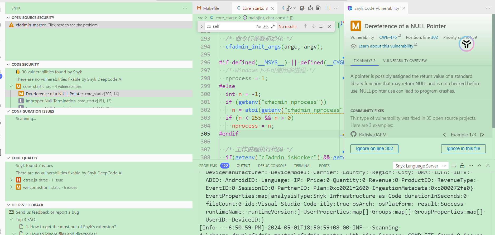

--

现在是假期，在家学习。

要对AI的应用进行思考和探索，看看怎么提高自己工作和学习的效率。

现在主要使用的是chatgpt和chatglm.cn（智谱清言）。

chatglm能联网搜索。

但是chatgpt还是我日常工作时使用的重点。

# DeepCode进行代码review

DeepCode 为 Visual Studio Code 和 Atom 提供插件和扩展。但是将其包含到您的 CI 管道中怎么样？嗯，CLI 非常方便。

https://github.com/DeepCodeAI/vscode-extension

这个插件现在已经合并到Snyk插件。所以在vscode插件里搜索Snyk找到插件安装。

DeepCode 通过分析数千个开源项目进行训练，为代码托管平台或本地存储库中的项目提供反馈。 

DeepCode 的创建者声称，它比传统的代码分析工具提供更好、更详细的反馈，

因为它在上下文中分析代码——不仅是文本，而且是运行的软件。

DeepCode 的问题知识库涵盖了 C 和 C++ 以及其他语言中的许多常见问题：

样式问题、资源泄漏、内存分配问题、日期处理问题以及语言版本之间的不兼容性。

在对 Linux 内核的分析中，DeepCode 发现了 C 代码库中的许多常见问题，

包括从命令行参数或环境变量传递的未经清理的参数、释放后使用问题以及缺少对空指针的检查。 

C 代码中的其他问题更为微妙，

例如临时文件的不安全创建，或者某些指令可能在编译中被优化而没有达到预期效果的可能性。

由于涉及 C/C++ 低级功能的复杂性，为 C 和 C++ 添加代码分析花了三个月的时间。

## 使用体验

不太好。比较麻烦。

# AI搭建工作流

# HuggingFace我能怎么用

