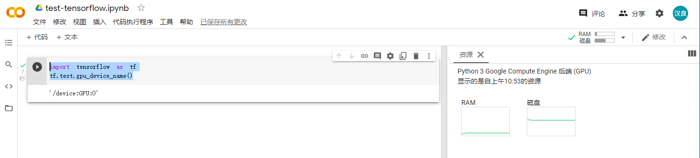
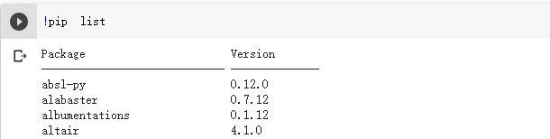
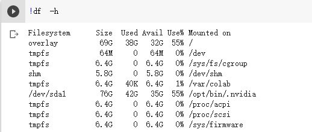

--

# 过程记录

先是随意在知乎上搜索信息，看一些文章。

然后在京东读书上搜索一些VIP免费读的书籍。

《TensorFlow深度学习》，大概看了一下，讲得比较浅显易懂，适合入门。

为了方便快速连续，还是借助colab，而且选择TensorFlow1.x版本。

学习使用TensorFlow，并以california的1990年的人口普查中的城市街区的房屋价值中位数作为预测目标，使用均方根误差（RMSE）评估模型的准确率,并通过调整超参数提高模型的准确率

https://segmentfault.com/a/1190000013807691

# 概念

TensorFlow从单词字面含义看，是张量流的意思。

看张量这个概念，物理概念，一大堆解释，看不懂。计算机领域的明显不是物理里的那个含义。

官网在这里：www.tensorflow.org

官网解释是：TensorFlow是一个使用数据流图进行数值计算的开源软件库。

张量在计算机里的解释是多维数组。


TensorFlow是一个基于数据流编程（dataflow programming）的符号数学系统，

被广泛应用于各类机器学习（machine learning）算法的编程实现，其前身是谷歌的神经网络算法库DistBelief。

Tensorflow拥有多层级结构，

可部署于各类服务器、PC终端和网页并支持GPU和TPU高性能数值计算，

被广泛应用于谷歌内部的产品开发和各领域的科学研究 。

TensorFlow由谷歌人工智能团队谷歌大脑（Google Brain）开发和维护，

拥有包括TensorFlow Hub、TensorFlow Lite、TensorFlow Research Cloud在内的多个项目以及各类应用程序接口（Application Programming Interface, API） [2] 。

自2015年11月9日起，TensorFlow依据阿帕奇授权协议开放源代码 。

Tensorflow是目前最火的深度学习框架，

广泛应用于自然语言处理、语音识别、图像处理等多个领域。

不仅深受全球深度学习爱好者的广泛欢迎，Google、eBay、Uber、OPenAI等众多科技公司的研发团队也都在使用它。

相较于其它的深度学习框架，如：Caffe、Torch、Keras、MXnet、Theano等，Tensorflow的主要优势有以下几点：高度的灵活性、支持python语言开发、可视化效果好、功能更加强大、运行效率高、强大的社区。

**Tensorflow其它特点**

支持多核（CPU、GPU）计算；

支持分布式计算（Tensorflow+Kubernetes）；

易学性：和numpy，theano等有相似性；

通用性：low/high-level function，跨平台，便于产品化；

易用性：Keras，tf.contrib.(learn,seq2seq等)

社区活跃性。


# 应用场景

我的一个认识，只要你觉得可以拿来让小孩子做的事情，都可以让TensorFlow来做一下。

例如打游戏，画画，写字，认字，认识动物。


## 看花识名

深度学习在图像处理、语音识别、自然语言处理领域的应用取得了巨大成功，

但是它通常在功能强大的服务器端进行运算。

如果智能手机通过网络远程连接服务器，

也可以利用深度学习技术，但这样可能会很慢，

而且只有在设备处于良好的网络连接环境下才行，

**这样需要把深度学习模型迁移到智能终端。**

由于智能终端CPU和内存资源有限，为了提高运算性能和内存利用率，需要对服务器端的模型进行量化处理和支持低精度算法。

TensorFlow 版本增加了对Android，iOS 和 Raspberry Pi 硬件平台的支持，

**允许它在这些设备上执行图像分类等操作。**

这样创建在智能手机上工作并且不需要云端每时每刻都支持的机器学习模型，带来了新的APP。

本文主要基于看花识名APP应用，讲解TensorFlow模型如何应用于Android系统；

在服务器端训练TensorFlow模型，并把模型文件迁移到智能终端；

TensorFlow Android开发环境构建以及应用开发API。


使用AlexNet模型, Flowers数据以及Android平台构建了“看花识名”APP。

TensorFlow模型对五种类型的花数据进行训练。


## 深度学习在自然语言处理中的应用

自然语言处理是教会机器如何去处理或者读懂人类语言的系统，主要应用领域：

- 对话系统 - 聊天机器人（小冰）
- 情感分析 - 对一段文本进行情感识别（我们一会要做的）
- 图文映射 - CNN和RNN的融合
- 机器翻译 - 将一种语言翻译成另一种语言，现在谷歌做的太牛了
- 语音识别 - 读懂人类的语音，如现在的正火热的语音翻译。


其他的例子还有很多，很多公司都在利用 TensorFlow 搭建自己的AI、机器学习平台。

比如说京东、腾讯、阿里、网易、美团、小米等公司。

他们使用TensorFlow解决了各种不同的问题，从计算机视觉、自然语言处理到推荐预测等等。

除了商业应用，人们也开始用AI来解决现实社会当中的一些难题，我们发现基于 TensorFlow 可以实现更多。

在**环境保护**方面，在亚马逊的热带雨林，工程师科学家建立了一个用移动设备的实时检测和警报系统, 来监控树木的非法砍伐。

在**医疗**领域，我们在探索如何应用 AI 使病理学家更好的诊断癌症。

在**农业**领域，IITA基于 TensorFlow 开发了一套帮助农民检测及管理虫害的方案，使5亿非洲人民免于虫灾饥荒。


对人脸关键点进行检测，添加口罩的单页应用。

使用了TensorFlow.js库的纯前端项目。

https://zamhown.gitee.io/wear-a-mask/

图像风格转换，例如把一种普通的照片转成梵高的风格。

自动上色。

给图片加描述。

照片猜年龄。

验证码识别。

语音识别

https://github.com/pannous/tensorflow-speech-recognition

## 参考资料

有笔记本就能玩的体感游戏！TensorFlow.js实现体感格斗教程

https://blog.csdn.net/yH0VLDe8VG8ep9VGe/article/details/83746975

写诗机器人

https://zhuanlan.zhihu.com/p/41714630

Tensorflow应用之LSTM

https://www.cnblogs.com/zongfa/p/9563510.html

用 TensorFlow 可以做什么有意思的事情？

https://www.zhihu.com/question/46495381?utm_source=wechat_session

# 环境搭建

TensorFlow即可以支持CPU，也可以支持CPU+GPU。

前者的环境需求简单，后者需要额外的支持。

验证环境是否正常

```
import tensorflow as tf
hello = tf.constant(‘Hello tensorfolw’)
sess = tf.Session()
print(sess.run(hello))
```

## 使用google colab方式

打开google drive，选择新建，添加新的应用类型，选择google colab的。

然后新建一个colab。

点击连接到资源。设置为GPU类型。

然后运行下面的测试代码，就可以看GPU是否正常。

```
import tensorflow as tf
tf.test.gpu_device_name()
```




如果利用GPU不运用自己本地的数据集，

而是跑跑框架自带的MNIST这些数据已经是够了的。

如果要跑自己的数据集就需要将自己的数据先上传到Google Colab云盘上面去。


要在colab里运行命令，就是添加一个代码段，然后在要执行的命令前面加上一个感叹号就可以（这个实际上的jupyter）。






## 参考资料

https://blog.csdn.net/weixin_42555080/article/details/100704078


https://zhuanlan.zhihu.com/p/54389036

# HelloWorld

看概念不如运行一个示例程序看看。

https://tensorflow.google.cn/

我在ubuntu下安装pycharm来写测试代码。

```
sudo snap install pycharm-community --classic
```

直接通过pycharm的图形界面里来搜索安装TensorFlow。

新建test.py，写入下面的内容，运行：

```
import tensorflow as tf
mnist = tf.keras.datasets.mnist
(x_train, y_train), (x_test, y_test) = mnist.load_data()
x_train, x_test = x_train / 255.0, x_test / 255.0

model = tf.keras.models.Sequential([
  tf.keras.layers.Flatten(input_shape=(28, 28)),
  tf.keras.layers.Dense(128, activation='relu'),
  tf.keras.layers.Dropout(0.2),
  tf.keras.layers.Dense(10, activation='softmax')
])

model.compile(optimizer='adam',
              loss='sparse_categorical_crossentropy',
              metrics=['accuracy'])

model.fit(x_train, y_train, epochs=5)

model.evaluate(x_test,  y_test, verbose=2)
```

## 关闭warning打印

```
import os
os.environ['TF_CPP_MIN_LOG_LEVEL'] = '3' 
import tensorflow as tf
```


## mnist数据集

MNIST 数据集已经是一个被”嚼烂”了的数据集, 很多教程都会对它”下手”, 几乎成为一个 “典范”. 

http://yann.lecun.com/exdb/mnist/ 官网是这里。

MNIST 数据集来自美国国家标准与技术研究所,

 National Institute of Standards and Technology (NIST). 

训练集 (training set) 由来自 250 个不同人手写的数字构成, 

其中 50% 是高中学生, 50% 来自人口普查局 (the Census Bureau) 的工作人员. 

测试集(test set) 也是同样比例的手写数字数据.

- Training set images: train-images-idx3-ubyte.gz (9.9 MB, 解压后 47 MB, 包含 60,000 个样本)
- Training set labels: train-labels-idx1-ubyte.gz (29 KB, 解压后 60 KB, 包含 60,000 个标签)
- Test set images: t10k-images-idx3-ubyte.gz (1.6 MB, 解压后 7.8 MB, 包含 10,000 个样本)
- Test set labels: t10k-labels-idx1-ubyte.gz (5KB, 解压后 10 KB, 包含 10,000 个标签)

## 参考资料

https://www.cnblogs.com/xianhan/p/9145966.html

# 版本问题

看网上说TF的版本有1.x和2.x版本，差别就跟python2和python3类似。

区别还比较大，互相不兼容。

tf1.4 工业界最稳定的版本，其他版本建议改pytorch


首先主要是「TF 1」和「TF 2」设计理念的区别。

在「TF 1.x」的版本下，主要是静态图，

所以一切的Python语法（也就是你说的 if...else...） 都无法使用（主要是没办法包含在图里）。

大家经常抨击的Session模式，也主要是因为静态图的原因。

其实，「TF 1.x」的入门门槛远远高于「Keras，Pytorch」之流。

如果想使用「TF 1.x」搭建网络模型，你就会发现，你不仅只需要关心网络结构，更需要关心底层的执行过程，以及数据流向。

不可否认，Keras 和 PyTorch 是非常优秀的框架。

如果你只是想简简单单地跑一个学术届的Demo，不需要关心各种工程问题，

这两个已经很满足需求了。

但是，如果你对自己有更高的要求，想要更加透彻的理解网络是怎么运行的，

还是建议使用「TF 1.x」。


大部分时候，大家只要做一件更简单的事: 一台机器，搭一个标准的神经网络，训起来

他们要的是一个Keras, 或者PyTorch, 简单友好的把这件简单的事给做了

可惜Keras做的太烂，导致他们不得不去用TensorFlow，然后骂TensorFlow对他们这么不友好

TensorFlow也只好被99%的民意裹挟


## colab选择1.x版本的TF

这里有说明

https://colab.research.google.com/notebooks/tensorflow_version.ipynb

执行这个就可以指定版本

```
%tensorflow_version 1.x
```


## 参考资料

https://zhuanlan.zhihu.com/p/138418931

https://www.zhihu.com/question/348357230/answer/839947127

https://blog.csdn.net/AnneQiQi/article/details/103079427

# 教程

Tensorflow是一种计算图模型，

即**用图的形式来表示运算过程**的一种模型。

Tensorflow程序一般分为**图的构建**和**图的执行**两个阶段。

图的构建阶段也称为图的定义阶段，

该过程会在图模型中定义所需的运算，

每次运算的的结果以及原始的输入数据都可称为一个节点（operation ，缩写为op）。我们通过以下程序来说明图的构建过程：

```
import tensorflow as tf
m1 = tf.constant([3,5])
m2 = tf.constant([2,4])
result = tf.add(m1, m2)
print(result)
```

程序1定义了图的构建过程，“import tensorflow as tf”，是在python中导入tensorflow模块,并另起名为“tf”；接着定义了两个常量op，m1和m2，均为1*2的矩阵；最后将m1和m2的值作为输入创建一个矩阵加法op，并输出最后的结果result。

```
tf.Tensor([5 9], shape=(2,), dtype=int32)
```

我们分析最终的输出结果可知，其并没有输出矩阵相加的结果，

而是输出了一个包含三个属性的Tensor(Tensor的概念我们会在下一节中详细讲解，这里就不再赘述)。

第二个阶段为图的执行阶段，也就是在会话（session）中执行图模型中定义好的运算。

我们通过程序2来解释图的执行阶段：

程序2：

```
sess = tf.Session()
print(sess.run(result))
sess.close()
```

这个写法是对TF1.x版本有用的。

而我现在用的是TF2.6版本（查看版本号：`tf.__version__`）。


因此应用CNN的主要瓶颈还是在训练，用CNN做预测问题不大。

目前TensorFlow已经支持在iOS、Android系统中运行，

所以在手机上使用CPU进行人脸识别或图片分类已经非常方便了，并且响应速度也很快。

# esp32使用TensorFlow

ESP32 的独特之处在于它是一款独特的 SoC，

可以从原型快速推进到批量生产。

它拥有广泛的社区、众多的开发套件和大量的教程/SDK，

是快速原型设计的优异载体，

几乎能够涵盖所有您感兴趣的任何垂直领域。

多合一软件包 (Wi-Fi/BT/MCU) 和现有的实际大量部署使其成为构建最终产品的理想选择。

[ESP-EYE 开发者套件](https://link.zhihu.com/?target=https%3A//www.mouser.com/ProductDetail/Espressif-Systems/ESP-EYE%3Fqs%3Dl7cgNqFNU1iWrlpTZmwCRA%3D%3D)包括 ESP32 Wi-Fi/BT MCU 和一个 200 万像素的摄像头。

## 参考资料

https://zhuanlan.zhihu.com/p/266147987

# arduino使用TensorFlow

TinyML 是一个新兴领域，目前仍有很多事情亟待解决，但可喜的是，该领域尚有广阔的应用空间有待我们去探索。

数十亿微控制器与渗透在生活方方面面的各类传感器相结合，未来会激发更多富有创造力的 Tiny ML 应用。 

**语音识别示例：micro_speech**

使用 Arduino 开发板的最初步骤之一是让 LED 闪烁。

此处，我们将采取稍微不同的方式，

通过使用 TensorFlow Lite Micro 识别语音关键字。

其拥有一个由“yes”和“no”组成的简单词汇表。

切记，此模型仅使用 256KB RAM，并在本地微控制器上运行，

因此不要期待与商业级别“语音助手”相同的准确性。

模型没有连接到互联网连接，并且本地可用 RAM 相差了近 2000 倍。 


## 参考资料

https://mp.weixin.qq.com/s?__biz=MzU1OTMyNDcxMQ==&mid=2247488127&idx=1&sn=6f9fa54f407f233ab9a25e2b67a67ea6&chksm=fc185937cb6fd021825503a7814fac95485c5acaaacdfbe0c5235e999115cf77572028aa446c&scene=21#wechat_redirect


# 边缘TensorFlow应用

这几年我们在日常工作生活中看到越来越多的智能终端设备的出现，

如智能家电、商城客服机器人、物流配送无人小车、智能监控等等，

它们可以为我们生活带来各种各样的便利。

因此，边缘智能与 AIoT 已成为不少国内外企业发展的一个重要方向。

边缘智能是一项以嵌入式设备应用开发为基础的前沿技术，

我们需要在一些资源紧张的嵌入式设备，如 MCU、SOC，部署如人脸识别、物体检测、音频分类等智能应用。

然而，我们又看到现实的嵌入式智能应用开发面正临着一些软硬件生态兼容方面的挑战。

例如，芯片厂商提供推荐的板载系统往往是定制的，

使用不同的编译工具，而且大多不会有 Python 解释器。

所以，当我们打算将自己的智能应用部署到嵌入式设备时，我们绕不开 AI 推理框架跨平台的问题。

TensorFlow Lite 应用 C++ 作为框架底层的基础实现可以天然保证跨平台扩展特性，

但由于它的这项技术的比较前沿，

在嵌入式 Linux 设备上以 Python 接口为主，有些开发者不太适应，认为不易上手。

为此，我们开发 Edge Brain 方便开发者

以其熟悉的交叉编译方式部署 TensorFlow Lite 智能应用，让他们的嵌入式应用走向智能化。


**Edge Brain** 是我们开源项目互助小组（G2HOSP，Group to Help Open Source Projects）的持续开发维护项目，

我们将以它的编译环境为基础开发更多如文本识别、MobileBert、MobileTTS 的嵌入式智能应用案例，

扩展更多的像 FPGA、Coral TPU 那样的嵌入式系统平台，

支持更多与 XNN Pack Delegate 类似的深度学习算子优化。


https://zhuanlan.zhihu.com/p/365020181

# TensorFlow在ubuntu上编译使用

先clone代码

```
git clone https://github.com/tensorflow/tensorflow #下载tensorflow
git branch -a #查看所有分支
git checkout <version> #检出对应的版本
```

安装这篇文章安装好bazel。

https://docs.bazel.build/versions/3.7.0/install-ubuntu.html

然后配置，configure是用python实现的。是交互式的。

```
./configure
```

一路默认就好了。

编译生成C库

```
bazel build --config=opt  //tensorflow:libtensorflow.so
```

提示了bazel版本不对，安装提示安装指定版本。

```
ERROR: The project you're trying to build requires Bazel 3.7.2 (specified in /home/teddy/work/test/tensorflow-test/tensorflow/.bazelversion), but it wasn't found in /usr/bin.

You can install the required Bazel version via apt:
  sudo apt update && sudo apt install bazel-3.7.2
```

执行上述命令，会产生`bazel-bin、bazel-genfiles、bazel-out、bazel-tensorflow-r<version>、bazel-testlogs`五个文件夹，我们生成的库在`bazel-bin`文件夹中。

编译需要下载不少的东西。还是挺慢的。

加代理还不行，导致url不符合规则了。

```
/home/teddy/work/test/tensorflow-test/tensorflow/.bazelrc
```

不过好歹下载部分是完成了。编译有5000多个c++文件，非常慢。


## 参考资料

https://blog.csdn.net/guo1988kui/article/details/103696188/

# 参考资料

https://zhuanlan.zhihu.com/p/34759875