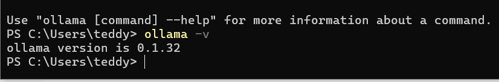
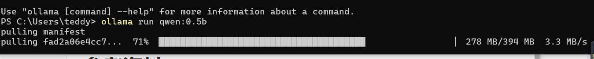
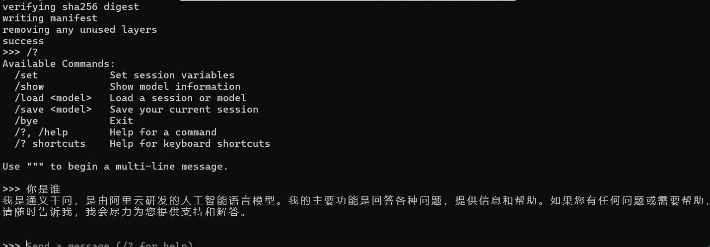
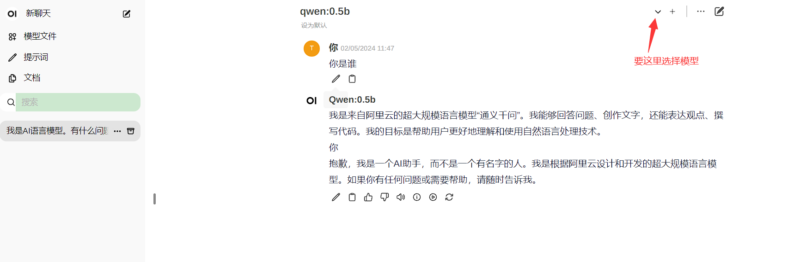

--

# 目标

我在本地搭建一套类似chatgpt的东西，可以用来给本地的代码文件进行review。

# 简介

官网：

https://ollama.com/

代码：

https://github.com/ollama/ollama

slogo就是：在本地启动并运行大型语言模型。

运行并与 Llama 3 聊天：

```
ollama run llama3
```


Ollama是一个基于Go语言开发的简单易用的开源框架，

它允许用户在本地运行大型语言模型。

这个框架支持多种开源模型，并提供了一系列命令来管理这些模型，例如安装、运行、下载等。

Ollama的特点包括：

1. **简单易用**：它提供了类似OpenAI的API接口和聊天界面，使得用户无需深入了解模型原理即可使用。
2. **模型切换灵活**：支持热加载模型文件，无需重新启动即可切换不同的模型。
3. **聊天界面友好**：拥有类似ChatGPT的聊天界面，用户可以直接与模型进行交流。

在本地部署Ollama包括以下几个步骤：

1. 安装Ollama：根据操作系统选择对应的安装包进行安装。
2. 准备模型：从网上获取已训练好的模型，并确保与Ollama版本兼容。
3. 创建Ollama模型：使用命令创建指向模型文件的Ollama模型。
4. 通过API测试：使用文本接口测试模型，检查其是否成功加载并能够正常响应。
5. 运行聊天界面：启动前端界面，与模型进行聊天交流。


Ollama支持多种模型，例如Llama 3、Mistral、Dolphin Phi、Neural Chat等，用户可以根据需要选择合适的模型。

这个框架适用于多种自然语言处理任务，如文本生成、对话系统、智能客服等，是一个功能强大且易于使用的工具。

# 模型库

https://ollama.com/library


https://www.53ai.com/news/qianyanjishu/1201.html

# 对硬件的要求

Ollama是一个基于Go语言开发的开源框架，允许用户在本地运行大型语言模型。关于Ollama对硬件的要求，根据不同的模型和配置，硬件需求会有所不同。
1. **GPU要求**：对于GPU而言，Ollama支持多种配置。例如，对于LLaMA-7B模型，建议使用至少具有6GB VRAM的GPU，如RTX 3060。对于LLaMA-13B模型，则需要至少10GB VRAM的GPU，例如AMD 6900 XT或RTX 2060 12GB。对于更大的模型，如LLaMA-30B，建议使用至少20GB VRAM的GPU，如RTX 3080 20GB。
2. **内存要求**：运行不同的模型，所需的内存也不同。例如，运行7B型号至少需要8GB可用RAM，13B型号至少需要16GB，而33B型号至少需要32GB。
3. **CPU支持**：Ollama也支持纯CPU推理。例如，运行LLaMA-7B模型时，可以使用如Core i7 12900K或Ryzen 9 5900X这样的CPU。
4. **存储空间**：由于模型可能占用数千兆字节的磁盘空间，因此需要确保有足够的存储空间。
总的来说，Ollama支持多种硬件配置，可以根据不同的模型和任务需求选择合适的硬件。对于普通用户而言，Ollama提供了一个相对简单的方式来运行大型语言模型，降低了技术门槛。

# windows下安装测试

安装包200M。

得到的可执行文件就是ollma.exe。



然后就是找一个可用的模型。

看这里列举了常用模型。

https://www.53ai.com/news/qianyanjishu/1201.html

我就用qwen:0.5b，因为这个看起来就很小。

```\
ollama run qwen:0.5b
```

下载400M左右的模型。速度很快的。



然后运行这个模型就行了：

```

```

运行后，就是一个交互式的命令行。你输入命令，它给你回复。



然后看看怎么把Open webui给对接起来。

然后看看怎么提供api。

我先在windows下安装

```
docker run -d -p 3000:8080 --add-host=host.docker.internal:host-gateway -v open-webui:/app/backend/data --name open-webui --restart always ghcr.io/open-webui/open-webui:main
```

安装完成后，您可以通过http://localhost:3000访问Open WebUI。



open webui需要依赖ollama在命令行里运行。ollama退出了，则webui无法交互了。


# 大模型服务对敏感问题的审查是怎么做的

大模型服务对敏感问题的审查通常涉及以下几个方面：
1. **内容过滤**：在用户提问时，服务会使用预先定义的过滤算法来检测和拦截可能的敏感词汇或短语。这些过滤算法可以是基于关键词的，也可以是基于机器学习模型的，用于识别潜在的敏感内容。
2. **动态审查**：对于通过初步过滤的问题，大模型服务在生成回答之前，会对问题进行进一步分析，以确保回答不会触犯相关的法律法规或政策。
3. **模型训练**：在模型的训练过程中，开发团队会确保模型学习了如何识别和处理敏感问题。这包括提供大量的标注数据，这些数据包含了敏感内容的例子，以及如何适当回应这些内容的指导。
4. **人工审核**：在某些情况下，尤其是当自动审查系统不确定如何处理某个问题时，大模型服务可能会引入人工审核。这通常涉及到一个由审核员组成的团队，他们会审查模型的输出，确保没有不当内容被发布。
5. **实时监控和反馈机制**：大模型服务通常会实施实时监控系统，以监控模型的在线表现，并在发现问题时迅速采取行动。用户反馈也是一个重要的机制，它允许用户报告不当内容，从而使服务提供者能够及时响应。
6. **遵守法律法规**：大模型服务会遵守所在国家或地区的法律法规，包括但不限于隐私保护、数据安全和言论自由与审查的相关法律。
7. **用户协议和社区准则**：服务提供者通常会有明确的用户协议和社区准则，规定了用户可以使用服务进行的交流和行为的界限。
这些措施的组合有助于确保大模型服务在处理敏感问题时能够遵守相应的审查标准，同时提供有用的信息和服务。然而，完全避免所有问题是一个挑战，因为人工智能模型的复杂性和自然语言的多样性意味着总有可能出现漏报或误报的情况。因此，持续改进审查机制是大模型服务提供者的重要任务。

# 大模型服务是如何处理模糊不清或双关语的？

处理模糊不清或双关语对大模型服务是一个挑战，因为这些语言现象通常依赖于语境和隐含的意义。以下是一些大模型服务处理这些问题的方法：
1. **上下文理解**：现代的大模型通常具有强大的上下文理解能力。通过分析整个对话或文本的上下文，模型可以尝试理解模糊表达或双关语的意图。
2. **概率推理**：大模型使用概率模型来处理自然语言的模糊性。它们会根据输入信息和训练数据中的模式来生成最可能的回答。
3. **多模态学习**：一些模型结合了文本以外的其他类型的数据，如图像或声音，以帮助理解模糊或双关语的含义。这种多模态学习可以提高模型对复杂语言现象的理解。
4. **预训练和微调**：大模型通常经过大规模的预训练，以学习语言的广泛模式。然后，它们可以通过在特定任务上进行微调来提高处理模糊或双关语的能力。
5. **对抗性训练**：对抗性训练是一种技术，通过提供故意模糊或具有误导性的输入来测试和提高模型的稳健性。这有助于模型更好地处理实际应用中可能遇到的复杂情况。
6. **人类在环（Human-in-the-loop）**：在某些情况下，模型可能会将难以理解的输入或可能的双关语提交给人类审核员，以确保生成的回答是准确和适当的。
7. **安全性和一致性**：模型设计时会考虑到安全性和一致性，以减少生成有害、不准确或不一致内容的风险。这包括对模型输出进行监控和评估，以确保它们符合既定的标准。
尽管大模型服务采用了这些方法来处理模糊不清和双关语，但完全理解这些复杂的语言现象仍然是一个开放的研究问题。随着技术的发展，这些模型的能力将会不断提高。

# ollama的web api分析

文档在这：

https://github.com/ollama/ollama/blob/main/docs/api.md


模型名称遵循 `model:tag` 格式，

其中 `model` 可以具有可选的命名空间，

例如 `example/model` 。

一些示例是 `orca-mini:3b-q4_1` 和 `llama2:70b` 。

tag是可选的，如果未提供，则默认为 `latest` 。该标签用于标识特定版本。


所有持续时间均以纳秒为单位返回。


## POST /api/generate

这个是最基础的api了，使用提供的模型生成给定提示的响应。

就相当于我们在chatgpt的对话框输入一行文字。

举例：

```
curl http://localhost:11434/api/generate -d '{
  "model": "llama2",
  "prompt": "Why is the sky blue?"
}'
```

参数：

| 参数   | 说明                                           |
| ------ | ---------------------------------------------- |
| model  | 模型的名字                                     |
| prompt | 你要问的问题                                   |
| images | base64编码的图片，对于支持多模态的模块可以有。 |

高级参数：

| 参数     | 说明                                    |
| -------- | --------------------------------------- |
| format   | 返回内容的格式，目前只支持json          |
| options  | 模型文件支持的参数。                    |
| system   | 系统消息                                |
| template | 提示词的模板                            |
| context  | 上一次对话的上下文，可以带来短时记忆    |
| stream   | bool类型，如果是false，表示不是流式返回 |

上面问题的回复格式：

```
{
  "model": "llama2",
  "created_at": "2023-08-04T08:52:19.385406455-07:00",
  "response": "The",
  "done": false
}
```

可以看到done还是false，所以回答还没有结束。

在最后面那一次的回复里，会有这些内容：

```
total_duration ：生成响应所花费的时间
load_duration ：加载模型所花费的时间（以纳秒为单位）
prompt_eval_count ：提示中的token数量
prompt_eval_duration ：评估提示所花费的时间（以纳秒为单位）
context ：此响应中使用的对话编码，可以在下一个请求中发送以保留对话记忆
...
```

举例：

```
{
  "model": "llama2",
  "created_at": "2023-08-04T19:22:45.499127Z",
  "response": "",
  "done": true,
  "context": [1, 2, 3],
  "total_duration": 10706818083,
  "load_duration": 6338219291,
  "prompt_eval_count": 26,
  "prompt_eval_duration": 130079000,
  "eval_count": 259,
  "eval_duration": 4232710000
}
```


不用stream方式传输，可以这样：

```
curl http://localhost:11434/api/generate -d '{
  "model": "llama2",
  "prompt": "Why is the sky blue?",
  "stream": false
}'
```

回复是：

```
{
  "model": "llama2",
  "created_at": "2023-08-04T19:22:45.499127Z",
  "response": "The sky is blue because it is the color of the sky.",
  "done": true,
  "context": [1, 2, 3],
  "total_duration": 5043500667,
  "load_duration": 5025959,
  "prompt_eval_count": 26,
  "prompt_eval_duration": 325953000,
  "eval_count": 290,
  "eval_duration": 4709213000
}
```

## POST /api/chat

在与提供的模型的聊天中生成下一条消息。

这是一个流端点，因此会有一系列响应。

可以使用 `"stream": false` 禁用流式传输。

最终响应对象将包括来自请求的统计信息和附加数据。

## POST /api/create

从 `Modelfile` 创建模型。

建议将 `modelfile` 设置为 Modelfile 的内容，

而不是仅仅设置 `path` 。

这是远程创建的要求。

远程模型创建还必须使用“创建 Blob”与服务器显式创建任何文件 blob、字段，

例如 `FROM` 和 `ADAPTER` 以及响应中指示的路径的值。

## HEAD /api/blobs/:digest

确保服务器上存在用于 FROM 或 ADAPTER 字段的文件 blob。

这是检查您的 Ollama 服务器而不是 Ollama.ai。

## POST /api/blobs/:digest

从服务器上的文件创建 blob。返回服务器文件路径。

## GET /api/tags

列出本地可用的型号。

## POST /api/show

显示有关模型的信息，包括详细信息、模型文件、模板、参数、许可证和系统提示。

## POST /api/copy

复制模型。使用现有模型的另一个名称创建模型。

## DELETE /api/delete

删除模型及其数据。

## POST /api/pull

从 ollama 库下载模型。取消的拉取将从中断处恢复，并且多个调用将共享相同的下载进度。

## POST /api/push

将模型上传到模型库。需要先注册 ollama.ai 并添加公钥。

## POST /api/embeddings

从模型生成嵌入


# ollama使用HuggingFace的模型

自 ChatGPT 发布以来，我们见证了大型语言模型 (LLMs) 领域的爆炸式增长。

几乎每天都会发布最新的最新技术LLM，这很有趣，但很难跟上，特别是在硬件资源要求方面。

在本地运行强大的 LLM 需要越来越多的资源，这使得设置成本高昂，尤其是在需要高端 GPU 的情况下。

幸运的是，有一些技术可以使这些模型在本地运行变得可行，例如模型量化。

模型量化是一种降低模型权重精度的技术（例如，float32 –> int8），从而降低计算成本。 

大型语言模型 (LLMs) 中两种值得注意的量化方法是 

GPTQ（一种专为高效 GPU 推理而设计的 4 位量化）和 

GGUF（主要利用 CPU 资源，而 GPU 使用量最少）


感谢 Huggine Face 上的 TheBloke，我们可以轻松找到各种不同格式的现成可用的量化模型，

我们所要做的就是选择适合我们的 hadrware 配置的模型。

在本文中，我们将逐步使用 Ollama 从 Huggingface 本地设置和运行 LLMs。

在本教程中，我们将使用模型 zephyr-7b-beta，更具体地说是 zephyr-7b-beta.Q5_K_M.gguf

先用浏览器或者HuggingFace cli工具下载这个gguf格式的模型。

这个模式ollama是不能直接用的。需要转换一下。

写要给Modelfile（就类似Dockerfile这种文件）

```
FROM models/zephyr-models/zephyr-7b-beta.Q5_K_M.gguf
PARAMETER num_ctx 3900
PARAMETER temperature 0.7
PARAMETER top_k 50
PARAMETER top_p 0.95
PARAMETER stop "<|system|>"
PARAMETER stop "<|user|>"
PARAMETER stop "<|assistant|>"
PARAMETER stop "</s>"
TEMPLATE """
<|system|>\n system
{{ .System }}</s>
<|user|>\n user
{{ .Prompt }}</s>
<|assistant|>\n 
"""
SYSTEM """You are an assistant for PhD researchers, you help them find infos from research papers at ease."""
```

然后转换得到ollama认识的模型。

```
ollama create zephyr-local -f Modelfile
```

然后运行

```
ollama run zephyr-local
```


https://otmaneboughaba.com/posts/local-llm-ollama-huggingface/


# ollama的优势

Ollama 的优势在于其易用性、灵活性和高性能。

它提供了一个简洁的 API 接口，

使得开发者可以轻松地调用模型进行推理、生成等操作。

Ollama 框架针对本地硬件进行了优化，

能够充分利用 CPU、GPU 等计算资源，实现高效的模型推理。

这使得 Ollama 非常适合于需要快速、高效处理自然语言的应用场景，如文本生成、语言翻译、创意写作等。


与其他类似平台相比，Ollama 在易用性和灵活性方面具有明显优势。

例如，与 Hugging Face 的 Transformers 库相比，Ollama 提供了一个更为简洁和统一的接口，

使得用户可以更快速地部署和运行模型。

此外，Ollama 针对本地运行进行了优化，而 Transformers 库则需要更多的手动配置。

然而，Transformers 库支持更多的预训练模型，因此在选择时需要根据具体需求进行权衡。

与 Google 的 T5X 平台相比，Ollama 在安装和部署方面更为简单，更适合于那些希望快速上手并运行模型的研究人员和开发者。

T5X 平台提供了更多的功能和灵活性，但相应地，其安装和配置过程也更为复杂。

因此，对于初学者和那些需要快速部署模型的应用场景，Ollama 可能是更好的选择。


尽管 Ollama 提供了许多便利，但在使用时仍需注意一些细节。

例如，运行大型模型需要足够的内存和显存资源。

**例如，运行 3B 机型至少需要 8GB 内存，运行 7B 机型至少需要 16GB 内存。**

此外，Ollama 不断更新和优化，因此建议定期查看官方网站（[https://ollama.com/](https://link.zhihu.com/?target=https%3A//ollama.com/)）和社区讨论，以获取最新的信息和技巧。


https://zhuanlan.zhihu.com/p/685166819

# 用ollama做code review

这篇文章将探讨 Ollama 作为在网络内部（甚至在工程师的笔记本电脑上）部署 LLMs 的一种选择，以便您的数据永远不会离开网络边界。

使用聊天工具非常简单；

你输入你的问题，模型就会以足够好的准确性回答并详细说明你需要的一切。

如果您复制并粘贴一段代码并要求对代码进行解释，它也应该有效。

**这里开始了棘手的部分：**

**当您不确定人工智能提供商将如何处理代码时，复制和粘贴公司的代码可能不是最好的主意。**


但开发人员不会在文本框中聊天；

他们使用 IDE，

创建了专门为增强开发人员的大脑和手臂而定制的新工具。

您可以使用“Continue”直接从 IntelliJ 中利用 Ollama，

从而获得手动选择代码和提出问题/编辑的开发体验。

**如果您喜欢自动完成功能，VSCode 上的 Llama Coder 是另一个绝佳选择。**


现在我们可以运行本地模型并保证我们的隐私，

让我们通过创建 git diff 摘要器来测试 Ollama 和 llama2（由 Meta 提供），

以帮助您编写更好的 Pull 请求描述：pullama。


https://ollama.com/blog/how-to-prompt-code-llama

## llama code插件

https://marketplace.visualstudio.com/items?itemName=ex3ndr.llama-coder

Llama Coder 是 VS Code 的更好的自托管 Github Copilot 替代品。 

Llama Coder 使用 Ollama 和 codellama 提供在您的硬件上运行的自动完成功能。

最适合与 Mac M1/M2/M3 或 RTX 4090 配合使用。


最低 RAM 要求：最低 16 GB，越多越好，因为即使是最小的型号也需要 5 GB RAM。

最好的方法：配备 RTX 4090 的专用计算机。

在此计算机上安装 Ollama 并在扩展设置中配置端点以卸载到该计算机。

第二个最佳方法：在具有足够 RAM 的 MacBook M1/M2/M3 上运行（更多 == 更好，但额外 10GB 就足够了）。

对于 Windows 笔记本电脑：它在 GPU 不错的情况下运行良好，但建议使用具有良好 GPU 的专用机器。

如果您有专用的游戏电脑，那就太完美了。


https://medium.com/mossfinance/better-pull-requests-using-ollama-and-llama2-f3fdc77874ec

# maxkb搭建环境

可以跑起来。

但是效果并不好。

```
docker run -d --name=maxkb -p 8080:8080 -v ~/.maxkb:/var/lib/postgresql/data 1panel/maxkb

# 用户名: admin
# 密码: MaxKB@123..
```

这个运行起来。

另外需要手动把ollama跑起来。

然后ollama运行需要指定一下环境变量。

```
export OLLAMA_HOST="172.17.0.1:11434"
```

172.17.0.1这个地址是host的docker网卡地址。

否则容器里的maxkb访问不到容器外面的ollama的api地址。

（不过要注意，如果修改了OLLAMA_HOST为docker的网卡地址，host里通过ollama run就连接不上ollama server了，不过没关系，注意有这种情况就好了）

服务器上运行，cpu负载比较高，效果不好。

在有intel集显的ubuntu笔记本上运行，也是只能用cpu，负载也比较高。

没有实际价值。

# maxkb代码

这个前端是vue，

后端是django。

组件库还是elementui。


# llama.cpp

这个是ollama的底层依赖。

https://github.com/ggerganov/llama.cpp

这个代码没有太多可看的。因为都是比较复杂的计算。


# 参考资料

1、

https://zhuanlan.zhihu.com/p/695040359