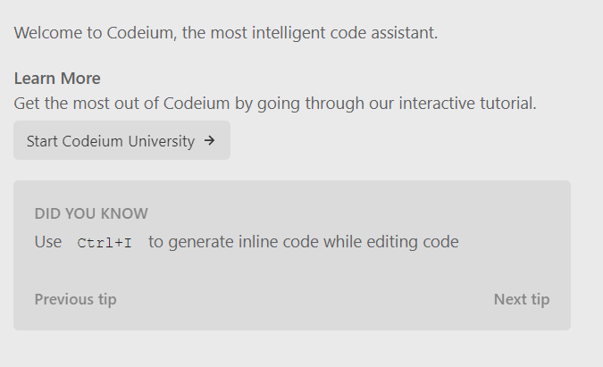
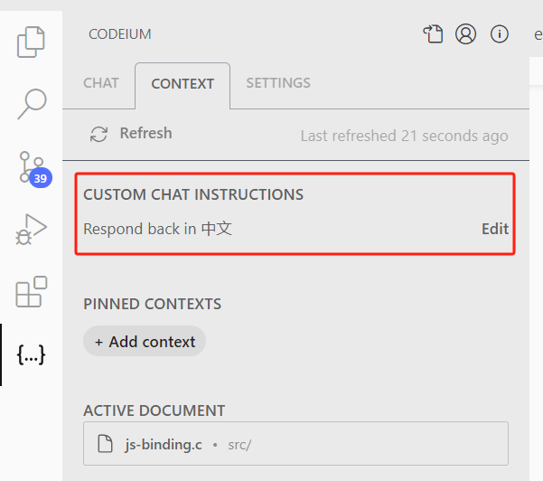

--

我当前使用AI的主要工作方法：

* 看代码时使用Fitten Code来解释代码
* 跟chatgpt 4o对话来编写单个文件的工具。

可以看到使用方式还是非常初级。

希望能够达到的效果：

* 全部在vscode里完成交互。
* 对于开启新的小型项目，直接在vscode里通过交互来创建编写大部分的代码。
* 对于已有的较大的项目，在vscode里对代码进行检查，看看有没有什么问题。优化代码的命名等。
* 我不想付费，所以还是以免费的Fitten Code为主。

# 结论

还是cursor最强大。


# 类似cursor的AI辅助编程方案

https://metaso.cn/search/8519643447029465088?q=%E7%B1%BB%E4%BC%BCcursor%E8%BF%99%E6%A0%B7%E7%9A%84AI%E8%BE%85%E5%8A%A9%E7%BC%96%E7%A8%8B

# codeium

这个声称是一直免费的。

有vscode插件，评分看起来还挺高的。



有教学引导。

快捷键：

```
tab
	接受补全。
ctrl +  ->
	接受当前单词。
alt + \
	触发补全。
alt + ]
	下一个补全。
alt + [
	上一个补全。
	
```

Codeium的核心功能之一是自动补全：

在您每次击键时，Codeium都会尝试完成您正在输入的内容。

通过查看当前文件、过去的编辑以及代码库中相关片段的上下文，

它会生成各种看似合理的建议作为“幽灵文本”。

这种方法最直接的用例之一是加速您的开发。

即使您确切地知道自己想写什么，Codeium也可以为您节省大量击键和时间，

尤其是在编写简单、重复或样板代码时。

在下面的示例中，我们对Pet类进行了一些添加。


把引导程序过了一遍。感觉不错。

有@ 机制。比Fitten code要好。

基础模型是llamma3.1的。

但是在改动代码时的diff合入并没有，这点比不上cursor。这个是产品力的体现。


会对本地代码建立索引。


## 回复中文

这里添加一下这个。




## 代码

vscode插件的代码没有看到。但是nvim的有。

https://github.com/Exafunction/codeium.nvim/