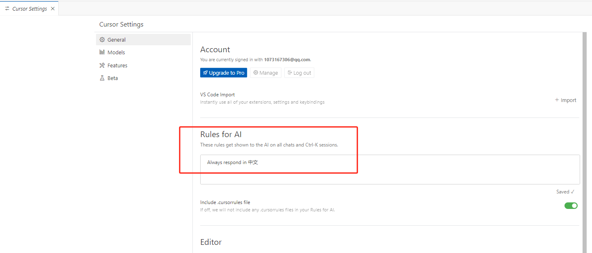
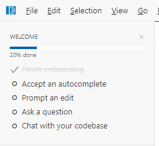
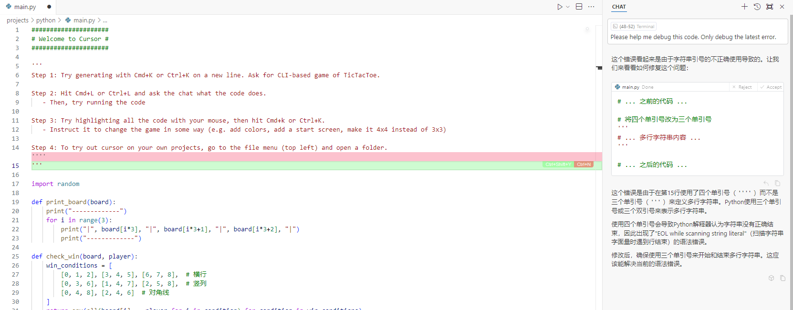
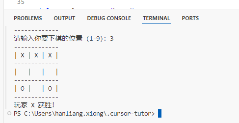
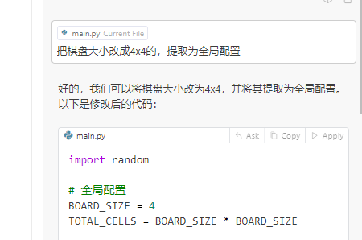

--

2023年的时候，用过一下cursor，不过那时候是把它当成chatgpt工具来使用的。

最近看这个工具又火起来了，B站上不少人都在介绍这个。

看起来这个产品经过这段时间的发展，有了很大的进步，生产力提升了很多。

所以值得研究一下。

# 安装时的设置

会提示你选择交互的语言，填入中文就好了。

如果你这一步没有填写，还可以在设置里进行设置，就是这里：



# 设置

## general

### account

免费账户有50条高级模型配额。

每个月200条gpt-4o-mini的配额。

### Rules for AI

可以在输入框里写。

也可以新建一个.cursorrules文件。

### Editor

编辑器设置。不管。

### 隐私模式

默认关闭。

## Models

配置各种模型的开关和API key。

## Feature

### Cursor tab

这个就是copilot。

默认打开的。

### composer

这个就是进行多文件编辑的。

使用ctrl+i来打开。

### codebase indexing

应该是对项目全局进行索引。

### docs

可以对指定的文档进行索引，以便使用对应的知识。

### chat

对话的一些设置。

### editor

### terminal

## beta

一些实验特性。不管。

# 初步使用

把welcome的内容做一下。



有4个部分：

* 自动完成。
* prompt一个编辑
* 问一个问题。
* 跟你的codebase对话。

我就打开main.py那个例子。

看到里面写了：

```
步骤1：
	按ctrl+k打开指令输入窗口，让cursor写一个cli-based game of Tic Tac Toe。就是井字棋游戏。
步骤2：
	按ctrl+l让cursor解释一下它生成的代码。
步骤3：
	选中代码，让cursor修改逻辑。例如从3x3改成4x4的棋盘，改颜色之类的。
步骤4：
	在你自己的项目里使用cursor，打开你的项目目录进行操作就好。
```

我按照步骤来做。

可以看到步骤1，它故意生了一个有错误的代码，你运行时报错了。

它正好给你演示debug with AI。



运行效果：



让修改棋盘大小。




上面这些消耗了8次高级配额。

# 关键点

就是@ 的方法来针对某个文档或者文件。

这个@ 的逻辑是重点。

# cursor可以直接创建文件并自动插入内容

这个我觉得已经太强大了。

