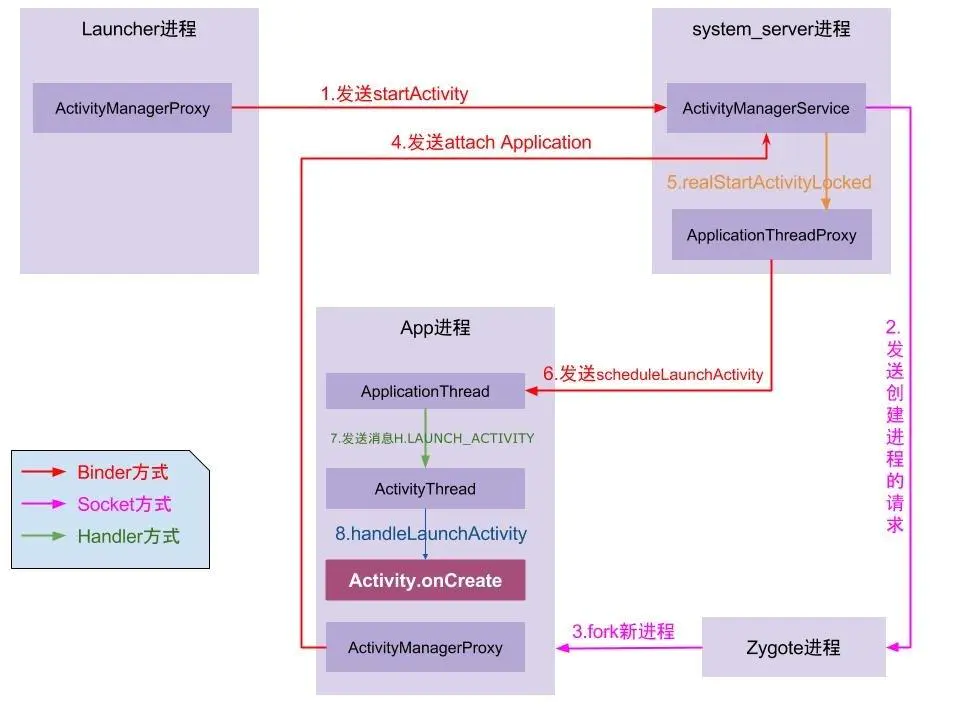
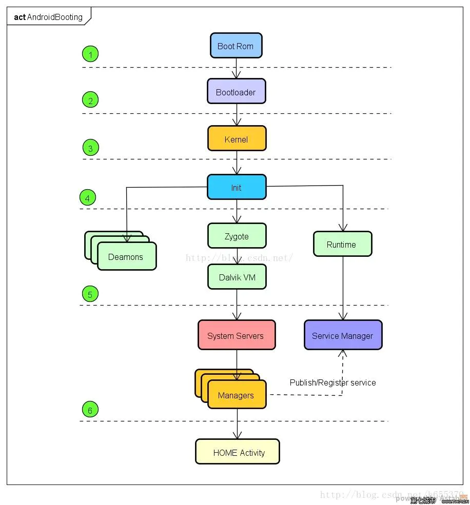

--

app的启动过程：

1、点击桌面的app图标，Launcher进程（就是桌面进程）采用binder这个ipc通道向system_server发起startActivity请求。

2、system_server进程收到请求后，向zygote进程发送创建进程的请求。

3、zygote用fork的方式，创建app进程。

4、app进程，通过binder ipc向system_server发起attachApplication的请求。

5、system_server进程收到请求后，进行一系列的准备工作后，再通过binder ipc向app进程发送scheduleLaunchActivity请求。

6、app进程的binder线程（就是ApplicationThread）在收到请求后，通过handler向主进程发送LAUNCH_ACTIVITY消息。

7、app进程的主线程收到LAUNCH_ACTIVITY消息后，创建主界面Activity。

8、app正式启动，进入Activity的生命周期。

参考资料

1、Android Framework原理

willin

https://www.jianshu.com/p/2f95ab717078