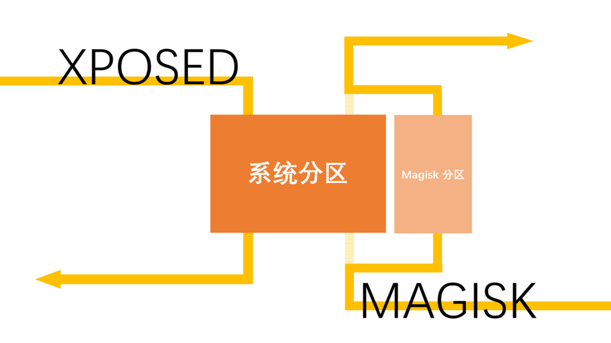

1

https://github.com/topjohnwu/Magisk

这个是一个kotlin写的app，代码量不大，只有不到700个文件。

在Android8.0以后，比较通用的root方法就是使用magisk工具进行破解。

破解的流程是：

1、解锁bootloader。或者通过特殊的方法绕过avb验证。

解锁后在启动过程如果出现镜像校验失败也会继续启动，因此就可以刷入非官方镜像。

2、从官方的update包里提取出boot.img。通过magisk工具对boot.img打补丁。

3、把boot.img刷入手机，就完成了root。后续可以在magisk里进行root权限管理。

我手里一台用magisk root过的LG G7，进入shell（shell在magisk保证授权了root权限）。查看mount。可以看到内容非常多。绝大部分都是magisk进行 的mount。很精准地对每个文件进行 了mount。


```
/dev/root on / type ext4 (ro,seclabel,relatime,block_validity,delalloc,barrier,user_xattr)
/dev/block/sde4 on /vendor/firmware_mnt type vfat (ro,context=u:object_r:firmware_file:s0,relatime,gid=1000,fmask=0337,dmask=0227,codepage=437,iocharset=iso8859-1,shortname=lower,errors=remount-ro)
/dev/block/sde8 on /vendor/dsp type ext4 (ro,seclabel,nosuid,nodev,relatime,data=ordered)
/dev/block/sda5 on /mnt/vendor/persist type ext4 (rw,seclabel,nosuid,nodev,noatime,data=ordered)
/dev/block/sda15 on /mnt/product/els type ext4 (rw,seclabel,nosuid,nodev,noatime,noauto_da_alloc,errors=continue,data=ordered)
/dev/block/sda3 on /mnt/vendor/sns type ext4 (rw,seclabel,nosuid,nodev,noatime,noauto_da_alloc,errors=continue,data=ordered)
/dev/block/sda2 on /mnt/vendor/persist-lg type ext4 (rw,seclabel,nosuid,nodev,noatime,noauto_da_alloc,errors=continue,data=ordered)
/dev/block/sda1 on /mnt/vendor/mpt type ext4 (rw,seclabel,nosuid,nodev,noatime,noauto_da_alloc,errors=continue,data=ordered)
/dev/block/sda13 on /mnt/product/srtc type ext4 (rw,seclabel,nosuid,nodev,noatime,noauto_da_alloc,errors=continue,data=ordered)
/dev/block/sda8 on /mnt/vendor/power type ext4 (rw,seclabel,nosuid,nodev,noatime,noauto_da_alloc,errors=continue,data=ordered)
/dev/block/sda12 on /mnt/product/fota type ext4 (rw,seclabel,nosuid,nodev,noatime,noauto_da_alloc,data=ordered)
/dev/block/sda16 on /mnt/product/quality type ext4 (rw,seclabel,nosuid,nodev,noatime,noauto_da_alloc,data=ordered)
/dev/block/sda17 on /mnt/vendor/eri type ext4 (rw,seclabel,nosuid,nodev,noatime,noauto_da_alloc,data=ordered)
tmpfs on /storage type tmpfs (rw,seclabel,nosuid,nodev,noexec,relatime,size=1852672k,nr_inodes=463168,mode=755,gid=1000)
adb on /dev/usb-ffs/adb type functionfs (rw,relatime)
/dev/block/sda23 on /data type ext4 (rw,seclabel,nosuid,nodev,noatime,noauto_da_alloc,resgid=1065,data=ordered)
```

查看/dev/block/by-name下面的分区结构。

```
ALIGN_TO_128K_1 -> /dev/block/sdd1                 
ALIGN_TO_128K_2 -> /dev/block/sdf1                 
abl_a -> /dev/block/sde7                           
abl_b -> /dev/block/sde28                          
akmu_a -> /dev/block/sde10                         
akmu_b -> /dev/block/sde31                         
aop_a -> /dev/block/sde1                           
aop_b -> /dev/block/sde22                          
apdp -> /dev/block/sde46                           
boot_a -> /dev/block/sde11                         
boot_b -> /dev/block/sde32                         
carrier -> /dev/block/sda18                        
cdt -> /dev/block/sdd2                             
cmnlib64_a -> /dev/block/sde13                     
cmnlib64_b -> /dev/block/sde34                     
cmnlib_a -> /dev/block/sde12                       
cmnlib_b -> /dev/block/sde33                       
ddr -> /dev/block/sdd3                             
devcfg_a -> /dev/block/sde14                       
devcfg_b -> /dev/block/sde35                       
devinfo -> /dev/block/sde44                        
dip -> /dev/block/sde45                            
drm -> /dev/block/sda2                             
dsp_a -> /dev/block/sde8                           
dsp_b -> /dev/block/sde29                          
dtbo_a -> /dev/block/sde18                         
dtbo_b -> /dev/block/sde39                         
eksst -> /dev/block/sda10                          
els -> /dev/block/sda15                            
encrypt -> /dev/block/sda9                         
eri -> /dev/block/sda17                            
fota -> /dev/block/sda12                           
frp -> /dev/block/sdg1                             
fsc -> /dev/block/sdf5                             
fsg -> /dev/block/sdf4                             
ftm -> /dev/block/sda7                             
grow -> /dev/block/sda24                           
hyp_a -> /dev/block/sde3                           
hyp_b -> /dev/block/sde24                          
keymaster_a -> /dev/block/sde9                     
keymaster_b -> /dev/block/sde30                    
laf_a -> /dev/block/sde16                          
laf_b -> /dev/block/sde37                          
limits -> /dev/block/sde49                         
logdump -> /dev/block/sde53                        
logfs -> /dev/block/sde51                          
mdtp_a -> /dev/block/sde6                          
mdtp_b -> /dev/block/sde27                         
mdtpsecapp_a -> /dev/block/sde5                    
mdtpsecapp_b -> /dev/block/sde26                   
misc -> /dev/block/sda6                            
modem_a -> /dev/block/sde4                         
modem_b -> /dev/block/sde25                        
modemst1 -> /dev/block/sdf2                        
modemst2 -> /dev/block/sdf3                        
mpt -> /dev/block/sda1                             
msadp -> /dev/block/sde47                          
operatorlogging -> /dev/block/sda16                
persist -> /dev/block/sda5                         
power -> /dev/block/sda8                           
pstore -> /dev/block/sda14                         
qupfw_a -> /dev/block/sde15                        
qupfw_b -> /dev/block/sde36                        
raw_resources_a -> /dev/block/sde20                
raw_resources_b -> /dev/block/sde41                
rct -> /dev/block/sda11                            
sec -> /dev/block/sde43                            
sid_a -> /dev/block/sde21                          
sid_b -> /dev/block/sde42                          
sns -> /dev/block/sda3                             
spunvm -> /dev/block/sde48                         
srtc -> /dev/block/sda13                           
ssd -> /dev/block/sda4                             
sti -> /dev/block/sde52                            
storsec_a -> /dev/block/sde19                      
storsec_b -> /dev/block/sde40                      
system_a -> /dev/block/sda21                       
system_b -> /dev/block/sda22                       
toolsfv -> /dev/block/sde50                        
tz_a -> /dev/block/sde2                            
tz_b -> /dev/block/sde23                           
userdata -> /dev/block/sda23                       
vbmeta_a -> /dev/block/sde17                       
vbmeta_b -> /dev/block/sde38                       
vendor_a -> /dev/block/sda19                       
vendor_b -> /dev/block/sda20                       
xbl_a -> /dev/block/sdb1                           
xbl_b -> /dev/block/sdc1                           
xbl_config_a -> /dev/block/sdb2                    
xbl_config_b -> /dev/block/sdc2                    
```

查看cmdline

```
judyln:/dev/block/by-name # cat /proc/cmdline
rcupdate.rcu_expedited=1 video=vfb:640x400,bpp=32,memsize=3072000 msm_rtb.filter=0x237 ehci-hcd.park=3 lpm_levels.sleep_disabled=1 service_locator.enable=1 swiotlb=2048 androidboot.configfs=true firmware_class.path=/vendor/firmware_mnt/image loop.max_part=7 androidboot.usbcontroller=a600000.dwc3 ignore_loglevel androidboot.hardware=judyln buildvariant=user kswitch androidboot.dlcomplete=0 androidboot.product.lge.bootreasoncode=0x0 lge.bootreason=NORMAL_MODE androidboot.vendor.lge.hw.revision=rev_10 androidboot.vendor.lge.hw.subrev=subrev_2 androidboot.vendor.lge.hw.cable=NO_INIT androidboot.vendor.lge.plmn=VZW_POSTPAID androidboot.product.lge.ddr_size=4262068224 androidboot.vendor.lge.ddr_info=0x11000506 lge.crash_handler=off androidboot.product.lge.hiddenreset=0 androidboot.product.lge.device_color=BK androidboot.revision=12 androidboot.vendor.lge.fingerprint_sensor=1 androidboot.vendor.lge.gyro=1 androidboot.vendor.lge.nfc.vendor=nxp androidboot.vendor.lge.dtv=0 androidboot.vendor.lge.fmradio=1 androidboot.vendor.lge.wmc=2 androidboot.vendor.lge.capsensor=1 androidboot.vendor.lge.hydra=Prime androidboot.vendor.lge.ant_rev=NA_CDMA androidboot.vendor.lge.ant_match=TRUE androidboot.vendor.lge.model.name=LM-G710VM androidboot.vendor.lge.id=0 wled_strings=0,1,2,3 androidboot.verifiedbootstate=orange androidboot.keymaster=1 dm="1 vroot none ro 1,0 8256088 verity 1 PARTUUID=77942275-b238-ef63-9a3e-e95c5c8e6e2d PARTUUID=77942275-b238-ef63-9a3e-e95c5c8e6e2d 4096 4096 1032011 1032011 sha1 1a1982c0bcf36307d443c02ffd0c0d318c843ac8 bb750e831ee3d1c9449060522137c0985efba8b44ace631957f68db49c98195e 10 restart_on_corruption ignore_zero_blocks use_fec_from_device PARTUUID=77942275-b238-ef63-9a3e-e95c5c8e6e2d fec_roots 2 fec_blocks 1040138 fec_start 1040138" root=/dev/dm-0 androidboot.vbmeta.device=PARTUUID=c07f1c2f-442e-449f-64d5-55a1c94f71a1 androidboot.vbmeta.avb_version=1.0 androidboot.vbmeta.device_state=unlocked androidboot.vbmeta.hash_alg=sha256 androidboot.vbmeta.size=3264 androidboot.vbmeta.digest=7a7ecee53ff574b7ae31a3f41cd330454dba23ada9265091af625f7f07e81ea3 androidboot.vbmeta.invalidate_on_error=yes androidboot.veritymode=enforcing androidboot.bootdevice=1d84000.ufshc androidboot.serialno=LMG710VMfd7de137 androidboot.baseband=msm msm_drm.dsi_display0=dsi_sw49410_rev1_dsc_1440_3120_cmd_display: androidboot.slot_suffix=_a skip_initramfs rootwait ro init=/init  androidboot.dtbo_idx=1
```


sda有24个分区。

sdb有2个分区。

sdc有2个分区。

sdd有3个分区。

sde有53个分区。

sdf有5个分区。

sdg有1个分区。


在一些用户眼里，Magisk 与另一款名为 Xposed 的神器有着高度的相似性，部分群体当中甚至还存在着「Magisk 框架」这样的说法。

的确，二者的工作机制都是「拦截」。Xposed **通过劫持 Android 系统的 zygote 进程来加载自定义功能**，这就像是半路截杀，在应用运行之前就已经将我们需要的自定义内容强加在了系统进程当中。

Magisk 则另辟蹊径，通过挂载一个与系统文件相隔离的文件系统来加载自定义内容，为系统分区打开了一个通往平行世界的入口，**所有改动在那个世界（Magisk 分区）里发生**，在必要的时候却又可以被认为是（从系统分区的角度而言）没有发生过。



Magisk 的实现方式就像是一种魔法，当被挂载的 Magisk 分区被隐藏甚至被取消挂载时，原有系统分区的完整性丝毫未损，玩需要 root 验证的游戏、运行对设备认证状态有要求的应用甚至进行需要验证系统完整性的 OTA 更新**都没有任何问题**。


因此严格来说 Magisk 可以被看作是一种文件系统，这种文件系统通过巧妙的实现方式避开了对系统文件的直接修改，从稳定性上来看要优于以往任何一种系统框架，这也是当前它在玩机社区广受认可和好评的原因所在。


很多人对 Magisk 的初步认识可能是 root ——在 [SuperSU](https://sspai.com/post/27521) 销声匿迹之后，它自然而然就成为了当前 Android 社区用来获取 root 权限的主流方式。

不过 Magisk 特殊的运作机制还赋予了它相较于 Android 平台其他定制工具而言独一无二的特质——**systemless**。这种 systemless 特质让 Magisk 拥有了获取 root 权限之外的诸多优势：

**一方面，得益于独特的挂载机制，使用 Magisk 时我们可以有针对性地隐藏 root，甚至暂时隐藏 Magisk 本身**。

**另一方面，挂载系统的存在，也让 Magisk 拥有了多样的模块化生态系统。**

既然用了「开外挂」的实现方式，那不妨就多挂载一些额外的东西，字体、音效、驱动……甚至 Xposed 本身。Magisk 提供了一个独立于系统分区以外的、可以随时隐形的「沙盒」，那自然不能将其才华禁锢于 root 这一件事上。在 Magisk 的模块仓库里，我们可以找到各式各样的模块（modules）来满足自己的定制化需求，借助这些模块，我们在 root 之后能做的事情其实也还有很多。


参考资料

1、Magisk root 原理分析之一 ：Magisk Andorid Root 流程

https://blog.csdn.net/pen_cil/article/details/102872285

2、每个 Android 玩家都不可错过的神器（一）：Magisk 初识与安装

https://sspai.com/post/53043