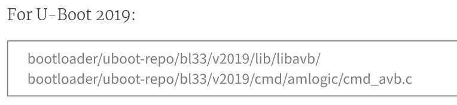
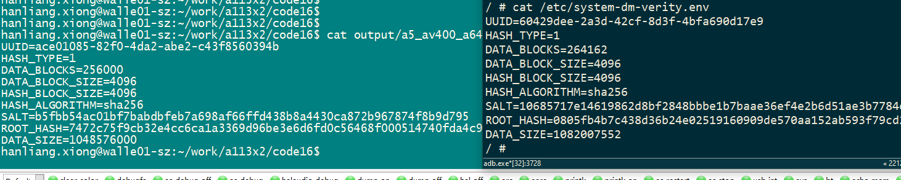
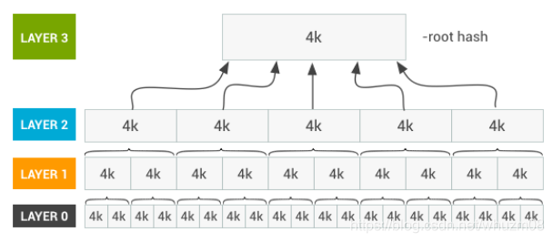
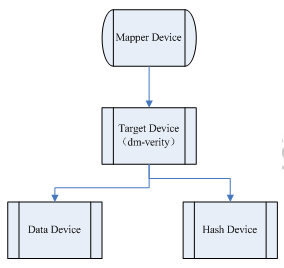

这个就是跟解锁相关的一个概念了。

如果被解锁过，开机会提示设备已经被unlock，不可以被trust。

目的是为了保护系统的安全性。

实现的方式：

在设备启动过程中，无论在哪一个阶段，都会在进入到下一个阶段之前先验证下一阶段的完整性和真实性。


现在需要在Linux系统上也做这个功能。看看怎么实现的。

看我们的uboot代码。

配置项只有这个看起来有点关系。

```
#define CONFIG_LIBAVB		1
```

在defconfig里，还有这个配置项。

```
CONFIG_CMD_BOOTCTOL_AVB=n
```

相关的代码有：

```
./cmd/bootm.c:254:#ifdef CONFIG_CMD_BOOTCTOL_AVB
./cmd/bootm.c:369:#endif//CONFIG_CMD_BOOTCTOL_AVB
./cmd/amlogic/Makefile:38:ifdef CONFIG_CMD_BOOTCTOL_AVB
./cmd/amlogic/Makefile:50:obj-$(CONFIG_CMD_BOOTCTOL_AVB) += cmd_avb.o
./cmd/amlogic/cmd_bootctl_utils.c:64:#if defined(CONFIG_CMD_BOOTCTOL_AVB) && defined(CONFIG_CMD_BOOTCTOL_VAB)
./cmd/amlogic/cmd_bootctl_utils.c:69:#if defined(CONFIG_CMD_BOOTCTOL_AVB)
```


```
obj-$(CONFIG_LIBAVB) += libavb/
```

这个目录下文件不少。

```
#include "avb_chain_partition_descriptor.h"
#include "avb_crypto.h"
#include "avb_descriptor.h"
#include "avb_footer.h"
#include "avb_hash_descriptor.h"
#include "avb_hashtree_descriptor.h"
#include "avb_kernel_cmdline_descriptor.h"
#include "avb_ops.h"
#include "avb_property_descriptor.h"
#include "avb_slot_verify.h"
#include "avb_sysdeps.h"
#include "avb_util.h"
#include "avb_vbmeta_image.h"
#include "avb_version.h"
```

接口非常清晰。所以看起来还比较好懂。


相关的命令

```
get_avb_mode
```


```
a5_av400# mmc part

Partition Map for MMC device 1  --   Partition Type: AML

Part   Start     Sect x Size Type  name
 00 0 8192    512 U-Boot bootloader
 01 73728 131072    512 U-Boot reserved
 02 221184 0    512 U-Boot cache
 03 237568 16384    512 U-Boot env
 04 270336 65536    512 U-Boot recovery
 05 352256 16384    512 U-Boot misc
 06 385024 131072    512 U-Boot boot
 07 532480 2097152    512 U-Boot system
 08 2646016 4988928    512 U-Boot data
** Partition 9 not found on device 1 **
```

启动打印

```
[imgread]read from part: boot
avb2: 0
```

对应的代码

```
	char *avb_s;
	avb_s = env_get("avb2");
	printf("avb2: %s\n", avb_s);
```

但是这里也仅仅是打印了一下，根本没有使用。是0是1都一样的结果。

```
   Uncompressing Kernel Image ... OK
   Loading Ramdisk to 3fd5c000, end 3ffffdf4 ... OK
```


VBMeta结构体

AVB中使用的核心数据结构是`VBMeta`结构体。

此数据结构包含许多描述符（和其他元数据），

并且所有这些数据都以加密方式签名。

描述符用于映像哈希值，映像哈希树元数据和所谓的链接分区。 

下面是一个简单的例子：


其中**`vbmeta`分区在哈希描述符中保存引导分区的哈希值**。

对于`system`和`vender`分区，

哈希树紧随在各自的分区文件系统数据之后，

而vbmeta分区只保存哈希树描述符中哈希树的根哈希(root hash)，盐(salt)和偏移量(offset)。

因为`vbmeta`分区中的`VBMeta`结构体是加密签名的，

所以引导加载程序可以检查签名并验证它是否由`key0`的所有者制作

（例如通过已嵌入的key0公钥），

从而信任分区中储存的`boot`， `system`，`vendor`分区的哈希值。


AVB还包括回滚保护，用于防范已知的安全漏洞。

每个`VBMeta`结构体都有一个回滚索引(*rollback index*)，如下所示：


AVB被设计成可以与A/B分区同时启用，它要求存储在描述符中的任何分区名称中都不使用A/B后缀。


# 工具和库

本节主要内容为AVB中的工具和库的相关信息。

## avbtool和libavb

`avbtool`主要用来生成`vbmeta.img`，

它是验证启动的顶级对象。

这个映像将被烧录到`vbmeta`分区（如果使用A/B分区，则为`vbmeta_a`或`vbmeta_b`）而且被设计的尽可能的小（用于带外更新*out-of-band update*）。

`vbmeta`映像使用密钥签名，

映像中包含用于验证`boot.img`，`system.img`和其他分区映像的验证数据（例如加密摘要）。

`vbmeta`映像还可以包含对存储验证数据的其他分区的引用，

以及指定验证数据使用的公钥。

这种间接方式可以将验证权进行委托，

它允许第三方通过在`vbmeta.img`中包含它们的公钥来控制给定分区上的内容。

这样只需通过更新vbmeta.img中的分区描述符，就可以轻松改变或撤销验证权限而不用修改其它分区。

将签名的验证数据存储在其他映像上(例如`boot.img`和`system.img`)也是使用`avbtool`完成的。

除了`avbtoo`l之外，还提供了一个库——`libavb`。

该库在设备端执行所有验证，例如它首先加载`vbmeta`分区，检查签名，然后继续加载启动分区以进行验证。

此库旨在用于引导加载程序和Android内部。

它有一个简单的系统依赖抽象（参见`avb_sysdeps.h`）以及引导加载程序或操作系统应该实现的操作（参见`avb_ops.h`）。

验证的主要入口点是`avb_slot_verify()`。

Adroid Things（译者注：一套谷歌推出的面向物联网平台的操作系统）对`vbmeta`公钥有特定的要求和验证逻辑。`libavb_atx`中提供了一个扩展，该扩展是`libavb`公钥验证操作的实现。（请参阅`avb_ops.h`中的`avb_validate_vbmeta_public_key()`）。


### 版本控制和兼容性

AVB使用具有三个字段的版本号——主要版本，次要版本和子版本。 这是一个示例版本号：

```null
                     1.4.3
                     ^ ^ ^
                     | | |
the major version ---+ | |
the minor version -----+ |
  the sub version -------+
```


本节讨论将`libavb`与设备引导加载程序集成的建议和最佳实践。重要的是要强调这些只是建议，因此用词必须谨慎。

此外，本章还使用术语HLOS来指代高级操作系统（*High Level Operating System*）。这显然包括Android（包括但不限于手机形式），但也可能是其他操作系统。

# amlogic实现

bootloader读取vbmeta分区，验证它的签名。

读取boot分区，计算boot分区的hash值，并跟vbmeta里存放的boot分区的hash值进行对比。

如果匹配，则boot分区是合法的。

vbmeta里有一个公钥。

其余的分区也要一一进行验证。

如果验证都ok，那么启动kernel。

在amlogic的设计里，avb2被作为一个可信链的容器。

底层实现跟标准的android avb2略有区别。

amlogic选择使用标准的dm-verity suite。

信任链从rom到bootloader。


启动过程

1、bl33读取和验证vbmeta分区，使用bl33_kpub，这个kpub是在FIP header里的。

2、bl33读取boot分区，计算hash，并跟vbmeta里存放的boot分区的hash值进行对比。

3、bl33继续验证vendor和system分区的签名。

4、bl33启动kernel。


Android Secure Boot实现主要有两个版本，一个是Verified Boot 1.0，另一个是Verified Boot 2.0，也称为AVB。


Secure Boot 顾名思义就是安全启动，确保设备启动之后所加载执行的代码都是可信的。

其中涉及的主要概念有两个：信任链和信任根。

前者保障执行流程的可靠交接，后者则保障初始信任代码的可信。


在介绍信任链的时候我们说到，

每次加载新的代码或数据之前都需要对其进行验证。

对于比较小的分区，如boot或者dtbo，

可以直接加载到内存并计算他们的hash，

然后将其与预置的hash进行比对。

预置的hash通常存放在对应分区文件的头部或者尾部，

或者存放在独立的分区中。

不论他们的位置在哪，都是会使用信任根进行直接或间接签名的。


但是对于较大的分区，

比如system分区，

实际上包含了整个文件系统，

是无法全部读取到内存里的。

这时就需要其他的方法，

**在Android中使用的是hash tree。**

当数据加载到内存时，**系统就会计算该hash tree的root hash，**

并与预置的root hash进行比对验证。


在介绍`dm-verity`之前有必要先了解其中的`dm`，

即`Device Mapper`的作用。

Device Mapper是Linux内核中提供的一个映射框架，

可以方便用户程序**通过ioctl自行创建和管理设备之间的映射。**

其中涉及到3个核心元素：

- Mapped Device
- Target Driver
- Target Device

基于Device Mapper框架实现的应用有逻辑卷管理器LVM、软件阵列RAID以及Docker(COW)等。

当然，我们所讨论的`dm-verity`也是其中一个。


`dm-verity`的代码在内核中为`drivers/md/dm-verity.c`(以Linux4.4为例，在upstream中进行了重构)，

主要作用是用来验证文件系统中data block的完整性


**dm-verity将系统镜像切分为4k的块(block)大小，**

**并对每一个块计算hash，**

这些hash以树状结构组合，称为hash tree，即哈希树。

哈希树中的每个结点都是一个哈希，

对于叶子结点值是对应块的hash，

对于中间结点其值是所有子结点的hash。

因此中间结点所包含的子节点(hash)容量也是一个块，和所采用的hash算法以及对应块大小有关。

一个含有32768个块，块大小为4096字节且采用sha246 hash算法的哈希树结构示例如下：

在AOSP构建环境中，生成hash tree的工具为`build_verity_tree`，代码在`system/extras/verity/build_verity_tree.cpp`。


[AVB](https://source.android.com/security/verifiedboot/avb)是安卓8.0之后对于Verified Boot的一个参考实现，

也称为Verified Boot2.0。

在AVB中一个重要的数据结构就是VBMeta，

其中包括了一系列描述符和元信息，

并且其中所有的信息都是签名的。

描述符包括hash描述符(boot.img、dtbo.img等小镜像)以及hashtree描述符(system.img、vendor.img等大镜像)。

除了签名，VBMeta中还包含版本信息以及Rollback Index，从设计上就考虑了降级攻击的威胁。


```
CONFIG_AVB2_KPUB_EMBEDDED
CONFIG_AVB2_KPUB_VENDOR
CONFIG_AVB2_KPUB_FROM_FIP
CONFIG_AVB2_RECOVERY
	配置是否对recovery分区进行avb验证。
```

当前cmd_avb.c里，avb命令只有一个子命令，就是avb verify。

```
AvbSlotVerifyData
这个结构体重要。

```


**AVB在系统启动的哪些阶段工作？**

> AVB一般在bootloader阶段和INIT的第一阶段工作。

**AVB在这两个阶段做了哪些事情？**

> AVB主要在Bootloader中校验vbmeta/vbmeta_system/boot/vendor_boot等分区，在init的第一阶段校验vbmeta/system/vendor等分区。

AVB工作原理大概是怎样的？

在bootloader或者UEFI中对vbmeta分区做校验，

通过vbmeta中的descriptor描述符信息，

去校验boot/vendor_boot等分区，

同时获取系统中的device_status(locked or unlocked 即上锁或者未上锁)、boot_status(启动状态)、vbmeta中的加密的digest/加密算法/vbmeta大小等信息，append到kernel cmdline中；

然后启动kernel,

kernel加载ramdisk运行init进程，

进入init第一阶段，

进行system/vendor分区的安全校验，

会利用kernel cmdline中的值，

跳过boot分区的校验；

同时，因为system/vendor分区比较大，

对大分区会执行hashtree的数据处理，

将root digest等信息通过ioctl存到kernel中，

后面访问数据时文件系统会执行dm-verity校验，执行运行时动态安全校验。


AVB对分区的处理是怎样的？

知道了其工作原理后，

那google是如何设计框架的，

对系统分区做了哪些设计呢？

首先，google想到了这样的设计：

通过增加一个独立的分区，这个分区包括了其他分区的重要校验信息；

只要保证这个vbmeta的足够安全，那么vbmeta中包含的其他分区的信息也就足够安全。

其次，这些安全的信息总不能用明文吧，所以得加密。

用什么加密方式比较合适呢？

google采用了RSA非对称加密，

对镜像数据做RSA签名，

将来在启动加载镜像分区时做公钥验证签名。

一级级的保证各个分区的安全性。


好了，有了这些基本内容后，

我们接下就介绍vbmeta的设计细节，以及它的设计用意。


一、vbmeta镜像内容说明：

在整个AVB验证的过程中，需要借助于vbmeta分区，

需要增加vbmeta分区和vbmeta.img镜像。

**vbmeta.img镜像，编译出来的大小为4KB**


vbmeta.img需要配置物理分区大小为64KB，

这个是google推荐的，

实际上数据只有4KB左右。


因为vbmeta.img里面要保存boot/dtbo/system/vendor等分区的校验信息，

所以编译时会依赖于这些镜像的编译。

BOARD_AVB_KEY_PATH可自定义，

如果没有定义则使用avb默认的test测试密钥。

uboot下面avb相关的命令：

```
avb verify - run verification process using hash data from vbmeta structure
avb read_rb <num> - read rollback index at location <num>
avb write_rb <num> <rb> - write rollback index <rb> to <num>
avb is_unlocked - returns unlock status of the device
avb get_uuid <partname> - read and print uuid of partition <partname>
avb read_part <partname> <offset> <num> <addr> - read <num> bytes from
partition <partname> to buffer <addr>
avb write_part <partname> <offset> <num> <addr> - write <num> bytes to
<partname> by <offset> using data from <addr>
```

需要的配置项

```
CONFIG_LIBAVB=y
CONFIG_AVB_VERIFY=y
CONFIG_CMD_AVB=y
```

U-Boot 能够使用`bootm` 命令从 Android 启动映像启动 Android 操作系统。为了使用 Android Boot Image 格式支持，应该启用下一个选项：

```
CONFIG_ANDROID_BOOT_IMAGE=y
```

然后可以使用下一个`bootm`命令调用来运行 Android：

```
=> bootm $loadaddr $loadaddr $fdtaddr
```


bootloader里有2个公钥。

custom key：在board/amlogic/$(BOARD)/avb2_kpub.c，这个默认没有。

default key: 在lib/libavb/testkey.c

```
一个520字节的数组。
char avb2_kpub_default[520] 
```

validate_vbmeta_public_key 这个函数会用到这个数组。

CONFIG_AVB2_KPUB_FROM_FIP 这个配置会使能吗？

是使能的

```
./arch/arm/include/asm/arch-a5/cpu.h:80:#define CONFIG_AVB2_KPUB_FROM_FIP 1
```

avb2_kpub.c

这个文件如果需要，可以通过命令来生成。

avbtool这个工具。

公钥放在bootloader的FIP里。FIP的作用是啥？

先看看这个脚本。

bootloader\uboot-repo\fip\a5\build.sh


```
	if [ ! $CONFIG_AVB2 ]; then
		CONFIG_AVB2=null
	fi
```

启动命令里的这个：

```
"get_avb_mode;"\
```

命令来自于./cmd/amlogic/cmd_bootctl.c

```
ifdef CONFIG_CMD_BOOTCTOL_AVB
ifdef CONFIG_CMD_BOOTCTOL_VAB
obj-y += cmd_bootctl_vab.o
else
obj-y += cmd_bootctl_avb.o
endif
else
obj-y += cmd_bootctl.o
endif
```

avb和vab区别是什么？

vab是ab分区的情况。vab是avb的一种特殊情况。

```
ifdef CONFIG_CMD_BOOTCTOL_AVB
ifdef CONFIG_CMD_BOOTCTOL_VAB
obj-y += cmd_bootctl_vab.o
else
obj-y += cmd_bootctl_avb.o
endif
else
obj-y += cmd_bootctl.o
endif
endif
```


CONFIG_UNIFY_BOOTLOADER 这个宏的作用是什么？

当前默认是没有定义的。

是amlogic自己增加的定义。

如果定义了，那么这4个文件都会编译。

```
ifdef CONFIG_UNIFY_BOOTLOADER
obj-y += cmd_bootctl_vab.o
obj-y += cmd_bootctl_avb.o
obj-y += cmd_bootctl.o
obj-y += cmd_bootctl_wrapper.o
else
```

CONFIG_BOOTLOADER_CONTROL_BLOCK

这个没有定义。就是bcb。

avbtool可以在rdk、yocto、android代码中找到。

rdk和tdk是什么关系？

什么是rdk？

这里有说明。但是看起来是一套构建系统，跟buildroot一个层级的。

https://confluence.amlogic.com/pages/viewpage.action?pageId=173801916&preview=%2F173801916%2F221689141%2FRDK+%E4%BB%8B%E7%BB%8D.pdf

更yocto更像，都是基于bitbake的。

不是像，是基于yocto。

所以rdk没有必要看了。

就看yocto里怎么集成avbtool的。


测试方法

```
Program your aml_upgrade_package.img and *vbmeta.img*
During boot, you should be able to see that 

avb_slot_verify.c:524: DEBUG: Loading vbmeta struct from partition 'vbmeta'.
Verified using testkey
avb_slot_verify.c:286: DEBUG: boot: Loading entire partition.
avb_slot_verify.c:286: DEBUG: recovery: Loading entire partition.
avb_slot_verify.c:286: DEBUG: dtb: Loading entire partition.
```

```
In uboot,
# avb verify

It will verify the partition integrity
```

要使能avb的，mk脚本要传递这样的参数。

```
./mk sc2_ah212 --avb2 --vab
./mk sc2_ah212 --avb2
对于linux系统，不需要--vab选项。这个是给android R用的。
```

```
ifeq ($(BUILD_WITH_AVB),true)

PRODUCT_PACKAGES += \

        bootctrl.amlogic \

        libavb_user

endif
```

参考这个：

https://jira.amlogic.com/browse/SWPL-54533

kernel里需要增加一个分区

```
		vbmeta:vbmeta
		{
			pname = "vbmeta";
			size = <0x0 0x200000>;
			mask = <1>;
		};
```

镜像conf文件也需要增加

```
file="vbmeta.img"           main_type="PARTITION"      sub_type="vbmeta"
```

https://scgit.amlogic.com/#/q/topic:YOCTO-AVB

yocto的几个提交在这里。

vbmeta.img is created by recipe vbmeta-img.bb, 

use the avb tool released by google. 

We need create a new partition /dev/vbmeta(or /dev/vbmeta_a, /dev/vbmeta_b) to burn this image file,

 it is an ordinary binary file, contains no file system. 

During system booting up, bootloader will hash value from the partition and check against the corresponding binary(boot.img and dovi_fw).

在boot.img的最后加上hash的方法。

```
avbtool add_hash_footer --image ${DEPLOY_DIR_IMAGE}/boot.img --partition_size 67108864 --partition_name boot
```

`"--partition_size"` is got from the partition table(partition_normal_linux.dtsi),

创建最终的vbmeta.img文件

```
avbtool make_vbmeta_image --output ${DEPLOY_DIR_IMAGE}/vbmeta.img --key ${WORKDIR}/testkey_rsa2048.pem --prop dovi_hash:3cd93647bdd864b4ae1712d57a7de3153e3ee4a4dfcfae5af8b1b7d999b93c5a --algorithm SHA256_RSA2048 --include_descriptors_from_image ${DEPLOY_DIR_IMAGE}/boot.img --padding_size 4096 --rollback_index 0
```

查看img的信息。

```
avb-tool/avb/avbtool info_image --image vbmeta.img
```


```
#define CONFIG_FIP_IMG_SUPPORT  1
```

FIP全称

Firmware Image Package

- 通常BL1被烧录在ROM中，BL2/BL31/BL32/BL33/uboot被打包成fip.bin烧录在flash中；启动时通过检索UUID找到fip.bin中的各个image，参考`firmware_image_package.h`
- 通过函数plat_get_image_source()读取数FIP数据
- `tools/fiptool/fiptool`可以生成和分解fip文件


```
  HOSTLD  tools/gen_ethaddr_crc
  HOSTLD  tools/mkenvimage
  HOSTLD  tools/fdtgrep
  HOSTLD  tools/dumpimage
  HOSTLD  tools/mkimage
```


```
DDRFW_TYPE: lpddr4 CHIPSET_NAME: a113x2 CHIPSET_VARIANT: general AMLOGIC_KEY_TYPE: dev-keys
```


打开avb相关的配置

```
multiple definition of `_u_boot_list_2_cmd_2_avb'
```

这个是拼接出来的

```
./include/linker_lists.h:30:            ((_type *)&_u_boot_list_2_##_list##_2_##_name)
```

```
cmd_bootctl_avb.o
cmd_avb.o
这2个文件有没有重叠？

```

CONFIG_CMD_BOOTCTOL_AVB

这个是不是必选的？

感觉是./cmd/avb.c和./cmd/amlogic/cmd_avb.c重叠了

是的，cmd/avb.c支持的子命令更多。

应该用哪个呢？

```
obj-$(CONFIG_CMD_AVB) += avb.o
obj-$(CONFIG_CMD_BOOTCTOL_AVB) += cmd_avb.o
```

所以这2个不能同时选中。

那应该用哪个呢？

```
代码实现：

在uboot/bl33/common/下有三个文件，cmd_bootctl_avb.c  cmd_bootctlvab.c cmd_bootctl.c 去生成cmd_bootctl_xxx.o

对应的定义:

CONFIG_CMD_BOOTCTOL_AVB   ----   cmd_bootctl_avb.c

CONFIG_CMD_BOOTCTOL_VAB ---- cmd_bootctl_vab.c

如果这两个都没定义，则认为是cmd_bootctl.c

定义的主要区别在于misc 分区里的结构体

对于旧版的cmd_bootctl.c，想要实现AB 系统的切换，只需要在bootloader_massage 里的slot 值改变一下

对于cmd_bootctlvab.c，则需要取出misc分区中的bootloader_messagge_ab的值，对里面的slota,slotb的启动优先级进行改变

对于cmd_bootctlavb.c,只需要偏移固定位置，读取目标结构体的值，再改变slota,slotb的启动优先级即可．
```

CONFIG_CMD_BOOTCTOL_AVB 这个应该不是必选。

我先不用。

但是从有的文档上看到：




uboot使能这3个配置

```
CONFIG_CMD_BOOTCTOL_AVB=y
CONFIG_LIBAVB=y
CONFIG_AVB_VERIFY=y
```

选中是bootm里直接调用的avb_verify函数。


mk脚本加上--avb2的参数。

先把uboot镜像做出来。

烧录进来。

选中boot.img和system.img都没有使用avbtool进行处理。

按道理应该是校验不通过。

运行打印了这个

```
active_slot in storeboot: normal
[imgread]read from part: boot
avb2: 1
active_slot is normal
ab_suffix is 
_find_partition_by_name()-200: do not find match in table vbmeta
_find_partition_by_name()-200: do not find match in table vbmeta
get partition info failed !!
_find_partition_by_name()-200: do not find match in table vbmeta
_find_partition_by_name()-200: do not find match in table vbmeta
error partition name!
Part 2 Failed to read 65536B from part[vbmeta] at 0
avb_slot_verify.c:736: ERROR: vbmeta: Error loading vbmeta data.
avb verification: locked = 1, result = 2
try upgrade as booting failure
PHY2=00000000fe03a000,phy-base=0xfe03c000
0x10 trim value=0x0000007f
crg cn
```

单独执行avb verify也是一样的。

```
a5_av400# avb verify
active_slot is normal
ab_suffix is 
_find_partition_by_name()-200: do not find match in table vbmeta
_find_partition_by_name()-200: do not find match in table vbmeta
get partition info failed !!
_find_partition_by_name()-200: do not find match in table vbmeta
_find_partition_by_name()-200: do not find match in table vbmeta
error partition name!
Part 2 Failed to read 65536B from part[vbmeta] at 0
avb_slot_verify.c:736: ERROR: vbmeta: Error loading vbmeta data.
result: 2
```


所以现在需要在kernel设备树里配置vbmeta分区。

分区里放入什么内容呢？

vbmeta.img is created by recipe vbmeta-img.bb

所以看看yocto的这部分做了什么。

生成vbmeta.img文件的命令如下：

```
# 需要先给boot.img生成末尾的hash部分。
# 这部分信息会被提取放到vbmeta.img里。
# 这里的--partition-size参数，跟dts里的boot分区的大小要一样。
avbtool add_hash_footer --image ${DEPLOY_DIR_IMAGE}/boot.img --partition_size 67108864 --partition_name boot
```

创建vbmeta.img的命令：

```
avbtool make_vbmeta_image --output ${DEPLOY_DIR_IMAGE}/vbmeta.img --key ${WORKDIR}/testkey_rsa2048.pem --prop dovi_hash:3cd93647bdd864b4ae1712d57a7de3153e3ee4a4dfcfae5af8b1b7d999b93c5a --algorithm SHA256_RSA2048 --include_descriptors_from_image ${DEPLOY_DIR_IMAGE}/boot.img --padding_size 4096 --rollback_index 0

```

```
./vendor/amlogic/avb/test/data/testkey_rsa2048.pem
	这个pem文件在这里。
```


在使能avb之后，在修改kernel代码后怎么更新boot.img进行调试？

需要同时同时更新boot.img和vbmeta.img。

这个jira做了不少的工作。可以看处理过程。

https://jira.amlogic.com/browse/SWPL-21937


https://scgit.amlogic.com/#/c/168077/2/recipes-core/initrdscripts/files/init-meson.sh

看这个怎么在initramfs的init里处理dm-verity的。

veritysetup 这个工具是编译出来的吗？在哪个仓库呢？

那就还需要libdevmapper


这个提交增加了生成vbmeta的命令。

https://scgit.amlogic.com/#/c/183399/9/recipes-core/images/vbmeta-image.bb

vbmeta给2M。

在哪里加生成镜像从处理了命令比较合适呢？

这个文件要模仿一下。

meta-meson/recipes-core/initrdscripts/files/init-meson.sh

meta-meson/recipes-devtools/avb/avb_2.0.bb

这个是从谷歌下载工具目录。

aml_upgrade_pkg_gen.sh

在这个脚本里进行vbmeta.img的生成比较合适。

这样先手动执行

```
./vendor/amlogic/avb/avbtool.py add_hash_footer --image output/a5_av400_a6432_release/images/boot.img --partition_size 67108864 --partition_name boot
```

是直接覆盖boot.img文件的。

生成vbmeta.img

```
./vendor/amlogic/avb/avbtool.py make_vbmeta_image \
--output output/a5_av400_a6432_release/images/vbmeta.img \
--key vendor/amlogic/avb/test/data/testkey_rsa2048.pem \
--algorithm SHA256_RSA2048 \
--include_descriptors_from_image output/a5_av400_a6432_release/images/boot.img \
--padding_size 4096 
```

先不改dm-verity的。

烧录镜像看看。

但是开机显示没有打开avb的功能。uboot里是：

```
system_mode in storeboot: 0
active_slot in storeboot: normal
[imgread]read from part: boot
avb2: 0
```

这是为什么？

我再单独烧录uboot的看看。

单独烧录uboot，还是提示没有vbmeta的分区。

那我就有一个疑问，既然emmc存储方式的uboot不需要在uboot里写分区信息。那么uboot是怎么知道kernel里配置的vbmeta分区的情况的呢？

应该是靠读取emmc里的头部扇区的分区信息的。

但是打印出来的信息是这样：

```
parts: 5
00:  recovery   0000000002000000 1
01:      misc   0000000000800000 1
02:      boot   0000000004000000 1
set has_boot_slot = 0
03:    system   0000000040000000 1
04:      data   ffffffffffffffff 4
eMMC/TSD partition table have been checked OK!
```

我把aml_upgrade_package.img解包开，看到的确没有vbmeta.img在里面。

但是我改了conf文件的啊。

make看看打包时的打印情况。

有vbmeta的。重新编译打包再烧录一次看看。

现在烧录至少识别了vbmeta分区了。

现在是报这个错误。

```
system_mode in storeboot: 0
active_slot in storeboot: normal
[imgread]read from part: boot
avb2: 1
active_slot is normal
ab_suffix is 
AVB2 verifying with fip key
invalid magic for rsapub
cannot find fipkey
AVB2 cannot find fip key
AVB2 verify with default kpub:520, vbmeta kpub:520
avb_slot_verify.c:445: ERROR: boot: Hash of data does not match digest in descriptor.
avb verification: locked = 1, result = 3
try upgrade as booting failure
```

看打印是说，验证fip key的时候出错。

fip key怎么来呢？可能这个出错没有很严重。

真正阻塞启动是后面的。

```
ERROR: boot: Hash of data does not match digest in descriptor.
```

可能是我改了dts文件，但是没有重新手动执行命令来生成带hash的boot镜像。

我改了还是不行。还是一样的错误。

那就把命令写到脚本里自动执行。

先还是打包也手动来进行吧。直接手动执行

```
make rootfs-squashfs
```

这个就可以确保只是进行打包操作。

boot.img用命令加签名后，大小变成了64M。（本来是12M的）

init脚本里那个的作用又是什么呢？

init脚本里就是进行dm-verity的mount。

编译阶段dm-verity需要做什么吗？

```
deploy_verity_hash() {
    install -D -m 0644 ${DEPLOY_DIR_IMAGE}/${DM_VERITY_IMAGE}.${DM_VERITY_IMAGE_TYPE}.verity.env \
                 ${IMAGE_ROOTFS}/${datadir}/dm-verity.env
}
```

这个env里放了什么东西？

看init脚本里

```
dm_verity_setup() {
    if [ -f /usr/share/dm-verity.env ]; then
	. /usr/share/dm-verity.env
	veritysetup --data-block-size=${DATA_BLOCK_SIZE} --hash-offset=${DATA_SIZE} \
	    create rootfs ${ROOT_DEVICE} ${ROOT_DEVICE} ${ROOT_HASH}
	if [ $? = 0 ]; then
	    mount -o ro /dev/mapper/rootfs ${ROOT_MOUNT}
	    DM_VERITY_STATUS="enabled"
	else
	    echo "dm-verity fails with return code $?"
	fi
    else
	echo "Cannot find root hash in initramfs"
    fi
}
```


当前kernel里有这个打印。

```
[    0.553063@3]  device-mapper: uevent: version 1.0.3
[    0.553469@1]  device-mapper: ioctl: 4.41.0-ioctl (2019-09-16) initialised: dm-devel@redhat.com
```


编译阶段是需要生成hash的。

这一步依赖的是什么工具呢？


avb和dm-verity可以相互独立使用吗？可以。

https://confluence.amlogic.com/pages/viewpage.action?pageId=197628794

- When dm-verity is enabled, the root hashes of system and vendor partition are stored inside ramdisk in kernel. If kernel is protected with some mechanism, the root hashes are also being protected, and thus guarantee the integrity of the firmware.

这段话的意思是，

当dm-verity使能的时候，system分区和vendor分区的root hash被存储到boot.img里的initramfs里。

只要boot.img是通过其他方式保证安全的，那么root hash也是安全的。


当avb和dm-verity同时使能的时候，

root hash是存放在vbmeta分区里

vbmeta和boot.img同时被avb机制保护。

```
DISTRO_FEATURES_append = " AVB READONLY dm-verity"
```


kernel默认配置了这些：

```
CONFIG_DM_CRYPT=y
CONFIG_DM_DEFAULT_KEY=y
CONFIG_DM_SNAPSHOT=y
CONFIG_DM_UEVENT=y
CONFIG_DM_VERITY=y
CONFIG_DM_VERITY_FEC=y
CONFIG_DM_BOW=y
```

To configure you need userspace components: **device mapper library** (part of LVM2 package) and **veritysetup**.

这个介绍了dm-verity的概念。

https://confluence.amlogic.com/display/SW/Instruction

这个介绍了怎么进行dm-verity的测试。

https://confluence.amlogic.com/display/SW/test+at+local


现在我先把命令加入到squashfs.mk脚本里。

在打包最终镜像之前，执行boot.img和vbmeta.img的修改。

多执行两次，看看对已经签名过的文件再次签名是否有影响。

没有关系。

然后加入对rootfs的hash计算处理。

关于hash offset的计算，这个算法比较好。

```
VERITY_HASH_OFFSET=$(align_up $(stat --format=%s $SRC_IMG) $BLOCK_SIZE)
```

这样的命令：

```
# cryptsetup 2.2.2 processing "veritysetup --debug --data-block-size=4096 --hash-offset=60342272 format rootfs.squashfs rootfs.squashfs"
# Running command format.
# Created hash image rootfs.squashfs.
# Allocating context for crypt device rootfs.squashfs.
# Trying to open and read device rootfs.squashfs with direct-io.
# Initialising device-mapper backend library.
# Formatting device rootfs.squashfs as type VERITY.
# Crypto backend (OpenSSL 1.1.1f  31 Mar 2020) initialized in cryptsetup library version 2.2.2.
# Detected kernel Linux 5.4.0-135-generic x86_64.
# Setting ciphertext data device to rootfs.squashfs.
# Trying to open and read device rootfs.squashfs with direct-io.
Header detected but device rootfs.squashfs is too small.
# Releasing crypt device rootfs.squashfs context.
# Releasing device-mapper backend.
Command failed with code -1 (wrong or missing parameters).
```

是blocksize不对？

改了再试一下。

关键应该是这句

```
Header detected but device rootfs.squashfs is too small.
```

这个是因为ext的文件系统镜像都是1G这样的大小，预留了空间的。

而squashfs则没有。

那么veritysetup能不能处理squashfs呢？

https://www.spinics.net/lists/dm-crypt/msg08439.html

上面链接提到了这样的命令：

```
veritysetup format rootfs.squashfs rootfs.hash
cat rootfs.squashfs rootfs.hash > srootfs.squashfs
ubiblock -c /dev/ubi0_2
ubiupdatevol /dev/ubi0_2 srootfs.squashfs
veritysetup --hash-offset=17719296 verify /dev/ubiblock0_2
/dev/ubiblock0_2 ROOT_HASH
veritysetup --hash-offset=17719296 create srootfs /dev/ubiblock0_2
/dev/ubiblock0_2 ROOT_HASH
mount -t squashfs -r /dev/mapper/srootfs /mnt
```

http://lists.busybox.net/pipermail/buildroot/2018-March/216359.html

这个patch实现了给squashfs进行verifysetup。

```
> +
> +config BR2_TARGET_ROOTFS_SQUASHFS_VERITY
> +	bool "Generate verity hashtable"
> +	help
> +	  As squashfs is readonly it is possible to generate a dm-verity
> +	  hashtable for use in verified boot systems.
>  endif
```

```
>  ROOTFS_SQUASHFS_DEPENDENCIES = host-squashfs
> +ifeq ($(BR2_TARGET_ROOTFS_SQUASHFS_VERITY),y)
> +ROOTFS_SQUASHFS_DEPENDENCIES += host-cryptsetup
> +endif
>  
>  ROOTFS_SQUASHFS_ARGS = -noappend -processors $(PARALLEL_JOBS)
>  
> @@ -24,4 +27,11 @@ define ROOTFS_SQUASHFS_CMD
>  	$(HOST_DIR)/bin/mksquashfs $(TARGET_DIR) $@ $(ROOTFS_SQUASHFS_ARGS)
>  endef
>  
> +ifeq ($(BR2_TARGET_ROOTFS_SQUASHFS_VERITY),y)
> +define ROOTFS_SQUASHFS_VERITY
> +	$(HOST_DIR)/sbin/veritysetup format $@ $@.verity > $@.verity.table
> +endef
> +ROOTFS_SQUASHFS_POST_GEN_HOOKS += ROOTFS_SQUASHFS_VERITY
> +endif
> +
>  $(eval $(rootfs))
```

关键是这个

```
veritysetup format $@ $@.verity > $@.verity.table
```

我把命令加进去，得到

```
VERITY header information for /mnt/fileroot/hanliang.xiong/work/a113x2/code16/output/a5_av400_a6432_release/images/rootfs.squashfs.verify
UUID:                   2390c4bf-bcbe-43fa-a08c-554cc540f244
Hash type:              1
Data blocks:            14732
Data block size:        4096
Hash block size:        4096
Hash algorithm:         sha256
Salt:                   4ab5247d28505e33303a0165f51f57067f0ce9df379b52cb10f1d4844ad602e4
Root hash:              ff8cb78fe9c86b84ca92a64bd2b7e726257ddfa6e17301126237fc5b50e7de3d
```

rootfs.squashfs.verify大小是400多K。

那得到的是这个verify文件怎么使用呢？


先看ext格式的怎么使用hash部分的内容的，它是把hash放在后面的部分上。

那就要看init.sh里的做法。

```
dm-verity.env 
	这个文件的内容，就是verifysetup
	这个是放在initramfs里。
	这个前后关系是怎样的？
	我感觉前后死循环依赖了。
	
```

在./recipes-core/images/core-image-minimal.bbappend这个里面进行了system-dm-verity.env的生成，看看逻辑是怎样的。


看看这个里面做了什么。

meta-meson\classes\aml-dm-verity-img.bbclass

```
inherit dm-verity-img
```

meta-security\classes\dm-verity-img.bbclass

这个没有处理squashfs的。只处理了ext、btrfs这些格式。

```
veritysetup --data-block-size=1024 --hash-offset=$SIZE format $OUTPUT $OUTPUT | tail -n +2 | process_verity
```

process_verity这个函数，是把生成的信息转成环境变量的格式。

所以我现在是要把这个信息也生成一个文件，并打包到boot.img里的ramdisk里。

我前面得到的rootfs.squashfs.verify怎么用？

还是取决于板端的dm-verity验证时怎么取数据吧。

veritysetup在板端是这么使用的

```
veritysetup --data-block-size=${DATA_BLOCK_SIZE} --hash-offset=${DATA_SIZE} \
            create ${1} ${2} ${2} ${ROOT_HASH}
```

--hash-offset=${DATA_SIZE} 这个是取那个400K的算出来的hash内容部分。

关键是看verifysetup create的参数有哪些。

这个手册。

https://man7.org/linux/man-pages/man8/veritysetup.8.html

create的新用法是open。

create的参数是

```
create <name> <data_device> <hash_device> <root_hash>
```

data设备是指要创建dm的设备名，例如/dev/system，

hash设备可以是同一个设备，例如/dev/system

root hash就是我们编译打印的一个字符串。

可以使用的选项有：

```
--hash-offset, 
--no-superblock,
--ignore-corruption or --restart-on-corruption,
--panic-on-corruption, 
--ignore-zero-blocks,
--check-at-most-once, 
--root-hash-signature,
--root-hash-file,
--use-tasklets
```

编译的时候，是verifysetup format。

运行的时候，是verifysetup create。

format的具体含义是：

```
format <data_device> <hash_device>
计算和存储hash数据
hash area可以在同一个设备上，如果指定了--hash-offset的话。
我们ext格式的当前就是指定在同一个设备上的。
但是squashfs的就不能。

data device和hash device可以是/dev/system这样的设备名。
也可以是rootfs.ext4这样的镜像名字。
```

我觉得对于squashfs，应该是需要一个单独的分区来存放了。

这个可以这样解决。

那么还有一个问题，root hash怎么存储呢？

让initramfs里嘛？

那么编译的先后顺序就需要调整。

还是先看一下yocto里怎么处理的。

meta-meson\recipes-core\images\core-image-minimal.bbappend

这个里面做的。

是在ROOTFS_POSTPROCESS_COMMAND这里做的。

看起来是放在rootfs里的。

启动检查时，是先挂载rootfs，再检查？

过程梳理：

```
编译完

per-package-rsync
	这个没有使能，相当于啥也不做。
	
```

target-finalize做了什么

```
删掉了所有的静态库。
删掉share目录下的文档
strip了所有的so、ko

/etc/ld.so.conf
这个特性不允许有。

然后是合并BR2_ROOTFS_COMMON_OVERLAY这些配置的目录到target。
依次执行BR2_ROOTFS_POST_BUILD_SCRIPT脚本
```

这样来echo多行

```
( \
		echo "NAME=Buildroot"; \
		echo "VERSION=$(BR2_VERSION_FULL)"; \
		echo "ID=buildroot"; \
		echo "VERSION_ID=$(BR2_VERSION)"; \
		echo "PRETTY_NAME=\"Buildroot $(BR2_VERSION)\"" \
	) >  $(TARGET_DIR)/usr/lib/os-release
```


```
>>>   Generating filesystem image rootfs.cpio
1、把target目录的内容，rsync到build/buildroot-fs/cpio/target
2、makedevs full_devices_table.txt
3、mknod -m 0622 $SDK/build/buildroot-fs/cpio/target/dev/console c 5 1
4、images/blacklist.txt，根据这个来删除文件。这个只有几十行，都是一些明确不用的文件。

host/bin/fakeroot -- output/a5_av400_a6432_release/build/buildroot-fs/cpio/fakeroot
根据initramfs/ramfslist-32-ext2，生成images/rootfs.cpio
然后生成recovery.cpio
```

```
>>>   Generating boot image
linux/mkbootimg --kernel 
linux-amlogic-5.4-dev/arch/arm64/boot/Image.gz
--base 0x0 --kernel_offset 0x1080000 --cmdline "root=/dev/system rootfstype=squashfs init=/sbin/init"
--ramdisk /images/rootfs.cpio.gz
--second images/a5_a113x2_av400_1g.dtb
--output images/boot.img

linux/mkbootimg --kernel build/linux-amlogic-5.4-dev/arch/arm64/boot/Image.gz --base 0x0 --kernel_offset 0x1080000 --cmdline "root=/dev/system rootfstype=squashfs init=/sbin/init" --ramdisk  images/recovery.cpio.gz --second images/dtb.img --output images/recovery.img
```

```
host/bin/mkimage -A arm64 -T ramdisk -C none -d /mnt/fileroot/hanliang.xiong/work/a113x2/code16/output/a5_av400_a6432_release/images/rootfs.cpio.gz /mnt/fileroot/hanliang.xiong/work/a113x2/code16/output/a5_av400_a6432_release/images/rootfs.cpio.uboot

Image Name:   
Created:      Tue Mar  7 13:49:28 2023
Image Type:   AArch64 Linux RAMDisk Image (uncompressed)
Data Size:    2768373 Bytes = 2703.49 KiB = 2.64 MiB
Load Address: 00000000
Entry Point:  00000000


```

```
>>>   Generating filesystem image rootfs.squashfs

host/bin/mksquashfs build/buildroot-fs/squashfs/target images/rootfs.squashfs -noappend -processors 41 -comp gzip
```

```
>>>   Generating filesystem image rootfs.tar
这一步生成的内容作用是啥？
完全没有使用。
```

所以buildroot的生成镜像的过程是：

```
先生成rootfs.cpio
然后boot.img和recovery.img
然后生成rootfs.squashfs
```

现在的问题是什么？

```
==============没有加入dm-verity/avb时
先生成rootfs.cpio（就是ramdisk）
然后基于rootfs.cpio打包成boot.img和recovery.img
然后生成rootfs.squashfs。
最后打包成aml_upgrade_package.img。


================现在加入dm-verity/avb时
先生成rootfs.cpio（就是ramdisk）
然后基于rootfs.cpio打包成boot.img和recovery.img
然后生成rootfs.squashfs。
-->这里插入操作：
	1、给boot.img增加尾部hash。boot.img大小从12M变成64M。这一步ok
	2、基于64M的boot.img生成vbmeta.img文件。这一步ok
	3、根据rootfs.squashfs，用verifysetup生成一个hash数据分区，并得到一个root hash，root hash写入到ramdisk里的一个文件里。
	
-->现在别扭的地方是：
	需要在生成rootfs.squashfs后，产生一个dm-verity.env的文件，放入到ramdisk里。（这就会导致boot.img的hash发送变化吧）
	这个意味着要重新生成ramdisk的内容，再重新生成boot.img。再根据这个boot.img重新生成vbmeta.img。
	
```

rootfs-cpio、rootfs-squashfs的先后顺序是哪里决定的？

不会是Config.in里放的顺序决定的吧。

改一下顺序看看。

改了好像还是一样。

可能是这里：

```
include $(sort $(wildcard fs/*/*.mk))
```

就是这里，改成这样：

```
include fs/squashfs/squashfs.mk
include fs/cpio/cpio.mk
include fs/tar/tar.mk
```

但是这样还有个问题，因为我们是在squashfs.mk、ext.mk里进行的最后打包。

如果这样的话，就需要把打包操作放到cpio.mk里了。

这个包含顺序，其实就已经确定了先编译bootloader、再编译linux，再编译rootfs的顺序。

```
include boot/common.mk
include linux/linux.mk
include fs/common.mk
```

先不管改到多乱。先走通流程再说。

先只看squashfs的情况。

现在还需要做的：

```
1、在squashfs生成后，执行verifysetup format操作，生成verify镜像。
	并算出root hash，并写入env文件放到ramdisk里。
现在的关键点就是怎么放到ramdisk里去。
还要确保每次都重新生成。
```

应该在cpio的PRE_GEN_HOOKS加一个操作，就是给squashfs算一个hash。

生成env文件直接写到target目录。

开始做。

改好了。

增加了一个分区/dev/verify，用来存放hash数据。

但是烧录的时候，报了这个错误：

```
[ERR]_assert_logic_partition_cap:L47:Can't find your download part(verify)
```

因为我dts里名字忘了改了。

```
setup dm-verity for system partition(/dev/system) mount to /mnt
Cannot find root hash in initramfs
dm-verity is disabled
xhl -- dm check fail
```

为啥initramfs里没有找到那个env文件呢？

是这个里面的才会放入到initramfs里。

```
BR2_TARGET_ROOTFS_INITRAMFS_LIST="board/amlogic/mesona5_av400/initramfs/ramfslist-32-ext2"
BR2_RECOVERY_OTA_RAMDISK_DIR="board/amlogic/common/ota/ota-a5/ramdisk/"
```

整个/usr/share目录都没有。

可能是被清理了。

我先改到/etc目录下。

现在可以看到文件了。

但是veritysetup工具又没有放进去。

```
veritysetup: error while loading shared libraries: libcryptsetup.so.12: cannot open shared object file: No such file or directory
```

这个需要的库比较多。

```
/data # ./ldd /usr/sbin/veritysetup
        libm.so.6 => /lib/libm.so.6 (0xf7dc0000)
        libcryptsetup.so.12 => /usr/lib/libcryptsetup.so.12 (0xf7d5d000)
        libpopt.so.0 => /usr/lib/libpopt.so.0 (0xf7d43000)
        libblkid.so.1 => /lib/libblkid.so.1 (0xf7cf9000)
        libc.so.6 => /lib/libc.so.6 (0xf7bfd000)
        libuuid.so.1 => /lib/libuuid.so.1 (0xf7be7000)
        libdevmapper.so.1.02 => /usr/lib/libdevmapper.so.1.02 (0xf7b8e000)
        libgcrypt.so.20 => /usr/lib/libgcrypt.so.20 (0xf7acb000)
        libgpg-error.so.0 => /usr/lib/libgpg-error.so.0 (0xf7aa4000)
        libargon2.so.1 => /usr/lib/libargon2.so.1 (0xf7a8c000)
        libjson-c.so.4 => /usr/lib/libjson-c.so.4 (0xf7a70000)
        /lib/ld-linux-armhf.so.3 (0xf7e26000)
        libpthread.so.0 => /lib/libpthread.so.0 (0xf7a4b000)
```

改了，单独烧录boot.img。现在就是不行的，hash校验不过。

这个符合预期。

烧录完整镜像。

启动有问题，

```
# mount -o ro -t squashfs /dev/dm-0 /mnt
[  438.160843@0]  device-mapper: verity: 179:9: metadata block 1 is corrupted
[  438.161061@0]  SQUASHFS error: squashfs_read_data failed to read block 0x0
[  438.161870@0]  unable to read squashfs_super_block
mount: mounting /dev/dm-0 on /mnt failed: Input/output error
```

问了下负责yocto的同事，给我看了yocto的方案，我大概看了一下，感觉关键点应该是给squashfs生成的时候，在后面append 上hash的数据部分。

这样就仍然可以用--hash-offset的方式。

还用到了img2simg这个工具。这个工具的内涵到底是什么？

https://scgit.amlogic.com/#/q/topic:squash-rootfs


这个也没有什么特别的吧。

```
inherit image_types

oe_mksqushfs () {
    extra_imagecmd=""
    if [ $# -gt 0 ]; then
        shift
        extra_imagecmd=$@
    fi
    mksquashfs ${IMAGE_ROOTFS} ${IMGDEPLOYDIR}/${IMAGE_NAME}${IMAGE_NAME_SUFFIX}.squashfs $extra_imagecmd -noappend -b 4096
}

IMAGE_CMD_squashfs = "oe_mksqushfs ${EXTRA_IMAGECMD}"

```

难道是img2simg之后，veritysetup format就可以正常在后面补充了吗？

我感觉这个patch里没有说出有用的东西。

然后我翻看我前面查的资料，发现这个可能有用：

```
veritysetup format rootfs.squashfs rootfs.hash
cat rootfs.squashfs rootfs.hash > srootfs.squashfs
```

还是单独生成了hash数据，但是直接把文件拼接起来。

我试一下看看行不行。

还是不行：

```
device-mapper: verity: 179:9: metadata block 14733 is corrupted
[    1.710807@1]  SQUASHFS error: squashfs_read_data failed to read block 0x0
[    1.711653@1]  unable to read squashfs_super_block
```

我先把文件系统改成ext的吧。先确保整个流程可以验证通过。

现在仔细看ext的情况，好像也还是在1G的位置后面加offset。

这个可以？

至少命令没有报错。

但是烧录后启动失败了。

```
avb_vbmeta_image.c:52: ERROR: Magic is incorrect.
avb_slot_verify.c:801: ERROR: vbmeta: Error verifying vbmeta image: invalid vbmeta header
avb verification: locked = 1, result = 6
```

是镜像conf文件里没有加vbmeta。加上。

再烧录。

```
Start address out #system# partition'address region,(off < 0x40000000)
[ERR]v3tool_simg2img_write_imgL333:Fail in flash raw trunk
```

system分区超范围了。

那是不是dts里的范围要写大一点呢？

现在烧录进去倒是没有问题。

但是设置dm-verity没有成功。

```
Device /dev/system is not a valid VERITY device.
dm-verity fails with return code 1
```

所以最好是看一下veritysetup的代码。


从这个看，过程还是很简单清晰的。为什么我操作起来这么多问题呢？

https://blog.csdn.net/andlee/article/details/120828743

那就试一下单独给hash分区的方式。

看看行不行。

也是不行。

发现我--hash-offset没有去掉。去掉再试一下。

```
device-mapper: verity: 179:9: metadata block 1 is corrupted
```

网上找到这样的说明，那么就是校验不通过的意思？

如果**boot.img**中的*/verity_key*和build**system.img**时使用的*verity.pk8*不匹配，无法boot, 串口输出：

> [ 1.163454] bootwatch: Current version: 3.1.4.20180908112541.rc1.f0307h
> [ 1.181602] init:acc_status = 1
> [ 1.184756] init:wakesrc = 0x0
> [ 1.497576] fs_mgr: Couldn’t verify table.fs_mgr: Enabling dm-verity for system (mode 0)
> [ 1.512108] device-mapper: verity: 179:2: metadata block 634959 is corrupted
> [ 1.519796] EXT4-fs (dm-0): unable to read superblock
> [ 1.525896] device-mapper: verity: 179:2: metadata block 634959 is corrupted
> [ 1.534057] device-mapper: verity: 179:2: metadata block 634959 is corrupted
> [ 1.541641] Buffer I/O error on dev dm-0, logical block 0, async page read
> [ 1.548696] fs_mgr: Failed to mount an un-encryptable or wiped partition on/dev/block/dm-0 at /system options: barrier=1 error: Invalid argument
> [ 2.281519] init: fs_mgr_mount_all returned an error


这里说的boot.img里的varity_key是什么呢？

先还是只看hash offset的方式。

把问题范围缩小。

首先要看ext文件系统镜像的大小问题。

把e2fsprogs的工具都用一下。


把buildroot里配置rootfs改成1000M。

dts里仍然用1024M。

留出24M的空间。


为什么make后，我改的init脚本的内容没有生效呢？

生效了的

```
veritysetup --data-block-size=4096 --hash-offset=1073741824 create             system /dev/system /dev/system fc2edbb4aa6f897f16f57a3186c7d192650cf4a2a5fb7c219150d588f57fbc11
dm-verity fails with return code 1
dm-verity is disabled
xhl -- dm check fail
```

现在还是这个问题。

1073741824 这个offset感觉不对啊。这个是刚好1024M的位置。

现在按道理应该在1000M的位置。

现在再执行make rootfs-ext2，得到：

```
1048576000
```

这个大小是对的。

我再执行make rootfs-cpio看看。


现在运行的输出是：

```
veritysetup --data-block-size=4096 --hash-offset=1082007552 create             system /dev/system /dev/system 0805fb4b7c438d36b24e02519160909de570aa152ab593f79cd2b226897e114e
```

offset是1082007552

对应1031M左右。

这个明显不对啊，应该是在1000M的位置才对。

看看format的时候的日志。



看起来板端的env文件一直没有更新。

为什么一直没有更新呢？


把boot.img解包开来看看。

这里面有个perl脚本里用来解压boot.img。

https://blog.csdn.net/qq_33611327/article/details/104790308


现在不能只单独执行make rootfs-cpio，因为当前的rootfs.ext2是已经加过hash data的。

现在offset对了。

报这个错误了。

```
[    1.714565@0]  device-mapper: verity: sha256 using implementation "sha256-ce"
[    1.720344@1]  device-mapper: verity: 179:9: metadata block 256001 is corrupted
[    1.720710@0]  EXT4-fs (dm-0): unable to read superblock
[    1.721737@1]  device-mapper: verity: 179:9: metadata block 256001 is corrupted
[    1.722169@0]  EXT4-fs (dm-0): unable to read superblock
[    1.723247@1]  device-mapper: verity: 179:9: metadata block 256001 is corrupted
[    1.723738@0]  EXT4-fs (dm-0): unable to read superblock
[    1.724874@1]  device-mapper: verity: 179:9: metadata block 256001 is corrupted
[    1.725306@0]  SQUASHFS error: squashfs_read_data failed to read block 0x0
```

这个是不是因为dts里认为有1G。就扫描后面的block，结果发现非法？

```
metadata block 256001 is corrupted
```

这句的内涵是什么？

看这个链接，有提到一些信息。

https://patchwork.kernel.org/project/dm-devel/patch/20150316155559.GA32397@google.com/

dm相关的内核配置项有这些：

```
CONFIG_BLK_DEV_DM=y
CONFIG_DM_CRYPT=y
CONFIG_DM_DEFAULT_KEY=y
CONFIG_DM_SNAPSHOT=y
CONFIG_DM_UEVENT=y
CONFIG_DM_VERITY=y
CONFIG_DM_VERITY_FEC=y
CONFIG_DM_BOW=y
```

我还是用hash分区的方式吧。


当前的问题更加可能是hash值校验没有通过。

现在加分区的方式和加offset的方式，问题的本质都一样了。

梳理一下编译过程：

```
先生成了rootfs.ext2文件。
然后计算rootfs.ext2的hash
得到env文件。放到文件系统里，生成rootfs.cpio
然后生成boot.img
然后boot.img计算得到vbmeta。这个决定了boot.img的合法性。

现在boot是合法的。
```

分析网上看到的这句

```
如果boot.img中的/verity_key和build system.img时使用的verity.pk8不匹配，无法boot, 串口输出：
```

verity_key具体是指哪个呢？

是不是这句：

```
verity: sha256 using implementation "sha256-ce"
```

sha256-ce代表了什么内涵？

内核打印的这个信息又是从哪里来的？

```
./arch/arm64/crypto/sha2-ce-glue.c:137:         .cra_driver_name        = "sha256-ce",
./arch/arm/crypto/sha2-ce-glue.c:91:            .cra_driver_name        = "sha256-ce",
```

找到原因了。根本原因就是每次打包进ramdisk的都是上一次编译的hash值。

我手动执行一下，使用正确的hash就可以正常挂载了。

使用分区的方式没有问题。

```
# veritysetup close system
# 
# veritysetup --data-block-size=4096  create   system1 /dev/system /dev/hash c89
97546d1a8851bb692c4cfd69eb360e3e44e3e09b39f17d46f3dd0036a964d
[ 1320.782940@2]  device-mapper: verity: sha256 using implementation "sha256-ce"
# mount -o ro -t ext4 /dev/dm-0 /mnt
[ 1339.254939@2]  EXT4-fs (dm-0): mounted filesystem with ordered data mode. Opts: (null)
# mount
none on / type rootfs (ro)
sysfs on /sys type sysfs (rw,relatime)
devtmpfs on /dev type devtmpfs (rw,relatime,size=498140k,nr_inodes=124535,mode=755)
proc on /proc type proc (rw,relatime)
devpts on /dev/pts type devpts (rw,relatime,gid=5,mode=620,ptmxmode=666)
tmpfs on /dev/shm type tmpfs (rw,relatime,mode=777)
tmpfs on /tmp type tmpfs (rw,relatime)
tmpfs on /run type tmpfs (rw,nosuid,nodev,relatime,mode=755)
/dev/dm-0 on /mnt type ext4 (ro,relatime)
```

但是编译打包的顺序，我觉得已经是对的了啊。

make rootfs-cpio，为什么没有重新打包ramdisk？

看一下编译打印

```
cd /mnt/fileroot/hanliang.xiong/work/a113x2/code16/output/a5_av400_a6432_release/build/buildroot-fs/cpio/target && cat /mnt/fileroot/hanliang.xiong/work/a113x2/code16/output/a5_av400_a6432_release/host/bin/ramfslist-tmp
```

发现这个目录变量的展开值跟我想的不一样。

在cpio.mk里，TARGET_DIR展开是：

```
/mnt/fileroot/hanliang.xiong/work/a113x2/code16/output/a5_av400_a6432_release/build/buildroot-fs/cpio/target
```

我一直以为是

```
/mnt/fileroot/hanliang.xiong/work/a113x2/code16/output/a5_av400_a6432_release/target
```

可能在不同的情况下，TARGET_DIR的值是在变化的。

如果是变化的，那么变化的依据是什么？

````
fs/cpio/cpio.mk:39: target11:/mnt/fileroot/hanliang.xiong/work/a113x2/code16/output/a5_av400_a6432_release/target

echo target22:/mnt/fileroot/hanliang.xiong/work/a113x2/code16/output/a5_av400_a6432_release/build/buildroot-fs/cpio/target

echo target33:/mnt/fileroot/hanliang.xiong/work/a113x2/code16/output/a5_av400_a6432_release/build/buildroot-fs/cpio/target
````

应该是fs/common.mk里，TARGET_DIR的就变化了。

```
ROOTFS_$(2)_TARGET_DIR = $$(ROOTFS_$(2)_DIR)/target

一个展开举例是：
ROOTFS_CPIO_TARGET_DIR = build/buildroot-fs/cpio/target
```

下面这个操作，是在pre hooks之前，所以我的操作就晚了。

```
rsync -auH \
		--exclude=/$$(notdir $$(TARGET_DIR_WARNING_FILE)) \
		$$(BASE_TARGET_DIR)/ \
		$$(TARGET_DIR)
```

BASE_TARGET_DIR就是正常的那个target目录。

这里的TARGET_DIR就是buildroot-fs/cpio下面的。

看BASE_TARGET_DIR这个变量哪里赋值的。

是顶层Makefile里

```
./Makefile:209:BASE_TARGET_DIR := $(BASE_DIR)/target
```

而TARGET_DIR的变化，也是顶层Makefile里的这个语句决定的：

```
TARGET_DIR = $(if $(ROOTFS),$(ROOTFS_$(ROOTFS)_TARGET_DIR),$(BASE_TARGET_DIR))
```

而ROOTFS变量的值，是这样控制的：

```
$$(BINARIES_DIR)/$$(ROOTFS_$(2)_FINAL_IMAGE_NAME): ROOTFS=$(2)
```

我当前碰到的问题，根源还是没有对Makefile所有语法和buildroot的Makefile细节没有完全掌握导致的。

要以buildroot rootfs这一块的脚本为突破口。


要确保编译后生成的env文件，可以在cpio执行时，被拷贝到cpio的target目录下。

那么就是在squashfs等的post gen里做。

现在可以启动了。

然后还有分区名字变了导致后续的overlayfs挂载问题，需要调整一下。


## veritysetup命令

根据linux文档的描述，

有两种配置方式实现将device-mapper设备作为root设备，

一种是借助initial ramdisk实现，

另一种方式是通过给内核传递dm-mod.create参数。


镜像生成过程中，通过veritysetup可自动生成rootfs的hashtree信息，且会将这些信息打包到rootfs。

第一步：开启内核选项

内核打开DM_VERIT和DM_INIT等选项，

以启用对dm-init功能和dm-verity功能的支持，

另外需要开启的选项未sha256算法支持，

因为dm-verity使用到的hash算法为sha256，

而系统默认是不支持sha256算法的，因此必须手动开启。


需要注意的是，dm-verity只会对加载到的文件系统块进行验证，

对于未被系统加载的block，即使被篡改或损坏了，

都不会影响dm-verity和系统的正常运行。


参考资料

1、linux根文件系统完整性保护

https://blog.csdn.net/andlee/article/details/120828743

# dm-verity机制

近期做的一个项目，

由于客户对安全性要求比较高，

涉及到文件系统校验的问题，

起初是在ramdisk中挂载rootfs后对所有重要的文件检查sha256，

但是随着rootfs的逐步增大，

发现校验花费的时间太长，竟然达到十几秒，

于是就想改用一种方案，

首先想到的是整个rootfs校验后在挂载，

这样肯定是比一个文件一个文件校验要来得快些，

但是项目中用的是nandflash，并不是EMMC，

所以文件系统只能采用支持坏块管理的ubifs，

于是这里就存在问题了，

ubi层负责逻辑块到物理块的映射，

也就是说在物理存储上块不一定是逻辑连续的，

这样在ubifs还没有挂载之前读取整个镜像然后整体校验肯定是行不通的，

一个解决办法是读取ubi卷设备而不是mtd设备，

这样的话是可行的，

但是一种更好的办法是采用dm-verity，

但是这个是Linux项目，并不是Android项目，

通过对dm-verity移植，这里记录一下对dm-verity的理解。

**dm-verity是什么？**

它是dm（device mapper）的一个target，是一个虚拟块设备，专门用于文件系统的校验

```
+------------------------------+

|                fs                   |

+------------------------------+

                  |

                  ↓

+-------------------------------+

|         dm-verity               |

+-------------------------------+

                 |

                 ↓

+-------------------------------+

|            block driver        |

+--------------------------------+

                  |

                  ↓

+-------------------------------+

|               block device    |

+-------------------------------+
```


fs在挂载的时候直接指定dm-verity设备，

也就是fs直接交互的设备是dm-verity，

dm-verity调用真正的块驱动去读取对应的块,

并计算hash值和hash-tree中对应的hash值进行比较，

如果相等，则说明块没有被篡改，返回块数据给fs，

如果不相等，则说明块被篡改，根据mode是返回EIO，或者直接重启。


首先通过ioctl去crt（create）一个dm-verity设备，

通过传入参数指定这个创建的dm-verity设备的一些特性，

传入的参数包括verity-table，

当然也可以使用命令直接创建：

```
Set up a device:
  # dmsetup create vroot --readonly --table \
    "0 2097152 verity 1 /dev/sda1 /dev/sda2 4096 4096 262144 1 sha256 "\
    "4392712ba01368efdf14b05c76f9e4df0d53664630b5d48632ed17a137f39076 "\
    "1234000000000000000000000000000000000000000000000000000000000000"
```


dm-verity的工作原理

通过前面的描述，

很容易理解dm-verity的工作过程，

就拿我这个项目来说，

squashfs需要读取某个块时，

调用dm-verity读取对应的块，

dm-verity根据verity-table中block_device，

调用block_device读取对应的块，

读取到块的内容后dm-verity会算出块的sha256，

然后跟verity-hash-tree中相对应的hash值进行比较，

如果相等，则说明该块没有被修改过，一切正常。


为何dm-verify支持所有的文件系统？

该项目在选用dm-verity之前，

我一直都在怀疑dm-verity是否支持ubifs，

通过前面的描述，

如果你对dm-verity的工作原理足够理解的话，

你就会发现，dm-verity跟文件系统是无关的，

只要文件系统是工作在块设备之上的，

所以ubifs是不可以的，

工作在块设备之上的文件系统都是可以的，

dm-verity是对逻辑块校验hash值，

产生hash-tree的时候也是根据文件系统镜像来产生的（然后除ubifs之外，

不存在逻辑块的概念，

但是可以类似将它看出逻辑块直接等于物理块），

至于逻辑块到物理块直接是怎样映射，dm-verity根本就不需要关心。


**dm-verity为何这么快？**

了解了原理之后这个就很好回答了，因为dm-verity并不需要在挂载前对所有的块进行校验，而是在使用的过程中用到哪个块就校验哪个块的hash值，这样对于像android一个分区几个G来说优势就显得更加明显了。


dm-verity是如何保证安全的？

前面说过每个block都在hash-tree中记录了对应的hash值，

这样就能防止别人篡改block的内容了，

但是如果黑客把block改了之后，

重新计算hash把hash-tree中对应的hash值也改了呢，

这样就能神不知鬼不觉了，

所以必须要有一种机制防止hash-tree被篡改，

hash-tree是这样一种结构，

所有的block对应的hash值放在最底层，也就是第0层，如下图：




Dm-verity 是 device-mapper 架构下的一个目标设备类型， 

通过它来保障设备或者设备分区的完整性。

 

Dm-verity类型的目标设备有两个底层设备，

一个是数据设备(data device), 是用来存储实际数据的，

另一个是hash设备(hash device), 用来存储hash数据的，

这个是用来校验data device数据的完整性的。


简单的架构图如下：



图中映射设备(Mapper Device)和目标设备(Target Device)是一对一关系，

对映射设备的读操作被映射成对目标设备的读操作，

在目标设备中，dm-verity又将读操作映射为数据设备（Data Device）的读操作。

但是在读操作的结束处，dm-verity加了一个额外的校验操作，

对读到的数据计算一个hash值，用这个哈希值和存储在哈希设备(Hash Device)


Android 端主要是在镜像启动时验证这个功能场景上使用到了 dm-verity 技术，

该技术可以**对块存储设备进行完整性检查**，

有助于阻止某些恶意程序对镜像的修改，

有助于Android用户在启动设备时确认设备状态与上次使用时是否相同。

在系统镜像(比如 system、vendor等)启动时以及运行时

可以实时性监测当前镜像是否被篡改。


在编译阶段，首先会对系统镜像(比如system.img、vendor.img)按照每4k大小计算对应hash，

将这些hash信息存起来，

形成上面图中的layer 0层，

紧接着会对 layer 0 层同样按照每4k大小计算hash，

并将这层的hash信息存起来，形成layer 1层，

以此类推，直至最后的hash信息存放在一个4k大小的块中(未填满使用0填充)，这里边存储的hash信息称为 root hash。


在运行阶段，对于镜像里的文件进行访问时，

操作对应所在块设备的存储区域时，

会计算当前存储块(按4k大小)的hash值，

然后会跟存储在哈希树上对应块的hash值进行比较，

如果匹配不上，则认为当前该文件在底层存储被篡改或是损坏了。


读者到目前为止应该大致了解到了移动终端在镜像完整性校验上相关的设计原理，

接下来会从应用端层面来说明如何使用 dm-verity 底层提供的接口来初始化 dm 设备，

并为后续实时校验做好准备，

内核绝大多数功能模块存在的意义都要靠跟应用端的交互来体现，

作为对内核某个模块的研究，初步从应用层出发不乏是一个好办法。


应用端在实现上比较简单，

主要通过 create -> load verity table -> active dm device 的流程完成了对dm设备的创建、verity table的读取以及传递以及dm设备的激活，

为后续实时进行的数据块校验做好了初始化工作。


参考资料

1、深入理解dm-verity机制

https://blog.csdn.net/whuzm08/article/details/85272419

2、

https://blog.csdn.net/feelabclihu/article/details/120232172

# avb跟optee

是可选的。

doc\README.avb2

如果一起用的话，是用来做anti-rollback的。

CONFIG_OPTEE_TA_AVB

```
CONFIG_TEE=y
CONFIG_OPTEE=y
CONFIG_OPTEE_TA_AVB=y
CONFIG_SUPPORT_EMMC_RPMB=y
```


# avb升级和swupdate的配合

bootloader_message要匹配。

# amlogic参考资料

1、AVB keys in bootloader

https://confluence.amlogic.com/display/SW/AVB+keys+in+bootloader

2、**AVB2 in Android P**

https://wiki-china.amlogic.com/Android_Development/Google_Reference_Design/AVB2_in_Android_P

3、

这篇比较全面。

https://confluence.amlogic.com/display/SW/AVB+and+DM-Verity+On+RDK

4、

https://jira.amlogic.com/browse/SWPL-51970

5、

https://confluence.amlogic.com/display/SW/AVB2+Introduction

# 参考资料

1、

https://www.jianshu.com/p/d354280f1f27

2、

https://blog.csdn.net/rikeyone/article/details/80606147

3、

https://blog.csdn.net/weixin_43836778/article/details/90400147

4、

https://www.cnblogs.com/schips/p/what_is_android_verified_boot.html

5、浅谈 Android 的安全启动和完整性保护

这篇文章非常全面。写的好。

https://evilpan.com/2020/11/14/android-secure-boot/

6、启动时验证

https://source.android.com/docs/security/features/verifiedboot?hl=zh-cn

7、android AVB2.0（一）工作原理及编译配置

https://blog.csdn.net/jackone12347/article/details/119043280

8、

https://u-boot.readthedocs.io/en/latest/android/avb2.html

9、

https://harmonyhu.com/2018/06/23/Arm-trusted-firmware/

10、

https://docs.toradex.com/107808-toradex-webinar_introduction-to-embedded-linux-security-slides.pdf

11、

https://blog.csdn.net/u011280717/article/details/51867673

12、

http://kevinems.com/software-development/600.html

13、

https://finalx.github.io/2018/09/17/Android%E4%B8%AD%E5%BC%80%E5%90%AFDM-VERITY/

14、

https://dri.freedesktop.org/docs/drm/admin-guide/device-mapper/verity.html