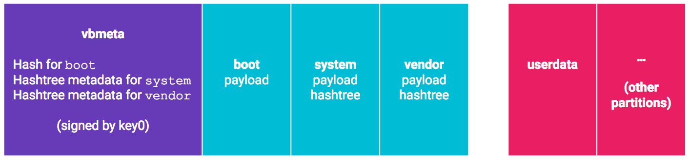

这个就是跟解锁相关的一个概念了。

如果被解锁过，开机会提示设备已经被unlock，不可以被trust。

目的是为了保护系统的安全性。

实现的方式：

在设备启动过程中，无论在哪一个阶段，都会在进入到下一个阶段之前先验证下一阶段的完整性和真实性。


现在需要在Linux系统上也做这个功能。看看怎么实现的。

看我们的uboot代码。

配置项只有这个看起来有点关系。

```
#define CONFIG_LIBAVB		1
```

在defconfig里，还有这个配置项。

```
CONFIG_CMD_BOOTCTOL_AVB=n
```

相关的代码有：

```
./cmd/bootm.c:254:#ifdef CONFIG_CMD_BOOTCTOL_AVB
./cmd/bootm.c:369:#endif//CONFIG_CMD_BOOTCTOL_AVB
./cmd/amlogic/Makefile:38:ifdef CONFIG_CMD_BOOTCTOL_AVB
./cmd/amlogic/Makefile:50:obj-$(CONFIG_CMD_BOOTCTOL_AVB) += cmd_avb.o
./cmd/amlogic/cmd_bootctl_utils.c:64:#if defined(CONFIG_CMD_BOOTCTOL_AVB) && defined(CONFIG_CMD_BOOTCTOL_VAB)
./cmd/amlogic/cmd_bootctl_utils.c:69:#if defined(CONFIG_CMD_BOOTCTOL_AVB)
```


```
obj-$(CONFIG_LIBAVB) += libavb/
```

这个目录下文件不少。

```
#include "avb_chain_partition_descriptor.h"
#include "avb_crypto.h"
#include "avb_descriptor.h"
#include "avb_footer.h"
#include "avb_hash_descriptor.h"
#include "avb_hashtree_descriptor.h"
#include "avb_kernel_cmdline_descriptor.h"
#include "avb_ops.h"
#include "avb_property_descriptor.h"
#include "avb_slot_verify.h"
#include "avb_sysdeps.h"
#include "avb_util.h"
#include "avb_vbmeta_image.h"
#include "avb_version.h"
```

接口非常清晰。所以看起来还比较好懂。


相关的命令

```
get_avb_mode
```


```
a5_av400# mmc part

Partition Map for MMC device 1  --   Partition Type: AML

Part   Start     Sect x Size Type  name
 00 0 8192    512 U-Boot bootloader
 01 73728 131072    512 U-Boot reserved
 02 221184 0    512 U-Boot cache
 03 237568 16384    512 U-Boot env
 04 270336 65536    512 U-Boot recovery
 05 352256 16384    512 U-Boot misc
 06 385024 131072    512 U-Boot boot
 07 532480 2097152    512 U-Boot system
 08 2646016 4988928    512 U-Boot data
** Partition 9 not found on device 1 **
```

启动打印

```
[imgread]read from part: boot
avb2: 0
```

对应的代码

```
	char *avb_s;
	avb_s = env_get("avb2");
	printf("avb2: %s\n", avb_s);
```

但是这里也仅仅是打印了一下，根本没有使用。是0是1都一样的结果。

```
   Uncompressing Kernel Image ... OK
   Loading Ramdisk to 3fd5c000, end 3ffffdf4 ... OK
```


VBMeta结构体

AVB中使用的核心数据结构是`VBMeta`结构体。

此数据结构包含许多描述符（和其他元数据），

并且所有这些数据都以加密方式签名。

描述符用于映像哈希值，映像哈希树元数据和所谓的链接分区。 

下面是一个简单的例子：




其中**`vbmeta`分区在哈希描述符中保存引导分区的哈希值**。

对于`system`和`vender`分区，

哈希树紧随在各自的分区文件系统数据之后，

而vbmeta分区只保存哈希树描述符中哈希树的根哈希(root hash)，盐(salt)和偏移量(offset)。

因为`vbmeta`分区中的`VBMeta`结构体是加密签名的，

所以引导加载程序可以检查签名并验证它是否由`key0`的所有者制作

（例如通过已嵌入的key0公钥），

从而信任分区中储存的`boot`， `system`，`vendor`分区的哈希值。


AVB还包括回滚保护，用于防范已知的安全漏洞。

每个`VBMeta`结构体都有一个回滚索引(*rollback index*)，如下所示：


AVB被设计成可以与A/B分区同时启用，它要求存储在描述符中的任何分区名称中都不使用A/B后缀。


# 工具和库

本节主要内容为AVB中的工具和库的相关信息。

## avbtool和libavb

`avbtool`主要用来生成`vbmeta.img`，

它是验证启动的顶级对象。

这个映像将被烧录到`vbmeta`分区（如果使用A/B分区，则为`vbmeta_a`或`vbmeta_b`）而且被设计的尽可能的小（用于带外更新*out-of-band update*）。

`vbmeta`映像使用密钥签名，

映像中包含用于验证`boot.img`，`system.img`和其他分区映像的验证数据（例如加密摘要）。

`vbmeta`映像还可以包含对存储验证数据的其他分区的引用，

以及指定验证数据使用的公钥。

这种间接方式可以将验证权进行委托，

它允许第三方通过在`vbmeta.img`中包含它们的公钥来控制给定分区上的内容。

这样只需通过更新vbmeta.img中的分区描述符，就可以轻松改变或撤销验证权限而不用修改其它分区。

将签名的验证数据存储在其他映像上(例如`boot.img`和`system.img`)也是使用`avbtool`完成的。

除了`avbtoo`l之外，还提供了一个库——`libavb`。

该库在设备端执行所有验证，例如它首先加载`vbmeta`分区，检查签名，然后继续加载启动分区以进行验证。

此库旨在用于引导加载程序和Android内部。

它有一个简单的系统依赖抽象（参见`avb_sysdeps.h`）以及引导加载程序或操作系统应该实现的操作（参见`avb_ops.h`）。

验证的主要入口点是`avb_slot_verify()`。

Adroid Things（译者注：一套谷歌推出的面向物联网平台的操作系统）对`vbmeta`公钥有特定的要求和验证逻辑。`libavb_atx`中提供了一个扩展，该扩展是`libavb`公钥验证操作的实现。（请参阅`avb_ops.h`中的`avb_validate_vbmeta_public_key()`）。


### 版本控制和兼容性

AVB使用具有三个字段的版本号——主要版本，次要版本和子版本。 这是一个示例版本号：

```null
                     1.4.3
                     ^ ^ ^
                     | | |
the major version ---+ | |
the minor version -----+ |
  the sub version -------+
```


本节讨论将`libavb`与设备引导加载程序集成的建议和最佳实践。重要的是要强调这些只是建议，因此用词必须谨慎。

此外，本章还使用术语HLOS来指代高级操作系统（*High Level Operating System*）。这显然包括Android（包括但不限于手机形式），但也可能是其他操作系统。

# amlogic实现

bootloader读取vbmeta分区，验证它的签名。

读取boot分区，计算boot分区的hash值，并跟vbmeta里存放的boot分区的hash值进行对比。

如果匹配，则boot分区是合法的。

vbmeta里有一个公钥。

其余的分区也要一一进行验证。

如果验证都ok，那么启动kernel。

在amlogic的设计里，avb2被作为一个可信链的容器。

底层实现跟标准的android avb2略有区别。

amlogic选择使用标准的dm-verity suite。

信任链从rom到bootloader。


启动过程

1、bl33读取和验证vbmeta分区，使用bl33_kpub，这个kpub是在FIP header里的。

2、bl33读取boot分区，计算hash，并跟vbmeta里存放的boot分区的hash值进行对比。

3、bl33继续验证vendor和system分区的签名。

4、bl33启动kernel。


Android Secure Boot实现主要有两个版本，一个是Verified Boot 1.0，另一个是Verified Boot 2.0，也称为AVB。


Secure Boot 顾名思义就是安全启动，确保设备启动之后所加载执行的代码都是可信的。

其中涉及的主要概念有两个：信任链和信任根。

前者保障执行流程的可靠交接，后者则保障初始信任代码的可信。


在介绍信任链的时候我们说到，

每次加载新的代码或数据之前都需要对其进行验证。

对于比较小的分区，如boot或者dtbo，

可以直接加载到内存并计算他们的hash，

然后将其与预置的hash进行比对。

预置的hash通常存放在对应分区文件的头部或者尾部，

或者存放在独立的分区中。

不论他们的位置在哪，都是会使用信任根进行直接或间接签名的。


但是对于较大的分区，

比如system分区，

实际上包含了整个文件系统，

是无法全部读取到内存里的。

这时就需要其他的方法，

**在Android中使用的是hash tree。**

当数据加载到内存时，**系统就会计算该hash tree的root hash，**

并与预置的root hash进行比对验证。


在介绍`dm-verity`之前有必要先了解其中的`dm`，

即`Device Mapper`的作用。

Device Mapper是Linux内核中提供的一个映射框架，

可以方便用户程序**通过ioctl自行创建和管理设备之间的映射。**

其中涉及到3个核心元素：

- Mapped Device
- Target Driver
- Target Device

基于Device Mapper框架实现的应用有逻辑卷管理器LVM、软件阵列RAID以及Docker(COW)等。

当然，我们所讨论的`dm-verity`也是其中一个。


`dm-verity`的代码在内核中为`drivers/md/dm-verity.c`(以Linux4.4为例，在upstream中进行了重构)，

主要作用是用来验证文件系统中data block的完整性


**dm-verity将系统镜像切分为4k的块(block)大小，**

**并对每一个块计算hash，**

这些hash以树状结构组合，称为hash tree，即哈希树。

哈希树中的每个结点都是一个哈希，

对于叶子结点值是对应块的hash，

对于中间结点其值是所有子结点的hash。

因此中间结点所包含的子节点(hash)容量也是一个块，和所采用的hash算法以及对应块大小有关。

一个含有32768个块，块大小为4096字节且采用sha246 hash算法的哈希树结构示例如下：

在AOSP构建环境中，生成hash tree的工具为`build_verity_tree`，代码在`system/extras/verity/build_verity_tree.cpp`。


[AVB](https://source.android.com/security/verifiedboot/avb)是安卓8.0之后对于Verified Boot的一个参考实现，

也称为Verified Boot2.0。

在AVB中一个重要的数据结构就是VBMeta，

其中包括了一系列描述符和元信息，

并且其中所有的信息都是签名的。

描述符包括hash描述符(boot.img、dtbo.img等小镜像)以及hashtree描述符(system.img、vendor.img等大镜像)。

除了签名，VBMeta中还包含版本信息以及Rollback Index，从设计上就考虑了降级攻击的威胁。


```
CONFIG_AVB2_KPUB_EMBEDDED
CONFIG_AVB2_KPUB_VENDOR
CONFIG_AVB2_KPUB_FROM_FIP
CONFIG_AVB2_RECOVERY
	配置是否对recovery分区进行avb验证。
```

当前cmd_avb.c里，avb命令只有一个子命令，就是avb verify。

```
AvbSlotVerifyData
这个结构体重要。

```


**AVB在系统启动的哪些阶段工作？**

> AVB一般在bootloader阶段和INIT的第一阶段工作。

**AVB在这两个阶段做了哪些事情？**

> AVB主要在Bootloader中校验vbmeta/vbmeta_system/boot/vendor_boot等分区，在init的第一阶段校验vbmeta/system/vendor等分区。

AVB工作原理大概是怎样的？

在bootloader或者UEFI中对vbmeta分区做校验，

通过vbmeta中的descriptor描述符信息，

去校验boot/vendor_boot等分区，

同时获取系统中的device_status(locked or unlocked 即上锁或者未上锁)、boot_status(启动状态)、vbmeta中的加密的digest/加密算法/vbmeta大小等信息，append到kernel cmdline中；

然后启动kernel,

kernel加载ramdisk运行init进程，

进入init第一阶段，

进行system/vendor分区的安全校验，

会利用kernel cmdline中的值，

跳过boot分区的校验；

同时，因为system/vendor分区比较大，

对大分区会执行hashtree的数据处理，

将root digest等信息通过ioctl存到kernel中，

后面访问数据时文件系统会执行dm-verity校验，执行运行时动态安全校验。


AVB对分区的处理是怎样的？

知道了其工作原理后，

那google是如何设计框架的，

对系统分区做了哪些设计呢？

首先，google想到了这样的设计：

通过增加一个独立的分区，这个分区包括了其他分区的重要校验信息；

只要保证这个vbmeta的足够安全，那么vbmeta中包含的其他分区的信息也就足够安全。

其次，这些安全的信息总不能用明文吧，所以得加密。

用什么加密方式比较合适呢？

google采用了RSA非对称加密，

对镜像数据做RSA签名，

将来在启动加载镜像分区时做公钥验证签名。

一级级的保证各个分区的安全性。


好了，有了这些基本内容后，

我们接下就介绍vbmeta的设计细节，以及它的设计用意。


一、vbmeta镜像内容说明：

在整个AVB验证的过程中，需要借助于vbmeta分区，

需要增加vbmeta分区和vbmeta.img镜像。

**vbmeta.img镜像，编译出来的大小为4KB**


vbmeta.img需要配置物理分区大小为64KB，

这个是google推荐的，

实际上数据只有4KB左右。


因为vbmeta.img里面要保存boot/dtbo/system/vendor等分区的校验信息，

所以编译时会依赖于这些镜像的编译。

BOARD_AVB_KEY_PATH可自定义，

如果没有定义则使用avb默认的test测试密钥。

uboot下面avb相关的命令：

```
avb verify - run verification process using hash data from vbmeta structure
avb read_rb <num> - read rollback index at location <num>
avb write_rb <num> <rb> - write rollback index <rb> to <num>
avb is_unlocked - returns unlock status of the device
avb get_uuid <partname> - read and print uuid of partition <partname>
avb read_part <partname> <offset> <num> <addr> - read <num> bytes from
partition <partname> to buffer <addr>
avb write_part <partname> <offset> <num> <addr> - write <num> bytes to
<partname> by <offset> using data from <addr>
```

需要的配置项

```
CONFIG_LIBAVB=y
CONFIG_AVB_VERIFY=y
CONFIG_CMD_AVB=y
```

U-Boot 能够使用`bootm` 命令从 Android 启动映像启动 Android 操作系统。为了使用 Android Boot Image 格式支持，应该启用下一个选项：

```
CONFIG_ANDROID_BOOT_IMAGE=y
```

然后可以使用下一个`bootm`命令调用来运行 Android：

```
=> bootm $loadaddr $loadaddr $fdtaddr
```


bootloader里有2个公钥。

custom key：在board/amlogic/$(BOARD)/avb2_kpub.c，这个默认没有。

default key: 在lib/libavb/testkey.c

```
一个520字节的数组。
char avb2_kpub_default[520] 
```

validate_vbmeta_public_key 这个函数会用到这个数组。

CONFIG_AVB2_KPUB_FROM_FIP 这个配置会使能吗？

是使能的

```
./arch/arm/include/asm/arch-a5/cpu.h:80:#define CONFIG_AVB2_KPUB_FROM_FIP 1
```

avb2_kpub.c

这个文件如果需要，可以通过命令来生成。

avbtool这个工具。

公钥放在bootloader的FIP里。FIP的作用是啥？

先看看这个脚本。

bootloader\uboot-repo\fip\a5\build.sh


```
	if [ ! $CONFIG_AVB2 ]; then
		CONFIG_AVB2=null
	fi
```

启动命令里的这个：

```
"get_avb_mode;"\
```

命令来自于./cmd/amlogic/cmd_bootctl.c

```
ifdef CONFIG_CMD_BOOTCTOL_AVB
ifdef CONFIG_CMD_BOOTCTOL_VAB
obj-y += cmd_bootctl_vab.o
else
obj-y += cmd_bootctl_avb.o
endif
else
obj-y += cmd_bootctl.o
endif
```

avb和vab区别是什么？

vab是ab分区的情况。vab是avb的一种特殊情况。

```
ifdef CONFIG_CMD_BOOTCTOL_AVB
ifdef CONFIG_CMD_BOOTCTOL_VAB
obj-y += cmd_bootctl_vab.o
else
obj-y += cmd_bootctl_avb.o
endif
else
obj-y += cmd_bootctl.o
endif
endif
```


CONFIG_UNIFY_BOOTLOADER 这个宏的作用是什么？

当前默认是没有定义的。

是amlogic自己增加的定义。

如果定义了，那么这4个文件都会编译。

```
ifdef CONFIG_UNIFY_BOOTLOADER
obj-y += cmd_bootctl_vab.o
obj-y += cmd_bootctl_avb.o
obj-y += cmd_bootctl.o
obj-y += cmd_bootctl_wrapper.o
else
```

CONFIG_BOOTLOADER_CONTROL_BLOCK

这个没有定义。就是bcb。

avbtool可以在rdk、yocto、android代码中找到。

rdk和tdk是什么关系？

什么是rdk？

这里有说明。但是看起来是一套构建系统，跟buildroot一个层级的。

https://confluence.amlogic.com/pages/viewpage.action?pageId=173801916&preview=%2F173801916%2F221689141%2FRDK+%E4%BB%8B%E7%BB%8D.pdf

更yocto更像，都是基于bitbake的。

不是像，是基于yocto。

所以rdk没有必要看了。

就看yocto里怎么集成avbtool的。


测试方法

```
Program your aml_upgrade_package.img and *vbmeta.img*
During boot, you should be able to see that 

avb_slot_verify.c:524: DEBUG: Loading vbmeta struct from partition 'vbmeta'.
Verified using testkey
avb_slot_verify.c:286: DEBUG: boot: Loading entire partition.
avb_slot_verify.c:286: DEBUG: recovery: Loading entire partition.
avb_slot_verify.c:286: DEBUG: dtb: Loading entire partition.
```

```
In uboot,
# avb verify

It will verify the partition integrity
```

要使能avb的，mk脚本要传递这样的参数。

```
./mk sc2_ah212 --avb2 --vab
./mk sc2_ah212 --avb2
对于linux系统，不需要--vab选项。这个是给android R用的。
```

```
ifeq ($(BUILD_WITH_AVB),true)

PRODUCT_PACKAGES += \

        bootctrl.amlogic \

        libavb_user

endif
```

参考这个：

https://jira.amlogic.com/browse/SWPL-54533

kernel里需要增加一个分区

```
		vbmeta:vbmeta
		{
			pname = "vbmeta";
			size = <0x0 0x200000>;
			mask = <1>;
		};
```

镜像conf文件也需要增加

```
file="vbmeta.img"           main_type="PARTITION"      sub_type="vbmeta"
```

https://scgit.amlogic.com/#/q/topic:YOCTO-AVB

yocto的几个提交在这里。

vbmeta.img is created by recipe vbmeta-img.bb, 

use the avb tool released by google. 

We need create a new partition /dev/vbmeta(or /dev/vbmeta_a, /dev/vbmeta_b) to burn this image file,

 it is an ordinary binary file, contains no file system. 

During system booting up, bootloader will hash value from the partition and check against the corresponding binary(boot.img and dovi_fw).

在boot.img的最后加上hash的方法。

```
avbtool add_hash_footer --image ${DEPLOY_DIR_IMAGE}/boot.img --partition_size 67108864 --partition_name boot
```

`"--partition_size"` is got from the partition table(partition_normal_linux.dtsi),

创建最终的vbmeta.img文件

```
avbtool make_vbmeta_image --output ${DEPLOY_DIR_IMAGE}/vbmeta.img --key ${WORKDIR}/testkey_rsa2048.pem --prop dovi_hash:3cd93647bdd864b4ae1712d57a7de3153e3ee4a4dfcfae5af8b1b7d999b93c5a --algorithm SHA256_RSA2048 --include_descriptors_from_image ${DEPLOY_DIR_IMAGE}/boot.img --padding_size 4096 --rollback_index 0
```

查看img的信息。

```
avb-tool/avb/avbtool info_image --image vbmeta.img
```


```
#define CONFIG_FIP_IMG_SUPPORT  1
```

FIP全称

Firmware Image Package

- 通常BL1被烧录在ROM中，BL2/BL31/BL32/BL33/uboot被打包成fip.bin烧录在flash中；启动时通过检索UUID找到fip.bin中的各个image，参考`firmware_image_package.h`
- 通过函数plat_get_image_source()读取数FIP数据
- `tools/fiptool/fiptool`可以生成和分解fip文件


```
  HOSTLD  tools/gen_ethaddr_crc
  HOSTLD  tools/mkenvimage
  HOSTLD  tools/fdtgrep
  HOSTLD  tools/dumpimage
  HOSTLD  tools/mkimage
```


```
DDRFW_TYPE: lpddr4 CHIPSET_NAME: a113x2 CHIPSET_VARIANT: general AMLOGIC_KEY_TYPE: dev-keys
```


打开avb相关的配置

```
multiple definition of `_u_boot_list_2_cmd_2_avb'
```

这个是拼接出来的

```
./include/linker_lists.h:30:            ((_type *)&_u_boot_list_2_##_list##_2_##_name)
```

```
cmd_bootctl_avb.o
cmd_avb.o
这2个文件有没有重叠？

```

CONFIG_CMD_BOOTCTOL_AVB

这个是不是必选的？

感觉是./cmd/avb.c和./cmd/amlogic/cmd_avb.c重叠了

是的，cmd/avb.c支持的子命令更多。

应该用哪个呢？

```
obj-$(CONFIG_CMD_AVB) += avb.o
obj-$(CONFIG_CMD_BOOTCTOL_AVB) += cmd_avb.o
```

所以这2个不能同时选中。

那应该用哪个呢？

```
代码实现：

在uboot/bl33/common/下有三个文件，cmd_bootctl_avb.c  cmd_bootctlvab.c cmd_bootctl.c 去生成cmd_bootctl_xxx.o

对应的定义:

CONFIG_CMD_BOOTCTOL_AVB   ----   cmd_bootctl_avb.c

CONFIG_CMD_BOOTCTOL_VAB ---- cmd_bootctl_vab.c

如果这两个都没定义，则认为是cmd_bootctl.c

定义的主要区别在于misc 分区里的结构体

对于旧版的cmd_bootctl.c，想要实现AB 系统的切换，只需要在bootloader_massage 里的slot 值改变一下

对于cmd_bootctlvab.c，则需要取出misc分区中的bootloader_messagge_ab的值，对里面的slota,slotb的启动优先级进行改变

对于cmd_bootctlavb.c,只需要偏移固定位置，读取目标结构体的值，再改变slota,slotb的启动优先级即可．
```

CONFIG_CMD_BOOTCTOL_AVB 这个应该不是必选。

我先不用。

但是从有的文档上看到：


uboot使能这3个配置

```
CONFIG_CMD_BOOTCTOL_AVB=y
CONFIG_LIBAVB=y
CONFIG_AVB_VERIFY=y
```

选中是bootm里直接调用的avb_verify函数。


mk脚本加上--avb2的参数。

先把uboot镜像做出来。

烧录进来。

选中boot.img和system.img都没有使用avbtool进行处理。

按道理应该是校验不通过。

运行打印了这个

```
active_slot in storeboot: normal
[imgread]read from part: boot
avb2: 1
active_slot is normal
ab_suffix is 
_find_partition_by_name()-200: do not find match in table vbmeta
_find_partition_by_name()-200: do not find match in table vbmeta
get partition info failed !!
_find_partition_by_name()-200: do not find match in table vbmeta
_find_partition_by_name()-200: do not find match in table vbmeta
error partition name!
Part 2 Failed to read 65536B from part[vbmeta] at 0
avb_slot_verify.c:736: ERROR: vbmeta: Error loading vbmeta data.
avb verification: locked = 1, result = 2
try upgrade as booting failure
PHY2=00000000fe03a000,phy-base=0xfe03c000
0x10 trim value=0x0000007f
crg cn
```

单独执行avb verify也是一样的。

```
a5_av400# avb verify
active_slot is normal
ab_suffix is 
_find_partition_by_name()-200: do not find match in table vbmeta
_find_partition_by_name()-200: do not find match in table vbmeta
get partition info failed !!
_find_partition_by_name()-200: do not find match in table vbmeta
_find_partition_by_name()-200: do not find match in table vbmeta
error partition name!
Part 2 Failed to read 65536B from part[vbmeta] at 0
avb_slot_verify.c:736: ERROR: vbmeta: Error loading vbmeta data.
result: 2
```


所以现在需要在kernel设备树里配置vbmeta分区。

分区里放入什么内容呢？

vbmeta.img is created by recipe vbmeta-img.bb

所以看看yocto的这部分做了什么。

生成vbmeta.img文件的命令如下：

```
# 需要先给boot.img生成末尾的hash部分。
# 这部分信息会被提取放到vbmeta.img里。
# 这里的--partition-size参数，跟dts里的boot分区的大小要一样。
avbtool add_hash_footer --image ${DEPLOY_DIR_IMAGE}/boot.img --partition_size 67108864 --partition_name boot
```

创建vbmeta.img的命令：

```
avbtool make_vbmeta_image --output ${DEPLOY_DIR_IMAGE}/vbmeta.img --key ${WORKDIR}/testkey_rsa2048.pem --prop dovi_hash:3cd93647bdd864b4ae1712d57a7de3153e3ee4a4dfcfae5af8b1b7d999b93c5a --algorithm SHA256_RSA2048 --include_descriptors_from_image ${DEPLOY_DIR_IMAGE}/boot.img --padding_size 4096 --rollback_index 0

```

```
./vendor/amlogic/avb/test/data/testkey_rsa2048.pem
	这个pem文件在这里。
```


在使能avb之后，在修改kernel代码后怎么更新boot.img进行调试？

需要同时同时更新boot.img和vbmeta.img。

这个jira做了不少的工作。可以看处理过程。

https://jira.amlogic.com/browse/SWPL-21937


https://scgit.amlogic.com/#/c/168077/2/recipes-core/initrdscripts/files/init-meson.sh

看这个怎么在initramfs的init里处理dm-verity的。

veritysetup 这个工具是编译出来的吗？在哪个仓库呢？

那就还需要libdevmapper


这个提交增加了生成vbmeta的命令。

https://scgit.amlogic.com/#/c/183399/9/recipes-core/images/vbmeta-image.bb

vbmeta给2M。

在哪里加生成镜像从处理了命令比较合适呢？

这个文件要模仿一下。

meta-meson/recipes-core/initrdscripts/files/init-meson.sh

meta-meson/recipes-devtools/avb/avb_2.0.bb

这个是从谷歌下载工具目录。

aml_upgrade_pkg_gen.sh

在这个脚本里进行vbmeta.img的生成比较合适。

这样先手动执行

```
./vendor/amlogic/avb/avbtool.py add_hash_footer --image output/a5_av400_a6432_release/images/boot.img --partition_size 67108864 --partition_name boot
```

是直接覆盖boot.img文件的。

生成vbmeta.img

```
./vendor/amlogic/avb/avbtool.py make_vbmeta_image \
--output output/a5_av400_a6432_release/images/vbmeta.img \
--key vendor/amlogic/avb/test/data/testkey_rsa2048.pem \
--algorithm SHA256_RSA2048 \
--include_descriptors_from_image output/a5_av400_a6432_release/images/boot.img \
--padding_size 4096 
```

先不改dm-verity的。

烧录镜像看看。

但是开机显示没有打开avb的功能。uboot里是：

```
system_mode in storeboot: 0
active_slot in storeboot: normal
[imgread]read from part: boot
avb2: 0
```


# dm-verity机制

近期做的一个项目，

由于客户对安全性要求比较高，

涉及到文件系统校验的问题，

起初是在ramdisk中挂载rootfs后对所有重要的文件检查sha256，

但是随着rootfs的逐步增大，

发现校验花费的时间太长，竟然达到十几秒，

于是就想改用一种方案，

首先想到的是整个rootfs校验后在挂载，

这样肯定是比一个文件一个文件校验要来得快些，

但是项目中用的是nandflash，并不是EMMC，

所以文件系统只能采用支持坏块管理的ubifs，

于是这里就存在问题了，

ubi层负责逻辑块到物理块的映射，

也就是说在物理存储上块不一定是逻辑连续的，

这样在ubifs还没有挂载之前读取整个镜像然后整体校验肯定是行不通的，

一个解决办法是读取ubi卷设备而不是mtd设备，

这样的话是可行的，

但是一种更好的办法是采用dm-verity，

但是这个是Linux项目，并不是Android项目，

通过对dm-verity移植，这里记录一下对dm-verity的理解。

**dm-verity是什么？**

它是dm（device mapper）的一个target，是一个虚拟块设备，专门用于文件系统的校验

```
+------------------------------+

|                fs                   |

+------------------------------+

                  |

                  ↓

+-------------------------------+

|         dm-verity               |

+-------------------------------+

                 |

                 ↓

+-------------------------------+

|            block driver        |

+--------------------------------+

                  |

                  ↓

+-------------------------------+

|               block device    |

+-------------------------------+
```


fs在挂载的时候直接指定dm-verity设备，

也就是fs直接交互的设备是dm-verity，

dm-verity调用真正的块驱动去读取对应的块,

并计算hash值和hash-tree中对应的hash值进行比较，

如果相等，则说明块没有被篡改，返回块数据给fs，

如果不相等，则说明块被篡改，根据mode是返回EIO，或者直接重启。


首先通过ioctl去crt（create）一个dm-verity设备，

通过传入参数指定这个创建的dm-verity设备的一些特性，

传入的参数包括verity-table，

当然也可以使用命令直接创建：

```
Set up a device:
  # dmsetup create vroot --readonly --table \
    "0 2097152 verity 1 /dev/sda1 /dev/sda2 4096 4096 262144 1 sha256 "\
    "4392712ba01368efdf14b05c76f9e4df0d53664630b5d48632ed17a137f39076 "\
    "1234000000000000000000000000000000000000000000000000000000000000"
```


dm-verity的工作原理

通过前面的描述，

很容易理解dm-verity的工作过程，

就拿我这个项目来说，

squashfs需要读取某个块时，

调用dm-verity读取对应的块，

dm-verity根据verity-table中block_device，

调用block_device读取对应的块，

读取到块的内容后dm-verity会算出块的sha256，

然后跟verity-hash-tree中相对应的hash值进行比较，

如果相等，则说明该块没有被修改过，一切正常。


为何dm-verify支持所有的文件系统？

该项目在选用dm-verity之前，

我一直都在怀疑dm-verity是否支持ubifs，

通过前面的描述，

如果你对dm-verity的工作原理足够理解的话，

你就会发现，dm-verity跟文件系统是无关的，

只要文件系统是工作在块设备之上的，

所以ubifs是不可以的，

工作在块设备之上的文件系统都是可以的，

dm-verity是对逻辑块校验hash值，

产生hash-tree的时候也是根据文件系统镜像来产生的（然后除ubifs之外，

不存在逻辑块的概念，

但是可以类似将它看出逻辑块直接等于物理块），

至于逻辑块到物理块直接是怎样映射，dm-verity根本就不需要关心。


**dm-verity为何这么快？**

了解了原理之后这个就很好回答了，因为dm-verity并不需要在挂载前对所有的块进行校验，而是在使用的过程中用到哪个块就校验哪个块的hash值，这样对于像android一个分区几个G来说优势就显得更加明显了。


dm-verity是如何保证安全的？

前面说过每个block都在hash-tree中记录了对应的hash值，

这样就能防止别人篡改block的内容了，

但是如果黑客把block改了之后，

重新计算hash把hash-tree中对应的hash值也改了呢，

这样就能神不知鬼不觉了，

所以必须要有一种机制防止hash-tree被篡改，

hash-tree是这样一种结构，

所有的block对应的hash值放在最底层，也就是第0层，如下图：


参考资料

1、深入理解dm-verity机制

https://blog.csdn.net/whuzm08/article/details/85272419

# avb跟optee

是可选的。

doc\README.avb2

如果一起用的话，是用来做anti-rollback的。

CONFIG_OPTEE_TA_AVB

```
CONFIG_TEE=y
CONFIG_OPTEE=y
CONFIG_OPTEE_TA_AVB=y
CONFIG_SUPPORT_EMMC_RPMB=y
```


# avb升级和swupdate的配合

bootloader_message要匹配。

# amlogic参考资料

1、AVB keys in bootloader

https://confluence.amlogic.com/display/SW/AVB+keys+in+bootloader

2、**AVB2 in Android P**

https://wiki-china.amlogic.com/Android_Development/Google_Reference_Design/AVB2_in_Android_P

3、

这篇比较全面。

https://confluence.amlogic.com/display/SW/AVB+and+DM-Verity+On+RDK

4、

https://jira.amlogic.com/browse/SWPL-51970

5、

https://confluence.amlogic.com/display/SW/AVB2+Introduction

# 参考资料

1、

https://www.jianshu.com/p/d354280f1f27

2、

https://blog.csdn.net/rikeyone/article/details/80606147

3、

https://blog.csdn.net/weixin_43836778/article/details/90400147

4、

https://www.cnblogs.com/schips/p/what_is_android_verified_boot.html

5、浅谈 Android 的安全启动和完整性保护

这篇文章非常全面。写的好。

https://evilpan.com/2020/11/14/android-secure-boot/

6、启动时验证

https://source.android.com/docs/security/features/verifiedboot?hl=zh-cn

7、android AVB2.0（一）工作原理及编译配置

https://blog.csdn.net/jackone12347/article/details/119043280

8、

https://u-boot.readthedocs.io/en/latest/android/avb2.html

9、

https://harmonyhu.com/2018/06/23/Arm-trusted-firmware/