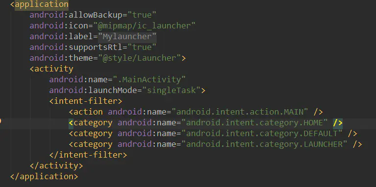

--

对于初级开发者来说launcher可能还有些陌生，它俗称“HomeScreen”

也就是我们开机后看到的第一个App。

launcher其实就是一个app，**它的作用用来显示和管理手机上其他App。**

目前市场上有很多第三方的launcher应用，比如“小米桌面”、“91桌面”等等，今天我就来说一下如何开发一款自己的launcher应用。

只需要写一个普通的Android应用。在androidmanifest.xml里这样配置。

当我们运行程序时可能会觉得和平常并没有不一样的地方，但是当我们点击Home键之后就会看到选择桌面的提示：

当前这个就是一个最简单的launcher。但是它实际上什么都做不了。

怎么显示系统里安装的应用呢？

在探讨如何显示你的Apps之前我们先来学习一下什么是PackageManager。

通俗一点来说PackageManager是用于获取Android系统中应用程序的信息，

查询Application相关信息(application，activity，receiver，service，provider及相应属性等）、

查询已安装应用、增加或删除permission、清除用户数据、缓存，代码段等。

既然我们需要显示我们所有的App，那自然少不了它的帮助。

参考资料

1、Launcher开发——入门篇

https://www.jianshu.com/p/968e2339ee5f