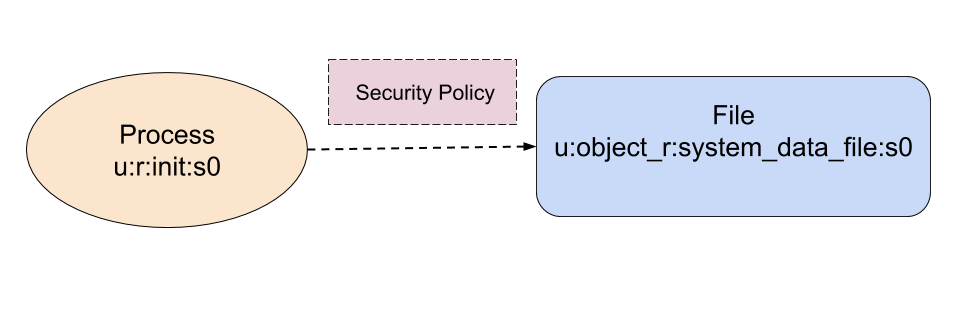
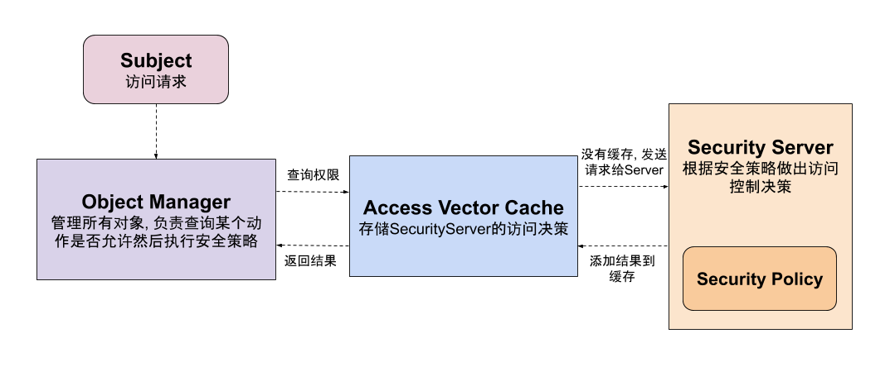

1

SELinux([Security Enhanced Linux](https://en.wikipedia.org/wiki/Security-Enhanced_Linux))是Linux下的安全控制机制, 

为进程访问系统资源提供了访问控制(access control)策略.

早期, Linux基于用户身份/用户组的DAC([Discretionary Access Control](https://en.wikipedia.org/wiki/Discretionary_access_control)作为访问控制策略: 

每个进程都有所属的UID, 

每个文件都有所属的UID/GID以及文件模式(读写执行等), 

一个进程是否可以访问某个文件就是基于UID/GID/文件模式来管理的.

换句话说,只要某个资源序属于该用于或该用户组, 则该用户对该资源具有绝对控制权力,

 这样一旦用户获得了root权限, 那么整个系统就成了肉鸡. 可见, DAC的安全控制策略比较粗放.


SELinux最初是由美国Utah大学与NSA(National Security Agency)的安全小组研究出来的[安全框架FLASK](http://freecomputerbooks.com/books/The_SELinux_Notebook-4th_Edition.pdf)演变而来, 

后被合入到Linux 2.6版本.

相较于DAC, SELinux采用的是更细粒度的MAC([Mandatory Access Control](https://en.wikipedia.org/wiki/Mandatory_access_control)).

对于DAC而言, **资源的权限是由每个用户自己控制的**, 

**而MAC则将所有的权限收拢,** 

由一个统一的管理者(SELinux)统一来分配所有的资源权限, 

如果访问者没有事先分配到某个资源的权限, 则不会允许访问.

**这样即使是root用户也要收到安全策略的约束.** 

Android在4.3开始引入SELinux, 到了5.0版本之后, 则开始全面支持了.


在SELinux机制下, Android中所有的对象(进程/文件/socket/property)都打上了标签(label), 

进程访问对象时, SELinux**根据事先配置好的安全策略(security policy)判断访问者是否有权限.**



另外, Android系统是同时支持DAC与SELinux的, 就是说, 在一个进程访问某个资源时,会按照如下规则进行权限控制:

- 首先根据DAC规则, 检查进程权限, 是否具有对应资源的读写/执行权限, 如果没有则拒绝执行;
- 如果DAC规则检查通过, 则执行SELinux安全规则的检查, 如果不通过,则拒绝访问.


SELinux的首要原则是: 任何未被声明允许执行的都会被拒绝, 其有两种运行模式:

- `Permissive`模式: 访问控制的策略不会强制执行, 但是会被日志记录下来
- `Enforcing`模式: 访问控制策略会被强制执行并被记录下来


在SELinux中, 主要有Subject/Object/Object Manager/Security Server等几个核心的组成部分(见下图):

- `Subject`: 在SELinux中, `Subject`是一个进程, 每个`Subject`都有与之关联的一个安全上下文(`security context`); `Subject`负责发起访问某个对象的请求,比如读文件/建立socket链接
- `Object`: 一个对象就是一个资源, 比如文件, socket, pipes以及网络接口；每个对象都由一个类型标识其用途(file, socket), 并且与一个权限(permissions)集合关联, 该权限集合描述了对象能提供什么样的服务(比如read/write/send等)
- `Object Manager`: 对象管理者负责管理所有对象以及这些对象上能够执行的动作
- `Access Vecctor Cache`: 用于缓存Security Server的访问决策,以改善系统性能
- `Security Server`: 安全服务器根据安全策略来决定某个对象上的动作是否被执行
- `Security Policy`: 用于描述SELinux的访问规则



接下来我们看看SELinux具体是**如何给每个对象打标签**以及实现安全策略规则的.

SELinux是通过标签(label)来匹配执行动作以及策略的.

**标签决定了何种动作是允许被执行的,** 

socket/文件/进程都有自己的标签. 

SELinux的访问控制就是根据各个对象上的的标签来决定的, 

而策略文件则定义了这些对象是如何相互交互的.

一个标签通常有如下的形式:

```
user:role:type:mls_level
```

在Android中, 通常不用关心`user`/`role`/`msl_level`, 

`user`一般只有`u`,

 `role`对于进程来说是`r`, 对其他对象是`object_r`,

 `msl_level`是`s0`, 

而`type`则用来标识对象的类型, 

其决定了该对象的所具备的能力, 

因此Android中的SELinux又称为基于TE(`Type Enforcement`)的安全机制, 

**在Android中, 所有的SELinux策略文件都以`te`结尾.**


可以给ls和ps命令加上-Z参数，看文件和进程的selinux信息。


SELinux 政策组合使用核心 AOSP 政策（平台）和设备专用政策（供应商）进行构建。从 Android 4.4 一直到 Android 7.0 的 SELinux 政策构建流程合并了所有 sepolicy Fragment，然后在根目录中生成了整体文件。这意味着 SOC 供应商和 ODM 制造商每次修改政策时，都修改了 `boot.img`（针对非 A/B 设备）或 system.img（针对 A/B 设备）。


参考资料

1、构建 SELinux 政策

https://source.android.com/security/selinux/build

2、SELinux在Android中的应用

http://sniffer.site/2019/12/07/Selinux%E5%9C%A8Android%E4%B8%AD%E7%9A%84%E5%BA%94%E7%94%A8/