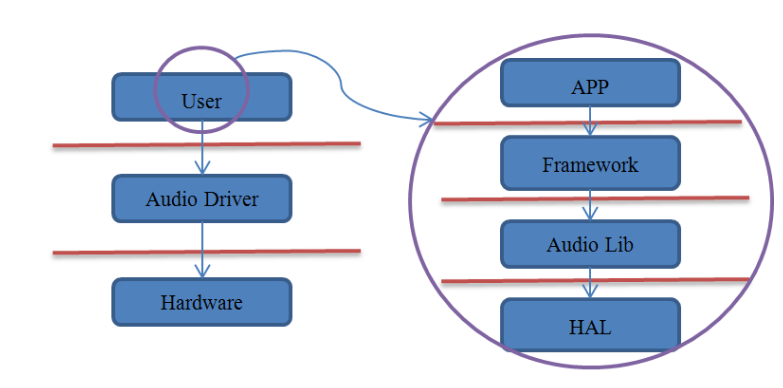

1

音频逻辑上相对比较简单，我以音频为切入点，来分析一下Android系统的整体框架。

在计算机发展的早起，电脑的声音处理设备就是一个简单的loudspeaker和Tone Generator构成。

功能非常有限。

后面人们想到以plugin的方式扩展音频设备。

这种早期的声卡以外接的方式插入主板上，这个就是独立声卡。

独立声卡的成本高。

所以后面又把声卡集成到主板上，就是集成声卡。

一个典型的声卡通常包括3个部分：

1、connectors。也叫jacks。就是跟耳机线的插口。

2、声卡主电路。

3、跟cpu的接口。例如PCI。

在我的手机上：

```
judyln:/ # cat /proc/asound/cards
 0 [sdm845tavilsndc]: sdm845-tavil-sn - sdm845-tavil-snd-card
                      sdm845-tavil-snd-card
```

市场的声卡非常多，对于一个os来说，应该怎样管理各种声卡，对上层提供统一的接口呢？

在Android系统里，很不是的tiny-xxx的项目。

因为完整的开源项目都比较大，所以就进行瘦身，就有了这些tiny项目了。

对于音频，是tinyalsa。在external目录下。

tinyalsa只支持了两种interface，而对于rawmidi、sequencer、timer都不支持。

对于嵌入式设备来说，够用了。



Framework这一层，大家首先想到的是MediaPlayer和MediaRecorder。

因为这2个类，是我们在开发音频产品的时候，最常使用的类。

Android其实还提供了另外2个类似的类，AudioTrack和AudioRecorder。

但是没有前面那2个类简单易用。

另外还有：AudioManager、AudioService、AudioSystem这3个管理类。

Library这一层，在frameworks/av/media/libmedia目录下。用C++写的。

除了上面的这些代码，音频系统还需要一个中控。

在Android里，就是一个service。

对应的类是AudioFlinger、AudioPolicyService。

代码在frameworks/av/service/audioflinger。


分析这些类，可以有两条思路：

1、以库为主线。

2、以进程为主线。

比如AudioFlinger和AudioPolicyService都驻留于名为mediaserver的系统进程中;

而AudioTrack/AudioRecorder和MediaPlayer/MediaRecorder一样实际上只是应用进程的一部分，

它们通过binder服务来与其它系统进程通信。


这其实是历史的必然了，alsa-lib太过复杂繁琐了，我看得也很不爽；

**更重要的商业上面的考虑，必须移除被GNU GPL授权证所约束的部份，alsa-lib并不是个例。**


从上层到下层，一层层分析代码。

最上层是aosp-rpi3\packages\apps\SoundRecorder这个官方录音程序。

用到2个媒体类：

```
import android.media.AudioManager;
import android.media.MediaRecorder;
import android.media.MediaPlayer;
```

AudioManager 

这个类的主要作用是

类的注释写着：

```
/**
 * AudioManager provides access to volume and ringer mode control.
 */
```

主要做音量控制和铃声模式控制。

MediaRecorder

```
是用来录音和录像的。
控制是用简单的状态机管理的。

```


录音的使用步骤：

```
MediaRecorder recorder = new MediaRecorder();
 recorder.setAudioSource(MediaRecorder.AudioSource.MIC);
 recorder.setOutputFormat(MediaRecorder.OutputFormat.THREE_GPP);
 recorder.setAudioEncoder(MediaRecorder.AudioEncoder.AMR_NB);
 recorder.setOutputFile(PATH_NAME);
 recorder.prepare();
 recorder.start();   // Recording is now started
 ...
 recorder.stop();
 recorder.reset();   // You can reuse the object by going back to setAudioSource() step
 recorder.release(); // Now the object cannot be reused
```

MediaRecorder类被加载的时候，就会载入对应的jni。

```
    static {
        System.loadLibrary("media_jni");
        native_init();
    }
```

代码在aosp-rpi3\frameworks\base\media\jni目录下。

这个依赖了很多的so文件。

```
LOCAL_SHARED_LIBRARIES := \
    libandroid_runtime \
    libnativehelper \
    libutils \
    libbinder \
    libmedia \
    libmediadrm \
```

我们关注libmedia.so

libmedia.so在aosp-rpi3\frameworks\av\media\libmedia


参考资料

1、Android音频系统之音频框架

这篇文章条理清晰，非常好。

https://blog.csdn.net/dahailinan/article/details/24294655

2、ANDROID音频系统散记之四：4.0音频系统HAL初探

https://www.cnblogs.com/wanqieddy/archive/2012/07/27/2611435.html