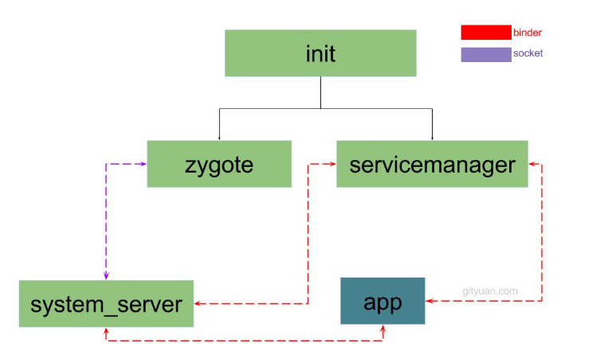
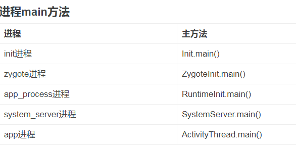

Android在启动linux内核时传递的bootcmd是这样的：

```
Kernelcommand line: noinitrd root=/dev/nfs console=/dev/ttySAC0 init=/init nfsroot=192.168.1.103:/nfsboot ip=192.168.1.20:192.168.1.103:192.168.1.1:255.255.255.0::eth0:on
```

init进程对应的文件是`system/core/init/init.c`。

init是一切用户进程的父进程。

对应的配置文件是：`system/core/rootdir/init.rc`。

跟linux不同，Android有一个Zygote进程。zygote的字面含义是受精卵。

Zygote进程是Android的核心进程之一。是Android Framework进程家族的祖先。

Zygote是一个典型的C/S架构。其他的进程作为client向Zygote发起请求，Zygote就不断产生Activity进程。


在Android系统里存在2个世界。

java世界。谷歌的sdk，主要就是针对这个世界的。都是基于dalvik虚拟机的。

native世界。用C和C++开发的程序。


我们都知道，程序运行，就一定存在一个进程。

但是我们在做Android开发的时候，都是接触的Activity、Service这些概念，它们跟进程是如何关联的呢？

在程序里，我们经常使用系统的service，这些service又在哪里呢？

上面这些疑问，都跟zygote和system_server有关系。这2个东西，就是本文要讨论的重点。

**这2个进程，撑起了Android系统里的java世界，任何一个进程崩溃，都导致java世界的崩溃。**


zygote

zygote本身是一个native程序。

跟驱动、内核都没有关系。

**zygote是init进程根据init.rc的配置创建的。**

zygote最初的名字叫app_process。在运行的时候，通过prctrl把自己的名字改成了zygote。

分析的入口文件是app_main.cpp。

```
 set_process_name("zygote");
```

Zygote的这个main函数虽很简单，但其重要功能却是由AppRuntime的start来完成的。下面，我们就来具体分析这个AppRuntime。

//className的值是"com.android.internal.os.ZygoteInit"

//如果环境变量中没有ANDROID_ROOT,则新增该变量，并设置值为“/system"


**Zygote是创建Android系统中Java世界的盘古，它创建了第一个Java虚拟机，同时它又是女娲，它成功地繁殖了framework的核心system_server进程。**

SystemServer的进程名实际上叫做“system_server”，这里我们可将其简称为SS。SS做为Zygote的嫡长子，其重要性不言而喻。


一个跟Linux不同的一点，就是多一个zygote进程，这个进程由init进程创建。

是其余用户态进程的父进程。

zygote的字面含义是受精卵。

zygote进程在启动时会创建一个dalvik虚拟机实例。

当zygote孵化一个新的进程时，会把自己的dalvik虚拟机复制过去。

**这样每个进程都有自己独立的dalvik虚拟机。**


init进程执行完成后进入循环等待epoll_wait的状态。

init脚本的内容的执行顺序：

```
on early-init
on init
on late-init
	trigger post-fs      //这里触发后面的行为。
    trigger load_system_props_action
    trigger post-fs-data  
    trigger load_persist_props_action
    trigger firmware_mounts_complete
    trigger boot 
on post-fs      //挂载文件系统
	start logd
    mount rootfs rootfs / ro remount
    mount rootfs rootfs / shared rec
    mount none /mnt/runtime/default /storage slave bind rec
on post-fs-data  //挂载data
	start logd
    start vold   //启动vold
on boot      //启动核心服务
```

在init.zygote.rc文件中，zygote服务定义如下：

```
service zygote /system/bin/app_process64 -Xzygote /system/bin --zygote --start-system-server
    class main
    socket zygote stream 660 root system
    onrestart write /sys/android_power/request_state wake
```


所有的Service里面只有servicemanager ，zygote ，surfaceflinger这3个服务有`onrestart`关键字来触发其他service启动过程。


android系统底层基于Linux Kernel, 

当Kernel启动过程会创建init进程, 

该进程是所有用户空间的鼻祖,

 init进程会启动servicemanager(binder服务管家), 

Zygote进程(Java进程的鼻祖). 

Zygote进程会创建 system_server进程以及各种app进程，

下图是这几个系统重量级进程之间的层级关系。



init的main函数

```
klog_init。
	kernel log初始化。
property_init
	//创建一块共享的内存空间，用于属性服务
signal_handler_init
	注册信号处理。这个也是放到epoll里处理的。
property_load_boot_defaults
	读取/default.prop文件。
start_property_service
	开启属性服务。epoll
Parser& parser = Parser::GetInstance();
	获取parser实例。
	注册on、service、import的处理函数。
parser.ParseConfig("/init.rc");
	解析、init.rc文件。
am.QueueEventTrigger("early-init");
	触发early-init处理。
am.QueueEventTrigger("init");
	触发init处理。
am.QueueEventTrigger("late-init");
	触发late-init处理。
	
然后进入epoll_wait死循环等待消息。
```

总结一下init进程的作用：

```
1、解析init.rc
2、生成设备驱动节点。通过init.rc里的配置。
3、提供子进程终止的处理。signal。
4、提供属性服务。property service。
```

当init解析到下面这条语句,便会启动Zygote进程

```
service zygote /system/bin/app_process -Xzygote /system/bin --zygote --start-system-server
```

所以zygote是init的第一个子进程。

当zygote退出的时候，就会产生sigchld信号。这个信号被发送给init进程。

init进程就会马上去重新启动zygote进程。

然后我们就开始分析zygote进程。

代码在frameworks/base/cmds/app_process/app_main.cpp。

这个文件不长，只有300行。

```
AppRuntime runtime
	构造一个AndroidRuntime
set_process_name(niceName.string());
	设置进程的名字。
runtime.start("com.android.internal.os.ZygoteInit", args, zygote);
	启动runtime
```

然后就是进入到java代码里了。

com.android.internal.os.ZygoteInit对应的就是ZygoteInit.java类。

它的main函数是这样：

```
public static void main(String argv[]) {
    try {
        ...
        registerZygoteSocket(socketName); //为Zygote注册socket
        preload(); // 预加载类和资源[见小节3.4]
        ...
        if (startSystemServer) {
            startSystemServer(abiList, socketName);//启动system_server[见小节3.5]
        }
        Log.i(TAG, "Accepting command socket connections");
        runSelectLoop(abiList); //进入循环模式[见小节3.6]
        ...
    } catch (MethodAndArgsCaller caller) {
        caller.run(); //启动system_server中会讲到。
    }
    ...
}
```

Zygote进程创建Java虚拟机,并注册JNI方法， 真正成为Java进程的母体，

用于孵化Java进程. 

在创建完system_server进程后,zygote功成身退，

调用runSelectLoop()，随时待命，当接收到请求创建新进程请求时立即唤醒并执行相应工作。

所以，接下来就是看system_server进程。


对于普通的app进程,跟system_server进程的启动过来有些类似.不同的是app进程是向发消息给system_server进程, 由system_server向zygote发出创建进程的请求.

[理解Android进程创建流程](http://gityuan.com/2016/03/26/app-process-create/), 可知进程创建后 接下来会进入ActivityThread.main()过程。




# launcher进程启动

启动到最后，就是启动图形界面。

这个是怎样启动的呢？

SystemServer进程在启动的过程中会启动PMS，

PMS启动后会将系统中的应用程序安装完成，

**先前已经启动的AMS会将Launcher启动起来。**

在SystemServer的startOtherServices()方法中，调用了AMS的systemReady()方法，

此即为Launcher的入口，如下所示：


SystemServer.java在：

Z:\work3\aosp-rpi3\frameworks\base\services\java\com\android\server


参考资料

1、Android——init.rc脚本

https://blog.csdn.net/Stephen_yu/article/details/7822916

2、第4章  深入理解zygote

https://wiki.jikexueyuan.com/project/deep-android-v1/zygote.html

3、

这个系列非常好。

http://gityuan.com/2016/02/05/android-init/

4、

https://jsonchao.github.io/2019/03/09/Android%E7%B3%BB%E7%BB%9F%E5%90%AF%E5%8A%A8%E6%B5%81%E7%A8%8B%E4%B9%8BLauncher%E8%BF%9B%E7%A8%8B%E5%90%AF%E5%8A%A8/