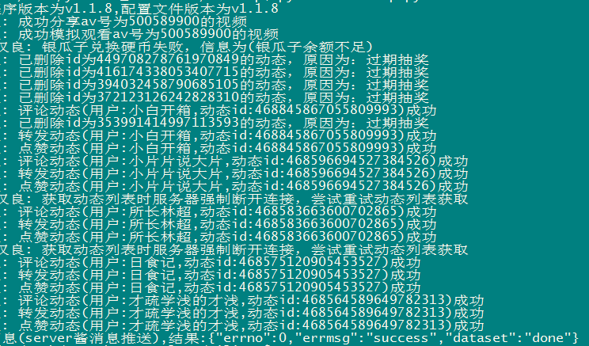

1

代码在这里：

https://github.com/happy888888/BiliExp

总体是一个运行然后退出的逻辑，需要借助cron这些工具来实现定时运行。

这样也挺好。

使用步骤：

1、把代码下载到Linux上。

2、修改config/config.json文件。把大部分都设置为false。我基本只使能了抽奖的。

3、重点的cookie数据设置。浏览器按F12，复制需要的3个东西。（拖动选择，然后按ctrl+C可以复制）

4、python3 BiliExp.py就可以了。这个脚本没有依赖太多东西，所以运行正常。不到一分钟运行完成。



5、完成后，会推送一条消息到你的微信，这个是靠Server酱的服务来做的。我之前有一个key，所以可以用。


银瓜子是什么？这个是看直播相关的，我从不看直播。所以不管。

所以银瓜子换硬币的，可以禁用掉。

这个比较适合部署到github actions来运行。


代码使用了python asyncio来做。

后面发现转发抽奖信息有点乱来。在根本不是抽奖的动态下，也乱发。

让我挺尴尬的。

我打算用nodejs来实现这个脚本的抽奖部分，其余的一概不要。


抽奖关键字的正则表达式可以完善一下。

建议只使用官抽，而不是关键字匹配的非官抽。

官抽是明确开奖时间的。

非官抽由关键字匹配得到，并不明确开奖时间，

原up主发布动态a，路人1转发一次变成动态b，路人2转发一次变成动态c，那么a，b，c是不同的三个动态不算重复转发。


```
var pattern = /.*(转|抽|评).*(转|抽|评).*(转|抽|评).*/
```

这个是要有3个转、抽、评字。才判断符合。

```
content = "抽抽抽"
var res = pattern.test(content)
console.log("result:" +res)
```

这个不太好，很容易错误转发。

去掉这个，改成：`/.*(抽).*(奖)/`包含抽奖的才转发。

另外，有的抽奖需要规定格式。

这种比较难匹配，而且容易自己机器人的身份，就过滤掉这种。


这个正则表达式测试网站不错。

https://regex101.com/r/pXVV93/1


参考资料

1、

https://blog.csdn.net/z515878963/article/details/81184068

2、动态抽奖问题 #185

https://github.com/happy888888/BiliExp/issues/185

3、

https://www.zhihu.com/question/28042747