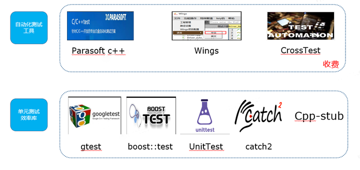
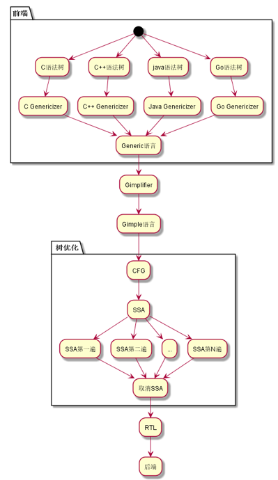

--

C/C++ 开发效率一直被业内开发人员诟病，单元测试开发效率也是如此，以至于开发人员不愿花时间来写单元测试。那么我们是不是可以通过改善编写单元测试的效率来提升项目的测试用例覆盖率？

本文主要介绍如何利用GCC插件来实现提升C/C++开发者的单元效率工具解决方案，希望对大家在提升单元测试效率上有所启发

gcc的实际过程

# 参考资料

1、C/C++ 单元自动化测试解决方案实践

https://zhuanlan.zhihu.com/p/520123398