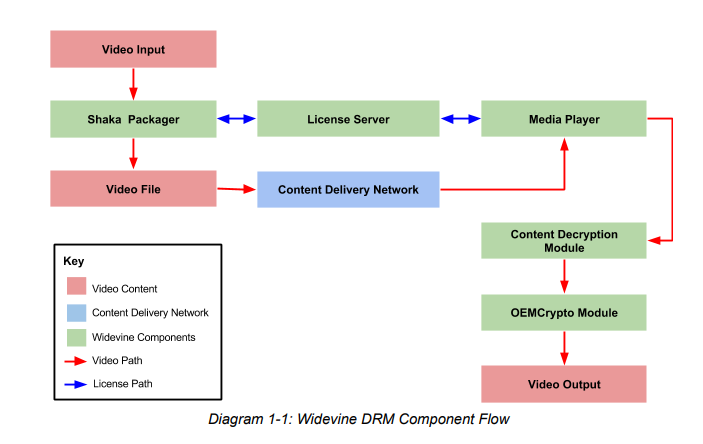

什么是DRM？

如何实现DRM？

DRM是数字版权管理，就是用来避免音频、视频被盗版的措施。


这个是一个widevine L3的破解方法。里面提供了2个文档，介绍widevine的。

https://github.com/cryptonek/widevine-l3-decryptor

# widevine架构

谷歌的widevine DRM架构提供市场领先的平台，用来分发受保护的内容。

支持向大量设备进行分发的操作。

使用了标准的免费的加密解决方案，自适应的流式播放机制，播放器支持。


给内容provider带来的价值：

一种简单的、有效的、便宜的在internet上播放streaming video的机制。


widevine有9个核心组件。

```
加密
加密媒体扩展
媒体source扩展
在http上自适应streaming
shaka打包器
widevine license server
video player，包括html5、android、ios、oem
内容解密模块
oem 加密模块
```

这些组件一起工作，来构建一个端到端的平台，来保护版权内容。

提供了所有的你需要的tools，从内容prepare阶段，到最终分发到设备上。

整个流程开始于用加密模块加密你的内容，并用Shaka打包器进行打包。

为streaming做准备。

然后使用widevine license server上的license来进行加密。

然后内容通过网络分发到用户的设备上。

用户设备也要可以访问widevine license server。

设备上收到的stream数据，交给设备上的Content Decryption Module来解密。

整个流程如下所示：



跟license server，就是一个简单的https请求和回复。

通信的内容使用protobuf来组织。


当播放器检测到内容是加密的，它通知CDM（内容解密模块）去产生一个license request。

然后播放器拿到这个request，发送给license server。

license server回复一个内容。

播放器把这个内容再告诉CDM，CDM把这个再告诉OEMCrypto 模块去解密。


OEMCrypto模块运行的可信环境TEE里。

更设备硬件绑定的。

解密的视频数据发送给video stack。


## 3个安全级别

L1：所有数据都是在TEE里完成。包括视频数据。

L2：只有关键信息在TEE里处理。视频数据不在TEE里处理。

L3：不需要有TEE硬件。


# DRM提供商

为了标准化 DRM 以及为各平台的实现提供一定的互通性，

几个 Web 巨头一起创建了通用加密标准[Common Encryption (CENC)](https://zhuanlan.zhihu.com/p/29845101/edit) 和通用的多媒体加密扩展[Encrypted Media Extensions](https://zhuanlan.zhihu.com/p/29845101/edit)，

以便为多个 DRM 提供商（例如，EME 可用于 Edge 平台上的 Playready 和 Chrome 平台上的 Widewine）构建一套通用的 API，这些 API 能够从 DRM 授权模块读取视频内容加密密钥用于解密。


Playready 和widevine都是DRM提供商。

目前主流的DRM技术有**Widevine、Playready、Marlin、Verimatrix**等。DRM技术的实现方式和与Android的对接方式都各不相同。


使用DRM技术的内容提供商，一般都有两种服务器，一种提供加密片源内容，一种提供license。

据了解目前有使用DRM技术的，应该有爱奇艺，芒果TV。

# 参考资料

1、

https://github.com/cryptonek/widevine-l3-decryptor

2、

https://w3c.github.io/encrypted-media/

3、精读加密媒体扩展（Encrypted Media Extensions，EME）

https://zhuanlan.zhihu.com/p/29845101

4、DRM在Android中

https://blog.csdn.net/ganqiuye/article/details/102905993

5、android的DRM管理

https://source.android.com/docs/core/media/drm?hl=zh-cn