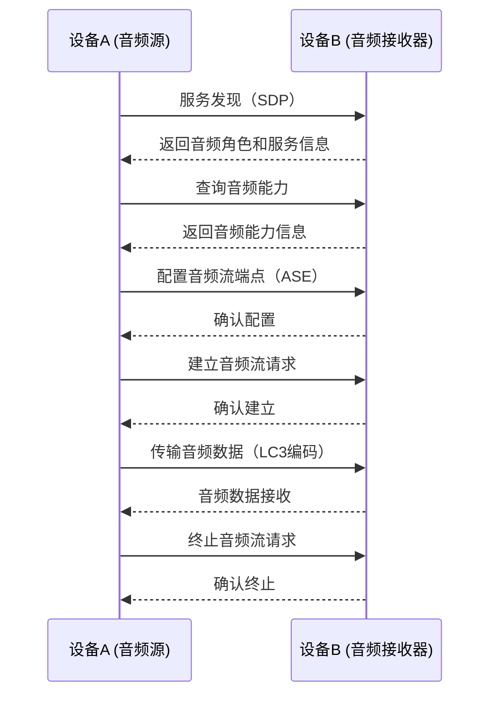
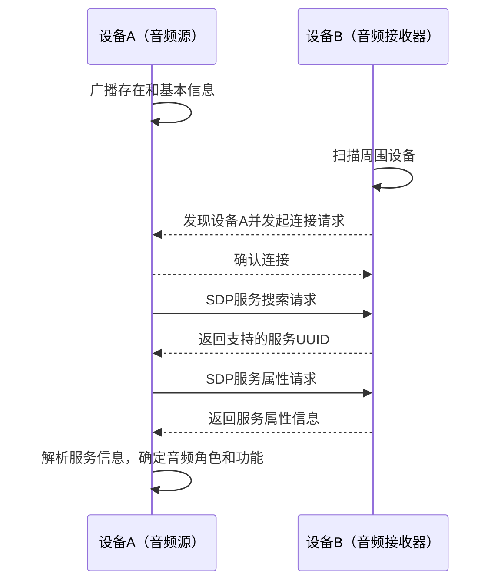
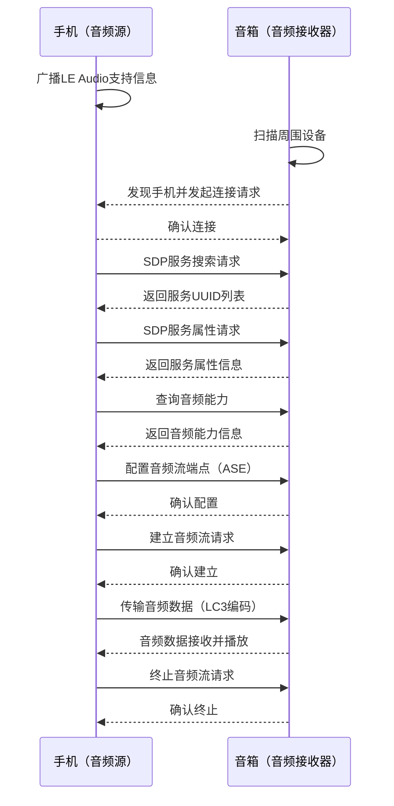
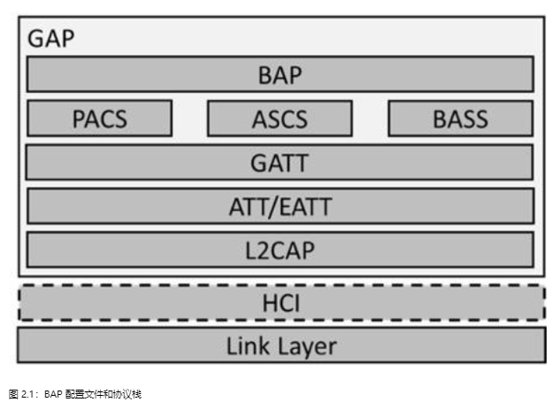
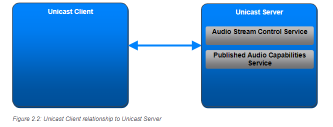

--

前面先用chatgpt对文档进行总结和提问。

# 内容概述

这个文档是《Bluetooth® Profile Specification》的一部分，具体是关于**基本音频配置文件（Basic Audio Profile, BAP）**的版本1.0，发布于2021年9月14日。文档由蓝牙技术联盟（Bluetooth SIG）旗下的通用音频工作组编写，定义了设备如何使用蓝牙低功耗（LE）无线通信来分发和/或消费音频。

### 文档主要内容
1. **简介**
   - 描述了配置文件的依赖性、兼容性、语言规范和解释规则等。
   
2. **配置**
   - 介绍了配置文件和协议栈、配置文件角色、角色和服务关系、并发限制、拓扑限制和传输依赖性等。

3. **配置文件支持要求**
   - 涵盖了BAP角色支持要求、服务支持要求、音频角色支持要求等。

4. **LC3编解码器集成**
   - 涉及LC3媒体包格式、编解码器特定能力和配置要求、多通道LC3单播和广播音频等。

5. **单播音频流传输过程**
   - 包括音频角色发现、音频能力发现、ASE控制操作等。

6. **广播音频流传输过程**
   - 讨论了广播音频流状态管理、配置、同步等。

7. **演示延迟和总系统延迟**
   - 涵盖演示延迟的各个方面及其选择参数等。

8. **通用访问配置文件要求**
   - 讨论了低功耗和BR/EDR的通用访问配置文件要求。

# 涉及的术语解释

以下是文档中的术语表，包含缩写、中文名称和基本解释：

| 缩写/术语 | 中文名称              | 基本解释                           |
| --------- | --------------------- | ---------------------------------- |
| ACAD      | 额外控制器广告数据    | 控制器在广告数据包中添加的额外数据 |
| AD        | 广告数据              | 在蓝牙广播中使用的数据             |
| AdvA      | 广告主地址            | 广告设备的地址                     |
| ASCS      | 音频流控制服务        | 管理音频流的服务                   |
| ASE       | 音频流端点            | 音频流的终端点                     |
| ATT       | 属性协议              | 蓝牙协议栈的一部分，用于管理属性   |
| BAP       | 基本音频配置文件      | 基于蓝牙低功耗的音频传输配置文件   |
| BASE      | 广播音频源端点        | 音频广播的源头端点                 |
| BIG       | 广播等时组            | 一组同步广播音频流                 |
| BIS       | 广播等时流            | 同步的广播音频流                   |
| BASS      | 广播音频扫描服务      | 用于扫描广播音频的服务             |
| BR/EDR    | 基本速率/增强数据速率 | 蓝牙经典模式，支持较高的数据速率   |
| CIG       | 连接等时组            | 一组同步连接音频流                 |
| CIS       | 连接等时流            | 同步的连接音频流                   |
| CoD       | 设备类别              | 设备的分类信息                     |
| CTKD      | 跨传输密钥派生        | 在不同传输方式间派生密钥           |
| EA        | 扩展广告              | 扩展的蓝牙广告功能                 |
| EATT      | 增强的ATT             | 提升的属性协议，支持并行处理       |
| EIR       | 扩展查询响应          | 扩展的设备查询响应                 |
| GAP       | 通用访问配置文件      | 定义设备间连接和通信的基础规范     |
| GATT      | 通用属性配置文件      | 管理蓝牙设备属性的配置文件         |
| HCI       | 主机控制器接口        | 主机和蓝牙控制器间的接口           |
| IA        | 身份地址              | 设备的唯一标识地址                 |
| IRK       | 身份解析密钥          | 用于解析设备身份的密钥             |
| LC3       | 低复杂度通信编解码器  | 一种低复杂度的音频编解码器         |
| LE        | 低功耗                | 蓝牙低功耗模式                     |
| LE ACL    | 低功耗异步连接        | 低功耗模式下的异步连接             |
| LL        | 链路层                | 蓝牙协议栈中的链路层               |
| LTK       | 长期密钥              | 用于设备间长期配对的密钥           |
| LTV       | 长度-类型-值          | 数据格式，包含长度、类型和具体值   |
| OOB       | 带外                  | 带外数据传输，通常用于配对         |
| PA        | 周期性广告            | 定期发送的广告数据                 |
| PAC       | 公布音频能力          | 设备的音频能力信息                 |
| PACS      | 公布音频能力服务      | 用于公布设备音频能力的服务         |
| PAST      | 周期性广告同步传输    | 周期性广告的同步传输               |
| PDU       | 协议数据单元          | 蓝牙数据包                         |
| QoS       | 服务质量              | 网络服务的性能指标                 |
| RFU       | 预留供将来使用        | 未来可能使用的预留字段             |
| SDU       | 服务数据单元          | 服务层的数据单元                   |
| UI        | 用户界面              | 用户与设备交互的界面               |
| UUID      | 通用唯一标识符        | 全球唯一标识符，用于标识服务和特征 |

# 简单说明一下BAP

**基本音频配置文件（Basic Audio Profile, BAP）** 是蓝牙技术联盟发布的一个配置文件，旨在利用蓝牙低功耗（LE）技术实现高效的音频传输。BAP定义了设备如何通过蓝牙低功耗进行音频的分发和消费，以确保不同设备之间的互操作性和性能。

### BAP的主要特点
1. **支持单播和广播音频传输**：
   - 单播音频：点对点的音频传输。
   - 广播音频：一个设备向多个设备传输音频数据。

2. **音频编解码器**：
   - 使用LC3（低复杂度通信编解码器）进行音频编码，提供高质量的音频传输，同时保持低功耗。

3. **音频流管理**：
   - 定义了音频流端点（ASE）和音频流控制服务（ASCS）来管理音频流的建立、控制和终止。

4. **服务质量（QoS）管理**：
   - 确保音频传输的可靠性和性能，满足不同应用的需求。

5. **多设备支持**：
   - 允许设备同时管理多个音频流，支持复杂的音频应用场景。

### BAP的应用场景
- **无线耳机和助听器**：提供高质量的音频流，支持低延迟和高同步性。
- **家庭娱乐系统**：通过广播音频实现多个设备的音频同步。
- **会议系统**：支持多方音频通信和高质量的语音传输。

BAP通过标准化蓝牙低功耗音频传输，提升了音频设备的互操作性和用户体验，广泛应用于个人音频、家庭娱乐和专业音频领域。

# 说明一下单播的工作流程

**单播音频传输流程** 是基本音频配置文件（BAP）中的一个重要部分，描述了设备如何通过蓝牙低功耗（LE）技术进行点对点的音频传输。以下是单播音频流传输的基本工作流程：

### 单播音频流传输流程
1. **音频角色发现**
   - 设备首先通过服务发现协议（SDP）发现对方设备支持的音频角色和相关服务。

2. **音频能力发现**
   - 设备查询并获取对方设备的音频能力信息，包括支持的编解码器、采样率等。

3. **音频流端点（ASE）配置**
   - 配置音频流端点，确定传输参数如编解码器类型、采样率和通道数。

4. **音频流控制**
   - 使用音频流控制服务（ASCS）来管理音频流的建立、修改和终止。控制包括以下步骤：
     - **音频流建立**：通过建立请求启动音频流传输。
     - **音频流修改**：在传输过程中，可以根据需要修改传输参数。
     - **音频流终止**：结束音频流传输。

5. **音频数据传输**
   - 音频数据通过音频流端点进行传输，使用低复杂度通信编解码器（LC3）进行编码和解码，确保高质量音频传输。

### 工作流程示意图



### 关键步骤说明
1. **服务发现（SDP）**：设备A使用服务发现协议查找设备B支持的音频服务。
2. **音频能力发现**：设备A获取设备B的音频能力信息，确保双方兼容。
3. **音频流端点配置**：设备A配置设备B的音频流端点，设置传输参数。
4. **音频流建立和控制**：通过音频流控制服务，设备A与设备B建立音频流，并在需要时修改或终止流。
5. **音频数据传输**：实际音频数据通过LC3编码传输，实现高质量音频传输。

通过以上流程，BAP确保设备能够高效、稳定地进行单播音频传输，满足用户对音频质量和传输性能的需求。


# 服务发现具体是怎么进行的

在蓝牙基本音频配置文件（BAP）中，服务发现过程是设备间建立通信的第一步。服务发现协议（SDP）用于查找对方设备支持的服务和角色，以便配置和管理后续的音频流传输。以下是服务发现的具体步骤：

### 服务发现具体步骤

1. **设备广播和扫描**
   - **设备A（音频源）**开始广播其存在和基本信息。
   - **设备B（音频接收器）**进行扫描，发现周围可连接的设备。

2. **设备连接**
   - 设备B扫描到设备A后，发起连接请求，双方建立蓝牙连接。

3. **服务发现协议（SDP）初始化**
   - 连接建立后，设备A和设备B交换信息，开始服务发现过程。

4. **服务搜索请求**
   - 设备A发送SDP服务搜索请求，查询设备B支持的服务UUID。
   - 服务搜索请求包含目标服务的UUID列表，设备B根据请求返回其支持的服务。

5. **服务属性请求**
   - 设备A对设备B返回的服务进行进一步查询，发送SDP服务属性请求，获取详细的服务属性信息（如服务类ID、协议描述符列表、特征等）。

6. **解析服务信息**
   - 设备A解析从设备B接收到的服务属性信息，确定设备B的音频角色和支持的功能（如支持的编解码器、采样率等）。

### 服务发现流程图



### 关键步骤说明

1. **广播和扫描**：设备A通过广播方式宣布其存在，设备B扫描周围设备以找到设备A。
2. **设备连接**：设备B发现设备A后，发起连接请求，建立蓝牙连接。
3. **SDP服务搜索请求**：设备A查询设备B支持的服务UUID列表，初步了解设备B的功能。
4. **SDP服务属性请求**：设备A进一步请求设备B的服务属性，获取详细的服务描述信息。
5. **解析服务信息**：设备A根据设备B返回的信息，确定其音频角色和支持的音频功能，准备配置音频流。

通过服务发现，设备A和设备B能够相互了解对方的能力和支持的服务，为后续的音频流传输建立基础。这个过程确保了设备间的兼容性和互操作性。

# 手机通过leaudio播放音乐到支持leaudio的音箱，这个过程描述

### 手机通过LE Audio播放音乐到支持LE Audio的音箱的过程

蓝牙低功耗音频（LE Audio）为设备之间提供了高效的音频传输方式，以下是手机通过LE Audio播放音乐到支持LE Audio的音箱的详细过程：

### 1. 配对和连接

#### 广播和扫描
- **手机（音频源）**开始广播其存在和LE Audio的支持信息。
- **音箱（音频接收器）**扫描周围设备，发现支持LE Audio的手机。

#### 建立连接
- **音箱**发现手机后，发起连接请求。
- **手机**接受连接请求，建立蓝牙连接。

### 2. 服务发现

#### 服务搜索
- **手机**发送SDP服务搜索请求，查询**音箱**支持的服务UUID。
- **音箱**返回支持的服务UUID列表。

#### 服务属性查询
- **手机**发送SDP服务属性请求，获取**音箱**的详细服务属性信息。
- **音箱**返回服务属性信息，包括音频流端点（ASE）的相关信息。

### 3. 音频流端点（ASE）配置

#### 能力发现
- **手机**查询**音箱**的音频能力，获取支持的编解码器、采样率等信息。
- **音箱**返回其支持的音频能力信息。

#### 配置音频流端点
- **手机**根据音箱的能力配置音频流端点（ASE），设置传输参数（如LC3编解码器类型、采样率、通道数）。
- **音箱**确认配置。

### 4. 音频流控制

#### 建立音频流
- **手机**通过音频流控制服务（ASCS）向**音箱**发送建立音频流请求。
- **音箱**确认建立音频流。

### 5. 音频数据传输

#### 音频编码
- **手机**将音乐数据通过LC3编解码器进行编码，确保高质量和低延迟的音频传输。

#### 数据传输
- **手机**开始向**音箱**传输音频数据。
- **音箱**接收音频数据，解码并播放音乐。

### 6. 结束传输

#### 终止音频流
- **手机**发送终止音频流请求。
- **音箱**确认终止音频流，结束音乐播放。

### 过程流程图



### 关键步骤说明

1. **配对和连接**：手机与音箱建立蓝牙连接。
2. **服务发现**：手机通过SDP获取音箱支持的服务和音频能力信息。
3. **配置音频流端点（ASE）**：根据音箱的能力配置音频传输参数。
4. **音频流控制**：通过ASCS建立、管理和终止音频流。
5. **音频数据传输**：手机编码音乐数据并传输至音箱，音箱解码并播放音乐。

通过以上步骤，手机可以通过LE Audio技术高效地向音箱传输音乐，实现高质量的无线音频播放。

# 音箱这边假如是运行linux系统，那么应该使用什么进程来支持unicast server功能？有没有现成的开源方案？

在运行Linux系统的音箱上支持单播服务器（Unicast Server）功能，可以使用现有的开源蓝牙协议栈和音频框架。以下是一些常见的开源方案：

### 使用BlueZ协议栈

**BlueZ**是Linux上官方的蓝牙协议栈，支持LE Audio和基本音频配置文件（BAP）。BlueZ可以配置并运行单播服务器功能。以下是实现步骤：

1. **安装BlueZ**：
   ```bash
   sudo apt-get install bluez
   ```

2. **配置BlueZ**：
   配置BlueZ以支持LE Audio功能。需要确保BlueZ的版本支持LE Audio，最好使用最新版本。

3. **编写或使用现有的LE Audio示例**：
   可以参考BlueZ中的示例代码或社区项目来实现单播服务器功能。可以查看BlueZ的源代码和文档来编写自定义服务。

### 使用PipeWire音频服务器

**PipeWire**是一个多媒体服务器，支持音频和视频的流媒体传输，并具有很好的扩展性。它正在逐步取代PulseAudio，并增加对LE Audio的支持。

1. **安装PipeWire**：
   ```bash
   sudo apt-get install pipewire pipewire-audio-client-libraries
   ```

2. **配置PipeWire**：
   配置PipeWire以支持蓝牙音频。需要确保PipeWire的蓝牙模块已启用并配置正确。

3. **使用PipeWire的蓝牙支持**：
   PipeWire已经在其音频堆栈中集成了对蓝牙音频的支持，包括LE Audio。

### 使用bluez-alsa

**bluez-alsa**项目为BlueZ提供了一个ALSA后端，使其能够处理蓝牙音频，包括LE Audio。它将蓝牙音频设备作为ALSA设备来处理。

1. **安装bluez-alsa**：
   
   ```bash
   git clone https://github.com/Arkq/bluez-alsa.git
   cd bluez-alsa
   mkdir build
   cd build
   cmake ..
   make
   sudo make install
```
   
2. **配置bluez-alsa**：
   通过配置文件和命令行参数配置bluez-alsa以支持LE Audio和单播服务器功能。

### 示例配置

以下是使用BlueZ和bluez-alsa配置单播服务器的示例流程：

1. **启动BlueZ**：
   ```bash
   sudo systemctl start bluetooth
   ```

2. **配置BlueZ以支持LE Audio**：
   编辑`/etc/bluetooth/main.conf`，确保支持LE Audio的选项已启用。

3. **运行bluez-alsa**：
   ```bash
   sudo bluealsa &
   ```

4. **配置音频设备**：
   使用ALSA或PipeWire配置音频设备以使用bluez-alsa提供的蓝牙音频支持。

### 总结

使用BlueZ协议栈结合bluez-alsa或PipeWire可以在运行Linux系统的音箱上支持单播服务器功能。这些开源方案提供了对LE Audio的支持，并可以通过配置和扩展实现具体的功能需求。BlueZ作为基础的蓝牙协议栈，结合其他音频框架，可以有效地处理蓝牙音频传输，包括LE Audio的单播和广播功能。

# ============后面是文档翻译的部分内容===================

# 介绍

BAP是Basic Audio Profile的缩写。

定义了使用GATT和GAP在LE连接上进行Audio Stream控制的场景。

例如：

* 发送和接收单播的audio
* 发送和接收广播的audio

## profile依赖

BAP依赖了这些基础的profile：

* GATT
* GAP
* ASCS: Audio Stream Control Service
* PACS: Published Audio Capabilities Service
* BASS: Broadcast Audio Scan Service
* LL: Link Layer

## 一致性

如果声明符合本规范，则应以指定方式支持本规范强制规定的所有功能（过程强制）。这也适用于指示支持的所有可选和条件功能。

## 蓝牙核心规范版本兼容

要求蓝牙5.2以上版本。

## 语言

### 语言转换

就是说明shall、must、will、should、may、can、is、note这些词在规范里的内涵。

### 预留字段

就是协议里的预留字段。

缩写词 RFU 相当于“保留供将来使用

### 禁止

当字段值是枚举时，可以将未分配的值标记为“禁止”。

这些值永远不会被实现使用，

以及接收到的任何包含禁止值的消息不予理会，不予处理，不予回应。

其中字段、参数或其他变量对象可以接受一系列值，

而有些值是描述为“禁止”的设备不得将对象设置为任何这些禁止值。

一个设备接收具有这样一个值的对象应该拒绝它以及包含它的任何数据结构
错误的。

“Prohibited”从不缩写。

## 一般解释规则

### 二进制和十六进制

#### 位值规则

### 数组参数


## 术语

# 配置

## profile和协议栈

BAP在协议栈里的位置：



## profile roles

BAP这个profile里定义了6个角色：

* unicast server
* unicast client
* broadcast source
* broadcast sink
* broadcast Assistant
* Scan Delegator

### 单播相关的角色

单播有2个角色：

* Unicast Server
* Unicast Client

#### Unicast Server

server会做这些事情：

* 进行广播，这样client就可以发现server并进行连接。
* 暴露ATT，这样client就可以知道server的audio capability
* 暴露ATT，这样client就可以discover、configure、control server的ASE属性
* 暴露自己的availability，是否可以进行Audio Stream的传输。
* 接受CIG的建立，CIG可以有一个或者多个CIS，用来传输单播音频流。

* server可以终止CIS。

#### Unicast Client

* client会扫描广播，并建立跟server的连接。
* 发现server的传输音频的可用性。
* 发现并使用server的ATT，确定server的音频功能和role支持。
* 发现server的用于configure和control的ASE属性。
* 配置并建立一个或多个CIG。
* client也可以终止CIG。

### 广播角色

BAP的广播角色有4个：

* 广播源
* 广播接收器。
* 广播助理。
* 扫描委托者。

#### 广播源

* 广播源配置并建立一个或者多个BIG，每个BIG包含一个或者多个广播音频流BIS。
* 传输描述广播流配置的数据。

## Profile role和service relationship

对应关系是这样：

| role       | service          |
| ---------- | ---------------- |
| 单播服务器 | GATT服务器       |
| 单播客户端 | GATT客户端       |
| 广播源     | 没有GATT角色要求 |
| 广播接收器 | GATT服务器       |
| 广播助理   | GATT客户端       |
| 扫描委托者 | GATT服务器       |



## 并发限制和约束

在一个连接中，一个device不能同时是单播服务器和单播客户端的角色。

## 拓扑限制和约束

单播客户端应该是GAP Central role

单播服务器应该是GAP Peripheral role

广播源应该是GAP Broadcaster role

....

这些描述还有一大堆。

## 传输依赖

需要使用BLE。

# profile支持要求

## BAP role支持要求

## 服务器支持要求

## audio role支持要求

## LL 支持要求

## 单播服务器支持要求

### ATT和EATT传输要求

### 其他要求

### 附加音频流控制服务要求

## 单播客户端支持要求

