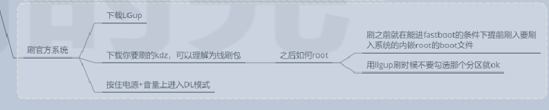
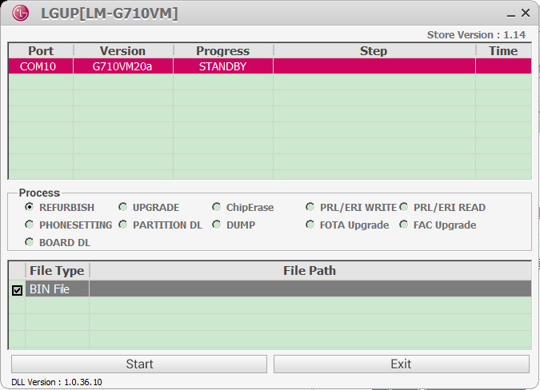

1

入手了一台LG G7 美版Verizon机器。

用了几天，目前使用正常。买这台机器的主要目的就是刷机折腾。所以现在就开始吧。

主要参考的资料：

<https://g7.lge.fun/>

对应的QQ群是：275250706

主要的贡献者是：黑字。

我手里的机器目前是默认带了root的，版本是Android9.0 的。

先刷官方系统练一下手。

这个网站不是官方的。

https://lg-firmwares.com/lg-lmg710vm-firmwares/#tab=firmwares

其他版本刷los,怎么操作??先刷欧版?然后和欧版一样操作?
刷任意9.0即可，如果你不知道刷那个就刷欧版吧。

现在

LGUP工具。是一个烧录工具。

https://lgflash.com/LGUP/

我另外找了破解版本的1.4.13版本的。需要安装驱动才行。

会有usb转串口识别出来。界面是这样的。

refurbish，这个单词的意思是翻新。

参考这篇文章，就可以进行官方的刷机。

http://bbs.gfan.com/android-9315398-1-1.html

就使用refurbish，bin file选择下载的kdz文件。

我的最终目的是刷lineageos。

Verizon版本的，关键在于混刷。

可以混刷哪些版本的呢？

混刷后如何root？

这里有LG G7全系列混刷的方法。要登陆一下才能看到图片。

http://bbs.gfan.com/android-9554784-1-1.html

手机关机按住音量上键连接USB进入刷机模式

[实用教程] LG G7 S版混刷韩版20f root+本地化 [复制链接]

http://bbs.gfan.com/android-9593417-1-1.html

混刷

https://g7.lge.fun/guide/mix.html

混刷过程大概3分钟。

进download模式，是先关机，然后按住音量加，插入usb就好了。

先还是把工具搞清楚。

LG UP里的dump是做什么作用的？我觉得是把当前手机里的镜像保存下来的。

但是当前的工具dump会失败。

退出download模式，界面上有提示，是长按电源减+音量减。

G7韩版从默认固件到刷别的东西或者官方的第一个出厂固件都没有，美版和其他版本在8.0可以进入fastboot，而欧版不管刷什么固件都会有fastboot，T版动一下就砖，V版固件的fastboot是花瓶。

Download模式是LG刷固件的模式，没了我怎么刷固件？

这个是一个拆机图文。

https://tieba.baidu.com/p/5908112979?red_tag=3057825799

ulm：这个是无锁的美国机器。

可以在这里查询到手机imei对应的信息。

http://www.lgbbs.com/plugin.php?id=lg_mobile&imei=355933091803174