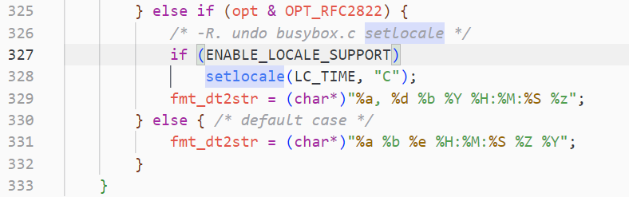
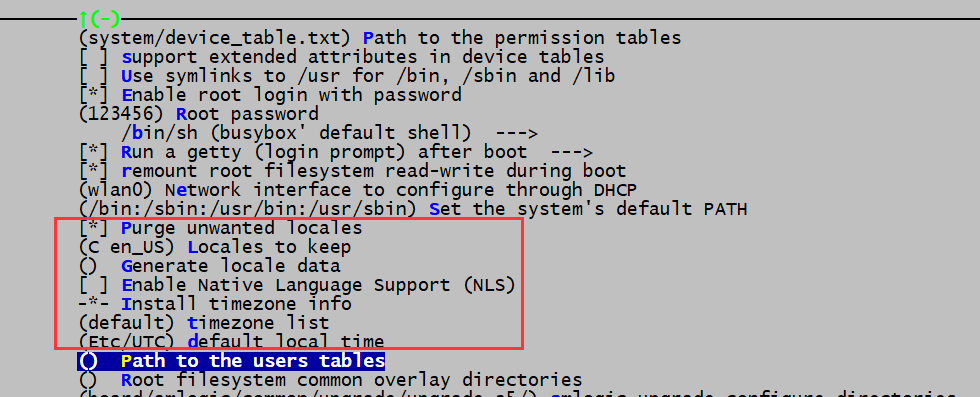

--

在很多的shell脚本中，我们经常会看见某一句命令的前面有一句“LC_ALL=C”

SAR_CMD="LC_ALL=C sar -u -b 1 5 | grep -i average "

这到底是什么意思？

==LC_ALL=C 是为了去除所有本地化的设置，让命令能正确执行。==

在Linux中通过locale来设置程序运行的不同语言环境，

locale由ANSI C提供支持。

locale的命名规则为<语言>_<地区>.<字符集编码>，

如zh_CN.UTF-8，zh代表中文，CN代表大陆地区，UTF-8表示字符集。

在locale环境中，有一组变量，代表国际化环境中的不同设置：

LC_COLLATE

定义该环境的排序和比较规则

\7.  LANG
LC_*的默认值，是最低级别的设置，如果LC_*没有设置，则使用该值。类似于 LC_ALL。

\8.  LC_ALL

它是一个宏，如果该值设置了，则该值会覆盖所有LC_*的设置值。注意，LANG的值不受该宏影响。

C"是系统默认的locale，"POSIX"是"C"的别名。所以当我们新安装完一个系统时，默认的locale就是C或POSIX。

# 什么是locale

 locale这个单词中文翻译成地区或者地域，

其实这个单词包含的意义要宽泛很多。

Locale是根据计算机用户所使用的语言，所在国家或者地区，以及当地的文化传统所定义的一个软件运行时的语言环境。

  上面这个解释摘上网上，说得好玄乎，举两个简单的例子：

  a）在“简体中文”的环境，运行df命令，第一行显示的是：

文件系统        1K-块    已用   可用 已用% 挂载点

​    而在“繁体中文”的环境下，运行df命令，第一行显示的是：

檔案系統        1K-區段   已用   可用 已用% 掛載點

  b）在中文环境下运行date命令，显示的是

2013年 01月 27日 星期日 15:57:01 CST

​    而在英文环境下，运行date命令，显示的是

Sun Jan 27 15:57:46 CST 2013

看到上面两个例子，我想应该比较清楚了，

不同地区对一些计算机词汇、日期显示等方面都有各自的习惯，

比如中国大陆通常使用“文件系统”，而台湾或者香港地区则会用“檔案系統”，

这显然不是简单的从简体到繁体的转换而已，

所以可以想像，有一套系统在为各个地区的本地化服务。

locale把按照所涉及到的使用习惯的各个方面分成12个大类，这12个大类分别是： 

1、语言符号及其分类(LC_CTYPE) 

2、数字(LC_NUMERIC) 

3、比较和习惯(LC_COLLATE) 

4、时间显示格式(LC_TIME) 

5、货币单位(LC_MONETARY) 

6、信息主要是提示信息,错误信息,状态信息,标题,标签,按钮和菜单等(LC_MESSAGES) 

7、姓名书写方式(LC_NAME) 

8、地址书写方式(LC_ADDRESS) 

9、电话号码书写方式(LC_TELEPHONE) 

10、度量衡表达方式 (LC_MEASUREMENT) 

11、默认纸张尺寸大小(LC_PAPER) 

12、对locale自身包含信息的概述(LC_IDENTIFICATION)。

而这些信息的配置通常放在/usr/share/i18n/locales目录下，

让我们打开一下zh_CN和en_US，

看看里面都定义了一些什么东西和有一些什么区别，

对比一个比较简单的，LC_TIME有这样的定义

# 如何配置locale

单独输入locale命令，可以查看当前的locale信息

```
LANG=en_US.UTF-8
LANGUAGE=
LC_CTYPE="en_US.UTF-8"
LC_NUMERIC=zh_CN.UTF-8
LC_TIME=zh_CN.UTF-8
LC_COLLATE="en_US.UTF-8"
LC_MONETARY=zh_CN.UTF-8
LC_MESSAGES="en_US.UTF-8"
LC_PAPER=zh_CN.UTF-8
LC_NAME=zh_CN.UTF-8
LC_ADDRESS=zh_CN.UTF-8
LC_TELEPHONE=zh_CN.UTF-8
LC_MEASUREMENT=zh_CN.UTF-8
LC_IDENTIFICATION=zh_CN.UTF-8
LC_ALL=
```

可以看到当前的时间是中文格式的。`LC_TIME=zh_CN.UTF-8`

所以，我们输入date命令查看到的是中文的日期：

```
 date
2024年 04月 08日 星期一 15:19:41 CST
```

可以这样来查看英文格式：

```
 LC_TIME=en_US.utf8 date
Mon Apr  8 15:21:35 CST 2024
```

date命令里是怎么处理locale信息的呢？

看busybox的date.c文件里，有对setlocale的调用。



## setlocale函数

`setlocale()` 函数是 C 标准库中的一个函数，用于设置当前程序的 locale（区域设置）。它的声明如下：

```c
#include <locale.h>

char *setlocale(int category, const char *locale);
```

这个函数的作用是设置当前程序的 locale，并返回先前设置的 locale。它接受两个参数：

- `category`：表示要设置的 locale 的类别。可以是以下常量之一：
  - `LC_ALL`：表示设置所有的 locale 类别。
  - `LC_COLLATE`：表示设置字符串比较和排序的 locale 类别。
  - `LC_CTYPE`：表示设置字符分类和转换的 locale 类别。
  - `LC_MONETARY`：表示设置货币格式的 locale 类别。
  - `LC_NUMERIC`：表示设置数字格式的 locale 类别。
  - `LC_TIME`：表示设置日期和时间格式的 locale 类别。
- `locale`：表示要设置的 locale。通常是一个字符串，比如 "en_US.UTF-8" 表示美国英语（English）的 UTF-8 编码的 locale。

`setlocale()` 函数会根据参数指定的 locale 设置当前程序的 locale，并返回先前设置的 locale。如果设置成功，则返回指向先前 locale 字符串的指针；如果设置失败，则返回 NULL。

注意，`setlocale()` 函数不保证线程安全，因此在多线程环境下使用时要注意加锁。另外，locale 的名称和支持的类别可能因操作系统和环境而异，因此需要根据具体的环境来选择合适的 locale 设置。

### setlocale函数是标准C库函数吗

是的，`setlocale()` 函数是 C 标准库函数之一。它定义在 `<locale.h>` 头文件中，并且是标准 C 库的一部分。`setlocale()` 函数的目的是设置程序的 locale（区域设置），以控制一些与 locale 相关的行为，比如字符分类、字符串比较、日期和时间格式化等。

虽然 `setlocale()` 是标准 C 库函数，但是在不同的操作系统和平台上，它的行为可能会有所不同。因此，在使用时需要考虑到目标平台的特性和支持的 locale 类别，以确保正确的行为。

看看musl的locale.h的内容：

```
#define LC_CTYPE    0
#define LC_NUMERIC  1
#define LC_TIME     2
#define LC_COLLATE  3
#define LC_MONETARY 4
#define LC_MESSAGES 5
#define LC_ALL      6

```

# LC_ALL、LANG和LC_*的关系

设定locale就是设定12大类的locale分类属性，即 12个`LC_*`。

==除了这12个变量可以设定以外，为了简便起见，还有两个变量： LC_ALL和LANG。==

它们之间有一个优先级的关系： LC_ALL>LC_*>LANG 可以这么说，LC_ALL是最上级设定或者强制设定，而LANG是默认设定值。

  重新打开一个窗口，使得LC_ALL、LANG和LC_*都回到原来的状态，看一下各个变量的默认值。


可以看到LC_*的值随着默认值LANG的变化而变化。而此时，运行date


# locale -a

查看当前系统所有可用的locale

```
C
C.UTF-8
en_AG
en_AG.utf8
en_AU.utf8
en_BW.utf8
en_CA.utf8
en_DK.utf8
en_GB.utf8
en_HK.utf8
en_IE.utf8
en_IL
en_IL.utf8
en_IN
en_IN.utf8
en_NG
en_NG.utf8
en_NZ.utf8
en_PH.utf8
en_SG.utf8
en_US.utf8
en_ZA.utf8
en_ZM
en_ZM.utf8
en_ZW.utf8
POSIX
zh_CN.utf8
```


# /usr/share/i18n/locales 这个目录

`/usr/share/i18n/locales` 目录是用于存储 locale 配置文件的地方。

在 Linux 系统中，locale 文件包含了本地化相关的信息，

例如语言、日期、时间格式、货币符号等等。

这些文件描述了特定地区或语言的本地化规则，

以便系统和应用程序可以根据用户的首选语言环境来进行适当的本地化。

在 `/usr/share/i18n/locales` 目录下，你会找到许多以语言和地区命名的文件，比如 `en_US`、`zh_CN` 等等。

这些文件以文本格式保存，可以使用文本编辑器打开查看和编辑。

每个 locale 文件中包含了一系列的环境变量和设置，用来定义特定地区或语言的本地化规则。

一般来说，如果需要更改或自定义特定地区或语言的本地化设置，你可以编辑对应的 locale 文件。

然后，使用 `locale-gen` 命令来生成新的 locale 数据文件，以便系统和应用程序可以使用这些新的设置。

# 跟locale相关的目录和环境变量还有哪些

除了 `/usr/share/i18n/locales` 目录外，与 locale 相关的其他目录和环境变量包括：

1. `/etc/locale.conf`：这个文件用于设置系统的默认 locale。在大多数 Linux 发行版中，你可以在这个文件中指定默认的语言环境和相关设置。

2. `/usr/lib/locale/`：这个目录包含系统默认的 locale 数据文件。通常情况下，这些文件由系统自动生成，用于提供给程序和系统使用。

3. `LANG`、`LC_ALL`、`LC_CTYPE`、`LC_COLLATE` 等环境变量：这些环境变量用于控制不同方面的本地化设置，比如语言、字符分类、排序顺序等等。下面是一些常用的 locale 相关环境变量：
- `LANG`：设置系统默认的语言环境。
   - `LC_ALL`：覆盖所有其他 locale 相关的设置，如果设置了 `LC_ALL`，那么其他的 `LC_*` 环境变量将会被忽略。
   - `LC_CTYPE`：设置字符分类和字符映射相关的设置，比如字符编码、字符类别等。
   - `LC_COLLATE`：设置字符串比较和排序相关的设置，比如字符串排序的规则等。

这些目录和环境变量都是与 locale 相关的重要部分，可以用来配置系统和应用程序的本地化行为。通过编辑相应的文件或设置环境变量，你可以定制系统的语言环境和本地化规则，以满足特定的需求。

# buildroot里如何定制locale信息

我发现我的buildroot里都没有locale这个命令。

而且LC_ALL、LANG、LC_TIME这些都的空的。

但是并不影响我的buildroot系统支持显示utf8的中文，包括文件名和文件内容的cat显示。



从menuconfig的system配置里，可以看到有这几个配置项。


## Etc/UTC 这个时区信息是什么

`Etc/UTC` 是一个时区标识符，表示世界标准时间（Coordinated Universal Time，UTC）。

UTC 是一个国际标准的时间标准，它与格林威治标准时间（Greenwich Mean Time，GMT）基本相同，

通常被用作全球统一的时间标准。

在 Linux 系统中，`/etc/UTC` 是一个文件路径的一部分，

通常指向位于 `/usr/share/zoneinfo` 或 `/usr/share/zoneinfo/Etc` 目录下的一个文件，这个文件包含了与 UTC 相关的时区信息。

当系统使用 `Etc/UTC` 时区标识符时，表示系统当前采用的是世界标准时间。

UTC 不考虑夏令时（Daylight Saving Time，DST）的影响，因此与其他使用夏令时的时区相比，它的时间不会因为夏令时的调整而改变。

总的来说，`Etc/UTC` 表示系统使用的是世界标准时间，也称为协调世界时（Coordinated Universal Time，UTC），它是全球通用的时间标准。


# 参考资料

1、LC_ALL=C的含义

https://blog.csdn.net/zahuopuboss/article/details/9249753

2、

https://www.cnblogs.com/LCcnblogs/p/6208110.html