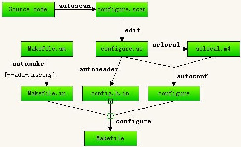

1

autotools是指3个gnu工具包。

autoconf、automake、libtool。

gnu软件的安装步骤，一般是三步走：

```
1、configure。
2、make
3、make install。
```

configure这一步，就需要一个configure文件，而这个文件比较复杂，手写不现实。

autoconf这个工具就是用来帮我们生成configure文件的。


当然如果你想搭建自己的采用automake编译的项目，那么你需要再去学习一下如何编写configure.ac和Makefile.am文件。

一般我们从github上clone下来的需要采用automake编译的项目都包含了configure.ac和Makefile.am文件或者里面还包含了一个autogen.sh的脚本（一般都是调用了autoreconf这个工具）。编译这样一个项目基本上可以三步完成：

1. 在项目根目录运行"autoreconf　-if",　你会发现项目目录下会多出m4文件目录, config.h.in文件, Makefile.in文件, configure脚本, compile脚本, depcomp脚本等文件；
2. 接着运行./configure进行配置生成makefile文件，譬如enbale/disbale一些特性，设置交叉编译平台（例如--host=linux-mips），设置编译安装目录（例如--prefix=path_to_your_build_directory）具体可以查看help信息；
3. 执行make && make install。


# autoconf

为什么出现了autoconf？

最开始，发布的代码，都是直接带Makefile的，拿到源代码，直接make就好了。

但是随着软件在不同平台上使用，Makefile需要做很多的调整。

而且有些平台可能没有某些函数，例如有些平台不支持strdup这个系统调用。

这些调整比较多，而且琐碎，所以大家就开始手动写configure脚本来自动做这些调整工作。

configure脚本做的事情：

1、先检查当前的环境的，

2、生成一个config.h文件。里面就各种宏定义。

3、生成一个正对当前平台的Makefile。

很快，大家就发现，写configure脚本也是一个很烦人的事情。

于是就开发了autoconf来帮助生成configure文件。

**但是还是需要一个简单的配置文件configure.ac。**


# automake

前面说到autoconf帮我们生成了configure脚本。

但是Makefile的模板文件Makefile.in还是需要程序员手动来写。

这个又是一个烦人的事情，而且是很多重复性的工作。

所以最好也是靠工具来生成。这个工具就是automake。

**程序员只需要手写一个Makefile.am文件来描述依赖关系就好了。**


# 一个简单的例子

代码我放在这里：

https://github.com/teddyxiong53/c_code/tree/master/autotools/earth

执行：

```
autoreconf --install
```

这个会生成configure等文件。

然后就可以执行：

```
./configure
make
```

我增加了一个myclean.sh脚本。可以把生成的所有文件都清除掉。





## autoscan: 

扫描源代码以搜寻普通的可移植性问题，比如检查编译器，库，头文件等，生成文件configure.scan,它是configure.ac的一个雏形。

## aclocal:

根据已经安装的宏，用户定义宏和acinclude.m4文件中的宏

将configure.ac文件所需要的宏集中定义到文件 aclocal.m4中。

aclocal是一个perl 脚本程序，

它的定义是：“aclocal - create aclocal.m4 by scanning configure.ac”


## automake:

将Makefile.am中定义的结构建立Makefile.in，

然后configure脚本将生成的Makefile.in文件转换 为Makefile。

如果在configure.ac中定义了一些特殊的宏，

比如AC_PROG_LIBTOOL，它会调用libtoolize，

否则它 会自己产生config.guess和config.sub


## autoconf:

将configure.ac中的宏展开，生成configure脚本。

这个过程可能要用到aclocal.m4中定义的宏。


以一个main.c和hello.h为例。

先执行autoscan命令，得到configure.scan文件。

手动修改configure.scan文件。然后把文件改名为configure.ac。

然后执行aclocal命令。

得到了aclocal.m4文件。内容较多，不去读里面的内容。

然后执行autoconf命令。

就生成了configure这个文件。

内容也很多，不可读。

然后执行autoheader命令。生成config.h.in文件。

然后需要手动写Makefile.am文件。

```
AUTOMAKE_OPTIONS=foreign 
bin_PROGRAMS=hello 
hello_SOURCES=hello.cpp hello.h
```

然后执行automake，

```
automake --add-missing
```

这一步是为了上传Makefile.in，`--add-missing`是为了自动补全缺少的脚本。

然后就可以进行configure和make了。


noinst_HEADERS：

这个表示该头文件只是参加可执行文件的编译，而不用安装到安装目录下。

如果需要安装到系统中，可以用include_HEADERS来代替。


一般推荐使用libtool库编译目标，

因为automake包含libtool，这对于跨平台可移植的库来说，肯定是一个福音。


下面分别展示下软件发布和安装的命令：

发布：

```text
aclocal # 设置m4 环境
autoconf # 生成 configure 脚本
automake --add-missing # 生成 Makefile.in 脚本
./configure # 生成 Makefile 脚本
make distcheck # 使用 Makefile 构建一个发布软件并测试
```

安装：

```text
./configure # 生成 Makefile 脚本
make # 构建软件
make install # 使用 Makefile 安装软件
```


# configure检查过程

configure过程会检查各种依赖的东西是否存在。

这个是怎么做的？

我主要是想搞清楚，buildroot时，configure是检查哪里的配置。能不能改。

sysroot可以改，configure选项加上

```
DIRECTFB_CONF_OPTS += --with-sysroot=$(STAGING_DIR)
```


evtest的编译分析

这个是一个实际项目，足够简单，依赖也不多。正好可以用来分析。

代码目录是这样：

```
├── autogen.sh
├── configure.ac
├── COPYING
├── evtest.c
├── evtest.txt
├── INSTALL
├── Makefile.am
└── README
```

https://github.com/freedesktop-unofficial-mirror/evtest

看一下提交记录。从2009年开始的。

最开始的编译文件是2个：configure.ac和Makefile.am


# configure.ac写法

https://blog.csdn.net/yhd1019896930/article/details/78488256


新建一个目录

```
auto-test
└── src
    ├── audio
    │   ├── audio.c
    │   └── audio.h
    ├── image
    │   ├── image.c
    │   └── image.h
    ├── main.c
    └── video
        ├── video.c
        └── video.h
```

这样看起来比较正式一点。

然后在auto-test目录下，执行：

```
autoscan
```

 Generate a preliminary configure.in

读懂这些，应该就足够了。总结一下，基本步骤如下：
1、autoscan ./
2、修改生成的configure.scan文件，增加AM_INIT_AUTOMAKE ，AC_CONFIG_FILES([Makefile])
3、aclocal
4、核心步骤：根据情况，编写Makefile.am
5、autoheader
6、touch NEWS README AUTHORS ChangeLog
7、automake -a
8、autoconf

注：运行autoscan时，会出现以下提示：

[shell]
autom4te: configure.ac: no such file or directory
autoscan: /usr/bin/autom4te failed with exit status: 1
[/shell]

这个提示不影响下面的步骤，因为configure.scan文件已经生成了。


之前一直把所有的h文件和c文件都放在同一个目录下，用的是通用Makefile，现在觉得需要现代化一点，

于是进行了一些改造，分多个目录，多级目录，

因此，学习一下autoscan，aclocal，autoconf，automake这些工具的使用。


configure.ac由一些宏组成

（如果已经有源代码，你可以运行autoscan来产生一个configure.scan文件，在此基础修改成configure.ac将更加方便）

最基本的组成可以是下面的

```
AC_INIT([PACKAGE], [VERSION], [BUG-REPORT-ADDRESS])
# Checks for programs.
# Checks for libraries.
# Checks for header les.
# Checks for typedefs, structures, and compiler characteristics.
# Checks for library functions.
# Output les.
AC_CONFIG_FILES([FILES])
AC_OUTPUT
```


## 参考资料

1、

https://blog.csdn.net/john_crash/article/details/49889949

2、

这里有个简单的例子。

https://renenyffenegger.ch/notes/development/GNU/toolchain/Build-System/Autoconf/macros/AC_SUBST

# Makefile.am变量

```
1. SUBDIRS  

说明下面当前目录下的哪些子目录需要编译，多个目录用空格分开

如

SUBDIRS=src tests tools

说明需要进入到src、tests 、tools三个目录中编译

 

2. DIST_SUBDIRS 

（待确认）

 

3. noinst_LIBRARIES

表示该工程用于生成库文件

如

noinst_LIBRARIES = libcommon.a

表示用于该工程生成库文件名为libcommon.a

4. XXX_SOURCES

表示要编译的源文件，XXX需要用生成的目标文件名替换，如果文件名中含".",则需要改为“_”； 多个源文件用空格分开，也可以用变量表示文件

如

libcommon_a_SOURCES = ${common_sources}  

表示生成libcommon.a需要编译的源文件来源变量common_sources

 

5. 自定义变量

如

common_sources = common.h common.cpp

表示定义common_sources 为 common.h common.cpp

 

6. clean-local:

执行make clean命令是，实际执行的命令，其中，命令如下文-rm前面不能是空格，必须是Tab；*表示通配符号，多个文件用空格隔开

如

clean-local:

-rm -f *.gcov *.gcno *.gcda 

表示执行make clean清理*.gcov、*.gcno、*.gcda

7. AM_CPPFLAGS 、AM_CFLAGS 

预定义变量，，g++编译器的附加参数

如

AM_CPPFLAGS = -I${top_srcdir}/src  

AM_CFLAGS = -I${top_srcdir}/src  

 

-I表示搜索头文件时的附加路径

8. LDADD 

表示编译本工程的附加链接库

如

LDADD = ${top_srcdir}/src/common/libcommon.a 

表示编译时需要连接 ${top_srcdir}/src/common/libcommon.a

 

9. top_srcdir

预定义变量，工程的顶层目录

 

10. bin_PROGRAMS

表示该工程生成可执行文件

如

bin_PROGRAMS = prog2  

prog2_SOURCES = main.cpp  
表示生成可执行文件prog2，其中源文件为main.cpp  
```

# acmkdir


# 参考资料

1、Autotools 使用入门

https://darktea.github.io/notes/2012/06/24/autotools.html

2、

这个很好，可以照着操作。

https://blog.csdn.net/mao834099514/article/details/79544467

3、

https://blog.csdn.net/zmxiangde_88/article/details/8024223

4、

https://zhuanlan.zhihu.com/p/77813702

5、

https://www.cnblogs.com/alexyuyu/articles/3106482.html

6、

这个很好，讲得很详细，照着这个做就好了。

https://blog.csdn.net/pangudashu/article/details/47664639

7、第二部分 Automake的标准工程组织

https://blog.csdn.net/wh8_2011/article/details/78828020

8、

https://blog.csdn.net/weixin_33985507/article/details/85636537

9、

这篇文章非常好。

https://blog.csdn.net/u010020404/article/details/82770848