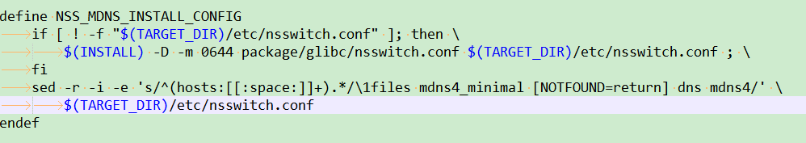

1

什么是avahi？有什么用？

要了解avahi，需要先了解zeroconf。

zeroconf，就是零配置。是一个网络技术。自动生成可用ip地址的网络技术。

zeroconf是apple公司提出的技术规范。

avahi就是zeroconf技术的开源实现，主要用在Linux上。


avahi允许程序在不手动配置网络的情况下，**在一个局域网内发布和获取各种服务和主机。**

例如，当一台计算机接入到某个局域网，这台计算机上运行了avahi程序，那么avahi就会自动进行广播，这样就可以从局域网里发现可用的打印机、共享文件等等。


avahi在Linux下的进程是avahi-daemon。


回到问题的本质，avahi，最终的目的，应该就是让你可以这样在局域网来进行访问需要的服务：

xxx.local

你不用管这个服务在哪个机器上，端口是多少。

具体到snapcast上来，就是client启动后，都直接去连接snapserver.local这样的地址就完事了。你不用指定172.16.xx这种ip了。


代码在这里：

https://github.com/lathiat/avahi


The fact that `eth0:avahi` appears means that the system failed to get an IP on the `eth0` interface (your wired network interface).

说是因为eth0获取ip失败，所以会出现eth0:avahi这个网卡。

我的wifi联网成功之前，也是出现了一个wlan0:avahi，wifi的联网成功后，这个wlan0:avahi就不见了。

看起来这个说法有道理。

我找了一根网线，把树莓派的网口跟路由器是的lan口连接好之后，eth0:avahi也就没有了。


现在我最大的困惑就是我应该怎么使用这一堆的工具，如何配置，如何启动。

>  man 5 avahi-daemon.conf

这样查看这个配置文件的信息。

avahi-daemon 这个就是mdns进程了。其他的命令都是跟这个进程来进行交互的。

```
host-name=xxx # 不设置的话，就是机器的hostname。
domain-name=local # 不设置的话，默认就是local。
allow-interfaces= # 为空的话，则出了loopback网卡之后的，都会使用。

```

teamviewer好像也用到avahi。

```
_teamviewer._tcp     local
```

这个命令是解析某个服务的具体端口信息。

```
avahi-browse -r _snapcast-tcp._tcp
```

树莓派上启动snapclient后，就可以看到对应的服务。

```
# avahi-browse -a
+  wlan0 IPv6 Music Player @ snapcast                       _mpd._tcp            local
+  wlan0 IPv4 Music Player @ snapcast                       _mpd._tcp            local
+   eth0 IPv4 Music Player @ snapcast                       _mpd._tcp            local
```

解析出来的信息：

```
# avahi-browse -r _mpd._tcp 
+  wlan0 IPv6 Music Player @ snapcast                       _mpd._tcp            local
+  wlan0 IPv4 Music Player @ snapcast                       _mpd._tcp            local
+   eth0 IPv4 Music Player @ snapcast                       _mpd._tcp            local
=  wlan0 IPv6 Music Player @ snapcast                       _mpd._tcp            local
   hostname = [snapcast.local]
   address = [fe80::ba27:ebff:fe55:1b9f]
   port = [6600]
   txt = []
```

我把树莓派和笔记本都连到我手里的一个腾达的路由器上。

现在可以用snapcast.local这样来直接ping通了。


注册一个服务到avahi。

是在/etc/avahi/services目录下。

新建一个service文件。

目前snapos下面是有2个service文件。

```
sftp-ssh.service  ssh.service
```

但是实际上当前启动snapclient之后，可以看到三个服务。

```
# avahi-browse -a
+  wlan0 IPv6 Music Player @ snapcast                       _mpd._tcp            local
+  wlan0 IPv4 Music Player @ snapcast                       _mpd._tcp            local
+   eth0 IPv4 Music Player @ snapcast                       _mpd._tcp            local
+  wlan0 IPv6 snapcast                                      _sftp-ssh._tcp       local
+  wlan0 IPv4 snapcast                                      _sftp-ssh._tcp       local
+   eth0 IPv4 snapcast                                      _sftp-ssh._tcp       local
+  wlan0 IPv6 snapcast                                      _ssh._tcp            local
+  wlan0 IPv4 snapcast                                      _ssh._tcp            local
+   eth0 IPv4 snapcast                                      _ssh._tcp            local
```

应该是snapclient里用C代码进行了服务注册。

```
# avahi-resolve-host-name -4 snapcast.local
snapcast.local  169.254.8.40
```


/etc/avahi/hosts

这个配置文件

目前是空的。里面给了2个例子。

```
# Examples:
# 192.168.0.1 router.local
# 2001::81:1 test.local
```

这个是static host name file。

作用其实就跟/etc/hosts的类似，就是写在这里的域名跟写的ip地址，就固定了，不要费心思去进行解析了。


# snapcast对avahi的使用

具体avahi怎么个用法，我看到snapcast里有依赖这个，具体怎么用的呢？


有一整套命令工具

```
avahi-autoipd            
avahi-browse-domains     
avahi-dnsconfd           
avahi-publish-address    
avahi-resolve            
avahi-resolve-host-name
avahi-browse             
avahi-daemon             
avahi-publish            
avahi-publish-service    
avahi-resolve-address    
avahi-set-host-name
```

## avahi-browse

在运行snapcast的树莓派上执行，情况如下：

```
# avahi-browse -a
+  wlan0 IPv6 snapcast                                      _sftp-ssh._tcp       local
+  wlan0 IPv6 snapcast                                      _ssh._tcp            local
+  wlan0 IPv4 snapcast                                      _sftp-ssh._tcp       local
+  wlan0 IPv4 snapcast                                      _ssh._tcp            local
+   eth0 IPv4 snapcast                                      _sftp-ssh._tcp       local
+   eth0 IPv4 snapcast                                      _ssh._tcp            local
```


```
# ifconfig -a
eth0      Link encap:Ethernet  HWaddr B8:27:EB:00:4E:CA  
          UP BROADCAST MULTICAST  MTU:1500  Metric:1
          RX packets:0 errors:0 dropped:0 overruns:0 frame:0
          TX packets:0 errors:0 dropped:0 overruns:0 carrier:0
          collisions:0 txqueuelen:1000 
          RX bytes:0 (0.0 B)  TX bytes:0 (0.0 B)

eth0:avahi Link encap:Ethernet  HWaddr B8:27:EB:00:4E:CA  
          inet addr:169.254.8.40  Bcast:169.254.255.255  Mask:255.255.0.0
          UP BROADCAST MULTICAST  MTU:1500  Metric:1
```

eth0:avahi 这个应该怎样来理解？


怎样发现局域网里服务并进行使用呢？


Avahi允许程序在不需要进行手动网络配置的情况 下，在一个本地网络中发布和获知各种服务和主机。例如，当某用户把他的计算机接入到某个局域网时，如果他的机器运行有Avahi服务，则Avahi程式自 动广播，从而发现网络中可用的打印机、共享文件和可相互聊天的其他用户。这有点象他正在接收局域网中的各种网络广告一样。


难道正常的使用方法是：先通过扫描服务，查询到ip最终还是用ip去进行连接？


这样来找：

```
# avahi-browse -t -d local -r _snapcast-stream._tcp 
+  wlan0 IPv4 Snapcast                                      _snapcast-stream._tcp local
=  wlan0 IPv4 Snapcast                                      _snapcast-stream._tcp local
   hostname = [snapserver-2.local]
   address = [192.168.0.104]
   port = [1704]
   txt = []
```

See also the nss-mdns project, which allows hostname lookup of *.local hostnames via mDNS in all system programs using nsswitch


 BR2_PACKAGE_NSS_MDNS

nsswitch.conf是在glibc目录下的。

但是没有看到install有拷贝行为。

是靠nss-mdns来拷贝的。这个为什么要这样放？真是奇怪。

```
./nss-mdns/nss-mdns.mk:14:              $(INSTALL) -D -m 0644 package/glibc/nsswitch.conf $(TARGET_DIR)/etc/nsswitch.conf ; \
```

不用手动改。因为默认nss-mdns帮你改了。



编译后只是增加了几个so文件。

```
./usr/lib/libnss_mdns4_minimal.so.2
./usr/lib/libnss_mdns_minimal.so.2
./usr/lib/libnss_mdns4.so.2
./usr/lib/libnss_mdns6.so.2
./usr/lib/libnss_mdns6_minimal.so.2
./usr/lib/libnss_mdns.so.2
```

nss-mdns是glibc的一个插件。

提供hostname解析房屋，通过mdns协议。

avahi可以使用nss-mdns。

nss-mdns尝试跟一个运行的avahi-daemon进行通信。


nss-mdns有一个简单的配置文件，默认是/etc/mdns.allow。

安装nss-mdns之后，nslookup snapserver.local还是找到192.168.0.1，是不对的。

nss-mdns的readme写着是用getent这个工具来测试的。

我编译这个工具试一下。

还是192.168.0.1。这个就奇怪了。

```
/userdata # ./getent hosts snapserver.local 
192.168.0.1     snapserver.local            
```

难道是路由器不转发这个mdns导致的吗？


我简单起见，就这样拿到ip来进行连接吧。

```
avahi-browse -t -d local -r _snapcast-stream._tcp |grep address | awk '{print $3}'
```


# nsswitch.conf

/etc/nsswitch.conf文件，Name Service Switch 配置。

这个文件规定了通过哪些途径，按照什么顺序来查找特定类型的信息。

还可以指定在方法失效的时候应该采取什么措施。

每一行是一个配置。配置的格式：

```
passwd:         files      
group:          files      
shadow:         files      
                           
hosts:          files dns  
networks:       files dns  
                           
protocols:      files      
services:       files      
ethers:         files      
rpc:            files         
```

按照从左到右的顺序来查找。如果没有找到，就找下一个。

例如hosts的，就是先找文件里，文件里找不到，就去找dns。


# 代码分析

```
AvahiSimplePoll
	这个是基于pollfd的。
	跟simple相对于的是glib版本的。
```

基于dbus。


参考资料

1、linux服务——Avahi

https://blog.csdn.net/updba/article/details/7389733

2、维基百科

https://en.wikipedia.org/wiki/Avahi_%28software%29

3、

https://wiki.archlinux.org/index.php/Avahi

4、Using Zero Config and Avahi with the DT78xx

https://www.mccdaq.com/PDFs/Manuals/DT7837_WebHelp/Using_Zero_Config_and_Avahi_with_the_DT78xx.htm

5、基于zeroconf实现节点自发现

https://zdyxry.github.io/2018/08/22/%E5%9F%BA%E4%BA%8Ezeroconf%E5%AE%9E%E7%8E%B0%E8%8A%82%E7%82%B9%E8%87%AA%E5%8F%91%E7%8E%B0/

6、nsswitch.conf文件详解

https://blog.csdn.net/water_cow/article/details/7190880

7、

https://www.ibm.com/support/knowledgecenter/SSB2MG_4.6.0/com.ibm.ips.doc/concepts/gx_gv_using_avahi.htm

8、nss-mdns

这里将了怎么通过local域名来发现。

https://github.com/lathiat/nss-mdns