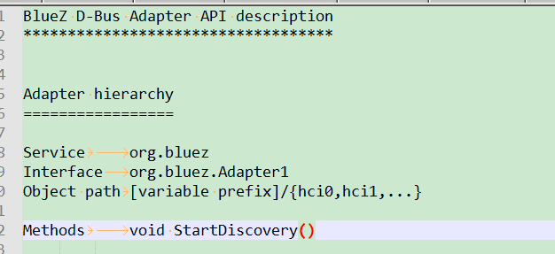
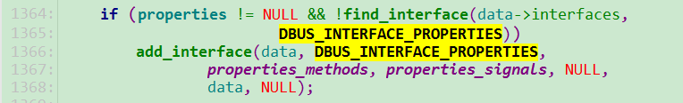

--

# 简介

DBus（Desktop Bus）是一个用于进程间通信（IPC）的消息总线协议，

主要用于Linux和UNIX系统。

它允许不同进程之间相互通信，以实现各种任务，

如共享数据、调用方法、通知事件等。

DBus是一个类似于中间件的机制，用于简化不同应用程序和组件之间的通信，从而促进系统中的集成和协作。

以下是DBus的一些主要特点和组成部分：

1. **总线系统**：DBus通过在系统中创建一个总线，允许不同应用程序和进程在该总线上进行通信。这个总线通常被称为"session bus"（会话总线）或"system bus"（系统总线），分别用于用户会话和系统级通信。

2. **消息传递**：DBus基于消息传递的方式工作，进程可以通过总线发送和接收消息。这些消息通常包括方法调用、信号通知和属性更改等。

3. **对象和接口**：==DBus消息传递是基于对象和接口的。每个对象都有一个唯一的对象路径，而每个接口定义了对象可以提供的一组方法和信号==。这种结构有助于组织和描述系统中的功能和服务。

4. **权限和安全性**：DBus提供了一种权限管理机制，允许您定义哪些应用程序和进程可以连接到总线，以及哪些操作它们可以执行。这有助于确保系统的安全性。

5. **语言绑定**：DBus支持多种编程语言，因此应用程序可以使用不同的编程语言来访问DBus总线。有许多不同语言的DBus库和绑定可供开发人员使用。

DBus在Linux桌面环境中广泛使用，例如，它用于与桌面环境（如GNOME和KDE）中的组件通信，以及在Linux系统中与硬件设备进行通信。DBus还在很多服务中使用，以便不同的进程能够协同工作，提供更强大的功能和用户体验。

# dbus的优点和缺点

DBus是一个强大的进程间通信（IPC）机制，但它也有一些优点和缺点。

**优点：**

1. **标准化通信：** DBus提供了一种标准化的通信机制，使不同应用程序之间的通信更容易。这促进了应用程序的集成和协作。

2. **简化通信：** DBus简化了进程之间的通信，因为它抽象了复杂的通信细节。开发人员可以专注于定义对象、接口和方法，而无需担心底层通信机制。

3. **安全性：** DBus提供了一套权限控制机制，可以限制哪些应用程序可以连接到总线，以及执行哪些操作。这有助于确保系统的安全性。

4. **支持多种语言：** DBus支持多种编程语言，因此应用程序可以使用不同的编程语言来访问总线，这使得开发更加灵活。

5. **事件通知：** DBus允许应用程序发送和接收事件通知，这在处理异步事件和触发响应方面非常有用。

**缺点：**

1. **性能开销：** DBus的消息传递机制引入了一定的性能开销，因为消息需要进行序列化和反序列化。这可能在某些高性能应用程序中成为一个瓶颈。

2. **复杂性：** 对于初学者来说，DBus的概念可能有点复杂，因为它引入了对象、接口、方法等抽象层次。这可能增加了学习曲线。

3. **单点故障：** 如果DBus总线出现故障，可能会影响与总线连接的所有应用程序。这使得DBus成为潜在的单点故障。

4. **不适用于跨网络通信：** DBus主要设计用于本地进程间通信，不适用于跨网络通信。如果需要在不同计算机之间进行通信，需要使用其他协议，如RPC（远程过程调用）。

总的来说，DBus是一个非常有用的工具，用于在Linux和UNIX系统中实现进程间通信，但开发人员需要权衡其优点和缺点，并根据特定的用例来决定是否使用它。

# dbus有没有现代化的替代方案

虽然DBus在Linux和UNIX系统中仍然广泛使用，但也有一些现代化的替代方案，它们旨在解决一些DBus的限制和问题，特别是在高性能、跨平台和分布式系统方面。以下是一些现代化的替代方案：

1. **gRPC：** gRPC是一个高性能的远程过程调用（RPC）框架，由Google开发。它支持多种编程语言，包括C++, Python, Go, Java等，以及多种平台，包括Linux、Windows和移动设备。gRPC使用HTTP/2协议进行通信，具有强大的性能和功能，适用于跨网络通信和微服务架构。

2. **NATS：** NATS是一个轻量级和高性能的消息传递系统，专注于云原生应用和微服务。它支持发布/订阅、请求/响应和点对点通信模式，适用于分布式系统的事件驱动通信。

3. **ZeroMQ（ZMQ）：** ZeroMQ是一个异步消息库，提供了多种通信模式，包括请求/响应、发布/订阅和流式数据传输。它非常轻量级且易于集成到各种编程语言中。

4. **WebSocket：** WebSocket是一种协议，用于在Web应用程序中进行实时双向通信。虽然它主要用于Web开发，但也可以在其他应用程序中使用，特别是需要实时通信的情况。

5. **RabbitMQ：** RabbitMQ是一个消息队列中间件，支持多种通信模式，包括消息队列、发布/订阅和请求/响应。它用于分布式系统和微服务通信。

这些替代方案通常更适用于特定的使用案例和需求，因此在选择替代方案时，需要考虑您的具体应用程序和环境。DBus仍然在许多桌面Linux系统和特定的应用程序中广泛使用，但在大规模、高性能或分布式系统中，可能需要考虑更现代的IPC或通信机制。

# dbus 相关概念解释

DBus（Desktop Bus）涉及许多重要的概念，以下是一些关键的DBus相关概念的解释：

1. **总线（Bus）：** DBus中的总线是一种通信通道，用于连接应用程序和进程。有两种主要类型的总线：会话总线（session bus）和系统总线（system bus）。会话总线用于用户会话内的通信，而系统总线用于系统级通信。

2. **对象（Object）：** 在DBus中，==对象代表一个实体或资源，==它可以具有唯一的对象路径，用于标识该对象。对象通常是某个应用程序或组件的一部分，其他应用程序可以通过对象路径来访问对象的功能。

3. **接口（Interface）：** ==每个DBus对象都可以实现一个或多个接口==，接口定义了对象提供的一组方法、信号和属性。接口有助于组织和描述对象的功能。

4. **方法（Method）：** 方法是DBus对象上可以调用的函数，用于执行特定的操作。当一个应用程序或进程需要与对象交互时，它可以通过DBus调用对象的方法。

5. **信号（Signal）：** 信号是DBus对象发出的事件通知。其他应用程序可以注册对某个对象上的特定信号感兴趣，以便在事件发生时接收通知。

6. **属性（Property）：** 属性是DBus对象上的数据字段，它们可以被读取或写入。属性允许应用程序查询和修改对象的状态。

7. **代理（Proxy）：** ==代理是DBus客户端应用程序中的组件，用于与DBus服务通信。==代理提供了访问DBus对象和接口的高级API，使应用程序更容易使用DBus。

8. **服务（Service）：** 服务是提供DBus对象的实体，它通常对应于一个应用程序或组件。服务通过总线向其他应用程序提供功能。

9. **连接（Connection）：** 连接表示应用程序或进程与DBus总线之间的通信通道。每个应用程序通常与DBus总线建立一个连接，用于发送和接收消息。

10. **权限（Permissions）：** DBus提供了一种权限管理机制，允许定义哪些应用程序可以连接到总线，以及哪些操作它们可以执行。这有助于确保系统的安全性。

这些概念共同构成了DBus的核心，允许应用程序和进程在Linux和UNIX系统中进行进程间通信，并实现各种功能和协作。通过了解这些概念，开发人员可以更好地使用和理解DBus。

# 替代方案

谷歌搜索dbus alternatives

常用的就是ubus。


dbus能不能移植到嵌入式系统里？如何移植？

如何写一个简单程序来测试dbus工作是否正常？

怎样写一个基本程序来理解dbus的原理？

为什么需要dbus？


dbus是一个为App之间通信的消息总线系统。用于进程间通信。跟共享内存、信号量这些的一个类型的东西。

采用了3层架构。

1、一个库文件libdbus。我们写app，链接这个库，就可以。

2、一个守护进程。所有消息，都通过这个守护进程来转发。

3、跟特定库或者语言的绑定，例如跟Python的绑定，跟glib的绑定，跟qt的绑定。

官方也不建议直接使用dbus，而是使用包装过的。这样用起来会简单些。

```
dbus-daemon --system
```

dbus就是对socket的封装。

DBUS可以完成1对1的IPC, 多对多的IPC, 多对多需要daemon,和android中的service_manger类似,如同router.


看树莓派的情况。

```
root@raspberrypi:/etc/dbus-1# tree
.
├── session.d
└── system.d
    ├── avahi-dbus.conf
    ├── bluetooth.conf
    ├── Mountall.Server.conf
    ├── org.freedesktop.hostname1.conf
    ├── org.freedesktop.locale1.conf
    ├── org.freedesktop.login1.conf
    ├── org.freedesktop.network1.conf
    ├── org.freedesktop.PolicyKit1.conf
    ├── org.freedesktop.RealtimeKit1.conf
    ├── org.freedesktop.resolve1.conf
    ├── org.freedesktop.systemd1.conf
    ├── org.freedesktop.timedate1.conf
    ├── pulseaudio-system.conf
    └── wpa_supplicant.conf

2 directories, 14 files
```

在rk3308的板子上：

```
├── session.conf
├── system.conf
└── system.d
    ├── avahi-dbus.conf
    ├── bluetooth.conf
    ├── dnsmasq.conf
    └── wpa_supplicant.conf
```


buildroot里，可以选配dbus的支持。

在hardware handling下面。


这些conf文件，都是xml格式的。

现在我关注的蓝牙这个部分。

看看蓝牙dbus如何使用的。


多对多的dbus消息都通过dbus后台进程进行中转。相当于一个消息路由。

是一种进程间通信机制，支持一对一和一对多的对等通信。

dbus的主要概念是总线。

连接到总线的消息可以通过总线发送或者接收消息。

消息可以分为4种。

```
1、method call消息。
	触发一个函数调用。
2、method return消息。
	触发函数调用返回的结果。
3、error消息。
	触发的函数调用返回一个异常。
4、signal消息。
	通知，就是触发事件。这个跟上面三个不同。
```

```
/** This value is never a valid message type, see dbus_message_get_type() */
#define DBUS_MESSAGE_TYPE_INVALID       0
/** Message type of a method call message, see dbus_message_get_type() */
#define DBUS_MESSAGE_TYPE_METHOD_CALL   1
/** Message type of a method return message, see dbus_message_get_type() */
#define DBUS_MESSAGE_TYPE_METHOD_RETURN 2
/** Message type of an error reply message, see dbus_message_get_type() */
#define DBUS_MESSAGE_TYPE_ERROR         3
/** Message type of a signal message, see dbus_message_get_type() */
#define DBUS_MESSAGE_TYPE_SIGNAL        4

#define DBUS_NUM_MESSAGE_TYPES          5
```


主要用来进程间**函数调用**和进程间**信号广播**。


dbus的特点：

1、低延迟。

2、低开销。

3、高可用。

**协议是二进制的，避免了序列化的过程。通信效率高。**

**因为主要是用于本机内部通信，所以采用二进制带来的好处大于坏处。**

支持异步操作。

**dbus易于使用，因为它是基于消息，而不是字节流。**


总线有两种，一个是system bus，一个是session bus。

本质上，dbus是一个对等的协议。

每个消息都一个源地址和目的地址。


看dbus代码里的readme的说明。

版本系统，跟Linux内核一个风格，偶数的表示稳定版本，奇数版本表示开发版本。

# dbus为什么复杂

D-Bus（Desktop Bus）作为一种进程间通信机制，确实具有一定的复杂性。以下是一些可能导致 D-Bus 复杂性的原因：

1. 灵活性和功能丰富：D-Bus 的设计目标是为了提供灵活的、可扩展的通信机制，以满足各种不同的通信需求。**它支持广播、请求-响应、异步通信等多种通信模式**，并且提供了丰富的特性和功能，如对象导航、信号传递、方法调用等。这种灵活性和功能丰富性使得 D-Bus 在复杂的通信场景中具有更强大的表达能力，但也增加了一定的学习和使用成本。

2. 安全性和权限管理：D-Bus 强调安全性，通过提供细粒度的权限管理和访问控制机制来保护通信的安全性。这包括对对象、接口和方法的访问权限、消息的验证和策略等。虽然这种安全性是必要的，但同时也增加了使用 D-Bus 的复杂性，需要了解和配置正确的权限规则。

3. 性能和效率考虑：D-Bus 作为一种高级通信机制，需要提供一定程度的性能和效率。为了实现高效的通信，D-Bus 使用了多线程、异步操作和消息传递机制等技术。这些技术的使用增加了一些复杂性，需要正确地处理线程同步、消息处理和错误处理等问题。

4. 跨平台支持：D-Bus 是一个跨平台的通信机制，可以在多种操作系统和编程语言中使用。为了实现这种跨平台支持，D-Bus 需要提供相应的库和工具，使得在不同平台上使用 D-Bus 变得更加复杂。此外，不同平台对于 D-Bus 的实现和配置也可能存在一些差异，需要进行适配和调试。

尽管 D-Bus 有一定的复杂性，但它也带来了一些重要的好处，如强大的通信能力、安全性和跨平台支持。对于需要在不同应用程序之间进行可靠、安全和灵活通信的场景，D-Bus 提供了一种成熟的解决方案。虽然使用 D-Bus 可能需要一些学习和调试的成本，但一旦掌握并正确使用，它可以极大地简化进程间通信的开发和管理。

# 有没有对dbus进行包装易于使用的接口？

是的，有一些第三方库对 D-Bus 进行了包装，提供更易于使用的接口，简化了在 C 语言中使用 D-Bus 的过程。以下是一些常用的 D-Bus 包装库：

1. GDBus（GLib D-Bus Binding）：GDBus 是 GLib 提供的 D-Bus 包装库，它为 C 语言提供了更高级的接口，简化了与 D-Bus 的交互。GDBus 提供了一组易于使用的函数和数据结构，支持发送和接收 D-Bus 消息、注册和暴露对象、调用方法、监听信号等操作。GDBus 是 GNOME 桌面环境的默认 D-Bus 实现，广泛用于 GNOME 应用的开发。

2. sd-bus（Systemd D-Bus Library）：sd-bus 是 Systemd 提供的 D-Bus 包装库，它为 C 语言提供了简单而高效的接口，支持与 D-Bus 通信的各种操作。sd-bus 的设计目标是提供一个轻量级、无依赖的 D-Bus 实现，与 Systemd 紧密集成。它提供了简洁的 API，包括消息的发送和接收、接口的注册和调用、信号的监听等功能。

3. Dbuskit：Dbuskit 是一个开源的 D-Bus 包装库，提供了简单的 C 语言接口，旨在简化使用 D-Bus 的复杂性。它提供了一组易于使用的函数和数据结构，支持连接 D-Bus、发送和接收消息、调用方法、监听信号等操作。Dbuskit 是一个轻量级的库，适用于嵌入式系统和资源有限的环境。

这些包装库提供了更高级的接口，抽象了底层的细节，使得在 C 语言中使用 D-Bus 更加方便和直观。根据具体的需求和项目的要求，选择适合的包装库可以提高开发效率并简化代码的编写。

# 自动生成dbus相关函数的工具

在 Linux 平台上，有一些工具可以帮助自动生成 D-Bus 相关的代码。以下是两个常用的工具：

1. gdbus-codegen：gdbus-codegen 是 GLib 提供的一个工具，用于生成基于 GLib 的 D-Bus 代理和接口的代码。它可以从 D-Bus 接口描述文件 (XML 格式) 自动生成相关的代码，包括接口、代理和信号处理函数等。您可以使用该工具生成用于连接到 D-Bus 服务的客户端代码。

2. dbus-codegen：dbus-codegen 是 D-Bus 提供的官方工具，用于生成基于 libdbus 的 D-Bus 客户端和服务端代码。它可以从 D-Bus 接口描述文件 (XML 格式) 自动生成相关的代码，包括接口、方法、信号和属性等。您可以使用该工具生成用于实现 D-Bus 服务或连接到 D-Bus 服务的客户端代码。

这些工具都需要提供一个 D-Bus 接口描述文件作为输入，并生成相应的代码文件。您可以在生成的代码中使用自动生成的函数来进行 D-Bus 通信和调用。

请注意，生成的代码可能需要根据您的具体需求进行进一步的修改和定制。另外，这些工具通常与特定的开发框架或库相关联，例如 GLib 或 libdbus，因此您需要确保在使用这些工具之前正确设置和配置相关的开发环境。

建议查阅相关工具的官方文档以获取更详细的使用说明和示例。

# dbus常用api说明

DBus提供了一系列用于在应用程序中与DBus总线通信的API。这些API通常由DBus库提供，可以在多种编程语言中使用。以下是一些常用的DBus API和它们的简要说明：

1. **D-Bus C API：**
   - **dbus_connection_open()：** 用于打开与DBus总线的连接。
   - **dbus_bus_get()：** 获取指定类型的DBus总线连接，例如系统总线或会话总线。
   - **dbus_message_new_method_call()：** 创建一个用于发送方法调用的DBus消息。
   - **dbus_message_append_args()：** 向DBus消息添加参数。
   - **dbus_connection_send()：** 发送DBus消息到总线上。
   - **dbus_connection_add_filter()：** 添加消息过滤器，以接收来自总线的特定消息。
   - **dbus_message_iter_get_basic()：** 从DBus消息中获取参数值。
   - **dbus_error_init()：** 初始化DBus错误对象。
   - **dbus_pending_call_set_notify()：** 设置用于异步方法调用的回调函数。
   - **dbus_connection_flush()：** 刷新连接中的消息队列。

2. **D-Bus Python API（PyDBus）：**
   - **dbus.Interface()：** 创建DBus接口对象以与服务通信。
   - **dbus.SessionBus() 和 dbus.SystemBus()：** 获取会话总线和系统总线连接对象。
   - **DBusException类：** 用于处理DBus错误和异常。
   - **add_signal_receiver()：** 注册用于接收信号的回调函数。
   - **call_blocking()：** 同步方式调用DBus方法。
   - **call_async()：** 异步方式调用DBus方法。

3. **Glib D-Bus API（GLib-DBus）：**
   - **g_bus_get()：** 获取与DBus总线的连接。
   - **g_dbus_connection_register_object()：** 在连接上注册一个对象以提供服务。
   - **g_dbus_proxy_new_for_name()：** 创建与特定服务的代理对象。
   - **g_dbus_method_invocation_return_error()：** 返回一个错误消息。
   - **g_dbus_signal_info_get()：** 获取信号的信息。
   - **g_dbus_proxy_call()：** 异步方式调用代理对象上的方法。
   - **g_dbus_proxy_connect_signal()：** 连接信号处理函数以接收信号。

这些API可以根据使用的编程语言和库进行调用，以便在应用程序中与DBus总线通信。它们允许应用程序创建DBus连接、发送和接收消息、调用方法、接收信号等，以实现进程间通信和与服务的交互。不同的语言和库可能提供略有不同的API，但通常会提供与上述类似的功能。

# 概念理解

运行一个dbus-daemon，就创建一个bus。

当一个app连接到这个bus的时候，就创建了一个connection。

每个app里，有多个object。站在dbus的角度，通信的不是app，而是object。

一个object里，有多个不同的interface。我们可以把interface理解为对象的成员变量。这些变量有getter和setter方法。

interface其实是通信方式的集合。

signal通信方式，不需要对方回复。

**method call通信方式，需要对方回复。回复的是method return。**


signal方式比较简单，我们就以signal为例，来看看整个通信过程。

```
conn = dbus_bus_get(DBUS_BUS_SESSION, &err);//连接到bus上。
ret = dbus_bus_request_name(conn, "test.method.server", DBUS_NAME_FLAG_REPALCE_EXISTING, &err);//把自己的进程名字注册到bus上。
```

加入一个进程，想要接收interface名字为test.signal.Type的信号。

则这样：

```
dbus_bus_add_watch(conn, "type='signal',interface='test.signal.Type'", &err);
```

然后就等待消息的到来：

```
dbus_connection_read_write(conn, 0);//0表示一直等待，没有超时。
//执行到这里，说明消息已经来了，取出消息。
msg = dbus_connection_pop_message(conn);
```


发送的进程里这样做：

```
dbus_uint32_t serial = 0;//消息id
DBusMessage *msg;
msg = dbus_message_new_signal("/test/signal/Object", "test.signal.Type", "Test");
//添加参数给signal
dbus_message_iter_init_append(msg, &args);
dbus_message_iter_append_basic(&args, DBUS_TYPE_STRING, &sigval);
//发送
dbus_connection_send(conn, msg, &serial);
```


DBusMessage是dbus的核心数据结构。

里面存储了2个主要信息，一个是为通信机制服务的各种name，一个是通信数据本身。


## 各种name

### dbus name

最重要的name就是dbus name。

这个是每个app用来标记自己的。

可以理解为ip地址。

bus name有两种，

1、unique connection name。`:10`这种以冒号开头的，可读性不太好。

2、well-known name。这种就可读性好一些。

默认只给分配冒号开头的bus name。

如果要well-known name。就使用dbus_bus_request_name来申请。

### interface name

这个是为了上层架构而设计的。例如qt dbus。

在C api这一层，你几乎可以不管它。

它的命名规则个dbus name几乎一样，只是不是用`-`。

### object path

跟interface一样，是为上层架构设计的。

在C api这一层，几乎可以不管他。

### member name


**dbus规范里标准化了一些接口。**

**这些接口对我们调用其他服务提供的dbus api很有帮助。**

我们看其中比较重要的两个。

```
org.freedesktop.DBus.Introspectable
```

看bluez里的gatt-service.c代码：

```
add_interface(data, DBUS_INTERFACE_INTROSPECTABLE, introspect_methods,
						NULL, NULL, data, NULL);
```

会这样调用。那么应该就可以查看这个的信息吧。

对应的命令怎么写呢？

下面这样可以得到回复。

```
dbus-send --system --type=method_call --print-reply --dest=org.bluez /org/bluez/Device1/hci0/dev_54_A4_93_A0_00_08 org.freedesktop.DBus.Introspectable.Introspect                                          
```

--dest=org.bluez，表示是发送给bluetoothd这个app。

object path，是从bluez/doc/device-api.txt里分析得到的。

```
Service		org.bluez
Interface	org.bluez.Device1
Object path	[variable prefix]/{hci0,hci1,...}/dev_XX_XX_XX_XX_XX_XX
```

当前这样返回的，是一个没有什么有效内容的xml文件。

内容是这里填入的：

```
data->introspect = g_strdup(DBUS_INTROSPECT_1_0_XML_DOCTYPE_DECL_NODE "<node></node>");
```


# 建立服务的流程

dbus_bus_get：获取一个dbus连接。

dbus_bus_reques_name：为这个连接起名。这个名字就是后续进行远程调用的时候的服务名

dbus_connection_read_write：进入监听循环。（一般不用这种方式，用mainloop的方式来做）

然后在循环里，我们从bus上取出消息。dbus_connection_pop_message

然后对比消息中的方法接口名和方法名：dbus_message_is_method_call

如果对比一致，那么就跳转到响应的处理函数里去。并从消息里取出远程调用的参数。

并且建立起回传结果的通路，reply_to_method_call。

# 发送信号的流程

dbus_message_new_signal

把信号相关的参数放进去。dbus_message_iter_init_append。

dbus_message_iter_append_basic。

然后启动发送：

dbus_connection_send

dbus_connection_flush


# 进行一次远程调用的流程

申请一个远程调用通道：dbus_message_new_method_call

需要填写的参数有： 本次调用的接口名。本地调用的方法名。

实际上是申请了一个内存，把内容往里面填。

然后启动发送调用并释放发送相关的消息。

dbus_connection_send_with_reply。

**会阻塞等待调用执行完成。**

当这个句柄回传消息之后，我们从消息结构中分离出参数。

用dbus提供的函数提取参数的类型和参数 -- dbus_message_iter_init(); dbus_message_iter_next(); dbus_message_iter_get_arg_type(); dbus_message_iter_get_basic()。也就达成了我们进行本次远程调用的目的了。

# 信号接收流程

dbus_bus_add_match()。我们进入等待循环后，只需要对信号名，信号接口名进行判断就可以分别处理各种信号了。在各个处理分支上。我们可以分离出消息中的参数。对参数类型进行判断和其他的处理。


# 工具

dbus默认提供了一些工具。

dbus-monitor和dbus-send。可以用来测试。


系统里的dbus工具有：

````
dbus-binding-tool
	这个是生成glib代码文件的工具。
dbus-daemon
	--session等价于：--config-file=/usr/share/dbus-1/session.conf
	
dbus-monitor
	这个只有5个选项。比较简单。
	--system：监控系统bus的消息。
	--session：监控用户session bus的消息。默认是这个。
	--profile：不指定，就是classic模式。这个是精简模式。
	--monitor：监控输出模式。默认就是这个。
dbus-send
	发送dbus消息。
dbus-uuidgen
	生成一个uuid。
dbus-cleanup-sockets
	
dbus-launch
dbus-run-session
dbus-update-activation-environment
````

## dbus-send

在bluez的代码里搜索dbus_message_new_method_call。就可以看到注册了哪些东西，可以让我们进行调用的。


```
dbus-send --system --print-reply --dest=org.bluez /org/bluez/audio org.bluez.audio.Manager.CreateDevice string:'11:11:11:11:11:11'
其中:

--system
将命令发向系统总线，也可使用--session
--print-reply
打印返回结果
--dest=org.bluez
服务名。用户可以用查询命令获得当前系统的所有服务名
/org/bluez/audio
对象名。由服务定义
org.bluez.audio.Manager.CreateDevice
object.interface.Method
string:'11:11:11:11:11'
参数。 类型:值 int32:123
```


命令要有2个必须的参数：

```
<destination object path> <message name>
```

path比较好理解，就是`/`这样的路径一样的东西。

message name

这个是怎么写的呢？


遍历dbus上所有的对象。

```
dbus-send --session --type=method_call --print-reply --dest=org.freedesktop.DBus / org.freedesktop.DBus.ListNames
```

向某个对象发送消息

```
dbus-send --session --type=method_call --print-reply --dest=org.gnome.ScreenSaver  / org.freedesktop.DBus.Introspectable.Introspect
```


buildroot下编译的板端程序，这些dbus的东西，基本都有。

bluez的dbus，有哪些东西可以被dbus-send来查看和设置呢？

可以尝试查看uuid。


下面这个命令是可以有效果的。是打开discovery。注意这条命令的使用方式。这个对bluez是通用的写法。

```
dbus-send --system --type=method_call --dest=org.bluez /org/bluez/hci0 org.freedesktop.DBus.Properties.Set string:org.bluez.Adapter1 string:Discoverable variant:boolean:true
```

下面这个不行。

```
dbus-send --system --type=method_call --dest=org.bluez --print-reply /org/bluez/hci0 org.bluez.Adapter1.GetName
```


查看板端dbus的所有管理的object。

```
dbus-send --system --print-reply --type=method_call --dest='org.bluez' '/' org.freedesktop.DBus.ObjectManager.GetManagedObjects
```

```
dbus-send --system --print-reply --type=method_call --dest='org.bluez' '/org/bluez/hci0/dev_54_A4_93_A0_00_08' org.freedesktop.DBus.ObjectManager.GetManagedObjects

```


这个文档就是讲用dbus来操作bluez的。

https://www.landley.net/kdocs/ols/2006/ols2006v1-pages-421-426.pdf


https://www.linumiz.com/bluetooth-list-available-controllers-using-dbus/

### dbus-send 常用命令

`dbus-send` 是一个用于在Linux上通过命令行发送DBus消息的实用工具。它允许您与DBus服务进行交互，发送方法调用、触发信号和查询属性。以下是一些常用的 `dbus-send` 命令示例：

1. **发送方法调用**：
   
   ```bash
   dbus-send --session --dest=org.example.MyService --type=method_call --print-reply /org/example/MyObject org.example.MyInterface.MyMethod string:"Hello, D-Bus!"
   ```

   这个命令将向 `org.example.MyService` 服务的 `/org/example/MyObject` 对象发送名为 `org.example.MyInterface.MyMethod` 的方法调用，传递一个字符串参数 "Hello, D-Bus!"。

2. **触发信号**：

   ```bash
   dbus-send --session --dest=org.example.MyService --type=signal /org/example/MyObject org.example.MyInterface.MySignal string:"Signal Data"
   ```

   这个命令将向 `org.example.MyService` 服务的 `/org/example/MyObject` 对象发送名为 `org.example.MyInterface.MySignal` 的信号，传递一个字符串参数 "Signal Data"。

3. **查询属性**：

   ```bash
   dbus-send --session --dest=org.example.MyService --type=method_call --print-reply /org/example/MyObject org.freedesktop.DBus.Properties.Get string:"org.example.MyInterface" string:"MyProperty"
   ```

   这个命令将向 `org.example.MyService` 服务的 `/org/example/MyObject` 对象发送一个方法调用，查询 `org.example.MyInterface` 接口的 `MyProperty` 属性。

4. **发送自定义DBus消息**：

   ```bash
   dbus-send --session --type=method_call --print-reply --dest=org.example.MyService /org/example/MyObject org.freedesktop.DBus.Introspectable.Introspect
   ```

   这个命令将向 `org.example.MyService` 服务的 `/org/example/MyObject` 对象发送 `org.freedesktop.DBus.Introspectable.Introspect` 方法调用，以获取有关该对象的详细信息，通常用于探索服务的功能。

5. **指定接口、对象和方法的类型**：

   ```bash
   dbus-send --session --dest=org.example.MyService --type=signal /org/example/MyObject org.example.MyInterface.MySignal string:"Signal Data" --print-reply
   ```

   通过 `--type=signal` 和 `--type=method_call`，您可以指定消息类型，以及使用 `--print-reply` 输出响应。

这些示例演示了如何使用 `dbus-send` 命令来与DBus服务进行交互，发送方法调用、触发信号、查询属性以及发送自定义DBus消息。您可以根据您的具体用例和服务的要求来构建相应的命令。确保替换示例中的服务、对象、接口、方法和参数等信息以适应您的情况。

## dbus-launch

==`dbus-launch` 命令用于启动一个新的D-Bus会话总线，为当前用户的会话提供通信渠道。==

一般情况下，您可以在终端中简单地运行 `dbus-launch` 命令，它会启动一个D-Bus会话总线，并设置相应的环境变量。以下是一些示例和说明：

1. **基本用法**：

   ```bash
   dbus-launch
   ```

   这将启动一个新的D-Bus会话总线，并显示相关的环境变量信息。您可以将这些环境变量导出到当前会话，以便其他应用程序可以连接到新的D-Bus会话总线。

2. ==**将环境变量导出到当前会话**：==

   ```bash
   eval $(dbus-launch)
   ```

   这将在当前会话中导出由 `dbus-launch` 创建的环境变量，以便其他应用程序可以连接到新的D-Bus会话总线。

3. **使用新的D-Bus会话总线启动应用程序**：

   您可以使用 `dbus-launch` 命令启动应用程序，以确保它们可以连接到新的D-Bus会话总线。例如：

   ```bash
   dbus-launch gnome-terminal
   ```

   这将在新的终端中启动 `gnome-terminal` 应用程序，并确保它连接到新的D-Bus会话总线。

`dbus-launch` 是一种方便的方法，用于确保应用程序能够在用户会话中使用D-Bus进行通信。在某些情况下，可能需要手动设置D-Bus环境变量，但 `dbus-launch` 简化了这个过程。注意，这个命令通常在Linux桌面环境中使用，以确保应用程序正确连接到D-Bus总线。


```
/ # dbus-launch
DBUS_SESSION_BUS_ADDRESS=unix:abstract=/tmp/dbus-UE021yKXGo,guid=caec9b667660f597a32dd7395ee97b4c
DBUS_SESSION_BUS_PID=10467
```

这个命令的作用是什么？


D-Bus daemon是D-Bus的非常重要的一个服务，类似于IP网络中的[路由器](https://so.csdn.net/so/search?q=路由器&spm=1001.2101.3001.7020)。

跟这个后台服务有关的应用程序包括：

dbus-daemon: 

D-Bus的后台进程，作为D-Bus的消息中转枢纽，可分成system和[session](https://so.csdn.net/so/search?q=session&spm=1001.2101.3001.7020)两种。

dbus-launch: 

启动一个dbus-daemon，后面有不同的参数。

一般而言，dbus-daemon启动后需要将其地址告诉给所有需要使用该bus的applications。


当系统启动时，需要使用dbus-launch来启动dbus-daemon，一般而言，

一般采用下面的命令启动dbus daemon以及dbus application

(1) eval `dbus-launch --auto-syntax`

(2) ./yourapp

第一行代码，采用eval来执行两次，第一次执行dbus-lauch --auto-syntax，除了启动dbus daemon之外，还输出了下面的内容：

DBUS_SESSION_BUS_ADDRESS='unix:path=/tmp/dbus-6Z62FMmwf3,guid=5dbd92e4865a3f56880d2120000000d6';
export DBUS_SESSION_BUS_ADDRESS;
DBUS_SESSION_BUS_PID=998;

第二次执行时就将环境变量DBUS_SESSION_BUS_ADDRESS暴露出去了。所有的dbus application在注册DBUS服务时，必须知道这个DBUS_SESSION_BUS_ADDRESS的数据。

在第二行执行自己的dbus application的时候，根据DBUS_SESSION_BUS_ADDRESS环境变量，能够找到session bus进行注册和通讯。


```
sh-5.0# /usr/bin/dbus-launch | /bin/sed '/^#.*\|^$/d'
DBUS_SESSION_BUS_ADDRESS=unix:abstract=/tmp/dbus-BdRxIZh1da,guid=18bed0c46c25ded3f95dda5f62da449a
DBUS_SESSION_BUS_PID=1451
```


这里我们会有两个app: app1(client)，app2(server), 然后，再启动一个“dbus-daemon （session）”

我们期望，app1 和 app2 之间的通信，可以使用 刚才启动的 “dbus-daemon”


### 启动一个dbus-daemon (session)

方式1： 使用dbus-launch 创建一个dbus-daemon:

```ini
#yum install -y dbus-x11-1:1.6.12-13.1.alios7.x86_64

#dbus-launch
DBUS_SESSION_BUS_ADDRESS=unix:abstract=/tmp/dbus-7Q7Spuq5IH,guid=079edc76e4c5c6433d3507855c5260ce
DBUS_SESSION_BUS_PID=121376
```

方式2： 手动启动

```typescript
#DBUS_VERBOSE=1 dbus-daemon --session --print-address
unix:abstract=/tmp/dbus-jXwkggHTo2,guid=dc666ee7ba7ddf788efd8c485c526564
```

两个方式的目的，**不仅仅是启动dbus-daemon, 更重要的是，获得address.**


注意，这里会反馈一个地址， `unix:abstract=/tmp/dbus-7Q7Spuq5IH,guid=079edc76e4c5c6433d3507855c5260ce` ， 所以，你需要保证 你的环境变量 `DBUS_SESSION_BUS_ADDRESS`的值就是这个地址。

其实dbus-daemon是有地址的，而且有一个环境变量来表示它`--DBUS_SESSION_BUS_ADDRESS`，可以用命令env查看到。我们的程序，也就就是依靠这个环境变量来确认使用哪一个dbus-daemon的。


参考资料

1、

https://blog.csdn.net/whatday/article/details/114474167

2、Getting start with dbus in systemd (02)

https://www.cnblogs.com/muahao/p/10341178.html

## d-feet

这个是Ubuntu下的一个图形界面。可以查看系统里的dbus的情况。


## dbus-binding-tool

 C language GLib bindings generation utility.

一个生成glib绑定代码的工具。

dbus-binding-tool is used to expose a GObject via D-Bus.

As input, dbus-binding-tool uses a D-Bus Introspection XML file.  

As output, the client-side or server-side bindings is generated.  This output is a header file which eases the use of a remote D-Bus object. 

输入一个xml文件，生成C文件和头文件。

## gdbus-codegen

gdbus-codegen --interface-prefix=aml.linux.dbus --generate-c-code=audioservice_gdbus aml.linux.dbus.xml


参考资料

1、

有需要的时候，参考这个来改就好了。

https://www.freedesktop.org/software/gstreamer-sdk/data/docs/latest/gio/ch30s05.html

# glib-dbus和GDBus的区别

GDBus和glib-dbus都是由GNU组织开发的。GDBus可以认为是glib-dbus的升级版，其编程过程比起glib-dbus来要简单得多。


`glib-dbus` 和 `GDBus` 都是用于在GNOME应用程序中与DBus通信的库，但它们有不同的起源和版本。下面是它们之间的主要区别：

1. **起源和历史**：
   - `glib-dbus`：`glib-dbus` 是早期版本的DBus库，最初是作为GLib库的一部分提供的。它为GLib应用程序提供了DBus通信的功能。
   - `GDBus`：`GDBus` 是GNOME 3之后引入的DBus库，是一个单独的库，不再作为GLib的一部分。它被设计为更现代、更强大的DBus库，以满足GNOME 3及其应用程序的需求。

2. **特性和性能**：
   - `glib-dbus`：`glib-dbus` 相对较旧，功能较少，性能可能较低。它主要用于实现基本的DBus通信功能。
   - `GDBus`：`GDBus` 是一个更现代的库，具有更多的功能和性能优化。它支持异步操作、线程安全性和更多DBus特性。

3. **GLib依赖性**：
   - `glib-dbus`：`glib-dbus` 是GLib的一部分，因此在使用时需要依赖整个GLib库。
   - `GDBus`：`GDBus` 是一个独立的库，不需要依赖GLib。这使得它更容易与其他库和应用程序集成，而无需引入整个GLib。

4. **API差异**：
   - `glib-dbus` 和 `GDBus` 具有不同的API，尽管它们都用于DBus通信。因此，将从一个库迁移到另一个库可能需要进行一些代码更改。

总之，`GDBus` 是GNOME 3之后推出的现代DBus库，它提供更多的功能、更好的性能和更灵活的使用方式。如果您正在开发GNOME 3及更高版本的应用程序，==通常建议使用 `GDBus` 来获得更好的性能和功能==。然而，如果您维护早期的GNOME应用程序，可能会使用 `glib-dbus`。选择哪个库取决于您的项目需求和所支持的GNOME版本。

## gdbus的常用api

`GDBus` 是一个用于DBus通信的现代库，提供了一系列API，用于在GNOME应用程序中与DBus服务进行交互。以下是一些常用的 `GDBus` API，这些API可用于实现DBus客户端应用程序：

1. **连接和会话总线操作**：
   - `g_bus_get()`：获取到会话总线或系统总线的连接。
   - `g_bus_own_name()`：用于向DBus总线注册自己的名字（服务名称）。
   - `g_bus_unown_name()`：取消注册已拥有的名字。
   - `g_bus_watch_name()`：监视某个名字（服务名称）的状态变化。

2. **代理对象**：
   - `g_dbus_proxy_new()`：创建一个DBus代理对象，用于与特定的DBus服务通信。
   - `g_dbus_proxy_call()`：用于调用DBus代理对象上的方法。
   - `g_dbus_proxy_set_default_timeout()`：设置方法调用的默认超时时间。
   - `g_dbus_proxy_get_cached_property()`：获取代理对象的缓存属性。

3. **连接对象**：
   - `g_dbus_connection_get_unique_name()`：获取连接的唯一名称。
   - `g_dbus_connection_send_message_with_reply()`：发送消息并等待回复。
   - `g_dbus_connection_signal_subscribe()`：订阅DBus信号。

4. **消息操作**：
   - `g_dbus_message_new_method_call()`：创建方法调用消息。
   - `g_dbus_message_new_signal()`：创建信号消息。
   - `g_dbus_message_get_args()`：从消息中获取参数。
   - `g_dbus_message_to_blob()`：将消息转换为二进制数据。
   - `g_dbus_message_new_method_error()`：创建方法错误消息。

5. **异步操作**：
   - `g_dbus_proxy_call()` 和 `g_dbus_connection_send_message_with_reply()` 等函数支持异步调用方法，以避免阻塞应用程序的主线程。

6. **信号处理**：
   - `g_signal_connect()`：用于连接信号处理函数以响应DBus信号的到达。
   - `g_signal_handler_disconnect()`：用于断开信号处理函数的连接。

这些API允许您在GNOME应用程序中轻松实现DBus通信，包括与服务进行交互、调用方法、接收信号、查询属性等。使用这些API，您可以构建强大的DBus客户端应用程序，与其他应用程序和服务进行通信，以实现各种功能和协作。根据您的具体需求，您可以使用适当的API来执行相应的操作。

# python例子

```
#!/usr/bin/python

import dbus
import dbus.service
from dbus.mainloop.glib import DBusGMainLoop
import time
import gobject

MSG_OBJ_PATH = "/com/example/msg"
MSG_INTERFACE_URI = "com.example.msg"

TIMEFORMAT = "%H:%M:%S"

class Msg(dbus.service.Object):
    def __init__(self,bus,object_path):
        dbus.service.Object.__init__(self,bus,object_path)

    @dbus.service.method(dbus_interface=MSG_INTERFACE_URI,
                         in_signature='', out_signature='s')
    def say_hello(self):
        return "hello, exported method"

    @dbus.service.signal(dbus_interface=MSG_INTERFACE_URI,
                         signature='as')
    def msg_signal(self,msg_list):
        print "exported signal: ",msg_list

    def construct_msg(self):
        timeStamp = time.strftime(TIMEFORMAT)
        self.msg_signal(["1111",timeStamp,"This is the content","1 2 3"])
        return True

if __name__ == "__main__":
    DBusGMainLoop(set_as_default=True)
    bus = dbus.SessionBus()
    aMsg = Msg(bus,MSG_OBJ_PATH)

    gobject.timeout_add(1000,aMsg.construct_msg)
    loop = gobject.MainLoop()
    loop.run()

```


# 官网文档

## 介绍

**dbus是一个低开销、易于使用的ipc通信机制。**

低开销是因为它是二进制协议，它设计就是为了本机内部的通信。设计时避免round trip。允许异步操作。跟X Protocol有点像。

dbus易于使用，因为它使用了消息的机制，而不是字节流的机制。

帮我们处理了很多复杂的ipc事务。

另外，有很多wrapper库，可以让使用者易于集成。

有message protocol和message bus这2个概念。

==system bus，在嵌入式里适合用。==

==session bus，这个主要是为gnome和KDE这样的桌面环境用的。==

dbus并不打算成为一个通用的ipc框架，所以它去掉了很多不必要的功能。

同时，dbus也提供了一些其他ipc一般没有的特色功能。

例如，bus names、安全策略。

这些特性，也是触发dbus进行开发的主要动力。


dbus协议的稳定性

dbus协议在2006年就已经frozen了。只需要兼容性地扩展。

## 类型系统

dbus有一个类型系统。

可以把不同类型的值，进行序列化。**序列化的结果，叫做wire format。**

序列化，叫编码。

反序列化，叫反编组。


D-Bus具有自己的数据类型系统，它定义了消息中传输的数据的基本类型。这些类型用于在不同进程之间传递参数、返回值、信号和属性的值。以下是D-Bus的一些基本数据类型：

1. **基本类型**：
   - `byte`：8位有符号整数。
   - `boolean`：布尔值，可以是真（1）或假（0）。
   - `int16`：16位有符号整数。
   - `uint16`：16位无符号整数。
   - `int32`：32位有符号整数。
   - `uint32`：32位无符号整数。
   - `int64`：64位有符号整数。
   - `uint64`：64位无符号整数。
   - `double`：双精度浮点数。
   - `string`：UTF-8编码的字符串。
   - `object path`：用于表示D-Bus对象的路径。

2. **复杂类型**：
   - `array`：数组，可以包含相同类型的元素。例如，`ai` 表示32位整数的数组。
   - `struct`：结构，可以包含多个不同类型的成员。例如，`(is)` 表示一个包含一个整数和一个字符串的结构。
   - `variant`：变体，可以包含任何其他D-Bus类型的值。
   - `dictionary`：字典，键值对集合，用于表示关联数组。例如，`a{ss}` 表示从字符串到字符串的字典。

3. **特殊类型**：
   - `unix file descriptor`：用于传输Unix文件描述符（文件句柄）。
   - `signature`：表示D-Bus消息的签名，描述消息参数的类型。
   - `object path`：用于表示D-Bus对象路径。

这些基本数据类型和复杂类型允许D-Bus消息在不同的进程之间传输各种数据，从简单的整数和字符串到复杂的结构和字典。通过这些类型系统，D-Bus提供了一种通用的方式来实现进程间通信，使不同应用程序能够相互通信并交换数据。在使用D-Bus时，了解和使用正确的数据类型是非常重要的，以确保消息的正确传递和解释。

### 基本类型

```
u8 ： y
bool： b
s16 ： n
u16： q
s32： i
u32： u
s64：x
u64：t
double：d
unix_fd：h。实际是int32类型。h表示handle的意思。
```

字符串也是基本类型。

下面3个都是字符串。但是用不同的类型来表示。

```
string: s
object path: o
signature: g
```

### object path

object path是一个name，用来表示一个对象实例。

一个app里的对象实例，构成了一个树状结构。

object path，一般是用域名倒着写作为开头，相当于一个namespace。

还包含一个interface version number。

**这样就可以实现多个service。以及同一个service的多个版本。**

例如，xx.com公司在为一个播放器开发一个dbus api。则对应的object path设计为这样：

```
/com/xx/MusicPlayer1
```

### 容器类型

有4种容器类型。

struct、array、variant、dict_entry。

struct的类型码是`r`。但是在类型签名里，`r`并不出现。

而是用小括号来表示。

例如，一个包含2个int类型的结构体的类型签名是这样：

```
(ii)
```

结构体也可以嵌套。

```
(i(ii))
```

这个相当于：

```
struct {
	int a;
	struct {
		int b;
		int c;
	} x;
};
```

空的struct不允许。

array类型，用字母`a`表示。

int类型的array：`ai`

array里还可以放结构体。`a(ii)`。表示array里放了结构体，结构体的成员是2个int数据。

array还可以嵌套。`aai`。表示array，里面元素是int类型的array。

**variant的限制比较多。用字母v表示。后面只能有一个类型。**

而且长度不能超过64字节。

dict_entry跟array有点像。但是用大括号括起来。限制也比较多。


## message protocol

消息格式

有一个header和一个body。

消息最长可以到128MB。

消息的类型签名是：

```
yyyyuua(yv)
```

表示的含义：

```
字节1：大小端标志。l表示小端，B表示大端。
字节2：消息类型。就4种。
字节3：flags。有3种情况。
字节4：发送的app的major version。

u32成员1：body的长度。
u32成员2：消息的id。
array成员：元素是结构体，这个需要重点看一下。
```


# 操作蓝牙

```
/ # dbus-send --system --print-reply --type=method_call --dest=org.bluez /org/bl
uez/hci0 org.freedesktop.DBus.Properties.Get string:org.bluez.Adapter1 string:Ad
dress
method return time=1592534678.200347 sender=:1.2 -> destination=:1.15 serial=24 reply_serial=2
   variant       string "54:A4:93:A0:00:08"
```

把dbus-send，都可以按照上面的格式来写。

上面这一条获取本机蓝牙适配器地址的。

--dest=org.bluez 这个固定不变，表示我要给bluez的daemon进程发消息。

/org/bluez/hci0  这个要看bluez/doc下面的文档描述。这个就是object path。可以理解为找到要操作的对象。



然后就是操作对象的接口。

org.freedesktop.DBus.Properties.Get

这个就是bluez实现的一个dbus标准接口。



下面2个是org.freedesktop.DBus.Properties.Get接口的参数。

string:org.bluez.Adapter1 

string:Address


还可以用GetAll方法一次性获取。

```
dbus-send --system --print-reply --type=method_call --dest=org.bluez /org/bl
uez/hci0 org.freedesktop.DBus.Properties.GetAll string:org.bluez.Adapter1
```


```
dbus-send --system --dest=org.bluez --print-reply / org.freedesktop.DBus.ObjectManager.GetManagedObjects
```

用在这个获取所有的对象的情况。总结如下：

```
/org/bluez
	这个object path下面，
	有3个interface
		org.freedesktop.DBus.Introspectable
		org.bluez.AgentManager1
		org.bluez.ProfileManager1
/org/bluez/hci0
	org.freedesktop.DBus.Introspectable
	org.bluez.Adapter1
		有这些property
		Address
		AddressType
		Name
		Alias
		Class
		Powered
		Discoverable
		DiscoverableTimeout
		Pairable
		PairableTimeout
		Discovering
		UUIDs
		Modalias
	org.freedesktop.DBus.Properties
	org.bluez.GattManager1
	org.bluez.LEAdvertisingManager1
		ActiveInstances
		SupportedInstances
		SupportedIncludes
	org.bluez.Media1
/org/bluez/hci0/dev_00_6A_8E_16_C7_48
	org.freedesktop.DBus.Introspectable
	org.bluez.Device1
		有很多的property，跟上面Adapter的类似。
	org.freedesktop.DBus.Properties
```

# DBUS_SESSION_BUS_ADDRESS

当使用bus daemon时，libdbus会从环境变量中（DBUS_SESSION_BUS_ADDRESS）自动认识“会话daemon”的地址。

如果是系统daemon，它会检查指定的socket路径获得地址，也可以使用环境变量（DBUS_SESSION_BUS_ADDRESS）进行设定。

当dbus中不使用daemon时，需要定义哪一个应用是server，哪一个应用是client，同时要指明server的地址，这不是很通常的做法。

# 不同的拓扑结构

基于DBus的应用程序可以是使用DBus Daemon的总线型结构，

每个DBus的请求通过DBus Daemon转发；

或者是点对点的星型结构，

Client与Server之间是直接的Peer2Peer的连接。

这俩种结构各有优缺点：

总线型的结构比较清晰，Server需要维护的连接较少，实际上只有一个与DBus Daemon相连的连接，广播消息可以很容易的发送到各个Client；

**P2P形式的DBus通信中间因为少了DBus Daemon的中转，因此性能更好，大约提升30%。**


提供一个用于代码生成的XML文件

这份XML数据在GDBus中称为introspection data，用来描述提供服务的GObject的接口名与参数。用于gdbus-codegen可以使用这份XML文件生成在Client与Server侧使用的代码。

对于总线型DBus应用和P2P型DBus应用，这份代码是通用的。

生成的代码需要分别链接到俩个进程中：带有Skeleton字样的代码，运行在Server侧；带有Proxy字样的代码，运行在Client侧。


# buildroot dbus启动流程

amlogic的soundbar应用为例。

在开机启动过程中，依次是：

* /etc/init.d/rcS脚本的开头处，比任何S开头的脚本都优先的位置。

```
for i in `/usr/bin/dbus-launch | /bin/sed '/^#.*\|^$/d'`; do
export $i
done
mkdir -p /tmp/dbus
echo DBUS_SESSION_BUS_ADDRESS=$DBUS_SESSION_BUS_ADDRESS > /tmp/dbus/dbus-addr
echo DBUS_SESSION_BUS_PID=$DBUS_SESSION_BUS_PID > /tmp/dbus/dbus-pid
```

* S30dbus脚本start函数

```
    dbus-uuidgen --ensure
    dbus-daemon --system
```

dbus-uuidgen在这里是什么作用？

`dbus-uuidgen --ensure`在var/lib/dbus/machine-id 里生成一串sha值字符串。如果已经有值，则不会进行覆盖。

这个值的作用又是什么呢？可能是跨机器通信作为机器的id用的。对我来说，没有什么作用。

* audioservice进程启动

audioservice和homepapp应该是点对点的dbus通信。


用git blame查看。`/tmp/dbus/dbus-addr`对应的行是谁添加的。

```
108e491586a package/initscripts/init.d/rcS                        (Yeping Miao              2018-10-29 11:01:56 +0800 22) mkdir -p /tmp/dbus
108e491586a package/initscripts/init.d/rcS                        (Yeping Miao              2018-10-29 11:01:56 +0800 23) echo DBUS_SESSION_BUS_ADDRESS=$DBUS_SESSION_BUS_ADDRESS > /tmp/dbus/dbus-addr
108e491586a package/initscripts/init.d/rcS                        (Yeping Miao              2018-10-29 11:01:56 +0800 24) echo DBUS_SESSION_BUS_PID=$DBUS_SESSION_BUS_PID > /tmp/dbus/dbus-pid
```

108e491586a 找到这个提交。

写入文件，是因为环境变量有些地方传递不到。所以通过文件来传递。

对我来说没啥用。先不管，有问题时再解决。


https://dbus.freedesktop.org/doc/dbus-uuidgen.1.html

# systemd启动dbus

```
sh-5.0# systemctl status dbus
* dbus.service - D-Bus System Message Bus
     Loaded: loaded (/lib/systemd/system/dbus.service; static; vendor preset: disabled)
     Active: active (running) since Fri 2022-07-22 03:42:17 UTC; 3h 33min ago
TriggeredBy: * dbus.socket
       Docs: man:dbus-daemon(1)
   Main PID: 866 (dbus-daemon)
     Memory: 1.8M
     CGroup: /system.slice/dbus.service
             `-866 /usr/bin/dbus-daemon --system --address=systemd: --nofork ...

Jul 22 03:42:17 mesona5-av400 systemd[1]: Started D-Bus System Message Bus.
```

service文件的内容是：

```
[Unit]
Description=D-Bus System Message Bus
Documentation=man:dbus-daemon(1)
Requires=dbus.socket

[Service]
ExecStart=/usr/bin/dbus-daemon --system --address=systemd: --nofork --nopidfile --systemd-activation --syslog-only
ExecReload=/usr/bin/dbus-send --print-reply --system --type=method_call --dest=org.freedesktop.DBus / org.freedesktop.DBus.ReloadConfig
OOMScoreAdjust=-900
```


# dbus-daemon

dbus-deamon是一个D-Bus消息总线daemon,跑在后台，

它支持两个应用进程间一对一的通信，

dbus-deamon也是用上面的库实现的


系统启动之后，有两个dbus daemon的实例，　

一个称为system, 一个称为session(如果是多个用户，那么会每个用户启动一个)，

这个实例配置不同，权限也不同

system 实例使用的配置文件＝/etc/dbus-1/system.conf

session实例使用的配置文件=/etc/dbus-1/session.conf


一般来说system实例，被init script启动，所以具有root权根．大部分功能用于广播系统事件，比如插拨设备．

session　daemon用于不同桌面的进程通信或不同进程间的通信．


SIGHUP 信号导致dbus-daemon重新去加载配置，如果你改变配置之后，就需要发信号给dbus-daemon,让其去重新加载配置．


参考资料

https://blog.csdn.net/u012385733/article/details/80881343


# dbus的各种binding

https://www.freedesktop.org/wiki/Software/DBusBindings

## libdbus

libdbus 是 dbus 的一部分，是 D-Bus 协议的参考实现。

这并不意味着它是 D-Bus 的最佳实现，而且对于大多数用途而言，它也不是最佳的实现。

其维护者建议使用 GDBus、sd-bus 或 QtDBus。

## sd-bus 

sd-bus 是 libsystemd 的一部分，是 D-Bus 协议的实现（不是绑定）。

## pydbus

pydbus 是一个现代的、Python 风格的 D-Bus 库，构建在 PyGI 和 GDBus 之上。

# dbus-run-session作用

`dbus-run-session` 是一个命令行工具，

用于启动一个新的 D-Bus 会话总线并在该会话中运行指定的命令。

它在临时会话中运行命令，结束后会话自动销毁，==非常适合测试和临时任务。==

以下是 `dbus-run-session` 的主要作用和使用示例：

| 功能                | 说明                                                         |
| ------------------- | ------------------------------------------------------------ |
| 启动新的 D-Bus 会话 | 为特定任务启动一个隔离的 D-Bus 会话，避免对系统全局会话的干扰。 |
| 运行命令            | 在新的 D-Bus 会话中执行指定命令，确保命令可以访问该会话的 D-Bus 服务。 |
| 自动清理            | 当命令执行完成或会话终止时，自动清理会话，释放资源。         |
| 测试和调试          | 在独立的 D-Bus 会话中测试和调试应用程序，避免对当前用户或系统的影响。 |

### 使用示例

```bash
dbus-run-session -- bash -c 'your-command'
```

例如，在新的 D-Bus 会话中运行 Gedit：

```bash
dbus-run-session -- gedit
```

### 详细说明

1. **启动新会话**：创建一个临时的 D-Bus 会话，总线地址和会话 ID 将与全局的 D-Bus 会话不同。
2. **运行命令**：在新会话环境中执行指定的命令，使其可以利用该会话中的 D-Bus 服务。
3. **自动清理**：会话终止后，所有资源自动释放，不会影响全局会话。

这种工具在开发和测试环境中特别有用，可以在不影响系统全局 D-Bus 服务的情况下，测试新应用程序或配置。


# dbus-launch和dbus-run-session关系

`dbus-launch` 和 `dbus-run-session` 是用于启动和管理 D-Bus 会话总线的工具。尽管它们有相似的用途，但它们的使用场景和机制略有不同。以下是它们之间的关系和区别：

### `dbus-launch`

`dbus-launch` 是一个用于启动新的 D-Bus 会话总线实例的工具，并在当前 shell 会话中设置相关的环境变量。它通常用于已经存在的会话中，例如在启动窗口管理器或桌面环境时。

#### 用法示例

```sh
dbus-launch your_command
```

`dbus-launch` 会启动一个 D-Bus 会话总线，并运行 `your_command`。它会设置环境变量 `DBUS_SESSION_BUS_ADDRESS`，使得 `your_command` 以及它启动的任何子进程都能找到并使用该 D-Bus 会话总线。

你也可以使用 `dbus-launch` 直接在 shell 中启动并设置环境变量：

```sh
eval $(dbus-launch --sh-syntax)
```

这条命令会启动 D-Bus 会话总线，并在当前 shell 中设置适当的环境变量，以便随后的命令可以使用该 D-Bus 会话。

#### 特点

- `dbus-launch` 通常用于现有的会话中来启动 D-Bus 会话总线。
- 适用于手动设置和启动 D-Bus 会话总线的场景。

### `dbus-run-session`

`dbus-run-session` 是一个相对较新的工具，提供了一种更简洁的方式来启动一个新的 D-Bus 会话总线，并运行一个命令或会话。它不仅启动 D-Bus 会话总线，还管理该会话的生命周期。当命令或会话结束时，`dbus-run-session` 会自动关闭 D-Bus 会话总线。

#### 用法示例

```sh
dbus-run-session -- your_command
```

例如，要启动一个带有 D-Bus 会话的 shell，可以使用：

```sh
dbus-run-session -- bash
```

这条命令会启动一个新的 D-Bus 会话总线，然后启动一个新的 `bash` 会话。所有在该 `bash` 会话中运行的命令都可以使用该 D-Bus 会话。当 `bash` 会话结束时，`dbus-run-session` 会自动关闭 D-Bus 会话总线。

#### 特点

- `dbus-run-session` 是一种启动 D-Bus 会话总线并管理整个会话生命周期的更简便的方法。
- 适用于启动短暂的命令或会话，确保 D-Bus 会话总线在会话期间可用。

### 比较与总结

| 特点         | `dbus-launch`                                           | `dbus-run-session`                                  |
| ------------ | ------------------------------------------------------- | --------------------------------------------------- |
| 用途         | 启动新的 D-Bus 会话总线，并设置环境变量                 | 启动新的 D-Bus 会话总线，并运行命令或会话           |
| 使用场景     | 手动设置和启动 D-Bus 会话总线，适用于长期会话           | 启动短暂的命令或会话，并管理 D-Bus 会话总线生命周期 |
| 环境变量设置 | 需要手动设置（如使用 `eval $(dbus-launch --sh-syntax)`) | 自动设置并管理环境变量                              |
| 结束时的行为 | 会话结束后需要手动处理 D-Bus 会话总线的生命周期         | 命令或会话结束时自动关闭 D-Bus 会话总线             |

### 选择使用哪一个

- **`dbus-launch`** 适合在更复杂的环境中使用，尤其是当你需要在现有会话中启动 D-Bus 会话总线，并确保在该会话期间它始终可用。
- **`dbus-run-session`** 更适合简化脚本或临时会话，确保在该会话期间有一个 D-Bus 会话总线可用，并在会话结束后自动清理。

根据具体需求选择适合的工具可以简化开发和部署过程，确保 D-Bus 会话总线的正确管理和使用。

# org.freedesktop.DBus.Properties 说明

`org.freedesktop.DBus.Properties`接口是D-Bus协议的一部分，用于对象属性的获取、设置和更改通知。它提供了一组标准的方法，让D-Bus对象可以通过统一的方式暴露和操作其属性。

### 方法

| 方法     | 说明               |
| -------- | ------------------ |
| `Get`    | 获取单个属性的值。 |
| `GetAll` | 获取所有属性的值。 |
| `Set`    | 设置单个属性的值。 |

### 信号

| 信号                | 说明                     |
| ------------------- | ------------------------ |
| `PropertiesChanged` | 当属性值发生变化时发出。 |

### 详细描述

#### `Get`方法

- **说明**：获取指定属性的值。
- **参数**：
  - `in STRING interface_name`：接口名称。
  - `in STRING property_name`：属性名称。
- **返回**：
  - `out VARIANT value`：属性值。

```python
variant_value = dbus_interface.Get("interface.name", "property.name")
```

#### `GetAll`方法

- **说明**：获取所有属性的值。
- **参数**：
  - `in STRING interface_name`：接口名称。
- **返回**：
  - `out DICT<STRING, VARIANT> properties`：属性名和值的字典。

```python
all_properties = dbus_interface.GetAll("interface.name")
```

#### `Set`方法

- **说明**：设置指定属性的值。
- **参数**：
  - `in STRING interface_name`：接口名称。
  - `in STRING property_name`：属性名称。
  - `in VARIANT value`：新的属性值。

```python
dbus_interface.Set("interface.name", "property.name", new_value)
```

#### `PropertiesChanged`信号

- **说明**：当属性值发生变化时发出。
- **参数**：
  - `STRING interface_name`：接口名称。
  - `DICT<STRING, VARIANT> changed_properties`：改变的属性名和值。
  - `ARRAY<STRING> invalidated_properties`：无效的属性名数组。

### 示例

假设我们有一个实现了`org.freedesktop.DBus.Properties`接口的D-Bus服务对象，并且接口名为`com.example.MyInterface`。

#### 获取属性值

```python
import dbus

bus = dbus.SystemBus()
proxy = bus.get_object('com.example.Service', '/com/example/Object')
interface = dbus.Interface(proxy, 'org.freedesktop.DBus.Properties')

property_value = interface.Get('com.example.MyInterface', 'MyProperty')
print(f"MyProperty value: {property_value}")
```

#### 设置属性值

```python
new_value = dbus.String('newValue')
interface.Set('com.example.MyInterface', 'MyProperty', new_value)
```

#### 获取所有属性

```python
all_properties = interface.GetAll('com.example.MyInterface')
for prop, value in all_properties.items():
    print(f"{prop}: {value}")
```

#### 监听`PropertiesChanged`信号

```python
def properties_changed(interface_name, changed_properties, invalidated_properties):
    print(f"Interface: {interface_name}")
    print("Changed properties:")
    for prop, value in changed_properties.items():
        print(f"  {prop}: {value}")
    print("Invalidated properties:")
    for prop in invalidated_properties:
        print(f"  {prop}")

bus.add_signal_receiver(properties_changed,
                        dbus_interface='org.freedesktop.DBus.Properties',
                        signal_name='PropertiesChanged')
```

通过`org.freedesktop.DBus.Properties`接口，D-Bus对象可以方便地管理和操作其属性，并在属性发生变化时通知其他监听者。这使得开发者可以更灵活地设计和实现D-Bus服务和客户端。

# 为什么有时候可以只用一个/ 来做object path

在 D-Bus 中，有时可以使用单个斜杠 `/` 来表示 Object Path，这通常表示根路径或者整个 D-Bus 名字空间。这种情况下，根路径表示整个 D-Bus 系统的顶层，类似于文件系统中的根目录 `/`。

以下是一些情况下可以使用单个斜杠作为 Object Path 的情况：

### 1. **根路径**：
- **系统级服务**：单个斜杠通常用来表示系统级服务或整个 D-Bus 名字空间。
- **全局唯一性**：根路径代表整个 D-Bus 系统，可以在这个路径下定义全局的服务和对象。

### 2. **示例**：
- `/`：表示整个 D-Bus 系统的根路径，类似于文件系统中的根目录。
- `/org`：表示 D-Bus 中的顶层对象。

### 3. **使用场景**：
- **单一实体**：在某些情况下，==可能只有一个单一的 D-Bus 服务或对象，此时根路径可以代表该实体。==
- **简化路径**：==在一些特定的通信场景中，可以简化路径以提高代码的可读性。==

### 4. **注意事项**：
- **唯一性**：即使使用单个斜杠作为 Object Path，仍然需要确保其在 D-Bus 系统中的唯一性，以避免冲突和混淆。
- **上下文理解**：使用单个斜杠时，建议文档或标准中对其含义进行明确说明，以确保上下文的理解和一致性。

总的来说，使用单个斜杠作为 Object Path 通常表示整个 D-Bus 系统的根路径或顶层，用于表示系统级服务或整个 D-Bus 名字空间。这种用法可以简化路径表示，但需要注意唯一性和上下文理解。

# 参考资料

1、DBus 入门与应用 －－ DBus 的 C 编程接口

https://www.cnblogs.com/liyiwen/archive/2012/12/02/2798876.html

2、官方文档

https://dbus.freedesktop.org/doc/api/html/annotated.html

3、和菜鸟一起学linux之DBUS基础学习记录

https://blog.csdn.net/eastmoon502136/article/details/10044993

4、dbus通信与接口介绍

https://www.cnblogs.com/klb561/p/9135642.html

5、

https://www.cnblogs.com/chenxf0619/p/4829253.html

6、

https://dbus.freedesktop.org/doc/dbus-tutorial.html

7、dbus-send以及dbus-monitor工具的使用方法示例

https://www.xuebuyuan.com/3188840.html

8、dbus-glib示例说明

https://wenku.baidu.com/view/9a352d1152d380eb62946d67.html?sxts=1564551835283

9、dbus基础知识

https://wenku.baidu.com/view/0804b93283c4bb4cf7ecd1a9.html?from=search

10、DBus API的使用

https://my.oschina.net/u/994235/blog/113238

11、DBUS及常用接口介绍

https://blog.csdn.net/mr_wangning/article/details/60324291

12、D-Bus Documentation

https://dbus.freedesktop.org/doc/api/html/index.html

13、DBUS基础知识

https://www.cnblogs.com/wzh206/archive/2010/05/13/1734901.html

14、dbus-glib 和 GDBus 的区别

https://www.cnblogs.com/LubinLew/p/dbus-glib_and_GDBus.html

15、基于GDBus技术的IPC通信编程详解(1)

https://blog.csdn.net/adlindary/article/details/80167840

16、

https://blog.csdn.net/guoke312/article/details/81352944

17、

这文章挺好。

https://www.cnblogs.com/klb561/p/9058282.html

18、

这个有完整例子，讲解详细。

http://just4coding.com/2018/07/31/dbus/

19、

这个dbus系列文章不错。

https://blog.csdn.net/u012385733/category_7764546.html

20、

这个教程写得比较规范。可以看看。

https://thebigdoc.readthedocs.io/en/latest/dbus/dbus.html