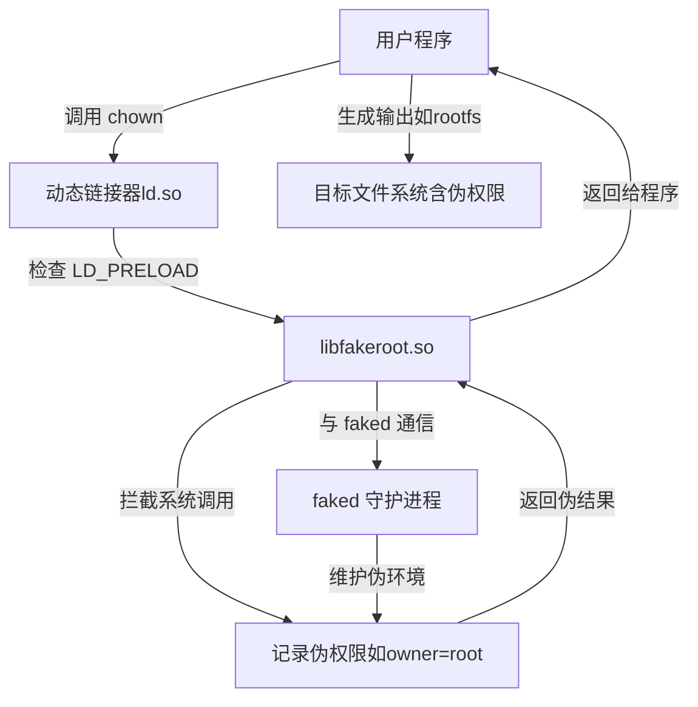

--

fakeroot - run a command in an environment faking root privileges for file manipulation

它主要用来打包或者用来生成image，

假如没有fakeroot，要做具有root权限文件的包的话，需要做的事情既多又麻烦， 

首先切换到root权限，修改目录中所有文件为root权限，打包， 完了之后还需要把权限改回来。

有fakeroot就很方便了，在fakeroot环境中，**只需要做打包动作，里边的所有文件自动的都是root权限。**

fakeroot的一般用法是fakeroot -- script， script是shell脚本，把需要再root权限执行的命令写在脚本里边。

进入fakeroot环境，文件的owner和group自动变为root。 exit 退出fakeroot， 文件的owner和group还原。
退出fakeroot后就返回普通用户状态，fakeroot只在运行过程中起作用。

# 简介

### 工作原理

- fakeroot 通过 LD_PRELOAD 加载一个共享库，拦截涉及权限或文件属性的系统调用。
- 它记录这些操作的“伪”结果（例如，文件的所有者被标记为 root，但实际文件系统未更改）。
- 最终生成的文件（如 tarball 或文件系统镜像）==包含这些伪造的权限信息，适用于目标系统。==

# 原理

作为Buildroot专家，我将详细解释 **fakeroot** 如何通过 `LD_PRELOAD` 加载共享库并拦截系统调用以模拟 root 权限，同时提供一个 Mermaid 图表来可视化这一过程。

### 详细解释：fakeroot 的工作原理

**fakeroot** 是一个工具，它通过在用户空间模拟 root 权限，允许普通用户执行需要 root 权限的操作（如设置文件所有者、权限或创建设备节点），而无需实际提升权限。其核心机制依赖于 `LD_PRELOAD` 和动态链接库的拦截技术，以下是详细的工作原理：

#### 1. **LD_PRELOAD 的作用**
- `LD_PRELOAD` 是一个环境变量，用于指定在程序运行时优先加载的共享库（`.so` 文件）。
- 当一个程序启动时，动态链接器（`ld.so`）会首先加载 `LD_PRELOAD` 中指定的库，覆盖标准 C 库（如 `libc`）中的函数实现。
- 在 fakeroot 中，`LD_PRELOAD` 被设置为一个特定的共享库（通常是 `libfakeroot.so`），这个库包含了被修改过的系统调用实现。

#### 2. **拦截系统调用**
- **目标系统调用**：fakeroot 拦截与文件权限、所有者和设备相关的系统调用，例如：
  - `chown()`：更改文件所有者。
  - `chmod()`：更改文件权限。
  - `mknod()`：创建设备节点。
  - `stat()`：获取文件状态。
  - 其他如 `lchown()`、`fchmod()` 等。
- **拦截机制**：
  - `libfakeroot.so` 重写了这些系统调用的实现。当程序调用这些函数时，会优先调用 `libfakeroot.so` 中的版本，而不是标准 `libc` 的版本。
  - 重写的函数记录操作的“伪”结果（例如，记录文件的所有者为 root），但不实际修改底层文件系统。
  - 这些伪结果通常存储在内存中，或者通过 fakeroot 的守护进程（`faked`）进行管理。

#### 3. **fakeroot 的伪环境**
- fakeroot 维护一个虚拟的权限环境，记录所有被拦截的操作。例如：
  - 当程序调用 `chown("file", 0, 0)`（将文件所有者设为 root），`libfakeroot.so` 会记录“file 的所有者是 root”，但实际文件系统的所有者不变。
  - 当程序调用 `stat()` 查询文件状态时，`libfakeroot.so` 返回伪造的状态信息，显示文件的所有者为 root。
- 这个伪环境确保程序“认为”它在 root 权限下运行，而实际文件系统未被修改。

#### 4. **通信与状态管理**
- fakeroot 使用一个守护进程（`faked`）来管理伪权限状态。
- 当程序运行在 fakeroot 环境中时，`libfakeroot.so` 通过与 `faked` 进程通信（通常通过 TCP 或 Unix 套接字），同步伪造的权限信息。
- 这种机制允许多个进程共享相同的伪环境，确保一致性。

#### 5. **生成最终结果**
- 在 Buildroot 中，fakeroot 通常用于打包根文件系统（如 `tar`、`ext4` 或 `squashfs` 镜像）。
- 当生成这些文件时，fakeroot 确保打包工具（如 `tar`）使用伪造的权限信息。例如，`tar` 会将文件记录为 root 所有，但实际操作由普通用户完成。
- 最终输出的文件系统镜像包含正确的权限和所有者信息，适用于目标系统。

#### 6. **优势与局限性**
- **优势**：
  - 安全性：无需实际 root 权限，降低系统风险。
  - 便携性：可以在非特权环境中（如 CI/CD 管道）运行构建任务。
  - 兼容性：适用于大多数需要权限操作的工具（如 `tar`、`dpkg`）。
- **局限性**：
  - 仅限于用户空间的系统调用，无法模拟需要内核权限的操作（如挂载文件系统）。
  - 性能开销：拦截和记录系统调用会略微增加开销。
  - 复杂性：调试伪环境中的问题可能需要检查 `faked` 日志或 `LD_PRELOAD` 配置。

### Buildroot 中的具体应用
在 Buildroot 中，fakeroot 通常在以下场景中使用：
- **根文件系统生成**：Buildroot 使用 fakeroot 执行 `tar` 或 `mksquashfs`，以设置目标文件系统的权限和所有者。
- **设备节点创建**：创建设备文件（如 `/dev/null`）需要 `mknod`，而 fakeroot 模拟这一操作。
- **打包**：在生成最终镜像时，fakeroot 确保所有文件元数据正确。

例如，Buildroot 可能运行以下命令：
```bash
LD_PRELOAD=/path/to/libfakeroot.so fakeroot tar -cf output/images/rootfs.tar -C output/target .
```
这里，`LD_PRELOAD` 加载 `libfakeroot.so`，拦截 `tar` 的系统调用，确保输出的 `rootfs.tar` 包含正确的权限。

### Mermaid 图表：fakeroot 工作流程

以下是 fakeroot 工作流程的 Mermaid 图表，展示了程序、动态链接器、共享库和伪环境之间的交互。



### 图表说明
- **用户程序**：如 `tar` 或 Buildroot 的打包工具，发起权限相关系统调用。
- **动态链接器**：加载 `libfakeroot.so`，因为 `LD_PRELOAD` 指定了它。
- **libfakeroot.so**：拦截系统调用，记录伪权限，并与 `faked` 守护进程通信。
- **faked 守护进程**：管理伪环境，确保多个进程共享一致的权限状态。
- **伪权限记录**：存储虚拟的权限信息（如文件所有者为 root）。
- **目标文件系统**：最终生成的镜像或 tarball，包含伪造的权限信息。

### 调试与注意事项
- **调试问题**：
  - 如果权限设置不正确，检查 `LD_PRELOAD` 是否正确设置。
  - 使用 `strace` 查看拦截的系统调用，或检查 `faked` 日志。
- **环境配置**：
  - 确保主机系统安装了 `fakeroot`（Buildroot 通常会自动处理）。
  - 检查 Buildroot 的 `BR2_ROOTFS_DEVICE_TABLE` 是否正确定义设备节点。
- **性能优化**：
  - 减少不必要的系统调用以降低拦截开销。
  - 在 CI 环境中，确保 `faked` 进程正常运行。

如果你有更具体的问题（例如如何在 Buildroot 中配置 fakeroot、处理特定错误，或优化性能），可以提供更多细节，我会进一步协助！

# buildroot里的fakeroot使用

在fs/common.mk里

```
>>>   Generating filesystem image rootfs.cpio
>>>   Generating filesystem image rootfs.ext2
>>>   Generating filesystem image rootfs.tar
```

是要生成一个fakeroot脚本，在这个目录下：

```
hanliang.xiong@walle01-sz:~/work/a113x2/code14/output/a5_av400_a6432_release/build/buildroot-fs$ tree
.
├── cpio
│   └── fakeroot
├── ext2
│   └── fakeroot
├── full_devices_table.txt
├── full_users_table.txt
└── tar
    └── fakeroot
```

例如，看cpio/fakeroot的内容：

```
set -e
chown -h -R 0:0 $output/build/buildroot-fs/cpio/target
chown -h -R 1000:1000 '$output/build/buildroot-fs/cpio/target//var/run/dbus'
$output/host/bin/makedevs -d $output/build/buildroot-fs/full_devices_table.txt $output/build/buildroot-fs/cpio/target
if [ ! -e $output/build/buildroot-fs/cpio/target/init ]; then 
    /usr/bin/install -m 0755 "fs/cpio"/init $output/build/buildroot-fs/cpio/target/init; 
fi
mkdir -p $output/build/buildroot-fs/cpio/target/dev
mknod -m 0622 $output/build/buildroot-fs/cpio/target/dev/console c 5 1


cd $output/build/buildroot-fs/cpio/target \
&& cat /mnt/fileroot/hanliang.xiong/work/a113x2/code14/buildroot/"board/amlogic/mesona5_av400/initramfs/ramfslist-32-ext2" \
| grep -v "^#" | cpio --quiet -o -H newc >$output/images/rootfs.cpio
```

简单说，就是打包一个rootfs.cpio。通过ramfslist-32-ext2来指定打包的内容，另外还创建了一些device。

命令是这样调用的：

```
PATH=$$(BR_PATH) FAKEROOTDONTTRYCHOWN=1 $$(HOST_DIR)/bin/fakeroot -- $$(FAKEROOT_SCRIPT)
```


# /usr/lib/libfakeroot-sysv.so

与faked通讯的库文件是/usr/lib/libfakeroot/libfakeroot-sysv.so，

但是/usr/lib/libfakeroot-sysv.so也是存在的。

这个文件是在fakeroot中运行suid程序所必须的。 

fakeroot中会设定LD_LIBRARY_PATH环境变量。

设定LD_LIBRARY_PATH后LD_PRELOAD就不需要是完整路径了。

但是如果LD_PRELOAD不使用完整路径，suid的程序会忽略LD_LIBRARY_PATH而直接在/lib与/usr/lib中寻找LD_PRELOAD指定的库文件。

如果LD_PRELOAD指定的文件没有找到这个suid的程序就会启动失败。

所以会存在/usr/lib/libfakeroot-sysv.so这样一个suid的dummy库，

在运行suid程序的时候通过LD_PRELOAD加载这个库，就跟没有加载任何东西一样，正常执行。

 * 普通的程序 使用LD_LIBRARY_PATH=/usr/lib/libfakeroot LD_PRELOAD=libfakeroot-sysv.so，通过preload加载/usr/lib/libfakeroot/libfakeroot-sysv.so的与faked通讯 * suid的程序 无视LD_LIBRARY_PATH， 使用LD_PRELOAD=libfakeroot-sysv.so，通过preload加载/usr/lib/libfakeroot-sysv.so，因为这是一个dummy库，就与这个库不存在一样，程序正常执行。


# 参考资料

1、fakeroot

https://blog.csdn.net/dongkun152/article/details/88534669