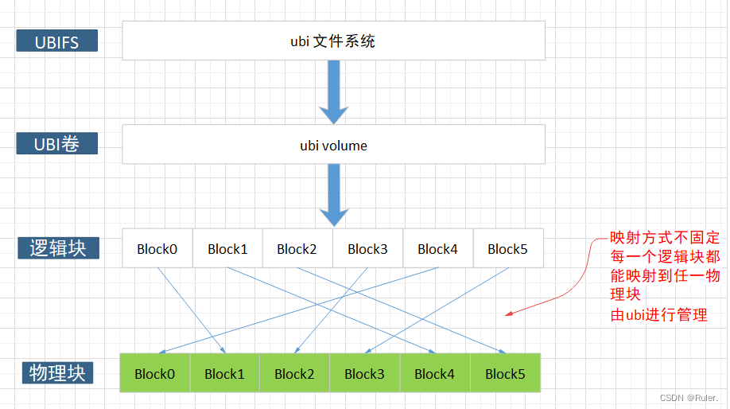

--

ubifs是一个新出现的，应用于mtd之上的文件系统。

可以有效地处理坏块和实现磨损平衡。

同时访问速度更快，消耗内存更小。

还有日志功能。

是jffs2的增强版本。

在mtd设备上存在着partition，在ubi上存在volume，他们之间什么关系？

同时也存在着两个概念mtd device，ubi device，他们之间的区别和联系又是什么？


在Linux下的documentation目录下，ubifs.txt里。

ubi是Unsorted Block Images的缩写。

ubifs是一个flash文件系统。专门为flash设备而设计的。

ubifs跟Linux上传统的文件系统都不一样。

ubifs代表了这样一类文件系统，**它跟mtd设备一起工作，而不是block设备。**

jffs2跟ubifs是一个类型的。


mtd device和block device的区别：

1、mtd device代表flash device，它们由相当大的eraseblock组成（一般是128KB）。

而block device一般是512B。

2、mtd device支持3种操作：

​	在一个eraseblock里，偏移某个值来读取。

​	在一个eraseblock里，偏移某个值来写入。

​	擦除整个eraseblock。

block device支持2种主要操作：

​	读取整个block。

​	写入整个block。

3、eraseblock在写入前需要全部擦除。而block则可以直接写。

4、eraseblock会在多次写入后磨损掉，block则不会。

5、eraseblock可能坏掉（只是对nand），软件必须处理坏块。block则不需要软件处理，硬件会自动处理掉。


ubifs工作在ubi之上。

ubi是一个单独的软件层，代码在drivers/mtd/ubi目录。

ubi提供的volume概念是比mtd device更高层的抽象。


**对ubi device的编程模型，跟mtd device的编程模型很像。**

ubi device没有磨损和坏块的限制。

在某种意义上，ubifs是下一代的jffs2 。

但是它跟jffs2很不一样，也不兼容。

下面是ubifs和jffs2的区别：

1、jffs2基于mtd device，而ubifs基于ubi。

2、jffs2没有on-media的index，必须在挂载的时候进行构建。这个就需要进行整个flash的扫描。而ubifs则不需要进行扫描。这样就加快了启动速度。

3、jffs2是write-through模式，而ubifs是write-back模式。所以ubifs更快。


跟jffs2类似，ubifs支持实时压缩，这样就占用很小的空间。

跟jffs2一样，ubifs也可以很好地应对意外断电。

**不需要fsck.ext2这样的处理。**

**ubifs自动根据日志进行恢复。保证flash上数据的完整性。**


ubifs是对数性能的，因为底层数据结构主要是树。

所以挂载时间和内存消耗，不是随着大小线性递增的。

jffs2也是如此。

这是因为ubifs在flash上维护了文件系统索引。

但是，ubifs是基于ubi的，而ubi是线性的。

所以整体上还是线性的。

但是比jffs2还是要好多了。


**ubifs的作者相信，开发完全对数性能的ubi2是可能的。**


编译时的ubi处理：


运行时的ubi处理：

```
 # ls /dev/ubi* -lh
crw-rw----    1 root     root      235,   0 Jan  1 00:00 /dev/ubi0
crw-rw----    1 root     root      235,   1 Jan  1 00:00 /dev/ubi0_0
crw-rw----    1 root     root      234,   0 Jan  1 00:00 /dev/ubi1
crw-rw----    1 root     root      234,   1 Jan  1 00:00 /dev/ubi1_0
crw-rw----    1 root     root       10,  55 Jan  1 00:00 /dev/ubi_ctrl
```


# UBIFS的一些特点

(1)可扩展性：

UBIFS对flash尺寸有着很好的扩展性；

也就是说mount时间，内存消耗以及I/O速度都不依赖于flash尺寸（对于内存消耗的描述并不完全准确，但是依赖性非常的低）；

UBIFS可以很好的运行在GB级的flash设备;

当然UBI本身还是有扩展性的问题，

无论如何UBI/UBIFS都比JFFS2的可扩展性好，如果UBI成为瓶颈，可以改进UBI而不需改变UBIFS本身。


(2)快速mount：

不像JFFS2，UBIFS在mount阶段不需要扫描整个文件系统，

UBIFSmount的时间只是毫秒级，时间不依赖与flash的尺寸；

然而UBI的初始化时间是依赖flash的尺寸的，因此必须把这个时间考虑在内。


(3)write-back支持：

回写或者叫延迟写更准确些吧，

同JFFS2的write-through(立即写入内存)相比可以显著的提高文件系统的吞吐量。


(4)异常unmount适应度：

UBIFS是一个日志文件系统可以容忍突然掉电以及unclean重启；

UBIFS 通过replay日志来恢复unclean unmount，

在这种情况下replay会消耗一些时间，因此mount时间会稍微增加，

但是replay过程并不会扫描整个flash介质，所以UBIFS的异常mount时间大概在几分之一秒。


(5)快速I/O- 

即使我们disable write-back（可以在unmount时使用-osync mount选项）， 

UBIFS的性能仍然接近JFFS2;

记住，JFFS2的同步I/O是非常惊人的，

因为JFFS2不需要在flash上维护indexing data结构， 所以就没有因此而带来的负担；

而UBIFS恰恰是有index数据的，

UBIFS之所以够快是因为UBIFS提交日志的方式：

不是把数据从一个地方移动到另外一个位置，而只是把数据的地址加到文件系统的index，

然后选择不同的eraseblock作为新的日志块，此外还有multi-headed日志方式等技巧。


(6)on-the_flight compression -

存储在flash介质上的数据是压缩的；

同时也可以灵活的针对单个文件来打开关闭压缩。

例如，可能需要针对某个特定的文件打开压缩；

或者可能缺省方式下支持压缩，但是对多媒体文件则关闭压缩。


(7)可恢复性- 

UBIFS可以从index破坏后恢复；

UBIFS中的每一片信息都用一个header来描述，

因此可以通过扫描整个flash介质来重构文件系统，

这点和JFFS2非常类似。

想像一下，如果你擦除了FAT文件系统的FAT表，对于FAT文件系统是致命的错误，

但是如果擦除UBIFS的index，你仍然可以重构文件系统，

当然这需要使用一个用户空间程序来做恢复


(8)完整性-

UBIFS通过把checksum写到flash介质上来保证数据的完整性，

UBIFS不会无视损坏的文件数据或meta-data；

缺省的情况，UBIFS仅仅检查meta-data的CRC，但是你可以通过mount选项，强制进行dataCRC的检查。


https://blog.csdn.net/yiwuxue/article/details/10464277

# ubi

UBIFS工作在UBI卷之上，不能在MTD设备之上运行，也不能在block设备上运行，

因为ubifs的设计就是raw flash设备之上的文件系统。

**这里为了便于理解，提到了一点ubusfs的概念，本文将着重介绍ubi，ubifs不是本文的重点内容。**




UBI的主要功能如下：

UBI 提供可以动态创建、删除或调整大小的卷；
UBI 在整个闪存设备上实现磨损均衡(您可能认为您在不断地写入/擦除UBI卷的同一个逻辑擦除块，但实际上UBI 会将其均衡分配到闪存芯片的所有物理擦除块)；
UBI 透明地处理坏物理擦除块；
UBI会处理坏的擦除块，无需上层软件参与。 UBI 有一个保留的物理擦除块池，当一个物理擦除块变坏时，它会透明地用一个好的物理擦除块替换它。 UBI 将数据从新发现的坏物理擦除块移动到好的物理擦除块。 结果是 UBI 卷的用户不会注意到 I/O 错误，因为 UBI 会透明地处理它们。
UBI 通过清理将丢失数据的机会降至最低。
NAND 闪存容易受到读写操作中发生的位翻转错误的影响。位翻转由ECC校验和纠正，但它们可能会随着时间的推移累积并导致数据丢失。UBI通过将数据从具有位翻转的物理擦除块移动到其他物理擦除块来处理这个问题。这个过程称为scrub。 scrub工作在后台透明地完成，并且对上层隐藏。


一个UBI卷就是一串连续的逻辑擦除块(LEBs)。

UBI卷大小在创建卷时指定，但以后可能会更改（卷可动态调整大小）。UBI提供用户空间工具用于操作UBI卷。

UBI卷有两种类型：

静态卷。 静态卷是只读的，其内容受CRC-32校验和保护。
动态卷。动态卷是可读写的，上层(文件系统)负责确保数据完整性。

静态卷通常用于内核、initramfs 和 dtb。 较大的静态卷在打开时可能会损失部分性能，因为需要计算 CRC-32。

动态卷可以动态创建、删除、调整大小。内核、initramfs或dtb之外的其他镜像最好使用动态卷。

MTD分区和UBI卷的相同点：

两者都由擦除块组成——在UBI卷的情况下是逻辑擦除块，在MTD分区的情况下是物理擦除块；
两者都支持三种基本操作：读、写和擦除。


参考资料

1、

https://blog.csdn.net/qq_24835087/article/details/125336305

# ubi命令行工具

这篇文章里讲得很好。

https://blog.csdn.net/qq_24835087/article/details/125336305

tools	说明	备注
ubinfo	提供有关在系统中找到的UBI设备和卷的信息	
ubiattach	链接MTD设备（原始Flash设备）到UBI并且创建相应的UBI设备	
ubidetach	将MTD设备与UBI设备分离（与ubiattach的作用相反）；	
ubimkvol	在 UBI 设备上创建 UBI 卷	
ubirmvol	从 UBI 设备中删除 UBI 卷	
ubiblock	管理 UBI 卷的块接口	
ubiupdatevol	更新ubi卷，也可以用来清空ubi卷	
ubicrc32	计算与 UBI使用的初始种子相同的文件的 CRC-32校验和	
ubinize	生成ubi镜像	注意是ubi镜像不是ubifs镜像
ubiformat	格式化空flash，擦除flash并保留擦除计数器，将UBI镜像写入flash	
mtdinfo	查看系统中所有的mtd设备信息	

## ubinize


## ubiattach

ubiattach工具用于链接MTD设备（raw Flash设备）到UBI并且创建相应的UBI设备。

ubiattach的mtd设备可以是空设备，

也可以是已经烧写了ubi镜像的设备；

如果是前者，还需要手动创建卷之后才能使用。

如果是后者，则会自动识别里面的ubi镜像信息，

并根据ubi镜像的配置文件()自动创建卷，最后由用户手动挂载就可以使用了。


a tool to attach MTD device to UBI.

这个工具的源代码在：mtd-2.1.1 目录下。

/sys/class/ubi

典型用法：

```
ubiattach /dev/ubi_ctrl -m 5
```

-m 5表示跟哪个mtd设备关联。

```
Creating 7 MTD partitions on "spi-nand0":
0x000000000000-0x000000200000 : "bootloader"
0x000000800000-0x000001000000 : "tpl"
0x000001000000-0x000001040000 : "misc"
0x000001040000-0x000001d40000 : "recovery"
0x000001d40000-0x000002740000 : "boot"
0x000002740000-0x000006f40000 : "system"
0x000006f40000-0x000008000000 : "data"
```


```
/dev/mtd5 is ready now.
#[ubiattach /dev/ubi_ctrl -m 5]
[    3.573093@1] ubi0: attaching mtd5
[    4.740347@1] ubi0: scanning is finished
[    4.764738@1] ubi0: attached mtd5 (name "system", size 72 MiB)
[    4.764943@1] ubi0: PEB size: 131072 bytes (128 KiB), LEB size: 126976 bytes
[    4.772015@1] ubi0: min./max. I/O unit sizes: 2048/2048, sub-page size 2048
[    4.778974@1] ubi0: VID header offset: 2048 (aligned 2048), data offset: 4096
[    4.786031@1] ubi0: good PEBs: 576, bad PEBs: 0, corrupted PEBs: 0
[    4.792183@1] ubi0: user volume: 1, internal volumes: 1, max. volumes count: 128
[    4.799538@1] ubi0: max/mean erase counter: 2/0, WL threshold: 4096, image sequence number: 4052910
[    4.808551@1] ubi0: available PEBs: 0, total reserved PEBs: 576, PEBs reserved for bad PEB handling: 20
[    4.817957@0] ubi0: background thread "ubi_bgt0d" started, PID 140
```

```
#[ mount -t ubifs /dev/ubi0_0 /mnt ]
[    4.839707@0] UBIFS (ubi0:0): background thread "ubifs_bgt0_0" started, PID 142
[    5.050557@1] UBIFS (ubi0:0): UBIFS: mounted UBI device 0, volume 0, name "rootfs"
[    5.052500@1] UBIFS (ubi0:0): LEB size: 126976 bytes (124 KiB), min./max. I/O unit sizes: 2048 bytes/2048 bytes
[    5.062589@1] UBIFS (ubi0:0): FS size: 68694016 bytes (65 MiB, 541 LEBs), journal size 9023488 bytes (8 MiB, 72 LEBs)
[    5.073161@1] UBIFS (ubi0:0): reserved for root: 0 bytes (0 KiB)
[    5.079127@1] UBIFS (ubi0:0): media format: w4/r0 (latest is w5/r0), UUID FD061054-FD5B-4D42-B118-CC595420E6D6, small LPT model
[    5.886634@0] UBIFS (ubi0:0): background thread "ubifs_bgt0_0" stops
[    6.282854@0] meson_rsv_env_read 856 read 0x2000 bytes from env, ret 0
[    6.340795@1] ubi1: attaching mtd6
[    6.604446@1] factory bad block at 0x7fe0000
[    6.604484@1] ubi1: scanning is finished
[    6.639079@1] ubi1: attached mtd6 (name "data", size 16 MiB)
[    6.639123@1] ubi1: PEB size: 131072 bytes (128 KiB), LEB size: 126976 bytes
[    6.646196@1] ubi1: min./max. I/O unit sizes: 2048/2048, sub-page size 2048
[    6.653100@1] ubi1: VID header offset: 2048 (aligned 2048), data offset: 4096
[    6.660195@1] ubi1: good PEBs: 133, bad PEBs: 1, corrupted PEBs: 0
[    6.666379@1] ubi1: user volume: 1, internal volumes: 1, max. volumes count: 128
[    6.673720@1] ubi1: max/mean erase counter: 2/0, WL threshold: 4096, image sequence number: 1777042946
[    6.682992@1] ubi1: available PEBs: 0, total reserved PEBs: 133, PEBs reserved for bad PEB handling: 19
[    6.692373@0] ubi1: background thread "ubi_bgt1d" started, PID 169
```

上面这个ubiattach是在S02overlayfs里做的。

```
在rcS文件的最前面，提前调用这个overlayfs的。
/etc/init.d/S02overlayfs start
```

里面内容是：

```
start() {
  . /etc/datamount
  . /etc/overlaymount
```


datamount脚本里

```
  #mount data
  ubidetach -p /dev/mtd${data_mtd_number}
  ubiformat -y /dev/mtd${data_mtd_number}
  ubiattach /dev/ubi_ctrl -m ${data_mtd_number}
  #    ubimkvol /dev/ubi1 -s $dataSize"MiB" -N data
  ubimkvol /dev/ubi1 -m -N data
  mount -t ubifs /dev/ubi1_0 /data
```

在overlaymount里

```
do_overlay_mount() { #<overlay dir>
        mkdir -p $1/upper $1/work
        fopivot $1/upper $1/work /rom 1
}
```


## ubimkvol

ubimkvol工具用于在UBI设备上创建UBI卷


# ubi和ubifs关系

UBIFS涉及三个子系统：
\>MTD系统，提供对各种flash芯片的访问接口；drivers/mtd
\>UBI系统，工作在MTD上，提供UBI volume；drivers/mtd/ubi
\>UBIFS文件系统，工作在UBI之上；fs/ubifs

UBI指的是UBI subsystem，其工作在MTD设备上，是MTD设备的高层次表示，对上屏蔽了一些MTD需要处理的问题，如wearing和坏块处理；

而UBIFS指的是UBIFS file system，工作在UBI卷层之上。

在buildroot里，ubi依赖了ubifs。

```
ROOTFS_UBI_DEPENDENCIES = rootfs-ubifs
```

所以是先生成rootfs.ubifs文件。然后生成的rootfs.ubi文件。


源代码打印非常友好，makefile中开启-v选项可以很有效的调试；

mkfs.ubifs  ------ for ubi fs/usr.mnt_app.ubifs
ubinize基于mkfs.ubifs生成UBI分区image

ubinize  ------ for volume image/usr.mnt_app.ubi
以下工具用来协助调试

mtdinfo ------ 查看mtd device 信息
ubinfo ------ 查看ubi分区信息

ubifs.mk里的配置项

```
BR2_TARGET_ROOTFS_UBIFS_LEBSIZE
	配置logical earse block的尺寸。
	默认值是0x1f800
	修改的话，在mkfs.ubifs的时候，传递-e参数。
BR2_PACKAGE_SWUPDATE_AB_SUPPORT
	这个选项应该是我们加的。
BR2_TARGET_ROOTFS_UBIFS_MINIOSIZE
	最小的io单元的size。
BR2_TARGET_ROOTFS_UBIFS_MAXLEBCNT
	最大的logical erase block 个数。
	默认2048.
运行时的压缩方法
	有3个选项：none、gzip、lzo。
压缩镜像文件的方法
	有这些选项：none、gzip、bzip2、lzma、lzo、xz。
BR2_TARGET_ROOTFS_UBIFS_OPTS
	传递给mkfs.ubifs的额外的选项。
```


mkfs.ubifs的命令参数是这样：

```
mkfs.ubifs -d $(TARGET_DIR) $(UBIFS_OPTS) -o $@
```

最重要的是-d指定要打包的目录。

ubi.mk里Config.in的配置项有：

```
BR2_TARGET_ROOTFS_UBI_PEBSIZE
	物理擦除块的尺寸。
BR2_TARGET_ROOTFS_UBI_SUBSIZE
	sub-page的尺寸。
	
```

这边主要使用的工具是ubinize。

还有一个文件来配置相关的参数，ubinize.cfg。

```
[ubifs]
mode=ubi
vol_id=0
vol_type=dynamic
vol_name=rootfs
vol_alignment=1
vol_flags=autoresize
image=BR2_ROOTFS_UBIFS_PATH
```

执行的命令：

```
ubinize -o $@ $(UBI_UBINIZE_OPTS) $(BUILD_DIR)/ubinize.cfg
```


```
51M Feb 11  2022 rootfs.ubi
49M Feb 11  2022 rootfs.ubifs
```


# 处理

## 编译时的处理

就是mkfs.ubifs得到rootfs.ubifs文件，然后ubinize rootfs.ubifs文件得到rootfs.ubi文件。

rootfs.ubi文件被打包到烧录镜像里。

## 运行时的处理

### 先在cpio/init里

```
system_mtd_number=$(cat /proc/mtd | grep  -E "system" | awk -F : '{print $1}' | grep -o '[0-9]\+')
这样来找到system分区对应的mtd块的编号。当前是5 。

```

然后进行ubiattach。

```
ubiattach /dev/ubi_ctrl -m ${system_mtd_number}
```

这个操作的作用是什么？

/dev/ubi_ctrl 这个设备在什么情况下出现？

后面挂载是这样：

```
mount -t ubifs /dev/ubi0_0 /mnt
```

### 在S02overlayfs里

对data分区的处理

```
ubiattach /dev/ubi_ctrl -m ${data_mtd_number}
```

这样会得到/dev/ubi1_0这个设备节点。

下面这个是正常的开机情况。

```
mount -t ubifs /dev/ubi1_0 /data
```

如果是第一次烧录后。则需要下面的操作：

```
  #mount data
  ubidetach -p /dev/mtd${data_mtd_number}
  ubiformat -y /dev/mtd${data_mtd_number}
  ubiattach /dev/ubi_ctrl -m ${data_mtd_number}
  #    ubimkvol /dev/ubi1 -s $dataSize"MiB" -N data
  ubimkvol /dev/ubi1 -m -N data
  mount -t ubifs /dev/ubi1_0 /data
```

## 如果没有ramdisk

上面这些操作在system rootfs里能不能完成？

那就要看uboot的能力了。

看uboot使用ubifs的能力。


参考资料

https://github.com/ARM-software/u-boot/blob/master/doc/README.ubi

# ubi的数据结构

UBI使用了一部分的flash空间用于它自身功能的实现，因此UBI用户所获得的空间会比实际的flash空间要少。也就是说：

Ø  两个PEB用来存储卷表

Ø  一个PEB被保留，用以损耗均衡

Ø  一个PEB被保留，用以原子LEB改变操作

Ø  一定数量的PEB被保留，用以处理坏PEB；这个是用于NANDflash而不是NOR flash；保留的数量是可配置的，默认情况是每1024块保留20块。

Ø  在每个PEB的开头存储EC头和VID头；这个所占用的字节数因flash类型的不同而不同。

Ø  如果支持FASTMAP功能，需要额外的block来支持，一般一个FASTMAP BLOCK小于一个LEB，因此需要保留两个LEB给FASTMAP使用；具体的空间消耗，参考kernel中的如下函数：

# 在ubi上使用squashfs

这个是可以做的，倒是出乎我的意料的。

对RAW Flash ：

- ubiblock：位于UBI顶部的只读块设备
  利用CONFIG_MTD_UBI_BLOCK配置编译。
- 允许将SquashFS放在UBI卷上。
- 引导时间和读取性能不错。非常适合于只读根文件系统。

https://zhuanlan.zhihu.com/p/114583958

# uboot使用ubifs

UBIFS是更强壮的FLash文件系统。很多嵌入式系统都使用了UBIFS。

Xilinx PetaLinux 2018.2也支持UBIFS。只需要在Linux/U-Boot里添加相关配置选项，就能为QSPI Flash创建UBIFS。


**第1步，为Linux Kernel添加UBIFS配置选项。**

需要注意的是，需要去掉SPI_NOR_USE_4K_SECTORS。

```
CONFIG_MTD_UBI=y
CONFIG_MTD_UBI_WL_THRESHOLD=4096
CONFIG_MTD_UBI_BEB_LIMIT=20
# CONFIG_MTD_UBI_FASTMAP is not set
# CONFIG_MTD_UBI_GLUEBI is not set
# CONFIG_MTD_UBI_BLOCK is not set
CONFIG_UBIFS_FS=y
# CONFIG_UBIFS_FS_ADVANCED_COMPR is not set
CONFIG_UBIFS_FS_LZO=y
CONFIG_UBIFS_FS_ZLIB=y
CONFIG_UBIFS_ATIME_SUPPORT=y
# CONFIG_UBIFS_FS_ENCRYPTION is not set
CONFIG_UBIFS_FS_SECURITY=y
CONFIG_CRYPTO_DEFLATE=y
CONFIG_CRYPTO_LZO=y
# CONFIG_MTD_SPI_NOR_USE_4K_SECTORS is not set
```

**第2步，为U-Boot添加UBIFS配置选项。**

```
CONFIG_CMD_MTDPARTS=y
CONFIG_MTDIDS_DEFAULT=""
CONFIG_MTDPARTS_DEFAULT=""
CONFIG_CMD_MTDPARTS_SPREAD=y
CONFIG_CMD_UBI=y
CONFIG_CMD_UBIFS=y
CONFIG_MTD=y
# CONFIG_CFI_FLASH is not set
# CONFIG_ALTERA_QSPI is not set
CONFIG_MTD_UBI=y
CONFIG_MTD_UBI_WL_THRESHOLD=4096
CONFIG_MTD_UBI_BEB_LIMIT=20
# CONFIG_MTD_UBI_FASTMAP is not set
CONFIG_RBTREE=y
CONFIG_LZO=y
```

**第3步，根据单板需要，定义Flash分区。**

启动后，在Linux里可以通过命令 cat /proc/mtd检查。

```
root@zcu106_vcu_trd:/qspi_fs# cat /proc/mtd
dev: size erasesize name
mtd0: 01e00000 00020000 "boot"
mtd1: 00040000 00020000 "bootenv"
mtd2: 00c00000 00020000 "kernel"
mtd3: 055c0000 00020000 "spare"
```

**第4步，在Linux里创建和挂载UBIFS分区。**

如果是第一次启动，在Linux里创建和挂载UBIFS分区。

```
mkdir -p /qspi_fs
ubiformat /dev/mtd3
ubiattach /dev/ubi_ctrl -m 3
ubimkvol /dev/ubi0 -N qspi_ubi0 -m
mount -t ubifs ubi0:qspi_ubi0 /qspi_fs
```

如果不是第一次启动，直接在Linux里挂载UBIFS分区。

```
ubiattach /dev/ubi_ctrl -m 3
mount -t ubifs ubi0:qspi_ubi0 /qspi_fs
```

**第5步，创建分区后，在U-Boot里使用UBIFS。**

```
sf probe 0 50000000 0
setenv partition "nor0,3" # Activate mtd3.
setenv mtdids "nor0=spi0.0"
setenv mtdparts "mtdparts=spi0.0:30m(boot),256k(bootenv),12m(kernel),87808k(spare)"
mtdparts
ubi part spare # Select mtd3.
mtd
ubifsmount ubi0:qspi_ubi0
ubifsls
ubifsload 0x2000000 qspi_fs_ready__do_not_remove.bin.md5
```


参考资料

1、

http://www.armadeus.org/wiki/index.php?title=UBIFS#U-Boot_access_to_UBIFS_partitions

2、

https://www.rocketboards.org/foswiki/Documentation/EnablingUBIFS

# 使用qemu来研究ubifs


# ubifs vs squashfs

ubifs相比于squashfs有什么优势？


参考资料

1、

https://ewh.ieee.org/r4/se_michigan/cs/20131019/A%20Comparative%20Analaysis%20Between%20Embedded%20Linux%20File%20Systems_old_format.pdf

2、

https://zhuanlan.zhihu.com/p/114583958

# 直接挂载ubifs为rootfs

```
2）设置UBIFS文件系统作为根文件系统启动的参数

OMAP3 DevKit8000 # setenv bootargs console=ttyS2,115200n8 ubi.mtd=4 root=ubi0:rootfs
    rootfstype=ubifs video=omapfb:mode:4.3inch_LCD
    OMAP3 DevKit8000 # setenv bootcmd nand read.i 80300000 280000 200000/;bootm 80300000

根文件系统的位置在MTD4上

系统启动时会打印出如下和UBI相关的信息：

Creating 5 MTD partitions on "omap2-nand":
    0x00000000-0x00080000 : "X-Loader"
    0x00080000-0x00260000 : "U-Boot"
    0x00260000-0x00280000 : "U-Boot Env"
    0x00280000-0x00680000 : "Kernel"
    0x00680000-0x08000000 : "File System"
    UBI: attaching mtd4 to ubi0
    UBI: physical eraseblock size: 131072 bytes (128 KiB)
    UBI: logical eraseblock size: 129024 bytes
    UBI: smallest flash I/O unit: 2048
    UBI: sub-page size: 512
    UBI: VID header offset: 512 (aligned 512)
    UBI: data offset: 2048
    UBI: attached mtd4 to ubi0
    UBI: MTD device name: "File System"
    UBI: MTD device size: 121 MiB
    UBI: number of good PEBs: 970
    UBI: number of bad PEBs: 2
    UBI: max. allowed volumes: 128
    UBI: wear-leveling threshold: 4096
    UBI: number of internal volumes: 1
    UBI: number of user volumes: 1
    UBI: available PEBs: 0
    UBI: total number of reserved PEBs: 970
    UBI: number of PEBs reserved for bad PEB handling: 9
    UBI: max/mean erase counter: 2/0
```

所以最关键的这几个赋值：

```
ubi.mtd=4 root=ubi0:rootfs rootfstype=ubifs 
```

ubi.mtd=4 这个传递给了kernel使用吗？

./Documentation/filesystems/ubifs.txt

这个文档看看。

```
 0: SPL                 0x00020000 0x00000000 0  

1: SPL.backup1         0x00020000 0x00020000 0  

2: SPL.backup2         0x00020000 0x00040000 0

 3: SPL.backup3         0x00020000 0x00060000 0

 4: u-boot              0x001e0000 0x00080000 0

 5: u-boot-env          0x00020000 0x00260000 0  

6: kernel              0x00500000 0x00280000 0  

7: rootfs              0x0f880000 0x00780000 0
```


看看下面这个bootargs设置：

If the default arguments are not correct, you can also set them with this command:

```
setenv bootargs 'mem=128M console=ttyS0,115200 mtdparts=atmel_nand:4M(bootstrap/uboot/kernel)ro,-(rootfs) root=/dev/mtdblock1 rw rootfstype=ubifs ubi.mtd=1 root=ubi0:rootfs'
```

那么看起来就是要这样写：

root=/dev/mtdblock6

但是还是不行。

是不是要这样写上mtdparts的信息？

```
mtdparts=atmel_nand:4M(bootstrap/uboot/kernel)ro,-(rootfs)
```

 root=ubi0:rootfs

这个是关键。


参考资料

1、

http://www.embeddedlinux.org.cn/html/filesys/201111/08-1821.html

2、

https://e2e.ti.com/support/processors-group/processors/f/processors-forum/333046/how-to-nandboot-using-ubifs

3、

https://www.linux4sam.org/bin/view/Linux4SAM/FlashRootFs_SAM9N12

4、

https://www.cnblogs.com/zxc2man/p/7568731.html

5、

https://www.toradex.com/zh-cn/blog/ubi-zhi-du-wen-jian-xi-tong

# mtd设备和block设备的区别

./Documentation/filesystems/ubifs.txt这里看到的。

1、mtd设备代表flash设备，由128KB一个的erase block组成。而block设备的block大小一般是512字节。

2、mtd设备支持3种主要的操作：

```
1、在一个eraseblock里的某个offset来读取。
2、在一个eraseblock里某个offset写入。
3、擦除一个eraseblock。
```

而block设备的操作是2个：

```
1、读一个block。
2、写一个block。
```

3、eraseblock必须先擦除才能进行写入。block设备可以直接写。

4、eraseblock的寿命相比于block要短。

5、eraseblock有不容忽视的坏块问题。


# 一个比较复杂的ubinize.cfg文件

```
[sysfs_volume]
mode=ubi
image=machine-image.squashfs
vol_id=0
vol_type=dynamic
vol_name=rootfs
vol_size=55MiB
[md_rootfs_volume]
mode=ubi
image=machine-image.squashfs.verity
vol_id=1
vol_type=dynamic
vol_name=md-rootfs
vol_size=1MiB
[sdatafs_volume]
mode=ubi
image=sdata.squashfs
vol_id=2
vol_type=dynamic
vol_name=sdatafs
vol_size=8MiB
[md_sdatafs_volume]
mode=ubi
image=sdata.squashfs.verity
vol_id=3
vol_type=dynamic
vol_name=md-sdatafs
vol_size=1MiB
[cache_volume]
mode=ubi
vol_id=4
vol_type=dynamic
vol_name=cachefs
vol_size=154MiB
[systemrw_volume]
mode=ubi
vol_id=5
vol_type=dynamic
vol_name=systemrw
vol_size=6MiB
[persist_volume]
mode=ubi
vol_id=6
vol_type=dynamic
vol_name=persist
vol_size=6MiB
[usrfs_volume]
mode=ubi
image=usrfs.ubifs
vol_id=7
vol_type=dynamic
vol_name=usrfs
vol_flags = autoresize
```


https://lore.kernel.org/linux-mtd/66b982ef-c446-e0e7-9d44-41597695dc72@sigma-star.at/t/

# 参考资料

1、

https://blog.csdn.net/oqqyuji12345678/article/details/94616370

2、在Linux下的documentation目录下，ubifs.txt里。

3、

https://blog.csdn.net/man9953211/article/details/97907395

4、ubifs文件系统制作与移植

https://blog.csdn.net/yazhouren/article/details/50109317

5、

http://www.linux-mtd.infradead.org/doc/ubifs.html

6、

https://unix.stackexchange.com/questions/455043/using-squashfs-on-top-of-ubi-as-root-file-system

7、【工程师分享】在Linux/U-Boot里为QSPI Flash使用UBIFS

https://xilinx.eetrend.com/content/2021/100553647.html

8、

https://discussion.en.qi-hardware.narkive.com/TFJ05wcr/testing-an-ubi-ubifs-on-qemu-system-mipsel