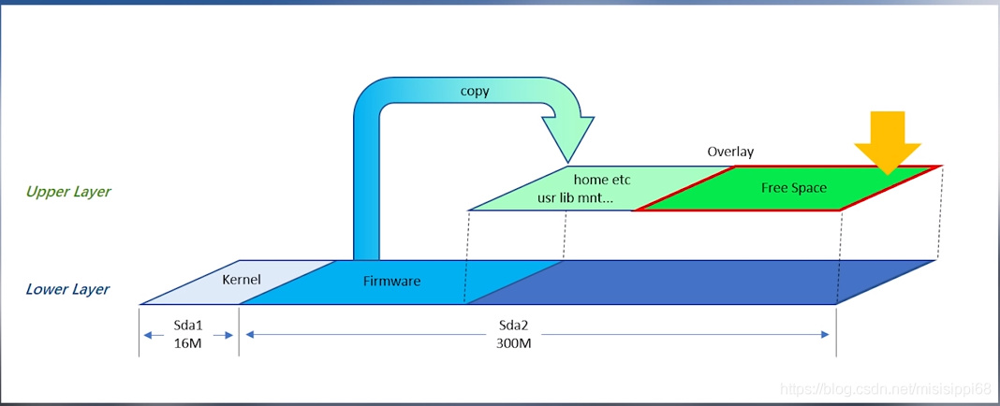

# 什么是overlayfs

overlay的字母含义是覆盖的意思。

overlayfs就是覆盖的文件系统。

它体现的是一种层次关系。

实现简单，性能较好。

特点是：

1、上下合并。

2、同名覆盖。

3、写时拷贝。


docker的底层就用到了overlayfs的机制。

# Ubuntu下的使用

1、这样进行插入对应的模块。

```
teddy@teddy-ubuntu:~/work/mylinuxlab/kernel/linux-stable$ lsmod |grep overlay
teddy@teddy-ubuntu:~/work/mylinuxlab/kernel/linux-stable$ sudo modprobe overlay
teddy@teddy-ubuntu:~/work/mylinuxlab/kernel/linux-stable$ lsmod |grep overlay
overlay                49152  0
```

2、建立一个简单的目录结构，下面的文件分布是这样的。

新建一个overlayfs的目录，下面内容是这样。

```
$tree
.
├── lower
│   └── l1.txt
├── merged
├── upper
│   └── u2.txt
└── work
```

3、挂载。

```
sudo mount -t overlay overlay -olowerdir=./lower,upperdir=./upper,workdir=./work ./merged
```

查看mount的情况：

```
overlay on /home/teddy/work/test/overlayfs/merged type overlay (rw,relatime,lowerdir=./lower,upperdir=./upper,workdir=./work)
```

4、测试。

看看上下合并如何工作。

在挂载之前，merged目录是空的。现在我们到merged里去看看。

```
$tree
.
├── lower
│   └── l1.txt
├── merged
│   ├── l1.txt
│   └── u2.txt
├── upper
│   └── u2.txt
└── work
    └── work [error opening dir]
```

所以上下合并，就是把upperdir和lowerdir的合并到merged目录下。

看看什么是同名覆盖。

我们在merged目录下修改l1.txt文件。

如何到lower目录里去看，lower下的l1.txt还是没有变化。

但是看道upper目录下多了一个l1.txt，内容跟merged下面的一样。

而且，其实就是对应了磁盘上同一个文件。inode号是一样的。

我们现在在merged目录下，删除l1.txt文件。再看。

到upper目录里看，文件变成了一个大小为0的字符设备，谁都没有权限的。overlayfs用这种方式来标记文件的删除。

```
$cd ../upper/
$ls -l
total 0
c--------- 1 root  root  0, 0 3月  31 15:33 l1.txt
```


Squashfs（.sfs）是一套供Linux核心使用的GPL开源只读压缩文件系统。

Squashfs能够为文件系统内的文件、inode及目录结构进行压缩。

Squashfs的设计是专门为一般的只读文件系统的使用而设计，

它可应用于数据备份，或是系统资源紧张的电脑上使用。

OpenWRT 一般使用的文件系统是 SquashFS ，建议下载固件的时候也下载这种固件。

这个文件系统的特点就是：只读、压缩。

**一个只读的文件系统，是怎么做到保存设置和安装软件的呢？**

用/overlay分区。

**固件中已经写入了有个/overlay分区，但它的指向可以更改。**




虽然原来的文件不能修改，但我们把修改的部分放在 overlay 分区上，然后映射到原来的位置，读取的时候就可以读到我们修改过的文件了。

当系统故障，**reset的时候，把固件中配置文件拷贝到overlay层，就恢复到最初设置了**。

这是一个U盘做的软路由，只有4G。

但可以分出其他几个区。

一个用来扩容overlay，剩下当swap，准备安装transmission和docker、samba。

挂载一个硬盘做网络共享。


# 参考资料

1、overlayfs简介

https://www.tuicool.com/articles/6ri2Ej7

2、

https://wenku.baidu.com/view/2c82473ca32d7375a41780ab.html

3、openwrt下面扩容overlay并开启swap

https://blog.csdn.net/misisippi68/article/details/105431455