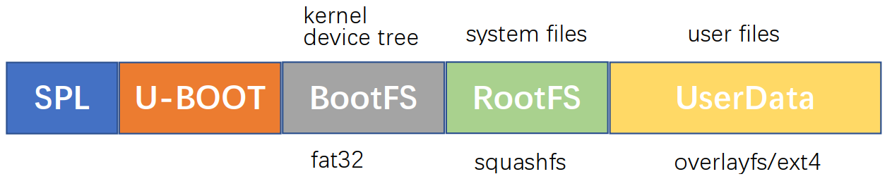

# 什么是overlayfs

overlay的字母含义是覆盖的意思。

overlayfs就是覆盖的文件系统。

它体现的是一种层次关系。

实现简单，性能较好。

特点是：

1、上下合并。

2、同名覆盖。

3、写时拷贝。


docker的底层就用到了overlayfs的机制。

# Ubuntu下的使用

1、这样进行插入对应的模块。

```
teddy@teddy-ubuntu:~/work/mylinuxlab/kernel/linux-stable$ lsmod |grep overlay
teddy@teddy-ubuntu:~/work/mylinuxlab/kernel/linux-stable$ sudo modprobe overlay
teddy@teddy-ubuntu:~/work/mylinuxlab/kernel/linux-stable$ lsmod |grep overlay
overlay                49152  0
```

2、建立一个简单的目录结构，下面的文件分布是这样的。

新建一个overlayfs的目录，下面内容是这样。

```
$tree
.
├── lower
│   └── l1.txt
├── merged
├── upper
│   └── u2.txt
└── work
```

3、挂载。

```
sudo mount -t overlay overlay -olowerdir=./lower,upperdir=./upper,workdir=./work ./merged
```

查看mount的情况：

```
overlay on /home/teddy/work/test/overlayfs/merged type overlay (rw,relatime,lowerdir=./lower,upperdir=./upper,workdir=./work)
```

4、测试。

看看上下合并如何工作。

在挂载之前，merged目录是空的。现在我们到merged里去看看。

```
$tree
.
├── lower
│   └── l1.txt
├── merged
│   ├── l1.txt
│   └── u2.txt
├── upper
│   └── u2.txt
└── work
    └── work [error opening dir]
```

所以上下合并，就是把upperdir和lowerdir的合并到merged目录下。

看看什么是同名覆盖。

我们在merged目录下修改l1.txt文件。

如何到lower目录里去看，lower下的l1.txt还是没有变化。

但是看道upper目录下多了一个l1.txt，内容跟merged下面的一样。

而且，其实就是对应了磁盘上同一个文件。inode号是一样的。

我们现在在merged目录下，删除l1.txt文件。再看。

到upper目录里看，文件变成了一个大小为0的字符设备，谁都没有权限的。overlayfs用这种方式来标记文件的删除。

```
$cd ../upper/
$ls -l
total 0
c--------- 1 root  root  0, 0 3月  31 15:33 l1.txt
```


Squashfs（.sfs）是一套供Linux核心使用的GPL开源只读压缩文件系统。

Squashfs能够为文件系统内的文件、inode及目录结构进行压缩。

Squashfs的设计是专门为一般的只读文件系统的使用而设计，

它可应用于数据备份，或是系统资源紧张的电脑上使用。

OpenWRT 一般使用的文件系统是 SquashFS ，建议下载固件的时候也下载这种固件。

这个文件系统的特点就是：只读、压缩。

**一个只读的文件系统，是怎么做到保存设置和安装软件的呢？**

用/overlay分区。

**固件中已经写入了有个/overlay分区，但它的指向可以更改。**


虽然原来的文件不能修改，但我们把修改的部分放在 overlay 分区上，然后映射到原来的位置，读取的时候就可以读到我们修改过的文件了。

当系统故障，**reset的时候，把固件中配置文件拷贝到overlay层，就恢复到最初设置了**。

这是一个U盘做的软路由，只有4G。

但可以分出其他几个区。

一个用来扩容overlay，剩下当swap，准备安装transmission和docker、samba。

挂载一个硬盘做网络共享。

# 原理

OverlayFS（Overlay File System）是Linux内核提供的一种联合文件系统，它通过将两个或多个不同的文件系统层叠在一起，**形成一个虚拟文件系统，从而实现文件系统的联合挂载和叠加操作。**

OverlayFS的原理如下：

1. OverlayFS由两个文件系统组成：上层文件系统（Upper File System）和下层文件系统（Lower File System）。**上层文件系统是可写的，用于存储用户对文件系统的修改，而下层文件系统是只读的，用于存储原始文件系统的内容。**

2. 当应用程序对文件系统进行读操作时，OverlayFS会首先在上层文件系统中查找相应的文件。如果找到了，就直接返回给应用程序。如果没有找到，OverlayFS会继续在下层文件系统中查找。

3. 当应用程序对文件系统进行写操作时，OverlayFS会将修改的文件复制到上层文件系统，并在上层文件系统中创建一个新的文件。这样，原始的下层文件系统不会被修改，只有上层文件系统中的副本发生变化。

4. 当需要删除文件时，OverlayFS只会删除上层文件系统中的文件，而不会影响下层文件系统中的文件。

5. OverlayFS还支持多个下层文件系统的层叠。可以通过将多个下层文件系统叠加在一起，形成一个更复杂的联合文件系统。

通过使用OverlayFS，可以在不修改原始文件系统的情况下，对文件系统进行修改和扩展。这使得OverlayFS成为容器化技术中重要的组成部分，用于实现容器的文件系统隔离和镜像层叠。

# overlayfs在嵌入式系统的应用

在嵌入式系统中，OverlayFS的应用主要体现在以下方面：

1. 系统更新和回滚：OverlayFS可以用于实现系统更新和回滚的机制。通过将新版本的文件系统作为上层文件系统，原始版本的文件系统作为下层文件系统，可以在运行时切换文件系统版本，实现系统的更新和回滚功能。

2. 文件系统快照和恢复：OverlayFS可以创建文件系统的快照，将当前的文件系统状态保存为一个只读的下层文件系统，并在上层文件系统中进行修改。如果需要恢复到之前的文件系统状态，只需要丢弃上层文件系统的修改，回到快照状态。

3. 系统镜像和根文件系统：OverlayFS可以用于构建嵌入式系统的根文件系统。通过将只读的根文件系统作为下层文件系统，可写的文件系统作为上层文件系统，可以实现对根文件系统的修改和扩展。

4. 联合挂载：OverlayFS可以将多个文件系统叠加在一起，形成一个联合挂载的文件系统。这在嵌入式系统中可以用于将多个存储设备或分区合并成一个统一的文件系统，方便管理和访问文件。

总的来说，OverlayFS在嵌入式系统中的应用主要涉及文件系统的管理、更新、回滚和扩展等方面，提供了灵活性和易用性，使得嵌入式系统的文件系统操作更加方便和高效。

# ext4可以overlay在squashfs上吗

## 结论

是可以。

本文接下来将介绍如何使用 squashfs 只读文件系统制作 Linux 系统文件，

并采用 overlayfs 为用户目录增加可写权限。

演示采用 Colibri iMX6 计算机模块，该方法同样也适用于 Toradex 其他产品，如 iMX8 计算机模块。

Squashfs 是一种只读压缩文件系统，

通常被用于数据备份或者系统资源受限的计算机系统上使用，

如 Linux 发行版的 LiveCD，OpenWRT 系统也采用 squashfs。

OverlayFS 一个结合其他文件系统的联合挂载，将多个挂载点叠加为一个目录。

常见的应用是在一个只读的分区上叠加可读写的另一个分区。

嵌入式 Linux 设备通常的功能都是被设计好的，

极少需要在后期安装其他软件或更改 Linux 系统软件，

更多的是更新设备应用程序和相关数据。

因此基于 squashfs 的只读文件系统，结合 overlayfs 为用户应用和数据提供读写操作，能够提高嵌入式 Linux 文件系统可靠性。

在 Colibri iMX6 的 eMMC 上我们将使用以下分区规划。

BootFS 为 FAT32 格式，

该分区上包含 Linux 内核文件，device tree 等启动文件，

如果是 iMX8，则还包含一些其他固件文件。

该分区通常只在文件系统烧写阶段被写入。

RootFS 分区是 Linux 运行的文件系统，usr, bin, lib, etc, home 等目录都在上面。

一般该分区是EXT3，EXT4 格式，支持文件的写入和删除。

而文件系统的损坏也常发生于此，最终导致设备启动失败。

**因此我们这里会采用只读格式的 squashfs 。**

**UserData 是能够读写的 EXT4 分区。**

该分区通过 overlayfs 会被挂载到原本位于只读 squashfs  中的 /home/root 目录。

用户应用可以毫无察觉得使用该目录，在上面写入和删除文件，

但不破坏只读 squashfs 文件系统，

所有的操作都会被转移到 UserData 分区上。

用户的应用也会存在 UserData 分区上，启动的时候从这里加载应用程序。

该分区是可写的，所有这上面的文件是可以被更新。




https://www.toradex.com/zh-cn/blog/shi-yongsquashfs-heoverlayfs-ti-gao-qian-ru-shilinux-wen-jian-xi-tong-ke-kao-xing

# 参考资料

1、overlayfs简介

https://www.tuicool.com/articles/6ri2Ej7

2、

https://wenku.baidu.com/view/2c82473ca32d7375a41780ab.html

3、openwrt下面扩容overlay并开启swap

https://blog.csdn.net/misisippi68/article/details/105431455

4、内核文档

https://docs.kernel.org/filesystems/overlayfs.html