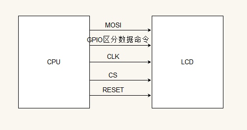

--

# 查询信息

This is an exercise in interfacing the 2.4" TFT LCD display (ili9341) via a SPI bus. The newer using the **tinyDRM** driver and the older uses **fbtft**.

这个应该有参考意义。

tinydrm具体是指什么？


https://elixir.bootlin.com/linux/latest/source/drivers/gpu/drm/tinydrm/ili9341.c


最近某宝上买了几块小屏幕，1.3寸和2.0寸的，驱动都是ST7789V，

```
我当前要调的就是基于这个驱动ic的。
```


网上看了下，基本都是使用fbtft驱动，而且内核都是5.0以下的才能用，

5.0以上的教程很少，

又去fbtft作者GitHub上翻阅得知作者又开发了新的驱动模块TinyDRM(地址)，

据他描述，TinyDRM对比fbtft有以下优点:

DRM在用户空间要求刷新屏幕的时候才刷新，而fbtft刷新屏幕是按照固定的帧率进行刷新（fbtft的fps参数）。

fbtft只能一次刷新整个屏幕，而DRM没有这样的限制。

fbtft在探测(probe)到屏幕后打开它,DRM在使用屏幕的时候才会打开它。

fbtft的rotate值变成了rotation

DRM支持双缓冲和page-flips(应该是一种可以避免图像撕裂现象(tearing effect)的算法)。

DRM支持在GPU中渲染，然后在屏幕上显示。

当然`TinyDRM`的缺点也是有的：只能使用兼容标准`MIPI-DCS`命令集的显示IC，非标准命令集的无法使用。典型例子就是0x2A,0x2B,0x2C


进入内核源码目录`drivers/gpu/drm/tiny`,复制以下代码，保存为st7789v.c:

这样，源代码修改工作就完成了。
然后打开menuconfig,Device Drivers -> Graphics Support -> DRM support for Sitronix ST7789V display panels空格键改成M，编译。
编译完之后，丢到rootfs里面去。


可以看到tinydrm，并不是/dev/fb。那么怎么被lvgl和qt使用呢？

看看之前我调试过的S400上的显示屏。

有个在荔枝派上调试的。

```
Device Drivers  --->
     【*】 Staging drivers  --->
              <*>   Support for small TFT LCD display modules  --->
                        <*>   FB driver for the ST7789V LCD Controller
```

设备树这么写的

```
&spi0{
    
    status = "okay";
    st7789v: st7789v@0{
    
        compatible = "sitronix,st7789v";
        reg = <0>;
        status = "okay";
        spi-max-frequency = <36000000>;
        spi-cpol;
        spi-cpha;
        rotate = <0>;
        fps = <60>;
        buswidth = <8>;
        rgb;
        dc-gpios    = <&pio 1 5 GPIO_ACTIVE_HIGH>;  // PB5 
        reset-gpios = <&pio 1 6 GPIO_ACTIVE_HIGH>;  // PB6
        led-gpios   = <&pio 1 7 GPIO_ACTIVE_LOW>;   // PB7
        width = <240>;
        height= <320>;
        debug = <0>;
    };
};
```


这个默认就是在驱动里的。kernel5.4的也有这个文件。

./staging/fbtft/fb_st7789v.c

具体能不能用呢？


这篇文章是一个讨论调试过程的帖子。

https://whycan.com/t_2749.html

好像是5.x内核自带的7789驱动有问题，需要修改


可以适应drm方式，也可以适应fb方式。

对于这么小的屏幕，drm的性能提升不是重点。


https://www.bilibili.com/read/cv9947785

这篇文章讲了怎么移植的。还得改一些代码。

5.4的内核肯定可以，因为这个是在5.7的基础上改的。


# 开始调试

先看看硬件信息。

显示屏

```
2.4英寸
240x320
tft
4线spi
26万色
驱动芯片ST7789V

硬件pin脚
14个。

```

接线就是常规的4线spi。

cs引脚是受控的。不是接线这样的。

所以还得自己控制。

然后看看当前厂家给的初始化时序。

```
厂家的代码是单片机代码。
lcd_init的过程
1、复位，是制造一个低脉冲。
2、然后写了一个初始化序列。
3、
```

从这个看，写之前，先选中，写完了，释放掉。

还有一个引脚来区分命令和数据。文档里确实有这么一句。


```
void WriteComm(unsigned int i)
{

    CS0 = 0;
    RS=0;	
	SendDataSPI(i);

	CS0 = 1;

}
void WriteData(unsigned int i)
{
    CS0 = 0;
    RS=1;
	SendDataSPI(i);

	CS0 = 1;
}
```

这个引脚区分命令和数据的方式，值得注意一下。

看看linux里当前是怎么处理的。

也有考虑到这种情况。这个就是区分命令和数据的gpio吧。

```
fbtft_request_one_gpio(par, "dc-gpios", 0, &par->gpio.dc);
```


三线SPI，即硬件接口只有SDA数据线，CLK时钟线以及CS片选。

三线SPI最尴尬的就是不像四线SPID/C数据/命令选择线，

三线SPI要想区分发的是数据还是命令，那就要在8位数据前多发一位0/1，进而确定发的是数据还是命令。


我当前应该怎么配置？

当前应该是没有读取的。

应该是这样。



引脚关系确定了。

看看spi mode和频率这些怎么确定。

还有，确认fbtft的gpio.dc，是不是数据命令区分引脚，具体工作是否跟当前的屏幕要求一直。

树莓派上也是一样的接法。

|         |                  |              |             |
| ------- | ---------------- | ------------ | ----------- |
| Display | Driver gpio name | Raspberry Pi | Remark      |
| Data    |                  | MOSI         |             |
| ClK     |                  | SCLK         |             |
| DC      | dc               | GPIO24       |             |
| Rst     | reset            | GPIO25       |             |
| CS      |                  | CE0          | Chip Select |
| 3V3     |                  |              | 3.3V out    |
| Vin     |                  | 5.0V         |             |
| GND     |                  | GND          |             |

修改gpio申请函数的原因在于这里一个不同版本之间的不兼容问题，

因为内核版本移植在更新，

但是有些驱动却没有即使更新，

这就出现了一些内核接口已经更新了，

而驱动却还在使用旧的方式，

**导致即使可以注册成功，但并不能对其操作。**


spi模式一般都是0

频率一般是32M。


现在确认一下申请gpio的算法需要改。看网上的文章说是要改。

申请gpio的，感觉是不用改的。

但是复位的，的确是需要改的。

因为当前是拉低再拉高。也许可以不用。

就看被拉低之前是什么电平了。

背光的有吗？

gpiod7 。

bpp是多少？好像是16 。


有一点疑问，fb_st7789.c 里，有init_display，这个是相当于初始化序列吗？

那么设备树里的init内容，又如何起作用呢？

是这样的，如果设备树里有，那么就是使用设备树里的。

```
	if (of_find_property(node, "init", NULL))
		pdata->display.fbtftops.init_display = fbtft_init_display_dt;
```

初始化序列，最多63个。够用了。

看看序列。

有些是只写cmd，

有些是先写cmd，然后再写数据。

当前还有一点麻烦，就是有一个cmd写了后，要延时一下。120ms。不知道不延时有没有关系。

还是需要的，在fb_st7789.v的init_display里，也是延时了的。

那么我就直接用这个默认的init_display就好了。不自己加到设备树了。

从注释里，可以看到就是16bit的。

```
/* set pixel format to RGB-565 */
```


设备树里，如何区别cmd和data呢？

write_reg函数就默认可以区分的

```
write_reg(par, PORCTRL, 0x08, 0x08, 0x00, 0x22, 0x22);
```

PORCTRL相当于写的cmd，后面的都是data。

现在kernel里自带的，是跟厂家提供的略有不同。

先不管。

后面调试的时候再细看。

# fbtft文档

这个虽然是属于过时的东西了。

但是文档很齐备，值得读一读。

https://github.com/notro/fbtft/wiki/Backlight


# 在树莓派上使用

https://blog.csdn.net/qq_29210333/article/details/107770261

https://www.waveshare.net/wiki/1.3inch_LCD_HAT

配置引脚是这里。


用树莓派4B连接测试一下。

连线怎么连？

| SCLK | P11/SCLK | SPI时钟线     |
| ---- | -------- | ------------- |
| MOSI | P10/MOSI | SPI数据线     |
| CS   | P8/CE0   | 片选          |
| DC   | P25      | 数据/命令选择 |
| RST  | P27      | 复位          |
| BL   | P24      | 背光          |


# 参考资料

1、

https://elinux.org/EBC_Exercise_12a_2.4_TFT_LCD_display_via_SPI

2、

https://blog.csdn.net/jklinux/article/details/74411470

3、

https://blog.csdn.net/hymnal/article/details/104101115

4、

这个图画得很好。

https://blog.csdn.net/hexiaolong2009/article/details/89810355

5、DRM（Direct Rendering Manager）学习简介

https://blog.csdn.net/hexiaolong2009/article/details/83720940

6、

这个有st7798v的移植描述。

https://blog.csdn.net/CNflysky/article/details/120492583

7、

https://blog.csdn.net/eydwyz/article/details/108359240

8、

tinydrm里的驱动代码。

https://github.com/notro/tinydrm/blob/master/st7789vw.c

9、

https://blog.csdn.net/qq_28877125/article/details/111460498

10、

https://www.kernel.org/doc/html/v5.0/gpu/tinydrm.html

11、

https://blog.csdn.net/weixin_30430169/article/details/97922965

12、

https://its301.com/article/qq_28877125/120007416#Qt_249

13、

http://zero.lichee.pro/%E8%B4%A1%E7%8C%AE/article%203.html#lichee-pi-zero-spi-lcd

14、

http://zero.lichee.pro/%E9%A9%B1%E5%8A%A8/GPU&DRM.html

15、

https://codeantenna.com/a/q9jxSlFGiP

16、关于三线SPI驱动ST7789V

https://blog.csdn.net/one_num/article/details/110435621

17、


https://whycan.com/t_7339.html