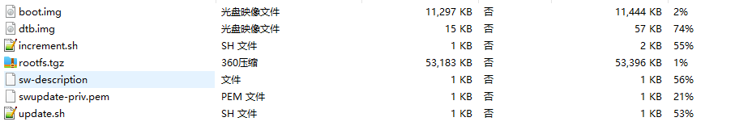

--

# 资源收集

swupdate linux ota故障安全升级方案

这篇文章不错，讲得简单清晰。有明确步骤。

https://blog.csdn.net/qq_16810885/article/details/131315572

树莓派上的swupdate demo

https://github.com/rboussel/SWUpdate-rpi-demo

# 简介

swupdate（Software Update）是一个用于Linux系统的开源工具，它专门设计用于执行OTA（Over-The-Air）固件升级。它旨在简化嵌入式系统的固件升级流程，并==提供了一种可配置和灵活的方式来管理==和应用升级。以下是关于swupdate的一些重要信息：

1. **OTA升级支持：** swupdate专注于实现OTA升级，这意味着您可以通过网络或其他适当的通信渠道远程更新嵌入式Linux系统的固件，而无需物理访问设备。

2. **配置文件驱动：** ==swupdate的配置文件非常重要，它们定义了升级过程中的行为。==这允许开发人员根据其特定需求进行自定义配置。配置文件包含升级源、目标设备、升级包和升级操作的信息。

3. **支持多种升级源：** swupdate可以从多种来源获取升级包，包括本地文件、HTTP服务器、FTP服务器、USB设备等。这种多样性有助于满足不同的应用场景。

4. **安全性：** swupdate关注升级的安全性。==它支持签名验证，以确保只有合法的升级包被应用到设备上==，从而减少潜在的安全风险。

5. **插件体系结构：** swupdate具有插件体系结构，允许用户自定义处理升级包和升级操作。这使得可以根据需要添加新的功能或操作。

6. **日志和反馈：** swupdate记录详细的日志信息，以帮助跟踪和排查升级问题。它还提供了反馈机制，可以将升级的状态和结果通知给相关方。

7. **社区支持：** swupdate是一个开源项目，拥有活跃的社区，因此您可以获得广泛的支持和文档资源。

总之，swupdate是一个强大的工具，可帮助嵌入式Linux系统开发人员实现OTA固件升级。它提供了配置灵活性、多种升级源支持、安全性以及可扩展性等关键功能，使其适用于各种嵌入式系统的固件升级需求。


# swupdate发展历史

swupdate的发展历史可以追溯到其最早的版本，然后不断演进和改进以适应不断变化的需求和技术。以下是swupdate的主要发展历史里程碑：

1. **起初版本：** swupdate的早期版本出现在嵌入式Linux社区，最早的版本可能是一个简单的OTA升级工具，用于处理基本的固件更新。这些早期版本通常包含有限的功能和配置选项。

2. **增强功能和插件体系结构：** 随着时间的推移，swupdate不断增加新的功能和改进。==一个重要的里程碑是引入了插件体系结构==，允许用户自定义升级操作和处理程序。这大大增加了工具的灵活性。

3. **安全性改进：** 随着对嵌入式系统安全性的日益关注，swupdate也增加了对固件升级安全性的支持。这包括签名验证和其他安全增强功能，以确保只有受信任的升级包能够应用到系统中。

4. **多种升级源支持：** swupdate逐渐增加了对不同升级源的支持，包括本地文件、HTTP服务器、FTP服务器、USB设备等。这使得工具适用于更广泛的应用场景。

5. **日志和反馈：** 更多的日志和反馈机制被引入，以帮助开发人员更容易地跟踪和解决升级问题。

6. **社区支持：** swupdate成为了一个活跃的开源项目，拥有一个积极的社区，使得工具得以不断改进和维护。社区支持为用户提供了广泛的资源和技术支持。

swupdate的发展历史是一个持续演进的过程，以满足不断变化的嵌入式Linux固件升级需求。它已经成为一个强大的工具，广泛用于嵌入式系统和物联网（IoT）应用中，帮助开发人员实现远程和安全的固件升级。如有特定版本或更详细的发展历史信息需求，请查看swupdate的官方文档或参与社区讨论以获取更多信息。


# 说明

主要两种机制：

AB系统

recovery系统


系统可以进入 “升级” 模式，

只需向引导加载程序发出必须启动升级软件的信号。 

具体方法可能有所不同，例如设置引导加载程序环境或使用和外部GPIO。


引导加载程序启动“SWUpdate”，

 引导SWUpdate内核**并将initrd映像作为根文件系统。**

 **因为它在RAM中运行，所以可以升级整个存储。**

 与双拷贝策略不同，系统**必须重新启动**以将其自身置于更新模式。

这个方案比起使用两个副本，占用的存储空间更少， 但是它不能保证在不再次更新软件的情况下进行回退。

 不过，至少它可以保证，当主应用不存在或损坏时， 以及当升级过程由于某种原因而中断时，系统自动进入升级模式。


事实上，可以**将升级过程视为事务，**

 只有成功升级后，新软件才设置为“可引导”。 

考虑到这些因素，使用此策略进行升级是安全的:

 如果旧软件损坏或无法运行， 始终确保系统启动并准备好获得新软件。


使用U-Boot作为引导加载程序， 

**SWUpdate能够管理U-Boot的环境设置变量，** 

**以指示事务的开始和结束，**

以及包含有效的软件的存储区域。 

针对GRUB环境块修改和EFI Boot Guard的类似特性也已被引入。

SWUpdate主要以如下配置的方式使用。 

Yocto生成包含SWUpdate应用程序的initrd映像， 该映像在挂载根文件系统之后自动启动。


SWUpdate与bootloader一起工作，以识别失败的可能原因。 目前支持U-Boot、GRUB和EFI Boot Guard。


SWUpdate的工作流程是事务性的。

引导加载程序的环境变量“recovery_status” 被设置为向引导加载程序发出更新状态的信号。

 当然，还可以添加更多变量，用于微调和报告错误原因。

 recovery_status可以取值为“progress”，“failed”，或者它也可以被取消设置。

当SWUpdate启动时，它将recovery_status设置为“progress”。 更新成功完成后，变量将被删除。如果更新以错误结束， recovery_status的值为“failed”。


# 意外掉电

如果发生掉电，必须保证系统能够再次工作 —— 重新 启动SWUpdate或恢复软件的旧副本。

一般情况下，行为可以根据所选择的场景进行划分：

- 单拷贝：SWUpdate被中断，更新事务没有以成功结束。 引导加载程序能够再次启动SWUpdate，从而有可能再次更新软件。
- 双拷贝：SWUpdate没有在备份系统和当前系统之间做切换。 当前版本的软件，并没有被更新触及到，会再次启动。

为了完全安全，SWUpdate和引导加载程序需要交换一些信息。 

引导加载程序必须检测更新是否由于断电而中断， 并重新启动SWUpdate，直到更新成功。


SWUpdate支持U-Boot、GRUB和EFI Boot Guard引导加载程序。 

U-Boot和EFI Boot Guard**有用于保证掉电安全的环境变量**，

 SWUpdate能够读取和更改这些变量，

以此与引导加载程序通信。

 对于GRUB，则使用固定的1024字节环境变量块文件。 SWUpdate在开始更新系统时设置一个变量作为标志， 并在完成之后重置同一变量。引导加载程序可以读取此标志， 以检查在上次关机之前是否正在运行更新。


# amlogic

相关的配置项有：

```
BR2_PACKAGE_SWUPDATE=y
BR2_PACKAGE_SWUPDATE_CONFIG="package/swupdate/swupdate.config"
# BR2_PACKAGE_SWUPDATE_DOWNLOAD is not set
BR2_PACKAGE_SWUPDATE_INSTALL_WEBSITE=y
BR2_PACKAGE_SWUPDATE_AB_SUPPORT=""
```

测试方法：

有两种：

方法一：基于uboot

1、使用U盘的方式，先把software.swu文件放到U盘里。

2、进入到uboot命令行。

3、uboot下执行：run recovery_from_flash

方法二：基于网络方式

1、访问http://192.168.2.1 选择swupdate，进入到对应的界面，上传software.swu文件。

2、板端执行命令：

```
swupdate -l 6 -b "0 1 2 3 4 5" -k /etc/swupdate-public.pem -i /media/software.swu
```


/proc/inand 这个是amlogic自己定义的一个文件。里面放的是分区信息

https://github.com/endlessm/linux-meson/blob/master/drivers/mmc/card/emmc_partitions.c

```
/ # cat /proc/inand
dev:    size   erasesize  name
inand01:    400000     80000 "bootloader"
inand02:   4000000     80000 "reserved"
inand03:  46000000     80000 "cache"
inand04:    800000     80000 "env"
inand05:    800000     80000 "logo"
inand06:   2000000     80000 "recovery"
inand07:    800000     80000 "misc"
inand08:    800000     80000 "cri_data"
inand09:   1000000     80000 "param"
inand10:   4000000     80000 "boot"
inand11:   1000000     80000 "rsv"
inand12:   2000000     80000 "tee"
inand13:    800000     80000 "factory"
inand14:  1c000000     80000 "vendor"
inand15:    200000     80000 "vbmeta"
inand16:   8000000     80000 "odm"
```

```
if [ $1 == "start" ];then
  if [ -f "/proc/inand" ]; then
    swupdate --recovery -l 6 -k /etc/swupdate-public.pem -w "-r /var/www/swupdate/" > /tmp/swupdate.log &
  else
    swupdate --recovery -l 6 -k /etc/swupdate-public.pem -b "0 1 2 3 4" -w "-r /var/www/swupdate/" > /tmp/swupdate.log &
  fi
else
killall swupdate
fi
```

当前镜像在150M左右。而software.swu大小在130M左右。

software.swu是怎么生成的？


在package/swupdate目录下，amlogic的patch，还是做了不小的修改。

```
1, Support AML Uboot env
2, Support ab update
3, Support EXT4
4, Support Recovery download
5, Support bootloader offset
```


私钥放在这里./buildroot/board/amlogic/common/ota/swu/swupdate-priv.pem

分析./buildroot/board/amlogic/common/ota/swu/目录下的脚本。

ota_package_create.sh脚本。

```
OTA_SRC_PATH=../build/buildroot-fs/cpio/target_ota
source ota-package-filelist

签名
openssl dgst -sha256 -sign swupdate-priv.pem sw-description > sw-description.sig
打包
for i in $FILES;do
	echo $i;done | cpio -ov -H crc >  software.swu
echo software.swu  | cpio -ov -H crc >  ${PRODUCT_NAME}_${CONTAINER_VER}.swu
```

这个就是会被打包到ota 的software.swu里的文件。

build/buildroot-fs这个目录下的文件是怎么生成的？

现在target_recovery和target_ota目录下，都是121M的文件。太多了。

ota-package-filelist 这个文件在哪里？

在这里：./output/a5_av400_a6432_release/images/ota-package-filelist

是生成的。

里面就3行：

```
 # ota package file list for emmc
 HASH_FILES="u-boot.bin dtb.img boot.img rootfs.ext2.img2simg update.sh"
 FILES="sw-description sw-description.sig u-boot.bin dtb.img boot.img rootfs.ext2.img2simg update.sh"
```

在images目录下，有生成这样的一些压缩包：target_ota_2203280716.zip

里面的内容是：




```
# blacklist.txt, a list of blacklists to call before generating the filesystem rootfs.tar
# If you do not want some bin to be packaged into rootfs, Please write the name of the bin below.
```


boot.img是这样生成的：

mk_bootimg.sh脚本生成

```
./buildroot/linux/mkbootimg \
--kernel build/linux-amlogic-5.4-dev/arch/arm64/boot/Image.gz \
--base 0x0 \
--kernel_offset 0x1080000 \
--cmdline "root=/dev/system rootfstype=ext4 init=/sbin/init" \
--ramdisk images/rootfs.cpio.gz \
--second images/a5_a113x2_av400_1g.dtb \
--output images/boot.img
```

mkbootimg 这个二进制是我们加的。这个是从安卓那边拿过来的工具。

boot.img也是安卓的一个标准做法。我们是拿到Linux上来用了。


看看之前S420的target_ota和target_recovery有多大。

也是一样的大。都是100多M。

这个合理吗？

platform.conf里的内容：

```
Platform:0x0812
soctype:A5
```

从这个目录./buildroot/board/amlogic/common/upgrade/upgrade-a5拷贝过来的。

分析一下这个目录下的文件。

```
aml_sdc_burn.ini  这个就是我从A1的拷贝过来了，没有改动。
aml_upgrade_package_ab.conf
aml_upgrade_package.conf
	头部的注释写着：
	#This file define how pack aml_upgrade_package image
aml_upgrade_package_emmc_ab.conf
aml_upgrade_package_emmc.conf
aml_upgrade_package_emmc_enc.conf
aml_upgrade_package_enc.conf
aml-user-key.sig 这个就是我从A1的拷贝过来了，没有改动。
keys.conf  这个就是我从A1的拷贝过来了，没有改动。
platform.conf  这个后面SamWu提交了一下。
usb_flow.aml  这个后面SamWu提交了一下。
```

分析一下buildroot/board/amlogic/common/ota/ota-a5目录

```
ota-package-filelist-emmc
	这个就是会被拷贝生成ota-package-filelist
ota-package-filelist-emmc-enc
ota-package-filelist-nand
ota-package-filelist-nand-enc
ramdisk
	目录。
ramfslist-recovery-need
	这个描述了recovery需要的内容。
sw-description-emmc
sw-description-emmc-enc
sw-description-emmc-increment
sw-description-emmc-increment-enc
sw-description-nand
sw-description-nand-ab
sw-description-nand-enc
sw-description-nand-increment
sw-description-nand-increment-enc
```

ramdisk目录里

```
./etc
./etc/mdev.conf
./etc/init.d
./etc/init.d/S01swupdate
./etc/init.d/rcS
./etc/hotplug
./etc/hotplug/remove.sh
./etc/hotplug/insert.sh
./init
```


需要在看一下buildroot/fs目录。

看看buildroot/fs/common.mk

```
FS_DIR = $(BUILD_DIR)/buildroot-fs
所以build目录下那个buildroot-fs是这里生成的。
BR2_ROOTFS_DEVICE_TABLE="system/device_table.txt"
这个是buildroot/system/device_table.txt文件。
整理生成到full_devices_table.txt文件里。
```


BR2_REPRODUCIBLE

```
BR2_ROOTFS_COMMON_OVERLAY=""
BR2_ROOTFS_UPGRADE_DIR="board/amlogic/common/upgrade/upgrade-a5/"
BR2_RECOVERY_OTA_DIR="board/amlogic/common/ota/ota-a5/"
BR2_RECOVERY_OTA_RAMDISK_DIR=""
BR2_ROOTFS_UPGRADE_DIR_OVERLAY=""
BR2_ROOTFS_OVERLAY="board/amlogic/mesona5_av400/rootfs/"
```

生成在这个目录下：

./output/a5_av400_a6432_release/host/bin/ramfslist-recovery

列出了recovery需要的文件。

recovery.img 当前是14M左右。

recovery.img里被打包进去了哪些东西？包括了kernel吗？

是这里：

```
./fs/cpio/cpio.mk:151:# linux/mkbootimg --kernel $(LINUX_IMAGE_PATH) --base 0x0 --kernel_offset $(LINUX_KERNEL_BOOTIMAGE_OFFSET) --cmdline "$(KERNEL_BOOTARGS)" --ramdisk  $(BINARIES_DIR)/recovery.cpio.gz --second $(BINARIES_DIR)/dtb.img --output $(BINARIES_DIR)/recovery.img
```

可以看到了包括了kernel、dtb、一个小的rootfs。

看recovery.cpio.gz里包含了哪些内容。

BR2_TARGET_ROOTFS_INITRAMFS_LIST

BR2_TARGET_RECOVERY_INITRAMFS_LIST

```
BR2_TARGET_ROOTFS_INITRAMFS_LIST="board/amlogic/mesona5_av400/initramfs/ramfslist-32-ext2"
BR2_TARGET_RECOVERY_INITRAMFS_LIST=""
```

所以，recovery没有initramfs。


我们当前的initramfs。

有会怎么样？没有会怎么样？


这个就是initramfs的内容。

在/proc/cmdline里，看到

```
rootfstype=ramfs
```

所以这个是去找initramfs。

但是同时还有：

```
root=/dev/system
rootfstype=ext4
init=/sbin/init
```

有怎么理解呢？

而且可能是被后面的覆盖了。

把flash里的分区挂载到/mnt先。

```
mount "${root}" /mnt
```

最后切换root

```
exec switch_root -c /dev/console /mnt "${init}"
```


这个依赖关系，linux-rebuild-with-initramfs在哪里定义，做了什么？

```
rootfs-initramfs: linux-rebuild-with-initramfs
```

是在linux.mk里定义的。

```
.PHONY: linux-rebuild-with-initramfs
linux-rebuild-with-initramfs: $(LINUX_DIR)/.stamp_target_installed
linux-rebuild-with-initramfs: $(LINUX_DIR)/.stamp_images_installed
linux-rebuild-with-initramfs: rootfs-cpio
linux-rebuild-with-initramfs: $(BINARIES_DIR)/$(ROOTFS_CPIO)
linux-rebuild-with-initramfs:
	@$(call MESSAGE,"Rebuilding kernel with initramfs")
	# Build the kernel.
```


通过tab补全make rootfs- 查看到

```
rootfs-cpio             
rootfs-cpio-show-depends
rootfs-cpio-show-info   

rootfs-ext2               
rootfs-ext2-show-depends  
rootfs-ext2-show-info     

 rootfs-initramfs              
 rootfs-initramfs-show-depends 
```

分析make rootfs-cpio的输出日志打印

使用安卓镜像格式，是这个配置项控制的。

```
ifeq ($(BR2_LINUX_KERNEL_ANDROID_FORMAT),y)
```

在这里配置的

```
./a5_base.config:20:BR2_LINUX_KERNEL_ANDROID_FORMAT=y
```


```
host-skeleton
这个的用途是什么？
skeleton

对应的是package/skeleton
$(eval $(virtual-package))
$(eval $(host-generic-package))
没啥用。
在build目录下生成了空的目录（只有几个隐藏的flag文件）

```


```
aml-bootloader-message-0.1 
aml-ubootenv-0.1 
aml-usb-config 
```


```
int get_store_device() {
    int ret = 0;
    ret = access("/proc/inand", F_OK);
    if (ret == 0 ) {
        printf("emmc device!\n");
        return 0;
    } else {
        printf("nand device!\n");
        return -1;
    }
}
```


/dev/misc 这个设备的作用。

往里面写信息，跟bootloader进行升级相关的通信。

写入的信息，就是bootloader_message结构体，里面包含了升级包信息。

set_recovery_otapath这个函数，有2个文件调用了

```
Binary file ./usr/bin/swupdate matches
Binary file ./usr/bin/urlmisc matches
```

urlmisc作用是什么？从代码看，好像是写入升级包信息，估计是手动进行升级测试用的。

```
void usage() {
        printf("eg:urlmisc write http://xx.28.xx.53:8080/otaupdate/swupdate/software.swu\n");
        printf("     urlmisc read\n");
        printf("     urlmisc clean\n");
        printf("     urlmisc local\n");
}
```


uboot-env的package，是在kernel下对uboot的环境变量进行读写操作。

对应的/dev/env 这个设备节点。

这些设备节点的名字是如何确定的？

是不是设备树里配置就可以达到这个效果？

设备树里没有名为env的分区，是在rsv分区里。另外有驱动。可以在kernel/drivers/amlogic下面grep找到相关代码。


使用结构化语言描述镜像，这个由libconfig库作为缺省的解析，像使用json描述

网络安装可以使用一个嵌入式的Web服务器（选择mongoose服务器，基于Lua license版本），也可以选择不同的Web服务器


单个升级包镜像

主要的做法是，厂商提供一个大的镜像文件，

所有待更新的分区镜像与软件描述文件sw-description都被打包在一起（选择cpio，简单且支持流），

sw-description包含每个单个镜像的元数据。

sw-description的格式可以定制，

swupdate可以配置使用内部的解析器（基于libconfig），

或者使用外部的lua解析器。


既然可以使用外部的解析器，而非使用默认的解析器（libconfig），

同样升级镜像的类型和安装方式也可以定制，

解析器无非就是找出哪个镜像需要安装到哪里去，

swupdate使用叫做handler的处理程序去安装单个镜像，

处理安装镜像的handlers包含ubi volume，sd card，cfi flash等等，

如果有特殊的镜像需要安装，很容易添加一个自定义的hander处理程序。


原生的swupdate版本已经支持raw ubifs的升级，对于ext4的镜像不支持升级，我们公版最新版本已经支持ext4镜像升级。


我们可以通过make swupdate-menuconfig来对swupdate进行配置，具体每个配置项可详细了解。


本地升级：

进入recovery之后，会自动挂载U盘设备，

在U盘的根目录寻找名字为software.swu的升级包，

如果升级包存在，则进行本地升级，否则提示，没有找到升级包的相关信息。

网络升级：

我们可以连接ap，访问设备的地址（eg：192.168.2.1），

登陆设备的管理页面，选择swupdate的选项，

选择升级包（aml-software_1.0.swu）升级，

**选择了升级包后，swupdate升级模块会把升级包下载到data分区存放（保存名为software.swu），**

然后重启进入recovery从data分区读取升级包升级。

**注意：由于网络升级需要把升级包存放到data分区，然后从data分区获取升级包升级，那么前提条件是data分区的可用大小，必须大于升级包的大小，否则data分区无法保存完整的升级包大小。**


我们通过make之后会在output下面生成我们需要的镜像，以s400 debug版本为例：

  recovery.img  基于swupdate的升级模块。

  aml-software-1.0.swu： 通过web页面升级的升级包。

  software.swu：本地升级的升级包。

这三个文件都会生成在路径：output\mesonaxg_s400_debug\images

software.swu与aml-software-1.0.swu分别是本地升级及web网络升级的升级包，其中aml-software-1.0.swu比software.swu**多了一层cpio的打包头信息**，不可混淆。


我们的升级过程采用一对密钥进行签名校验，密钥路径：

公钥：buildroot\board\amlogic\common\rootfs\rootfs-xxxx\etc\swupdate-public.pem

私钥：buildroot\board\amlogic\common\ota\swu\swupdate-priv.pem

 公钥打包到recovery系统路径/etc/swupdate-public.pem，

私钥我们用来对sw-description生成签名sw-description.sig, 

我们在读取升级包software.swu之后，

读取/etc/swupdate-public.pem公钥来验证sw-description签名是否正确。

 升级包中每个镜像对应的sha256值保存在sw-description中，

其中的镜像如果有任何改变，则校验值将发生变化，校验不过，

如果sw-description有修改，则对应的sw-description.sig信息校验时，无法正常校验通过。

从而保证升级包的完整及正确性。


aml_upgrade_package_emmc.conf

这个还是看懂了。打包生成aml_upgrade_package.img

u-boot.bin.signed里就包含了多个bootloader的。

```
file="boot.img"             main_type="PARTITION"       sub_type="boot"
file="recovery.img"         main_type="PARTITION"       sub_type="recovery"
file="rootfs.ext2.img2simg"           main_type="PARTITION"       sub_type="system"
file="u-boot.bin.signed"           main_type="PARTITION"       sub_type="bootloader"
file="dtb.img"              main_type="PARTITION"       sub_type="_aml_dtb"
```

ota-a5里有个ramdisk目录。

这个是recovery打包进kernel的initramfs的内容。


ramfslist-recovery-need

这个在哪里被使用？

```
./fs/cpio/cpio.mk:86:   cat $(RECOVERY_OTA_DIR)/ramfslist-recovery-need >> $(HOST_DIR)/bin/ramfslist-recovery
```


重点看看这个脚本。

ota_package_create.sh

调用这个脚本的只有：

```
./fs/ubi/ubi.mk:76:     $(BINARIES_DIR)/ota_package_create.sh
./fs/ubi/ubi.mk:84:     $(BINARIES_DIR)/ota_package_create.sh
./fs/ext2/ext2.mk:98:   $(BINARIES_DIR)/ota_package_create.sh
```

看看ext2.mk的内容。

BR2_PACKAGE_AML_VENDOR_PARTITION

这个当前没有配置。

uboot2015的调用了aml_upgrade_pkg_gen.sh

非uboot2015的，调用了aml_image_v2_packer_new

```
$(HOST_DIR)/bin/aml_image_v2_packer_new -r $(BINARIES_DIR)/aml_upgrade_package.conf $(BINARIES_DIR)/ $(BINARIES_DIR)/aml_upgrade_package.img
```

BR2_TARGET_UBOOT_ENCRYPTION

这个uboot加密，当前没有使能。

```
ifeq ($(BR2_TARGET_UBOOT_ENCRYPTION),y)
	RECOVERY_ENC_FLAG="-enc"
endif
```

生成software.swu的代码

```
define ROOTFS-OTA-SWU-PACK-EXT4FS
	$(INSTALL) -m 0755 $(RECOVERY_OTA_DIR)/../swu/* $(BINARIES_DIR)
	$(INSTALL) -m 0644 $(RECOVERY_OTA_DIR)/sw-description-emmc$(RECOVERY_ENC_FLAG) $(BINARIES_DIR)/sw-description
	$(INSTALL) -m 0644 $(RECOVERY_OTA_DIR)/sw-description-emmc-increment$(RECOVERY_ENC_FLAG) $(BINARIES_DIR)/sw-description-increment
	$(INSTALL) -m 0644 $(RECOVERY_OTA_DIR)/ota-package-filelist-emmc$(RECOVERY_ENC_FLAG) $(BINARIES_DIR)/ota-package-filelist
	$(BINARIES_DIR)/ota_package_create.sh
endef
```

看看这3个文件：

sw-description-emmc

sw-description-emmc-increment

ota-package-filelist-emmc

这3个文件都需要改一下。

看看images\sw-description文件里。

很明显，uboot的sha256值没有正确生成。

```
{
			filename = "boot.img";
			sha256 = "91f841028f9288b9df834501c8a189b5aaecbe4c6083965638d3616467043cce"
			device = "/dev/boot";
		},
		{
			filename = "u-boot.bin";
			sha256 = ""
			device = "/dev/bootloader";
		}
```

HASH_FILES是表示需要计算hash值的文件。其余的文件不用计算。


参考资料

https://confluence.amlogic.com/display/SW/SWUpdate

这个很详细了。需要反复看懂。

https://wiki-china.amlogic.com/index.php?title=%e5%86%85%e9%83%a8%e4%ba%ba%e5%91%98%e5%8f%82%e8%80%83%e8%b5%84%e6%96%99/AE_internal-Q%26A/Common/Buildroot_recovery_%e5%8d%87%e7%ba%a7

# swu文件格式

镜像以指定的格式(cpio)构建，它必须包含一个描述文件， 以描述必须更新的软件。


# sw-description


参考资料

这篇文章很全面了。

https://blog.csdn.net/weixin_30312563/article/details/99878653


# 增量升级

目前增量升级依赖于system挂载为ro只读模式，否则差分升级具有局限性，且具有不安全性，待系统分区修改挂载为ro之后，再提交相关差分升级功能。

具体的做法是怎样的？


# AB升级


参考资料

1、

https://blog.csdn.net/qq_31986405/article/details/125970349

2、全志的升级文档

https://whycan.com/files/202108/d1/D1_Tina_Linux_OTA_%E5%BC%80%E5%8F%91%E6%8C%87%E5%8D%97.pdf


# .config文件分析

```
CONFIG_SCRIPTS=y
CONFIG_HW_COMPATIBILITY=y
CONFIG_HW_COMPATIBILITY_FILE="/etc/hwrevision"
CONFIG_SW_VERSIONS_FILE="/etc/sw-versions"
```


# libconfig配置语法

Libconfig是一个结构化的配置文件库，

它可以定义一些配置文件，

例如[test.cfg](http://www.hyperrealm.com/libconfig/test.cfg.txt) . 它比[xml](https://so.csdn.net/so/search?q=xml&spm=1001.2101.3001.7020)可读性更好，而且更简洁。

而且不像xml，它是 **type-aware**类型自我感知的，

因此不需要做string parsing ([分词](https://so.csdn.net/so/search?q=分词&spm=1001.2101.3001.7020)？). 而ini太弱。


libconfig支持结构化、层次化的配置。

这些配置可以从文件中读取或写入文件，也可以在内存中操作。


一个配置由一组setting构成，setting由名字（name）关联，并有相应的值（value）。一个值（value）可以是以下任意一种类型：

标量值（scalarvalue）：整型、64位整型、浮点数、布尔值或者字符串

数组（array）：一组标量值的序列，所有的标量值必须为同一类型

群组（group）：多个setting的集合

列表（list）：一组值（value）的序列，各个值可（value）以分别为不同的类型，其他的列表也可以包含其中。


观察下面这一个层次化GUI应用程序的配置文件，它阐明了一个配置文件语法所有的元素。

```
#Exampleapplicationconfigurationfile
version = "1.0";
application:
{
    window:
    {
        title = "MyApplication";
        size = {
            w = 640;h = 480;
        };
        pos = {
            x = 350;y = 250;
        };
    };
    list = (("abc", 123, true), 1.234, ( /*anemptylist*/ ));
    books = (
        {
            title = "TreasureIsland";
            author = "RobertLouisStevenson";
            price = 29.95;
            qty = 5;
        },
        {
            title = "SnowCrash";
            author = "NealStephenson";
            price = 9.99;
            qty = 8;
        }
    );
    misc:
    {
        pi = 3.141592654;
        bigint = 9223372036854775807 L;
        columns = ["LastName", "FirstName", "MI"];
        bitmask = 0x1FC3;
    };
};
```

（我觉得没有必要深入看了，因为我觉得json够用了）


参考资料

1、官方手册

http://www.hyperrealm.com/libconfig/libconfig_manual.html

2、libconfig第一篇———使用指南

https://blog.csdn.net/weixin_30546933/article/details/95318709

# 更新服务器

OTA / 远程

- 集成的网络服务器
- 从远程服务器拉取(HTTP, HTTPS， ..)
- 使用后端。SWUpdate是开放的，可以与后端服务器进行通信， 以推出软件更新。当前版本支持Hawkbit服务器， 但可以添加其他后端。

hawkbit服务器的代码在这里：

https://github.com/eclipse/hawkbit

swupdate本地也集成了一个webserver，是基于mongoose的。

可以通过8080端口给它上传镜像文件。


# 代码分析

现在我已经对swupdate有一定的经验，也有了自己写开源代码的经验。

对于menuconfig和lua也有一定的掌握了。

现在回过头来看看swupdate的代码。

从代码的配置和编译开始看。

先看buildroot里，如何对swupdate进行编译的。

先看buildroot\package\swupdate\Config.in

依赖了

```
BR2_PACKAGE_AML_UBOOTENV
BR2_PACKAGE_LIBCONFIG

默认的配置文件是：
package/swupdate/swupdate.config

BR2_PACKAGE_SWUPDATE_DOWNLOAD
	这个默认是false。
	不会下载镜像。
	
BR2_PACKAGE_SWUPDATE_INSTALL_WEBSITE
	这个是把升级服务器放在了/var/www/swupdate路径下。
	
```

buildroot\package\swupdate\swupdate.config 

这个文件默认的配置是这样：

```
软件版本号从哪个文件里获取。
CONFIG_SW_VERSIONS_FILE="/etc/sw-versions"


链接哪些额外的库
CONFIG_EXTRA_LDLIBS="ubootenv bootloader_message z"

内置的server
CONFIG_WEBSERVER=y
CONFIG_MONGOOSE=y
CONFIG_MONGOOSEIPV6=y

使用libconfig的配置语法
CONFIG_LIBCONFIG=y

处理这种镜像格式
CONFIG_RAW=y
CONFIG_EXT4=y
CONFIG_UBIVOL=y
CONFIG_CFI=y
CONFIG_SHELLSCRIPTHANDLER=y
CONFIG_BOOTLOADERHANDLER=y
```

版本号是2019.11

aml-ubootenv

这个仓库代码做了什么？代码在vendor\amlogic\aml_commonlib\ubootenv\ubootenv.c

编译得到一个库文件。

对外提供的接口：

```
int bootenv_update(const char* name, const char* value);
const char * bootenv_get(const char * key);
```

是靠读写这个分区BootenvPartitionName来进行操作的。

/dev/env实际是这个分区名字。 /dev/nand_env这个也可能。会逐个遍历。


swupdate的编译是：

```
$(eval $(kconfig-package))
```

amlogic做的修改也是不少的。有5个patch。

Makefile里：

```
objs-y		:= core handlers
libs-y		:= corelib ipc mongoose parser suricatta bootloader libsparse
shareds-y	:= bindings
tools-y		:= tools
```

## swupdate.h

```
主要结构体：
struct swupdate_global_cfg
struct swupdate_cfg 
	包含了global_cfg
主要函数：
get_swupdate_cfg
```


# swupdate的 raw和flash有什么区别

在 swupdate 中，"raw" 和 "flash" 都是升级源（upgrade source）的类型，它们用于指定从哪里获取固件升级包。虽然它们都用于获取升级包，但它们之间有一些区别：

1. **"raw" 升级源：**
   - "raw" 升级源表示您从本地文件系统或远程服务器获取升级包。
   - 您可以指定升级包的路径或 URL，以便 swupdate 从该位置下载升级包。
   - 这通常用于获取以原始二进制格式存储的升级包，它们可以是特定的固件映像或数据文件。

2. **"flash" 升级源：**
   - "flash" 升级源表示您从设备的闪存（flash）存储获取升级包。
   - 您可以指定 UBI 卷、MTD 设备或其他闪存设备，以便 swupdate 从其中获取升级包。
   - 这通常用于嵌入式系统，其中升级包存储在设备的闪存中，而不是从外部源下载。

总的来说，区别在于 "raw" 升级源用于从外部位置获取升级包（如文件系统或远程服务器），而 "flash" 升级源用于从设备自身的闪存存储中获取升级包。选择使用哪种升级源取决于具体的应用场景和系统配置。如果您的升级包存储在设备内部的闪存中，您可能会使用 "flash" 升级源。如果升级包存储在外部服务器或文件系统中，您可以使用 "raw" 升级源。


简单来说，就是nand用flash的，emmc用raw的（raw是默认的，不用写type）。

# 一篇好文

若使用原生的swupdate，则调用：

```text
当前处于A系统：

swupdate -i /mnt/UDISK/<board>.swu -e stable,now_A_next_B

当前处于B系统：

swupdate -i /mnt/UDISK/<board>.swu -e stable,now_B_next_A
```


https://zhuanlan.zhihu.com/p/610030348

# 签名

```
openssl dgst -sha256 -sign swupdate-priv.pem sw-description > sw-description.sig
```

这2个文件都要放到swu文件里的：

```
[TRACE] : SWUPDATE running :  [extract_sw_description] : Found file:
        filename sw-description
        size 882
        checksum 0xe90f VERIFIED
[TRACE] : SWUPDATE running :  [extract_sw_description] : Found file:
        filename sw-description.sig
        size 64
        checksum 0x1f48 VERIFIED
```


https://sbabic.github.io/swupdate/signed_images.html

# 树莓派swupdate

看看用树莓派来研究swupdate。


# rauc和swupdate对比

RAUC（Robust Auto-Update Controller）和SWUpdate都是用于嵌入式Linux系统的软件更新框架，但它们在设计理念、功能特性和应用场景上有所不同。以下是它们的对比：

| **特性/框架** | **RAUC**                                                     | **SWUpdate**                                                 |
| ------------- | ------------------------------------------------------------ | ------------------------------------------------------------ |
| **设计理念**  | 设计为支持系统的可靠性和安全性，重视系统的稳定性和安全更新。 | 灵活设计，支持不同的更新策略和应用场景，包括全量和增量更新。 |
| **更新机制**  | 支持双系统槽（A/B）更新，可以确保更新过程中设备的可用性。    | 支持文件级别和文件系统级别的更新，可以灵活管理更新的内容。   |
| **安全性**    | 提供数字签名和验证机制，确保更新包的完整性和来源可信。       | 提供基本的签名和验证功能，但灵活支持不同的安全实现。         |
| **配置管理**  | 使用配置文件管理更新策略和更新源，灵活性较高。               | 配置简单直接，可以通过命令行或配置文件进行管理。             |
| **依赖管理**  | 提供基本的依赖管理功能，可以管理更新包之间的依赖关系。       | 不提供显式的依赖管理，更新包之间的依赖需要开发者手动管理。   |
| **用户交互**  | 支持用户交互和反馈机制，可以通知用户更新状态和需要确认的操作。 | 主要面向自动化更新，通常不需要用户直接干预。                 |
| **适用场景**  | 适用于要求高可靠性和安全性的嵌入式系统，如工业控制和医疗设备。 | 适用于各种嵌入式系统，包括消费电子产品和工业设备。           |
| **社区支持**  | 活跃的社区支持，有详细的文档和示例，易于入门和定制。         | 社区支持较为广泛，有丰富的使用案例和定制经验。               |

### 总结

- **RAUC** 更适合对系统稳定性和安全性要求较高的应用，支持双系统槽和安全认证，适合工业控制和医疗设备等领域。
- **SWUpdate** 则更灵活，支持多种更新策略和应用场景，适合广泛的嵌入式系统，包括消费电子产品和工业设备。

选择适合的框架取决于具体的应用需求和对更新管理的需求。

# 参考资料

1、

这个文档非常系统，很好。值得反复看。

https://zqb-all.github.io/swupdate/overview.html

2、

https://blog.csdn.net/luzhenrong45/article/details/62042400

3、

