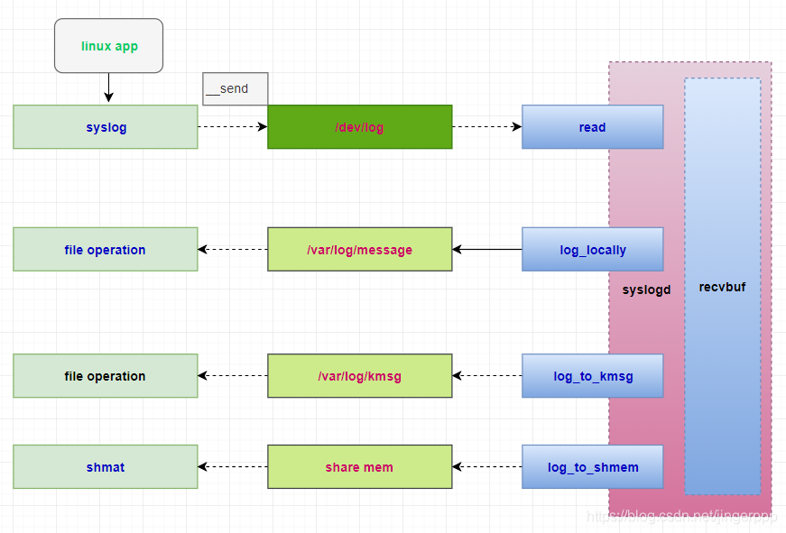

--

# syslogd

syslogd 是busybox 中用来收集系统日志（不同的类型，如kernel，user层）的一个守护进程，

而busybox 大家都比较熟悉，为嵌入式 开发提供了一个相对完整的运行环境。

一般syslogd 在编译后生成于/bin/下 或/sbin 下。

不同的进程（client）都可以将log 输送给syslogd（server），

由syslogd 集中收集。

client 里面特殊的接口、特殊格式进行log 输送，下面会详细说明。




https://blog.csdn.net/shift_wwx/article/details/89105854

# C语言接口

Linux应用要使用log，只需要3个api函数就够了。

```
openlog 可以不调用，不调用的，第一次syslog的时候，会自动打开。
syslog
closelog
```

简单明了。

函数原型：

```
void openlog(const char *ident, int opt, int facility)
```

ident是识别码。一般就是程序的名字。

opt：

```
LOG_CONS ：直接写入控制台，如果有错误，同时计入日志。
LOG_NDELAY：立即连接。是一个socket。
LOG_NOWAIT：不要等子进程。
LOG_ODELAY：open之后，不要马上连接，直到syslog调用时才连接。
LOG_PID：包括每条消息的pid。
```

facility设施：

```
LOG_USER：默认的就是这个。
LOG_DAEMON：也经常用这个。
```


工作的原理是，后台运行了一个syslogd。

用户程序调用的syslog就是跟syslogd进行通信的。

通信方式是AF_UNIX类型的socket。

```
static void __openlog()
{
	int fd = socket(AF_UNIX, SOCK_DGRAM|SOCK_CLOEXEC, 0);
	if (fd < 0) return;
	if (connect(fd, (void *)&log_addr, sizeof log_addr) < 0)
		close(fd);
	else
		log_fd = fd;
}

```

写一个测试代码，在mylinuxlab上跑。

```
#include <syslog.h>

void main(int argc, char **argv)
{
	openlog(argv[0], LOG_CONS | LOG_PID, LOG_USER);
	syslog(LOG_INFO, "hello syslog:%d\n", 1);
	closelog();
}
```

我的疑问是，后台没有看到syslogd这个进程。

确实是没有运行。但是不会报错，就是消息丢掉了呗。

我们可以启动syslogd。看看可以怎么配置。

看当前的打开文件情况。

```
/mnt/app # lsof
1       /bin/busybox    /dev/console
1       /bin/busybox    /dev/console
1       /bin/busybox    /dev/console
809     /bin/busybox    /dev/null
809     /bin/busybox    /dev/null
809     /bin/busybox    /dev/null
809     /bin/busybox    socket:[4224]
811     /bin/busybox    /dev/console
811     /bin/busybox    /dev/console
811     /bin/busybox    /dev/console
811     /bin/busybox    /dev/tty
830     /bin/busybox    socket:[4353]
830     /bin/busybox    /dev/null
830     /bin/busybox    /dev/null
```

有2个socket被打开。看看是被谁打开的。

```
  809 root       0:00 telnetd
  811 root       0:01 -/bin/sh
  830 root       0:00 syslogd
```

syslogd默认使用的端口是4353 。

看看帮助信息。

```
syslogd [OPTIONS]

System logging utility

        -n              Run in foreground
        -R HOST[:PORT]  Log to HOST:PORT (default PORT:514)
        -L              Log locally and via network (default is network only if -R)
        -C[size_kb]     Log to shared mem buffer (use logread to read it)
        -K              Log to kernel printk buffer (use dmesg to read it)
        -O FILE         Log to FILE (default: /var/log/messages, stdout if -)
        -s SIZE         Max size (KB) before rotation (default 200KB, 0=off)
        -b N            N rotated logs to keep (default 1, max 99, 0=purge)
        -l N            Log only messages more urgent than prio N (1-8)
        -S              Smaller output
        -D              Drop duplicates
        -f FILE         Use FILE as config (default:/etc/syslog.conf)
```


# syslogd

看看syslogd.conf的配置方法。

每一行的格式是这样的。

```
[消息来源.消息级别] [动作] 
```

消息来源有：

```
kern
uucp
user 用户程序
news Usernet系统消息
mail 邮件系统
daemon 守护进程
auth 与安全认证相关的程序
syslog  
cron
mark 时间戳
authpriv 授权私有信息
lpr 打印机
local 0-7 本地消息
```

消息级别有：

```
emerge 最高级。
alert 紧急
crit
err
warning
notice
info
debug
```

可以用“*”和“none”进行通配。

动作有：

```
@xxx xxx是另外一台主机的名字，是转发给另外一台主机上的syslog
@ipaddr 同上
* 转发到所有的用户终端上
/dev/console 转发到本地主机的终端。
|xx 管道给xx这个程序。
filename 写入到指定文件。
用户列表  发送给指定的用户。用户名直接用逗号隔开。
```

一个简单的默认配置文件。

```
mail.* /var/log/maillog
cron.* /var/log/cron
news.=crit /var/log/news/news.crit
user.* /var/log/userlog
```

我现在加上配置文件，再执行我上面的测试程序。

```
/var/log # ls
messages  xx
/var/log # cat messages 
Mar 21 16:32:56 (none) syslog.info syslogd started: BusyBox v1.27.2
Mar 21 16:32:56 (none) daemon.info : starting pid 813, tty '/dev/console': '-/bin/sh'
Mar 21 16:33:35 (none) user.info ./a.out[819]: hello syslog:1
```


我当前的版本syslogd会忽略syslog.conf文件。

```
System logging utility
(this version of syslogd ignores /etc/syslog.conf)
```

指定syslog文件的大小。

我用-s指定，并没有作用。看看syslog的代码，如何实现的。

代码里看不出什么。但是我这样是可以看到生效的了。

```
SYSLOGD_ARGS="-n -O /data/messages -s 20 -S"
```


从实际使用看，会限制每一行的长度，是900字节。


# Android中syslog的实现

Android中没有syslogd和klogd，但为了兼容使用syslog的程序，在bionic目录下有syslog函数的实现。这里的syslog函数会将打印内容输出到/dev/log，即logcat中；也有版本是输出到/dev/kmsg，也就是最终调用prink作为内核log输出。


# 长度限制

现在我用syslog来记录收到的mqtt消息，消息比较长，结果内容就只能记录一部分。

这个应该怎么做呢？

我当然是希望可以把消息完整记录下来。

消息最长有1000多字节。

所以我希望syslog可以记录2048字节。

或者有方法可以分段显示。总之消息要完整显示出来，不管有多长。


# syslog协议

有2个版本的协议。

一个是bsd syslog 协议。这个限制是1024字节。

一个是RFC5424 sylog协议。这个限制是2048字节。

# syslogd和klogd

总结一下:

1>  所有系统信息是输出到ring buffer中去的.dmesg所显示的内容也是从ring buffer中读取的.

2> LINUX系统中/etc/init.d/sysklogd会启动2个守护进程:Klogd&&Syslogd

3> klogd是负责读取内核信息的,有2种方式:

​      syslog()系统调用(这个函数用法比较全,大家去MAN一下看看)

​       直接的对/proc/kmsg进行读取(再这提一下,/proc/kmsg是专门输出内核信息的地方)

4>  Klogd的输出结果会传送给syslogd进行处理,syslogd会根据/etc/syslog.conf的配置把log

   信息输出到/var/log/下的不同文件中.

https://blog.csdn.net/baidu_24256693/article/details/43112537


# 参考资料

1、

https://baike.baidu.com/item/openlog/9502581?fr=aladdin

2、syslogd的配置。

http://book.51cto.com/art/201406/442922.htm

3、开发板上syslog使用方法小结

https://blog.csdn.net/yangxuan12580/article/details/51497069

4、busybox syslog介绍

http://www.mamicode.com/info-detail-2284735.html

5、关于Linux log机制的一些整理

https://blog.csdn.net/walkingman321/article/details/7459562