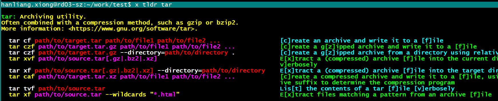
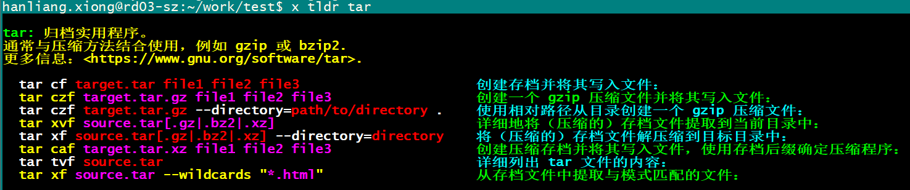
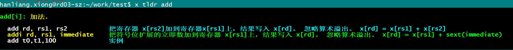

--

该命令可以显示一些命令的常见用法

tldr全称Too long, Don’t read，翻译成中文就是[太长不读]。tldr根据二八原则将命令的常用场景给出示例，让人一看就懂。

tldr是简化版的使用手册，并不会像man一样把所有的使用参数和说明都列出来，而是只显示常用的几个使用Sample和说明。

# tldr安装配置

```
npm install -g tldr
```

我也不记得我当前的tldr是什么时候通过上面方式安装了。

```
 which tldr
/home/hanliang.xiong/.local/bin/tldr
```

看是一个python脚本。

我删掉这个，还是根据文章的说明，使用npm来安装。

对应的是这个仓库：

 https://github.com/tldr-pages/tldr

缓存的文件在这个目录下面。

```
/home/hanliang.xiong/.tldr/cache/pages
```

当前下面有8个目录：`8 directories, 2325 files`

```
tree /home/hanliang.xiong/.tldr/cache/pages -L 1
/home/hanliang.xiong/.tldr/cache/pages
├── common
├── freebsd
├── linux
├── netbsd
├── openbsd
├── osx
├── sunos
└── windows
```

其中linux目录下面是1200多个md文件。

common目录下面有400多个文件。

## python版本

这个也是有的。

```
pip3 install tldr
```

但是我不用这个。

# 在线浏览tldr的信息

https://tldr.inbrowser.app/

这个没有什么价值。不看。

# 常用命令

```
  Examples:

    $ tldr tar
    $ tldr du --platform=linux
    $ tldr --search "create symbolic link to file"
    $ tldr --list
    $ tldr --list-all
    $ tldr --random
    $ tldr --random-example
```

# 使用x-cmd版本的tldr

x-cmd的安装方法就不在这里说了。

使用

```
x tldr tar
```



https://cn.x-cmd.com/mod/tldr

# 显示中文

我看md文件都是英文的。

```
tldr --update
```

我看是有中文的文档的，但是怎么切换呢？

https://github.com/tldr-pages/tldr/tree/main/pages.zh

还是借助x-cmd来做：

```
x tldr --lang
```

然后选择中文，就可以自动更新中文的资料。

会自动使用中文的：



fc-cache.md 以这个文件来搜索，查看路径：

```
 find  ~/.x-cmd.root/  -name fc-cache.md
/home/hanliang.xiong/.x-cmd.root/global/shared/tldr/data/v2.0/pages.zh/common/fc-cache.md
/home/hanliang.xiong/.x-cmd.root/global/shared/tldr/data/v2.0/pages.en/common/fc-cache.md
```


# 安装自定义

看看怎么安装自定义的文件到目录下面。

以这个riscv的汇编指令的tldr为例。

https://github.com/lgl88911/riscv_tldr/tree/master

tldr的搜索目录的逻辑是怎样的？

```
cp riscv_tldr/rv32i /home/hanliang.xiong/.x-cmd.root/global/shared/tldr/data/v2.0/pages.zh/ -rf
cp riscv_tldr/pseudo /home/hanliang.xiong/.x-cmd.root/global/shared/tldr/data/v2.0/pages.zh/ -rf
```




# 参考资料

1、

https://lanlan2017.github.io/blog/42d91331/

2、

https://blog.csdn.net/goodgood_UP/article/details/133776222