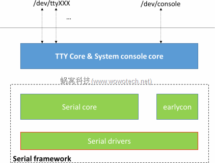

--

串口设备（serial or uart，后面不再区分）是TTY设备的一种，

Linux kernel为了方便串口驱动的开发，

在TTY framework的基础上，封装了一层串口框架（serial framework）。

该框架尽可能的屏蔽了TTY有关的技术细节（比较难懂），

驱动工程师在编写串口驱动的时候，只需要把精力放在串口以及串口控制器本身即可。





Serial core是Serial framework的核心实现，

对上封装、屏蔽TTY的技术细节，

对下为具体的串口驱动提供简单、统一的编程API。


在嵌入式Linux系统中，串口被看成终端设备，终端设备（tty）的驱动程序分为3部分：

tty_core

tty_disicipline 

tty_driver

包括3个结构体：uart_driver,uart_port,uart_ops（include/serial_core.h）。因此，实现一个平台的uart驱动程序只要实现这3个结构体即可。


uart_port用于描述一个UART端口（直接对应于一个串口）的I/O端口或I/O内存地址、FIFO大小、端口类型等信息


```
uart_register_driver
uart_add_one_port
uart_write_wakeup
```


参考资料

1、Linux驱动之串口（UART）

https://www.cnblogs.com/big-devil/p/8590050.html

2、

https://developer.aliyun.com/article/495932

3、Linux serial framework(1)_概述

http://www.wowotech.net/comm/serial_overview.html