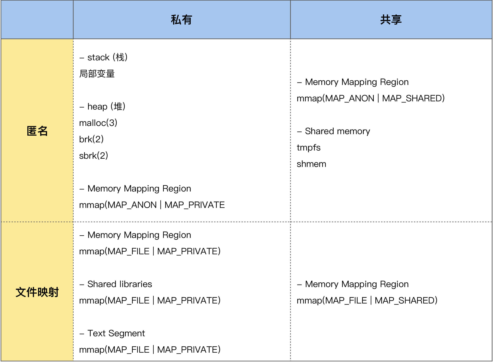

--

# sbrk

在内核里，128K以内的分配，用brk。128K以上的，用mmap来做的分配。

brk对应的用户态库函数是sbrk。

用法是这样：

```
void *ptr = sbrk(1);//分配一个字节的内存。
```


```
#include <unistd.h>
int brk(void *addr);
void *sbrk(intptr_t increment);
```


brk实际上是把heap的顶端往上移动。

所以可以通过sbrk的值，来检查内存是否有泄漏。如果sbrk的值一直增大，则说明内存在泄漏。

可以把系统的malloc替换为自己写的，在里面加内容来统计内存使用情况。

sbrk的体现是RSS值。这个可能不能准确反映内存泄漏的情况。

因为C语言glibc的内存管理，从操作系统申请内存的时候，有2种方式：sbrk() 向上线性扩展虚拟地址空间, mmap匿名内存映射文件分配虚拟地址空间； 前者对应小块内存分配，后者满足大块内存分配。

# RSS

Resident Set Size驻留集尺寸。

表示进程占用的物理内存的大小。

单位是KB。

查看的方法：

```
ps -eo pid,rss,args | grep -E "audioservice" | grep -v grep
```

输出是这样：

```
458 9216 /usr/bin/audioservice /etc/default_audioservice.conf
```

所以RSS值是9216KB。

驻留集大小（Resident Set Size，简称RSS）是指一个进程当前占用的物理内存量，即实际分配给该进程的物理 RAM。

这个值包括了该进程的代码、数据以及共享库的部分，但不包括交换到硬盘上的部分。

**RSS 是一个重要的性能指标，它反映了一个进程在物理内存中的实际占用情况，而不是虚拟内存。**较大的 RSS 值通常表示进程需要更多的物理内存资源来运行，而较小的 RSS 值意味着进程占用的物理内存较少。

在多任务操作系统中，系统会动态地管理物理内存，根据进程的需求来分配和回收内存。如果系统中的多个进程一起运行，操作系统会根据需要将它们的数据加载到物理内存中，以便快速访问，同时将不活动的数据从物理内存中移出，以释放内存供其他进程使用。这个过程被称为内存管理和页交换（Page Swapping）。

对于系统管理员和开发人员来说，监视进程的 RSS 值是一种重要的方式，可以帮助识别内存使用问题和优化系统性能。如果一个进程的 RSS 值过高，可能会导致物理内存不足，从而导致性能下降或系统变得不稳定。因此，了解 RSS 可以帮助诊断和解决内存相关的问题。

## RSS可以用来检查内存泄漏吗

RSS（Resident Set Size）通常用来监视一个进程当前占用的物理内存量，而不是检测内存泄漏。虽然 RSS 值可以提供关于进程内存使用的信息，但它本身不能直接用于检测内存泄漏。

内存泄漏是指程序分配的内存在不再需要时未被释放，导致系统的可用内存不断减少。要检测内存泄漏，通常需要使用专门的工具和技术，如内存分析器（Memory Profiler）或静态代码分析工具，来跟踪内存分配和释放的情况，以识别未释放的内存块。

RSS 可以用于监视进程的内存使用情况，以便发现异常或异常大的内存占用。如果某个进程的 RSS 值在一段时间内不断增加，可能表示该进程存在内存泄漏的问题。但要确定是否存在内存泄漏，还需要进一步的分析和调查。

总之，虽然 RSS 提供了有关进程内存使用的信息，但它通常用于性能监控和资源管理，而不是直接用于检测内存泄漏。要检测和解决内存泄漏问题，需要使用专门的工具和技术。

## 这么监视

```
watch -n 1 'cat /proc/$(pidof XX)/status | grep VmRSS'
```


# /proc/meminfo

/proc/meminfo是了解Linux系统内存使用状况的主要接口，

我们最常用的”free”、”vmstat”等命令就是通过它获取数据的 ，

/proc/meminfo所包含的信息比”free”等命令要丰富得多，

然而真正理解它并不容易，

比如我们知道”Cached”统计的是文件缓存页，

manpage上说是“In-memory cache for files read from the disk (the page cache)”，

那为什么它不等于[Active(file)+Inactive(file)]？

AnonHugePages与AnonPages、HugePages_Total有什么联系和区别？

很多细节在手册中并没有讲清楚，本文对此做了一点探究。

负责输出/proc/meminfo的源代码是：
fs/proc/meminfo.c : meminfo_proc_show()


## **MemTotal**

系统从加电开始到引导完成，

firmware/BIOS要保留一些内存，

kernel本身要占用一些内存，

最后剩下可供kernel支配的内存就是MemTotal。

这个值在系统运行期间一般是固定不变的。可参阅解读DMESG中的内存初始化信息。

## MemFree

表示系统尚未使用的内存。[MemTotal-MemFree]就是已被用掉的内存。

## **MemAvailable**

有些应用程序会根据系统的可用内存大小自动调整内存申请的多少，

所以需要一个记录当前可用内存数量的统计值，

MemFree并不适用，

因为MemFree不能代表全部可用的内存，

系统中有些内存虽然已被使用但是可以回收的，

比如cache/buffer、slab都有一部分可以回收，

所以这部分可回收的内存加上MemFree才是系统可用的内存，

即MemAvailable。

/proc/meminfo中的MemAvailable是内核使用特定的算法估算出来的，

要注意这是一个估计值，并不精确。

## **内存黑洞**

追踪Linux系统的内存使用一直是个难题，

很多人试着把能想到的各种内存消耗都加在一起，

kernel text、kernel modules、buffer、cache、slab、page table、process RSS…等等，却总是与物理内存的大小对不上，

这是为什么呢？

因为Linux kernel并没有滴水不漏地统计所有的内存分配，

kernel动态分配的内存中就有一部分没有计入/proc/meminfo中。


而通过alloc_pages分配的内存不会自动统计，

除非调用alloc_pages的内核模块或驱动程序主动进行统计，

否则我们只能看到free memory减少了，

但从/proc/meminfo中看不出它们具体用到哪里去了。

比如在VMware guest上有一个常见问题，

就是VMWare ESX宿主机会通过guest上的Balloon driver(vmware_balloon module)占用guest的内存，

有时占用得太多会导致guest无内存可用，

这时去检查guest的/proc/meminfo只看见MemFree很少、但看不出内存的去向，

原因就是Balloon driver通过alloc_pages分配内存，没有在/proc/meminfo中留下统计值，所以很难追踪。


内存都到哪里去了？ 

使用内存的，不是kernel就是用户进程，下面我们就分类讨论。


注：page cache比较特殊，很难区分是属于kernel还是属于进程，

其中被进程mmap的页面自然是属于进程的了，

而另一些页面没有被mapped到任何进程，那就只能算是属于kernel了。

## 内核使用的

#### 1.1 SLAB

```
Slab:              46884 kB
SReclaimable:      15180 kB
SUnreclaim:        31704 kB
```

通过slab分配的内存被统计在以下三个值中：

- SReclaimable: slab中可回收的部分。调用kmem_getpages()时加上SLAB_RECLAIM_ACCOUNT标记，表明是可回收的，计入SReclaimable，否则计入SUnreclaim。
- SUnreclaim: slab中不可回收的部分。
- Slab: slab中所有的内存，等于以上两者之和。

#### 1.2 VmallocUsed

```
VmallocTotal:   262930368 kB
VmallocUsed:       18788 kB
VmallocChunk:          0 kB
```

通过vmalloc分配的内存都统计在/proc/meminfo的 VmallocUsed 值中，

但是要注意这个值不止包括了分配的物理内存，

还统计了VM_IOREMAP、VM_MAP等操作的值，

譬如VM_IOREMAP是把IO地址映射到内核空间、并未消耗物理内存，

所以我们要把它们排除在外。

从物理内存分配的角度，我们只关心VM_ALLOC操作，

这可以从/proc/vmallocinfo中的vmalloc记录看到：

通过vmalloc分配了多少内存，可以统计/proc/vmallocinfo中的vmalloc记录，例如：

```
# grep vmalloc /proc/vmallocinfo | awk '{total+=$2}; END {print total}'
23375872
```

一些driver以及网络模块和文件系统模块可能会调用vmalloc，加载内核模块(kernel module)时也会用到，可参见 kernel/module.c。

#### 1.3 kernel modules (内核模块)

系统已经加载的内核模块可以用 lsmod 命令查看，

注意第二列就是内核模块所占内存的大小，

通过它可以统计内核模块所占用的内存大小，

但这并不准，

因为”lsmod”列出的是[init_size+core_size]，

而实际给kernel module分配的内存是以page为单位的，

不足 1 page的部分也会得到整个page，

此外每个module还会分到一页额外的guard page。

下文我们还会细说。

所以结论是kernel module所占用的内存包含在/proc/vmallocinfo的统计之中，不必再去计算”lsmod”的结果了，而且”lsmod”也不准。

#### 1.4 HardwareCorrupted

当系统检测到内存的硬件故障时，会把有问题的页面删除掉，不再使用，/proc/meminfo中的HardwareCorrupted统计了删除掉的内存页的总大小。相应的代码参见 mm/memory-failure.c: memory_failure()。

#### 1.5 PageTables

Page Table用于将内存的虚拟地址翻译成物理地址，随着内存地址分配得越来越多，Page Table会增大，/proc/meminfo中的PageTables统计了Page Table所占用的内存大小。

#### 1.6 KernelStack

每一个用户线程都会分配一个kernel stack（内核栈），内核栈虽然属于线程，但用户态的代码不能访问，只有通过系统调用(syscall)、自陷(trap)或异常(exception)进入内核态的时候才会用到，也就是说内核栈是给kernel code使用的。在x86系统上Linux的内核栈大小是固定的8K或16K（可参阅我以前的文章：内核栈溢出）。

Kernel stack（内核栈）是常驻内存的，既不包括在LRU lists里，也不包括在进程的RSS/PSS内存里，所以我们认为它是kernel消耗的内存。统计值是/proc/meminfo的KernelStack。

#### 1.7 Bounce

有些老设备只能访问低端内存，比如16M以下的内存，当应用程序发出一个I/O 请求，DMA的目的地址却是高端内存时（比如在16M以上），内核将在低端内存中分配一个临时buffer作为跳转，把位于高端内存的缓存数据复制到此处。这种额外的数据拷贝被称为“bounce buffering”，会降低I/O 性能。大量分配的bounce buffers 也会占用额外的内存。

## 用户使用的

/proc/meminfo统计的是系统全局的内存使用状况，单个进程的情况要看/proc//下的smaps等等。

#### 2.1 Hugepages

Hugepages在/proc/meminfo中是被独立统计的，

与其它统计项不重叠，

既不计入进程的RSS/PSS中，又不计入LRU Active/Inactive，也不会计入cache/buffer。

如果进程使用了Hugepages，它的RSS/PSS不会增加。

#### 2.2 AnonHugePages

AnonHugePages统计的是Transparent HugePages (THP)，THP与Hugepages不是一回事，区别很大。

# 一个问题分析

我现在有个问题。

系统里的进程因为oom被kill了。

系统内存是1G。当前的meminfo是这样。

```
MemTotal:        1007984 kB
MemFree:          142612 kB
MemAvailable:     148024 kB
Buffers:             260 kB
Cached:           774444 kB
SwapCached:            0 kB
Active:           777816 kB
Inactive:           2496 kB
Active(anon):     777692 kB
Inactive(anon):      196 kB
Active(file):        124 kB
Inactive(file):     2300 kB
Unevictable:           4 kB
Mlocked:               0 kB
SwapTotal:             0 kB
SwapFree:              0 kB
Dirty:                 0 kB
Writeback:             0 kB
AnonPages:          5776 kB
Mapped:             1720 kB
Shmem:            772112 kB
KReclaimable:      15180 kB
Slab:              46884 kB
SReclaimable:      15180 kB
SUnreclaim:        31704 kB
KernelStack:        2016 kB
PageTables:          604 kB
NFS_Unstable:          0 kB
Bounce:                0 kB
WritebackTmp:          0 kB
CommitLimit:      503992 kB
Committed_AS:     890892 kB
VmallocTotal:   262930368 kB
VmallocUsed:       18788 kB
VmallocChunk:          0 kB
Percpu:              944 kB
CmaTotal:         159744 kB
CmaFree:          137876 kB
DriverCma:         11536 kB
VmapStack:           620 kB
VmapFault:         50880 kB
VmapPfault:            0 kB
```

free是这样：

```

# free
              total        used        free      shared  buff/cache   available
Mem:        1007984       90548      140180      772112      777256      147144
Swap:             0           0           0
# 
```

可以看到cache的占据了很大的内存。

可以修改/proc/sys/vm/drop_caches 文件来清除缓存
默认是0，1表示清空页缓存，2表示清空inode和目录树缓存，3清空所有的缓存
echo 1 > /proc/sys/vm/drop_caches
echo 2 > /proc/sys/vm/drop_caches
echo 3 > /proc/sys/vm/drop_caches

这样drop也是没用的。


从0地址开始的内存区域并不是直接就是代码段区域，而是一段不可访问的保留区。

这是因为在大多数的系统里，我们认为比较小数值的地址不是一个合法地址。

堆 Heap，就是通过动态申请的内存，可以通过 malloc/new，或者系统调用 brk/sbrk/mmap 来申请的内存空间。

这部分空间，由程序员手动申请和释放，也主要是内存泄漏可能发生的地方。堆的增长方向是从小到大。





# 如何观察和判断是否发生了内存泄漏

我们常用来观察进程内存的工具，比如说pmap、ps、top等，都可以很好地来观察进程的内存。

首先我们可以使用top来观察系统所有进程的内存使用概况，

打开top后，

然后按g再输入3，从而进入内存模式就可以了。

在内存模式中，我们可以看到各个进程内存的%MEM、VIRT、RES、CODE、DATA、SHR、nMaj、nDRT，这些信息都是从 /proc/[pid]/statm 和 /proc/[pid]/stat 这个文件里面读取的。

通过 pmap 我们能够清楚地观察一个进程的整个的地址空间，

包括它们分配的物理内存大小，这非常有助于我们对进程的内存使用概况做一个大致的判断。

比如说，如果地址空间中 [heap] 太大，那有可能是堆内存产生了泄漏；

再比如说，如果进程地址空间包含太多的 vma（可以把 maps 中的每一行理解为一个 vma），那很可能是应用程序调用了很多mmap 而没有 munmap；

再比如持续观察地址空间的变化，如果发现某些项在持续增长，那很可能是那里存在问题。


故意运行下面的代码

```

#include <iostream>
#include <unistd.h>
#include <string.h>

int main(int argc, char *argv[]) {
  while (1) {
    int* a = new int[102400];
    memset(a, 0, 102400);
    sleep(1);
  }
  
  return 0;
}
```

很明显，这个程序存在内存泄漏问题。

假设运行其中的程序我们并不知道，

首先我们通过 top 进行观察(程序需要运行一段时间以后，才会更加明显)

观察一段时间后发现，mem 中的 free 一直在不断变小，

同时，有一个进程的**虚拟内存VIRT 和物理内存 RSS** 一直在变大，就是 pid 为 12117 的 a.out 进程。

我们通过 pidstat 对其进行持续观察，执行 一下命令

`watch -d pidstat -r -p 12117`

watch 命令用于监控 pidstat 命令的结果，-d 选项能够现实差异部分

pidstat 用于跟踪和分析进程的详细信息，-p attach 到某个具体的进程，-r 显示进程的内存使用情况。

每两秒，VSZ 也就是虚拟内存和 RSS 物理内存就会变化一次，而且是在持续的不断增大，可能这个程序就发生了内存泄漏。

我们可以通过 top + c 的命令查看 a.out 的具体执行程序，

可以通过 proc 文件系统来观察，

## 使用sbrk(0)来分析

前段时间设备端程序在长时间运行后，

内存不够导致正常业务无法进行，

这个不是安卓系统，ARM芯片平台，大部分是C/C++代码。

由于以前看《Linux/Unix系统编程手册》时看到过 sbrk(0)可以获取Program Break(直白的说就是堆内存的顶点，

一般情况下出于分配效率，这个值不会降低，系统会考虑到进程可能反复申请内存), 

当时就想到可以用这个来检查内存泄露， 

这次排上用场，在程序中加一线程，不断打印 sbrk(0)的值，

这时反复操作程序各个功能，如果发现反复执行某一操作时，sbrk(0)的值不断上涨，

基本可以确认是哪里内存泄露， 最终排查到UI图形控件库在显示文字方面有问题； 

```
pthread_t sbrk_thread;
void *sbrk_thread_proc(void *arg)
{
  static void *old_p = 0;
  while (1) {
    void *p = sbrk(0);
    printf("--------------sbrk:%d-----------\n", p-old_p);
    old_p = p;
    usleep(10*1000*1000);
  }
}
```


# 分析发生内存泄漏的代码

下面的内容主要参考这篇文章

https://blog.csdn.net/whuzm08/article/details/80332426

写得很好很全面

## mallinfo

glibc 提供了以下结构和接口来查看堆内内存和 mmap 的使用情况。

```
struct mallinfo {
  int arena;            /* non-mmapped space allocated from system */
  int ordblks;         /* number of free chunks */
  int smblks;          /* number of fastbin blocks */
  int hblks;             /* number of mmapped regions */
  int hblkhd;           /* space in mmapped regions */
  int usmblks;        /* maximum total allocated space */
  int fsmblks;         /* space available in freed fastbin blocks */
  int uordblks;        /* total allocated space */
  int fordblks;         /* total free space */
  int keepcost;       /* top-most, releasable (via malloc_trim) space */
};
```

```
/*返回heap(main_arena)的内存使用情况，以 mallinfo 结构返回 */
struct mallinfo mallinfo();

/* 将heap和mmap的使用情况输出到stderr*/
void malloc_stats();可通过以下例子来验证mallinfo和malloc_stats输出结果。
```

*//glibc默认128k以上使用mmap*

```

#include <stdlib.h>
#include <stdio.h>
#include <string.h>
#include <unistd.h>
#include <sys/mman.h>
#include <malloc.h>
 
size_t  heap_malloc_total, heap_free_total,mmap_total, mmap_count;
 
void print_info()
{
    struct mallinfo mi = mallinfo();
printf("count by itself:\n");
    printf("\theap_malloc_total=%lu heap_free_total=%lu heap_in_use=%lu\n\tmmap_total=%lu mmap_count=%lu\n",
              heap_malloc_total*1024, heap_free_total*1024, heap_malloc_total*1024-heap_free_total*1024,
              mmap_total*1024, mmap_count);
printf("count by mallinfo:\n");
printf("\theap_malloc_total=%lu heap_free_total=%lu heap_in_use=%lu\n\tmmap_total=%lu mmap_count=%lu\n",
             mi.arena, mi.fordblks, mi.uordblks,
             mi.hblkhd, mi.hblks);
printf("from malloc_stats:\n");
malloc_stats();
}
 
#define ARRAY_SIZE 200
int main(int argc, char** argv)
{
    char** ptr_arr[ARRAY_SIZE];
    int i; 
    for( i = 0; i < ARRAY_SIZE; i++)
    {
            ptr_arr[i] = malloc(i * 1024); 
            if ( i < 128)                                      //glibc默认128k以上使用mmap
            {
                    heap_malloc_total += i;
            }
            else
            {
                    mmap_total += i;
                   mmap_count++;
            }
    } 
    print_info();
 
    for( i = 0; i < ARRAY_SIZE; i++)
    {
           if ( i % 2 == 0)
                continue;
           free(ptr_arr[i]);
 
           if ( i < 128)
           {
                   heap_free_total += i;
           }
           else
           {
                  mmap_total -= i;
                  mmap_count--;
           }
    } 
    printf("\nafter free\n");
    print_info();
 
    return 1;
}

```

如果想知道堆内究竟有多少碎片，

可通过 mallinfo 结构中的 fsmblks 、smblks 、ordblks 值得到，

这些值表示不同大小区间的碎片总个数，

这些区间分别是 0~80 字节，80~512 字节，512~128k。

如果 fsmblks 、 smblks 的值过大，那碎片问题可能比较严重了。


### 参考资料

https://blog.csdn.net/wangquan1992/article/details/107509135

# oom-killer

```
xxxxxx invoked oom-killer: gfp_mask=0x201da, order=0, oom_score_adj=0
```

我当前的是：

```
[36822.664529@2]  S44bluetooth invoked oom-killer: gfp_mask=0x400dc2(GFP_KERNEL_ACCOUNT|__GFP_HIGHMEM|__GFP_ZERO), order=0, oom_score_adj=0
[36822.665578@2]  CPU: 2 PID: 31837 Comm: S44bluetooth Tainted: G           O      5.4.125-05785-g9f5d17a37be1 #2
```

是S44bluetooth这个脚本需要启动进程，但是发现内存不够了。所以触发了oom。


oomscore.sh

```
for proc in $(find /proc -maxdepth 1 -regex '/proc/[0-9]*'); do 
	printf "%2d %5d %s\n" "`cat $proc/oom_score`" "`basename $proc`" "`cat $proc/cmdline`" 
done 2>/dev/null | sort -nr | head -n 10 
```

上面这个命令可以找出最有可能被oom的进程。


避免的oom killer的方案

- 直接修改/proc/PID/oom_adj文件，将其置位-17
- 修改/proc/sys/vm/lowmem_reserve_ratio
- 直接关闭oom-killer

## oom_score

Linux内核有个机制叫OOM killer（Out-Of-Memory killer），

该机制会监控那些占用内存过大，

尤其是瞬间很快消耗大量内存的进程，

为了防止内存耗尽内核会把该进程杀掉。

内核检测到系统内存不足、挑选并杀掉某个进程的过程

可以参考内核源代码 linux/mm/oom_kill.c，

当系统内存不足的时候，out_of_memory()被触发，

然后调用 select_bad_process() 选择一个“bad”进程杀掉，

**判断和选择一个“bad”进程的过程由 oom_badness()决定，**

最 bad 的那个进程就是那个最占用内存的进程。

从上面的 oom_kill.c 代码里可以看到 oom_badness() 给每个进程打分，

根据 points 的高低来决定杀哪个进程，

这个 points 可以根据 adj 调节，

root 权限的进程通常被认为很重要，不应该被轻易杀掉，所以打分的时候可以得到 3% 的优惠（分数越低越不容易被杀掉）。

我们可以在用户空间通过操作每个进程的 oom_adj 内核参数来决定哪些进程不这么容易被 OOM killer 选中杀掉。

比如，如果不想 MySQL 进程被轻易杀掉的话可以找到 MySQL 运行的进程号后，

调整 /proc/PID/oom_score_adj 为 -15（注意 points越小越不容易被杀）

防止重要的系统进程触发(OOM)机制而被杀死，

内核会通过特定的算法给每个进程计算一个分数来决定杀哪个进程，

每个进程的oom分数可以在/proc/PID/oom_score中找到。

**每个进程都有一个oom_score的属性，**

oom killer会杀死oom_score较大的进程，

当oom_score为0时禁止内核杀死该进程。

设置/proc/PID/oom_adj可以改变oom_score，

oom_adj的范围为【-17，15】，

其中

15最大

-16最小，

-17为禁止使用OOM，

至于为什么用-17而不用其他数值（默认值为0），这个是由linux内核定义的，

查看内核源码可知：路径为linux-xxxxx/include /uapi/linux/oom.h。


### 参考资料

1、

https://blog.csdn.net/weixin_34186128/article/details/94673229


# /proc/pagetrace

该节点会降序打印出各个 zone 中模块占用内存的大小，也是为了调试内存泄漏而添加的节点。

其原理是在分配 page 的时候，

记录该调用路径上第一个非公共函数，

所以 pagetrace 是以 页 为单位记录各个模块占用内存的大小。


https://confluence.amlogic.com/display/SW/Memory+Information


# 参考资料

1、一次由于sbrk()无法压缩导致内存RSS虚高造成“内存泄露”的假象

<http://chenzhenianqing.com/articles/1061.html>

2、Linux虚拟内存介绍，以及malloc_stats和malloc_info 监控查看内存情况

<https://blog.csdn.net/zzhongcy/article/details/89135056>

3、Linux：/proc/meminfo参数详细解释

https://blog.csdn.net/whbing1471/article/details/105468139

4、linux下内存中cached过大原因已经解决

https://blog.csdn.net/weixin_30530939/article/details/96492809

5、浅谈内存泄漏

https://blog.csdn.net/honglicu123/article/details/121508820

6、记录几次内存泄露问题

https://blog.csdn.net/konga/article/details/52743572

7、内存泄露调试经验

https://blog.csdn.net/whuzm08/article/details/80332426