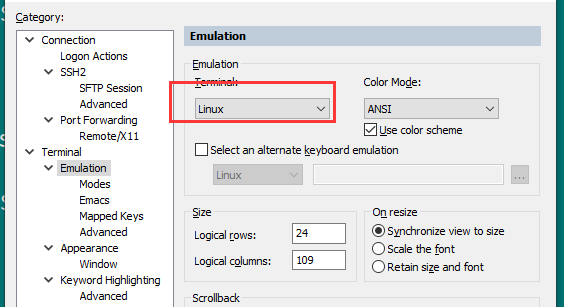

--

# 有哪些可选的终端类型

在 UNIX 和类 UNIX 系统中，有许多不同的终端类型可供选择，每种终端类型都有其特定的功能和特性。以下是一些常见的终端类型：

1. **xterm**：X Window 系统下的标准终端模拟器，支持 ANSI 颜色和各种终端功能。

2. **rxvt**：另一个流行的 X Window 终端模拟器，轻量级且快速，提供基本的终端功能。

3. **gnome-terminal**：GNOME 桌面环境下的默认终端模拟器，提供了丰富的功能和配置选项。

4. **konsole**：KDE 桌面环境下的默认终端模拟器，具有类似于 GNOME 终端的功能和界面。

5. **linux**：Linux 终端模拟器，通常用于文本模式下的系统控制台，支持 ANSI 颜色和基本的终端功能。

6. **vt100**：DEC VT100 终端模拟器，是最早的标准化终端类型之一，支持 ANSI 控制序列和基本的文本显示功能。

7. **vt220**：DEC VT220 终端模拟器，是 VT100 的改进版本，提供了更多的特性和功能。

8. **vt320**：DEC VT320 终端模拟器，是 VT220 的后续版本，提供了更多的图形和文本显示功能。

9. **ansi**：基于 ANSI 标准的终端模拟器，支持 ANSI 颜色和 ANSI 控制序列。

10. **dumb**：一种简单的虚拟终端类型，不支持终端功能，通常用于不需要交互式终端的情况下。

以上是一些常见的终端类型，实际上还有许多其他的终端类型可供选择，每种类型都可能有自己特定的功能和配置。选择合适的终端类型取决于用户的需求和使用场景。

## xterm介绍

`xterm` 是一个常见的 X Window 系统下的终端模拟器，它提供了一个基于文本的用户界面，用于在图形环境中运行命令行程序和交互式 shell。

以下是关于 `xterm` 的一些重要信息和特点：

1. **历史**：`xterm` 最早由 MIT（麻省理工学院）开发，是 X Window System 的一部分。它于1984年首次发布，是一个最古老、最常见的终端模拟器之一。

2. **功能**：`xterm` 提供了基本的终端功能，包括显示文本、光标移动、滚动、文本选择等。它还支持 ANSI 颜色、文本属性（如粗体、斜体）和各种终端控制序列，以及用于控制和配置终端的命令行选项。

3. **配置**：`xterm` 可以通过命令行选项或配置文件进行配置，用户可以定制各种外观和行为，比如字体、颜色、快捷键等。

4. **兼容性**：`xterm` 与几乎所有的 UNIX/Linux 系统兼容，并且可以在大多数 X Window 系统中运行。

5. **轻量级**：相比于一些其他 X Window 终端模拟器，==`xterm` 是一个轻量级的选择==，它的设计目标是简单、快速和可靠。

6. **标准终端**：`xterm` 遵循了 ANSI 标准，因此可以在大多数情况下与标准终端兼容，并且可以用于运行各种命令行程序和交互式 shell。

总的来说，`xterm` 是一个功能简单但强大的终端模拟器，它在 UNIX 和类 UNIX 系统中广泛使用，特别是在 X Window 环境下。它提供了一个稳定可靠的命令行界面，用于运行和管理命令行程序。

## securecrt里模拟终端，有这些可选类型：Linux，SCOANSI， vshell，请介绍一下

SecureCRT 是一款常用的 SSH 客户端软件，用于远程登录和管理 UNIX/Linux 系统。在 SecureCRT 中，模拟终端类型是指模拟的终端设备类型，它会影响到连接到远程主机时的终端行为和显示效果。

以下是 SecureCRT 中几种常见的模拟终端类型：

1. **Linux**：
   - 使用 Linux 终端模拟类型时，SecureCRT 会模拟一个标准的 Linux 终端，这意味着它会发送类似于 Linux 终端的控制序列，并且支持 ANSI 颜色和其他 Linux 终端特性。这种模拟类型通常用于连接到 Linux 主机时，以便于使用标准的 Linux 终端特性和命令。

2. **SCOANSI**：
   - SCOANSI是 SecureCRT 的一种专有的终端模拟类型，它提供了与标准 ANSI 终端类似的功能。它适用于连接到各种 UNIX/Linux 系统，以及一些其他的网络设备和服务器。虽然不同于 Linux 终端，但 SCOANSI也支持 ANSI 颜色和常见的终端控制序列，因此在大多数情况下可以满足基本的终端需求。

3. **vshell**：
   - vshell 是 SecureCRT 的另一种专有的终端模拟类型，它通常用于连接到设备上的虚拟 shell 界面。这些设备可能是网络设备、路由器、交换机等，它们的终端界面通常与标准的终端略有不同。vshell 模拟类型可以根据这些设备的特定要求进行定制，以确保与其兼容性。

每种模拟终端类型都有其特定的用途和适用场景。在选择模拟终端类型时，应根据连接的远程主机类型和需要使用的功能来进行选择。


# export TERM=xterm 和export TERM=linux的区别

我的vim在退出后，总是在当前的shell界面里留存了vim编辑的文件的内容，非常影响我看前面的命令输出。

网上找了一下，需要设置TERM为xterm，我试了，的确就好了。

这个是为什么？

`TERM` 环境变量用于告诉系统当前终端类型，以便正确配置终端的功能和行为。`xterm` 和 `linux` 都是终端类型。

1. **`export TERM=xterm`**：
   - `xterm` 是一种常见的终端类型，它模拟了传统的 X Window 系统下的终端行为。
   - 设置 `TERM` 为 `xterm` 时，系统会将终端配置为与 X Window 系统兼容的模式，这意味着它会启用各种功能，如颜色支持、鼠标支持等。

2. **`export TERM=linux`**：
   - `linux` 是另一种终端类型，通常用于 Linux 控制台终端。
   - `linux` 终端类型更适合于纯文本终端环境，如在命令行模式下，它提供了基本的终端功能，但不包括像颜色支持和鼠标支持这样的高级功能。

总的来说，两者的区别在于功能和行为上的差异，`xterm` 提供了更丰富的功能，适合在 X Window 环境下使用，而 `linux` 更适合于基本的命令行操作。


应该跟我当前默认配置的Emulation的terminal为linux有关系。



我改为xterm后，查看：

```
echo $TERM
xterm-256color
```

