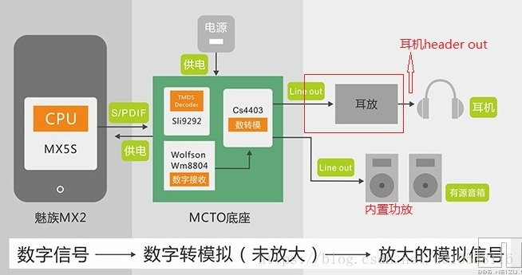
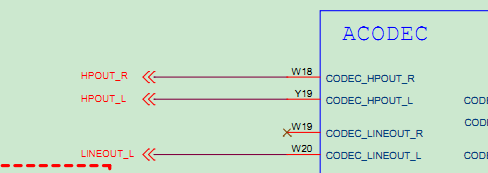

--

耳机线插入，也属于input子系统的一部分。

对应switch event。

是SW_HEADPHONE_INSERT事件。

在sound/core/jack.c里，定义了耳机等jack设备。


audio jack（就是3.5mm接口）一般有switch用来做插入检测的。

大多数的codec芯片都可以实现jack检测。


在rk3308的sdk的《Rockchip Audio开发指南》里，有这样一句话：

```
JACK:耳机的接口检测，大部分使用 Codec 自身的检测机制，小部分使用 IO来进行模拟
```

一个声卡包括

cpu_dai：对应cpu_dai的driver，例如i2s driver，spdif driver

codec_dai：对应codec driver，例如rt5640 codec driver

dai_link：对应dai_link driver。也就是machine driver。比如sound/soc/rockchip/rockchip_rt5640.c。


4.4的内核支持两种方式创建声卡。

1、使用通用的simple-card framework。建议优先考虑这种。

2、传统的编写自定义的machine driver的方式。


瑞芯微RK3308是全新针对音频应用的方案，省去了GPU、视频编解码以及显示输出等部分，**增加了CODEC以及音频相关模块**，不论是芯片成本还是系统成本都进行了优化，实现超高性价比。

内置音频高性能CODEC（8通道 ADC + 2通道 DAC）

直接支持最大8通道模拟MIC阵列+回采，无需外加ADC

为低功耗应用开发了硬件语音检测模块（VAD）

http://www.ruiyixi.com/project/an-rk3308-pcba-for-ai-and-iot/


```
 rk_headset {
     compatible = "rockchip_headset";
     headset_gpio = <&gpio2 RK_PC6 GPIO_ACTIVE_LOW>;
     pinctrl-names = "default";
     pinctrl-0 = <&hp_det>;
 };
```

对应的选配宏是：CONFIG_RK_HEADSET。


headphone是听筒，只能听，不能说话，而headset是耳机，能听也可以说话。

我们只需要headphone的检测就好了。

从内核的宏里也可以看出。

```
enum snd_jack_types {
	SND_JACK_HEADPHONE	= 0x0001,
	SND_JACK_MICROPHONE	= 0x0002,
	SND_JACK_HEADSET	= SND_JACK_HEADPHONE | SND_JACK_MICROPHONE,
```


三段式就是没有Mic的耳机插口，

从上到下分别是左声道L、右声道R和GND，

而四段式耳机口就多了一个Mic信号，

有两种标准，

一种是左声道L、右声道R、GND、MIC，

另一种是左声道L、右声道R、MIC、GND，

比如Iphone手机接口的标准和其他手机使用的标准不一样，

就会导致苹果耳机不能用在其他手机上。


检测原理一般是在检测引脚接上拉电阻。

因此通常该引脚为高电平。

当耳机插入后，耳机的最前端（左声道的那个触点）会将检测引脚和左声道连接，

**而此时因为左声道和地连接，且电阻很小，**

因此就等同于检测引脚被接地，

因此检测引脚由高电平变为低电平，cpu得到这个中断信号，然后便知道耳机插入了。

但是cpu由是怎么知道这是个三段耳机还是四段耳机呢？

 每一段都会用一个中断来监听的。所以会判断出来，这和普通的按键中断是一个道理的。

耳机本身是一个闭合回路，这我们都知道，铜丝线圈么。

而且电阻很小，基本就是十几欧姆左右。


现在rk3308上进行耳机插入检测。

耳机未插入，AUX_DET脚电压为0，插入后，目前量到是0.44V。这个电压不知道是否正常。

acodec-hpdet 这中断没有看到触发。


这个中断是在sound/soc/codecs/rk3308_codec.c里注册的。

中断处理函数里，可以看到进行的音频的切换。并上报了对应的事件。

```
rk3308_codec_dac_switch(rk3308, dac_output);
		if (rk3308->hpdet_jack)
			snd_soc_jack_report(rk3308->hpdet_jack,
					    report_type,
					    SND_JACK_HEADPHONE);
```

看这个中断的触发条件是什么。是电平触发，还是边沿触发。

```
interrupts = <GIC_SPI 114 IRQ_TYPE_LEVEL_HIGH>,
			     <GIC_SPI 115 IRQ_TYPE_LEVEL_HIGH>;
```

没有中断是因为电路板设计有点问题，把HPDET连接到另外一个gpio上去了。

去掉连接的电阻，现在可以正常检测到中断了。


现在声音还无法从耳机线输出。

需要看看这个引脚对不对。

```
rk3308->hp_ctl_gpio = devm_gpiod_get_optional(&pdev->dev, "hp-ctl",
						       GPIOD_OUT_LOW);
```

在rk3308_codec.c里加上`#define DEBUG`。

开机看到的打印：

```
[    0.852569] rk3308-acodec ff560000.acodec: Don't need hp-ctl gpio
[    0.852671] rk3308-acodec ff560000.acodec: Don't need spk-ctl gpio
[    0.852757] rk3308-acodec ff560000.acodec: Don't need pa-drv gpio
```

设备树里已经有hp-ctl这个文件了。

```
/sys/firmware/devicetree/base/acodec@ff560000 # hexdump hp-ctl -C           
00000000  00 00 00 6c 00 00 00 01  00 00 00 00              |...l........|  
0000000c                                                                    
```

那么就是devm_gpiod_get_optional出错了。这个为什么出错？

```
[    0.793404] xhl -- get gpio index fail, error is ENOENTY
[    0.793434] rk3308-acodec ff560000.acodec: Don't need hp-ctl gpio
[    0.793513] xhl -- get gpio index fail, error is ENOENTY
[    0.793524] rk3308-acodec ff560000.acodec: Don't need spk-ctl gpio
[    0.793602] xhl -- get gpio index fail, error is ENOENTY
[    0.793617] rk3308-acodec ff560000.acodec: Don't need pa-drv gpio
```

什么情况下，会出现获取gpio返回ENOENT呢？

内核文档里是这样写的。

```
 -ENOENT will be returned
if and only if no GPIO has been assigned to the device/function/index triplet,
```

就是没有gpio被分配给这个device/function/index三元组。

怎样才能分配给这样的三元组呢？


看一个按键的gpio做了哪些配置。以PB0的为例。

```
	key {
		gpio_key_default: gpio_key_default {
			rockchip,pins = <0 RK_PA6 RK_FUNC_GPIO &pcfg_pull_up_8ma>,
				<0 RK_PA7 RK_FUNC_GPIO &pcfg_pull_up_8ma>,
				<0 RK_PB0 RK_FUNC_GPIO &pcfg_pull_up_8ma>,
				<0 RK_PB2 RK_FUNC_GPIO &pcfg_pull_up_8ma>;
		};
	};
```

在gpio-keys指向了这个pinctrl。

```
	gpio-keys {
		compatible = "gpio-keys";
		pinctrl-names = "default";
		pinctrl-0 = <&gpio_key_default>; //这里。
```


```
/sys/kernel/debug/pinctrl/pinctrl/pinmux-pins
```

```
&pinctrl {
	pinctrl-names = "default";
	pinctrl-0 = <&rtc_32k>;


	wireless-wlan {//多了这个。
		wifi_wake_host: wifi-wake-host {
			rockchip,pins = <0 RK_PA0 RK_FUNC_GPIO &pcfg_pull_up>;
		};
	};
```

最后发现跟这个pinctrl配置没有关系。

而是acodec那里，`hp-ctl-gpios`这个名字是对的。虽然代码里写的是`hp-ctl`。似乎是代码会自动给补上后面的gpios。这样就可以了。

控制喇叭输出，是这个引脚。也需要配置上。不然喇叭没有声音。


现在要把耳机输出改成line out。

耳机和lineout的区别是什么？

首先，二者都是模拟输出。直接用耳机插上去都有声音。

区别在于：line out输出的模拟信号是没有经过功放放大的信号，是芯片将数字信号转成模拟信号后的最原始的信号。不包含额外的音染。

也因为没有放大，所以功率极小，输出阻抗也很大，难以推动耳机。

而耳机输出，及headphone out，是把最原始的信号，经过了功放放大，它的功率足以推动耳机。

line out需要接有内部放大电路的有源音箱才能有声音。





那电路这里也需要改。

并不是，LINEOUT接的就是板端的功放了。


# 参考资料

1、耳机插入检测学习总结

https://wenku.baidu.com/view/7435b1eef18583d048645904.html

2、RK android带MIC耳机检测以及hook-kernel

这个很有用。

https://wenku.baidu.com/view/21f06b66bfd5b9f3f90f76c66137ee06eef94e01.html?from=search

3、headphone与headset有什么区别

https://zhidao.baidu.com/question/1755332853391454548.html

4、

https://blog.csdn.net/tongbiaos/article/details/47442229

5、

https://blog.csdn.net/sinat_34606064/article/details/77932816

6、mic in、line in&line out、speaker out、headphone out　区别

https://blog.csdn.net/zhangchao0426/article/details/102288311

7、

https://blog.csdn.net/Guet_Kite/article/details/117520599