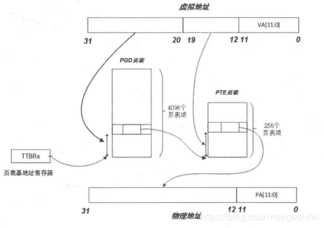
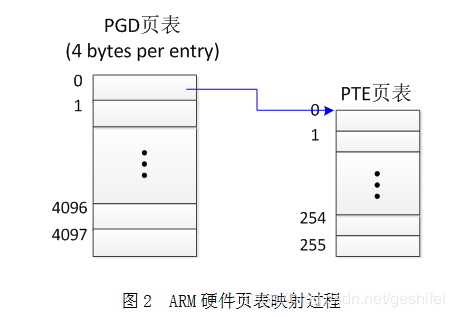
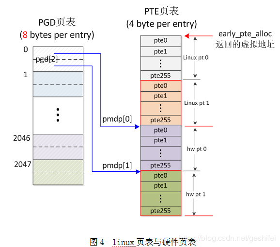

1

Linux在**启动之初会建立临时页表**，但是在start_kerne函数中setup_arch又会建立正真的页表和页目录。

临时页表建立的空间和正式页表建立的空间**分别部署于不同的空间**，因此不会出现覆盖或者修改等现象。

arm linux使用两级页表，L1是pgd，L2是pte。

其中L1页表共2048项，每项占用8bytes，每项对应2M内存，共占用2048*8=16K bytes。

arch/arm/include/asm/pgtable-2level.h


arm为什么要先建立临时页表？起什么作用？

kernel启动阶段，还没有使能mmu。**所以在使能mmu之前，应该让kernel的代码能够与位置无关。**


Linux启动分为2个阶段：

1、汇编代码里建立一个临时页表进入分页机制。

2、C语言里初始化系统资源。


不管在临时页表机制，还是后面的正式页表机制里，**Linux是不需要把内核自身的代码段、数据段这些映射到页表里的。**

在进入正式页表机制之前，Linux需要一个临时的页表来管理低端内存。


鉴于arm 32位的页表，只有两级页表，相对来说比较简单，所以我现在以这个情况为突破口。

把Linux页表理解透彻。

是不是可以用目录层次来辅助理解多节页表呢？

假如只有一级页表，一页是4K，对于4GB内存，就是大概100万个条目。

想象一下，在一个文件夹下面，之间放了100万个文件，是什么感觉。

如果是两级页表，那么相当于第一层目录，下面放了1024个子目录。

每个子目录下，分别放了1024个文件。

这样看起来感觉就好多了。

你只有打开某个子目录的时候，才需要去磁盘里去查询该子目录下的文件。其他子目录的你完全不用管。

对于系统的负担也是很大的减轻。


arm的第一级页表条目数为4096个，对于4K页第二级目录条目个数为256个，一级二级条目都是每个条目4字节。

在linux下二级分页如下：虚拟地址——> PGD转换——> PTE转换——>物理地址。

arm-linux假装第一级目录只有2048个条目，但其实每个条目是2个ulong大小即8字节，所以最终设置MMU的还是4096个条目，只是每访问1个pgd条目将可以访问到2个pte条目，linux为了实现其内存管理功能又在后面加上2个对应的假pte表，这个假pte表专门给linux内核代码自己用的，不会影响arm硬件(事实上还有一个重要原因是，linux要求pte表长度为4K即一页)。

```
typedef unsigned long pte_t;
typedef unsigned long pmd_t;
typedef unsigned long pgd_t[2];
typedef unsigned long pgprot_t;
```


**Linux的正式页表，是在start_kernel函数里的paging_init函数里创建的。**

paging_init函数可以正常创建内存页表的条件有2个：

1、meminfo已经初始化。就是各个node的各个bank都已经初始化了。在嵌入式里，一般是一个node，一个node里只有一个bank。

2、全局变量init_mm的text_begin、text_end、data_begin、data_end这4个成员已经初始化。

界定这4个变量的意义在于：可以得出内核运行需要的空间的位置和大小。


prepare_page_table

这个函数是清除临时页表。代码的注释是这么写的。

内核我们一般放在类似80008000这种位置，前面8000 0100 这里放boot参数。

8000 4000 这里开始，放的是16K的临时页表。

现在就是要把这个临时页表清除掉。

```
/*
	 * Clear out all the mappings below the kernel image.
	 */
```


什么是内存页表？

有哪些属于内存？

**对于soc，有些寄存器也在页表的管理之下的。**

具体来说，内存页表，叫内存映射其实更能反映实际情况。

对于带有mmu的cpu来说，cpu要访问物理内存或者某个soc寄存器的时候，并不是直接把地址放到了cpu的地址总线上。

而是把一个虚拟地址交给mmu。

如果mmu硬件里存在这个虚拟地址对应的物理地址，那么mmu就把对应的物理地址放到cpu的地址总线上。

这样做的好处是：

1、避免了用户程序直接访问一个不存在的地址而破坏系统。

2、用户程序可以使用的内存看上去很大。


**所有通过cpu地址总线连接的东西，都可以被映射。**

函数create_mapping是最终创建内存映射的函数。看看这个函数，被3个地方调用了：

1、map_memory_bank。这个是物理内存的映射。

2、devicemaps_init：这个是中断向量的映射。

3、iotable_init：这个是soc硬件寄存器的映射。


create_mapping 这个函数是关键。

接收一个参数：struct map_desc类型。

这个结构体，4个成员。

前面三个分别是：虚拟地址、物理了地址、长度。

第四个是类型：

我们只用这几种：MT_DEVICE（寄存器映射）、MT_MEMORY（物理内存）、MT_HIGH_VECTORS（中断向量）。


具体创建映射是怎么做的呢？

32位的arm芯片寻址空间是2^32，就是4GB。

如果按照1M大小为单位进行映射，就需要4096个条目。

每个条目负责1M的地址范围。

如果映射一个128M的物理内存，只需要128个条目就够了。

这个就是一级页表。

优点：

条目较少，4096个，每个条目4字节，一个进程的页表只需要占用16K的空间。

缺点：

粒度太大了，不便于Linux内存管理。

即使你用不了1M的空间，也只能申请1M的。

所以这个缺点是不能容忍的。

必须改进。

所以引入了二级页表。


每个进程都有一个自己的mm_struct，来描述自己的内存使用情况。

内核进程也是如此。


```
struct mm_struct init_mm = {
	.mm_rb		= RB_ROOT,
	.pgd		= swapper_pg_dir,
	.mm_users	= ATOMIC_INIT(2),
	.mm_count	= ATOMIC_INIT(1),
	.mmap_sem	= __RWSEM_INITIALIZER(init_mm.mmap_sem),
	.page_table_lock =  __SPIN_LOCK_UNLOCKED(init_mm.page_table_lock),
	.mmlist		= LIST_HEAD_INIT(init_mm.mmlist),
	.cpu_vm_mask	= CPU_MASK_ALL,
};
```

我们看看swapper_pg_dir这个。

在C000 4000这个位置，因为KERNEL_RAM_VADDR是C000 8000。

```
./arch/arm/kernel/head.S:45:    .equ    swapper_pg_dir, KERNEL_RAM_VADDR - 0x4000
```

在System.map里也可以看到。

```
c0004000 A swapper_pg_dir
c0008000 T __init_begin
c0008000 T _sinittext
c0008000 T _stext
c0008000 T stext
c0008034 t __enable_mmu
```

所以内核的内存页表的虚拟地址范围是c000 4000到c000 8000 。大小是16K。

**内核的内存页表，都映射了一些什么内容呢？**

**根据前面的介绍，就是3个部分：物理内存、中断向量、寄存器。**


**除了看Linux内核里对页表的处理，还需要看arm的页表逻辑跟内核的页表逻辑的融合。**

**因为二者的机制不完全一致，需要互相匹配。**

arm体系结构的MMU实际上支持两级页表。


Arm上的linux（临时）页表采用的是段式页表，每一个entry可以映射1M的空间，结合后面的20bits位（寻址空间正好是1M）


**在Linux系统中所有进程的内核页表是共享的同一套**，**内核页表是存放在swapper_pg_dir，这一套是我们静态定义的页表：**


内核页表是如何在不同进程中共享的？

**内核地址空间使用的TTBR1作为页表基地址**，

**而用户地址空间是TTBR0作为页表基地址，**

这样我们只需要配置内核页表后设置到TTBR1寄存器，

**后面再各个进程切换时，不对TTBR1做切换，即可共享这段内存配置，**

而用户空间地址，我们在进程切换是需要进行切换，这个切换是通过task_struct中的mm_struct成员来做的。


ARM TTBR0，TTBR1寄存器；
从ARMV6开始增加了TTBR1寄存器，

但是在ARM32的时候，TTBR1寄存器未使用，

原因如下：

TTBR0和TTBR1寄存器只支持2G，1G，512M等，

但是ARM32虚拟地址空间的划分比例为1:3，用户空间是3G，内核空间是1G，

**所以上述寄存器硬件限制无法满足这种通用配置，所以ARM32未使用TTBR1寄存器；**

ARM32页表复制

ARM32：由于ARM32未使用TTBR1寄存器，也就是MMU只使用了一个页表基址寄存器，

**同时，为了避免在用户空间和内核空间切换时，切换页表带来的性能损耗，**

**所以，用户空间和内核空间共用一个页表，**

即用户空间和内核空间具有相同的页表基地址TTBR0，

为了实现这种机制，内核在每次fork一个新的进程的时候，

**都会把内核页表的一级页表复制到新的进程的一级页表中**，代码如下

ARM64：ARM64使用了TTBR0和TTBR1寄存器，

用户虚拟地址空间和内核虚拟地址空间都是256TB，

用户虚拟地址的高位都是0，内核虚拟地址的高位都是1，

MMU会自动根据**高位是否为1来判断该虚拟地址是否为内核虚拟地址，**

所以用户虚拟地址空间和内核虚拟地址空间采用了不同的页表，

即用户空间和内核空间具有不同的页表基地址，

所以ARM64在fork每一个新的进程的时候**不会把内核页表的一级页表复制**到每一个新进程的一级页表中，








针对上面提到的问题，linux做了一些处理，使内核中实现的页表能够满足硬件需求，最终的arm页表见图4。



对于图4，解释如下：

1）软件实现必须符合硬件要求。ARM要求4096个PGD entry、256个PTE entry。

2）Linux需要 "accessed" and "dirty"位。

3）Linux期望PTE页表占用1个page。


我们知道swapper_pg_dir是一个很重要的东西，

**它是所有进程内核空间的页表的模板，**

而且在涉及到896M以上的内存分配时，swapper_pg_dir也是一个同步的根，

这些内存分配包括vmalloc区，高端永久区，高端临时区等。

这里需要说明的是，swapper_pg_dir这个东西**其实就是一个页目录的指针**，

页目录指针在x86中是要被加载到cr3寄存器的，

每个进程都有一个页目录指针，

这个指针指示这个进程的内存映射信息，

每当切换到一个进程时，该进程的页目录指针就被加载到了cr3，

然后直到切换到别的进程的时候才更改，

既然swapper_pg_dir是一个页目录指针，那么这个指针是被哪个进程用的呢？

现代操作系统的含义指示了进程间内存隔离，那么一个页目录指针只能被一个进程使用，

那么到底是哪个特定的进程使用了swapper_pg_dir指针呢？

遗憾的是，答案是没有任何用户进程使用swapper_pg_dir作为页目录指针，

swapper_pg_dir只是在内核初始化的时候被载入到cr3指示内存映射信息，

**之后在init进程启动后就成了idle内核线程的页目录指针了，**

/sbin/init由一个叫做init的内核线程exec而成，

而init内核线程是原始的内核也就是后来的idle线程do_fork而成的，

而在do_fork中会为新生的进程重启分配一个页目录指针，

**由此可见swapper_pg_dir只是在idle和内核线程中被使用，**

可是它的作用却不只是为idle进程指示内存映射信息，

**更多的，它作为一个内核空间的内存映射模板而存在，**

在linux中，任何进程在内核空间就不分彼此了，

所有的进程都会公用一份内核空间的内存映射，

因此，内核空间是所有进程共享的，

每当一个新的进程建立的时候，都会将swapper_pg_dir的768项以后的信息全部复制到新进程页目录的768项以后，代表内核空间。

另外在操作3G+896M以上的虚拟内存时，只会更改swapper_pg_dir的映射信息，

当别的进程访问到这些页面的时候会发生缺页，在缺页处理中会与swapper_pg_dir同步。


说明了让系统将swapper_pg_dir加载到地址0x1000处，

可是内核最终搬到了0x100000处，

那么swapper_pg_dir也就到了0x101000处，

现在物理地址已经搞定了，那么最终进入保护模式并且启动分页时，

swapper_pg_dir的虚拟地址会在哪里呢？

我们看一下内核加载到了哪里然后加上0x1000就是swapper_pg_dir加载到的虚拟地址了，

在vmlinux.lds中可以看出内核被加载到了0xc0100000处，

于是swapper_pg_dir加载的虚拟地址就是0xc0101000，

在初始化的时候，内核将0到8M的物理内存分别映射到了虚拟地址的0到8M和3G到3G+8M两个地方，

而且过了初始化阶段到了最终的稳定页表，

也同样有前XM的物理内存一一映射到虚拟内存的3G+XM的地方，于是swapper_pg_dir的虚拟地址就是0xc0101000，

我们可以打印出swapper_pg_dir看看到底是多少，

不幸的是，swapper_pg_dir并不从内核导出，那么怎么办呢？

难道非要将打印信息加入内核启动函数然后从新编译一遍内核吗？

其实不用，虽然swapper_pg_dir没有被导出，可是init_mm被导出了啊，

我们知道init_mm就是内核启动时也就是idle进程的mm_struct，其中一个字段是pgd，就是swapper_pg_dir，

我们可以打印init_mm->pgd的值，看看是多少。

事情到此还没有结束，如果你真的写了一个模块，并且打印init_mm.pdg的话，

发现可能它并不是期望的0xc0101000，怎么回事呢？

不要急， 遇到这种情况比遇到内核莫名其妙的down掉要好处理的多，

再说这并不影响我们的生活，

即使你最终没有弄清楚这是怎么一回事，那么也不会有什么损失的。

这 种情况好解决的原因还有就是事情发生在内核初始化的阶段，也就是说swapper_pg_dir的初始化在内核初始化阶段，并且以后也不会变化，

可能它的 内容会变，但是其本身的位置是不会变化的，

因此，几乎不用调试，光看代码就可以解决问题，

我们搜索一下近来的Changelog，发现在2.6.6中将 swapper_pg_dir从原来的固定的.org 0x1000的位置移到了BSS段当中了，

因为bss段仅仅拥有占位符而不占用映像静态空间，它的真正数据并没有初始化，

因此交给操作系统初始化就可以 了，

既然没有初始化的数据，那么就没有必要在静态的映像中占据空间，

而是让操作系统将其载入内存时将bss清零即可，

linux内核本身就是操作系统内 核，因此它自己负责在启动的时候将bss段清零，

因为初始化的时候，临时页表也就需要两个页目录用来映射物理内存的0到8M，

这两个页目录很简单，一点不 复杂，

没有必要写死到内核映像从而占据着3个页面的空间，

因此放到bss段中就可以节省3页面的空间，

然后在内核启动过程中再手动初始化那两个页目录的 值，这样做十分有意义。

那么bss被加载到哪里就决定了swapper_pg_dir被加载到了哪里，那么bss到底在哪呢？

从arch/i386 /kernel/vmlinux.lds.S中可以大致知道答案，如果想知道更加确切的，可以参考/boot/System.map文件，然后可以再打印 一下init_mm.pgd的值，看看是不是在bss里面，其实都不用打印，在System.map里面就有swapper_pg_dir的值，该值在 2.6.6之后的内核肯定在bss中，之前的肯定是0xc0101000。


参考资料

1、ARM-Linux （临时，正式） 建立页表的比较

https://blog.csdn.net/edwardlulinux/article/details/38967521

2、arm linux 临时页表的建立

https://blog.csdn.net/flaoter/article/details/73381695

3、arm页表在linux中的融合

https://www.cnblogs.com/yangjiguang/p/8245306.html

4、arm-linux内存页表创建

这篇文章讲得很细了。值得反复读。

https://blog.csdn.net/waterhawk/article/details/49175973

5、ARM中的linux页表与硬件页表（linux4.0）

https://blog.csdn.net/geshifei/article/details/89574508

6、linux启动过程中建立临时页表

https://www.cnblogs.com/4a8a08f09d37b73795649038408b5f33/p/10154324.html

7、进程切换分析(1)：基本框架

http://www.wowotech.net/process_management/context-switch-arch.html

8、ARM TTBR0，TTBR1寄存器与ARM32页表复制

https://blog.csdn.net/a372048518/article/details/103865898

9、linux的swapper_pg_dir的初始化

https://blog.csdn.net/dog250/article/details/5303446