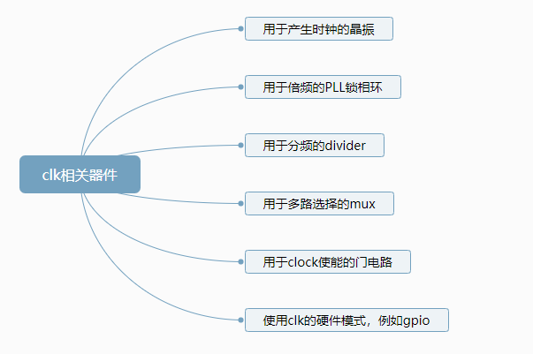
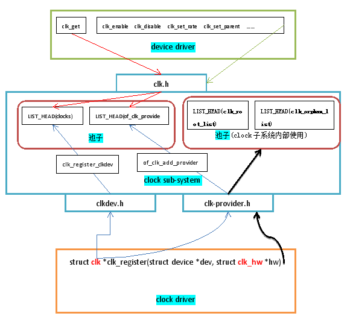

--


Clock统是Linux内核中专门管理时钟的子系统.

时钟在嵌入式系统中很重要, 它就像人的脉搏一样, 驱动器件工作.

任何一个CPU, 都需要给它提供一个外部晶振, 这个晶振就是用来提供时钟的; 

任何一个CPU内部的片上外设, 也需要工作时钟: 

例如GPIO控制器, 首先得给它提供工作时钟, 然后才能访问它的寄存器.

如果你去看一个ARM CPU的芯片手册, 你一定能找到一个章节, 专门描述系统时钟, 一般称之为时钟树(clock tree).

芯片手册从硬件的角度上描述了某个CPU的时钟系统是如何设计的, 而Clock子系统从软件的层面来抽象这个设计.

在本章中, 我们首先从硬件的角度来看看一个时钟树的的例子, 然后自己思考一下软件层面该如何设计, 最后看看clock子系统是怎么做的.

一个简单的例子。


从这里，我们可以看到涉及到的相关器件有




在上图的时钟树中, 有些是clock的提供者, 我们可以称之为**provider**, 例如oscillator, PLLs;

 有些是clock的使用者, 我们可以称之为**consumer**, 例如HW1, HW2, HW3.


在ARM CPU的内部, 

时钟树系统用来provide各种各样的时钟; 

各片上外设consume这些时钟. 

例如时钟树系统负责提供时钟给GPIO控制器, GPIO控制器则消费提供给它的工作时钟.


在设备驱动开发的过程中, 我们经常会遇到的一个问题是: 

想要开启某个模块的时钟.


例如开发GPIO的驱动, 在驱动的probe函数中, 我们需要使能GPIO模块的工作时钟.


从软件层面, 我们就是要提供一种机制, 

让consumer可以方便的获取/使能/配置/关闭一个时钟.


上一节我们介绍了时钟树, 并介绍了时钟的provider和consumer. 

一个CPU芯片内部, 会有很多个provider, 也会有很多的consumer. 

软件层面需要做的事情就是管理所有这些provider, 

并向consumer提供尽量简单的接口

使得consumer可以获取/使能/配置/关闭一个时钟.

 

因此, 我们可以设计这样一个池子, 

所有的provider都可以向池子注册, 

把自己添加到池子里面. 

池子里面可以用一个链表把所有的provider都串起来, 

不同的provider以不同的name区分. 

当consumer需要获取某个clock的时候, 通过name向池子查询即可.

 

在这个池子里面, 每一个provider都可以抽象成一个独立的元素, 

因此我们最好设计一个数据结构, 来表示每一个元素.

 

大致逻辑就是这样了, Linux内核的clock子系统基本上就是在干这些事情.


Linux内核的clock子系统, 按照其职能, 可以大致分为3部分:

1、 向下提供注册接口, 以便各个clocks能注册进clock子系统

2、  在核心层维护一个池子, 管理所有注册进来的clocks. 这一部分实现的是通用逻辑, 与具体硬件无关.

3、  向上, 也就是像各个消费clocks的模块的device driver, 提供获取/使能/配置/关闭clock的通用API





前文我们介绍了时钟树, 

本章要阐述的主要问题就是

如何把时钟树产生的这些clocks注册进Linux内核的clock子系统. 

换句话说, 就是如何编写clock driver.

 

在ARM CPU内部, 管理时钟树的也是一个单独的模块, 

一般叫PCM(Programmable Clock Management), 

编写clock driver其实就是编写PCM的driver.

**PCM也是CPU的一个片上外设,** 

**因此它也会借用platform这套机制.** 

因此我们就需要有platform_device来描述设备, 

同时要有与之对应的platform_driver来控制设备. 

所谓控制, 就写读写PCM的寄存器来使能/关闭时钟, 设置时钟频率等等. 

在platform_driver的probe函数中, 还有一项重要功能, 

就是调用clock子系统提供的API, 向clock子系统注册.


下面, 我看看编写clock driver 的大致步骤是怎样的.


由前文可知, 首先你得准备一个platform_device, 

引入device tree的机制后, platform_device被dts替代了, 

因此我们就需要在dts里面描述时钟树.

```
	xtal: xtal-clk {
		compatible = "fixed-clock";
		clock-frequency = <24000000>;
		clock-output-names = "xtal";
		#clock-cells = <0>;
	};
```

假设这个clock只有一个输出时钟, 那么#clock**–**cells **=** **<**0**>**, 我们在引用此clock的时候, 只用指明此clock即可.

```
引用此clock是什么意思? 引用指的是clock的consumer端. 例如GPIO模块需要工作时钟, 那么我们在编写GPIO的DTS node时, 需要指明它的工作时钟是多少, 这个过程就是引用, 写个简单的例子:

gpio : gpio-controller@xxxx {

compatible = “yyyy”;

reg = <….  ….>;

……

clocks = <&theclock>;  /* 指明/引用某一个clock */

}
```

```
假设这个clock有多个输出时钟, 那么#clock–cells = <0>肯定不行, 因为我们在引用此clock的时候, 需要指明到底用哪一个输出时钟.

这个时候#clock–cells 应该为  <1>, 在引用此clock, 就得这样写:

gpio : gpio-controller@xxxx {

compatible = “yyyy”;

reg = <….  ….>;

……

clocks = <&theclock  num>;  /* 指明/引用某一个clock, num是一个32位的整数, 表明到底用哪一个输出clock */

}
```


有了platform_device之后, 接下来就得编写platform_driver, 

在driver里面最重要的事情就是向clock子系统注册.

如何注册呢?

clock子系统定义了clock driver需要实现的数据结构, 同时提供了注册的函数. 我们只需要准备好相关的数据结构, 然后调用注册函数进行注册即可.

这些数据结构和接口函数的定义是在: include/linux/clk-provider.h

 

需要实现的数据结构是 struct clk_hw, 需要调用的注册函数是struct clk *clk_register(struct device *dev, struct clk_hw *hw). 数据结构和注册函数的细节我们在后文说明.

在aml-4.9/drivers/amlogic目录下，搜索clk_register。

有这些：

```
./clk/axg/axg_ao.c:133:                 clks[clkid] = clk_register(NULL,
./clk/axg/axg.c:930:            clks[clkid] = clk_register(NULL, axg_clk_hws[clkid]);
./clk/axg/axg_clk_media.c:384:  clks[CLKID_VPU_MUX] = clk_register(NULL,
./clk/axg/axg_clk_media.c:416:  clks[CLKID_VAPB_MUX] = clk_register(NULL,
./clk/axg/axg_clk_media.c:421:  clks[CLKID_GE2D_GATE] = clk_register(NULL,
```

axg的pll有这些：

```
static struct meson_clk_pll *const axg_clk_plls[] = {
	&axg_fixed_pll,
	&axg_sys_pll,
	&axg_gp0_pll,
	&axg_hifi_pll,
	&axg_pcie_pll,
};
```

mpll有这些：

```
static struct meson_clk_mpll *const axg_clk_mplls[] = {
	&axg_mpll0,
	&axg_mpll1,
	&axg_mpll2,
	&axg_mpll3,
};
```

clk id的宏定义在clock/amlogic,axg-clkc.h。

有100多个。

注册进去

```
for (clkid = 0; clkid < OTHER_BASE; clkid++) {
		if (axg_clk_hws[clkid]) {
		clks[clkid] = clk_register(NULL, axg_clk_hws[clkid]);
		WARN_ON(IS_ERR(clks[clkid]));
		}
	}
```


最后这样注册进去的

```
ret = of_clk_add_provider(np, of_clk_src_onecell_get,
			&clk_data);
```


为什么会存在这两种方式呢? 得从consumer的角度来解答这个问题.

我们用GPIO来举个例子, GPIO控制器需要工作时钟, 这个时钟假设叫gpio_clk, 它是一个provider. 你需要把这个provider注册进clock子系统, 并把用于描述这个gpio_clk的struct clk添加到池子里面.

在GPIO控制器的driver代码里, 我们需要获取到gpio_clk这个时钟并使能它, 获取的过程就是向池子查询.

怎么查询? 你可以直接给定一个name, 然后通过这个name向池子查询; 你也可以在GPIO的DTS node里面用clocks = <&theclock>;方式指明使用哪一个clock, 然后通过这种方式向池子查询.

如果consumer是通过name查询, 则对应的添加到池子的API就是clk_register_clkdev

如果consumer是通过DTS查询, 则对应的添加到池子的API就是of_clk_add_provider


那么我在我的clock driver里面到底应该用哪个API向池子添加clk呢?

**两者你都应该同时使用, 这样consumer端不管用哪种查询方式都能工作.**


为什么要有prepare接口, 直接enable不就行了吗?

从硬件的角度来说, 某些clock, 如果想使能它, 需要等待一段时间.

**例如倍频器PLL, 当你使能倍频器之后, 你需要等待几毫秒让倍频器工作平稳.**

因为要等待, 软件上就有可能sleep, 也就是休眠. 但是Linux内核中有很多情况下不能休眠, 比如说中断服务器程序.

如果你把所有的操作都放在enable这一个函数里面, 那么enable函数就可能休眠, 因而中断服务程序里面就不能调用enable函数.

**但实际情况是, 很多时候, 我们都要求在中断服务程序里面开/关某个clock**

**怎么办呢?**

**拆分成2个函数, prepare和enable.**

prepare负责使能clock之前的准备工作, prepare里面可以休眠, 一旦prepare返回, 就意味着clock已经完全准备好了, 可以直接开/关

enable负责打开clock, 它不能休眠, 这样在中断服务程序中也可以调用enable了


clock 子系统管理clocks的最终目的, 是让device driver可以方便的获取并使用这些clocks.

 

我们知道clock子系统用一个struct clk结构体来抽象某一个clock.

当device driver要操作某个clock时, 它需要做两件事情:

1、首先, 获取clock. 也叫clk_get.

2、 然后, 操作这个clock. 如 clk_prepare/ clk_enable/ clk_disable/ clk_set_rate/ …


# linux  clk子系统

在 Linux 中，CLK 子系统是负责管理和控制硬件时钟的组件。CLK 是 Clock 的缩写，它代表硬件设备中的时钟信号。时钟信号在计算机系统中非常重要，因为它们用于同步各种硬件设备的操作，并确保它们以正确的速度运行。

CLK 子系统提供了一种抽象的接口，用于管理和操作系统中所有硬件设备的时钟。它允许驱动程序和其他子系统请求和配置时钟，并提供一致的方式来操作这些时钟。

CLK 子系统的主要功能包括：

1. 时钟提供者 (Clock Providers)：CLK 子系统维护着一组时钟提供者，这些提供者是硬件设备或者软件模块，它们产生时钟信号并提供给其他设备使用。时钟提供者可以是外部晶体振荡器、PLL（Phase-Locked Loop）或其他时钟源。

2. 时钟消费者 (Clock Consumers)：时钟消费者是依赖时钟信号的设备或模块，它们使用提供者提供的时钟信号进行操作。消费者可以是 CPU、DMA 控制器、总线控制器、外设等。

3. 时钟域 (Clock Domains)：时钟域是一组相关的时钟信号，它们共享相同的时钟源和时钟频率。时钟域的划分通常基于电源管理、时序要求、电气特性等因素。

4. 时钟框架 (Clock Framework)：CLK 子系统提供了一个统一的框架来管理时钟提供者、消费者和时钟域之间的关系。它包括了时钟提供者注册、时钟消费者注册、时钟查找、时钟使能和禁用等功能。

通过 CLK 子系统，Linux 内核可以有效地管理和控制硬件时钟，为不同设备和模块提供正确的时钟信号，并协调它们的操作。这有助于提高系统性能、降低功耗，并确保设备之间的正确协同工作。

# Linux clk子系统主要由哪些文件组成

在 Linux 中，CLK 子系统的主要组成部分包括以下文件：

1. include/linux/clk.h：这是 CLK 子系统的头文件，定义了 CLK 子系统中使用的数据结构、函数和宏等。

2. drivers/clk/clk.c：这是 CLK 子系统的核心文件，包含了 CLK 子系统的主要实现代码。它定义了时钟提供者和时钟消费者的注册、时钟的使能和禁用、时钟域的管理等功能。

3. drivers/clk/clk-provider.c：这个文件实现了时钟提供者的注册和管理。它包含了一些常见的时钟提供者的实现，如固定频率时钟提供者、固定因子时钟提供者等。

4. drivers/clk/clk-consumer.c：这个文件实现了时钟消费者的注册和管理。它定义了时钟消费者的数据结构，并提供了相关的操作函数。

5. drivers/clk/clk-divider.c：这个文件实现了时钟分频器的功能。它定义了时钟分频器的数据结构和相关的操作函数，用于将输入时钟频率分频为较低的频率。

6. drivers/clk/clk-gate.c：这个文件实现了时钟门控制器的功能。它定义了时钟门控制器的数据结构和相关的操作函数，用于控制时钟的使能和禁用。

7. drivers/clk/clk-fixed-factor.c：这个文件实现了固定因子时钟提供者的功能。它定义了固定因子时钟提供者的数据结构和相关的操作函数，用于将输入时钟频率乘以一个固定的因子。

以上是一些主要的文件，涵盖了 CLK 子系统的核心功能和实现。这些文件位于 Linux 内核的源代码树中的相应目录中。

## include/linux/clk.h

`include/linux/clk.h` 是 Linux 内核中 CLK 子系统的头文件，其中包含了一些重要的内容，例如：

1. 时钟提供者和时钟消费者相关的结构体定义，包括 `struct clk`、`struct clk_provider` 和 `struct clk_consumer` 等。这些结构体用于表示时钟、时钟提供者和时钟消费者的属性和状态。

2. 时钟控制操作函数的声明，例如 `clk_enable()` 和 `clk_disable()`，用于使能和禁用时钟，`clk_prepare()` 和 `clk_unprepare()`，用于准备和取消准备时钟，以及其他一些与时钟操作相关的函数。

3. 时钟域 (Clock Domain) 相关的操作函数的声明，例如 `clk_domain_alloc()`，用于分配时钟域，`clk_domain_register()` 和 `clk_domain_unregister()`，用于注册和注销时钟域。

4. 时钟分频器 (Clock Divider) 相关的操作函数的声明，例如 `clk_divider_register()` 和 `clk_set_rate()`，用于注册时钟分频器和设置时钟频率。

5. 时钟门 (Clock Gate) 相关的操作函数的声明，例如 `clk_gate_register()` 和 `clk_gate_ops`，用于注册时钟门和控制时钟使能和禁用。

6. 固定因子时钟提供者 (Fixed Factor Clock Provider) 相关的操作函数的声明，例如 `clk_fixed_factor_register()`，用于注册固定因子时钟提供者。

此外，`include/linux/clk.h` 文件中还可能包含一些宏定义和其他辅助函数的声明，用于辅助时钟子系统的实现和操作。

需要注意的是，具体的内容可能因 Linux 内核版本的不同而有所变化，以上列举的内容是常见的一些内容，但并不详尽或固定。要了解特定版本的 Linux 内核中 `include/linux/clk.h` 的确切内容，可以查看相应版本的内核源代码。


# arm soc一般有哪些clk domain

ARM SoC（System-on-Chip）通常具有多个时钟域（CLK Domain），这些时钟域用于管理和控制不同部分的时钟信号。具体的时钟域数量和名称取决于具体的ARM SoC设计，不同的SoC可能会有不同的时钟架构和配置。以下是一些常见的ARM SoC中可能存在的时钟域：

1. CPU时钟域（CPU Clock Domain）：这个时钟域包含与CPU核心相关的时钟信号，包括主频时钟和分频时钟。它管理和控制CPU的运行频率和电压。

2. 总线时钟域（Bus Clock Domain）：这个时钟域包含与系统总线（例如 AMBA 或 AXI）相关的时钟信号。它管理和控制总线的时钟频率和时序。

3. 存储器时钟域（Memory Clock Domain）：这个时钟域包含与系统存储器（例如 DDR，SRAM）相关的时钟信号。它管理和控制存储器的时钟频率和时序。

4. 图形加速器时钟域（Graphics Accelerator Clock Domain）：这个时钟域包含与图形处理器或图形加速器相关的时钟信号。它管理和控制图形处理器的时钟频率和时序。

5. 外设时钟域（Peripheral Clock Domain）：这个时钟域包含与各种外设（例如串口、SPI、I2C等）相关的时钟信号。它管理和控制外设的时钟频率和时序。

6. 时钟控制器时钟域（Clock Controller Clock Domain）：这个时钟域包含与时钟控制器自身相关的时钟信号。它管理和控制时钟控制器的时钟频率和时序。

# MPLL

MPLL是一个缩写，通常指的是"Multiphase Phase-Locked Loop"，即多相锁相环。

锁相环（Phase-Locked Loop，PLL）是一种电子电路，

用于产生一个输出信号，

==其相位和频率与一个输入信号相关联，但可能经过一些缩放或变换。==

MPLL是一种特殊类型的PLL，

==它能够生成多个相位相同的时钟信号。==

这在许多数字系统和通信应用中很有用，

因为不同的电路需要同步的时钟信号，以确保它们协同工作。

MPLL通常用于时序要求严格的应用，

例如高性能微处理器、高速通信接口和数据存储系统中。

MPLL可以产生多个时钟信号，这些信号具有可控的相位关系，可以用于同步多个电路或子系统。

==在微处理器中，MPLL通常用于生成多个时钟域==，以便同步处理器内的各个部分。

在高速通信接口中，MPLL可以生成多个时钟信号，以确保数据传输在正确的时间间隔内进行。


# soc的clock tree

在系统芯片（SoC）中，时钟树（Clock Tree）是一种电子电路，用于分配和传递时钟信号到芯片内的各个组件和功能模块。时钟树的设计对于SoC的性能、功耗和可靠性至关重要，因此需要精心规划和优化。

时钟树的主要功能包括：

1. **时钟分配：** 时钟树从主时钟源接收时钟信号，并将其分配给SoC内的各个模块，以确保它们在正确的时间执行操作。这对于协同处理器、外设、存储单元等各个部分非常重要。

2. **时钟缓冲：** 时钟信号在长距离传输时可能会受到信号延迟和波形畸变的影响。时钟树通常包含缓冲电路，以确保时钟信号的稳定性和质量。

3. **时钟分频：** SoC通常需要多个时钟频率，以满足不同部分的需求。时钟树可以实现时钟频率的分频，以生成所需的频率。

4. **时钟门控：** 为了节省能源，SoC中的某些部分可能需要在不使用时进入低功耗模式。时钟树可以控制时钟信号的开关，以实现时钟门控。

5. **时钟域交互：** 在大型SoC中，可能存在多个时钟域，每个时钟域有自己的时钟信号。时钟树还需要管理时钟域之间的交互和同步。

6. **时序和延迟：** 时钟树的设计需要考虑时钟信号的时序性和延迟，以确保各个模块在正确的时间接收到时钟信号。

时钟树的设计是一项复杂的工程任务，通常需要进行精确的时序分析和仿真，以确保时钟信号的质量和准确性。不良的时钟树设计可能导致性能下降、功耗增加和稳定性问题，因此它在SoC设计中具有关键的地位。设计工程师会使用专门的EDA（Electronic Design Automation）工具来帮助规划和优化时钟树。

# AXI

AXI：AXI（Advanced eXtensible Interface）是一种高性能、高带宽、低延迟的总线接口标准，由ARM公司开发。它通常用于连接处理器、内存、外设和其他系统组件，是许多现代系统芯片（如SoC）中常用的总线协议。AXI协议规定了如何进行数据传输、读写操作、优先级、流水线等各种方面的通信细节，以确保高效的数据交换和协同工作。

# audio locker

什么是audio locker？

为什么需要audio lock？

audio的input和output工作在不同的power domain，它们的时钟可能有偏差。

这个偏差最终会导致FIFO出问题。

audio locker就是用来解决这个问题的。

基本原理就是检测clock的差别，然后软件纠正。


# 参考资料

1、

这篇文章非常好，思路清晰。

http://www.mysixue.com/?p=129

2、

https://blog.csdn.net/cc289123557/article/details/80098586

3、

https://blog.csdn.net/weixin_43644245/article/details/122223192