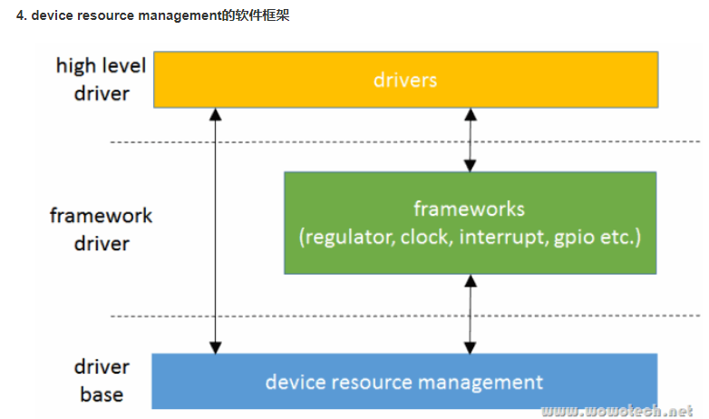

--

在驱动的probe函数里，我们会申请各种资源，要考虑失败的情况，然后要分不同的情况进行资源释放。

传统的做法是很多的goto语句。这样比较麻烦。

所以就又推出了新的devm_xx接口。

这种依托于设备模型。帮我们释放这些资源的释放。

这样出错后，只需要return就好了。不用手动释放资源。

为了保持兼容，这些新接口和旧接口的参数保持一致，只是名字前加了“devm_”，并多加一个struct device指针。

**只需记住一点，driver可以只申请，不释放，设备模型会帮忙释放。**不过如果为了严谨，在driver remove时，可以主动释放（也有相应的接口，这里没有列出）。

常用的接口是这些：

```
//分配内存
void *devm_kzalloc(struct device *dev, size_t size, gfp_t gfp);
//映射io
void __iomem *devm_ioremap_resource(struct device *dev, struct resource *res);
void __iomem *devm_ioremap(struct device *dev, resource_size_t offset, unsigned long size);
//获取clk
struct clk *devm_clk_get(struct device *dev, const char *id);
//获取gpio
int devm_gpio_request(struct device *dev, unsigned gpio, const char *label);
//获取irq
int devm_request_irq(struct device *dev, unsigned int irq, irq_handler_t handler, unsigned long irqflags, const char *devname, void *dev_id);
```

什么是设备资源？

一个设备要能够正常工作，要依赖很多外部条件。

例如：供电、时钟等。

这些外部条件就被叫做设备资源。

对于现代计算机资源，可能的资源包括：

```
power 供电
clock 时钟
memory 
gpio
irq
dma
虚拟地址空间
```

而在Linux内核眼中，资源的定义更加广泛。

例如pwm、rtc、reset。都可以被抽象为资源。

在较早的内核里，系统还不是特别复杂。

而且各个framework还没有成型。

因此大多数的资源都是由各个driver自行维护。

但是，随着系统复杂度的增加。driver之间共用资源的情况越来越多。

同时，电源管理的需要也非常强烈。

所以，内核就把资源的管理权回收。



device resource management位于“drivers/base/devres.c”中，它的实现非常简单，为什么呢？因为资源的种类有很多，表现形式也多种多样，而devres不可能一一知情，也就不能进行具体的分配和回收。

因此，devres能做的（也是它的唯一功能），就是：

**提供一种机制，将系统中某个设备的所有资源，以链表的形式，组织起来，以便在driver detach的时候，自动释放。**

先从struct device开始吧！该结构中有一个名称为“devres_head”的链表头，**用于保存该设备申请的所有资源**

另外，资源的存在形式到底是什么，device resource management并不知情，**因此需要上层模块提供一个release的回调函数，用于release资源**，

不知道您是否注意到，**devres有关的数据结构，是在devres.c中定义的（是C文件哦！）**。换句话说，是对其它模块透明的。这真是优雅的设计（尽量屏蔽细节）！

**零长度数组的英文原名为Arrays of Length Zero，是GNU C的规范**，主要用途是用来作为结构体的最后一个成员，然后用它来访问此结构体对象之后的一段内存（通常是动态分配的内存）。什么意思呢？


参考资料

1、Linux设备模型(9)_device resource management

http://www.wowotech.net/linux_kenrel/device_resource_management.html