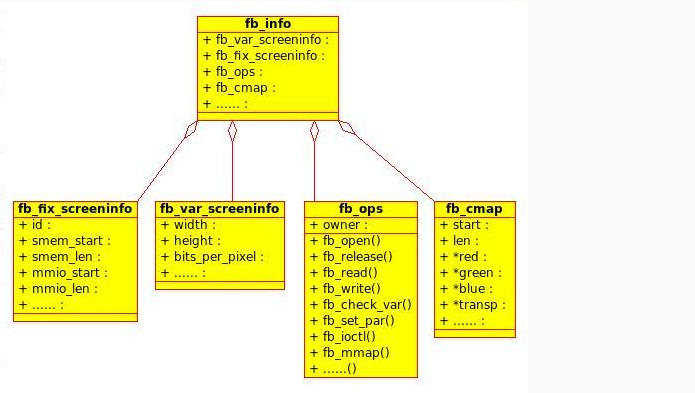

--

# framebuffer介绍

Framebuffer（帧缓冲）是一种在计算机图形中广泛使用的概念，

它代表了一个用于存储和管理图像数据的内存区域。

Framebuffer是Linux图形界面开发中的重要组成部分，

它用于在屏幕上绘制图形、文本和其他可视元素。

以下是一些关于Framebuffer的基本概念和信息：

1. **帧缓冲设备**：在Linux中，帧缓冲通常表示为一个设备文件，通常位于`/dev/fb0`或类似的路径。这个设备文件允许用户空间应用程序直接与屏幕硬件进行交互。

2. **像素数据**：Framebuffer存储了屏幕上每个像素的颜色信息。通常，每个像素由红色、绿色和蓝色通道组成，这被称为RGB颜色模型。帧缓冲还可以支持其他颜色模型，例如RGBA（包括透明度通道）。

3. **分辨率**：Framebuffer有特定的分辨率，它表示了屏幕上可用像素的数量。分辨率通常以水平像素数和垂直像素数表示，例如1920x1080。

4. **深度**：帧缓决定了每个像素的颜色深度，即每个颜色通道的位数。通常，24位颜色深度表示每个颜色通道有8位，允许2^8 = 256个不同的颜色。

5. **双缓冲**：双缓冲是一种技术，允许在后台缓冲区中渲染图像，然后一次性将整个图像切换到前台，以避免屏幕撕裂等问题。

6. **图形绘制**：开发人员可以通过Framebuffer API（通常使用framebuffer设备文件）来绘制图形、文本和其他可视元素。这包括在屏幕上绘制像素和处理用户输入事件。

7. **硬件加速**：某些Linux系统使用图形加速硬件，如GPU（图形处理单元），来提高图形性能。这些系统可以通过硬件加速来加快图形操作。

Framebuffer在Linux系统中通常是一种较低级别的图形界面开发方式，

适用于嵌入式系统、嵌入式Linux设备和类似场景。

在更高级别的Linux桌面环境中，如GNOME或KDE，会有更复杂的窗口管理和桌面环境，

但它们仍然依赖于底层的Framebuffer来与硬件通信。


Framebuffer编程通常需要对硬件和Linux内核有一定的了解，因为它通常直接与底层图形硬件交互。

# framebuffer发展历史

Framebuffer（帧缓冲）的发展历史与计算机图形和显示技术的演进密切相关。以下是Framebuffer的主要发展历史里程碑：

1. **早期计算机**：在早期的计算机系统中，图形显示通常是通过直接控制硬件的方式进行的，没有明确定义的帧缓冲概念。图形显示是基于点阵显示器（Raster CRT）或矢量显示器（Vector CRT）的。

2. **位图显示**：随着计算机技术的发展，出现了能够以位图（bitmap）形式表示图像的显示器，这为图形绘制提供了更大的灵活性。图像数据直接存储在系统的主内存中，并由CPU进行管理和更新。

3. **帧缓冲出现**：随着计算机性能的提升，出现了帧缓冲的概念。帧缓冲是一块专用的内存区域，用于存储图像数据，而不是直接存储在主内存中。这种方式允许更快速地渲染和更新图像，而不必每次都与主内存进行大量的数据传输。

4. **X Window System**：在UNIX和UNIX-like系统中，X Window System（X11）被广泛使用，它引入了分离的图形服务器和客户端模型。X服务器通常使用帧缓冲设备来管理图形显示。这是Linux图形界面的一个重要组成部分。

5. **Linux Framebuffer Subsystem**：Linux引入了Framebuffer子系统，允许开发者通过简单的接口与图形硬件交互。这提供了一种更直接的方式来管理图形显示，而不必依赖于复杂的X服务器或其他桌面环境。

6. **硬件加速**：随着图形硬件的发展，许多现代的图形芯片（GPU）具备硬件加速能力，这允许更复杂的图形操作，并提高了性能。Framebuffer仍然用于与硬件进行通信，但许多图形操作由GPU处理。

7. **Linux图形子系统**：在Linux中，Framebuffer仍然是一种底层的图形界面开发方式，但现代的Linux桌面环境如GNOME、KDE和Wayland等，已经引入了更高级别的图形堆栈和窗口管理器，使图形开发更加高效和用户友好。

总的来说，Framebuffer的发展历史反映了计算机图形和显示技术的演进，从早期的点阵和矢量显示器到现代的帧缓冲设备和GPU加速。在嵌入式系统、嵌入式Linux设备和一些特定的Linux应用中，Framebuffer仍然是一种重要的图形开发方式。

# framebuffer相关的命令

在Linux中，Framebuffer设备通常位于`/dev/fb0`（或其他类似路径），可以使用一些命令和工具与它进行交互和管理。以下是一些与Framebuffer相关的常用命令和工具：

1. **fbset**：`fbset`命令用于显示和配置Framebuffer设备的分辨率、深度和刷新率等参数。您可以使用它来查看和更改Framebuffer的设置。

   例如，要查看Framebuffer的当前设置，可以运行以下命令：

   ```bash
   fbset
   ```

   要更改分辨率，可以运行：

   ```bash
   fbset -xres 1280 -yres 720
   ```

2. **fbv**：`fbv`是一个小型的Framebuffer查看器，可用于查看图像文件（如BMP或JPEG图像）。

   ```bash
   fbv image.jpg
   ```

3. **fbgrab**：`fbgrab`命令用于从Framebuffer中截取屏幕快照，并将其保存为图像文件。您可以指定输出文件的名称和格式。

   ```bash
   fbgrab screenshot.png
   ```

4. **fbi**：`fbi`是一个帧缓冲图像查看器，它允许您在Framebuffer上显示图像文件，可以用于创建简单的幻灯片演示。

   ```bash
   fbi image1.jpg image2.png
   ```

5. **fbcat**：`fbcat`命令可用于将Framebuffer的内容输出到终端，这在某些情况下很有用。

   ```bash
   fbcat > framebuffer.txt
   ```

这些命令可以帮助您与Framebuffer设备进行交互，查看图像内容，更改设置以及在嵌入式系统或嵌入式Linux设备上执行简单的图形操作。请注意，具体的命令和工具可能会因Linux发行版而异，因此在您的系统上可能需要查看相关文档或使用`man`命令来获取更多信息。

# framebuffer的fixinfo

在Linux中，Framebuffer设备的`fixinfo`（fix information）包含有关Framebuffer硬件的不变信息，如固定的属性和特性。这些信息通常存储在Framebuffer设备文件的`/sys/class/graphics/fbX/fixed`中，其中X表示Framebuffer设备的索引号。

以下是`fixinfo`结构中可能包含的一些固定信息：

1. **id**：Framebuffer设备的标识符，通常是一个字符串，表示设备的型号或名称。

2. **smem_start**：帧缓冲内存的起始地址，通常表示存储图像数据的内存区域的物理地址。

3. **smem_len**：帧缓冲内存的总长度，以字节为单位。

4. **type**：帧缓冲设备的类型，通常是一个整数值，表示设备的类型，如LCD显示器或CRT。

5. **visual**：帧缓冲设备的颜色视觉模型，通常是一个整数值，表示颜色深度和颜色组织方式，如RGB565或RGBA8888。

6. **line_length**：每行的像素数据的字节数，通常用于计算图像在内存中的存储布局。

7. **mmio_start**：内存映射IO（MMIO）区域的起始地址，如果设备支持硬件加速等功能，这个区域通常用于与设备进行通信。

8. **mmio_len**：MMIO区域的总长度，以字节为单位。

9. **accel**：帧缓冲设备的加速器类型，如果设备支持硬件加速，这里会指定加速器的类型。

您可以使用`cat`命令或其他文本查看工具来查看`fixinfo`的内容，例如：

```bash
cat /sys/class/graphics/fb0/fixed
```

或者，您可以编写一个小的C程序来读取和解析`fixinfo`的信息。这些信息对于了解Framebuffer设备的硬件属性和特性非常有用，可以帮助您进行基本的图形编程和配置。请注意，具体的`fixinfo`结构可能因Framebuffer设备的硬件和驱动程序而异。

# framebuffer的varinfo

在Linux中，Framebuffer设备的`varinfo`（variable information）包含有关Framebuffer的可变信息，如屏幕分辨率、虚拟分辨率、颜色深度等。这些信息通常存储在Framebuffer设备文件的`/sys/class/graphics/fbX/var`中，其中X表示Framebuffer设备的索引号。

以下是可能包含在`varinfo`结构中的一些可变信息：

1. **xres**：屏幕的水平分辨率，即屏幕的宽度（以像素为单位）。

2. **yres**：屏幕的垂直分辨率，即屏幕的高度（以像素为单位）。

3. **xres_virtual**：虚拟屏幕的水平分辨率，通常用于双缓冲或分屏显示。

4. **yres_virtual**：虚拟屏幕的垂直分辨率，通常用于双缓冲或分屏显示。

5. **bits_per_pixel**：每个像素的颜色深度，通常以位数表示，如16位、24位或32位。

6. **grayscale**：如果屏幕是单色屏幕，该字段会指示屏幕是否支持灰度。

7. **nonstd**：如果屏幕不支持标准分辨率，该字段会指示非标准分辨率的标志。

8. **accel_flags**：与硬件加速相关的标志，表示设备是否支持硬件加速。

9. **pixclock**：像素时钟，表示每个像素的持续时间（以纳秒为单位）。

10. **left_margin**、**right_margin**、**upper_margin**、**lower_margin**：屏幕的上下左右边距，通常与显示时序相关。

这些信息允许您查看和更改Framebuffer的显示属性，例如分辨率和颜色深度。您可以使用`cat`命令或其他文本查看工具来查看`varinfo`的内容，例如：

```bash
cat /sys/class/graphics/fb0/var
```

或者，您可以编写一个小的C程序来读取和解析`varinfo`的信息，以便更灵活地与Framebuffer设备进行交互和配置。请注意，具体的`varinfo`结构可能因Framebuffer设备的硬件和驱动程序而异。

# 其他

framebuffer是从linux2.2版本开始出现在内核里的。

linux是工作在保护模式下，所以用户进程是无法像dos那样使用网卡bios里提供的中断调用来实现直接写屏。

所以linux就抽象出framebuffer这个设备，来用户程序来直接写屏可以实现。

framebuffer本身不会对数据进行处理，就像一个蓄水池一样。


我们可以用fbcat命令来进行截屏操作。

```
sudo cat /dev/fb0 > frame.raw
```

```
teddy@teddy-ubuntu:~$ file frame.raw 
frame.raw: PDP-11 UNIX/RT ldp
```

这个图片要用ffmpeg编码后才能看。我先不管了。


```
-----------fix info-------------
                        id:CLCD FB 
                        smem_start:1730150400
                        smem_len:1572864
                        type:0
                        type_aux:0
                        visual:2
                        xpanstep:0
                        ypanstep:0
                        line_length:0
                        mmio_len:2048
                        accel:4096

--------------------------------
-----------var info-------------
                                                xres:1024
                        yres:768
                        xres_virtual:1024
                        yres_virtual:768
                        xoffset:0
                        yoffset:0
                        bits_per_pixel:16
                        nonstd:0
                        activate:0
                        height:-1
                        width:-1
                        accel_flags:0
                        pixclock:15748
                        left_margin:152
                        right_margin:48
                        upper_margin:23
                        lower_margin:3
                        hsync_len:104
                        vsync_len:4
                        vmode:0
```


帧缓冲（framebuffer）是Linux系统为显示设备提供的一个接口，

它将显示缓冲区抽象，

屏蔽图像硬件的底层差异，

允许上层应用程序在**图形模式**下直接对显示缓冲区进行读写操作。

用户不必关心物理显示缓冲区的具体位置及存放方式，这些都是由帧缓冲设备驱动本身来完成。


framebuffer机制模仿显卡的功能，

将显卡硬件结构抽象为一系列的数据结构，

可以通过对framebuffer的读写直接对显存进行操作。

用户可以将framebuffer看成是显卡的一个映像，

将其映射到进程空间后，就可以直接读写操作，写操作会直接反映在屏幕上。


framebuffer是一个字符设备，主设备号是29，对应于/dev/fb%d设备文件。通常，使用如下方式（数字代表次设备号）

　　0 = /dev/fb0 第一个fb设备

　　1 = /dev/fb1 第二个fb设备

　　fb也是一种普通的内存设备，可以读写其内容。例如，屏幕抓屏：cp /dev/fb0 myfilefb  虽然可以向内存设备（/dev/mem）一样，对其read、write、seek以及mmap。但区别在于fb使用的不是整个内存区。而是显存部分。

 

对于应用程序而言，它和其它的设备并没有什么区别，

用户可以把fb看成是一块内存，既可以向内存中写数据，也可以读数据。

fb的显示缓冲区位于内核空间。

应用程序可以把此空间映射到自己的用户空间，再进行操作。

　　在应用程序中，操作/dev/fbn的一般步骤如下：

　　（1）打开/dev/fbn设备文件。

　　（2）用ioctl()操作取得当前显示屏幕的参数，如屏幕的分辨率、每个像素点的比特数。根据屏幕的参数可计算屏幕缓冲区的大小。

　　（3）用mmap（）函数，将屏幕缓冲区映射到用户空间。

　　（4）映射后就可以直接读/写屏幕缓冲区，进行绘图和图片显示。


framebuffer涉及的数据结构如下：

　　**（1）struct fb_info** 

　　　一个帧缓冲区对应一个struct fb_info结构，它包括了帧缓冲设备的属性和操作的完整集合，每个帧设备都有一个fb_info结构体。

　　**（2）struct fb_ops**

　　　　结构体用来实现对帧缓冲设备的操作，这些函数需要驱动开发人员编写，**
**

　　**（3）struct fb_fix_screeninfo**

　　　  该结构体记录了用户不能修改的固定显示控制器参数。这些固定的参数如缓冲区的物理地址、缓冲区的长度等等。

　　**（4）struct fb_var_screeninfo**

　　　　结构体中存储了用户可以修改的显示器控制参数，例如屏幕分辨率、透明度等等。

　　**（5）struct fb_cmap**

　　　　结构体中记录了颜色板信息，即调色板信息。，用户空间可以通过ioctl()的FBIOGETCMAP和 FBIOPUTCMAP命令读取或设定颜色表。




framebuffer设备在Linux中是以平台设备形式存在的，

fb设备驱动核心层

为上层提供了系统调用，

为底层驱动提供了接口，

核心层的主文件及其功能如下。

　　(1)drivers/video/fbmem.c。

主要任务：1、创建graphics类、注册FB的字符设备驱动、提供register_framebuffer接口给具体framebuffer驱动编写着来注册fb设备的。本文件相对于fb来说，地位和作用和misc.c文件相对于杂散类设备来说一样的，结构和分析方法也是类似的。

　　(2)drivers/video/fbsys.c。

这个文件是处理fb在/sys目录下的一些属性文件的。
　　(3)drivers/video/modedb.c。

这个文件是管理显示模式（譬如VGA、720P等就是显示模式）的
　　(4)drivers/video/fb_notify.c


# 调试工具

fbtest

https://github.com/jumpnow/fbtest


https://www.kernel.org/doc/Documentation/ABI/stable/sysfs-class-backlight


# 参考资料

1、嵌入式Linux通过帧缓存截图

https://www.crifan.com/the_frame_buffer_embedded_linux_screenshot_-_framebuffer_screenshot_in_embedded_linux/

2、linux驱动之framebuffer

https://www.cnblogs.com/gzqblogs/p/10105804.html