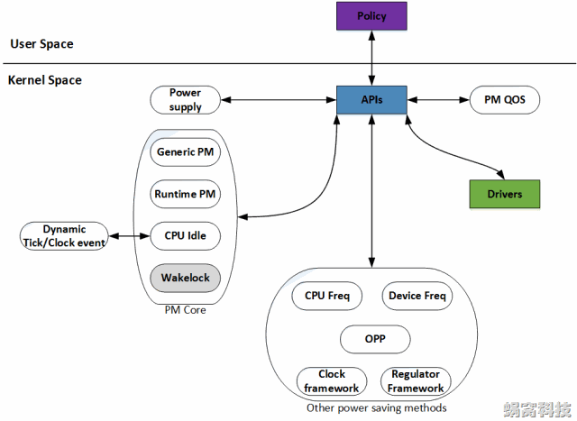

--

# 基本情况

电源管理（Power Management）

在Linux Kernel中，是一个比较庞大的子系统，

涉及到供电（Power Supply）、充电（Charger）、时钟（Clock）、频率（Frequency）、电压（Voltage）、睡眠/唤醒（Suspend/Resume）等方方面面（如下图），

蜗蜗会在Linux电源管理系列文章中，对它们一一讲述。




Framework是一个中间层的软件，提供软件开发的框架。

其目有三：

一是屏蔽具体的实现细节，固定对上的接口，这样可以方便上层软件的开发和维护；

二是尽可能抽象公共逻辑，并在Framework内实现，以提高重用性、减少开发量；

三是向下层提供一系列的回调函数（callback function），下层软件可能面对差别较大的现实，但只要填充这些回调函数，即可完成所有逻辑，减小了开发的难度。


- Power Supply，是一个供用户空间程序监控系统的供电状态（电池供电、USB供电、AC供电等等）的class。通俗的讲，它是一个Battery&Charger驱动的Framework
- Clock Framework，Clock驱动的Framework，用于统一管理系统的时钟资源
- Regulator Framework，Voltage/Current Regulator驱动的Framework。该驱动用于调节CPU等模块的电压和电流值
- Dynamic Tick/Clock Event，在传统的Linux Kernel中，系统Tick是固定周期（如10ms）的，因此每隔一个Tick，就会产生一个Timer中断。**这会唤醒处于Idle或者Sleep状态的CPU，而很多时候这种唤醒是没有意义的。**因此新的Kernel就提出了Dynamic Tick的概念，Tick不再是周期性的，而是根据系统中定时器的情况，不规律的产生，这样可以减少很多无用的Timer中断
- CPU Idle，用于控制CPU Idle状态的Framework
- **Generic PM，传统意义上的Power Management，如Power Off、Suspend to RAM、Suspend to Disk、Hibernate等**
- Runtime PM and Wakelock，运行时的Power Management，不再需要用户程序的干涉，由Kernel统一调度，实时的关闭或打开设备，以便在使用性能和省电性能之间找到最佳的平衡 
  注3：Runtime PM是Linux Kernel亲生的运行时电源管理机制，Wakelock是由Android提出的机制。这两种机制的目的是一样的，因此只需要支持一种即可。另外，**由于Wakelock机制路子太野了，饱受Linux社区的鄙视，因此我们不会对该机制进行太多的描述。**
- CPU Freq/Device Freq，用于实现CPU以及Device频率调整的Framework
- OPP（Operating Performance Point），是指可以使SOCs或者Devices正常工作的电压和频率组合。内核提供这一个Layer，是为了在众多的电压和频率组合中，筛选出一些相对固定的组合，从而使事情变得更为简单一些
- PM QOS，所谓的PM QOS，是指系统在指定的运行状态下（不同电压、频率，不同模式之间切换，等等）的工作质量，包括latency、timeout、throughput三个参数，单位分别为us、us和kb/s。通过QOS参数，可以分析、改善系统的性能

# 从实际使用出发

现在要对ad82128进行功耗优化。

regulator_bulk_data搜索这个结构体

Regulator，中文名翻译为“稳定器”，在电子工程中，是voltage regulator（稳压器）或者current regulator（稳流器）的简称，指可以自动维持恒定电压（或电流）的装置。

voltage regulator最早应用于功放电路中，主要用于滤除电源纹波（100或者120Hz）和噪声，以及避免“输出电压随负载的变化而变化”的情况。后来，随着IC级别的regulator的出现（便宜了），voltage regulator几乎存在于任何的电子设备中。例如我们常见的嵌入式设备中，基本上每一种电压，都是经过regulator输出的。


linux/suspend.h

```
#define PM_SUSPEND_ON		((__force suspend_state_t) 0)
#define PM_SUSPEND_FREEZE	((__force suspend_state_t) 1)
#define PM_SUSPEND_STANDBY	((__force suspend_state_t) 2)
#define PM_SUSPEND_MEM		((__force suspend_state_t) 3)
#define PM_SUSPEND_MIN		PM_SUSPEND_FREEZE
#define PM_SUSPEND_MAX		((__force suspend_state_t) 4)
```

# STR模式

Linux内核支持多种类型睡眠状态，目前存在四种模式：suspend to idle（freeze）、power-on standby（standb）、suspend to ram（memory；STR）和suspend to disk（hibernate），分别对应ACPI状态的S0、S1、S3和S4状态。


挂起到内存，简称待机。

计算机将目前的运行状态等数据存放在内存，关闭硬 盘、外设等设备，进入等待状态。

此时内存仍然需要电力维持其数据，但整机耗电很少。

恢复时计算机从内存读出数据，回到挂起前的状态，恢复速度较快。

**对 DDR的耗电情况进行优化是S3性能的关键**，大多数手持设备都是用S3待机。

此状态下计算机会冻结所有的活动并将当前工作状态保存到RAM中，

然后关闭屏幕进入低功耗模式，通常睡眠和唤醒需要几秒。

此状态使所有的设备进入低功耗状态，仅保留RAM自刷新。

所有的设备和系统状态都保存在RAM中，所有外设被挂起。


对/sys/power/state写入不同字符串，可以让系统进入不同睡眠状态。

针对state sysfs节点的写入，最终会进入到state_store这个函数，将字符串转换成上表中不同状态。

# STD模式

Suspend to Disk也常被叫做Hibernation(休眠)，

为了达到省电与快速开机的trade off，Hibernation经常被应用到Laptop和移动终端上。

其常用的实现方法为SWSUSP([swap](https://so.csdn.net/so/search?q=swap&spm=1001.2101.3001.7020) suspend)。


```
echo "freeze" > /sys/power/state

echo "standby" > /sys/power/state

echo "mem" > /sys/power/state
```

```
const char *pm_labels[] = { "mem", "standby", "freeze", NULL };
```

如果是freeze，无需平台代码参与即可支持，直接返回true。

对于standby和mem，则需要调用suspend_ops的valid回掉，由底层平台代码判断是否支持。 


# vt switch

通常情况下，系统控制台模块（drivers\tty\vt\）会在suspend的过程中，

重新分配一个console，并将控制台切换到该console上。

然后在resume时，切换回旧的console。

这就是VT switch功能。

VT switch是很耗时的


# PM notifier

PM notifier是基于内核blocking notifier功能实现的。

blocking notifier提供了一种kernel内部的消息通知机制，

消息接受者通过notifier注册的方式，注册一个回调函数，关注消息发送者发出的notifier。

当消息产生时，消息产生者通过调用回调函数的形式，通知消息接受者。

这种调用，是可以被阻塞的，因此称作blocking notifier。

那suspend功能为什么使用notifier呢？原因可能有多种，这里我举一个例子，这是我们日常开发中可能会遇到的。

由之前的描述可知，suspend过程中，suspend device发生在进程被freeze之后，resume device发生在进程被恢复之前。

原来PM notifier是在设备模型的框架外，

开了一个后门，

那些比较特殊的driver，

可以绕过设备模型，

直接接收PM发送的suspend信息，

以便执行自身的suspend动作。

特别是resume时，可以在其它进程都正好工作的时候，只让suspend进程等待driver的resume。

对Linux驱动工程师来说，

device PM ops和platform PM ops就是电源管理（suspend）的全部，

只要在合适的地方，实现合适的回调函数，

即可实现系统的电源管理。

但现实太复杂了，以至于kernel提供的这两个数据结构也很复杂，再回忆一下


虽然内核的注释已经相当详细了，

但我们一定会犯晕，到底该实现哪些回调？

这些回调的应用场景又是什么？

蜗蜗以为，要熟练使用这些回调，唯一的方法就是多coding、多理解。

除此之外，我们可以总结一下在电源状态切换时，这些回调的调用时机，从侧面帮助理解。

如下（只介绍和suspend功能有关的，struct dev_pm_ops简称D，struct platform_suspend_ops简称P）：


在美好的旧时光里，suspend大多用于热关机，

因此同步问题的影响并不突出(因为操作并不频繁)。

但来到新时代之后，事情变了，Android竟然用suspend作日常的待机（操作就相当频繁了），

这时问题就大了。

那怎么解决呢？

得靠system wakeup framework，

也就是suspend过程中所调用的pm_wakeup_pending接口所在的模块。

我会在下一篇文章中继续该模块的分析，这里就不再继续了。


所谓的PM Domain（电源域），是针对“device”来说的。

bus_type、device_driver、class、device_type等结构，

本质上代表的是设备驱动，电源管理的操作，由设备驱动负责，是理所应当的。

但在内核中，由于各种原因，**是允许没有driver的device存在的，**

那么怎么处理这些设备的电源管理呢？

就是通过设备的电源域实现的。


# syscore

syscore_suspend/syscore_resume 在系统的suspend/resume 中被调用，

syscore_shutdown 在系统关机或者重启时被调用，

对模块的工程师来说，知道它们会被调用就行了，

如果是负责suspend/resume/shutdown/reboot，需要了解它们什么时候会被调用。

个人感觉可把一些重要的、需要晚于device进行suspend或者shutdown的动作，放到syscore中；

或者把需要早于device进行resume的动作，放到syscore中。


syscore作为低功耗流程的一部分，

其涉及的文件主要有syscore_ops.h和syscore.c，

这一级别的回调函数是在完全屏蔽中断的场景下进行的。

# Linux设备驱动suspend/resume的顺序

Linux在进入suspend的时候，

**会首先freeze userspace，**

然后挨个去调用设备驱动程序的suspend，

最后调用architecture dependent的callback（非常奔放的描述了，其实有大量的细节问题存在）。

Resume就是反过来执行一遍，最后重新enable userspace。

那么作为设备驱动程序的编写者来说，

**主要就是要实现本驱动的suspend/resume逻辑。**

但是事实上，很多设备之间是有依赖性的，

比如在ARM上，很多设备在resume之前，要求 `IOMMU` 要已经被enable，否则硬件上就会出现问题，因为访问的地址不对了。

那么Linux是如何设计/定义各个设备驱动之间的suspend/resume的顺序的呢？

简单来说，就是以下几条逻辑：


各设备驱动程序按照其对应的设备（device）注册的先后次序，

来决定其suspend/resume的顺序。

注意是该驱动对应的设备的注册顺序，不是驱动注册的顺序，

所以和驱动的注册优先级无关（也就是和module_init, rootfs_init, subsys_initcall这些无关）。

越早被注册的设备，其对应的驱动的suspend越晚被调用，其对应驱动的resume越早被调用；

越晚被注册的设备，其对应的驱动的suspend越早被调用，其对应的驱动的resume越晚被调用。


上面所说的逻辑往往不能满足我们的要求，

因为现在的设备（device）都通过DT（Device Tree）的方式进行注册。

那么，在DTS文件中，出现的越早的设备就越早被注册（可以参考函数 `of_platform_populate`）。

而按照现在upstream linux kernel的约定，

**设备在DTS文件中，是按照其寄存器的地址，从低到高排序的，**

所以自然不可能满足我们的需求。


那要怎么办？答案是驱动程序执行probe的时候返回 `-EPROBE_DEFER` 。

对于现在ARM SoC上的设备和其驱动程序来说，

Linux kernel都使用Platform device/Platform driver来描述他们。

而Platform driver的probe函数就相当于是驱动的初始化函数，

一般用来映射寄存器，分配必需的内存等等，看一个驱动程序的代码，一般也可以从Probe开始看起。


Probe函数返回 `-EPROBE_DEFER`，

指的是当一个设备驱动程序检测到其依赖的设备的驱动程序还没有ready的时候，返回这个出错码告诉kernel driver framework，我需要延缓自身的probe。

还是举上面那个IOMMU的例子，如果一个设备依赖IOMMU，那么该设备的驱动在probe的时候，就应该检测iommu的驱动是否已经ready，如果没有那就要defer自己的probe。

在Linux kernel driver framework中，收到驱动probe返回 `-EPROBE_DEFER`，

就会将该驱动放入一个list中，

一个workqueue来负责遍历这个list，

从而再次执行这些驱动的probe函数（事实上，由于kernel driver framework不知道驱动互相之间的依赖关系，所以一旦有一个驱动成功probe了，kernel都会触发这个workqueue，让其去遍历一遍list）。

# regulator框架

Linux Regulator Framework分为四个部分，

分别是machine，regulator，consumer，sys-class-regulator。

machine可以理解为regulator在板级的硬件配置，使用regulator_init_data结构体代表regulator板级的配置。

而regulator板级的配置，也可以称为约束，定义在regulation_constraints结构中。


PMIC /生产者 驱动接口
生产者是产生调节电压或电流的设备。这种设备的名称是PMIC，它可以用于功率排序、电池管理、dc - dc转换或简单的电源开关(开/关)。它通过软件控制，从输入功率调节输出功率。

它处理调节器驱动程序，特别是生产者PMIC端，这需要几个头文件：

```
#include <linux/platform_device.h>
#include <linux/regulator/driver.h>
#include <linux/regulator/of_regulator.h>
```

内核通过一个 struct regulator_desc 结构来描述PMIC提供的每个调节器，

该结构描述了调节器的特征。

所谓调节器，我指的是任何独立的调节输出。

例如，Intersil 的ISL6271A是一个具有三个独立调节输出的PMIC。

然后在其驱动程序中应该有三个 regulator_desc 实例。

这个结构包含了调节器的固定属性，如下所示:


参考资料

1、

https://www.cnblogs.com/debruyne/p/9139386.html

2、**Regulator 框架(一)： PMIC /生产者 驱动接口**

https://blog.51cto.com/u_15127528/4279742

3、Linux Regulator Framework(1)_概述

http://www.wowotech.net/pm_subsystem/regulator_framework_overview.html

4、

https://blog.csdn.net/u014674293/article/details/113866110

5、

https://blog.csdn.net/Chihiro_S/article/details/123815812

# amlogic功耗管理

kernel这3个配置项。

```
CONFIG_AMLOGIC_SUSPEND=y
CONFIG_AMLOGIC_GX_SUSPEND=y
CONFIG_AMLOGIC_LEGACY_EARLY_SUSPEND=y
```


```
# cat /sys/kernel/debug/regulator/regulator_summary
 regulator                      use open bypass  opmode voltage current     min     max
---------------------------------------------------------------------------------------
 regulator-dummy                  4    3      0 unknown     0mV     0mA     0mV     0mV 
    fe026000.saradc               1                                 0mA     0mV     0mV
    vddcpu0                       1    2      0 unknown   769mV     0mA   689mV  1049mV 
       cpu0                       0                                 0mA   769mV  1049mV
       cpu0                       0                                 0mA     0mV     0mV
    vddee                         1    0      0 unknown   901mV     0mA   701mV   901mV 
 DC_12V                           5    3      0 unknown 12000mV     0mA 12000mV 12000mV 
    12V                           4    2      0 unknown 12000mV     0mA 12000mV 12000mV 
       VDDQ                       1    0      0 unknown  1200mV     0mA  1200mV  1200mV 
       VDDAO_3V3                  6    5      0 unknown  3300mV     0mA  3300mV  3300mV 
          VDDAO_1V8               1    0      0 unknown  1800mV     0mA  1800mV  1800mV 
          VDDIO_3V3               5    5      0 unknown  3300mV     0mA  3300mV  3300mV 
             fe330000.audiobus:pdm   1                                 0mA     0mV     0mV
             fe330000.audiobus:spdif@0   1                                 0mA     0mV     0mV
             fe330000.audiobus:tdm@2   1                                 0mA     0mV     0mV
             fe330000.audiobus:tdm@1   1                                 0mA     0mV     0mV
             fe330000.audiobus:tdm@0   1                                 0mA     0mV     0mV
          VDDIO_X                 1    0      0 unknown  3300mV     0mA  3300mV  3300mV 
          SD_3V3                  1    0      0 unknown  3300mV     0mA  3300mV  3300mV 
          VDD_DSOFF_1V8           1    0      0 unknown  1800mV     0mA  1800mV  1800mV 
    VDD3V3_AO_RTC                 2    1      0 unknown  3300mV     0mA  3300mV  3300mV 
       AVDD_AO18_RTC-VDD1V8_AO_RTC   1    0      0 unknown  1800mV     0mA  1800mV  1800mV 
    VCC5V                         5    5      0 unknown  5000mV     0mA  5000mV  5000mV 
       fe330000.audiobus:pdm      1                                 0mA     0mV     0mV
       fe330000.audiobus:spdif@0   1                                 0mA     0mV     0mV
       fe330000.audiobus:tdm@2    1                                 0mA     0mV     0mV
       fe330000.audiobus:tdm@1    1                                 0mA     0mV     0mV
       fe330000.audiobus:tdm@0    1                                 0mA     0mV     0mV
```

以ba400为例，看懂里面的各个电压的具体内涵。

12V这个是系统的供电电源。一直都在的，不受软件控制。

```
	dc_12v: fixedregulator0 {
		compatible = "regulator-fixed";
		regulator-name = "DC_12V";
		regulator-min-microvolt = <12000000>;
		regulator-max-microvolt = <12000000>;
		regulator-boot-on;
		regulator-always-on;
	};
```

VCC5V，这个电压连接到外部的D622板子、spdif接口、usb host和usb otg这4个东西。

**VDD_CPU**，这个电压也是一直打开的。不受软件控制。

VDD_EE，跟VDD-CPU是连接在一起的。本质是同一个。

VDDQ，一般表示差分电路用的电压输入。


```
VCC : 双极性晶体管供应正电压

VDD: 场效应型晶体管的供应正电压

VEE：双极性晶体管的负供应电压

VSS：场效应晶体管的负供应电压
```


参考资料

1、

https://confluence.amlogic.com/pages/viewpage.action?pageId=188634730

2、

https://blog.csdn.net/m0_63737690/article/details/125482229

3、VDD等电压名字的含义

https://blog.csdn.net/juxianliyu/article/details/43533499

# android待机功耗


飞行模式底电流正常是所有功耗问题的前置条件，

此时`wifi 、Bluetooth、Location、Radio` 都处于关闭状态。


查看`CPU`是否进入`suspend `状态， `suspend `确切的说是 `MCU （ARM）`的`suspend `, 也是`CPU` 进入WFI（Wait For Interrupt）状态，`CPU` 进入`WFI`后，整个系统就依靠一颗 **SCP：SPM（System Power Manager）** 来控制 **睡眠/唤醒** 的流程


`Audio playback` 时候`MTK `低端平台没有专门的`audio DSP（Heilo X20除外）`，故无法在`suspend `状态下完成`audio playback`，故需要`CPU` 做这件事情。

通话的时候之所以可以睡眠，是疑问`modem` 充当了`dsp`的角色。


手机所有亮屏的场景都是模块自身的耗电跟`Display` 部分耗电的叠加，所以`Display` 的功耗在整个系统中占比非常高。
`Display` 功耗 = 硬件+平台+内容


## 按下电源键锁屏后发生了什么


## 手机测试功耗的方法

### 测试前的准备

**测试功耗数据之前，请先确认以下配置：**

- 1.关闭` WIFI/BT/GPS`，关闭数据连接，设置飞行模式。 （根据具体测试场景设置）
- 2.关闭 `mobile log/modem log/net log`，打开`LOG`会增加电流。注意：确认` /sdcard/mtklog （/data/mtklog）` 中是否有` LOG `生成，确定关闭成功。
- 3.确认各个模块是否已经正常工作，各个模块都会影响功耗，需要在模块工作 OK 之后再测试功耗问题。
- 4.测试将所有第三方 `APK `删除，排除第三方` APK` 问题。

### 飞行模式

**测试步骤：**

- 1.设置飞行模式，关闭`WIFI/BT/GPS`，关闭数据连接
- 2.关闭`mobile log、modem log、net log`
- 3.按`power `键灭屏，灭屏`5`分钟后，开始测试电流，测试时间`5 ~ 10`分钟

### 单sim卡待机

**测试步骤：**

- 1.关闭`WIFI/BT/GPS`，关闭数据连接
- 2.关闭`mobile log、modem log、net log`
- 3.按`power `键灭屏，灭屏`5`分钟后，开始测试电流，测试时间`5 ~ 10`分钟


## android电源管理


## 参考资料

1、

https://segmentfault.com/a/1190000024546448

2、

https://blog.csdn.net/feelabclihu/article/details/118227951

3、

https://segmentfault.com/a/1190000024546990

4、android官方文档

https://source.android.com/docs/core/power?hl=zh-cn

# 参考资料

1、Linux功耗管理（1）_整体架构

http://www.wowotech.net/pm_subsystem/pm_architecture.html

wowotech pm总目录在这里，涉及43篇文章。所以这个话题是很复杂的。

http://www.wowotech.net/sort/pm_subsystem/page/5

2、

https://blog.csdn.net/weixin_37571125/article/details/77750145

3、Linux内核Power_Management之suspend详解（一）

https://blog.csdn.net/weixin_42749767/article/details/83374105

Linux内核Power_Management之suspend to disk(STD)详解（二）

https://blog.csdn.net/weixin_42749767/article/details/85318445

4、syscore

这篇文章后面有讲解suspend的顺序问题，是我关心的。

https://blog.csdn.net/adaptiver/article/details/52013245