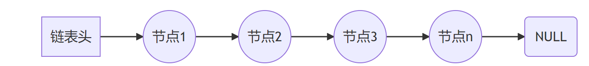
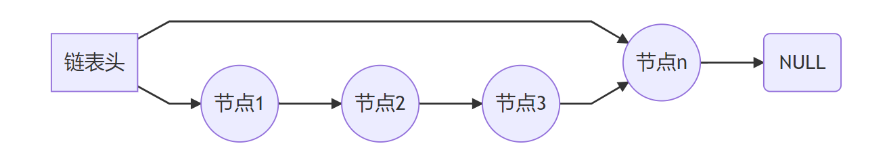
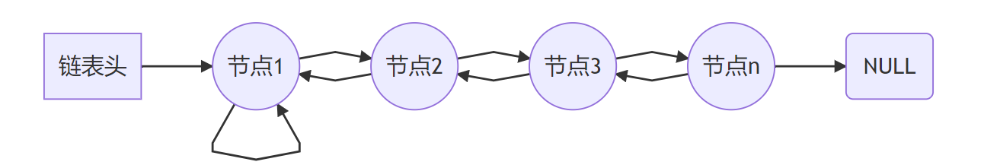
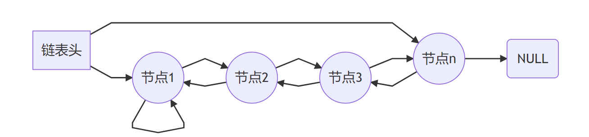
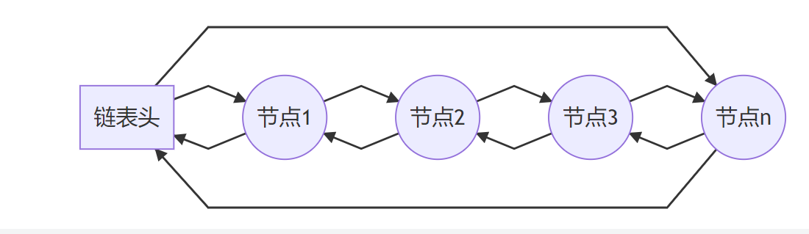

在内核里，我们一般看到的就是struct list_head这种链表。是双向循环链表，实现简单，功能强大。

但是在内核里，还存在着其他两种重要的链表。我们现在就分析一下。

另外两种链表，一种是struct hlist。h代表的是hash。这种实现上有点绕。大家都不太习惯。

另外一种是klist。

klist也是为了适应某种特殊的情形。主要用在设备驱动模型里。为了适应动态变化的驱动和设备，而专门设计的。


C语言不像C++语言可以使用STL，在编程中需要用到链表时，

通常需要程序员重新设计链表的结构体。

不统一的编程规范会增加代码的阅读难度，而且链表的正确性需要验证。

头文件queue.h为C语言中的链表提供了更加标准规范的编程接口。

如今的版本多为伯克利加州大学1994年8月的8.5版本。

queue.h 在 Linux 系统中的路径是 **[/usr/include/x86_64-linux-gnu/sys/queue.h](https://code.woboq.org/userspace/glibc/misc/sys/queue.h.html)** 。更多资料可以查阅 manual 手册的[queue(3)](http://man7.org/linux/man-pages//man3/SLIST_ENTRY.3.html) 。


queue 分为 SLIST、LIST、STAILQ、TAILQ、CIRCLEQ ，

不同的链表有着不同的功能支持。

queue 的所有源码都是宏定义，因此完全包含于queue.h当中，无需编译为库文件。

swupdate\include\swupdate.h

这里有对queue.h的大量使用。

都是这样用的：

```
struct hw_type {
	char boardname[SWUPDATE_GENERAL_STRING_SIZE];
	char revision[SWUPDATE_GENERAL_STRING_SIZE];
	LIST_ENTRY(hw_type) next;//这里放个entry
};

LIST_HEAD(hwlist, hw_type);//这里在定义一个链表类型。
```


每种结构都支持基本的操作：

1. 在链表头插入节点
2. 在任意的节点后插入节点
3. 移除链表头后的节点
4. 前向迭代遍历链表

# SLIST

SLIST 是Singly-linked List 的缩写，意为单向无尾链表。



SLIST 是最简单的结构，它适合数据量非常大而几乎不需要删除数据的场合，又或者当做堆栈使用。

# STAILQ

STAILQ 是 Singly-linked Tail queue 的缩写，意为单向有尾链表。有尾链表可作队列使用。



有尾链表虽然为一些尾部操作提供了便捷的操作，但是可执行文件比无尾链表增加了约15%的大小，且牺牲了约20%的执行速度。


# LIST

LIST是双向无尾链表。



双向链表有前向的指针，因此可以执行一些前向操作，而且无需遍历链表便可以删除一些节点。

# TAILQ

TAILQ 是 Tail queue 的缩写，意为双向有尾链表。有尾链表可作队列使用。



双向有尾链表兼具了双向链表和有尾链表的特点。

# CIRCLEQ

CIRCLEQ 是 Circular queue 的缩写，意为循环链表。




# 例程

本例程展示了单向无尾链表的创建、插入、读取、删除、迭代、销毁等操作。并使用了归并排序对链表实现排序。


**内核的链表实现是一个通用链表**，list_head结构是内嵌在数据结构里的链表，具体的实现方式，有很多的参考文献，你可以查阅。

而glibc的链表是通过宏来定义的一个**传统**的链表，是一个具体的链表结构，如下


这是一个很实用的头文件，因为这个头文件里全是宏定义操作，所以其不仅可以使用在Linux/嵌入式Linux项目中，也可以使用在单片机项目中，我也是因为在我们的单片机项目中看到，才知道有这么一个头文件的。我觉得挺实用的，与大家分享。


# 参考资料

1、linux内核部件分析（四）——更强的链表klist

https://blog.csdn.net/qb_2008/article/details/6845854

2、Linux内嵌链表（sys/queue.h）详解

https://blog.csdn.net/tissar/article/details/86978743

3、sys/queue.h中的list结构和linux/list.h中的hlist结构是一样的吗？

https://www.zhihu.com/question/68043995/answer/267575476

4、

这个思维导图画的可以。

https://zhuanlan.zhihu.com/p/484250443