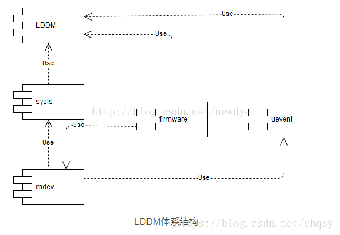
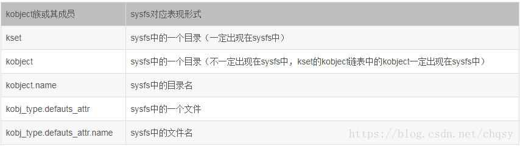

1



LDDM就是设备模型。

mdev使用sysfs。sysfs使用了设备模型。

mdev使用了uevent。uevent也使用了设备模型。


在Linux内核里，有超过一半的代码都是驱动代码。

为了降低设备多样性带来的Linux驱动开发复杂度。以及处理设备热插拔、电源管理等功能。

在这样的背景下，Linux内核提出了设备模型的概念。

设备模型把硬件进行归纳分类，然后抽象出一套标准的数据结构和接口。

然后驱动的开发，就被简化为对内核规定的数据结构的填充和实现。


内核通过设备模型实现下面的目的：

1、电源管理。

2、驱动与用户空间的通信。

3、热插拔。

4、设备类型。

5、对象生命周期管理。


抽象出来的概念有：

1、bus。总线是cpu跟设备之间通信的通道。

2、class。分类。

3、device。抽象硬件设备，有从属的bus、class等属性。

4、driver。设备驱动。写驱动代码，主要是这个。


Linux驱动设备模型的核心思想是：

1、用device和device driver这2个数据结构。**分别从“有什么用”和“怎么用”这2个角度来描述硬件设备。**

这样就统一了设备驱动的格式化，把驱动开发从论述题变成了填空题。

2、同样使用device 和device driver这2个数据结构，实现热插拔。

对于大多数热插拔设备来说，他们的驱动一直在内核里，当设备没有插入的时候，device结构体是不存在的。

**当设备插入时，内核就会创建对应的device结构体，执行对应driver的probe函数。**

3、通过bus、device的树状结构，解决设备之间的依赖。而这种依赖对于开关机，电源管理非常重要。

4、使用class 结构，在设备模型中引入面向对象的概念，这样可以最大限度地抽象共性，减少重复劳动。





# sysfs与普通文件系统的关系

**sysfs中的目录和文件与kobject和attribute对应，而普通文件系统是file和inode。**

sysfs在上层也是通过普通的read()，write()等系统调用进行操作的，那么需要将file_operations转换成最终的show()/store()。

怎么转？因为属性都是属于kobject的，**所以最后的读写肯定与kobject有关，**先从kobject找找线索，看前面kobject有个属性——sd，kernfs_node数据结构，是kobject在sysfs的表示。

我们从分析这个核心数据结构入手。


那么file如何转换成kernfs_node的呢，类比一下，普通文件有file和inode，

这里kernfs_node应该是相当于inode，那还应该有代表文件的结构与之对应，没错，是有这个结构。

这个结构是什么，不妨先在kernfs_node中找线索。既然我们的研究对象是属性，那就看看联合里的attr对应的数据结构。


#kobject

1、kobject被包含在其他的结构体里使用，其他结构体最多包含一个kobject在里面，不要多包含。多了就有问题的。kobject可以理解为一个抽象基类。

2、ktype控制了kobject被创建和销毁时的行为。

3、kset里包含了一组kobject，这些kobject可以是一种ktype，也可以是多种ktype。

4、通常在/sys目录下同一个子目录的，是属于同一个kset的。


下面采用从底向上的方式来讲解整个系统。

##kobject_init

这个函数2个参数，一个是kobject，一个是ktype。

这个函数在内核里是比较底层的，所以被直接调用到的地方并不多。

典型的几个地方是：

```
char_dev.c里
	kobject_init(&p->kobj, &ktype_cdev_dynamic);
	kobject_init(&cdev->kobj, &ktype_cdev_default);
drivers/base/core.c里。
	kobject_init(&dev->kobj, &device_ktype);
	kobject_init(&dir->kobj, &class_dir_ktype);
slub.c里
	kobject_init(&s->kobj, &slab_ktype);
```

看device_ktype和class_dir_ktype

```
static struct kobj_type device_ktype = {
	.release	= device_release,
	.sysfs_ops	= &dev_sysfs_ops,
	.namespace	= device_namespace,
};
static struct kobj_type class_dir_ktype = {
	.release	= class_dir_release,
	.sysfs_ops	= &kobj_sysfs_ops,
	.child_ns_type	= class_dir_child_ns_type
};
```

## kobject_add

这个函数的作用是把kobject和sysfs进行关联。

设置了parent（就建立了目录层级关系）

设置了name（就是定义了文件名）。

如果一个kobject跟一个kset有关联，那么就应该在kobject_add之前关联起来。而且应该在调用kobject_add的时候，把parent传递为NULL，这样，parent就会自动变成kset的。

一般名字定了，就别去改了。

还有一个函数，叫kobject_init_and_add。名字很直观了。


##kobject_uevent

当一个kobject被add了，你需要广播一下这个消息，这个事情是靠kobject_uevent来完成的。

这个函数可以广播kobject的各种变动情况。

例如在device_add函数里。

```
device_add
	error = kobject_add(&dev->kobj, dev->kobj.parent, NULL);
	...
	kobject_uevent(&dev->kobj, KOBJ_ADD);
```


## 引用计数

用kobject_get和kobject_put来对引用计数进行加减。

kobject_init的时候，ref被赋值为1 。


**kobject是动态的，不要定义静态的kobject。也不要定义局部变量的kobject。因为会去释放对应的内存。**

对于你自己写一些内核相关的代码，**如果你只是要用引用计数，你可以用struct kref来做。**


##单独使用kobject的情景

很多时候，你只是向要在/sys目录下新建一个目录而已，你不想关注show、store函数这些细节。

这时，你可以单独把kobject的接口拉出来用。

一般是用这个接口：

```
struct kobject *kobject_create_and_add(char *name, struct kobject *parent);
```

这个含就可以在parent对应目录下建立一个目录了。给NULL，就是在/sys目录下。

sysfs也提供了2个简单的接口给你用。

```
int sysfs_create_file(struct kobject *kobj, struct attribute *attr);
int sysfs_create_group(struct kobject *kobj, struct attribute_group *grp);
```

对应的示例程序在samples/kobject/kobject-example.c里。


# kset

kset提供了这些功能：

1、用来追踪一组类似的设备。例如所有的块设备。

2、一个kset也是sys目录下的一个子目录。kset里包含了一个kobject，它下面的内容的parent就是指向了这个kobject。

/sys目录下的这一层的block等目录就都是kset造出来的。

**3、kset可以支持热插拔。**


用面向对象的术语来说的话，kset就是一个容器类。

kset因为包含了kobject，所以也应该是动态分配的。

创建是：

```
struct kset * kset_create_and_add(char *name, struct kset_uevent_ops *u, struct kobject *parent);
```

销毁：

```
void kset_unregister(struct kset *kset);
```

创建kset的地方有：

```
driver_init
	buses_init
		bus_kset = kset_create_and_add("bus", &bus_uevent_ops, NULL);
		//这就相当于创建了/sys/bus目录了。
		
```

# 看samples里的这里

我看了，有了这样的理解。

1、kobject和kset都是sys目录下的目录。

2、那么sys下面的文件对什么结构体呢？就是kobj_attribute了。

文件实际上对于了内核里的一个int数据。

cat  xxx的时候，就是读取这个int变量的值打印出来。

echo 1>  xxx的时候，就是改变这个int变量的值。

这样就实现了用户态跟内核的通信了。

3、一个kobj_attribute只有个属性，一个是name，就对应了文件的名字。

一个是mode，文件的可读可写性。


# uevent

**uevent的机制是比较简单的，**设备模型中任何设备有事件需要上报时，会触发uevent提供的接口。

uevent模块准备好上报事件的格式后，可以通过两个途径把事件上报到用户空间：

一种是通过kmod模块，直接调用用户空间的可执行文件；

另一种是通过netlink通信机制，将事件从内核空间传递给用户空间。

其中，netlink是一种socket，专门用来进行内核空间和用户空间的通信；**其中，netlink是一种socket，专门用来进行内核空间和用户空间的通信；kmod是管理内核模块的工具集，类似busybox，我们熟悉的lsmod，insmod等是指向kmod的链接。**


udev和mdev都依赖uevent机制，个人理解，udev使用netlink机制，mdev使用kmod机制。在分析kobj_uevent_env的argv成员是已经提到了，kmod最终会调用用户程序，即uevent_helper处理uevent消息，mdev实际就是uevent_helper程序。通过：

echo /sbin/mdev > /sys/kernel/uevent_helper

实现使用使用mdev处理uevent的目的（有的资料说是将mdev加到/proc/sys/kernel/hotplug_helper，其实这两个是一样的，前面说过/sys改进了/proc，所以新的系统应该优先使用/sys）。


参考资料

1、linux设备驱动模型架构分析 一

这个系列文章非常好。一共6篇文章。

https://blog.csdn.net/chqsy/article/details/80912481