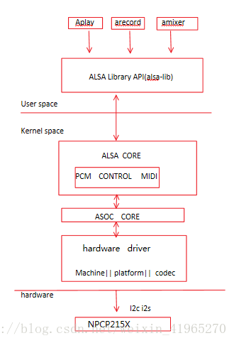
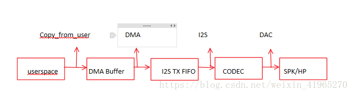
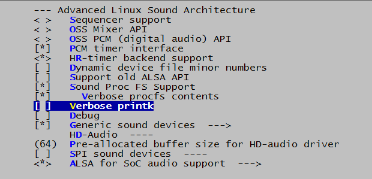
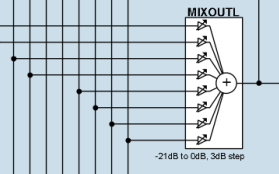
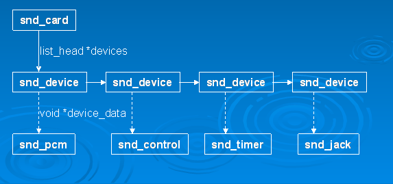
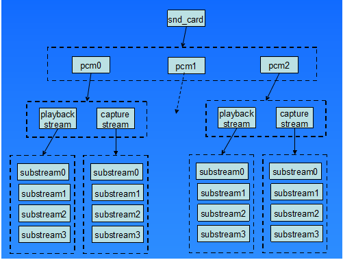
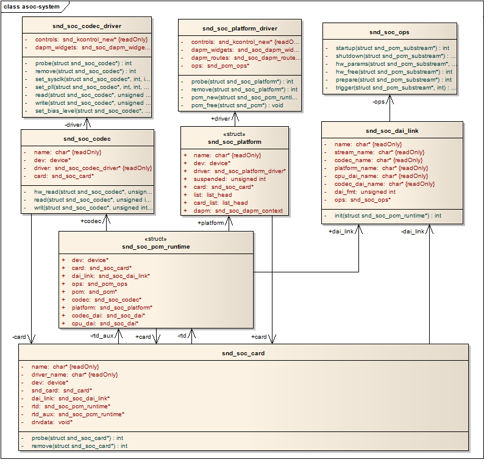

--

目前Linux中主流的音频体系结构是alsa。

alsa在驱动层提供了alsa-driver，在应用层提供了alsa-lib。

在Android里，没有使用标准的alsa，而是使用了简化版本的tinyalsa。但是在内核中仍然使用ALSA框架的驱动框架。

Android中使用tinyalsa控制管理所有模式的音频通路。




4.1 Platform

           指某款soc平台的音频模块，比如qcom,omap,amlogic,atml等等。platform又可细分为二个部分：

cpu dai:

在嵌入式系统里面通常指soc的i2s,pcm总线控制器，

负责把音频数据从I2S tx FIFO搬运到codec(playback,capture则相反)。

cpu_dai通过 snd_soc_register_dai()来注册。

注：

DAI是Digital Audio Interface的简称，

分为cpu_dai和codec_dai,这两者通过i2s/pcm总线连接；

**AIF是Audio Interface的简称，嵌入式系统中一般是I2S和PCM接口。**


PCM dma:

负责把dma buffer中的音频数据搬运到i2s tx fifo。

值得留意的是：

某些情形下是不需要dma操作的，

**比如modem和codec直连，**

**因为modem本身已经把数据送到fifo了，**

**这时只需要启动codec_dai接收数据即可；**

**该情形下，machine驱动dai_link中需要设定.platform_name = "snd_soc_dummy",**

**这是虚拟dma驱动，实现见sound/soc/soc-utils.c.** 

音频dma驱动通过 snd_soc_register_platform()来注册，

故也常用platform来指代音频dma驱动(这里的platform需要与soc platfrom区分开）。

Codec:

对于回放来说，userspace送过来的音频数据是经过采样量化的数字信号，

在codec经过DAC转换成模拟信号然后输出到外放或耳机，

这样我么你就可以听到声音了。

codec字面意思是编解码器，但芯片(codec)里面的功能部件很多，

常见的有AIF,DAC,ADC,Mixer,PGA,line-in,line-out，

有些高端的codec芯片还有EQ,DSP,SRC,DRC,AGC,Echo-Canceller,Noise-Suppression等部件。

比如本文中的npcp215x,自带Maxx算法。

Machine:

指某款机器，通过配置dai_link把cpu_dai,codec_dai,modem_dai各个音频接口给链结成一条条音频链路，

然后注册snd_soc_card.

和上面两个不一样，platform和codec驱动一般是可以重用的，

而machine有它特定的硬件特性，几乎是不可重用的。

所谓的硬件特性指：

Soc Platform与Codec的差异；

DAIs之间的链结方式；

通过某个GPIO打开Amplifier;

通过某个GPIO检测耳机插拔；

使用某个时钟如MCLK/External-OSC作为i2s,CODEC的时钟源等等。





dai_link:

machine驱动中定义的音频数据链路，

它指定链路用到的codec,codec_dai,cpu_dai,platform.

比如对于amlogic这款，

通过dts来配置media链路：

codec ="npcp215x",codec-dai="npcp215x_e6",cpu_dai = "aml_tdmc",platform="aml-audio-card".

amlogic这款cpu通过dts来配置声卡的连接，

其相关解析和注册声卡都在soc/amlogic相关文件下。

.所以本文也会参考前言博主的的media链路：

codec="wm8994-codec",codec-dai="wm8994-aif1",cpu_dai="samsung-i2s",platform="samsung-audio",

这四者就构成了一条音频数据链路用于多媒体声音的回放和录制。

一个系统可能有多个音频数据链路，

比如media和voice,

因此可以定义多个dai_link.

如wm8994的典型设计，

有三个dai_link,分别是

API<>AIF1的"HIFI"(多媒体声音链路)，

BP<>AIF2的“voice”（通话语音链路），

以及BT<>AIF3(蓝牙sco语音链路)。


# 内核配置

要使用alsa，你至少需要使能CONFIG_SOUND。

因为alsa可以模拟oss。所以你可以不管oss。

这样使能alsa对oss的模拟

```
Enable "OSS API emulation" (CONFIG_SND_OSSEMUL)
```



# ASOC

**asoc是为了给soc提供更好的alsa支持。**

在引入asoc之前，存在的问题：

1、codec驱动给特定的soc紧密耦合。导致了代码重复。例如wb8731这个codec芯片，对于不同的soc，需要多份代码。

2、没有标准的方法来发送音频event信号。例如耳机检测

3、驱动一般使能整个codec，即使只是播放音频。这个不利于降低功耗。

针对上面的问题，就提出了asoc架构。

asoc有如下特点：

1、codec完全独立。这样就便于复用codec驱动代码。

2、在codec和soc之间建立I2S/PCM接口很容易。

3、动态audio功耗管理。在任何时候，只使能需要的功能。

4、机器特定控制支持。

为了实现上面这些目标。asoc把系统分为下面几个组件：

1、codec 类driver。平台独立，包含音频控制，音频接口，还可以支持FM/BT。

2、platform 类driver。包括DAI驱动等。

3、machine类driver。

## codec

### codec类驱动

每一个codec类驱动应该提供：

1、DAI 和PCM配置。

2、io控制，使用regmap api。

3、mixer和audio控制。

4、audio操作。

5、动态功耗描述。

6、动态功耗事件处理。

7、mute控制。这个可选。

跟sound/soc/codecs目录下的文件结合一起看。

**每一个codec驱动，都必须有一个snd_soc_dai_driver结构体**，来描述DAI和PCM能力和操作。

这个结构体对外暴露，**这样你的machine driver就可以把这个codec driver注册到系统。**

举例：

```
static struct snd_soc_dai_ops wm8731_dai_ops = {
	.prepare	= wm8731_pcm_prepare,
	.hw_params	= wm8731_hw_params,
	.shutdown	= wm8731_shutdown,
	.digital_mute	= wm8731_mute,
	.set_sysclk	= wm8731_set_dai_sysclk,
	.set_fmt	= wm8731_set_dai_fmt,
};

struct snd_soc_dai_driver wm8731_dai = {
	.name = "wm8731-hifi",
	.playback = {
		.stream_name = "Playback",
		.channels_min = 1,
		.channels_max = 2,
		.rates = WM8731_RATES,
		.formats = WM8731_FORMATS,},
	.capture = {
		.stream_name = "Capture",
		.channels_min = 1,
		.channels_max = 2,
		.rates = WM8731_RATES,
		.formats = WM8731_FORMATS,},
	.ops = &wm8731_dai_ops,
	.symmetric_rates = 1,
};

```

codec一般的通过spi或者i2c来进行控制的。

**AC97接口特殊一些，它的控制信号也是走数据通路的。**

**统一用regmap来传递控制信号。**

AC97是5线接口。在PC上用的多。

I2S和PCM对比

I2S：4线。Rx、Tx、bclk（bit clock）、LRC（Left/Right Clock）

PCM：也是4线。跟I2S很像。就是有一根线是sync（I2S是LRC）。其余3根一样。

PCM有两种模式：

模式A：下降沿传输。

模式B：上升沿传输。

#### 以adc3101为例分析

天猫精灵X1

德州仪器的型号为TAS5751M的数字音频功率放大器

背面还有一颗S0903的灯控芯片。

该麦克风阵列由思必驰提供，而模拟麦克风则来自敏芯微电子。

该电路板上还有4块德州仪器型号为TLV320ADC3101低功耗立体声ADC(模数变换器)。

此外，还有一块A1semi的型号为AS9050D的触摸控制器。


在S400的板子上，有一颗CS4354的ADC芯片。连接到line out端口。

https://www.cn.cirrus.com/products/cs4354/

输入这个是接到了soc的I2S引脚上。


年度盘点：6款内置晶晨方案智能音箱拆解汇总

https://www.52audio.com/archives/15302.html


### mixer和control

所有的mixer和control，都可以用soc.h里的这个宏来定义

```
#define SOC_SINGLE(xname, reg, shift, mask, invert)
```

xname：mixer的名字，例如“Playback volume”

reg：codec的寄存器。

shift：寄存器里的bit位移。

mask：控制的bit的mask。例如7表示3个bit。

invert：是否invert。

还有其他几个类似的宏。

### codec audio ops

对应结构体struct snd_soc_ops 

```

```

## dai

dai是数字音频接口的缩写。

asoc现在支持3个主要的dai：ac97、i2s、pcm。

## platform

asoc platform driver可以分为：

1、audio dma driver。

2、soc dai driver。

3、dsp driver。

platform driver必须跟cpu相关，不跟具体的board相关。

## machine

asoc machine driver是把codec driver、platform、dai这些驱动粘合到一起的驱动。

对应的结构体是snd_soc_card。


对于目前嵌入式系统上的声卡驱动开发，我们建议读者尽量采用 ASoC 框架， ASoC 主要
由 3 部分组成。

Codec 驱动。这一部分只关心 Codec 本身，与 CPU 平台相关的特性不由此部分操作。
平台驱动。这一部分只关心 CPU 本身，不关心 Codec。它主要处理两个问题： DMA 引擎和 SoC 集成的 PCM、 I2S 或 AC ‘97 数字接口控制。

板驱动（也称为 machine 驱动）。这一部分将平台驱动和 Codec 驱动绑定在一起，描述了板一级的硬件特征。


在以上 3 部分中， 1 和 2 基本都可以仍然是通用的驱动了，

也就是说， Codec 驱动认为自己可以连接任意 CPU，

而 CPU 的 I2S、 PCM 或 AC ‘97 接口对应的平台驱动则认为自己可以连接任
意符合其接口类型的 Codec，

只有 3 是不通用的，

由特定的电路板上具体的 CPU 和 Codec 确定，

**因此它很像一个插座，上面插上了 Codec 和平台这两个插头。**

**在以上三部分之上的是 ASoC 核心层，**

由内核源代码中的 sound/soc/soc-core.c 实现，

查看其源代码发现它完全是一个传统的 ALSA 驱动。

因此，对于基于 ASoC 架构的声卡驱动而言， alsa-lib以及 ALSA 的一系列 utility 仍然是可用的，

如 amixer、 aplay 均无需针对 ASoC 进行任何改动。

而ASoC 的用户编程方法也与 ALSA 完全一致。


由上图我们可以看出，3.0中的数据结构更为合理和清晰，

取消了snd_soc_device结构，

直接用snd_soc_card取代了它，

并且强化了snd_soc_pcm_runtime的作用，

**同时还增加了另外两个数据结构snd_soc_codec_driver和snd_soc_platform_driver，**

**用于明确代表Codec驱动和Platform驱动。**


# loopback声卡分析

代码在sound/drivers/aloop.c里。

大概1300行。

```
alsa_card_loopback_init入口函数
	1、注册平台驱动。
	platform_driver_register(&loopback_driver);
	2、注册平台设备。
	for i < 8:
		platform_device_register_simple("snd_aloop")
		
```

loopback_driver分析

```
就是看loopback_probe函数
1、新建一个声卡
	snd_card_new
		把指针返回给struct snd_card *card;这个指针。
2、创建pcm
	loopback_pcm_new 调用了2次。那就是创建了2个pcm。
3、创建mixer
	loopback_mixer_new
4、创建proc信息
	loopback_proc_new 调用了2次。
5、注册声卡。
	snd_card_register
```

loopback声卡的定义

```
struct loopback {
	struct snd_card *card;
	struct mutex cable_lock;
	struct loopback_cable *cables[MAX_PCM_SUBSTREAMS][2];
	struct snd_pcm *pcm[2];
	struct loopback_setup setup[MAX_PCM_SUBSTREAMS][2];
};
```


snd_card_new流程

```
在core/init.c里
1、分配内存，已经把loopback需要的多余内存尺寸也传递进来了。
2、把snd_card结构体进行基本的赋值。
3、snd_ctl_create 
	在core/control.c里。
	就是调用了snd_device_new来创建control设备节点。
4、snd_info_card_create
```

loopback_pcm_new 流程

```
1、调用snd_pcm_new，创建一个pcm。
2、snd_pcm_set_ops 调用2次，分配设置capture和playback的 fops。
	loopback_playback_ops
	loopback_capture_ops
```

loopback_playback_ops的内容

```
对应一个snd_pcm_ops结构体。
有：
open
	分配了一个loopback_pcm结构体。
	调用了snd_pcm_hw_rule_add几次。
	最终对什么产生了影响？
	创建了一个定时器setup_timer，回调函数是loopback_timer_function
	回调函数里会使用loopback_pcm结构体
	回调里主要调用了loopback_pos_update函数。
	
close
	停掉定时器。
ioctl
	调用通用的snd_pcm_lib_ioctl函数。
hw_params
	调用了snd_pcm_lib_alloc_vmalloc_buffer
hw_free
	调用了snd_pcm_lib_free_vmalloc_buffer
prepare
	停止定时器。设置一些参数。
trigger
	trigger包括多种，start、stop、pause、resume都是。
	start调用了loopback_timer_start
	stop调用了loopback_timer_stop
pointer
	这个是返回位置，pos = dpcm->buf_pos;
page
	通用的snd_pcm_lib_get_vmalloc_page
mmap
	通用的snd_pcm_lib_mmap_vmalloc
这些函数的第一个参数都是snd_pcm_substream结构体指针。
```

snd_pcm_substream结构体构成

```
略。
```


loopback_mixer_new流程

```
struct snd_kcontrol_new loopback_controls[]
这个定义的全局数组，里面PCM Slave Format这样的配置项。
遍历一遍，用snd_ctl_new1来创建。
然后snd_ctl_add。

```

# dummy声卡分析

对应代码：drivers/dummy.c

流程上跟aloop的差不多。

# soc目录分析

先从Makefile开始看。

一定会编译的核心部分

```
soc-core.o soc-dapm.o soc-jack.o soc-cache.o soc-utils.o
soc-pcm.o soc-io.o soc-devres.o soc-ops.o
snd-soc-core.o
codecs/
amlogic/
```

## soc-core

```
入口是snd_soc_init
注册了soc_driver这个平台驱动。
看soc_probe这个函数
	直接调用了snd_soc_register_card
```

snd_soc_register_card流程

```
参数：一个，snd_soc_card指针
for i < num_links
	link = &card->dai_link[i];
	soc_init_dai_link(card, link);
		初始化这些dai_link。
snd_soc_instantiate_card
	实例化声卡。里面调用了snd_card_new。
```

snd_soc_card结构体

```
相当于snd_card的子类。
增加了一些函数指针。
这个算是比较重要的一个指针。
struct snd_soc_dai_link *dai_link;
snd_soc_dapm_widget
snd_soc_dapm_route
	增加了这些以snd_soc_xx命名的结构体。
```

## soc-dapm

dapm是Dynamic Audio Power Management

这个文件里的函数，都是被外界调用的。没有入口。

有4400行。

所有的函数通过EXPORT_SYMBOL_GPL导出的。

## soc-jack

这个也是库的方式，接口导出使用。

## soc-cache

就2个函数。

init和exit。

## soc-utils

这个反而是有入口的

```
snd_soc_dummy_probe
	snd_soc_register_codec
	snd_soc_register_platform
```

## soc-pcm

这个也是库的形式。

## codec/目录

这个下面就是各种codec芯片的代码。

以wm9713为例。

probe函数调用snd_soc_register_codec。


# snd_dai.h里的结构体

```
就这3个。
snd_soc_dai_ops
snd_soc_dai_driver
snd_soc_dai

```

# amlogic目录

有3个子目录：

auge：对应的是axg-sound-card

meson：对应的是meson-snd-card

common

A113的用的是auge目录。auge和meson是二选一的吧。


## auge目录

card.c

```
probe函数
	拿到所有的aml-audio-card,dai-link子节点。
```

驱动的私有数据结构体是aml_card_data

## 代码分析

devm_snd_soc_register_card 在amlogic目录下，有3个地方调用了

```
./soc/amlogic/meson/tv.c:2062:  ret = devm_snd_soc_register_card(&pdev->dev, card);
./soc/amlogic/meson/meson.c:780:        ret = devm_snd_soc_register_card(&pdev->dev, card);
./soc/amlogic/auge/card.c:1229: ret = devm_snd_soc_register_card(&pdev->dev, &priv->snd_card);
```

axg芯片实际用的是card.c这个。这个是设备树里决定的。

```
devm_snd_soc_register_card
	snd_soc_register_card
		snd_soc_instantiate_card
			snd_card_new
				snd_ctl_create
					snd_device_initialize
					设置controlC0这样的名字。
					snd_device_new
				snd_info_card_create
					这个就是创建proc下面的目录和文件
```


# dapm

 DAPM是Dynamic Audio Power Management的缩写，

直译过来就是动态音频电源管理的意思，

DAPM是为了使基于linux的移动设备上的音频子系统，

在任何时候都工作在最小功耗状态下。

DAPM对用户空间的应用程序来说是透明的，

**所有与电源相关的开关都在ASoc core中完成。**

用户空间的应用程序无需对代码做出修改，也无需重新编译，

DAPM根据当前激活的音频流（playback/capture）和声卡中的mixer等的配置来决定那些音频控件的电源开关被打开或关闭。


DAPM是**基于kcontrol改进**过后的相应框架，

增加了相应的电源管理机制，

其电源管理机制其实就是按照相应的音频路径，

**完美的对各种部件的电源进行控制**，而且按照某种顺序进行。

## dapm的基本单位：widget

**widget把kcontrol和动态电源管理进行了有机的结合，**

同时还具备音频路径的连结功能，

**一个widget可以与它相邻的widget有某种动态的连结关系。**

在DAPM框架中，widget用结构体snd_soc_dapm_widget来描述：


在DAPM框架中，把各种不同的widget划分为不同的种类，

snd_soc_dapm_widget结构中的id字段用来表示该widget的种类，可选的种类都定义在一个枚举中：

```
snd_soc_dapm_input     该widget对应一个输入引脚。
snd_soc_dapm_output    该widget对应一个输出引脚。
snd_soc_dapm_mux    该widget对应一个mux控件。
snd_soc_dapm_virt_mux    该widget对应一个虚拟的mux控件。
snd_soc_dapm_value_mux    该widget对应一个value类型的mux控件。
snd_soc_dapm_mixer    该widget对应一个mixer控件。
snd_soc_dapm_mixer_named_ctl    该widget对应一个mixer控件，但是对应的kcontrol的名字不会加入widget的名字作为前缀。
snd_soc_dapm_pga    该widget对应一个pga控件（可编程增益控件）。
snd_soc_dapm_out_drv    该widget对应一个输出驱动控件
snd_soc_dapm_adc    该widget对应一个ADC
snd_soc_dapm_dac    该widget对应一个DAC
snd_soc_dapm_micbias    该widget对应一个麦克风偏置电压控件
snd_soc_dapm_mic    该widget对应一个麦克风。
snd_soc_dapm_hp    该widget对应一个耳机。
snd_soc_dapm_spk    该widget对应一个扬声器。
snd_soc_dapm_line     该widget对应一个线路输入。
snd_soc_dapm_switch       该widget对应一个模拟开关。
snd_soc_dapm_vmid      该widget对应一个codec的vmid偏置电压。
snd_soc_dapm_pre      machine级别的专用widget，会先于其它widget执行检查操作。
snd_soc_dapm_post    machine级别的专用widget，会后于其它widget执行检查操作。
snd_soc_dapm_supply           对应一个电源或是时钟源。
snd_soc_dapm_regulator_supply  对应一个外部regulator稳压器。
snd_soc_dapm_clock_supply      对应一个外部时钟源。
snd_soc_dapm_aif_in            对应一个数字音频输入接口，比如I2S接口的输入端。
snd_soc_dapm_aif_out          对应一个数字音频输出接口，比如I2S接口的输出端。
snd_soc_dapm_siggen            对应一个信号发生器。
snd_soc_dapm_dai_in           对应一个platform或codec域的输入DAI结构。
snd_soc_dapm_dai_out        对应一个platform或codec域的输出DAI结构。
snd_soc_dapm_dai_link         用于链接一对输入/输出DAI结构。
```


DAPM为我们提出了path这一概念，

path相当于电路中的一根跳线，

它把一个widget的输出端和另一个widget的输入端连接在一起，

path用snd_soc_dapm_path结构来描述：


snd_soc_dapm_route 则表示widget的连接关系。


和普通的kcontrol一样，

DAPM框架为我们提供了**大量的辅助宏**用来定义各种各样的widget控件，

这些宏定义根据widget的类型，

按照它们的电源所在的域，

被分为了几个域，他们分别是：

- codec域   比如VREF和VMID等提供参考电压的widget，这些widget通常在codec的probe/remove回调中进行控制，当然，在工作中如果没有音频流时，也可以适当地进行控制它们的开启与关闭。
- platform域   位于该域上的widget通常是针对平台或板子的一些需要物理连接的输入/输出接口，例如耳机、扬声器、麦克风，因为这些接口在每块板子上都可能不一样，所以通常它们是在machine驱动中进行定义和控制，并且也可以由用户空间的应用程序通过某种方式来控制它们的打开和关闭。
- 音频路径域  一般是指codec内部的mixer、mux等控制音频路径的widget，这些widget可以根据用户空间的设定连接关系，自动设定他们的电源状态。
- 音频数据流域   是指那些需要处理音频数据流的widget，例如ADC、DAC等等。


参考资料

1、ALSA声卡驱动的DAPM（一）-DPAM详解

https://www.cnblogs.com/linhaostudy/p/8509899.html

2、ALSA声卡驱动的DAPM（二）-建立过程

https://www.cnblogs.com/linhaostudy/p/8513276.html


# kcontrol是什么

Control接口主要让用户空间的应用程序（alsa-lib）可以访问和控制音频codec芯片中的多路开关，滑动控件等。

对于Mixer（混音）来说，Control接口显得尤为重要，

从ALSA 0.9.x版本开始，

**所有的mixer工作都是通过control接口的API来实现的。**

要自定义一个Control，我们首先要定义3个回调函数：info，get和put。

然后，定义一个snd_kcontrol_new结构：

如果声卡中有不止一个codec，每个codec中有相同名字的control，这时我们可以通过index来区分这些controls。

当index为0时，则可以忽略这种区分策略。


通常，一个kcontrol代表着一个mixer（混音器），或者是一个mux（多路开关），又或者是一个音量控制器等等。

从上述文章中我们知道，定义一个kcontrol主要就是定义一个snd_kcontrol_new结构，

## 简单控件

**SOC_SINGLE**   SOC_SINGLE应该算是最简单的控件了，这种控件只有一个控制量，比如一个开关，或者是一个数值变量（比如Codec中某个频率，FIFO大小等等）。

**SOC_SINGLE_TLV**  SOC_SINGLE_TLV是SOC_SINGLE的一种扩展，主要用于定义那些有增益控制的控件，例如音量控制器，EQ均衡器等等。

通常，tlv_array用来描述寄存器的设定值与它所代表的实际意义之间的映射关系，

最常用的就是用于音量控件时，设定值与对应的dB值之间的映射关系

**SOC_DOUBLE**    与SOC_SINGLE相对应，区别是SOC_SINGLE只控制一个变量，而SOC_DOUBLE则可以同时在一个寄存器中控制两个相似的变量，最常用的就是用于一些立体声的控件，我们需要同时对左右声道进行控制，因为多了一个声道，参数也就相应地多了一个shift位移值，

**SOC_DOUBLE_R**    与SOC_DOUBLE类似，对于左右声道的控制寄存器不一样的情况，使用SOC_DOUBLE_R来定义，参数中需要指定两个寄存器地址。
**SOC_DOUBLE_TLV**    与SOC_SINGLE_TLV对应的立体声版本，通常用于立体声音量控件的定义。

**SOC_DOUBLE_R_TLV**    左右声道有独立寄存器控制的SOC_DOUBLE_TLV版本

## mixer控件

Mixer控件用于音频通道的路由控制，由多个输入和一个输出组成，多个输入可以自由地混合在一起，形成混合后的输出：



对于Mixer控件，我们可以认为是多个简单控件的组合，

通常，我们会为mixer的每个输入端都单独定义一个简单控件来控制该路输入的开启和关闭，反应在代码上，就是定义一个soc_kcontrol_new数组：

```
static const struct snd_kcontrol_new left_speaker_mixer[] = {
SOC_SINGLE("Input Switch", WM8993_SPEAKER_MIXER, 7, 1, 0),
SOC_SINGLE("IN1LP Switch", WM8993_SPEAKER_MIXER, 5, 1, 0),
SOC_SINGLE("Output Switch", WM8993_SPEAKER_MIXER, 3, 1, 0),
SOC_SINGLE("DAC Switch", WM8993_SPEAKER_MIXER, 6, 1, 0),
};
```

## Mux控件

mux控件与mixer控件类似，

也是多个输入端和一个输出端的组合控件，

与mixer控件不同的是，

mux控件的多个输入端同时只能有一个被选中。

因此，mux控件所对应的寄存器，通常可以设定一段连续的数值，

每个不同的数值对应不同的输入端被打开，

与上述的mixer控件不同，ASoc用soc_enum结构来描述mux控件的寄存器信息：

```
/* enumerated kcontrol */
struct soc_enum {
        unsigned short reg;
        unsigned short reg2;
        unsigned char shift_l;
        unsigned char shift_r;
        unsigned int max;
        unsigned int mask;
        const char * const *texts;
        const unsigned int *values;
};
```

控制接口对于许多开关(switch)和调节器(slider)应用广泛，

它能被用户空间存取，从而读写CODEC相关寄存器。

control的主要用于mixer。

它用snd_kcontrol_new结构体描述。

```
struct snd_kcontrol_new {    
    snd_ctl_elem_iface_t iface; /* interface identifier */    
    unsigned int device;        /* device/client number */    
    unsigned int subdevice;     /* subdevice (substream) number */    
    unsigned char *name;        /* ASCII name of item */    
    unsigned int index;     /* index of item */    
    unsigned int access;        /* access rights */    
    unsigned int count;     /* count of same elements */    
    snd_kcontrol_info_t *info;    
    snd_kcontrol_get_t *get;    
    snd_kcontrol_put_t *put;    
    union {    
        snd_kcontrol_tlv_rw_t *c;    
        const unsigned int *p;    
    } tlv;    
    unsigned long private_value;    
};  
```


iface 字段定义了control的类型，

形式为SNDRV_CTL_ELEM_IFACE_XXX，

对于mixer是SNDRV_CTL_ELEM_IFACE_MIXER，

对于不属于mixer的全局控制，使用CARD；

如果关联到某类设备，则是PCM、RAWMIDI、TIMER或SEQUENCER。

在这里，我们主要关注mixer。

***\*name\****字段是名称标识，

这个字段非常重要，因为control的作用由名称来区分，

对于名称相同的control，则使用index区分。

下面会详细介绍上层应用如何根据name名称标识来找到底层相应的control。

name定义的标准是“SOURCE DIRECTION FUNCTION”即“源 方向 功能”，

SOURCE定义了control的源，如“Master”、“PCM”等；

DIRECTION 则为“Playback”、“Capture”等，如果DIRECTION忽略，意味着Playback和capture双向；

FUNCTION则可以是“Switch”、“Volume”和“Route”等。


上层也可以根据numid来找到对应的control，

snd_ctl_find_id()也是优先判断上层是否传递了numid，

是则直接返回这个numid对应的control。

用户层设置numid和control的关联时，

可用alsa-lib的snd_mixer_selem_set_enum_item()函数。

**snd_kcontrol_new结构体并没有numid这个成员，**

**是因为numid是系统自动管理的，**

原则是该control的注册次序，保存到snd_ctl_elem_value结构体中。


***\*access\****字段是访问控制权限。

SNDRV_CTL_ELEM_ACCESS_READ意味着只读，这时put()函数不必实现；

SNDRV_CTL_ELEM_ACCESS_WRITE意味着只写，这时get()函数不必实现。

**若control值频繁变化，则需定义 VOLATILE标志。**

**当control处于非激活状态时，应设置INACTIVE标志。**

***\*private_value\****字段包含1个长整型值，可以通过它给info()、get()和put()函数传递参数。


参考资料

1、

https://blog.csdn.net/lininglive/article/details/52151998

# soc.h

函数

```
snd_soc_register_dai
snd_soc_add_dai_link

snd_soc_card_jack_new
snd_soc_register_platform

snd_soc_register_card

```

结构体

```
snd_soc_platform
snd_soc_platform_driver
snd_soc_card
snd_soc_codec
snd_soc_codec_driver
snd_soc_component
snd_soc_component_driver
snd_soc_dai_link
snd_soc_dai_link_component
snd_soc_pcm_runtime
snd_soc_pcm_stream
snd_soc_jack
snd_soc_jack_gpio
```

这些结构体，可以分为这些：

1、platform的。

2、codec的。

3、dai的。

4、component的。

5、card的。

6、jack的。

这些函数，也可以看到可以给这些东西增加kcontrol。

```
int snd_soc_add_component_controls
int snd_soc_add_codec_controls
int snd_soc_add_platform_controls
int snd_soc_add_card_controls
int snd_soc_add_dai_controls
```

# sound/core.h

这个是音频子系统的核心头文件之一。

```
enum snd_device_type 
	设备类型有jack、timer、rawmidi、control、pcm等。

enum snd_device_state 
	有3个主题，build、registered、disconnected
struct snd_device
	包含了snd_device_type、snd_device_state
	还有snd_card指针。
	
struct snd_card
	有这么几个重要链表。
	struct list_head devices;
	struct list_head controls;
	struct list_head ctl_files;
	
struct snd_minor 
	这个结构体，作用还不清楚。
```

函数

```
snd_card_xx
	这个规律的，在core/init.c里。
snd_device_xx
	这种是在core/device.c里。
```


# alsa soc pdf文档总结

链接在这里

https://elinux.org/images/b/b5/Belloni-alsa-asoc.pdf

# snd_soc_component_driver

这个component是怎么理解？

snd_soc_component结构体

```

```

snd_soc_dai_link_component

这个作用又是什么？

snd_soc_component被很多其他的东西包含。感觉像是一个接口。就像socket类似。

例如snd_soc_codec和snd_soc_platform都包含了它。而且snd_soc_platform除了它之外就没有什么东西了。感觉主要就是通过snd_soc_component来包含实际功能。

```
struct snd_soc_platform {
	struct device *dev;
	const struct snd_soc_platform_driver *driver;

	struct list_head list;

	struct snd_soc_component component;
};
```

配套的结构体就是snd_soc_component_driver。

在soc.h里，设备是snd_soc_xxx，对应的驱动名字是snd_soc_xxx_driver。都是这个规律。

还有component转codec工具函数

```
static inline struct snd_soc_codec *snd_soc_component_to_codec(
	struct snd_soc_component *component)
{
	return container_of(component, struct snd_soc_codec, component);
}
```

在soc-core.c里，有定义这样3个链表

```
static LIST_HEAD(platform_list);
static LIST_HEAD(codec_list);
static LIST_HEAD(component_list);
```

# asoc debugfs

在这个目录下，有这些东西。

```
# ls
AML-AUGESOUND  codecs         dais           platforms
# pwd
/sys/kernel/debug/asoc
```

```
# cat codecs 
tlv320adc3101.0-0019
tas5782m
tas5782m
tas5782m
tas5782m
tas5782m
tas5782m
dummy
snd-soc-dummy
```

````
# cat dais 
ff642000.audiobus:loopback@0
ff642000.audiobus:pdm
SPDIF-A
TDM-C
TDM-B
TDM-A
tlv320adc3101-hifi
tas5782m
tas5782m
tas5782m
tas5782m
tas5782m
tas5782m
dummy
snd-soc-dummy-dai
````

```
# cat platforms 
ff642000.audiobus:loopback@0
ff642000.audiobus:pdm
ff642000.audiobus:spdif
ff642000.audiobus:tdmc
ff642000.audiobus:tdmb
ff642000.audiobus:tdma
snd-soc-dummy
```

而在AML-AUGESOUND下面

```
# cd AML-AUGESOUND/
# ls
codec:dummy                            ff642000.audiobus:tdmb
codec:tas5782m                         ff642000.audiobus:tdmc
dapm                                   platform:ff642000.audiobus:loopback@0
dapm_pop_time                          platform:ff642000.audiobus:pdm
ff642000.audiobus:loopback@0           platform:ff642000.audiobus:spdif
ff642000.audiobus:pdm                  platform:ff642000.audiobus:tdma
ff642000.audiobus:spdif                platform:ff642000.audiobus:tdmb
ff642000.audiobus:tdma                 platform:ff642000.audiobus:tdmc
```

```
# cd ../codec\:dummy/
# ls
codec_reg  dapm
# cat codec_reg 
# cd dapm/
# ls
HIFI Capture   LOUTL          Left DAC       bias_level
HIFI Playback  LOUTR          Right DAC
# ls -lh
total 0      
-r--r--r--    1 root     root           0 Jan  1  1970 HIFI Capture
-r--r--r--    1 root     root           0 Jan  1  1970 HIFI Playback
-r--r--r--    1 root     root           0 Jan  1  1970 LOUTL
-r--r--r--    1 root     root           0 Jan  1  1970 LOUTR
-r--r--r--    1 root     root           0 Jan  1  1970 Left DAC
-r--r--r--    1 root     root           0 Jan  1  1970 Right DAC
-r--r--r--    1 root     root           0 Jan  1  1970 bias_level
# cat HIFI\ Capture 
HIFI Capture: Off  in 0 out 0
 stream HIFI Capture inactive
# 
```

asoc debugfs是这里初始化的

```
static int __init snd_soc_init(void)
{
	snd_soc_debugfs_init();
	snd_soc_util_init();

	return platform_driver_register(&soc_driver);
}
```

# DroidPhone博客对音频子系统的梳理

这个作者有个csdn系列文章。

按照顺序梳理总结一下。

## Linux ALSA声卡驱动之一：ALSA架构简介

讲了dev下面的文件和代码目录的分布。

## Linux ALSA声卡驱动之二：声卡的创建

### 1. struct snd_card

snd_card可以说是整个ALSA音频驱动最顶层的一个结构，整个声卡的软件逻辑结构开始于该结构，几乎所有与声音相关的逻辑设备都是在snd_card的管理之下，声卡驱动的第一个动作通常就是创建一个snd_card结构体。正因为如此，本节中，我们也从 struct cnd_card开始吧。

struct list_head devices     记录该声卡下所有逻辑设备的链表
struct list_head controls    记录该声卡下所有的控制单元的链表
void *private_data            声卡的私有数据，可以在创建声卡时通过参数指定数据的大小

**看内核结构体，重点关注链表。对应的成员一般是核心成员。**

### 2. 声卡的建立流程



### 3. snd_card_create()

### 4. snd_card_register()

## Linux ALSA声卡驱动之三：PCM设备的创建

### 1. PCM是什么

### 2. alsa-driver中的PCM中间层

ALSA已经为我们实现了功能强劲的PCM中间层，

自己的驱动中只要实现一些底层的需要访问硬件的函数即可。


要访问PCM的中间层代码，

你首先要包含头文件<sound/pcm.h>，

另外，如果需要访问一些与 hw_param相关的函数，

可能也要包含<sound/pcm_params.h>。

 

每个声卡最多可以包含4个pcm的实例，

每个pcm实例对应一个pcm设备文件。

pcm实例数量的这种限制源于linux设备号所占用的位大小，

如果以后使用64位的设备号，我们将可以创建更多的pcm实例。

不过大多数情况下，在嵌入式设备中，一个pcm实例已经足够了。

 

一个pcm实例由一个playback stream和一个capture stream组成，

这两个stream又分别有一个或多个substreams组成。



在嵌入式系统中，通常不会像图2.1中这么复杂，大多数情况下是一个声卡，一个pcm实例，pcm下面有一个playback和capture stream，playback和capture下面各自有一个substream。


### 3. 新建一个pcm

### 4. 设备文件节点的建立（dev/snd/pcmCxxDxxp、pcmCxxDxxc）

每个snd_minor结构体保存了声卡下

**某个逻辑设备的上下文信息，**

他在逻辑设备建立阶段被填充，

在逻辑设备被使用时就可以从该结构体中得到相应的信息。

pcm设备也不例外，也需要使用该结构体。

该结构体在include/sound/core.h中定义。

在sound/sound.c中定义了一个snd_minor指针的全局数组：

```
static struct snd_minor *snd_minors[SNDRV_OS_MINORS];
```

## Linux ALSA声卡驱动之四：Control设备的创建

### Control接口

Control接口主要让用户空间的应用程序（alsa-lib）可以访问和控制音频codec芯片中的多路开关，滑动控件等。

对于Mixer（混音）来说，Control接口显得尤为重要，

从ALSA 0.9.x版本开始，所有的mixer工作都是通过control接口的API来实现的。

ALSA已经为AC97定义了完整的控制接口模型，如果你的Codec芯片只支持AC97接口，你可以不用关心本节的内容。

<sound/control.h>定义了所有的Control API。

如果你要为你的codec实现自己的controls，请在代码中包含该头文件。

### Control的名字

control的名字需要遵循一些标准，通常可以分成3部分来定义control的名字：源--方向--功能。

源，可以理解为该control的输入端，alsa已经预定义了一些常用的源，例如：Master，PCM，CD，Line等等。 
方向，代表该control的数据流向，例如：Playback，Capture，Bypass，Bypass Capture等等，也可以不定义方向，这时表示该Control是双向的（playback和capture）。 
功能，根据control的功能，可以是以下字符串：Switch，Volume，Route等等。


也有一些命名上的特例：

全局的capture和playback    "Capture Source"，"Capture Volume"，"Capture Switch"，它们用于全局的capture source，switch和volume。

同理，"Playback Volume"，"Playback Switch"，它们用于全局的输出switch和volume。
Tone-controls    音调控制的开关和音量命名为：Tone Control - XXX，例如，"Tone Control - Switch"，"Tone Control - Bass"，"Tone Control - Center"。

3D controls    3D控件的命名规则：，"3D Control - Switch"，"3D Control - Center"，"3D Control - Space"。

Mic boost    麦克风音量加强控件命名为："Mic Boost"或"Mic Boost(6dB)"。

### Control设备的建立

Control设备和PCM设备一样，**都属于声卡下的逻辑设备。**

用户空间的应用程序通过alsa-lib访问该Control设备，

读取或控制control的控制状态，从而达到控制音频Codec进行各种Mixer等控制操作。


我们需要在我们的驱动程序初始化时主动调用snd_pcm_new()函数创建pcm设备，

而control设备则在snd_card_create()内被创建，

snd_card_create()通过调用snd_ctl_create()函数创建control设备节点。

所以我们无需显式地创建control设备，

**只要建立声卡，control设备被自动地创建。**

## Linux ALSA声卡驱动之五：移动设备中的ALSA（ASoC）

###  ASoC的由来

ASoC--ALSA System on Chip ，是建立在标准ALSA驱动层上，

为了更好地支持嵌入式处理器和移动设备中的音频Codec的一套软件体系。

在ASoc出现之前，内核对于SoC中的音频已经有部分的支持，

不过会有一些局限性：

1、Codec驱动与SoC CPU的底层耦合过于紧密，这种不理想会导致代码的重复，例如，仅是wm8731的驱动，当时Linux中有分别针对4个平台的驱动代码。

2、音频事件没有标准的方法来通知用户，例如耳机、麦克风的插拔和检测，这些事件在移动设备中是非常普通的，而且通常都需要特定于机器的代码进行重新对音频路劲进行配置。
3、当进行播放或录音时，驱动会让整个codec处于上电状态，这对于PC没问题，但对于移动设备来说，这意味着浪费大量的电量。同时也不支持通过改变过取样频率和偏置电流来达到省电的目的。

```
总的来说，asoc的提出，是为了解决3个问题：
1、解耦合。
2、事件机制。
3、低功耗。
```

ASoC正是为了解决上述种种问题而提出的，目前已经被整合至内核的代码树中：sound/soc。ASoC不能单独存在，他只是建立在标准ALSA驱动上的一个它必须和标准的ALSA驱动框架相结合才能工作。

下面这种图的画法值得学习




## Linux ALSA声卡驱动之六：ASoC架构中的Machine

ASoC的一切都从Machine驱动开始，包括声卡的注册，绑定Platform和Codec驱动等等，下面就让我们从Machine驱动开始讨论吧。

我把amlogic的auge的card的代码读了一下。

这个的内容不不看了。

## Linux ALSA声卡驱动之七：ASoC架构中的Codec

在移动设备中，Codec的作用可以归结为4种，分别是：

1、对PCM等信号进行D/A转换，把数字的音频信号转换为模拟信号

2、对Mic、Linein或者其他输入源的模拟信号进行A/D转换，把模拟的声音信号转变CPU能够处理的数字信号

3、对音频通路进行控制，比如播放音乐，收听调频收音机，又或者接听电话时，音频信号在codec内的流通路线是不一样的

4、对音频信号做出相应的处理，例如音量控制，功率放大，EQ控制等等


ASoC对Codec的这些功能都定义好了一些列相应的接口，以方便地对Codec进行控制。

ASoC对Codec驱动的一个基本要求是：

驱动程序的代码必须要做到平台无关性，

以方便同一个Codec的代码不经修改即可用在不同的平台上

描述Codec的最主要的几个数据结构分别是：snd_soc_codec，snd_soc_codec_driver，snd_soc_dai，snd_soc_dai_driver，


## Linux ALSA声卡驱动之八：ASoC架构中的Platform

对于amlogic的，snd_soc_platform_driver体现在

```
./soc/amlogic/auge/tdm.c:1048:struct snd_soc_platform_driver aml_tdm_platform = {
```

这样来注册的

```
return devm_snd_soc_register_platform(dev, &aml_tdm_platform);
```

主要就是把tdm ops注册进去

```
static struct snd_pcm_ops aml_tdm_ops = {
	.open = aml_tdm_open,
	.close = aml_tdm_close,
	.ioctl = snd_pcm_lib_ioctl,
	.hw_params = aml_tdm_hw_params,
	.hw_free = aml_tdm_hw_free,
	.prepare = aml_tdm_prepare,
	.pointer = aml_tdm_pointer,
	.mmap = aml_tdm_mmap,
};
```


## ALSA声卡驱动中的DAPM详解之一：kcontrol

DAPM是Dynamic Audio Power Management的缩写，直译过来就是动态音频电源管理的意思，DAPM是为了使基于linux的移动设备上的音频子系统，在任何时候都工作在最小功耗状态下。DAPM对用户空间的应用程序来说是透明的，所有与电源相关的开关都在ASoc core中完成。用户空间的应用程序无需对代码做出修改，也无需重新编译，DAPM根据当前激活的音频流（playback/capture）和声卡中的mixer等的配置来决定那些音频控件的电源开关被打开或关闭。


这一篇主要讲解kcontrol的概念和相关的宏。

## ALSA声卡驱动中的DAPM详解之二：widget-具备路径和电源管理信息的kcontrol

上一篇文章中，我们介绍了音频驱动中对基本控制单元的封装：kcontrol。

利用kcontrol，我们可以完成对音频系统中的mixer，mux，音量控制，音效控制，以及各种开关量的控制，

通过对各种kcontrol的控制，

使得音频硬件能够按照我们预想的结果进行工作。

同时我们可以看到，kcontrol还是有以下几点不足：

1、只能描述自身，无法描述各个kcontrol之间的连接关系；
2、没有相应的电源管理机制；
3、没有相应的时间处理机制来响应播放、停止、上电、下电等音频事件；
4、为了防止pop-pop声，需要用户程序关注各个kcontrol上电和下电的顺序；
5、当一个音频路径不再有效时，不能自动关闭该路径上的所有的kcontrol；

为此，DAPM框架正是为了要解决以上这些问题而诞生的，DAPM目前已经是ASoc中的重要组成部分，让我们先从DAPM的数据结构开始，了解它的设计思想和工作原理。

### DAPM的基本单元：widget

文章的开头，我们说明了一下目前kcontrol的一些不足，

而DAPM框架为了解决这些问题，引入了widget这一概念，

所谓widget，

其实可以理解为是**kcontrol的进一步升级和封装，**

她同样是指音频系统中的某个部件，

比如mixer，mux，输入输出引脚，电源供应器等等，

甚至，我们可以定义虚拟的widget，

例如playback stream widget。

widget把kcontrol和动态电源管理进行了有机的结合，

```
widget = kcontrol + pm
```

同时还具备音频路径的连结功能，

一个widget可以与它相邻的widget有某种**动态的连结关系**。

在DAPM框架中，widget用结构体snd_soc_dapm_widget来描述：

### widget之间的连接器：path

## ALSA声卡驱动中的DAPM详解之三：如何定义各种widget

## ALSA声卡驱动中的DAPM详解之四：在驱动程序中初始化并注册widget和route


## ALSA声卡驱动中的DAPM详解之五：建立widget之间的连接关系


## ALSA声卡驱动中的DAPM详解之六：精髓所在，牵一发而动全身
## ALSA声卡驱动中的DAPM详解之七：dapm事件机制（dapm event）


# 参考资料

1、ALSA声卡驱动中的DAPM详解之一：kcontrol

https://blog.csdn.net/droidphone/article/details/12793293

1、linux驱动由浅入深系列：tinyalsa(tinymix/tinycap/tinyplay/tinypcminfo)音频子系统之一

https://blog.csdn.net/radianceblau/article/details/64125411

2、Documentation/sound/alsa目录下的文档

3、

https://blog.csdn.net/syh63053767/article/details/9126869

4、Linux音频子系统

这个是系列，但是分析的是2.6版本的，太老了。

https://blog.csdn.net/droidphone/category_1118446.html

这个比较新。

https://blog.csdn.net/vertor11/article/details/79211719

https://blog.csdn.net/u012489236/category_9186190.html

5、

https://blog.csdn.net/moonlinux20704/article/details/88417361

6、Linux ALSA音频系统:platform,machine,codec

https://blog.csdn.net/wenjin359/article/details/83002041

7、音频相关参数的记录（MCLK、BCLK、256fs等等）

https://blog.csdn.net/lugandong/article/details/72468831

8、Linux ALSA 音频系统：物理链路篇

这篇文章非常好。

https://blog.csdn.net/zyuanyun/article/details/59170418

9、

https://blog.csdn.net/melody157398/article/details/109792317

10、stm32的音频配置，图画得很直观。

https://wiki.stmicroelectronics.cn/stm32mpu/wiki/Soundcard_configuration