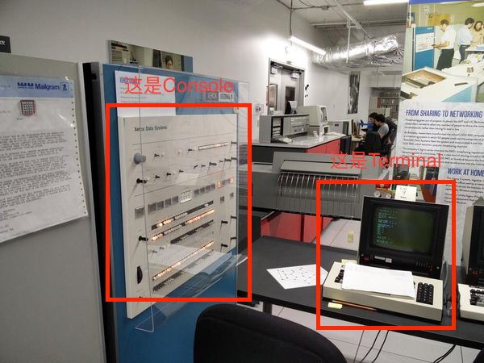

1

在start_kernel里，有调用一个console_init。

在drivers/char/tty_io.c里。

tty

tty是teletypes的意思。它是最早出现的一种终端设备。

类似于电传打字机。由teletype公司生产。

最初tty是指连接到unix系统上的物理或者虚拟终端。

终端是一种字符设备。

随着时间的推移，当可以通过串口建立起终端连接后，tty也被用来指任何的串口设备。


终端和控制台，都是出现的大型机上的概念，大型机会多人共用。


个人电脑只有控制台，没有终端。


Linux是按照posix标准，把个人计算机当成小型机来用的。

在控制台上，通过getty程序虚拟了6个字符哑终端。tty1到tty6 。和一个图形终端。


系统控制台/dev/console


当前控制台/dev/tty


虚拟控制台 /dev/ttyn


看一下busybox里的getty做了些什么。


getty就是弹出一个名字让你输入用户，然后用拿到的名字去执行login。

login的时候，会执行登陆脚本，设置一下环境变量。

```
/dev # cat /proc/devices 
Character devices:       
  1 mem                  
  4 ttyS                 
  5 /dev/tty             
  5 /dev/console         
  5 /dev/ptmx            
```

tty和console是什么关系？

```
/dev # ls console tty -lh                                        
crw-------    1 root     root        5,   1 Jan  1  1970 console 
crw-rw-rw-    1 root     tty         5,   0 Jan  1  1970 tty     
```

主设备号都是5，次设备号不同。


```
/dev # echo "123" > /dev/tty       
123                                
/dev # echo "123" > /dev/console   
/dev #                             
```


串口终端ttyS0

如果你`echo "123" > /dev/ttyS0`，通过ttyS0连接到系统的用户，就会收到这个123 。

控制终端tty

如果当前进程有控制终端的话，可以用ps -ax 查看进程与哪个终端连接的。

输入tty命令，可以看你当前的登陆tty是哪个。

```
hlxiong@hlxiong-VirtualBox:~/work2$ tty
/dev/pts/0
```

控制台终端 ttyn、console。

在Linux系统里，显示器被称为控制台终端。

```
/proc/tty # cat drivers                                           
/dev/tty             /dev/tty        5       0 system:/dev/tty    
/dev/console         /dev/console    5       1 system:console     
/dev/ptmx            /dev/ptmx       5       2 system             
rfcomm               /dev/rfcomm   216 0-255 serial               
serial               /dev/ttyS       4 64-68 serial               
pty_slave            /dev/pts      136 0-1048575 pty:slave        
pty_master           /dev/ptm      128 0-1048575 pty:master       
fiq-debugger         /dev/ttyFIQ   254       0 serial             
```


我的板子，adb shell连接，另外串口也连着。

在adb shell里执行：

```
echo "abc" > /dev/console
```

则在串口这边可以看到abc字符串的输出。

板子的console实际是/dev/ttyFIQ0。

```
echo "aaa" > /dev/ttyFIQ0
```

这样的效果也是一样的。

而这样执行，则是在当前的adb shell里输出：

```
echo "aaa" > /dev/tty
```


tty、console、串口之间的层次关系是什么？

printk函数是如何把信息发送到控制台的。

如何让printk把信息通过串口输出的。

系统在什么地方决定把信息输出到屏幕还是串口？


printk不一定是将信息往控制台上输出，设置kernel的启动参数可能可以打到将信息送到显示器的效果。

实际上printk是将format后的string放到了一个buffer中，**在适当的时候再加以show**,这也回答了在start_kernel中一开始就用到了printk函数的原因 。


终端和控制台都不是个人电脑的概念,而是多人共用的小型中型大型计算机上的概念.

**一台主机,连很多终端,终端为主机提供了人机接口,**每个人都通过终端使用主机的资源. 终端有字符哑终端和图形终端两种.

控**制台是另一种人机接口, 不通过终端与主机相连,** 而是通过显示卡-显示器和键盘接口分别与主机相连, 这是人控制主机的第一人机接口.

话回到个人计算机上,**个人计算机只有控制台,没有终端**. 当然愿意的话, 可以在串口上连一两台字符哑终端. 

**但是linux偏要按POSIX标准把个人计算机当成小型机来用,**

那么就在控制台上**通过getty软件虚拟了六个字符哑终端**（或者叫控制台终端tty1-tty6)(数量可以在/etc/inittab里自己调)和一个图型终端, 

在虚拟图形终端中又可以通过软件(如rxvt)再虚拟无限多个虚拟字符哑终端（pts/0....）. 记住,这全是虚拟的,用起来一样,但实际上并不是.

所以在个人计算机上,只有一个实际的控制台,没有终端,所有终端都是在控制台上用软件模拟的.
要把个人计算机当主机再通过串口或网卡外连真正的物理终端也可以,但由于真正的物理终端并不比个人计算机本身便宜,一般没有人这么做.

（Linux发行版提供7个虚拟屏幕，1~6号是控制台终端（（字符哑）终端），第7个上面跑X-Window。）


伪终端（/dev/pty/）这个是终端的发展，为满足现在需求（比如网络登陆、xwindow窗口的管理）。


控制台终端（/dev/ttyn, /dev/console） 

在UNIX系统中，计算机显示器通常被称为控制台终端（Console）。它仿真了类型为Linux的一种终端（TERM=Linux）， 
并且有一些设备特殊文件与之相关联：tty0、tty1、tty2等。当你在控制台上登录时，使用的是tty1。

只有系统或超级用户root可以 向/dev/tty0进行写操作





可以有多个terminal，但是只有一个console。

是不是可以这样理解：

terminal相当于键盘，电脑接了多个键盘，都能进行输出。

但是只能接一个显示器。显示器就是一个console。


怎样控制console是串口还是屏幕呢？

这个就是kernel的启动参数里指定了：

```
console=ttyS0,115200
```


有一种从串口获取输入的方法：

```
screen /dev/ttyS0 115200
```

有一个setserial命令。busybox里也有的。

-g选项，获取指定的串口的配置信息。

```
/ # setserial -g /dev/ttyS4                     
/dev/ttyS4, UART: 16550A, Port: 0x0000, IRQ: 11 
```


参考资料

1、对于Linux内核tty设备的一点理解

https://www.cnblogs.com/listenerln/p/6780570.html

2、LINUX下的tty，console与串口分析

https://www.cnblogs.com/lidabo/p/5390918.html

3、LINUX下的tty，console与串口分析

https://www.cnblogs.com/lidabo/p/5390918.html

4、linux下tty，控制台，虚拟终端，串口，console（控制台终端）详解

https://blog.csdn.net/liaoxinmeng/article/details/5004743

5、终端、Shell、tty 和控制台（console）有什么区别？

https://www.zhihu.com/question/21711307

6、20.5.2. Using screen to Connect to the Serial Console

https://docs.fedoraproject.org/en-US/Fedora/21/html/System_Administrators_Guide/sec-Using_screen_to_Connect_to_the_Serial_Console.html

7、

https://www.cyberciti.biz/hardware/5-linux-unix-commands-for-connecting-to-the-serial-console/

8、Working with the serial console

https://wiki.archlinux.org/index.php/Working_with_the_serial_console