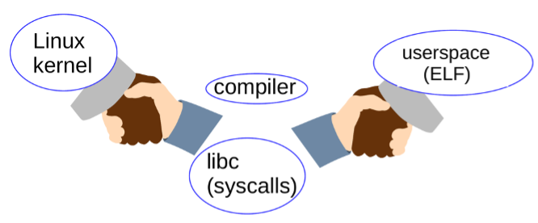

--

许多 Linux 爱好者都熟悉 Linus Torvalds 的 [著名告诫](https://link.zhihu.com/?target=https%3A//lkml.org/lkml/2018/12/22/232)：“我们不破坏用户空间”，但可能并非每个听到这句话的人都清楚其含义。

这个“第一规则”提醒开发人员关于应用程序的二进制接口（ABI）的稳定性，

该接口用于应用程序与内核之间的通信和配置。

接下来的内容旨在使读者熟悉 ABI 的概念，

阐述为什么 ABI 的稳定性很重要，

并讨论 Linux 稳定 ABI 中包含了哪些内容。

Linux 的持续增长和演进需要对 ABI 进行变更，其中一些变更引起了争议。

# ABI

## 什么是 ABI？

ABI 表示 *应用程序二进制接口(Applications Binary Interface)*。

理解 ABI 概念的一种方式是考虑它与其他概念的区别。

对于许多开发人员来说，*应用程序编程接口(Applications Programming Interface)*（API）更为熟悉。

通常，库的头文件和文档被认为是其 API，以及还有像 [HTML5](https://link.zhihu.com/?target=https%3A//www.w3.org/TR/2014/REC-html5-20141028/) 这样的标准文档。

调用库或交换字符串格式数据的程序必须遵守 API 中所描述的约定，否则可能得到意外的结果。

ABI 类似于 API，因为它们规定了命令的解释和二进制数据的交换方式。

对于 C 程序，ABI 通常包括函数的返回类型和参数列表、结构体的布局，以及枚举类型的含义、顺序和范围。截至 2022 年，Linux 内核仍然几乎完全是 C 程序，因此必须遵守这些规范。

“[内核系统调用接口](https://link.zhihu.com/?target=https%3A//www.kernel.org/doc/html/v6.0/admin-guide/abi-stable.html%23the-kernel-syscall-interface)” 的描述可以在《[Linux 手册第 2 节](https://link.zhihu.com/?target=https%3A//www.man7.org/linux/man-pages/dir_section_2.html)》中找到，并包括了可从中间件应用程序调用的类似 `mount` 和 `sync` 的 C 版本函数。

这些函数的二进制布局是 Linux ABI 的第一个重要组成部分。

对于问题 “Linux 的稳定 ABI 包括哪些内容？”，

许多用户和开发人员的回答是 “sysfs（`/sys`）和 procfs（`/proc`）的内容”。

而实际上，[官方 Linux ABI 文档](https://link.zhihu.com/?target=https%3A//www.kernel.org/doc/html/v6.0/admin-guide/abi.html) 确实主要集中在这些 [虚拟文件系统](https://link.zhihu.com/?target=https%3A//opensource.com/article/19/3/virtual-filesystems-linux) 上。

前面着重介绍了 Linux ABI 在程序中的应用方式，但未涵盖同等重要的人为因素。

正如下图所示，ABI 的功能需要内核社区、C 编译器（如 [GCC](https://link.zhihu.com/?target=https%3A//gcc.gnu.org/) 或 [clang](https://link.zhihu.com/?target=https%3A//clang.llvm.org/get_started.html)）、创建用户空间 C 库（通常是 [glibc](https://link.zhihu.com/?target=https%3A//www.gnu.org/software/libc/)）的开发人员，

以及按照 [可执行与链接格式（ELF）](https://link.zhihu.com/?target=https%3A//www.man7.org/linux/man-pages/man5/elf.5.html) 布局的二进制应用程序之间的合作努力

## 为什么我们关注 ABI？

来自 Torvalds 本人的 Linux ABI 的稳定性保证，使得 Linux 发行版和个人用户能够独立更新内核，而不受操作系统的影响。

如果 Linux 没有稳定的 ABI，那么每次内核需要修补以解决安全问题时，操作系统的大部分甚至全部内容都需要重新安装。

**显然，二进制接口的稳定性是 Linux 的可用性和广泛采用的重要因素之一。**

## Y2038：一个 ABI 破坏的例子

通过考虑当前正在进行的、[缓慢发生](https://link.zhihu.com/?target=https%3A//www.phoronix.com/news/MTc2Mjg) 的 “Y2038” ABI 破坏的例子，

可以更好地理解 Linux ABI。

在 2038 年 1 月，32 位时间计数器将回滚到全零，就像较旧车辆的里程表一样。

2038 年 1 月听起来还很遥远，

但可以肯定的是，如今销售的许多物联网设备仍将处于运行状态。

像今年安装的 [智能电表](https://link.zhihu.com/?target=https%3A//www.lfenergy.org/projects/super-advanced-meter-sam/) 和 [智能停车系统](https://link.zhihu.com/?target=https%3A//www.ncbi.nlm.nih.gov/pmc/articles/PMC7506899/) 这样的普通产品可能采用的是 32 位处理器架构，而且也可能不支持软件更新。

Linux 内核已经在内部转向使用 64 位的 `time_t` 不透明数据类型来表示更晚的时间点。

这意味着像 `time()` 这样的系统调用在 64 位系统上已经变更了它们的函数签名。

这些努力的艰难程度可以在内核头文件中（例如 [time_types.h](https://link.zhihu.com/?target=https%3A//github.com/torvalds/linux/blob/master/include/uapi/linux/time_types.h)）清楚地看到，在那里放着新的和 `_old` 版本的数据结构。

Glibc 项目也 [支持 64 位时间](https://link.zhihu.com/?target=https%3A//www.phoronix.com/scan.php%3Fpage%3Dnews_item%26px%3DGlibc-More-Y2038-Work)，那么就大功告成了，对吗？

不幸的是，根据 [Debian 邮件列表中的讨论](https://link.zhihu.com/?target=https%3A//groups.google.com/g/linux.debian.ports.arm/c/_KBFSz4YRZs) 来看，情况并非如此。

发行版面临难以选择的问题，要么为 32 位系统提供所有二进制软件包的两个版本，要么为安装介质提供两个版本。

在后一种情况下，32 位时间的用户将不得不重新编译其应用程序并重新安装。正如往常一样，专有应用程序才是一个真正的头疼问题。

## Linux 稳定 ABI 里到底包括什么内容？

理解稳定 ABI 有些微妙。

需要考虑的是，尽管大部分 sysfs 是稳定 ABI，但调试接口肯定是不稳定的，

因为它们将内核内部暴露给用户空间。

Linus Torvalds 曾表示，“不要破坏用户空间”，

通常情况下，他是指保护那些 “只想它能工作” 的普通用户，

而不是系统程序员和内核工程师，后者应该能够阅读内核文档和源代码，以了解不同版本之间发生了什么变化。

普通用户不太可能与 Linux ABI 的不稳定部分进行交互，但系统程序员可能无意中这样做。

**除了 `/sys/kernel/debug` 以外，sysfs（`/sys`）和 procfs（`/proc`）的所有部分都是稳定的。**

那么其他对用户空间可见的二进制接口如何呢，包括 `/dev` 中的设备文件、内核日志文件（可通过 `dmesg` 命令读取）、文件系统元数据或在内核的 “命令行” 中提供的 “引导参数”（在引导加载程序如 GRUB 或 u-boot 中可见）呢？当然，“这要视情况而定”。

# 参考资料

1、内核文档

https://docs.kernel.org/admin-guide/abi.html

2、如何评价 Linux 内核开发人员正在讨论删除对 x32 ABI 的支持?

https://www.zhihu.com/question/305621988/answer/673432236

3、10 分钟让你了解 Linux ABI | Linux 中国

https://zhuanlan.zhihu.com/p/643731163