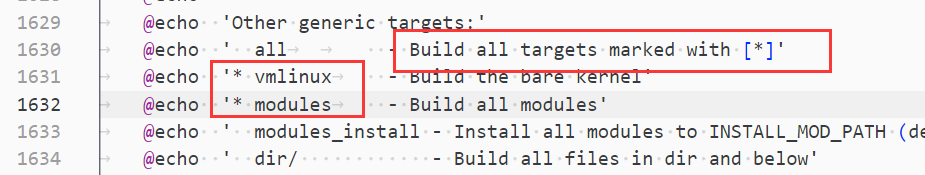

--

我现在的记笔记习惯已经变成一篇文章里，用标题来区分囊括所有的相关知识点，而不是分布到多篇文章里。

这篇就记录关于Linux内核的相关疑问。

# 内核会把CONFIG项目转成宏传递给C代码吗？在哪里做的？

是的，内核会将配置选项（CONFIG）转换为宏，并传递给 C 代码。这个转换过程主要是通过在内核的编译过程中完成的，具体地说，在内核的构建过程中，会根据配置选项生成一个头文件（通常是 `include/generated/autoconf.h`），其中定义了与配置选项相关的宏。

在编译内核时，您通过配置内核选项（例如使用 `make menuconfig`、`make xconfig` 等）来选择需要启用或禁用的功能和选项。这些配置选项会在构建过程中被处理，并在生成的头文件中定义相应的宏。

在 C 代码中，可以使用这些宏来进行条件编译，从而根据配置选项的不同来编译不同的代码路径。例如：

```c
#ifdef CONFIG_FEATURE_X
    // 执行功能 X 的代码
#else
    // 执行其他代码或者什么也不做
#endif
```

这样，如果配置中启用了 `CONFIG_FEATURE_X`，则会编译和执行对应的代码，否则会编译和执行其他代码或者不做任何操作。

这个过程是由内核构建系统的 Makefile 和相关脚本来完成的，在编译内核时会自动生成并包含相应的头文件，以便 C 代码可以使用配置选项定义的宏。

# 对kernel来说，make all编译了哪些东西？

等价于：

```
make vmlinux
make modules
```




# 编译外部模块

命令模板和解释是这样：

```
PHONY += help
help:
	@echo  '  Building external modules.'
	@echo  '  Syntax: make -C path/to/kernel/src M=$$PWD target'
	@echo  ''
	@echo  '  modules         - default target, build the module(s)'
	@echo  '  modules_install - install the module'
	@echo  '  clean           - remove generated files in module directory only'
	@echo  ''
```

