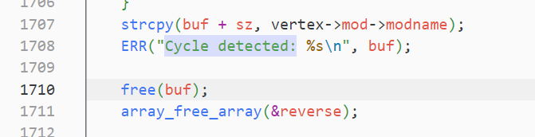

--

Linux的module的ko文件，跟普通的目标文件一样，都是可重定位的文件。

而普通目标文件，是不能直接执行的，

它需要经过链接器的地址空间分配、符号解析和菜的味道 过程，转化为可执行文件才能执行。


内核在加载一个ko文件的时候，经历了怎样的一个过程呢？

现在就分析一下。

我先看Linux源代码里的module对应的数据结构的定义。

在`include/linux/module.h`里。

成员较多，我们现在关注的是其中init和exit这2个函数指针。

这2个指针就是我们写驱动文件里的init和exit函数注册到这里。

当我们在执行`insmod test.ko`的时候，内核通过系统调用`init_module`来完成。
如下：

```
SYSCALL_DEFINE3(init_module, void __user *, umod,
		unsigned long, len, const char __user *, uargs)
{

	//...
	err = copy_module_from_user(umod, len, &info);
	//...
	return load_module(&info, uargs, 0);
}
```

# Linux内核模块简介

当谈到Linux内核模块时，我们指的是可动态加载到Linux内核中以扩展其功能的软件组件。

内核模块允许开发人员在==不重新编译或重新启动整个内核的情况下添加、删除或修改内核的功能。==

以下是一些关于Linux内核模块的基本信息：

1. 内核模块的类型：内核模块可以是设备驱动程序、文件系统、网络协议栈、安全模块等不同类型的组件。它们以动态链接共享对象的形式存在，以便在需要时加载到内核中。
2. 模块加载和卸载：使用insmod命令可以将内核模块加载到运行中的内核中。加载模块时，内核会自动解析模块的依赖关系并加载所需的其他模块。相反，使用rmmod命令可以将模块从内核中卸载。
3. 模块参数：内核模块可以接受参数，这些参数用于配置模块的行为。这些参数可以在加载模块时设置，也可以==通过/sys/module/模块名/parameters目录中的文件进行运行时设置。==
4. 内核符号：内核模块可以访问和使用内核中的符号（函数、变量等）。==内核符号可以通过导出和导入机制在模块之间共享==。导出的符号可以被其他模块使用，而导入的符号可以在模块中被调用。
5. 内核模块的开发：开发内核模块需要熟悉C语言和Linux内核编程接口。模块开发通常涉及编写模块初始化和清理函数，处理内核事件和数据结构等。
6. 内核模块的安全性：由于内核模块在内核空间中执行，因此开发和加载模块需要谨慎。恶意的或错误的模块可能会导致系统崩溃或安全漏洞。

# 模块的加载和卸载是用什么系统调用完成？原理是什么？

Linux 中模块的加载和卸载是通过系统调用来完成的，主要涉及到 `init_module` 和 `delete_module` 这两个系统调用。

1. **`init_module` 系统调用**：
   - 用于加载一个内核模块到运行中的内核中。
   - 原型为：`int init_module(void *module_image, unsigned long len, const char *param_values)`。
   - `module_image` 参数是一个指向模块镜像数据的指针，`len` 是模块镜像数据的长度，`param_values` 是一个字符串，用于传递模块加载时的参数。
   - 调用成功返回 0，否则返回一个负值，表示加载失败。

2. **`delete_module` 系统调用**：
   - 用于从运行中的内核中卸载一个内核模块。
   - 原型为：`int delete_module(const char *name, int flags)`。
   - `name` 参数是要卸载的模块的名称，`flags` 是一个标志参数，用于指定卸载的行为。
   - 调用成功返回 0，否则返回一个负值，表示卸载失败。

这两个系统调用的原理是：

- **模块加载**：当调用 `init_module` 系统调用时，内核会将指定的模块镜像数据加载到内核中，并进行必要的初始化。==加载模块时，内核会执行模块的初始化代码，建立模块的数据结构，并将其添加到内核的模块列表中==。如果模块加载成功，内核会返回一个成功的状态码，表示加载成功。

- **模块卸载**：当调用 `delete_module` 系统调用时，内核会查找指定名称的模块，并执行模块的清理和卸载操作。卸载模块时，内核会执行模块的清理代码，释放模块占用的资源，并将其从内核的模块列表中移除。如果模块卸载成功，内核会返回一个成功的状态码，表示卸载成功。

这两个系统调用提供了一种用户空间控制内核模块的接口，使得用户空间程序可以通过系统调用的方式加载和卸载内核模块，从而动态地扩展和修改 Linux 内核的功能。

# kmod软件包

kmod是一个软件包，它为Linux系统提供了管理内核模块的工具和库。它包含以下主要组件：

1. kmod命令行工具：kmod命令提供了一系列用于管理内核模块的命令。它可以用于加载、卸载、列出和查询内核模块。例如，使用`modprobe`命令加载模块，使用`lsmod`命令列出已加载的模块。

2. libkmod库：==libkmod是一个用于操作内核模块的C库。它提供了一组API，供开发人员在他们的应用程序中加载、卸载和查询内核模块。==libkmod库提供了比直接调用系统调用更方便的接口。

3. 内核模块依赖解析：kmod软件包还提供了内核模块依赖解析的功能。当加载一个模块时，kmod会自动解析并加载所需的其他模块，以满足模块之间的依赖关系。

kmod软件包的存在简化了内核模块的管理和操作。它提供了一种标准化的方式来管理内核模块，使得开发人员和系统管理员能够更方便地管理系统的功能扩展和设备驱动程序。

请注意，kmod软件包通常作为Linux发行版的一部分提供，并与其他工具和库一起使用，以提供完整的内核模块管理功能。

# buildroot编译和运行时对内核模块的依赖关系是如何处理的

在Buildroot中，处理内核模块的依赖关系主要通过Kconfig和Makefile来完成。

以下是Buildroot在编译和运行时处理内核模块依赖关系的一般流程：

1. Kconfig配置：Buildroot使用Kconfig作为配置系统，用于选择和配置各个软件包，包括内核模块。在Buildroot的配置界面中，用户可以选择要编译的内核模块，并配置它们的选项和依赖关系。

2. 生成内核配置：根据用户在Kconfig中的选择，Buildroot会生成一个内核配置文件（.config），其中包含了要编译的内核模块以及它们的配置选项。

3. 内核构建：Buildroot使用生成的内核配置文件作为输入，通过调用适当的内核构建目标，如`linux-menuconfig`或`linux-defconfig`，来构建内核。在这个过程中，内核模块的源代码将被编译成二进制模块文件（.ko）。

4. 内核模块安装：编译完成后，Buildroot将安装生成的内核模块文件到目标系统的文件系统中。这通常是通过将模块文件复制到目标根文件系统（rootfs）的正确位置来完成的。

5. 运行时依赖关系：在运行时，当内核启动时，它会自动加载所需的内核模块，并处理它们之间的依赖关系。这是通过内核的模块加载器（通常是modprobe或insmod）来完成的。模块加载器会根据内核模块之间的依赖关系，自动加载所需的模块。

需要注意的是，Buildroot会根据用户的配置生成适当的Makefile规则，以确保在构建过程中正确处理内核模块的依赖关系。这些规则会自动处理模块之间的编译和链接依赖关系，以及运行时加载模块的依赖关系。

总之，Buildroot通过Kconfig进行配置选择，并根据用户的选择在构建过程中处理内核模块的依赖关系。这样可以确保系统在运行时正确加载和使用所需的内核模块。


linux.mk里代码：

```
define LINUX_RUN_DEPMOD
	if grep -q "CONFIG_MODULES=y" $(LINUX_DIR)/.config; then \
		$(HOST_DIR)/sbin/depmod -a -b $(TARGET_DIR) $(LINUX_VERSION_PROBED); \
	fi
endef
```


# 内核模块的依赖关系如何进行描述

内核模块的依赖关系可以通过以下方式进行描述：

1. Kconfig选项依赖：在内核源代码中，每个模块都有一个对应的Kconfig文件，其中包含了模块的配置选项。这些选项可以定义模块之间的依赖关系。通过在Kconfig文件中使用`select`、`depends on`和`menuconfig`等指令，可以指定模块之间的依赖关系。例如，一个模块可以依赖于另一个模块的选择或配置。

2. Makefile依赖：在内核源代码中，每个模块都有一个对应的Makefile文件，其中包含了构建该模块所需的编译和链接规则。在Makefile中，可以使用`obj-$(CONFIG_OPTION)`来指定模块的编译和链接依赖关系。这样，只有在相关的配置选项被选择时，相关的模块才会被编译和链接。

3. 符号依赖：内核模块可以依赖于其他模块导出的符号（函数、变量等）。通过在模块的源代码中使用`EXPORT_SYMBOL`宏导出符号，以及在依赖的模块中使用`EXPORT_SYMBOL_GPL`宏导出符号，可以建立模块之间的符号依赖关系。这样，依赖模块可以在加载时自动解析和加载所需的符号。

通过以上方式，内核模块的依赖关系可以在编译时和运行时得到处理。编译时依赖关系确保了模块之间的正确编译和链接顺序，而运行时依赖关系确保了模块之间的正确加载顺序。这样可以在系统启动时自动加载和初始化所需的内核模块，并满足模块之间的依赖关系。


# depmod 命令的使用

depmod - Generate modules.dep and map files.

==linux内核module可以服务（也就各种symbol，就是EXPORT_SYMBOL暴露出来的）给其他module来用。==

模块A使用了模块B的symbol，则A依赖于B。

**这个依赖关系可能会很复杂。**

**depmod就是一个可以帮助我们处理模块依赖关系的工具。**

通过读取/lib/modules/version目录下的模块，==分析模块暴露的符号和依赖的符号。==

==默认情况下，是写入到modules.dep文件里。==

==还有一个二进制版本modules.dep.bin。==


`depmod`命令是一个用于生成和更新内核模块依赖关系的工具。

它会分析已安装的内核模块以及它们之间的依赖关系，并将这些信息写入到系统的模块依赖关系文件中。下面是`depmod`命令的使用方法：

```
depmod [options] [kernel_version]
```

常用选项包括：

- `-a`：更新所有已安装模块的依赖关系。
- `-b <directory>`：指定内核模块的根目录，默认为当前系统的内核模块目录。
- `-e`：禁用内核符号表的处理。
- `-F <file>`：指定要使用的模块符号文件，默认为系统的模块符号文件。
- `-n`：仅显示要更新的模块列表，而不执行实际的更新操作。
- `-v`：显示详细的输出信息。

`kernel_version`是可选的参数，用于指定要生成依赖关系的特定内核版本。如果未指定该参数，`depmod`将使用当前正在运行的内核版本。

使用`depmod`命令的一般步骤如下：

1. 打开终端或命令行界面。

2. 运行`depmod`命令，并根据需要添加选项。

   例如，要更新所有已安装模块的依赖关系，可以运行以下命令：
   ```
   depmod -a
   ```

   如果只想显示要更新的模块列表而不实际执行更新操作，可以使用`-n`选项：
   ```
   depmod -n
   ```

3. 等待`depmod`命令完成依赖关系的生成和更新过程。

`depmod`命令将根据系统的内核模块配置和已安装的模块，生成一个模块依赖关系文件（通常命名为`modules.dep`），该文件将存储在系统的模块目录中。

通过使用`depmod`命令，可以确保内核模块之间的依赖关系得到正确地识别和维护，以便在加载和卸载模块时能够正确地解析和处理依赖关系。

## depmod代码分析

代码在这里：

build\host-kmod-26\tools\depmod.c

代码有3000行左右。

就看这个命令是怎么执行的：

```
depmod -a -b XX/target 6.6.12-g3dfdc0c5c4e7
```

tools下面的工具都是共用的一个main函数，在这个文件里：

build\host-kmod-26\tools\kmod.c

其余的文件里都是注册一个命令结构体过来。

```
static const struct kmod_cmd *kmod_compat_cmds[] = {
	&kmod_cmd_compat_lsmod,
	&kmod_cmd_compat_rmmod,
	&kmod_cmd_compat_insmod,
	&kmod_cmd_compat_modinfo,
	&kmod_cmd_compat_modprobe,
	&kmod_cmd_compat_depmod,
};

```

输出的文件名是这里：

```
static int depmod_output(struct depmod *depmod, FILE *out)
{
	static const struct depfile {
		const char *name;
		int (*cb)(struct depmod *depmod, FILE *out);
	} *itr, depfiles[] = {
		{ "modules.dep", output_deps },
		{ "modules.dep.bin", output_deps_bin },
		{ "modules.alias", output_aliases },
		{ "modules.alias.bin", output_aliases_bin },
		{ "modules.softdep", output_softdeps },
		{ "modules.symbols", output_symbols },
		{ "modules.symbols.bin", output_symbols_bin },
		{ "modules.builtin.bin", output_builtin_bin },
		{ "modules.devname", output_devname },
		{ }
	};
```

报循环依赖的是这里：



# depmod的输出文件有哪些

`depmod`命令在运行时会生成多个输出文件，用于记录内核模块的相关信息和依赖关系。以下是`depmod`命令生成的一些常见输出文件：

1. `modules.dep`: 记录内核模块之间的依赖关系。它列出了每个已安装的内核模块及其所依赖的其他模块。

2. `modules.dep.bin`: 对`modules.dep`文件的二进制版本，用于提高依赖关系的解析性能。

3. `modules.builtin`: 记录已编译进内核的模块列表。它列出了在内核构建过程中被标记为"built-in"的模块。

4. `modules.alias`: 记录内核模块的别名和模块路径的映射关系。它用于在模块加载时根据别名查找和加载正确的模块。

5. `modules.symbols`: 记录内核模块的符号信息。它包含了模块导出的符号及其版本信息，用于符号匹配和解析。

6. `modules.symbols.bin`: 对`modules.symbols`文件的二进制版本，用于提高符号解析的性能。

这些输出文件通常存储在系统的模块目录中，通常是`/lib/modules/<kernel_version>/`目录下。它们在内核模块加载过程中起着重要的作用，用于解析依赖关系、符号匹配和模块加载等操作。

需要注意的是，`depmod`命令还可以生成其他输出文件，具体取决于命令的参数和系统的配置。用户可以通过查阅`depmod`命令的文档或使用命令的帮助选项来了解更多关于输出文件和相关参数的信息。

```
/lib/modules/5.4.259-09338-g3c1b2d137d36 # ls -lh
modules.alias        
modules.builtin        
modules.builtin.bin    
modules.builtin.modinfo
modules.dep            
modules.dep.bin        
modules.devname        
modules.order          
modules.softdep        
modules.symbols        
modules.symbols.bin    
```

## modules.alias 

`modules.alias`文件是一个用于映射内核模块别名和模块路径的文件。

它存储了内核模块的别名和对应的模块路径，

以便在模块加载时能够根据别名查找和加载正确的模块。

`modules.alias`文件的配置通常是由内核模块的开发者或发行版的维护者完成的，

而不是由普通用户手动编辑。

以下是一般情况下生成`modules.alias`文件的主要过程：

1. 内核模块编译：在内核模块的构建过程中，编译器会根据模块的元数据（如模块的名称、作者、描述等）生成一个模块符号文件（通常命名为`modules.symvers`）。这个符号文件包含了模块的符号和路径信息。

2. Module.symvers解析：在内核编译完成后，通过解析`modules.symvers`文件，可以获取模块的符号和路径信息。

3. modules.alias生成：使用解析得到的模块符号和路径信息，通过一个工具（通常是`depmod`命令）生成`modules.alias`文件。这个文件中包含了模块的别名和对应的模块路径。

生成的`modules.alias`文件将存储在系统的模块目录中，通常是`/lib/modules/<kernel_version>/`目录下。该文件将用于在模块加载时进行别名映射，以便正确地加载和使用相应的模块。

需要注意的是，用户一般不需要手动编辑`modules.alias`文件。如果需要添加或修改模块的别名和路径映射，应该通过正确配置内核模块的元数据或相关的构建工具来完成。

## modules.symvers

`modules.symvers`是一个内核模块构建过程中生成的==符号版本文件。==

它记录了内核模块的导出符号（函数、变量等）及其版本信息，

以便在加载模块时进行符号匹配和解析。

具体来说，`modules.symvers`文件包含以下信息：

1. 模块符号：列出了每个内核模块导出的符号（函数、变量等）。这些符号通常是通过`EXPORT_SYMBOL`或`EXPORT_SYMBOL_GPL`宏在模块源代码中声明的。

2. 符号版本：为每个符号指定了一个版本号。==版本号用于标识符号的兼容性和变化情况。==当模块加载时，内核会使用`modules.symvers`文件中的符号版本信息来确保所需符号的匹配和兼容性。

3. 符号路径：指定了每个符号所属的模块路径。这个路径用于在模块加载时找到相应的模块文件，并解析和加载所需的符号。

在内核模块构建过程中，编译器会根据模块的源代码和相关的构建规则，生成`modules.symvers`文件。这个文件通常会与编译后的模块一起存储在系统的模块目录中。

`modules.symvers`文件在模块加载过程中起着重要的作用。当一个模块被加载时，内核会检查该模块所需的符号是否存在于当前内核的`modules.symvers`文件中，并且版本匹配。如果符号存在且版本匹配，则模块可以成功加载和使用。否则，加载过程可能会失败或出现错误。

需要注意的是，用户一般不需要手动编辑`modules.symvers`文件。它是由内核构建过程自动生成的，以确保符号的正确匹配和兼容性。

## modules.builtin 

`modules.builtin`是一个记录已编译进内核的模块列表的文件。

它列出了在内核构建过程中被标记为"built-in"的模块，

这些模块会直接嵌入到内核镜像中，

而不是以独立的模块文件形式存在。

具体来说，`modules.builtin`文件包含了以下信息：

1. 模块路径：列出了每个已编译为内核的模块的路径。这些路径是相对于内核源代码树的位置。

2. 模块名称：指定了每个模块的名称，用于在内核中标识和引用该模块。

`modules.builtin`文件的生成过程如下：

1. 内核编译：在内核构建过程中，一些模块被标记为"built-in"，这意味着它们将被直接编译到内核镜像中，而不是作为独立的模块文件存在。这些模块通常是内核的核心功能或必需的驱动程序。

2. 模块列表生成：在内核编译过程中，编译器会生成一个模块列表，其中包含了所有被标记为"built-in"的模块的路径和名称。

3. modules.builtin生成：根据生成的模块列表，内核构建系统会生成`modules.builtin`文件，将模块的路径和名称记录在其中。

最终生成的`modules.builtin`文件将存储在系统的模块目录中，通常是`/lib/modules/<kernel_version>/`目录下。

`==modules.builtin`文件的存在可以帮助内核在启动时快速识别和加载内核的核心模块，==

==而无需依赖外部的模块加载机制。==

这对于启动过程的效率和可靠性非常重要。

需要注意的是，用户一般不需要手动编辑`modules.builtin`文件。

它是由内核构建过程自动生成和管理的，以确保内核镜像中的模块正确地嵌入和加载。

## modules.dep

`modules.dep`是一个记录内核模块之间依赖关系的文件。

它存储了已安装的内核模块及其相互之间的依赖关系，

以便在模块加载和卸载时能够正确地解析和处理依赖关系。

具体来说，`modules.dep`文件包含以下信息：

1. 模块路径：列出了每个已安装的内核模块的路径。这些路径是相对于系统的模块目录的位置。

2. 模块依赖关系：为每个模块指定了它所依赖的其他模块。这些依赖关系定义了模块加载的顺序和依赖条件。

`modules.dep`文件的生成过程如下：

1. 模块依赖分析：通过使用`depmod`命令，系统会分析已安装的内核模块及其源代码中的依赖关系声明。`depmod`将识别模块源代码中的依赖关系，包括使用`MODULE_DEPEND`宏或其他依赖声明的方式。

2. 依赖关系记录：`depmod`将根据分析得到的依赖关系生成一个模块依赖关系文件，并将模块的路径和依赖关系记录在其中。这个文件就是`modules.dep`。

最终生成的`modules.dep`文件将存储在系统的模块目录中，通常是`/lib/modules/<kernel_version>/`目录下。

`modules.dep`文件在模块加载和卸载过程中起着重要的作用。

当一个模块被加载时，内核会检查该模块所依赖的其他模块是否已加载，

并按照正确的顺序加载这些依赖模块。

类似地，在模块卸载时，内核会检查是否有其他模块依赖于当前模块，并在安全的顺序下卸载这些依赖模块。

需要注意的是，`modules.dep`文件是由`depmod`命令自动生成和管理的，

以确保模块的依赖关系能够正确地解析和处理。用户一般不需要手动编辑`modules.dep`文件。

# modpost命令作用

`modpost` 是一个用于处理 Linux 内核模块的工具，

其主要作用是在模块构建过程的==最后阶段进行模块信息的处理和修改。==

具体来说，`modpost` 主要有以下几个作用：

1. **符号修正：**
   `modpost` 会检查模块中使用的符号，并对其进行修正。这包括解析模块的导出符号，处理全局符号冲突，确保符号的正确引用和解析。

2. **生成模块的依赖关系：**
   `modpost` 会生成模块的依赖关系，标识模块之间的依赖关系。这对于正确加载和卸载模块以及保证依赖关系正确的运行非常重要。

3. **生成模块的符号表：**
   `modpost` 会生成一个包含模块中所有符号信息的符号表。这有助于其他模块或内核的其他部分正确引用和使用模块中的符号。

4. **生成模块的版本信息：**
   对于使用 `MODULE_VERSION` 定义的模块版本，`modpost` 会根据这些信息生成相应的版本信息，以确保正确的模块版本被加载。

5. **修正模块的引用计数：**
   `modpost` 会修正模块中的引用计数，确保它们在模块加载和卸载的过程中正确地增加和减少。

6. **生成模块的 map 文件：**
   `modpost` 会生成一个包含模块详细信息的 map 文件，用于调试和分析模块的结构和信息。

这些处理步骤在模块构建的最后阶段完成，确保模块能够正确地与内核交互，符号能够被正确解析和引用，以及模块的依赖关系得到正确处理。

`modpost` 工具通常是由构建系统（如 `make`）自动调用的，不需要手动执行，但了解其作用可以帮助理解模块构建过程中的关键步骤。

## modpost命令参数说明

`modpost` 是 Linux 内核构建系统中的一个工具，用于处理模块的一些后期工作。尽管 `modpost` 通常是由构建系统自动调用，但是它也可以通过命令行进行手动调用，并支持一些参数。以下是一些常见的 `modpost` 命令参数说明：

```bash
modpost [OPTIONS] modules
```

常见的选项（OPTIONS）包括：

1. **`-v`, `--verbose`：**
   输出更详细的信息，包括符号修正的过程和其他处理步骤的详细信息。

2. **`-i`, `--ignore-version`：**
   忽略模块版本信息。这样可以在模块版本不匹配时继续进行 `modpost` 处理。

3. **`-r`, `--rebuild`：**
   重新构建模块，而不使用已经存在的 `.mod` 目录中的预先计算的模块信息。这可以用于强制 `modpost` 重新生成模块信息。

4. **`-s`, `--symtab`：**
   生成模块的符号表，包含模块中所有符号信息。

5. **`-d`, `--depmod`：**
   生成模块的依赖关系。这会创建一个 `modules.dep` 文件，包含模块之间的依赖关系。

6. **`-w`, `--wildcard`：**
   允许使用通配符匹配模块名。例如，`-w '*.ko'` 将匹配所有以 `.ko` 结尾的模块。

7. **`-F`, `--depfile`：**
   指定模块依赖关系文件的名称。默认为 `modules.dep`。

8. **`-g`, `--gpl`：**
   生成包含模块许可证信息的 `modules.order` 文件。

9. **`-c`, `--kconfig`：**
   读取配置文件中的配置，例如 `.config` 文件，以便正确处理配置中的宏定义。

这只是一些常见的选项，实际使用时可以通过 `modpost --help` 查看所有可用选项的详细信息。需要注意的是，`modpost` 的参数可能会根据 Linux 内核的版本和配置而有所不同，因此最好查阅相应版本的文档或帮助信息。

# 把kernel和ramdisk安装到/boot下面有什么用？

将内核（kernel）和RAMDisk（ramdisk）安装到`/boot`目录下有以下几个用途：

1. 启动加载：`/boot`目录是Linux系统启动时的关键目录之一。在系统引导过程中，引导加载程序（bootloader）通常会在`/boot`目录中查找内核和RAMDisk文件，并将它们加载到内存中以启动操作系统。这样，将内核和RAMDisk放置在`/boot`目录下可以确保引导加载程序能够轻松找到它们并进行加载。

2. 系统更新：内核和RAMDisk是操作系统的核心组件之一，需要经常更新以提供新的功能、修复漏洞或改进性能。将它们安装到`/boot`目录下使得系统管理员能够方便地管理和更新内核和RAMDisk文件。通过替换或更新`/boot`目录中的文件，系统管理员可以轻松地升级内核和RAMDisk，而无需手动调整引导加载程序的配置。

3. 多重引导：对于多重引导（multiboot）的系统，即在同一计算机上安装多个操作系统的情况下，每个操作系统通常都有自己独立的内核和RAMDisk。将各个操作系统的内核和RAMDisk安装到各自的`/boot`目录下可以确保每个操作系统都能够独立地管理和加载自己的内核和RAMDisk。

总之，将内核和RAMDisk安装到`/boot`目录下是为了方便系统引导加载程序的定位和加载，并提供了方便的管理和更新机制。这样做有助于确保系统的启动过程顺利进行，并支持操作系统的更新和多重引导功能。

# 那把kernel和ramdisk放到单独的flash分区有什么不一样？

将内核（kernel）和RAMDisk（ramdisk）放置在单独的闪存（flash）分区相比放置在`/boot`目录下有几个不同之处：

1. 引导方式：将内核和RAMDisk放置在闪存分区可能需要更改系统的引导方式。通常，系统的引导加载程序（bootloader）需要配置为从闪存分区加载内核和RAMDisk，而不是从`/boot`目录加载。这可能需要更改引导加载程序的配置和设置。

2. 引导速度：闪存具有较快的读取速度，相比于硬盘上的`/boot`目录，从闪存分区加载内核和RAMDisk可能更快。这可以缩短系统启动时间并提高性能。

3. 系统可靠性：将内核和RAMDisk存储在闪存分区可以提高系统的可靠性。闪存通常具有较好的耐久性和抗震动性，相比于硬盘上的`/boot`目录，闪存分区上的文件更不容易受到损坏或损坏。

4. 系统安全性：将内核和RAMDisk放置在单独的闪存分区可以增加系统的安全性。闪存分区可以被设置为仅读（Read-Only），从而防止对内核和RAMDisk的未经授权的修改和篡改。这有助于保护系统免受恶意软件的攻击和损害。

需要注意的是，将内核和RAMDisk放置在单独的闪存分区需要进行适当的配置和调整，包括引导加载程序的设置和文件系统的安装。这通常需要一些系统管理和操作技能。此外，系统的硬件和固件支持也是使用闪存分区的前提条件。

总的来说，将内核和RAMDisk放置在单独的闪存分区可以提供更快的引导速度、增强的系统可靠性和安全性。这是一种高级配置选项，适用于需要优化系统性能和安全性的特定场景。

# ubuntu怎样升级内核和ramdisk？

在Ubuntu中，可以通过以下步骤来升级内核和RAMDisk：

1. 更新软件包列表：打开终端，运行以下命令以更新软件包列表和可用的内核版本：
   ```
   sudo apt update
   ```

2. 查看可用的内核版本：运行以下命令以列出可用的内核版本：
   ```
   apt search linux-image
   ```

   这将显示可用的内核版本及其相应的包名称。选择适合您系统的新内核版本。

3. 安装新的内核版本：根据您选择的新内核版本，运行以下命令来安装新的内核和相关的RAMDisk（请将`<package-name>`替换为实际的内核包名称）：
   ```
   sudo apt install <package-name>
   ```

   例如，如果您选择安装内核版本为`linux-image-5.11.0-40-generic`，则应运行以下命令：
   ```
   sudo apt install linux-image-5.11.0-40-generic
   ```

4. 更新引导加载程序：安装新的内核后，需要更新引导加载程序以使用新内核。运行以下命令来更新GRUB引导：
   ```
   sudo update-grub
   ```

   这将自动检测新的内核并更新引导菜单。

5. 重新启动系统：完成安装和引导更新后，重新启动您的Ubuntu系统：
   ```
   sudo reboot
   ```

   在重启过程中，选择新安装的内核版本作为启动选项。系统将加载新的内核和相应的RAMDisk。

请注意，升级内核和RAMDisk可能需要一些时间和系统重启。在执行升级操作之前，建议备份重要数据，并确保您拥有管理员权限以执行这些操作。

# ubuntu的/boot命令下面的文件说明

在Ubuntu的`/boot`目录下，通常会包含一些重要的文件和目录，用于存储与引导和内核相关的内容。以下是一些常见的文件和目录及其说明：

1. `vmlinuz-*`：这些文件是压缩的Linux内核映像文件。它们包含了操作系统的内核代码和功能。

2. `initrd.img-*`或`initramfs-*`：这些文件是初始化RAMDisk（initramfs）映像文件。它们包含了在引导过程中用于加载和初始化操作系统所需的驱动程序、文件系统和其他组件。

3. `config-*`：这些文件是内核的配置文件。它们包含了内核编译时使用的配置选项和参数。

4. `System.map-*`：这些文件是内核符号映射文件。它们包含了内核中各个符号（函数、变量等）与其在内存中的地址之间的映射关系。

5. `abi-*`：这些文件包含了内核对用户空间的应用程序二进制接口（ABI）的定义。它们用于确保用户空间应用程序与内核之间的兼容性。

6. `grub/`：这是一个目录，包含了GRUB引导加载器的相关文件。其中重要的文件包括`grub.cfg`，它是GRUB引导菜单的配置文件。

7. `memtest86+`：这是一款用于内存测试的工具。它可以在引导时选择并运行，以检查系统的内存是否存在问题。

8. 其他文件：还可能存在其他与内核和引导相关的文件，如旧版本的内核和RAMDisk文件，以及与引导加载程序和系统配置有关的文件。

需要注意的是，这些文件的确切命名和版本号可能会因不同的Ubuntu发行版和内核版本而有所变化。在`/boot`目录中，通常会有多个版本的内核和RAMDisk文件，以便系统管理员可以选择不同的版本进行引导和调试。

请注意，对`/boot`目录的更改需要小心进行，以免意外删除或修改关键的引导文件，导致系统无法启动。在对`/boot`目录进行任何更改之前，建议备份重要数据并谨慎操作。

# ubuntu 的系统镜像和软件包是基于什么构建系统来做的？是yocto吗？

Ubuntu的系统镜像和软件包并不是基于Yocto Project构建系统。相反，Ubuntu使用了一个名为"Debian"的构建系统。

Ubuntu是基于Debian发行版的一个衍生版本，它继承了Debian的软件包管理系统和构建工具。Debian构建系统使用一种称为"dpkg"的工具来管理软件包，其中包括"apt"工具，用于安装、更新和卸载软件包。这个系统使用Debian的软件包描述文件（.deb）格式来打包软件，并提供了一种可靠的方法来管理和分发软件。

在Ubuntu中，软件包的构建和打包通常是通过使用"dpkg-buildpackage"等工具来完成的。这些工具可以根据软件包的源代码构建二进制软件包，并生成用于安装的.deb文件。

此外，Ubuntu还使用了自己的构建工具和基础架构，如Launchpad和Pbuilder，用于构建和管理大规模的软件包仓库，并为开发者和用户提供方便的方法来构建和分发软件。

总之，Ubuntu的系统镜像和软件包是基于Debian构建系统开发和构建的，使用了dpkg、apt等工具和.deb包格式。这使得Ubuntu能够提供稳定、可靠和易于管理的软件包管理系统。

# insmod机制详细说明

`insmod` 是 Linux 中用于将内核模块加载到运行中的内核中的命令。它的作用是将指定的内核模块加载到内核中，使得系统可以使用该模块提供的功能。下面是关于 `insmod` 命令的详细说明：

1. **命令格式**：
   ```bash
   insmod [options] module_name [module_parameters]
   ```

2. **参数说明**：
   - `module_name`：要加载的内核模块的名称或路径。
   - `module_parameters`：可选的模块参数，用于指定加载模块时的配置信息。

3. **选项说明**：
   - `-f, --force`：强制加载模块，即使它可能会导致系统不稳定或与其他模块冲突。
   - `-k, --kernel-version`：指定要加载模块的内核版本。这个选项通常很少使用，因为大多数情况下内核会自动选择合适的版本。
   - `-s, --syslog`：将加载模块的信息发送到系统日志中。

4. **加载流程**：
   - `insmod` 命令首先检查指定的模块是否存在，并且符合当前运行内核的版本。
   - 如果模块存在并且与内核版本兼容，`insmod` 将加载模块并将其添加到运行内核的模块列表中。
   - 如果模块加载成功，`insmod` 将输出一些加载模块的相关信息。

5. **注意事项**：
   - 在加载模块之前，通常需要确保内核已经编译了相应的模块，并且模块文件存在于合适的位置。
   - 加载模块可能会影响系统的稳定性和安全性，因此在加载模块之前应该仔细考虑，并确保模块来源可信。

使用 `insmod` 命令加载模块后，可以通过 `/proc/modules` 文件查看已加载的模块列表，或者使用 `lsmod` 命令查看已加载的模块及其使用情况。另外，要从内核中卸载模块，可以使用 `rmmod` 命令。