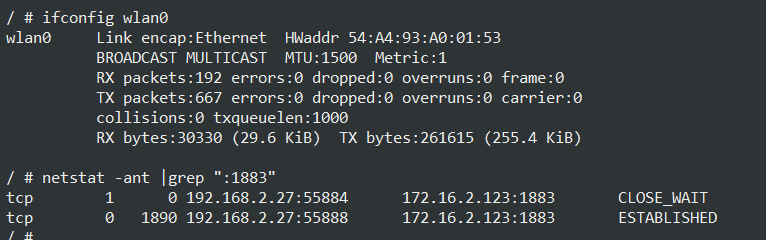

1

我现在有个进程，已经被杀掉了，但是看到的tcp连接状态还一直是established的。

用kill -9 来杀掉进程，这个是不会关闭连接的。

  tcp_keepalive_interval:

Interval for sending keep-alive probes.  


后面又发现新的现象：用ifconfig wlan0 down来关闭网络，这个时候，tcp连接还是established状态。



这个时候我还是继续进行发送，都不报错的。

网上说是：

```
I found documentation for a registry entry named TcpTimedWaitDelay for the TCP/IP service. It describes the default to be 240 seconds (4 minutes) and suggests it be set to 30.
```

并不是这个。

```
Ah, I see. Well, that didn't work because TcpTimedWaitDelay is used for connections in the TIME_WAIT state not the ESTABLISHED state.
```


说明网线断开对端是不能做任何感知的，除非我们配置操作系统的SO_KEEPALIVE选项，或者进行应用层心跳检测。

如果我们不能接受如此之长的等待时间，从TCP-Keepalive-HOWTO上可以知道一共有两种方式可以设置，一种是修改内核关于网络方面的 配置参数，另外一种就是SOL_TCP字段的TCP_KEEPIDLE， TCP_KEEPINTVL， TCP_KEEPCNT三个选项。

根据上面的介绍我们可以知道对端以一种非优雅的方式断开连接的时候，我们可以设置SO_KEEPALIVE属性使得我们在2小时以后发现对方的TCP连接是否依然存在。 

keepIdle，表示tcp限制这个时间后，开始进行探测。

keepInterval，这个表示探测的间隔时间。

keepcount，这个表示探测的次数。

```
int                 keepIdle = 1000;
int                 keepInterval = 10;
int                 keepCount = 10;
Setsockopt(listenfd, SOL_TCP, TCP_KEEPIDLE, (void *)&keepIdle, sizeof(keepIdle));
Setsockopt(listenfd, SOL_TCP,TCP_KEEPINTVL, (void *)&keepInterval, sizeof(keepInterval));
Setsockopt(listenfd,SOL_TCP, TCP_KEEPCNT, (void *)&keepCount, sizeof(keepCount));
```


```
/proc/sys/kernel # sysctl -A | grep keep  
net.ipv4.tcp_keepalive_intvl = 75         
net.ipv4.tcp_keepalive_probes = 9         
net.ipv4.tcp_keepalive_time = 7200        
```


参考资料

1、

https://community.hpe.com/t5/Networking/process-has-bean-killed-but-the-tcp-connection-still-established/td-p/4324643#.XoWaQGmHqJA

2、https://www.sevenforums.com/network-sharing/180309-tcp-established-status-even-after-network-cable-unplugged.html

3、TCP连接拔掉网线后会发生什么

https://blog.csdn.net/larry_zeng1/article/details/78437050

4、SO_KEEPALIVE选项

https://blog.csdn.net/qianyumolu/article/details/23196735

5、

https://www.ibm.com/developerworks/cn/aix/library/0808_zhengyong_tcp/index.html