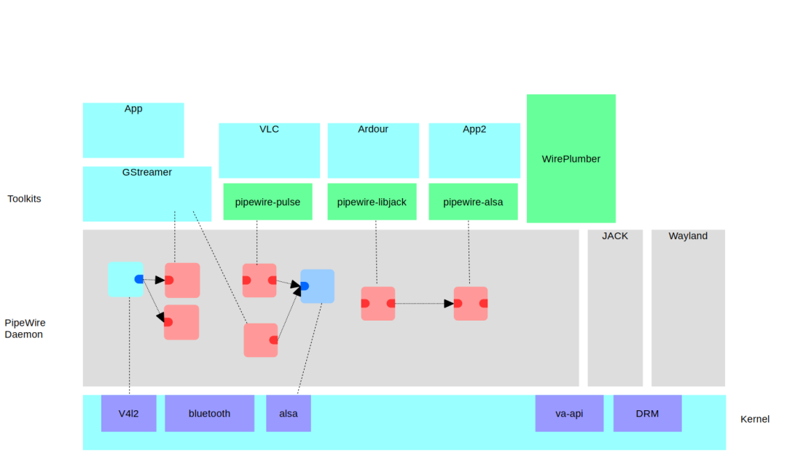
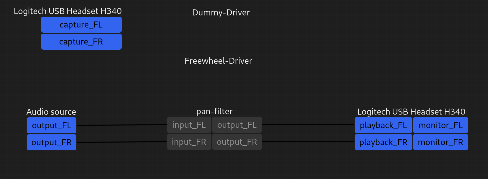
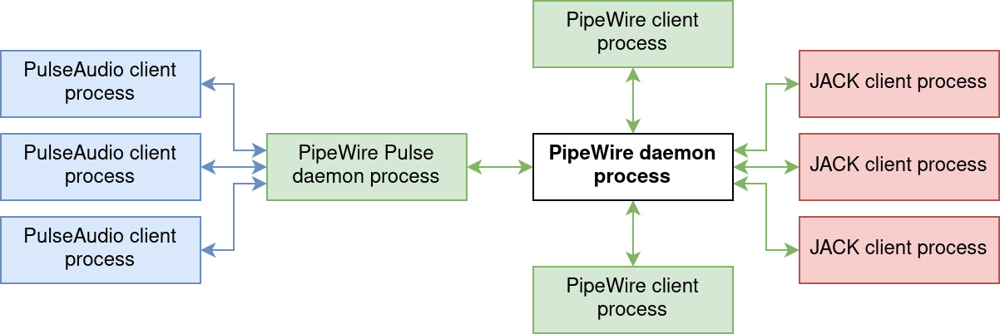
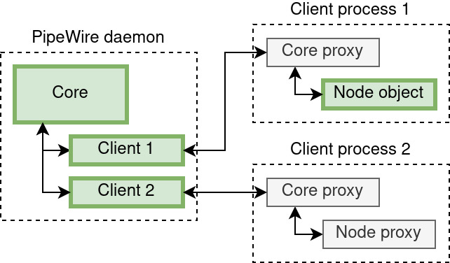
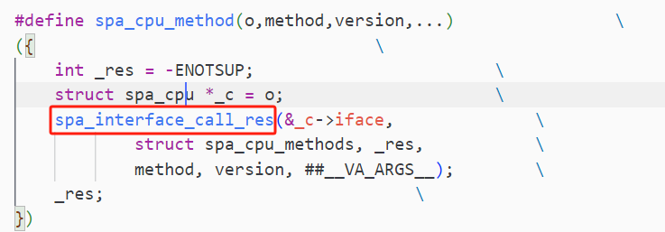

--

# 一些认识

pipewire在命令行操作的关键就是：

使用pw-link进行node 的连接操作。

在有gui的时候，就是用鼠标拖拽来进行连接和断开。


# 资源收集

bootlin的文章，非常好。高屋建瓴。

https://bootlin.com/blog/an-introduction-to-pipewire/

https://bootlin.com/doc/training/audio/audio-slides.pdf

https://bootlin.com/blog/hands-on-installation-of-pipewire/

arch wiki

https://wiki.archlinuxcn.org/wiki/PipeWire

官方仓库的wiki，这里算是最权威的最及时的信息了。

https://gitlab.freedesktop.org/pipewire/pipewire/-/wikis/home

尤其是这个QA，回答了很多我关心的问题。

https://gitlab.freedesktop.org/pipewire/pipewire/-/wikis/FAQ

这里说明了配置的详细含义。

https://gitlab.freedesktop.org/pipewire/pipewire/-/wikis/Config-PipeWire

这篇文章不错，提到了大量的专业音频软件。值得学习一下。这个作者写了大量的XX-Guide的仓库。质量看起来都不错。

https://github.com/mikeroyal/PipeWire-Guide

这篇文章非常务实。很好。

https://denilson.sa.nom.br/blog/2023-12-26/pipewire-conf-examples

https://denilson.sa.nom.br/blog/2023-11-10/pipewire-multiple-ports

这篇文章，高屋建瓴。

https://venam.net/blog/unix/2021/06/23/pipewire-under-the-hood.html

# 我的疑问

pipewire不能开箱即用吗？

```
install pipewire-libpulse pipewire-libjack pipewire-alsa
```

我确实建议重新启动，以 100% 确定您位于 PipeWire 系统上，所有内容都通过 PipeWire 输出。完成后，您就可以开始测试了！

需要把对接pulseaudio、jack、alsa的支持都安装上。这样才能无缝衔接。

给asound.conf加上pipewire的配置。这样aplay默认就是通过pipewire输出了。

https://blogs.gnome.org/uraeus/2020/09/04/pipewire-late-summer-update-2020/

# 简介

PipeWire 由 Red Hat 首席工程师兼 GStreamer 多媒体框架的共同创建者 Wim Taymans 创建。


PipeWire 是一个服务器和 API，

用于在 Linux 上处理多媒体。

==它最常见的用途是为 Wayland 和 Flatpak 应用程序实现屏幕共享、远程桌面以及不同软件之间其他形式的音频和视频路由。==

根据它的官方FAQ，“你可以把它看作是应用程序和库可以使用的驱动之上的多媒体路由层”。

相较于 PulseAudio 专注于消费级音频和 JACK 专注于专业级音频，PipeWire 的目标是为所有级别的用户工作。

在其他技术中，==PipeWire 通过提供在不同的缓冲区大小之间动态切换的能力来实现这一目标==，以适应不同音频应用的不同延迟要求。

在 Debian 10 中，PipeWire 0.2.5 是可用的，它应该不需要手动安装，因为它通常被使用它的应用程序作为一个依赖项带入。

在 Debian 11中，PipeWire 0.3.19 是可用的，并且可以试验性地用来替代 [ALSA](https://wiki.debian.org/ALSA) 用户空间库、[PulseAudio](https://wiki.debian.org/PulseAudio) 和 [JACK](https://wiki.debian.org/JACK)。这是一个存在文档但不支持的用例。

在 Debian Testing 和 Debian Unstable 中有更新的 PipeWire 版本。对于这些分发的用户来说，PipeWire 应该更加可靠，在许多用例下可以很好地替代。

# 概念

当然，我可以帮助你理解和掌握PipeWire的相关概念和设计思路。PipeWire是一个现代的多媒体框架，旨在替代PulseAudio和JACK，并提供视频处理功能。以下是PipeWire的关键概念和设计思路：

**1. PipeWire的基本概念**

| 概念         | 描述                                           |
| ------------ | ---------------------------------------------- |
| **PipeWire** | 一个多媒体服务器，用于处理音频和视频流。       |
| **Graph**    | 一个音频/视频处理管道，由节点和链接组成。      |
| **Node**     | 图中的处理单元，如音频源、音频处理器或视频源。 |
| **Link**     | 在节点之间传输数据的连接。                     |
| **Client**   | 使用PipeWire API的应用程序。                   |
| **Session**  | 管理不同应用程序和设备的连接和配置。           |

**2. PipeWire的设计思路**

| 设计理念       | 详细描述                                             |
| -------------- | ---------------------------------------------------- |
| **统一框架**   | 通过统一的框架处理音频和视频，取代PulseAudio和JACK。 |
| **低延迟**     | 设计低延迟音频处理，适合专业音频工作和实时应用。     |
| **模块化设计** | 采用模块化设计，可以灵活扩展和定制功能。             |
| **安全性**     | 增强的安全性，通过权限管理控制应用对设备的访问。     |
| **兼容性**     | 兼容现有的PulseAudio和JACK应用程序，提供平滑过渡。   |
| **插件系统**   | 支持插件系统，允许第三方开发者扩展功能。             |
| **高性能**     | 利用现代硬件特性，实现高效的多媒体处理。             |

**3. PipeWire的优势**

| 优势             | 描述                                               |
| ---------------- | -------------------------------------------------- |
| **统一的API**    | 简化了开发者的工作，减少了不同框架之间切换的麻烦。 |
| **高效资源管理** | 优化资源利用率，减少CPU和内存消耗。                |
| **实时性能**     | 提供高性能、低延迟的实时音频处理能力。             |
| **灵活性**       | 灵活的配置和管理，适用于多种应用场景。             |
| **丰富的功能**   | 支持复杂的音频路由和视频处理功能。                 |

希望这些信息能帮助你更好地理解PipeWire。如果有更具体的问题或需要更详细的解释，请告诉我。

# session的具体说明，怎样实现一个session管理器


# module-adapter

`module-adapter` 是 PipeWire 中的一个模块，

用于适配和桥接不同的音频和视频设备，

使其能够在统一的框架下进行管理和互操作。

它的主要功能包括设备的抽象、格式转换、设备代理等。

以下是 `module-adapter` 的具体功能和作用。

**1. module-adapter 的主要功能**

| 功能         | 描述                                                       |
| ------------ | ---------------------------------------------------------- |
| **设备抽象** | 提供一个通用的接口来抽象不同类型的音频和视频设备。         |
| **格式转换** | 处理不同设备之间的格式转换，例如采样率、声道数等。         |
| **设备代理** | 创建设备代理（代理设备），用于统一管理和控制物理设备。     |
| **兼容性**   | 确保旧的应用程序和设备能够在新的 PipeWire 环境中正常工作。 |
| **动态配置** | 动态调整设备的配置和参数，以适应不同的使用场景。           |
| **同步**     | 保持多设备之间的时间同步，确保音视频流的同步性。           |
| **性能优化** | 提供高效的音视频处理路径，减少延迟和资源消耗。             |

**2. module-adapter 的作用**

`module-adapter` 的作用是将不同类型的音频和视频设备适配到 PipeWire 框架中，使它们能够互相协作并统一管理。通过抽象设备的特性和提供通用接口，`module-adapter` 实现了以下几项关键功能：

1. **设备抽象和管理**：将不同类型的设备（如声卡、麦克风、摄像头等）抽象成统一的接口，使得应用程序可以通过统一的API进行访问和控制。

2. **格式和协议转换**：处理不同设备之间的格式和协议差异，例如将不同采样率和声道数的音频数据进行转换，以确保数据可以在不同设备之间顺利传输。

3. **设备代理和虚拟设备**：创建设备代理，使得应用程序可以将物理设备视为虚拟设备进行操作，从而实现更灵活的配置和管理。

4. **兼容性支持**：通过适配旧的音频和视频设备，确保它们能够在新的 PipeWire 环境中正常运行，从而提供向后兼容性。

5. **动态配置和同步**：根据使用场景动态调整设备的配置和参数，并保持多设备之间的时间同步，以确保音视频流的同步性和高质量的用户体验。

**3. 使用 module-adapter 的示例**

以下是如何在 PipeWire 配置文件中加载 `module-adapter` 的示例配置：

```ini
context.modules = [
    { name = libpipewire-module-adapter
      args = {
        factory.name          = "adapter"
        node.name             = "my_audio_adapter"
        node.description      = "My Audio Adapter"
        media.class           = "Audio/Source"
        audio.format          = "S16LE"
        audio.rate            = 48000
        audio.channels        = 2
        object.linger         = true
        object.features       = [ "monitor" ]
      }
    }
]
```

**说明**：
1. **factory.name**：指定要使用的工厂名称，例如 `adapter`。
2. **node.name** 和 **node.description**：为创建的节点指定名称和描述。
3. **media.class**：指定媒体类型，例如 `Audio/Source`。
4. **audio.format**、**audio.rate** 和 **audio.channels**：指定音频格式、采样率和声道数。
5. **object.linger**：确保对象在没有引用时也不会被销毁。
6. **object.features**：指定对象的特性，例如 `monitor`。

通过上述配置，可以加载 `module-adapter` 并创建一个音频源节点，将其适配到 PipeWire 框架中进行统一管理。这样，应用程序可以通过 PipeWire 的 API 访问和控制该音频源节点，从而实现音频设备的抽象和适配。

PipeWire 是一个用于处理音频和视频流的开源服务器。

它旨在成为 PulseAudio 和 JACK 的替代品，并提供更加现代化、灵活和强大的功能。

以下是 PipeWire 的一些关键特点和功能：

1. **统一的多媒体服务器**: PipeWire 的设计目标是作为一个统一的多媒体服务器，能够处理音频和视频流，并提供类似于 PulseAudio 和 JACK 的功能。这意味着它可以同时处理音频和视频，并在不同的应用程序之间共享这些流。

2. **跨平台支持**: PipeWire 在设计上具有跨平台的特性，因此可以在多个操作系统上运行，包括 Linux、BSD 和 Android 等。

3. **低延迟和高性能**: PipeWire 旨在提供低延迟和高性能的音频处理能力，使其适用于专业音频应用程序，如音乐制作和音频编辑等。

4. **模块化架构**: PipeWire 的架构设计非常灵活，可以通过各种插件和模块来扩展其功能，从而满足不同用户和应用程序的需求。

5. **兼容性和向后兼容性**: PipeWire 致力于与现有的音频和视频框架保持兼容，并提供向后兼容性，以便平稳过渡到新的系统。

6. **集成应用程序支持**: PipeWire 支持与各种应用程序集成，包括桌面环境、浏览器和多媒体播放器等，从而为用户提供更好的音频和视频体验。

总的来说，PipeWire 是一个新兴的多媒体服务器，旨在改善 Linux 和其他操作系统上的音频和视频处理能力，使其更加现代化、灵活和强大。


PipeWire支持所有软件的信号IO。

无论软件使用什么后端接入，做到信号流程一体化。

在低延迟下，解决以前不同后端各自为战的问题。





目前正在进行一项巨大的努力，

以在 Flatpak 等容器化技术的帮助下将 Linux 桌面带入未来。

本练习的目标之一是创建一个明确的安全屏障，

将应用程序彼此之间以及与系统分开。

媒体堆栈是应用程序通常无法与此模型协作的一个领域，

需要直接访问硬件，

因为需要交换大量数据，而低延迟通常至关重要。

==PipeWire 是这个难题中缺失的一块，==

==它允许应用程序以高效而安全的方式访问硬件设备。==

PipeWire 最初创建时仅处理对视频资源的访问，并与 PulseAudio 共存。

早期版本已经在 Fedora 中发布了一段时间，

允许 Flatpak 应用程序访问摄像机并在 Wayland 上实现屏幕共享。

==最终，PipeWire 最终可以处理任何类型的媒体，并计划在未来完全取代 PulseAudio。==

新的 0.3 版本被标记为音频支持的预览版。


但为什么要更换 PulseAudio？

尽管 PulseAudio 已经提供了一个有效的中间层来访问音频设备，

但 PipeWire 必须提供更多 PulseAudio 无法提供的功能，

首先是更好的安全模型，

该模型允许应用程序之间的隔离和容器内的安全访问。


PipeWire 的另一个有趣的功能是它统一了桌面上使用的两个音频系统，

JACK 用于低延迟专业音频，

PulseAudio 用于普通桌面用例。

PipeWire 旨在能够适应这两种用例，

==提供非常低的延迟，同时不浪费 CPU 资源。==

这种设计也使 PipeWire 成为比 PulseAudio 更高效的解决方案，使其也非常适合嵌入式用例。


幸运的是，一旦 PipeWire 足够稳定，可以成为 Linux 上的默认音频服务，

音频应用程序就不需要立即更新，

==因为项目中还包含了 ALSA、PulseAudio 和 JACK 的兼容性 API，==

使应用程序透明地连接到 PipeWire 守护程序，无需更改任何代码，甚至无需重新编译。

但是，我们预计大多数应用程序最终将更新为使用 PipeWire 的本机 API 来清理其依赖项，

并能够使用更高级的 PipeWire 功能。

值得庆幸的是，使用 GStreamer 的应用程序可以轻松切换到使用 PipeWire 提供的 GStreamer 元素


就像 PulseAudio 一样，

==PipeWire 是一个在后台运行的守护程序，==

==充当多媒体应用程序（客户端）和设备之间的中间层。==

这个中间层的主要作用是将这些应用程序连接到设备，

允许它们播放或捕获媒体，同时尊重访问权限。


与 PulseAudio 的一个关键区别是 PipeWire 如何进行会话和策略管理。

虽然 PulseAudio 有自己的预定义逻辑，

即哪些应用程序连接到哪些设备以及何时连接到，

但 PipeWire 本身对此无能为力。

==PipeWire 仅提供创建媒体流的方法，==

==而管理逻辑是在外部组件（会话管理器）中实现的。==

由于此管理逻辑取决于平台和该平台正在处理的用例，

因此拥有外部会话管理器可以让开发人员更轻松地使 PipeWire 的行为适应任何类型的情况。


在 Collabora，作为我们汽车级 Linux 工作的一部分，

我们一直在开发一个可扩展的会话管理器 WirePlumber。

这对于将 PipeWire 集成到 AGL 中是必要的，

因为 PipeWire 本身仅附带一个示例会话管理器，

该会话管理器不会针对简单桌面用例以外的任何内容进行扩展。

WirePlumber 目前专注于汽车和其他嵌入式用例，

但我们很快将添加桌面支持，

从而可以替换用于桌面测试的示例会话管理器。

我们将来会在博客上写更多关于 WirePlumber 的文章，

解释编写它的动机、我们的设计选择以及我们在开发过程中取得的进一步进展。

# buildroot下使用pipewire

这篇文章非常不错。

https://bootlin.com/blog/hands-on-installation-of-pipewire/

在启动过程中，守护程序会尝试创建客户端将用来与其通信的 UNIX 套接字;

其默认名称为 `pipewire-0` 。

但是，如果没有特定的环境变量，PipeWire 不知道该把它放在哪里。

因此，解决方法是 `pipewire` 使用 `XDG_RUNTIME_DIR` 变量集进行调用：

```
$ XDG_RUNTIME_DIR=/run pipewire
[W][03032.468669] pw.context   | [       context.c:  353 pw_context_new()] 0x507978: can't load dbus library: support/libspa-dbus
[E][03032.504804] pw.module    | [   impl-module.c:  276 pw_context_load_module()] No module "libpipewire-module-rt" was found
[E][03032.530877] pw.module    | [   impl-module.c:  276 pw_context_load_module()] No module "libpipewire-module-portal" was found
```

仍然会出现一些警告，但它们不会阻止 PipeWire 的进程：

第一行是意料之中的，因为我们编译了不支持 D-Bus 的 PipeWire。

第二个原因是默认配置调用了一个 PipeWire 模块，该模块使用 setpriority（2） 使守护进程实时，并使用带有 SCHED_FIFO的 pthread_setschedparam（3） 使线程实时。直到最近，如果 D-Bus 支持不可用，该模块才被编译，因为它对 RTKit 有一个回退（D-Bus RPC 要求增强的进程优先级，用于避免为每个进程授予权限）。这在较新的版本中得到了修复，因为如果 D-Bus 不可用，该模块现在正在编译时没有 RTKit 回退，但我们使用的稳定 Buildroot 版本正在打包旧版本的 PipeWire。

第三个指的是 xdg-desktop-portal 中的门户，这是一个基于 D-Bus 的接口，用于向 Flatpak 应用程序公开各种 API。对于嵌入式用途，这对我们来说无关紧要。

可以覆盖默认的 PipeWire 守护程序配置以删除这些警告：

 `support.dbus` in `context.properties` 控制 D-Bus 库的加载，要加载的模块在 中 `context.modules` 声明。

默认配置位于 ， `/usr/share/pipewire/pipewire.conf` 

覆盖的一个好方法是新建的 `/etc/pipewire` 同名文件。

提示：PipeWire 的日志记录使用 `PIPEWIRE_DEBUG` 环境变量进行控制，如文档中所述。


我们没有看到ALSA PCM设备的原因是

PipeWire不负责监控 `/dev` 和向图形添加新节点;

这是我们session manager的责任。

WirePlumber 的配置需要从默认值更新，以避免由于缺少一些可选依赖项而崩溃。

要更新它，推荐的方法与 PipeWire 相同：

使用位于 中的 `/etc/wireplumber` 配置文件重载配置文件。

以下是默认配置的问题：

最后两个问题可以通过使用以下 Lua 配置脚本来解决 `/etc/wireplumber/main.lua.d/90-disable-dbus.lua` ：

```
alsa_monitor.properties["alsa.reserve"] = false
default_access.properties["enable-flatpak-portal"] = false
```

完成所有操作后，WirePlumber 的守护程序将继续运行并成功连接到 PipeWire：


就是这样

WirePlumber 现在已经检测到我们的 ALSA 接收器和源，并将它们作为节点添加到 PipeWire 图中。

它将检测我们添加到图形中的源节点，并将它们链接到 ALSA 接收器节点，输出音频供我们的耳朵欣赏。


# collabora公司介绍

这家公司对pipewire贡献了一些代码。

**公司名称:** Collabora  
**总部地点:** 全球各地，总部位于英国剑桥  
**成立时间:** 2005年  
**主要业务:** 提供开源软件咨询和解决方案，专注于开源技术的开发和支持  

**产品和服务:**

- **Collabora Office Suite:** 基于LibreOffice技术的企业办公套件，支持文档处理和协作功能。
- **Collabora Online:** 基于LibreOffice技术的在线文档编辑和协作平台，可嵌入到各种应用程序中。
- **专业服务:** 为客户提供定制化的开源软件开发、咨询和支持服务，包括Linux内核开发、嵌入式系统、图形驱动程序开发等。
- **培训服务:** 针对开源软件的培训课程，包括Linux、LibreOffice等。
- **合作伙伴关系:** 与多家硬件厂商、软件开发商和Linux发行版提供商合作，为客户提供完整的开源解决方案。

**公司特点:**
- Collabora是开源软件领域的重要参与者，为客户提供开源软件的定制化解决方案。
- 公司拥有广泛的开源软件开发经验和专业知识，致力于推动开源技术的发展和应用。
- Collabora秉承开放、透明、合作的理念，与全球开源社区和合作伙伴共同推动开源软件的创新和普及。


# pipewire和pulseaudio关系

Pipewire 和 PulseAudio 都是音频服务器，它们在 Linux 系统上提供音频流的管理和路由功能。它们之间的关系可以从几个方面来理解：
1. **功能和目的**:
   - **PulseAudio** 是一个老牌的音频服务器，它提供了一个统一的音频接口，使得所有音频应用程序可以通过它来播放和录制音频。PulseAudio 支持多种音频协议和设备，并且提供了丰富的配置选项。
   - **Pipewire** 是一个较新的多媒体处理框架，它不仅支持音频，还支持视频和其他媒体类型。Pipewire 的设计目标是提供更好的性能和灵活性，以及支持专业音频和视频应用。
2. **兼容性和互操作性**:
   - Pipewire 提供了一个 PulseAudio 兼容层，这意味着它可以模拟 PulseAudio 服务器的行为，使得原本为 PulseAudio 编写的应用程序可以在 Pipewire 上运行，而不需要修改。这样，用户可以逐渐迁移到 Pipewire，而不会立即失去对现有应用程序的支持。
3. **技术发展和社区支持**:
   - 随着 Pipewire 的发展，它在某些领域（如 Wayland 和 GNOME）已经开始取代 PulseAudio。例如，从 GNOME 42 开始，Pipewire 成为 GNOME 桌面环境的默认音频服务器。
   - 尽管如此，PulseAudio 仍然是一个广泛使用且成熟的解决方案，它有着稳定的用户基础和社区支持。许多现有的 Linux 发行版仍然默认使用 PulseAudio。
4. **选择和配置**:
   - 用户和系统管理员可以根据自己的需求选择使用 PulseAudio 或 Pipewire。两者都可以在同一系统上安装，但通常不会同时运行。
   - 如果系统或桌面环境支持 Pipewire，并且用户希望利用其高级功能，他们可以选择迁移到 Pipewire。对于那些依赖于 PulseAudio 的特定功能或配置的用户，继续使用 PulseAudio 可能是更好的选择。
   总的来说，Pipewire 和 PulseAudio 都是 Linux 音频基础设施的重要组成部分，它们之间的关系是互补的。Pipewire 提供了新的功能和改进，同时保持了对 PulseAudio 的向后兼容性，使得用户和开发者可以平滑过渡到新的音频服务器。随着时间的推移，我们可以期待 Pipewire 在更多的地方取代 PulseAudio，成为 Linux 系统上的主要音频和多媒体处理框架。

## pipewire 跟pulseaudio是竞争关系还是合作关系

PipeWire 和 PulseAudio 之间既有竞争关系，也有合作关系。具体来说，PipeWire 旨在取代 PulseAudio 和 JACK，同时提供更强大的多媒体处理能力。以下是两者之间的关系概述：

| 关系类型 | 详情                                                         |
| -------- | ------------------------------------------------------------ |
| 竞争关系 | PipeWire 设计之初是为了替代 PulseAudio 和 JACK，并提供统一的音频和视频处理框架。 |
| 合作关系 | PipeWire 兼容 PulseAudio，允许现有的 PulseAudio 应用继续运行在 PipeWire 上。 |

竞争关系

1. **目标替代**：PipeWire 的目标是成为 Linux 上的主流音频和视频服务器，替代 PulseAudio 和 JACK。
2. **功能扩展**：PipeWire 提供更广泛的多媒体处理能力，包括音频、视频和低延迟音频。

合作关系

1. **兼容性**：PipeWire 通过 PulseAudio 兼容层，允许大多数 PulseAudio 应用在 PipeWire 上无缝运行。
2. **迁移支持**：为了平滑过渡，PipeWire 支持 PulseAudio 的配置和工具，让用户和开发者可以逐步迁移。

优势对比

| 特性     | PulseAudio   | PipeWire                |
| -------- | ------------ | ----------------------- |
| 音频处理 | 主要处理音频 | 处理音频和视频          |
| 低延迟   | 相对较高     | 更低的延迟              |
| 功能集成 | 仅音频       | 音频和视频的统一处理    |
| 兼容性   | 广泛应用     | 兼容 PulseAudio 和 JACK |
| 未来发展 | 维护阶段     | 活跃开发，功能持续扩展  |

总结

虽然 PipeWire 和 PulseAudio 在功能上有竞争，但为了用户体验和迁移的平滑，PipeWire 也在一定程度上与 PulseAudio 合作，通过兼容层和工具支持现有应用程序。因此，它们之间是竞争与合作并存的关系。


# pipewire的通信基础机制是什么

PipeWire 的通信基础机制主要基于以下几个关键组件和概念：

| 组件/概念              | 详情                                                         |
| ---------------------- | ------------------------------------------------------------ |
| 核心框架               | PipeWire 核心负责整体调度和资源管理，包括节点、链路、缓冲区等。 |
| Graph-based Processing | 使用有向图模型处理音频和视频数据，节点表示数据源、滤波器或接收器。 |
| 共享内存               | 使用共享内存区域在客户端和服务端之间高效传输大块数据，减少数据拷贝。 |
| Unix 套接字            | 使用 Unix 套接字进行控制消息传递，协调客户端和服务端的操作。 |
| DBus 集成              | 提供 DBus 接口，允许与其他系统服务（如蓝牙管理、音频策略管理）集成。 |
| 事件驱动架构           | 基于事件的架构，确保低延迟和实时响应，适合高性能音视频处理需求。 |

核心机制

1. **Graph-based Processing（基于图的处理）**
    - PipeWire 使用一个有向图（Directed Graph）来表示数据流。
    - 图中的节点（Node）可以是音频源、滤波器、转换器或音频接收器。
    - 节点之间通过链接（Link）连接，形成数据流路径。

2. **共享内存**
    - 数据通过共享内存区域在客户端和服务端之间传输，这种方式比传统的套接字传输效率更高。
    - 减少数据拷贝，提高传输效率，降低延迟。

3. **Unix 套接字**
    - 控制信息和元数据通过 Unix 套接字传递。
    - 套接字用于客户端与服务端之间的通信协调，传递命令、事件和状态信息。

4. **DBus 集成**
    - 提供与系统其他服务（如蓝牙、策略管理）的集成能力。
    - 允许其他服务通过 DBus 与 PipeWire 进行交互和控制。

5. **事件驱动架构**
    - 基于事件的架构确保系统在需要响应时能够迅速反应，适合实时音视频应用。
    - 使用 epoll 等机制高效地处理大量并发事件。

总结

PipeWire 的通信基础机制通过结合图形化处理模型、共享内存、高效的 Unix 套接字通信和事件驱动架构，提供了一个高性能、低延迟的多媒体处理框架。这使得它在处理复杂音视频流时既高效又灵活，能够满足现代多媒体应用的需求。


# pipewire使用了跟gstreamer类似的pipeline设计模式吗

实际上，pipewire的作者也同时是gstreamer的核心开发者。

PipeWire 在架构上与 GStreamer 有很大不同，设计更像 JACK。

差异包括：


是的，PipeWire 使用了类似于 GStreamer 的 pipeline 设计模式。以下是两者在设计模式上的一些比较和说明：

| 特性           | GStreamer                             | PipeWire                                     |
| -------------- | ------------------------------------- | -------------------------------------------- |
| 基本概念       | 使用 `element` 和 `pad` 组成 pipeline | 使用 `node` 和 `port` 组成 pipeline          |
| 数据流模型     | 基于 pull 和 push 模型的数据流处理    | 基于 pull 和 push 模型的数据流处理           |
| 连接方式       | `pad` 用于连接 `element`              | `port` 用于连接 `node`                       |
| 处理单元       | `element` 表示一个处理单元            | `node` 表示一个处理单元                      |
| 支持的数据类型 | 主要用于音频和视频                    | 支持音频、视频和其他类型的数据               |
| 共享内存       | 通常使用内存缓冲区进行数据传输        | 通过共享内存区域在客户端和服务端之间传输数据 |

主要相似点

1. **Pipeline 架构**
   - 两者都使用了 pipeline 设计模式，其中数据通过一系列处理单元（节点/元素）传输，每个单元执行特定的任务。
   - 这种模式允许灵活地组合和重用不同的处理单元，形成复杂的多媒体处理流程。

2. **节点和端口**
   - GStreamer 中的 `element`（元素）相当于 PipeWire 中的 `node`（节点）。
   - GStreamer 中的 `pad`（插口）相当于 PipeWire 中的 `port`（端口）。
   - 元素和节点都有输入和输出端口，通过这些端口进行连接和数据传输。

3. **数据流处理**
   - 两者都支持基于 pull 和 push 模型的数据流处理，确保数据在 pipeline 中的高效传输。
   - 支持低延迟和高性能的数据处理，适合实时音视频应用。

主要区别

1. **数据类型的支持**
   - GStreamer 主要用于音频和视频流处理。
   - PipeWire 除了音频和视频，还支持其他类型的数据流处理，例如 VR/AR 数据。

2. **共享内存机制**
   - GStreamer 通常使用内存缓冲区进行数据传输。
   - PipeWire 通过共享内存区域在客户端和服务端之间传输大块数据，减少数据拷贝，提高传输效率，降低延迟。

3. **整体架构**
   - GStreamer 是一个用户空间的多媒体框架，独立于系统的音频和视频服务。
   - PipeWire 作为系统级的多媒体框架，试图统一音频和视频处理，取代 PulseAudio 和 JACK，提供更广泛的多媒体支持。

示例比较

GStreamer 示例

创建一个简单的音频播放 pipeline：

```sh
gst-launch-1.0 filesrc location=music.mp3 ! decodebin ! audioconvert ! audioresample ! autoaudiosink
```

PipeWire 示例

在 PipeWire 中，虽然没有直接的命令行工具来创建 pipeline，但可以使用类似 `pw-cli` 等工具进行配置和调试：

```sh
# 列出所有节点
pw-cli ls Node

# 创建一个新的节点（假设有一个简单的音频播放节点）
pw-cli create-node simple-audio-player

# 连接节点的端口
pw-cli connect simple-audio-player:output simple-audio-output:input
```

总结

PipeWire 使用了与 GStreamer 类似的 pipeline 设计模式，但在架构、数据类型支持和系统集成方面有所不同。PipeWire 的设计目标是提供一个统一的多媒体处理框架，涵盖音频、视频和其他数据类型，具有更高的性能和更低的延迟。


# spa_handle_factory 是用的什么设计模式

在 PipeWire 中，`spa_handle_factory` 并不是一个特定的设计模式，而是一种机制或概念，用于创建和管理 SPA（Simple Plugin API）插件的实例。让我解释一下：

**SPA（Simple Plugin API）**

SPA 是 PipeWire 中的一个核心组件，它提供了一种轻量级的、模块化的框架，用于实现各种插件，这些插件可以处理不同类型的媒体流。SPA 提供了一组接口和约定，使得插件之间的交互和集成变得简单而灵活。

**spa_handle_factory**

`spa_handle_factory` 是 SPA 中的一个概念，它代表了一个插件工厂，负责创建和管理特定类型插件的实例。具体来说，`spa_handle_factory` 提供了以下功能：

1. **创建插件实例**：通过 `spa_handle_factory`，可以请求创建一个特定类型的插件实例。
2. **销毁插件实例**：当不再需要插件实例时，可以通过 `spa_handle_factory` 销毁它。
3. **参数配置**：`spa_handle_factory` 可能允许对插件实例进行参数配置，以满足特定的需求。
4. **错误处理**：`spa_handle_factory` 可能会处理插件创建过程中的错误，提供适当的错误处理机制。

**设计模式的相关性**

虽然 `spa_handle_factory` 并不是一个传统意义上的设计模式，但是它的设计与工厂模式有一些相似之处。工厂模式是一种创建型设计模式，旨在提供一个统一的接口，用于创建对象的实例，而不需要暴露对象的创建逻辑。在 PipeWire 中，`spa_handle_factory` 提供了一种类似的机制，用于创建 SPA 插件的实例，封装了插件的创建细节，使得客户端可以通过统一的接口来请求插件的创建，而无需了解插件创建的具体实现细节。

**总结**

`spa_handle_factory` 是 PipeWire 中用于创建和管理 SPA 插件实例的机制，它提供了一种统一的接口，用于请求插件的创建和销毁，并可能提供参数配置和错误处理等功能。虽然它不是一个特定的设计模式，但与工厂模式有一些相似之处，都是为了封装对象的创建过程，提供统一的接口。


# pipewire支持leaudio

自版本 0.3.59 起，PipeWire 支持 LE Audio 的基本音频配置文件 (BAP)，用于(LC3) 的连接同步流 (CIS)

==得益于 PipeWire 的模块化架构，它已为未来的编解码器做好了准备==

它支持双向音频，可以充当中央或外围设备。

在前一种情况下，它允许最终用户选择新的音频配置文件，

而在后一种情况下，它会自动将蓝牙音频流连接到本地音频输入和输出。

这为 BlueZ 和 PipeWire 中的 Auracast 支持铺平了道路。

如果您有兴趣尝试此操作，则必须安装 https://github.com/google/liblc3.git 中的 LC3 编解码器。 

PipeWire 构建必须使用选项“-Dbluez5-codec-lc3=enabled”进行配置。


LE Audio 是蓝牙音频堆栈的全新实现，

它取代了“经典音频”A2DP 和 HFP 配置文件。

它的默认编解码器是 LC3，

==但由于它是对所有内容的重写，因此编解码器只是更改的一小部分。==

主要的Linux LE Audio实现由三个项目组成：

（i）Linux内核，

（ii）BlueZ，

（iii）声音服务器部分，即Pipewire。

LE Audio 实现的主体在 （i） 和 （ii） 中。

Pipewire 部分 （iii） 相对较小且简单，主要负责编解码器支持以及与音响系统其余部分的集成。


https://www.bluez.org/le-audio-support-in-pipewire/

https://gitlab.freedesktop.org/pipewire/pipewire/-/wikis/LE-Audio-+-LC3-support

# pipewire-alsa怎么使用

pipewire-alsa\conf\99-pipewire-default.conf

这个的内容：

```
pcm.!default {
    type pipewire
    playback_node "-1"
    capture_node  "-1"
    hint {
        show on
        description "Default ALSA Output (currently PipeWire Media Server)"
    }
}

ctl.!default {
    type pipewire
}

```

就是把alsa的default录音和播放设备都设置为了pipewire设备。

编写代码是这样：

pipewire-alsa\tests\test-pipewire-alsa-stress.c

对应的alsa插件的实现是：

pipewire-alsa\alsa-plugins\pcm_pipewire.c

## 跟alsa的具体对接

/usr/share/alsa/alsa.conf.d

这个下面放了2个配置文件。

```
50-pipewire.conf          
99-pipewire-default.conf
```

我在我的/etc/asound.conf的最前面加上这2行：

```
<confdir:alsa.conf.d/50-pipewire.conf>
<confdir:alsa.conf.d/99-pipewire-default.conf>
```

现在aplay -L就能识别到了。

更好的做法是直接把这2个文件拷贝到/etc/alsa/conf.d命令下。bluealsa就是把文件拷贝到这个目录下的。


# dbus

PipeWire 需要活动的 D-Bus 用户会话总线。

如果您的桌面环境、窗口管理器或 Wayland 合成器配置为提供此功能，则不需要进一步配置。

否则，可能需要使用 `dbus-run-session(1)` .

PipeWire 还要求在环境中定义 `XDG_RUNTIME_DIR` 环境变量才能正常工作。

在 PipeWire 中，会话管理器负责互连媒体源和接收器以及强制执行路由策略。如果没有会话管理器，PipeWire 将无法运行。


# 写一个pw node

https://bootlin.com/blog/a-custom-pipewire-node/

# 简单指导


## 采样率

默认情况下，PipeWire 启用 1 个采样率 （48000 Hz）。

所有东西都将使用高质量的重采样器重新采样到这个速率。这足以提供良好的默认体验。

你也可以启动多个采样率的支持。

方法是在 `~/.config/pipewire/pipewire.conf.d/10-rates.conf` 创建一个包含以下内容的新文件：

```
# Adds more common rates
context.properties = {
    default.clock.allowed-rates = [ 44100 48000 88200 96000 ]
}
```

您还可以强制采样率为 96000Hz，用于数据处理：

```plaintext
pw-metadata -n settings 0 clock.force-rate 96000
```

您可以切换回到动态采样率选择：

```plaintext
pw-metadata -n settings 0 clock.force-rate 0
```


如果您有一个 （Pro） 声卡，其中每个捕获通道都是不同的麦克风或乐器，则可以从每个通道中制作新的源。

## 切分设备

如果您有一个 （Pro） 声卡，其中每个捕获通道都是不同的麦克风或乐器，则可以从每个通道中制作新的源。

以下示例创建 2 个新源，一个来自通道 1 （AUX0） 的麦克风，一个来自通道 2 （AUX1） 的吉他。请确保将 target.object 更改为卡的名称。

`~/.config/pipewire/pipewire.conf.d/20-mic-split.conf` 创建一个包含以下内容的新文件：

```
context.modules = [
    {   name = libpipewire-module-loopback
        args = {
            node.description = "Microphone"
            capture.props = {
                node.name = "capture.Mic"
                audio.position = [ AUX0 ]
                stream.dont-remix = true
                target.object = "alsa_input.usb-BEHRINGER_UMC404HD_192k-00.pro-input-0"
                node.passive = true
            }
            playback.props = {
                node.name = "Mic"
                media.class = "Audio/Source"
                audio.position = [ MONO ]
            }
        }
    }
    {   name = libpipewire-module-loopback
        args = {
            node.description = "Guitar"
            capture.props = {
                node.name = "capture.Guitar"
                audio.position = [ AUX1 ]
                stream.dont-remix = true
                target.object = "alsa_input.usb-BEHRINGER_UMC404HD_192k-00.pro-input-0"
                node.passive = true
            }
            playback.props = {
                node.name = "Guitar"
                media.class = "Audio/Source"
                audio.position = [ MONO ]
            }
        }
    }
]
```


以下示例创建了 2 个新的立体声接收器，一个来自通道 1-2 （AUX0-AUX1） 的扬声器，一个来自通道 3-4 （AUX2-AUX3） 的耳机。请确保将 target.object 更改为卡的名称。

`~/.config/pipewire/pipewire.conf.d/20-playback-split.conf` 创建一个包含以下内容的新文件：

```
context.modules = [
    {   name = libpipewire-module-loopback
        args = {
            node.description = "Speakers"
            capture.props = {
                node.name = "Speakers"
                media.class = "Audio/Sink"
                audio.position = [ FL FR ]
            }
            playback.props = {
                node.name = "playback.Speakers"
                audio.position = [ AUX0 AUX1 ]
                target.object = "alsa_output.usb-BEHRINGER_UMC404HD_192k-00.pro-output-0"
                stream.dont-remix = true
                node.passive = true
            }
        }
    }
    {   name = libpipewire-module-loopback
        args = {
            node.description = "Headphones"
            capture.props = {
                node.name = "Headphones"
                media.class = "Audio/Sink"
                audio.position = [ FL FR ]
            }
            playback.props = {
                node.name = "playback.Headphones"
                audio.position = [ AUX2 AUX3 ]
                target.object = "alsa_output.usb-BEHRINGER_UMC404HD_192k-00.pro-output-0"
                stream.dont-remix = true
                node.passive = true
            }
        }
    }
]
```

## upmix

默认情况下，PipeWire 不会将立体声音频上混为多声道 5.1 或 7.1 音频，因为默认行为应该是按原样路由音频，而不是对音频应用滤波器。


您需要在 PulseAudio 客户端、Native PipeWire 客户端和蓝牙设备中手动启用 upmixing。

当pipewire用作蓝牙接收器（扬声器）时，传入的立体声信号可以上混为多声道。

要启用蓝牙输入的上混，请创建包含以下内容的文件 '~/.config/wireplumber/wireplumber.conf.d/40-upmix.conf：

```
# Enables upmixing
stream.properties = {
    channelmix.upmix      = true
    channelmix.upmix-method = psd
    channelmix.lfe-cutoff = 150
    channelmix.fc-cutoff  = 12000
    channelmix.rear-delay = 12.0
}
```

## 音量

客户端和其他应用程序能够更改流的音量。

音量通常表示为 0.0（静音）、1.0（无消音）和 10.0（非常响亮）之间的值。

您可以通过修改各个图层的 `channelmix.min-volume` 和 `channelmix.max-volume` stream 属性来禁用或限制此行为。

将 channelmix.max-volume` 设置为 `channelmix.min-volume` 相同的值实质上是将音量锁定到特定值。

其他最小值/最大值可用于限制音量。

要限制本机客户端或 ALSA 客户端的volume，

请创建一个文件 `~/.config/pipewire/client-rt.conf.d/50-volume-limit.conf` 

```
# Limits volume between 0.0 and 1.0
stream.properties = {
    channelmix.min-volume   = 0.0
    channelmix.max-volume   = 1.0
}
```

要启用蓝牙的音量限制，请创建一个包含以下内容的文件 `~/.config/wireplumber/wireplumber.conf.d/50-volume-limit.conf` ：

```
# Limits volume between 0.0 and 1.0
stream.properties = {
    channelmix.min-volume   = 0.0
    channelmix.max-volume   = 1.0
}
```

要为 wireplumber 制作的 ALSA 节点启用volume限制，请创建一个包含以下内容的文件 `~/.config/wireplumber/wireplumber.conf.d/60-volume-limit.conf` ：

```
monitor.alsa.rules = [
  {
    matches = [
      # This matches the value of the 'node.name' property of the node.
      {
        node.name = "~alsa_.*"
      }
    ]
    actions = {
      update-props = {
        channelmix.min-volume   = 0.0
        channelmix.max-volume   = 1.0
      }
    }
  }
]
```

## 延迟控制

PipeWire 处理图的延迟主要由缓冲区大小和处理图的采样率（称为量子）的组合决定。

量子是每个图形处理周期处理的数据量（以时间为单位）。

默认情况下，PipeWire将根据可用客户端和配置的限制和默认值选择最佳量程。

您可以使用以下命令强制量子，例如 256：

```plaintext
pw-metadata -n settings 0 clock.force-quantum 256
```

您可以通过以下方式再次恢复动态行为：

```plaintext
pw-metadata -n settings 0 clock.force-quantum 0
```

ALSA 客户端使用额外的环形缓冲区，这可能会增加延迟。

==使用 `PIPEWIRE_ALSA` 环境变量来控制 ALSA 客户端的缓冲区大小和周期大小：==

```plaintext
PIPEWIRE_ALSA='{ alsa.buffer-bytes=16384 alsa.period-bytes=128 }' aplay ...
```

# 环境变量

https://docs.pipewire.org/page_man_pipewire_1.html

这里列举了很多环境变量。

`PIPEWIRE_LATENCY` 环境变量可用于配置应用程序的延迟：

`PIPEWIRE_RUNTIME_DIR` `USERPROFILE` ， `XDG_RUNTIME_DIR` 用于查找服务器（和本机客户端）上的 PipeWire 套接字。


 `PIPEWIRE_CORE` 是要创建的套接字的名称。


 `PIPEWIRE_REMOTE` 是要连接到的套接字的名称。


 `PIPEWIRE_DAEMON` 设置为 true，则进程将成为新的 PipeWire 服务器。

`PIPEWIRE_CONFIG_DIR` `HOME` ， `XDG_CONFIG_HOME` 用于查找配置文件目录。


 `PIPEWIRE_CONFIG_PREFIX` 并 `PIPEWIRE_CONFIG_NAME` 用于覆盖应用程序提供的配置前缀和配置名称。


 `PIPEWIRE_NO_CONFIG` 启用 （false） 或禁用 （true） 覆盖默认配置。


最小/最大/默认量子分别为 0.6ms （32/48000）、170.6ms （8192/48000） 和 21.3ms （1024/48000）。

正如配置文件所解释的那样，配置选项可以拆分为单独的文件。数字表示它们的加载顺序，以下是示例：

# client的配置

客户端配置文件遵循通用 PipeWire 配置文件。

对于客户端， `core.daemon` 该属性通常设置为 false。

客户端通常只有一组有限的 `context.spa-libs` ，通常用于创建音频节点和轮询循环。

# alsa插件

ALSA 插件使用 client-rt.conf 文件。

所有 ALSA 客户端都将创建一个流，因此流属性和规则将照常工作。

指示 ALSA 客户端链接到特定的接收器或源 `object.serial` 或 `node.name` .

例如：

```plaintext
PIPEWIRE_NODE=alsa_output.pci-0000_00_1b.0.analog-stereo aplay ...
```


在给定的音频接收器上播放播放。

# so文件

/usr/lib/pipewire-0.3目录下：

```
libpipewire-module-access.so
libpipewire-module-adapter.so
libpipewire-module-client-device.so
libpipewire-module-client-node.so
libpipewire-module-combine-stream.so
libpipewire-module-echo-cancel.so
libpipewire-module-fallback-sink.so
libpipewire-module-filter-chain.so
libpipewire-module-link-factory.so
libpipewire-module-loopback.so
libpipewire-module-metadata.so
libpipewire-module-netjack2-driver.so
libpipewire-module-netjack2-manager.so
libpipewire-module-parametric-equalizer.so
libpipewire-module-pipe-tunnel.so
libpipewire-module-portal.so
libpipewire-module-profiler.so
libpipewire-module-protocol-native.so
libpipewire-module-protocol-pulse.so
libpipewire-module-protocol-simple.so
libpipewire-module-raop-sink.so
libpipewire-module-rt.so
libpipewire-module-rtp-sap.so
libpipewire-module-rtp-sink.so
libpipewire-module-rtp-source.so
libpipewire-module-session-manager.so
libpipewire-module-spa-device-factory.so
libpipewire-module-spa-device.so
libpipewire-module-spa-node-factory.so
libpipewire-module-spa-node.so
libpipewire-module-vban-recv.so
libpipewire-module-vban-send.so
```


# 为什么配置都是用libpipewire-module-loopback 这个

`libpipewire-module-loopback` 是 PipeWire 中一个常用的模块，用于创建音频环回设备。

它允许音频数据从一个源流到另一个目标，实现音频的重路由和环回。

这在音频处理和配置中非常有用，特别是在需要将音频从一个输入设备传输到一个输出设备时。

为什么使用 `libpipewire-module-loopback`

1. **音频重路由**：可以将音频从一个源重路由到另一个目标，例如将麦克风输入重路由到扬声器输出，或将应用程序的音频输出重路由到另一个应用程序的音频输入。

2. **实时音频处理**：在实时音频处理中，可以使用环回设备将音频流传输到处理模块进行处理，然后再输出到目的设备。

3. **音频测试和调试**：在音频系统测试和调试过程中，环回设备可以帮助捕捉和分析音频流，确保音频数据传输的正确性。

4. **灵活性**：通过配置 `libpipewire-module-loopback`，==可以实现复杂的音频路由方案，以满足不同的音频处理需求。==

使用 `libpipewire-module-loopback` 的配置示例

下面是一个如何配置 `libpipewire-module-loopback` 模块的示例配置文件：

```ini
context.modules = [
    { name = libpipewire-module-loopback
        args = {
            node.name = "loopback-device"
            capture.props = {
                media.class = Audio/Source
                node.description = "Loopback Source"
            }
            playback.props = {
                media.class = Audio/Sink
                node.description = "Loopback Sink"
            }
        }
    }
]
```

配置文件说明

- `context.modules`：这是一个模块加载列表，PipeWire 在启动时会加载这些模块。
- `name = libpipewire-module-loopback`：指定加载 `libpipewire-module-loopback` 模块。
- `args`：提供模块的参数。
  - `node.name`：设置环回设备的节点名称。
  - `capture.props`：设置捕获端口的属性，例如媒体类和节点描述。
  - `playback.props`：设置回放端口的属性，例如媒体类和节点描述。

示例解释

1. **加载模块**：加载 `libpipewire-module-loopback` 模块来创建一个环回设备。
2. **设置节点名称**：将环回设备命名为 `loopback-device`。
3. **捕获属性**：设置捕获端口的属性，使其显示为 `Audio/Source`，并描述为 `Loopback Source`。
4. **回放属性**：设置回放端口的属性，使其显示为 `Audio/Sink`，并描述为 `Loopback Sink`。

使用场景

- **将麦克风输入重定向到虚拟设备**，从而使多个应用程序可以同时访问麦克风输入。
- **创建虚拟音频设备**，将来自不同应用程序的音频流合并到一个虚拟输出设备中。
- **实时音频效果处理**，将输入音频流传递到处理模块，再输出处理后的音频。

通过配置 `libpipewire-module-loopback`，你可以灵活地管理和路由音频流，满足各种复杂的音频处理需求。这使得 PipeWire 在专业音频处理和一般桌面音频管理中都非常强大和灵活。

# XDG_CONFIG_DIR的内容

XDG_CONFIG_DIR的内容生成了这些：

```
# ls -lh
total 0      
drwx------    3 root     root          60 Jan  1 03:56 dbus-1
srwxr-xr-x    1 root     root           0 Jan  1 03:56 pipewire-0
srwxr-xr-x    1 root     root           0 Jan  1 03:56 pipewire-0-manager
-rw-r-----    1 root     root           0 Jan  1 03:56 pipewire-0-manager.lock
-rw-r-----    1 root     root           0 Jan  1 03:56 pipewire-0.lock
```

# SPA

SPA 的原始用户是 PipeWire，

它使用 SPA 来实现低级多媒体处理插件、设备检测、mainloops、CPU 检测、日志记录等。

但是，SPA 可以在 PipeWire 之外使用

SPA（Simple Plugin API）是一个可扩展的API，用于实现各种插件。

它的灵感来自许多其他插件 API，主要是 LV2 和 GStreamer。SPA 提供两部分：

* 没有外部依赖项的仅标头 API。

* 一组常用功能的支持库（“插件”）。

通常的方法是 PipeWire 和 PipeWire 客户端可以使用仅标头函数与插件进行交互。这些插件通常在运行时加载（通过 `dlopen(3)` ）。

SPA 在设计时考虑了以下目标：

- 没有依赖关系，SPA 作为一组头文件提供，除了标准 C 库之外，这些文件没有依赖关系。
- 在空间和时间上都非常有效。
- 非常可配置，可在许多不同的环境中使用。插件环境的所有方面都可以配置和更改，例如日志记录、轮询循环、系统调用等。
- 一致的 API。
- 扩展;可以毫不费力地添加新的 API，可以更新和版本控制现有 API。

关于 SPA 标头如何工作的一个非常简单的示例是 Utilities，这是 C 项目通常需要的一组实用程序。SPA 函数使用 `spa_` 命名空间，并且易于识别。

使用spa来进行编译:

```
cc $(pkg-config --cflags libspa-0.2) -o spa-test spa-test.c 
```


SPA 插件是可以在运行时加载的共享库（ `.so` 文件）。

==每个库提供一个或多个“工厂”，==

==每个工厂可以实现多个“接口”。==

然后，使用 SPA 插件的代码使用这些接口（通过 SPA 头文件）与插件进行交互。

例如，PipeWire 守护程序可以加载基于普通 `printf` 记录器或基于 systemd 日志的记录器。

两者都提供了日志接口，

一旦实例化，PipeWire 就不再需要区分这两个日志记录工具。


# spa_node

```
struct spa_node { struct spa_interface iface; };
struct spa_node_info
struct spa_port_info 
struct spa_node_events 
struct spa_node_callbacks 
struct spa_node_methods

```

# debug log

例如， `PIPEWIRE_DEBUG=E,mod.*:D,mod.foo:X` 启用全局错误消息，在所有模块上进行调试，但在 foo 模块上不显示任何消息。

`PIPEWIRE_LOG=<filename>` ：将日志重定向到给定的文件名。

https://gitlab.freedesktop.org/pipewire/pipewire/-/wikis/Troubleshooting

请注意，某些部分（例如蓝牙）在 Wireplumber 内部运行，其日志记录由 Wireplumber 选项控制。

为了调试 Pipewire 守护进程，可以在守护进程运行时更改日志级别： 

```plaintext
pw-metadata -n settings 0 log.level 4
```

# buildroot怎样调整pipewire的conf文件

就是传递配置给meson。

src\daemon\meson.build

这个里面有对conf文件进行处理。

# pw调试方法

https://www.cnblogs.com/jiyong3998/articles/18136900

https://www.cnblogs.com/jiyong3998/articles/18137021

与 JACK 一样，PipeWire 在内部不实现任何连接逻辑。

监视新流并将它们连接到适当的输出设备或App的责任

留给称为会话管理器的外部组件。

目前唯一推荐的会话管理器是**WirePlumber**：

它基于模块化设计，具有实现实际管理功能的 Lua 插件。(搞不懂老外为啥要在一个工程里引入Lua这种解析性语言)。

还有一个会话管理器是**PipeWire Media Session**，不过已经被弃用，取而代之的是 WirePlumber，

不过可以作为学习目的而使用。

Pipewire Media Session是一个非常简单的会话管理器，可以满足一些基本的桌面用例。

它主要用于测试，并作为构建新会话管理器的示例。

可以通过修改meson_options.txt文件来选择使用哪个回话管理器：

value的可选值为wireplumber或者media-session。


在编译wireplumber的时候，编译系统会检测glib的版本。

不建议系统升级glib版本，容易引起系统异常。

可以根据系统目前提供的版本，直接修改meson.build文件即可：

```
glib_req_version = '>= 2.64'
add_project_arguments([
    '-DGLIB_VERSION_MIN_REQUIRED=GLIB_VERSION_2_64',
    '-DGLIB_VERSION_MAX_ALLOWED=GLIB_VERSION_2_64',
  ], language: 'c'
)
```

譬如我的2004系统默认安装的glib版本是2.64，所以我这里直接修改为2.64即可编译。

建议制定prefix安装路径，而不是安装到默认的系统路径，防止对系统的修改。因人而异，也可以直接安装到系统，只是习惯问题。

执行编译命令并生成相关makefie：

```
./autogen.sh --prefix=/home/yji/oss/install
```

PipeWire支持通过systemd启动服务，

顺便在启动PipeWire的时候把wireplumber服务也拉起来。

但是因为是调试，我们不适用systemd命令，而是通过手动的方式启动，

这样可以便于熟悉各个任务的具体工作流程。

所以PipeWire和wireplumber均需要手动启动，

wireplumber作为client连接到PipeWire，

所以调试的时候需要先启动PipeWire后启动wireplumber。

也就是说在VSCode启动了PipeWire，就需要在命令行启动wireplumber。


pipewire 对 PulseAudio 还是有些进步的，

总的来说切换的体验还不错，

不过不能算无痛。

主要动机是 pipewire 对蓝牙解码的支持比较完善，

什么 LDAC、aptx 都可以开箱即用。

并且不少软件已经在直接或间接的依赖pipewire包了，

pipewire其实早就已经装在系统里。

加上最近pc蓝牙连手机播放音频经常卡顿出问题，遂决定尝试换到pipewire 。


说起来简单使用的话切换过程其实相当无痛。

用 pipewire 、pipewire-audio、pipewire-pulse、wireplumber
代替pulseaudio 、pulseaudio-bluetooth

用到zeroconf相关功能的话再用 pipewire-zeroconf 代替 pulseaudio-zeroconf 。

然后注销一下或者手动开关一下音频服务即可。


关于采样率以及格式配置。

**pipewire内部强制使用32位浮点格式，各声卡自动配置最高规格。**

原帖里 [@开源代表](https://tieba.baidu.com/home/main?un=开源代表&fr=pb&ie=utf-8&id=tb.1.64457115.lGpFXLthYWTDivV4GbNRvA) 提到的自动采样率，其实是自动强制开启的。

但是这里有个坑。

pipewire有条配置是：
context.properties = {
...
default.clock.allowed-rates = [ 48000 44100 96000 192000 ]
...
}
限制了允许自动切换的采样率，而且默认这个列表里默认只有48000一个，需要手动把高采样率给加上。

改完重启再听 44.1kHz 的音频立马舒服了。


通过蓝牙连接手机，并使用pc的耳麦打电话。

其实上次想换 pipewire ，

就是想干这事，但是后来用PulseAudio实现了，才搁置了下来。

PulseAudio 目前本身只支持作为 HFP 的 audio gateway 设备连接耳机，

借助ofono可以实现让 PulseAudio 扮演 HFP hands-free unit 角色 。

具体方法很简单：

安装aur里的ofono包，systemctl start ofono.service

然后编辑default.pa，在两个蓝牙相关module后加上个参数

load-module module-bluetooth-policy auto_switch=2
load-module module-bluetooth-discover headset=ofono

重启pa，蓝牙连上手机，手机打电话/微信语音/录音时，pa就会自动切换到HFP 。播放音乐会自动使用a2dp 。

pipewire 内置了hsp/hfp 的支持，wireplumber默认开启蓝牙profile自动切换。
开箱即用。

幽兰代码本上使用的多媒体服务器是PipeWire，它的主要作用是处理由硬件或应用程序提供的视音频流。

从Ubuntu的22.04版本开始，它已经替代了原有的PulseAudio，作为新的多媒体服务器。

https://tieba.baidu.com/p/8366434803

# ubuntu studio

https://ubuntustudio.org/2024/04/ubuntu-studio-24-04-lts-released/

现在来说说重要的事情：

PipeWire 现已成熟，此版本包含 PipeWire 1.0。 

PipeWire 1.0 带来了您所期望的多媒体音频的稳定性和兼容性。

事实上，此时，我们建议使用 PipeWire 来满足专业、专业消费者和日常音频需求。

在拉脱维亚里加举行的 2023 年 Ubuntu 峰会上，

我们的项目负责人 Erich Eickmeyer 使用 PipeWire 演示了现场音频混合，取得了巨大成功，

并使用它完成了一些音频母带制作工作。

 JACK开发者甚至认为它是“JACK 3”。

PipeWire 的 JACK 兼容性配置为开箱即用，并且内部零延迟。

系统延迟可通过 Ubuntu Studio 音频配置进行配置。

因此，我们认为使用 Ubuntu Studio 进行音频制作已经非常成熟，它现在可以在易用性方面与 macOS 和 Windows 等操作系统相媲美，因为它已经准备好开箱即用。


# 幽兰本audio

PipeWire提供了一系列的工具，这些工具可以帮助开发人员快速的获取所需信息并对问题进行排查。

PipeWire的工具均使用`pw-`或`spa-`作为工具名的前缀，下面列出了幽兰代码本上PipeWire相关的全部工具。

```
pw-cat pw-cli pw-dot pw-dsdplay pw-dump pw-jack
pw-link pw-loopback pw-metadata pw-mididump pw-midiplay pw-midirecord
pw-mon pw-play pw-profiler pw-record pw-reserve pw-top

spa-acp-tool spa-inspect spa-json-dump spa-monitor spa-resample
```

在WirePlumber中，可以通过设置`/usr/share/wireplumber/main.lua.d/50-alsa-config.lua`文件中的`alsa_monitor.enabled`属性，决定PipeWire是否从ALSA中获取硬件的配置信息。

# 跟bluez的通信xml

spa\plugins\bluez5\org.bluez.xml


首先，与 unix 域套接字建立连接。默认情况下，套接字被命名为“pipewire-0”，并在以下目录中搜索：

- getenv("PIPEWIRE_RUNTIME_DIR")
- getenv("XDG_RUNTIME_DIR")
- getenv("USERPROFILE") 

我在adb上运行pw-cli等命令，也只需要

```
export XDG_RUNTIME_DIR=/run/user/0
```

而只要我unset这个环境变量。则提示连接不上。


# FAQ

PipeWire 不使用中断（除非选择了专业音频配置文件），

并依靠计时器来读取设备的状态并读取/写入更多数据。

这样一来，时间就不是固定的，延迟可能会根据应用程序的要求而变化。

这暴露了几个问题：

中断之间的读/写位置并不总是准确的。

用户空间不再被 IRQ 唤醒，而是被计时器唤醒。内核没有为此进行优化。在这种情况下，-rt 内核甚至可能表现得更糟，并导致更多的 xrun。


我们建议您卸载 pulseaudio 服务器，并改用 PipeWire pulseaudio 替换服务器。

它具有更好的性能、接口并直接与 PipeWire 音频系统的其余部分集成。

事实上，不支持将 pulseaudio 与为音频配置的 PipeWire 设置一起运行（并且会失败，因为两个服务器都在争夺设备）。

# 一个问题解决的讨论

https://superuser.com/questions/1675877/how-to-create-a-new-pipewire-virtual-device-that-to-combines-an-real-input-and-o

我的问题是：我正在通过语音聊天与一些朋友交谈，在某些时候我也想在其中混合一些音乐。所以我目前的设置是这样的：

```
Microphone (Input device) -> Voice software
Music player -> Headphones (Output device)

```

我想要这个：

```
Music player -> Headphones

Music player -\
               -> ? -> Voice software
Microphone   -/
```


如果要混合语音输入（麦克风）和音乐播放器的输出，则设置如下：

```
Music player -\
               -> Combined Sink/Source -> Virtual Microphone -> Voice software
Microphone   -/
```

创建combined-sink

```
pactl load-module module-null-sink media.class=Audio/Sink sink_name=my-combined-sink channel_map=stereo
```

创建虚拟mic

```
pactl load-module module-null-sink media.class=Audio/Source/Virtual sink_name=my-virtualmic channel_map=front-left,front-right
```

将麦克风和音乐播放器输出连接到combined-sink中

```
pw-link my-combined-sink:monitor_FL my-virtualmic:input_FL
pw-link my-combined-sink:monitor_FR my-virtualmic:input_FR
```


创建combined-sink 这一步的pw-cli工具等价命令：

1. 创建 Null Sink：

   ```
   pw-cli create-node adapter node.name=my-combined-sink media.class=Audio/Sink object.linger=true
   ```
   
2. 获取 Node ID：

   ```
   pw-cli ls Node
   ```

3. 连接音频源到 Null Sink：

   ```
   pw-link [SOURCE_NODE_ID] [SINK_NODE_ID]
   ```

通过以上步骤，你可以使用 PipeWire 的 `pw-cli` 和 `pw-link` 实现与 `pactl load-module module-null-sink` 等价的功能。

创建虚拟mic这一步的等价pw-cli命令：

```
pw-cli create-node adapter \
    node.name=my-virtualmic \
    media.class=Audio/Source/Virtual \
    audio.position=front-left,front-right \
    object.linger=true
```

# pw-loopback和pw-cli创建同样的通路

```
pw-loopback \
    --capture-props="media.class=Audio/Source/Virtual,node.name=my-virtualmic,audio.position=front-left,front-right" \
    --playback-props="media.class=Audio/Sink"
```


**使用 `pw-cli` 创建相同的音频通路**：

- 创建虚拟音频源：

  ```
  pw-cli create-node adapter \
      node.name=my-virtualmic \
      media.class=Audio/Source/Virtual \
      audio.position=front-left,front-right \
      object.linger=true
  ```

- 获取节点ID：

  ```
  pw-cli ls Node
  ```

- 连接虚拟音频源和接收设备：

  ```
  pw-link [SOURCE_NODE_ID] [SINK_NODE_ID]
  ```

通过以上步骤，你可以使用 `pw-loopback` 和 `pw-cli` 创建相同的音频通路，达到类似的效果。


在 `pw-loopback` 命令中，`--capture-props` 用来指定捕获端的属性。以下是对 `pw-loopback -n aml-sink --capture-props '{media.class=Audio/Sink}'` 命令中各个部分的详细解释：


理解 `--capture-props` 设置为 `Audio/Sink`

通常情况下，`--capture-props` 会设置为 `Audio/Source`，表示从一个音频源捕获音频数据。

但在这个特定命令中，将其设置为 `Audio/Sink` 实际上是指将音频从系统中捕获，

并将其作为一个虚拟的音频接收设备进行处理。

为什么不需要指定 `--playback-props`

`pw-loopback` 默认会自动处理播放端的属性，因此在这个特定命令中，不需要显式指定 `--playback-props`。默认情况下，`pw-loopback` 会将捕获的音频发送到默认的音频播放设备。

拓扑结构

以下是一个更详细的Markdown绘图，展示了该命令如何在系统中创建音频流：

```markdown
+--------------------+                +----------------+
|                    |                |                |
|   Audio Source     |                |  Audio Sink    |
| (e.g., Application)|   Capture      |  (e.g., aml-sink)|
|                    | -------------->|                |
+--------------------+                +----------------+
```

在这种情况下：

1. **Audio Source**:
   代表音频源，比如一个播放音乐的应用程序。

2. **Audio Sink (`aml-sink`)**:
   通过 `pw-loopback` 创建的虚拟音频接收设备。这里 `--capture-props '{media.class=Audio/Sink}'` 将捕获的音频数据重定向到 `aml-sink`，而无需显式指定 `--playback-props`。

示例操作步骤总结

1. **创建环回设备 `aml-sink`**：

   ```sh
   pw-loopback -n aml-sink --capture-props '{media.class=Audio/Sink}'
   ```

2. **获取节点ID**：

   ```sh
   pw-cli ls Node
   ```

3. **连接音频源到 `aml-sink`**：

   ```sh
   pw-link [SOURCE_NODE_ID] [AML_SINK_NODE_ID]
   ```

4. **将 `aml-sink` 连接到音频接收设备**：

   ```sh
   pw-link [AML_SINK_NODE_ID] [PLAYBACK_DEVICE_NODE_ID]
   ```

通过以上步骤，你可以创建并使用 `aml-sink` 这个虚拟音频接收设备，实现音频流的环回和重定向。


# 1



“Dummy-Driver”和“Freewheel-Driver”节点没有端口。

这两个是 PipeWire 在特定条件下使用的特殊接收器（带有动态输入端口，当我们将节点连接到它们时会出现）。

注意：大多数追随者节点不支持连接到驱动程序节点。它们保持挂起状态，不会调用其进程回调。但是，某些节点（特别是 JACK 节点）不支持此功能，这也是图形始终包含“Dummy-Driver”节点的原因之一。另一个漂亮的特定节点是“Freewheel-Driver”，它用于尽可能快地记录样本：它是一个驱动程序节点，在上一个周期结束后立即开始下一个周期。


第一个设计选择是==避免直接在 PipeWire 内部处理任何管理逻辑;==

不处理上下文相关行为，例如监视新的 ALSA 设备，并将它们配置为节点，或使用链接自动连接节点。

==相反，它提供了一个 API，允许生成和控制这些图形对象。==

然后，客户端进程依赖此 API 来控制图形结构，而不必担心图形执行过程。


如上所述，PipeWire 守护程序负责处理图形的正确处理（在正确的时间以正确的顺序执行节点并按照链接的描述转发数据）并公开 API 以允许授权客户端控制图形。

PipeWire 设计的另一个关键点是节点处理可以在任何 Linux 进程中完成。

这有几点含义：

PipeWire 守护程序能够执行一些节点处理。例如，这对于将静态配置的 ALSA 设备公开给图形很有用。

任何授权进程都可以创建一个 PipeWire 节点，

并负责所涉及的处理（从输入端口获取一些数据并为输出端口生成数据）。

想要从文件播放立体声音频的进程

可以创建一个具有两个输出端口的节点。


一个进程可以创建多个 PipeWire 节点。

这允许人们创建更复杂的应用程序;

例如，浏览器将能够为每个选项卡创建一个节点，

该节点请求播放音频的功能，从而让会话管理器处理路由：

这允许用户将不同的选项卡源路由到不同的接收器。

另一个示例是需要许多输入的应用程序。




# libpipewire的使用方法

1、使用 `pw_init` 初始化库，其主要目标是设置log

2、创建一个事件循环实例，

3、使用 `pw_context_new` 创建 PipeWire 上下文实例。

4、使用 `pw_context_connect` 将上下文连接到核心守护程序。这做了两件事：它初始化通信方法，并将代理返回到核心对象。

# proxy

代理是一个重要的概念。

它为客户端提供了一个句柄，

用于与位于其他位置但已在核心注册表中注册的 PipeWire 对象进行交互。

这允许人们获取有关此特定对象的信息，

对其进行修改并注册事件侦听器。

因此，事件侦听器是客户端可以在代理对象上 `pw_*_add_listener` 注册的回调，

它需要 `struct pw_*_events` 定义函数指针列表;星号应替换为对象类型。

该 `libpipewire` 库将告知远程对象有关此新侦听器的信息，

以便在发生新事件时通知客户端。



*一个守护程序和两个客户端的架构，其中一个客户端具有指向远程节点的代理*


在此架构中，绿色块是对象（核心、客户端和节点），

灰色块是代理。

虚线块表示进程。

假设客户端进程 2 想要获取客户端进程 1 中节点的状态，则按顺序发生以下情况：

1、客户端进程 2 创建与内核的连接，这意味着：

在守护进程端，将创建一个客户端对象并将其导出到注册表中;

在客户端，获取核心对象的代理，该代理表示与核心的连接。

2、然后，它使用代理来核心，并使用 `pw_core_get_registry` 函数来获取注册表的句柄。

3、它通过将 一个 `struct pw_registry_events` 传递给 `pw_registry_add_listener` ，在注册表 `global` 的事件中注册一个事件侦听器。对于导出到注册表的每个对象，将调用该事件侦听器一次。

4、因此， `global` 事件处理程序将调用一次，并将节点作为参数。发生这种情况时，可以使用节点代理获取节点的代理， `pw_registry_bind` 并且可以在节点代理上使用 `pw_node_add_listener` `struct pw_client_events` 包含用作事件处理程序的函数指针列表时侦听 `info` 事件。

5、因此， `info` 事件处理程序将使用包含节点状态的 `struct pw_node_info` 参数调用一次。然后，每次状态更改时都会调用它。

# 创建pw context需要的配置

当使用 `pw_context_new` 创建 PipeWire 上下文时，

我们提到它会从文件系统中查找并解析配置文件。

若要查找配置文件，PipeWire 需要其名称。


# IPC

作为一个处理多媒体数据、在进程之间传输数据并旨在实现低延迟的项目，它使用的进程间通信是其实现的核心。

前面描述的事件循环是每个 PipeWire 进程（守护进程和每个 PipeWire 客户端进程，包括 WirePlumber、pipewire-pulse 等）的调度机制。

这个循环是 epoll（7） 工具上的一个抽象层。

这个概念相当简单：

它允许人们使用单个阻塞调用来监控多个文件描述符，一旦一个文件描述符可用于操作，该描述符就会返回。

此事件循环的主要入口点是 `pw_loop_add_source` 或其包装器 `pw_loop_add_io` ，它添加要侦听的新文件描述符和回调，以便在操作可能时执行操作。除了循环实例、文件描述符和回调之外，它还采用以下参数：


# minimal.conf

旨在为那些想要在没有会话管理器（ALSA设备、节点和链接的静态配置）的情况下运行PipeWire的人提供一个示例。

# 修改默认audio sink

这样可以

```
pw-metadata 0 'default.audio.sink'
```

当前的值是：

```
update: id:0 key:'default.audio.sink' value:'{"name":"alsa_output._sys_devices_platform_snd_aloop.0_sound_card1.analog-stereo"}' type:'Spa:String:JSON'
```

我应该修改为：

```
alsa_output._sys_devices_platform_auge_sound_sound_card0.stereo-fallback
```

命令：

```
pw-metadata -n default 'default.audio.sink' 0 'alsa_output._sys_devices_platform_auge_sound_sound_card0.stereo-fallback'
```

这个不对。

问了chatgpt，给的答案是：

```
pw-metadata -n default 0 default.audio.sink '{"name":"alsa_output._sys_devices_platform_auge_sound_sound_card0.stereo-fallback"}'
```

这样设置后，的确默认就可以pw-play播放出声了。

符合预期。

再看改配置文件的方式：

```
#define METADATA_DEFAULT_SINK           "default.audio.sink"
#define METADATA_DEFAULT_SOURCE         "default.audio.source"
#define METADATA_CONFIG_DEFAULT_SINK    "default.configured.audio.sink"
#define METADATA_CONFIG_DEFAULT_SOURCE  "default.configured.audio.source"
```


**`METADATA_DEFAULT_SINK` / `METADATA_DEFAULT_SOURCE`**: 动态表示当前使用的默认设备，可能会随着设备的插拔、用户的操作等而变化。

**`METADATA_CONFIG_DEFAULT_SINK` / `METADATA_CONFIG_DEFAULT_SOURCE`**: 静态表示系统配置中的默认设备，一般基于用户设置或系统预定义，不会频繁变化。


在pipewire.conf `context.properties` 里加入

```
default.configured.audio.sink = { "name": "your_device_name" }`
```

但是这个改了没有用。

pw-metadata查询default的内容，还是没有改的。


https://gist.github.com/venam/bd453b4fd673ff8abb9323e69f182045

https://www.reddit.com/r/pipewire/comments/pdtsy9/making_the_a_bluetooth_device_the_default_sink/

# module-protocol-pulse

`module-protocol-pulse` 的作用

1. **兼容性**：
   - 允许旧的 PulseAudio 客户端与 PipeWire 一起使用，保持兼容性。
   - 无需对现有的使用 PulseAudio 的应用程序进行修改。
2. **功能替代**：
   - 替代 PulseAudio，提供更低延迟和更高效的音频处理。
   - 通过使用 PipeWire 的现代音频架构，提供更多的功能和更好的性能。


配置文件示例

在 PipeWire 的配置文件中（例如 `~/.config/pipewire/pipewire.conf` 或系统配置文件 `/etc/pipewire/pipewire.conf`），添加或启用 `module-protocol-pulse` 模块：

```
context.modules = [
    { name = libpipewire-module-protocol-pulse }
]
```

```
+---------------------+           +---------------------+
| PulseAudio Client   |           | PipeWire Server     |
| (e.g., Music Player)|           |                     |
|                     |           | +-----------------+ |
| +-----------------+ |           | |module-protocol-| |
| |  Pulse Protocol | |  -------> | |     pulse      | |
| +-----------------+ |           | +-----------------+ |
+---------------------+           +---------------------+
           |                                 |
           |                                 |
           v                                 v
+---------------------+           +---------------------+
|  PulseAudio Server  |           | PipeWire Audio      |
|                     |           | Processing          |
|  (Deprecated)       |           | (Lower Latency)     |
+---------------------+           +---------------------+

```

pactl还可以用。pacmd不能用。

```
# pacmd list-modules
No PulseAudio daemon running, or not running as session daemon.
```


# 模块的入口函数

```
#define PIPEWIRE_SYMBOL_MODULE_INIT "pipewire__module_init"
#define PIPEWIRE_MODULE_PREFIX "libpipewire-"
```

pw_context_load_module 这个函数里：

```
	if ((init_func = dlsym(hnd, PIPEWIRE_SYMBOL_MODULE_INIT)) == NULL)
		goto error_no_pw_module;
```

pw_context_load_module 这个函数，可以在main函数里直接手动调用。

例如src\examples\export-spa-device.c里：

```
	pw_context_load_module(data.context, "libpipewire-module-spa-device-factory", NULL, NULL);
```

还有在其他module里被调用：

```
DEFINE_MODULE_INFO(module_ladspa_source) = {
	.name = "module-ladspa-source",
	.prepare = module_ladspa_source_prepare,
	.load = module_ladspa_source_load,
	.unload = module_ladspa_source_unload,
	.properties = &SPA_DICT_INIT_ARRAY(module_ladspa_source_info),
	.data_size = sizeof(struct module_ladspa_source_data),
};
```

module_ladspa_source_load里就调用了pw_context_load_module 

那module_ladspa_source又怎么被调用呢？

DEFINE_MODULE_INFO 展开

```
#define DEFINE_MODULE_INFO(name)					\
	__attribute__((used))						\
	__attribute__((retain))						\
	__attribute__((section("pw_mod_pulse_modules")))		\
	__attribute__((aligned(__alignof__(struct module_info))))	\
	const struct module_info name
```

可以看到是在一个特殊的section里：pw_mod_pulse_modules

从名字看，这个是给pulseaudio用的。

这个section怎么被处理了呢？

可以看到这里，就类似linux初始化的时候，循环变量这个section，挨个调用了。

```
src/modules/module-protocol-pulse/module.c:298: extern const struct module_info __start_pw_mod_pulse_modules[];
src/modules/module-protocol-pulse/module.c:299: extern const struct module_info __stop_pw_mod_pulse_modules[];
src/modules/module-protocol-pulse/module.c:301: const struct module_info *info = __start_pw_mod_pulse_modules;
src/modules/module-protocol-pulse/module.c:303: for (; info < __stop_pw_mod_pulse_modules; info++) {
src/modules/module-protocol-pulse/module.c:308: spa_assert(info == __stop_pw_mod_pulse_modules);
```


现在pw-play、aplay、paplay都可以正常出声了。

# 指定hw:0,1这样的设备

https://wiki.archlinux.org/title/PipeWire

这个需求看起来在alsa里很简单，但是我在pipewire这边找了很久就是没有找到简单有效的做法。

pipewire的alsa-monitor这模块使用alsa-card-profiles（简称为acp）来自动探测alsa设备。

如果acp对你来说不可用。你可以禁用这个功能，转而使用ucm。

/etc/wireplumber/wireplumber.conf.d/50-alsa-config.conf 里修改：

```
monitor.alsa.properties = {
	# alsa.use-acp = true
	alsa.use-ucm = true
}
```

```
pw-record --list-targets
```


```
/etc/pipewire/pipewire.conf.d/microphone.conf (or ~/.config/pipewire/pipewire.conf.d/microphone.conf)
context.objects = [
    { factory = adapter
        args = {
            factory.name           = api.alsa.pcm.source
            node.name              = "hw01"
            node.description       = "Undetected Microphone"
            media.class            = "Audio/Source"
            api.alsa.path          = "hw:0,1"
        }
    }
```

测试了，的确是可以的。

```
pw-play --target alsa-hw01 /data/1.wav
```

可以看到的确是可以从我们预期的设备进行播放了。

alsa-hw01对应node.name生成的名字。

# 很多struct impl，这是什么设计模式？

这是一个常见的设计模式，称为"结构体实现"（Struct Implementation）或"结构体封装"（Struct Encapsulation）。

在这种设计模式中，一个结构体（struct）被用来封装数据和实现某些功能，而不是直接将数据和功能暴露给外部。这种设计模式的主要目的是：

1.  隐藏实现细节：通过将数据和实现封装在结构体中，可以隐藏实现细节，使得外部代码无法直接访问内部数据和实现。
2.  提高代码组织性：结构体可以将相关的数据和功能组织在一起，使得代码更易于理解和维护。
3.  提高代码重用性：结构体可以被重用在不同的上下文中，减少代码冗余。

在 PipeWire 中，`struct pw_impl_client` 是一个实现客户端连接的结构体，它封装了客户端连接相关的数据和功能，提供了一种抽象的方式来访问和操作客户端连接。

这种设计模式在 C 语言中非常常见，因为 C 语言不支持面向对象编程（OOP）的概念，如类和对象。结构体实现模式提供了一种类似于 OOP 的封装和抽象的方式来组织代码。


`struct impl` 模式在PipeWire这样的框架中是一种常见的**C语言封装设计模式**，它并非严格的“设计模式”分类（如GoF的23种设计模式），但可以归类为**对象私有化**或**模块化封装模式**的一种。以下是详细解答：

------

### **特点与归类**

| 特点                                        | 归类                         |
| ------------------------------------------- | ---------------------------- |
| 使用`struct impl`作为实现细节               | 数据隐藏（封装）设计原则     |
| 提供一组公共API（通常在`header`文件中声明） | 类似于面向对象的接口模式     |
| `impl`通常包含实际实现逻辑的成员            | 组合设计模式中的实现分离思想 |

### **优点**

| 优点                     | 解释                                                         |
| ------------------------ | ------------------------------------------------------------ |
| **隐藏实现细节**         | `struct impl`暴露给外部的仅是指针，不直接暴露内部实现，便于修改实现而不影响接口。 |
| **增强模块化与可维护性** | 将实现逻辑与接口分离，使得代码更清晰，减少耦合性。           |
| **防止误操作**           | 外部代码无法直接访问内部数据，减少错误发生的可能性。         |
| **便于动态分配**         | `struct impl`经常通过`malloc`分配，可以更灵活地管理生命周期。 |

### **与设计模式的关系**

- **桥接模式**：接口与实现分离，使得接口可以独立于实现变化。
- **代理模式**：某些情况下`struct impl`可以作为一种“代理”对象，提供间接访问。
- **外观模式**：通过公共API封装复杂逻辑，仅暴露简单接口。
- **单例模式**：当`impl`是全局单例时，配合此模式使用。

------

### **例子**

```c
// header.h
struct my_object;
struct my_object *my_object_new();
void my_object_do_something(struct my_object *obj);
void my_object_free(struct my_object *obj);

// implementation.c
#include "header.h"
#include <stdlib.h>
#include <stdio.h>

struct my_object_impl {
    int internal_data; // 私有数据
};

struct my_object {
    struct my_object_impl *impl; // 使用impl隐藏实现细节
};

struct my_object *my_object_new() {
    struct my_object *obj = malloc(sizeof(struct my_object));
    obj->impl = malloc(sizeof(struct my_object_impl));
    obj->impl->internal_data = 42; // 初始化私有数据
    return obj;
}

void my_object_do_something(struct my_object *obj) {
    printf("Internal data: %d\n", obj->impl->internal_data);
}

void my_object_free(struct my_object *obj) {
    free(obj->impl);
    free(obj);
}
```

------

### **相关文献与资料**

1. **Linux Kernel Coding Style**
    提到如何设计内核对象，并且描述了隐式封装思想。
   - [Linux Kernel Documentation](https://www.kernel.org/doc/html/latest/process/coding-style.html)
2. **《Advanced Programming in the UNIX Environment》**
    详细介绍模块化编程与封装方法。
3. **GLib/GObject编程模式**
    PipeWire受GNOME的GLib/GObject影响，这种模式源自它。
   - [GObject Reference Manual](https://developer.gnome.org/gobject/stable/)
4. **C语言设计模式**
    《Design Patterns in Modern C》这本书有类似封装的例子。
5. **PipeWire源码学习**
    直接从PipeWire源码中可以看到此模式的实现：
   - [PipeWire GitHub](https://github.com/PipeWire/pipewire)

通过以上资源，你可以深入学习`struct impl`模式在实际工程中的应用。

# 为什么要把buffer重新放回队列，这样不永远都在队列吗？

把缓冲区重新放回队列是为了让 PipeWire 流媒体框架能够继续处理数据。队列中的缓冲区是循环使用的，当一个缓冲区被取出、填充数据后，需要把它重新放回队列中，以便框架可以继续使用它。

这样做的原因是， PipeWire 流媒体框架使用了一个叫做“环形缓冲区”（ring buffer）的数据结构来管理缓冲区。环形缓冲区是一种先进先出的数据结构，数据从一个端进入，另一端离开。当一个缓冲区被取出后，如果不重新放回队列中，框架就无法继续使用它，而是会认为这个缓冲区已经被释放了。

通过重新放回队列中，缓冲区可以被框架继续使用，避免了不必要的内存分配和释放操作，从而提高了系统的性能和效率。

==而且， PipeWire 流媒体框架有一个机制来避免缓冲区在队列中停留太久，当缓冲区在队列中停留太久时，框架会自动将其释放掉，以避免队列中的缓冲区数量过多，从而导致系统资源浪费。==


# spa-acp-tool

```
>>>list
card 0: profiles:5 devices:11 ports:2
    profile 0: name:"off" prio:0 (available: yes)
    profile 1: name:"output:stereo-fallback+input:stereo-fallback" prio:5151 (available: unknown)
    profile 2: name:"output:stereo-fallback" prio:5100 (available: unknown)
    profile 3: name:"input:stereo-fallback" prio:51 (available: unknown)
  * profile 4: name:"pro-audio" prio:1 (available: yes)
    port 0: name:"analog-input" direction:capture prio:10000 (available: unknown)
    port 1: name:"analog-output" direction:playback prio:9900 (available: unknown)
  * device 0: direction:playback name:"pro-output-0" prio:0 flags:00000001 devices: "hw:0,0" 
  * device 1: direction:playback name:"pro-output-1" prio:0 flags:00000001 devices: "hw:0,1" 
  * device 2: direction:playback name:"pro-output-3" prio:0 flags:00000001 devices: "hw:0,3" 
  * device 3: direction:playback name:"pro-output-5" prio:0 flags:00000001 devices: "hw:0,5" 
  * device 4: direction:capture name:"pro-input-0" prio:0 flags:00000001 devices: "hw:0,0" 
  * device 5: direction:capture name:"pro-input-2" prio:0 flags:00000001 devices: "hw:0,2" 
  * device 6: direction:capture name:"pro-input-3" prio:0 flags:00000001 devices: "hw:0,3" 
  * device 7: direction:capture name:"pro-input-4" prio:0 flags:00000001 devices: "hw:0,4" 
  * device 8: direction:capture name:"pro-input-5" prio:0 flags:00000001 devices: "hw:0,5" 
    device 9: direction:capture name:"stereo-fallback" prio:51 flags:00000000 devices: "hw:%f" 
    device 10: direction:playback name:"stereo-fallback" prio:51 flags:00000000 devices: "hw:%f" 
```


# pw-metadata

```
# pw-metadata -l
Found "my-metadata" metadata 31
Found "settings" metadata 32
```

进一步查看：

```
# pw-metadata -n settings  
Found "settings" metadata 32
update: id:0 key:'log.level' value:'0' type:''
update: id:0 key:'clock.rate' value:'48000' type:''
update: id:0 key:'clock.allowed-rates' value:'[ 48000 ]' type:''
update: id:0 key:'clock.quantum' value:'1024' type:''
update: id:0 key:'clock.min-quantum' value:'32' type:''
update: id:0 key:'clock.max-quantum' value:'2048' type:''
update: id:0 key:'clock.force-quantum' value:'0' type:''
update: id:0 key:'clock.force-rate' value:'0' type:''
# pw-metadata -n my-metadata
Found "my-metadata" metadata 31
update: id:0 key:'default.audio.sink' value:'{ name = "hw:0,1" }' type:'(null)'
```

my-metadata 这是我增加的（虽然效果没有出来）


原生协议和对象模型类似于 Wayland，但消息的序列化/反序列化是自定义的。这是因为在消息中的数据结构更为复杂，不便于在 XML 中表达。详情请参阅原生协议。


PipeWire 媒体会话使用 SPA_NAME_API_ALSA_ENUM_UDEV 插件来枚举 ALSA 设备。

对于每个设备，它会执行以下操作：

会话管理器还将为它创建的设备和节点生成合适的名称和描述，并分配会话和驱动程序的优先级。


它被称为“专业”音频，因为它旨在供“专业”音频用户使用（即使用复杂 JACK 管道并希望以类似方式公开设备的用户）。

Pro Audio 公开原始 ALSA 设备，而不应用任何逻辑。

通常，ALSA 会公开反映硬件特性的设备和控件，但它们并不总是反映硬件的使用方式。

在许多情况下，您无法同时使用某些设备，或者同一设备用于访问不同的输入或输出，而选择是通过触发 ALSA 控件来完成的。

此外，音量控件的工作方式很奇怪，因为有多个控件会影响同一个输出。

为了简化这一过程，我们提供了 ACP 和 UCM，

这两种不同的机制试图为这些设备提供用户友好的配置文件，

方法是自动显示/隐藏特定设备并在需要时应用控件，

以提供愉快的用户体验。

Pro Audio 绕过配置文件机制，

并像在 ALSA 中一样公开设备。

Pro Audio 不会隐藏任何内容，

也不会应用控件，

也不会管理硬件音量控制，

因此您可以自由使用 alsamixer 并以您喜欢的任何方式控制硬件。


对于已在使用 pulseaudio*客户*端库的应用程序，我们建议您继续使用它。某些应用程序（firefox）也可以使用不同的后端进行编译，但不建议这样做，因为：

- PulseAudio 后端通常是维护得最好的（唯一？）后端。
- 与 ALSA 相比，PulseAudio API 具有更多功能：
  - 流音量管理。ALSA 应用程序必须自行实现此功能，而无需集成到系统中。
  - 缓冲管理。延迟变化和要求会根据流路由动态调整。ALSA 不提供用于反馈此内容的 API。
  - 时间和同步。ALSA 没有为此提供良好的 API（无系统延迟）。
  - 格式重新协商。ALSA 没有为此提供 API。
  - 元数据信息。ALSA 没有为此提供 API。
  - ALSA PipeWire 插件不支持直通。而且大多数应用程序仅使用 PulseAudio API 实现直通。
- 与 JACK 相比，PulseAudio API 具有更多功能：
  - 流音量管理。JACK 应用程序必须自行执行此操作，无需集成到系统的其余部分。
  - 缓冲管理。JACK 应用程序将阻止 PipeWire 图发生动态延迟变化。
  - 格式重新协商。JACK 仅为应用程序提供一种示例格式。
  - 元数据信息。JACK 没有为此提供可用的元数据 API。
  - JACK API 不会导致会话管理器自动链接到默认接收器。您必须运行额外的软件才能建立动态专业音频连接。
  - JACK API 不会动态地调整通道和布局以适应所连接的接收器。
  - JACK API 无法处理直通格式。
- 可以集成到系统中，ALSA 和 JACK 提供很少的 API 来报告流移动、错误情况、暂停、（虚拟）设备检测、直通格式枚举等。


# PipeWire 缓冲说明

PipeWire 有两个“缓冲区”：

1. 它通过在接收器中保留一个周期（量子）的数据来保留硬件设备中的一个。如果数据量小于量子，它会运行图表以要求所有节点提供一个新的数据量。据推测，这可能在接收器完成播放剩余数据之前发生（如果没有：xrun）。批处理设备（将自己报告为批处理的 alsa 设备）以量子/2（称为 ALSA 周期大小，默认情况下为 1024/2）启用 IRQ，并在设备中保留额外的量子/2 数据作为余量。因此，普通设备的延迟为`quantum`，批处理设备的运行延迟为`quantum + quantum/2`。
2. 应用程序中的缓冲区。这可以是任何您想要的。jack 客户端使用 0 缓冲并立即对图形唤醒做出反应。基于流的客户端可以做同样的事情，但通常会进行某种额外的缓冲。

这不包括重采样器中的额外缓冲（约50 个样本）。每个流和接收器/源中都有一个重采样器。当不使用重采样器时，重采样器延迟为 0。

这还不包括 USB 子系统或其他硬件延迟引起的延迟。当 IRQ 周期大小设置为批处理设备足够低的值时，这些延迟通常与 JACK 和 PulseAudio 相同。

服务器上的量子由客户端的 node.latency 属性控制。它始终设置为最低请求延迟。如果您使用 PIPEWIRE_LATENCY=128/48000 启动 PipeWire 应用程序，它将（最多）使用 2.6ms 量子，客户端唤醒和接收器读取指针之间的延迟将（最多）为 2.6ms。

您`default.clock.max-quantum`应该能够配置 128 个样本，以实现 2.6ms 的服务器延迟。如果您使用，`pw-top`您可以看到应用程序/设备之间选定的延迟。我建议在调整最大量子后看看那里说了什么。

对于 PulseAudio 客户端，服务器会`pipewire-pulse`在每个时间段被唤醒，并且根据客户端协商的内容拥有内部缓冲区。客户端通常会根据应用程序中的配置选项设置缓冲要求，或者您可以使用`PULSE_LATENCY_MSEC`环境变量来配置内容。除此之外，它的工作方式应该与 PulseAudio 大致相同。

请注意，这`PIPEWIRE_LATENCY=`对 PulseAudio 客户端没有任何作用。您必须使用 pulseaudio 客户端环境变量来控制延迟，例如`PULSE_LATENCY_MSEC`。

因此，首先使用 max-quantum 来限制服务器延迟，配置[WirePlumber](https://pipewire.pages.freedesktop.org/wireplumber/configuration/alsa.html)设置批处理周期大小（对于批处理设备），然后使用客户端配置或环境变量来设置客户端延迟。

[另]()请参阅。

还要注意，无论请求的缓冲区大小如何，同一驱动程序的所有 PipeWire 客户端都将使用*相同的缓冲区大小。PipeWire 绝不会尝试运行具有不同缓冲区大小的客户端。这意味着，如果一个客户端要求 1024 个样本的缓冲区大小，而另一个客户端要求 64 个样本，则**两个*客户端都将以 64 个样本运行。如果客户端需要进行额外的缓冲，则需要考虑到这一点：另请参阅[此处](https://gitlab.freedesktop.org/pipewire/pipewire/-/issues/2845)。


# pipewire的client-rt.conf.d 和client.conf.d 配置目录区别

在 PipeWire 中，`client-rt.conf.d` 和 `client.conf.d` 是用于管理不同客户端行为和配置的目录。它们的作用和区别主要体现在配置的侧重点和适用场景上。

---

### **`client.conf.d`**

#### **用途**  
- 用于定义常规客户端行为和参数。  
- 配置内容适用于所有通过 PipeWire 连接的客户端。  
- 包含如连接属性、日志级别、默认参数等全局性配置。

#### **典型用途和示例**  
- **定义默认音频设备**：
  ```ini
  default.audio.sink = "alsa_output.pci-0000_00_1f.3.analog-stereo"
  default.audio.source = "alsa_input.pci-0000_00_1f.3.analog-stereo"
  ```
- **调整日志级别**：
  ```ini
  log.level = 2
  ```
- **设置客户端连接限制**：
  ```ini
  allowed.clients = "pulse, alsa, jack"
  ```

#### **配置影响范围**  
- 适用于 PipeWire 管理的所有客户端（PulseAudio、ALSA、JACK 等）。  
- 配置偏向于功能性和行为控制。

---

### **`client-rt.conf.d`**

#### **用途**  
- 用于设置客户端的实时（real-time）相关参数。  
- 这些参数通常用于优化延迟、优先级、调度等性能相关的设置。

#### **典型用途和示例**  
- **设置实时优先级**：
  ```ini
  default.clock.rate = 48000
  default.clock.allowed-rates = [ 44100, 48000, 96000 ]
  default.clock.quantum = 256
  realtime.priority = 20
  ```
- **启用实时线程**：
  ```ini
  realtime.enabled = true
  ```
- **调整缓冲区设置**：
  ```ini
  default.latency = 256/48000
  ```
  
#### **配置影响范围**  
- 专注于性能优化，适用于需要低延迟或高实时性支持的应用（例如音频工作站、实时媒体处理）。  
- 配置偏向于底层硬件交互的优化。

---

### **主要区别**

| 特性         | `client.conf.d`                  | `client-rt.conf.d`                  |
| ------------ | -------------------------------- | ----------------------------------- |
| **目标用途** | 管理通用客户端行为               | 优化实时性能相关的行为              |
| **配置内容** | 默认设备、日志级别、客户端限制等 | 实时线程优先级、延迟、缓冲区等      |
| **适用范围** | 所有 PipeWire 客户端             | 需要实时优先级或优化的应用          |
| **主要用户** | 日常音频/视频用户                | 专业音频处理用户（如 DAW 软件用户） |

---

### **如何选择配置目录？**

- **如果要调整全局的默认设置**（如默认音频设备、日志、连接限制），使用 `client.conf.d`。
- **如果要优化性能**（如实时优先级、缓冲区大小、延迟），使用 `client-rt.conf.d`。
- 需要时可以同时在两个目录下配置，不冲突。

---

### **查看当前配置的方式**

1. 检查 `client.conf.d` 的设置：
   ```bash
   cat /usr/share/pipewire/client.conf.d/*.conf
   ```
2. 检查 `client-rt.conf.d` 的设置：
   ```bash
   cat /usr/share/pipewire/client-rt.conf.d/*.conf
   ```

通过上述目录和文件，可以灵活调整系统的音频行为和性能表现。


# 为什么不将所有 PipeWire 配置文件放到 /etc/pipewire？

一个常见的惯例是，分销商/软件包提供的配置放在 /usr/share 中，然后系统管理员（即您）可以通过将其复制到 /etc/pipewire 中来根据需要进行调整。

Pipewire 不需要 /etc 中的配置文件。这只是一个可选步骤。没有它们，它也能正常工作。

如果配置文件可能经常使用而无需任何调整，

那么将其打包到 /etc 中是合理的。

但如果分发的只是一个模板或示例，

那么将其放在 /etc 中可能会有问题，

而 /usr/share/ 则更好。

此外，/usr/share 中的模板可以移动到系统范围的 /etc 位置或用户特定的配置目录（例如，在 XFG_CONFIG_HOME 或 ~/.config/ 下）。


WirePlumber 默认启用了配置文件自动切换功能。

它可以在检测到输入流时自动在 HSP/HFP 和 A2DP 配置文件之间切换。您可以使用以下命令禁用它：

```
wpctl settings --save bluetooth.autoswitch-to-headset-profile false
```


首先，通过禁用 `monitor.alsa` 功能，停止 WirePlumber 监控和添加硬件 ALSA 设备：

```
wireplumber.profiles = {
  main = {
    monitor.alsa = disabled
  }
}
```


PipeWire 的 `alsa-monitor` 模块默认使用 alsa-card-profiles 来检测设备。

如果这对你不起作用，尝试关闭 `api.alsa.use-acp` ，

或者可选地在 wireplumber 中打开 `api.alsa.use-ucm` ：

/etc/wireplumber/wireplumber.conf.d/50-alsa-config.conf 

```
monitor.alsa.properties = {
  # Use ALSA-Card-Profile devices. They use UCM or the profile
  # configuration to configure the device and mixer settings.
  # alsa.use-acp = true
  # Use UCM instead of profile when available. Can be disabled
  # to skip trying to use the UCM profile.
  alsa.use-ucm = true
}
```

然后，重启 WirePlumber 并检查可用设备：

如果麦克风与 `arecord` 正常工作，但 PipeWire 未检测到它，尝试添加配置文件以手动添加此设备

/etc/pipewire/pipewire.conf.d/microphone.conf

```
context.objects = [
    { factory = adapter
        args = {
            factory.name           = api.alsa.pcm.source
            node.name              = "microphone"
            node.description       = "Undetected Microphone"
            media.class            = "Audio/Source"
            api.alsa.path          = "hw:card_number,device_number"
        }
    }
]
```

然后重启 PipeWire 以重新加载配置。

# \usr\share\pipewire\minimal.conf

这个文件值得分析。

为那些想要在没有会话管理器（ALSA 设备、节点和链接的静态配置）的情况下运行 PipeWire 的人提供的示例。


# pw-cli create-node的实际用途是什么？什么时候需要使用？

`pw-cli create-node` 的主要用途是动态创建一个音频或视频节点（Node）以供 PipeWire 管理，

这些节点可以模拟设备、创建新的音频流，

或作为处理链的一部分。

它的应用场景主要集中在调试、测试和特定功能扩展中。

pw-cli create-node support.null-audio-sink

该节点会被视为一个音频输出设备，您可以连接音频流到该节点。

pw-cli create-node support.loopback

在实际音频播放中，插入一个`loopback`节点，用于观察或分析音频信号

pw-cli create-node support.null-audio-source

当系统中没有硬件音频设备，但需要虚拟设备处理音频流，比如在虚拟机环境或容器内的调试


https://forums.fedoraforum.org/showthread.php?325943-Pipewire-with-alsa-loopback-create-nodes-for-both-DEV-0-and-1

```
pw-cli create-node adapter factory.name=api.alsa.pcm.sink \
api.alsa.pcm.stream=playback \
node.name=loopback-dev-1 \
object.linger=1 \
audio.channels=2 \
audio.position=FL,FR \
api.alsa.path=hw:2,1
```

pw-cli  create-node的作用就是在你临时做测试，不想把相关配置写入到配置文件的时候使用。


# support.loopback测试

先创建节点

```
pw-cli create-node support.loopback
```

# pw-loopback用法

https://linuxcommandlibrary.com/man/pw-loopback

创建一个loopback device，自动连接到喇叭。-m是指定map。`--capture-props`指向了sink，则表示进行喇叭输出。

```
pw-loopback -m '[[FL FR]]' --capture-props='[media.class=Audio/Sink]'
```

创建一个loopback device，自动连接到mic。

```
pw-loopback -m '[[FL FR]]' --playback-props='[media.class=Audio/Source]'
```

创建一个dummy loopback 设备，不自动连接任何设备。

```
pw-loopback -m '[[FL FR]]' --capture-props='[media.class=Audio/Sink]' \
	--playback-props='[media.class=Audio/Source]'
```

创建一个dummy loopback设备，自动连接到喇叭，并且把左右声道交换。

```
pw-loopback --capture-props='[media.class=Audio/Sink audio.position=[FL FR]]' \
	--playback-props='[audio.position=[FR FL]]'
```


```
# pw-dump | grep -F '"node.name"'
        "node.name": "Dummy-Driver",
        "node.name": "Freewheel-Driver",
        "node.name": "my-default-sink",
        "node.name": "microphone",
        "node.name": "bluez_midi.server",
```

下面2条命令跟上面命令输出差不多。

```
pw-cli list-objects | grep -F 'node.name'
pw-cli info all | grep -F 'node.name'
```


# 双显示器作为立体声扬声器

https://denilson.sa.nom.br/blog/2023-12-26/pipewire-conf-examples

如果您的计算机连接了两个外接显示器，

并且这些显示器恰好有内置扬声器，

则可以将两个输出组合成一个立体声音频接收器。

电视和显示器的内置扬声器通常质量很差。

将两个扬声器组合在一起并不能让它们的声音更好：

它们的声音仍然很差，但现在是立体声。

你应该认真考虑购买更高质量的扬声器。

哎呀，即使是中等质量的扬声器也可能比内置显示器扬声器更好。

不过，这个技巧对某些人来说还是有用的。

10-dual-hdmi-stereo.conf

```
context.modules = [
{
    name = libpipewire-module-combine-stream
    args = {
        combine.mode = sink
        node.name = "dual_hdmi_stereo"
        node.description = "Dual HDMI as Stereo output"

        # Set to true to make the latencies match
        # (by adding delays to the lower latencies).
        combine.latency-compensate = true

        combine.props = {
            audio.position = [ FL FR ]
        }
        stream.props = {
        }
        stream.rules = [
            {
                matches = [
                    {
                        # Pick one of the following ways to select a device:
                        # alsa.id = "HDMI 0"
                        # api.alsa.path = "hdmi:0"
                        # device.profile.name = "hdmi-stereo"
                        # node.name = "alsa_output.pci-0000_00_1f.3.hdmi-stereo"
                        # object.path = "alsa:pcm:0:hdmi:0:playback"

                        media.class = "Audio/Sink"
                        object.path = "alsa:pcm:0:hdmi:0:playback"
                    }
                ]
                actions = {
                    create-stream = {
                        combine.audio.position = [ FL FL ]
                        audio.position = [ FL FR ]
                    }
                }
            }
            {
                matches = [
                    {
                        # Pick one of the following ways to select a device:
                        # alsa.id = "HDMI 1"
                        # api.alsa.path = "hdmi:0,1"
                        # device.profile.name = "hdmi-stereo-extra1"
                        # node.name = "alsa_output.pci-0000_00_1f.3.hdmi-stereo-extra1"
                        # object.path = "alsa:pcm:0:hdmi:0,1:playback"

                        media.class = "Audio/Sink"
                        object.path = "alsa:pcm:0:hdmi:0,1:playback"
                    }
                ]
                actions = {
                    create-stream = {
                        combine.audio.position = [ FR FR ]
                        audio.position = [ FL FR ]
                    }
                }
            }
        ]
    }
}
]
```


# null device

PipeWire 中最通用的虚拟设备是 Null 设备。

它在图中显示为节点，

但未映射到任何实际设备。

用户可以自行决定将音频路由到它或从它路由音频。

> 例如，我曾经尝试启动一个需要系统麦克风的应用程序。
>
> 即使应用程序中麦克风的使用是可选的，
>
> 但如果没有麦克风，它仍然会拒绝启动。
>
> 因此，通过使用虚拟 Null 设备作为音频源，应用程序可以正常启动。


或者，您可能希望将音乐播放器以外的所有播放音频都静音。

您可以将虚拟 Null 设备用作默认音频接收器，

这样所有应用程序（甚至是那些简短的通知声音）都将无声播放。

然后，在您开始播放音乐后，只需将音乐播放器重新路由到耳机即可。


或者，也许您的应用程序不允许在初始设置后更改所选的音频设备。

也许它是一个 VoIP 或视频会议工具。

您可以尝试使用[qpwgraph](https://gitlab.freedesktop.org/rncbc/qpwgraph)即时重新连接音频，

但应用程序可能不喜欢这样，并崩溃或出现错误。

相反，您可以有一个源 Null 设备和一个接收器 Null 设备，并让应用程序使用它。

然后，您可以动态地将 Null 设备连接到所需的源和接收器。


您甚至可以仅使用 Null 设备重新创建本文中提到的所有其他示例。（我不知道这两种方法的优缺点是什么。）

有太多的可能性了！

10-null-devices.conf

```
context.objects = [
{
    factory = adapter
    args = {
        factory.name     = support.null-audio-sink
        node.name        = "null-stereo-output"
        node.description = "Null Stereo Output"
        media.class      = Audio/Sink
        object.linger    = true
        audio.position   = [ FL FR ]
        monitor.channel-volumes = true
    }
}
{
    factory = adapter
    args = {
        factory.name     = support.null-audio-sink
        node.name        = "null-mono-input"
        node.description = "Null Mono Input"
        media.class      = Audio/Source/Virtual
        object.linger    = true
        audio.position   = [ MONO ]
        monitor.channel-volumes = true
    }
}
]
```

## 对应的create-node命令

```
pw-cli create-node adapter '{
    factory.name=support.null-audio-sink
    node.name=null-stereo-output
    media.class=Audio/Sink
    object.linger=true
    audio.position=[FL FR]
    monitor.channel-volumes=true
}'
pw-cli create-node adapter '{
    factory.name=support.null-audio-sink
    node.name=null-mono-input
    media.class=Audio/Source/Virtual
    object.linger=true
    audio.position=[MONO]
    monitor.channel-volumes=true
}'
```


销毁他们：

```
pw-cli destroy null-stereo-output
pw-cli destroy null-mono-input
```

# 一些图形工具的示例

这篇文章里有些截图不错。

https://denilson.sa.nom.br/blog/2023-11-06/pipewire-is-awesome

# 指定设备的ch和map

默认都是16ch，我在配置文件里加上

```
context.objects = [
    # Okay, now we add our dmix PCMs
    { factory = adapter
        args = {
            factory.name           = api.alsa.pcm.sink # sink for dmix
            node.name              = "my-default-sink" # name of pulse device (mpv)
            node.description       = "my-default-sink" # name of pulse device (pavucontrol)
            media.class            = "Audio/Sink" # Sink for dmix
            api.alsa.path          = "hw:0,1"
audio.channels         = 2                # 加上这2行就可以指定了。
audio.position         = [ FL FR ]
        }
    }
]
```

mic的也一样的方法进行指定。

现在看到就是没有双声道的了。

```
# pw-link -iol
my-default-sink:monitor_FL
my-default-sink:monitor_FR
my-default-sink:playback_FL
my-default-sink:playback_FR
microphone:capture_FL
microphone:capture_FR
bluez_midi.server:out
bluez_midi.server:in
```

但是pdm被枚举的时候，还是会有kernel backtrace打印。


# 蓝牙音频质量低

查看是否有类似以下错误：

```
Feb 17 18:23:01 HOST pipewire[249297]: (bluez_input.18:54:CF:04:00:56.a2dp-sink-60) client too slow! rate:512/48000 pos:370688 status:triggered
```

如果出现，请使用 `pactl list sinks` 检查当前选中的编解码器，

并尝试通过将 `bluez5.codecs` 设置为 `sbc aac ldac aptx aptx_hd` 中的一个来更改它。

您还可以尝试 mSBC 支持（修复了 Sony 1000XM3 的麦克风，即 Headphones WH-1000XM3 和 Earbuds WF-1000XM3），以及 SBC-XQ 编解码器。

/etc/wireplumber/wireplumber.conf.d/51-bluez-config.conf 

```
monitor.bluez.properties = {
  bluez5.enable-sbc-xq = true
  bluez5.enable-msbc = true
  bluez5.codecs = [ sbc sbc_xq ]
}
```

# 可听见的音频延迟或播放开始时可听见的咔哒声

这是由于节点在不活动时被挂起导致的。

/etc/wireplumber/wireplumber.conf.d/51-disable-suspension.conf 

```
monitor.alsa.rules = [
  {
    matches = [
      {
        # Matches all sources
        node.name = "~alsa_input.*"
      },
      {
        # Matches all sinks
        node.name = "~alsa_output.*"
      }
    ]
    actions = {
      update-props = {
        session.suspend-timeout-seconds = 0
      }
    }
  }
]
# bluetooth devices
monitor.bluez.rules = [
  {
    matches = [
      {
        # Matches all sources
        node.name = "~bluez_input.*"
      },
      {
        # Matches all sinks
        node.name = "~bluez_output.*"
      }
    ]
    actions = {
      update-props = {
        session.suspend-timeout-seconds = 0
      }
    }
  }
]
```

一些设备实现了自己的静默和暂停检测。

对于这些设备，仅禁用节点暂停可能不起作用。

可以通过添加少量噪音来绕过它们，使得输出永远不会完全静默：

```
session.suspend-timeout-seconds = 0,  # 0 disables suspend
    dither.method = "wannamaker3", # add dither of desired shape
    dither.noise = 2, # add additional bits of noise
```

# USB DAC 直到 30% 音量才发出声音

一些 USB DAC 在音量达到一定水平之前可能不会输出声音[7]。

通常在 25% - 30%左右，

这会导致初始音量过大且无法保持低音量。

解决方案是通过将 `api.alsa.soft-mixer` 设置为 `true` 来忽略硬件混音器的音量控制。

/etc/wireplumber/wireplumber.conf.d/alsa-soft-mixer.conf

```
monitor.alsa.rules = [
  {
    matches = [
      {
        device.name = "~alsa_card.*"
      }
    ]
    actions = {
      update-props = {
        # Do not use the hardware mixer for volume control. It
        # will only use software volume. The mixer is still used
        # to mute unused paths based on the selected port.
        api.alsa.soft-mixer = true
      }
    }
  }
]
```

# 同一声卡上的多个输出端口同时输出

创建一个副本 `/usr/share/alsa-card-profile/mixer/profile-sets/default.conf` ，

以便更改在更新中持续存在。

在这里，我们定义一个配置文件，将模拟和 HDMI 的两个默认映射连接起来。

新建/usr/share/alsa-card-profile/mixer/profile-sets/multiple.conf

```
[General]
auto-profiles = no

[Mapping analog-stereo]
device-strings = front:%f
channel-map = left,right
paths-output = analog-output analog-output-lineout analog-output-speaker analog-output-headphones analog-output-headphones-2
paths-input = analog-input-front-mic analog-input-rear-mic analog-input-internal-mic analog-input-dock-mic analog-input analog-input-mic analog-input-linein analog-input-aux analog-input-video analog-input-tvtuner analog-input-fm analog-input-mic-line analog-input-headphone-mic analog-input-headset-mic
priority = 15

[Mapping hdmi-stereo]
description = Digital Stereo (HDMI)
device-strings = hdmi:%f
paths-output = hdmi-output-0
channel-map = left,right
priority = 9
direction = output

[Profile multiple]
description = Analog Stereo Duplex + Digital Stereo (HDMI) Output
output-mappings = analog-stereo hdmi-stereo
input-mappings = analog-stereo
```

然后配置您的会话管理器以使用新的卡配置文件来匹配设备。

识别信息可以通过使用 `pw-dump` 或 wpctl 来查找。

/etc/wireplumber/wireplumber.conf.d/51-alsa-custom.conf

```
monitor.alsa.rules = [
  {
    matches = [
      {
        device.nick = "HDA Intel PCH"
      }
    ]
    actions = {
      update-props = {
        api.alsa.use-acp = true
        api.acp.auto-profile = false
        api.acp.auto-port = false
        device.profile-set = "multiple.conf"
        device.profile = "multiple"
      }
    }
  }
]
```

# /usr/share/alsa-card-profile/这个目录的作用

`/usr/share/alsa-card-profile/` 是 **ALSA** 和 **PulseAudio** 系统中音频设备配置的重要目录，通常由 **PulseAudio** 或 **PipeWire** 使用。

其主要作用是存放音频卡的配置文件，以定义音频设备的支持特性和工作模式。

### 目录内容及作用

| 文件/子目录 | 作用                                                         |
| ----------- | ------------------------------------------------------------ |
| `*.conf`    | 定义音频设备的卡片（Card）配置，描述设备支持的输入、输出功能。 |
| `profiles/` | 定义音频设备的工作模式（Profile），如“立体声输出”、“麦克风输入”等。 |
| `mappings/` | 定义设备端口（Port）与具体硬件资源的映射，如HDMI、耳机或扬声器等。 |

### 工作原理

1. **配置加载**  
   - 当 **PulseAudio** 或 **PipeWire** 检测到音频设备时，会从该目录加载对应的配置文件，确保设备的功能特性与可用模式被正确识别。
   
2. **Profile 与 Mode 切换**  
   - 用户或系统可以通过该配置启用不同的音频模式（例如从耳机切换到扬声器），配置文件中定义了这些模式的具体参数。

3. **自定义与扩展**  
   - 用户可以通过编辑或新增文件，为新设备添加支持，或者调整默认行为。  

### 示例场景

- 如果某设备无法在系统中正确识别，可以查看此目录下是否有对应的配置文件。
- 设备功能（如麦克风无法使用）可能是此处配置缺失或错误导致。

需要注意，在现代系统中，**PipeWire** 逐渐取代了 **PulseAudio**，但仍然兼容并使用这些配置文件。


PulseAudio的ALSA后端的默认配置文件定义。

这用作所有没有特殊映射的卡的后备分配（并且应该足以满足绝大多数卡片）。

如果您想分配与此不同的配置文件集对于设备，

设置udev属性ACP_PROFILE_SET卡片，

或在加载时使用"profile_set"模块参数module-alsa-card


# 一个测试代码仓库

https://github.com/venam/SPA-And-PipeWire-Tests

# pw_loop分类

有3中：

* pw_main_loop
* pw_thread_loop
* pw_data_loop

```
struct pw_main_loop {
        struct pw_loop *loop;

	struct spa_hook_list listener_list;

	unsigned int created:1;
	unsigned int running:1;
};

struct pw_data_loop {
	struct pw_loop *loop;

	char *affinity;
	char *class;
	char **classes;
	int rt_prio;
	struct spa_hook_list listener_list;

	struct spa_thread_utils *thread_utils;

	pthread_t thread;
	unsigned int cancel:1;
	unsigned int created:1;
	unsigned int running:1;
};

```


# pipewire module跟spa plugin的关系是什么？

在 PipeWire 中，**模块（module）**和**SPA 插件（SPA plugin）** 是两个关键的组件，它们协同工作来实现系统的多媒体功能，但各自的职责和作用有所不同。

---

### **SPA 插件 (Simple Plugin API)**

#### **定义**
SPA 插件是 PipeWire 的底层实现部分，负责直接与硬件或系统资源交互。  
SPA（Simple Plugin API）提供了一个轻量级、高效的插件框架，用于实现具体的功能组件，如音频设备驱动、数据处理单元等。

#### **作用**
- 抽象硬件和系统资源：通过标准化接口访问声卡、视频设备等。
- 提供通用的功能模块：如 ALSA、蓝牙、JACK 等。
- 实现高性能的数据流：优化低延迟处理和资源使用。

#### **典型 SPA 插件**
- **`alsa`**：与 ALSA 驱动交互，用于音频输入/输出。
- **`v4l2`**：用于视频捕获设备。
- **`bluez5`**：支持蓝牙音频协议栈。
- **`support`**：提供核心功能，如日志记录、调度器。

---

### **模块 (Module)**

#### **定义**
==模块是 PipeWire 的运行时加载单元，定义了系统的行为和功能逻辑。==模块通常会使用多个 SPA 插件来完成任务。

#### **作用**
- 提供系统级功能和逻辑：
  - 设备管理（如 `module-alsa-card`）
  - 数据流路由（如 `module-rt`）
  - 蓝牙支持（如 `module-bluez5-discover`）
- 将 SPA 插件功能与 PipeWire 核心连接。
- 定义更高层次的行为：如设备发现、会话管理等。

#### **典型模块**
- **`module-alsa-card`**：通过 SPA `alsa` 插件管理 ALSA 声卡。
- **`module-bluez5-discover`**：发现蓝牙设备，使用 SPA `bluez5` 插件管理连接。
- **`module-rt`**：启用实时线程优化。
- **`module-protocol-pulse`**：支持 PulseAudio 客户端。

---

### **关系与区别**

| **特性**     | **SPA 插件**                       | **模块**                             |
| ------------ | ---------------------------------- | ------------------------------------ |
| **职责**     | 底层功能实现，与硬件或系统资源交互 | 系统级功能定义，管理数据流和设备行为 |
| **功能粒度** | 具体的功能单元（如 ALSA、蓝牙）    | 高级功能组合（如 ALSA 声卡管理）     |
| **运行方式** | 通过 PipeWire 核心加载和调用       | 动态加载到 PipeWire 系统中           |
| **依赖关系** | SPA 插件独立存在                   | 模块依赖 SPA 插件提供功能支持        |
| **开发难度** | 面向底层硬件和 API 的复杂实现      | 面向逻辑的高级行为实现               |

---

### **工作流程示例：管理 ALSA 声卡**

1. **SPA 插件（`alsa`）**  
   - 直接与 ALSA 驱动交互，获取硬件信息（如设备名、端口）。
   - 提供音频数据的输入和输出能力。
2. **模块（`module-alsa-card`）**  
   - 调用 `alsa` SPA 插件，发现声卡和音频设备。
   - 将设备注册为 PipeWire 节点，供客户端使用。
   - 设置逻辑行为（如优先级、默认设备选择）。

---

### **总结**

- **SPA 插件** 是 PipeWire 的底层实现，负责硬件交互和功能封装。
- **模块** 是 PipeWire 的高层逻辑，结合 SPA 插件实现系统级行为。
- 两者协作：模块调用 SPA 插件完成实际功能，SPA 插件提供模块所需的硬件支持。

通过这种设计，PipeWire 实现了灵活的架构，既可支持硬件级优化，又能满足高级逻辑需求。

# pipewire配置文件里的context.modules和context.objects关系

在 PipeWire 配置文件中，`context.modules` 和 `context.objects` 是用于定义系统加载和行为的两个关键配置项。它们的作用和相互关系如下：

---

### **1. `context.modules`**

#### **作用**
- 定义需要加载的 **模块（module）** 列表。
- 模块是 PipeWire 的功能单元，通常用于实现特定的系统功能，如设备管理、协议支持、实时优化等。
- ==这些模块在 PipeWire 初始化时加载，并在运行时提供功能支持。==

#### **典型配置格式**
```ini
context.modules = [
    {   name = libpipewire-module-rt
        args = { }
        flags = []
    },
    {   name = libpipewire-module-alsa-card
        args = { }
        flags = []
    },
    {   name = libpipewire-module-bluez5-discover
        args = { }
        flags = []
    }
]
```

#### **字段说明**
- `name`：模块的名称，通常是共享库的文件名。
- `args`：模块的参数，用于控制模块的行为。
- `flags`：加载选项，如 `no-fail` 表示加载失败时继续执行。

---

### **2. `context.objects`**

#### **作用**
- 定义需要在运行时创建的 **对象（object）**。
- 对象是 PipeWire 内部的逻辑单元，用于提供具体的功能和服务，如元数据管理、设备路由、节点管理等。
- 对象可以由模块创建，也可以单独定义。

#### **典型配置格式**
```ini
context.objects = [
    {   factory = spa-acp
        args = {
            card.name = alsa_card.pci-0000_00_1f.3
        }
    },
    {   factory = metadata
        args = {
            metadata.name = default
        }
    }
]
```

#### **字段说明**
- `factory`：对象工厂名称，用于创建特定类型的对象（例如 `metadata`、`spa-acp`）。
- `args`：传递给工厂的参数，用于配置对象的行为。
- 可以动态调整，比如创建特定声卡的元数据管理对象。

---

### **关系**

| 特性         | `context.modules`                            | `context.objects`                              |
| ------------ | -------------------------------------------- | ---------------------------------------------- |
| **定义**     | 加载模块（功能单元），模块提供基础能力和接口 | 定义运行时的逻辑对象，使用模块能力完成具体功能 |
| **加载时间** | 初始化时加载模块                             | 初始化时或运行时动态创建对象                   |
| **功能粒度** | 系统功能级别（如协议支持、设备发现）         | 逻辑功能级别（如元数据管理、设备定义）         |
| **依赖关系** | 模块可以独立存在                             | 对象通常依赖于模块提供的功能                   |
| **典型用途** | 启用 ALSA、蓝牙、PulseAudio 协议支持         | 创建设备、元数据、节点路由等逻辑单元           |

---

### **工作原理示例**

#### **模块与对象协作：ALSA 声卡支持**
1. 在 `context.modules` 中加载 `libpipewire-module-alsa-card`：
   - 该模块负责发现 ALSA 声卡，并初始化它们为可用设备。
2. 在 `context.objects` 中定义一个 ALSA 声卡对象：
   - 使用 `spa-acp` 工厂创建对象，具体定义声卡的行为参数（如卡名、端口）。

#### **模块与对象的区别和依赖**
- 模块负责提供底层支持（如设备发现、协议实现）。
- 对象在模块提供的功能基础上，定义具体的行为和用途。

---

### **总结**

- **`context.modules`**：定义系统的核心功能单元，加载模块实现具体能力。
- **`context.objects`**：在模块能力的基础上创建具体对象，定义细粒度的逻辑功能。
- **关系**：模块是功能提供者，对象是功能消费者。对象的定义通常依赖于某些模块的加载和初始化。


# spa_pod 在pipewire里的作用和原理

看这部分的头文件，涉及的数据结构和层次关系是这样：

```
spa_pod_builder
	spa_pod_builder_state
	spa_pod_builder_callbacks

spa_command
	spa_pod
	spa_command_body
		spa_pod_object_body
		
spa_event
	spa_pod
	spa_event_body
		spa_pod_object_body

spa_pod_dynamic_builder

spa_pod_frame
	spa_pod
	spa_pod_frame *parent
	
spa_pod_parser
	spa_pod_parser_state


spa_pod
	就2个成员，size和type，都是u32的。
然后是各种子类型。
spa_pod_bool
spa_pod_int
spa_pod_long
spa_pod_id 
spa_pod_string
spa_pod_bytes
spa_pod_float
spa_pod_struct
spa_pod_object
spa_pod_pointer
spa_pod_fd
spa_pod_sequence
```


在 PipeWire 中，**SPA Pod** 是一种用于数据描述和传输的核心数据结构，设计用于高性能的实时多媒体处理环境。它提供了一个通用框架，用于描述音频、视频、元数据等各种类型的数据，并在模块、插件和客户端之间进行高效的交换。

---

### **SPA Pod 的作用**

1. **通用数据描述**
   - SPA Pod 提供了一种统一的数据结构，用于描述各种类型的数据（如音频帧、视频帧、属性元数据等）。
   - 通过定义固定的格式，使不同模块和插件能够互操作。

2. **数据序列化与传输**
   - SPA Pod 可以将复杂的数据结构序列化为紧凑的二进制形式，方便高效传输。
   - 通过这种序列化方式，可以在不同线程或进程之间共享数据。

3. **实时性能优化**
   - 由于设计紧凑和高效，==SPA Pod 适用于实时场景，减少内存分配和拷贝开销。==

4. **数据类型安全**
   - SPA Pod 定义了严格的类型系统，确保模块和插件在处理数据时避免类型错误。

---

### **SPA Pod 的组成和结构**

SPA Pod 由以下几部分组成：

| **组成部分** | **说明**                                                     |
| ------------ | ------------------------------------------------------------ |
| **Header**   | 包含数据的类型、大小等元信息，用于标识 Pod 的结构和内容。    |
| **Type**     | 定义数据的类型，例如整数、浮点数、数组、对象等。             |
| **Body**     | 实际的数据内容，根据 Type 的定义决定具体的存储格式。         |
| **Children** | 某些 Pod 类型（如对象）可以包含嵌套的子 Pod，用于描述复杂数据结构。 |

#### **典型数据类型**
- **基本类型**
  - `Int`: 整数
  - `Float`: 浮点数
  - `Bool`: 布尔值
- **复合类型**
  - `Array`: 数组
  - `Struct`: 结构体
  - `Object`: 对象（键值对）
- **特殊类型**
  - `Choice`: 多选类型，用于描述选项范围
  - `Range`: 用于描述数值范围（如采样率、音量等）

---

### **SPA Pod 的使用场景**

1. **描述音频/视频数据**
   - 例如，使用一个 SPA Pod 描述音频流的参数（采样率、通道数、格式等）。

   ```c
   struct spa_pod *audio_format = spa_pod_builder_add_object(
       builder,
       SPA_TYPE_OBJECT_Format, SPA_PARAM_Format,
       SPA_FORMAT_mediaType,    SPA_POD_Id(SPA_MEDIA_TYPE_audio),
       SPA_FORMAT_mediaSubtype, SPA_POD_Id(SPA_MEDIA_SUBTYPE_raw),
       SPA_FORMAT_AUDIO_rate,   SPA_POD_Int(44100),
       SPA_FORMAT_AUDIO_channels, SPA_POD_Int(2)
   );
   ```

2. **传输元数据**
   - 可以通过 SPA Pod 传输设备信息、路由规则或自定义的用户数据。

3. **模块与插件通信**
   - 模块和插件通过 SPA Pod 共享配置和状态，确保数据传输的一致性和高效性。

---

### **SPA Pod 的原理**

1. **内存布局**
   - SPA Pod 采用紧凑的二进制格式存储，避免了传统结构体的对齐开销，适合直接在共享内存中传输。

2. **序列化和反序列化**
   - SPA Pod 提供工具将复杂的数据结构序列化为二进制流，以及从二进制流反序列化为可用数据。
   - 示例：`spa_pod_builder` 用于创建 Pod，`spa_pod_parser` 用于解析 Pod。

3. **类型安全与动态性**
   - 使用严格的类型定义，同时支持动态数据结构（如数组、对象）。
   - 例如，解析时可以检查数据的类型是否符合预期。

4. **高效传输**
   - Pod 数据可以直接通过共享内存传递，无需复制数据，减少实时多媒体处理中的延迟。

---

### **SPA Pod 的优点**

1. **统一性**
   - 为不同数据类型和模块提供统一的接口，简化了模块和插件的开发。

2. **性能优化**
   - 设计紧凑，适合实时场景，降低了 CPU 和内存的使用。

3. **灵活性**
   - 支持复杂的数据结构，可用于描述多种数据类型和参数。

4. **跨组件互操作性**
   - 在 PipeWire 的 SPA 插件、模块和客户端之间实现无缝的数据交互。

---

### **总结**

**SPA Pod** 是 PipeWire 中实现数据交互的核心，它通过统一的格式和高效的设计，简化了模块之间的数据传输和互操作。无论是描述设备参数还是传输音视频流，SPA Pod 都提供了强大的支持，同时保持了实时性能和类型安全。

# spa pod的序列化和反序列化示例代码

以下是 **SPA Pod** 序列化和反序列化的简单示例代码，用于演示如何构造一个 SPA Pod 并解析其内容。

---

### **示例说明**

我们将构造一个包含音频参数的 SPA Pod，描述如下内容：
- **媒体类型**：音频
- **采样率**：44100 Hz
- **通道数**：2
- **格式**：PCM（未压缩音频）

之后，我们解析这个 SPA Pod，读取并打印其内容。

---

### **序列化：构造 SPA Pod**

```c
#include <spa/pod/builder.h>
#include <spa/pod/parser.h>
#include <spa/param/audio/format-utils.h>
#include <stdio.h>

int main() {
    // 创建缓冲区和构造器
    uint8_t buffer[1024];
    struct spa_pod_builder builder = SPA_POD_BUILDER_INIT(buffer, sizeof(buffer));

    // 构造一个音频格式的 SPA Pod
    struct spa_pod *audio_pod = spa_pod_builder_add_object(
        &builder,
        SPA_TYPE_OBJECT_Format, SPA_PARAM_Format, // 类型：格式对象
        SPA_FORMAT_mediaType,    SPA_POD_Id(SPA_MEDIA_TYPE_audio),   // 媒体类型：音频
        SPA_FORMAT_mediaSubtype, SPA_POD_Id(SPA_MEDIA_SUBTYPE_raw), // 媒体子类型：未压缩
        SPA_FORMAT_AUDIO_format, SPA_POD_Id(SPA_AUDIO_FORMAT_S16),  // 音频格式：PCM 16-bit
        SPA_FORMAT_AUDIO_rate,   SPA_POD_Int(44100),                // 采样率：44100 Hz
        SPA_FORMAT_AUDIO_channels, SPA_POD_Int(2)                  // 通道数：2
    );

    printf("Serialized SPA Pod successfully!\n");
    return 0;
}
```

---

### **反序列化：解析 SPA Pod**

在反序列化过程中，我们会解析上述构造的 `audio_pod` 并读取它的内容。

```c
#include <spa/pod/builder.h>
#include <spa/pod/parser.h>
#include <spa/param/audio/format-utils.h>
#include <stdio.h>

int main() {
    uint8_t buffer[1024];
    struct spa_pod_builder builder = SPA_POD_BUILDER_INIT(buffer, sizeof(buffer));

    // 构造一个 SPA Pod
    struct spa_pod *audio_pod = spa_pod_builder_add_object(
        &builder,
        SPA_TYPE_OBJECT_Format, SPA_PARAM_Format,
        SPA_FORMAT_mediaType,    SPA_POD_Id(SPA_MEDIA_TYPE_audio),
        SPA_FORMAT_mediaSubtype, SPA_POD_Id(SPA_MEDIA_SUBTYPE_raw),
        SPA_FORMAT_AUDIO_format, SPA_POD_Id(SPA_AUDIO_FORMAT_S16),
        SPA_FORMAT_AUDIO_rate,   SPA_POD_Int(44100),
        SPA_FORMAT_AUDIO_channels, SPA_POD_Int(2)
    );

    // 解析构造的 SPA Pod
    uint32_t media_type, media_subtype, audio_format;
    int32_t rate, channels;

    struct spa_pod_parser parser;
    spa_pod_parser_pod(&parser, audio_pod); // 初始化解析器

    // 解析字段
    spa_pod_parser_get_object(
        &parser,
        SPA_TYPE_OBJECT_Format, NULL,                    // 确认对象类型
        SPA_FORMAT_mediaType,    SPA_POD_Id(&media_type),
        SPA_FORMAT_mediaSubtype, SPA_POD_Id(&media_subtype),
        SPA_FORMAT_AUDIO_format, SPA_POD_Id(&audio_format),
        SPA_FORMAT_AUDIO_rate,   SPA_POD_Int(&rate),
        SPA_FORMAT_AUDIO_channels, SPA_POD_Int(&channels)
    );

    // 打印解析结果
    printf("Parsed SPA Pod:\n");
    printf("  Media Type: %u\n", media_type);
    printf("  Media Subtype: %u\n", media_subtype);
    printf("  Audio Format: %u\n", audio_format);
    printf("  Sample Rate: %d\n", rate);
    printf("  Channels: %d\n", channels);

    return 0;
}
```

---

### **运行结果**

假设你构造和解析的 Pod 正确，程序将打印如下内容：

```plaintext
Serialized SPA Pod successfully!
Parsed SPA Pod:
  Media Type: 1               // 表示音频类型
  Media Subtype: 1            // 表示未压缩音频
  Audio Format: 3             // 表示 PCM S16 格式
  Sample Rate: 44100          // 采样率
  Channels: 2                 // 通道数
```

---

### **代码详解**

1. **序列化：构造 Pod**
   - 使用 `spa_pod_builder_add_object` 方法构造一个对象。
   - 通过键值对形式定义对象的属性（如采样率、通道数）。

2. **反序列化：解析 Pod**
   - 使用 `spa_pod_parser` 初始化解析器。
   - 使用 `spa_pod_parser_get_object` 提取具体的字段值。

3. **效率**
   - SPA Pod 设计为内存紧凑型，适合实时场景，序列化与反序列化都非常高效。

---

以上代码提供了一个完整的序列化与反序列化示例，可以根据需求扩展以处理更复杂的 Pod 结构。


# pipewire的配置文件和wireplumber里的配置文件的配置项之间的关系

**PipeWire** 和 **WirePlumber** 是独立的组件，分别处理多媒体流的底层和会话管理，因此它们的配置文件存在一定关系但相互独立。两者的配置项负责不同层面的功能：

---

### **PipeWire 的配置文件**

- **作用**：定义 PipeWire 核心的底层行为，包括：
  - 管理模块加载（`context.modules`）
  - 定义音频、视频处理节点的行为
  - 设置音频、视频流参数（缓冲区大小、优先级等）

- **常见配置文件**：
  - `pipewire.conf`：主配置文件，用于初始化 PipeWire。
  - `client.conf` / `client-rt.conf`：配置客户端行为（如应用程序连接的默认设置）。
  - `*.conf.d/`：扩展配置目录，允许模块化覆盖或添加设置。

- **配置项示例**：
  - `context.modules`：指定加载的模块，例如 `module-alsa-card`。
  - `default.clock.rate`：默认音频采样率。
  - `default.video.width` / `default.video.height`：默认视频分辨率。

---

### **WirePlumber 的配置文件**

- **作用**：会话管理和策略控制，包括：
  - 设备自动检测和路由
  - 声卡、麦克风的优先级和默认设备设置
  - 数据流连接的规则和条件匹配

- **常见配置文件**：
  - `wireplumber.conf`：主配置文件，控制 WirePlumber 的加载和初始化。
  - `*.conf.d/`：配置目录，定义规则和策略。

- **配置项示例**：
  - `context.objects`：定义 WirePlumber 中的对象，例如设备、路由策略。
  - `node.properties`：定义设备或流的属性，用于匹配路由规则。
  - `metadata`：用于指定默认输入/输出设备（例如 `default.audio.sink`）。

---

### **两者的关系**

1. **层级划分**
   - **PipeWire** 负责底层的模块加载和流处理。
   - **WirePlumber** 负责上层的设备管理和策略。

2. **配置项的交互**
   - **PipeWire 配置的模块加载** 会影响 **WirePlumber 的对象管理**：
     - 例如，`pipewire.conf` 中的 `module-alsa-card` 加载后，WirePlumber 会通过会话管理器发现 ALSA 声卡，并为其创建对应的路由规则。
   - **WirePlumber 的设备管理** 需要 PipeWire 提供底层数据：
     - 例如，PipeWire 提供的 `alsa_card.hw:0` 设备会被 WirePlumber 自动发现并配置。

3. **设备的默认设置**
   - PipeWire 提供了设备和节点信息，但默认设备的设置（如 `default.audio.sink`）通常通过 WirePlumber 的 **metadata** 配置完成。

4. **数据流规则的实现**
   - PipeWire 只处理具体流的传输和格式协商，而路由规则由 WirePlumber 决定。
   - 例如：
     - PipeWire 管理设备：`hw:0,0`、`hw:0,1`
     - WirePlumber 决定优先将音频输出到 `hw:0,1`。

---

### **配置项的联系示例**

#### 示例 1：设置默认播放设备

- **PipeWire 层**
  ```ini
  # 在 pipewire.conf 或 client.conf 中设置默认设备名称
  default.audio.sink = alsa_output.hw_0_1
  ```

- **WirePlumber 层**
  
  ```lua
  -- wireplumber.conf 或 alsa.lua.d 文件
  context.objects = {
      {
          factory = "metadata",
          args = {
              metadata.name = "default",
              metadata.values = [
                  { key = "default.audio.sink", value = { name = "alsa_output.hw_0_1" } }
              ]
          }
      }
  }
  ```

#### 示例 2：配置设备的属性

- **PipeWire 层**
  
  ```ini
  context.modules = [
      { name = libpipewire-module-alsa-card args = { device.id = "hw:0" } }
  ]
  ```
  
- **WirePlumber 层**
  ```lua
  -- ALSA 声卡属性匹配
  properties = {
      ["device.name"] = "~alsa_card.hw:0",
      ["device.description"] = "Primary Sound Card"
  }
  ```

---

### **总结**

| **特性**       | **PipeWire 配置文件**                         | **WirePlumber 配置文件**               |
| -------------- | --------------------------------------------- | -------------------------------------- |
| **层次作用**   | 底层模块加载，提供设备/流接口                 | 上层策略控制，管理设备和路由规则       |
| **配置影响**   | 设置模块、音频参数、设备属性                  | 设置默认设备、路由规则和优先级         |
| **联系点**     | 提供模块和设备信息，供 WirePlumber 发现和配置 | 使用 PipeWire 提供的设备和节点进行管理 |
| **主要配置项** | `context.modules`, `default.audio.sink`       | `context.objects`, `metadata`          |

两者通过 **PipeWire 提供的模块信息** 和 **WirePlumber 的规则配置** 实现无缝协作。

# 感觉pipewire和wireplumber的配置文件都很复杂，我应该怎么找到规律呢？

PipeWire 和 WirePlumber 的配置确实复杂，因为它们设计高度灵活，支持多种设备、场景和应用。为了更高效地理解和使用，可以按以下步骤逐步找到规律：

---

### **1. 理解两者的职责和作用**
- **PipeWire**：负责底层音频/视频数据流的传输和设备抽象。
  - 配置重点是 **模块加载** 和 **基础参数**（如采样率、缓冲区大小）。
- **WirePlumber**：负责会话管理和设备策略。
  - 配置重点是 **设备优先级**、**路由规则** 和 **默认设备**。

---

### **2. 学习配置文件的通用结构**

- **PipeWire 配置文件**
  - 主配置文件：`pipewire.conf`（初始化模块、核心参数）。
  - 客户端配置：`client.conf` / `client-rt.conf`。
  - 动态扩展配置：`*.conf.d/`。
  
- **WirePlumber 配置文件**
  
  - 主配置文件：`wireplumber.conf`（加载插件、对象初始化）。
  - 策略规则：`*.conf.d/`（如设备匹配规则 `alsa.lua.d`）。
  
  **特点**：`*.conf.d` 文件目录结构明确，通常按功能分开。

---

### **3. 从简单到复杂，优先解决关键问题**

#### **常见需求和解决方向**
| **需求**               | **相关配置文件**                  | **重点配置项**                                 |
| ---------------------- | --------------------------------- | ---------------------------------------------- |
| 设置默认音频设备       | WirePlumber 配置 (`metadata`)     | `default.audio.sink` 或 `default.audio.source` |
| 修改采样率或缓冲区大小 | PipeWire 配置 (`pipewire.conf`)   | `default.clock.rate`、`default.clock.quantum`  |
| 限制某些模块的加载     | PipeWire 配置 (`context.modules`) | 删减不需要的模块，例如 `module-alsa-card`      |
| 优化某个声卡的路由策略 | WirePlumber (`alsa.lua.d`)        | `context.objects`，属性匹配规则                |

#### **建议步骤**：
1. **先修改 WirePlumber 的配置**：
   - 优化设备选择、设置默认播放设备。
2. **再修改 PipeWire 的配置**：
   - 优化底层参数或减少无用模块。

---

### **4. 学会调试和验证**

#### **工具推荐**
| **工具**              | **作用**                             |
| --------------------- | ------------------------------------ |
| `pw-cli`              | 查看 PipeWire 的对象和连接状态。     |
| `spa-acp-tool`        | 检查 ALSA 设备配置和详细参数。       |
| `pw-top`              | 实时查看 PipeWire 的音频流处理状态。 |
| `WIREPLUMBER_DEBUG=1` | 启用 WirePlumber 的调试输出日志。    |

#### **调试方法**
- 逐步修改配置，每次修改后通过上述工具查看是否达到预期效果。
- 记录修改的参数及影响，找到合适的规律。

---

### **5. 聚焦常见配置模式**

#### **常见设备匹配规则**
WirePlumber 的 `alsa.lua.d` 中，`context.objects` 提供匹配设备的规则：
```lua
context.objects = {
    {
        factory = "api.alsa.acp.device",
        args = {
            card.name = "alsa_card.hw:0",
            profile.name = "output:stereo-fallback"
        }
    }
}
```
- **规律**：
  - `card.name` 表示声卡 ID，通常为 `alsa_card.hw:<X>`。
  - `profile.name` 表示音频配置文件。

#### **设置默认设备**
通过 `metadata` 设置默认设备：
```lua
context.objects = {
    {
        factory = "metadata",
        args = {
            metadata.name = "default",
            metadata.values = [
                { key = "default.audio.sink", value = { name = "alsa_output.hw:0,1" } }
            ]
        }
    }
}
```
- **规律**：
  - `default.audio.sink` 设置默认播放设备。
  - `default.audio.source` 设置默认录音设备。

---

### **6. 阅读和参考文档**

#### **文档资源**
| **资源**                 | **地址**                                                     |
| ------------------------ | ------------------------------------------------------------ |
| **PipeWire 官方文档**    | [PipeWire Documentation](https://pipewire.org/docs/)         |
| **WirePlumber 官方文档** | [WirePlumber GitLab Wiki](https://gitlab.freedesktop.org/pipewire/wireplumber) |
| **PipeWire GitHub 项目** | [PipeWire GitHub](https://github.com/PipeWire/pipewire)      |
| **配置文件示例**         | `/usr/share/pipewire` 和 `/usr/share/wireplumber`            |

---

### **7. 使用经验总结**

- **模块化配置**：
  每次只修改一个配置文件中的一个部分，避免相互干扰。
  
- **从功能出发**：
  优先明确需求，逐步找到影响该功能的关键配置项。

- **记录调试过程**：
  记录每次修改和对应结果，积累经验。

通过这些方法，能帮助你快速找到配置规律，逐步掌握 PipeWire 和 WirePlumber 的使用技巧。

# struct spa_type_info作用

`struct spa_type_info` 是 PipeWire 中定义的一种数据结构，用于描述和管理 **类型信息**。它的主要作用是为 **类型系统** 提供元信息支持，便于系统和插件在运行时对类型进行识别、转换和操作。

---

### **关键字段与作用**

| **字段** | **类型**                       | **作用**                                                   |
| -------- | ------------------------------ | ---------------------------------------------------------- |
| `name`   | `const char *`                 | 类型的名称，用于标识该类型，例如 `"Spa:Enum:Direction"`。  |
| `parent` | `uint32_t`                     | 父类型的 ID，用于建立类型层级关系。                        |
| `value`  | `uint32_t`                     | 当前类型的值或标识符，例如枚举值、ID 值等。                |
| `values` | `const struct spa_type_info *` | 一个嵌套的子类型数组，用于定义当前类型下的子类型或枚举值。 |

---

### **主要用途**

1. **类型定义与扩展**  
   - 使用 `spa_type_info` 来描述和扩展 SPA 类型（如音频设备、流方向等），支持类型的动态扩展和识别。

2. **类型层次化管理**  
   - 通过 `parent` 字段描述类型的继承关系，例如从通用类型派生出特定类型。

3. **类型值的动态查询**  
   - 借助 `values` 字段定义子类型（或枚举），实现类型树的递归访问。

4. **插件和模块的兼容性**  
   - 模块通过 `spa_type_info` 确保与核心框架共享统一的类型信息。

---

### **示例：描述音频流方向的类型**

```c
static const struct spa_type_info spa_type_direction[] = {
    { SPA_DIRECTION_INPUT,  SPA_ID_INVALID, "Spa:Enum:Direction:Input",  NULL },
    { SPA_DIRECTION_OUTPUT, SPA_ID_INVALID, "Spa:Enum:Direction:Output", NULL },
    { 0,                    0,             NULL,                        NULL }
};
```

#### **字段含义**：
- **`SPA_DIRECTION_INPUT`**: 定义了一个输入方向类型。
- **`SPA_DIRECTION_OUTPUT`**: 定义了一个输出方向类型。
- **`parent` 为 `SPA_ID_INVALID`**: 表明这是顶级类型，没有父类型。
- **`NULL`**: 没有嵌套子类型。

---

### **配合使用的 API**

1. **查询类型信息**：
   - 使用 `spa_debug_type_find()` 在类型数组中查找类型。
2. **获取类型值**：
   - 使用 `spa_type_info` 中的 `value` 字段获取类型标识符。
3. **动态解析类型层次**：
   - 遍历 `values` 字段，递归构建类型树。

---

### **总结**

`struct spa_type_info` 是 PipeWire 的核心类型系统的基础，提供了**类型描述**、**层级关系管理** 和 **扩展能力**。通过这种数据结构，可以让 PipeWire 框架中的模块和插件动态加载和识别统一的类型定义，从而实现高扩展性和兼容性。

# pipewire的module-protocol介绍

`module-protocol` 是 PipeWire 中的一个核心模块，用于支持 **通信协议**。它定义了客户端与 PipeWire 服务器之间的数据交互方式，是 PipeWire 运行时系统的关键组成部分。

---

### **功能概述**
1. **定义通信协议**：
   - 管理客户端与服务器之间的消息传递（如控制命令、数据流管理）。
   
2. **支持多种协议**：
   - `module-protocol-native`：PipeWire 默认的高效本地通信协议。
   - 其他自定义或第三方协议（如 HTTP/WebSocket）可通过插件扩展实现。

3. **动态加载**：
   - PipeWire 在初始化时通过 `context.modules` 加载该模块，配置和使用的协议取决于具体需求。

---

### **核心模块类型**

| **模块名称**             | **功能描述**                                                 |
| ------------------------ | ------------------------------------------------------------ |
| `module-protocol-native` | 默认的本地通信协议，基于 UNIX 套接字和共享内存，提供高效的 IPC（进程间通信）。 |
| `module-protocol-tcp`    | 支持通过 TCP 网络通信，主要用于远程访问（实验性）。          |

---

### **`module-protocol-native` 的工作机制**
1. **初始化**：
   - 在 `pipewire.conf` 或动态加载的 `*.conf.d` 文件中配置。
   - 负责创建 UNIX 套接字，用于客户端连接。

2. **通信模型**：
   - 基于事件驱动的机制，客户端通过套接字发送命令或接收事件。
   - 数据流部分通过共享内存传输（减少数据拷贝开销）。

3. **功能支持**：
   - 客户端注册。
   - 资源管理（如创建节点、链路）。
   - 事件广播（如设备变化通知）。

---

### **配置方法**

#### **PipeWire 配置文件（pipewire.conf）**
默认加载 `module-protocol-native`：
```ini
context.modules = [
    { name = libpipewire-module-protocol-native }
]
```

#### **动态配置文件（client.conf.d 或 server.conf.d）**
指定通信参数（如监听地址、共享内存路径）：
```ini
context.properties = {
    "pipewire.protocol-native.address" = "unix:/tmp/pipewire-socket"
    "pipewire.protocol-native.sharedmem-size" = 8388608
}
```

---

### **常见参数说明**

| **参数名称**                              | **描述**                                            | **默认值**           |
| ----------------------------------------- | --------------------------------------------------- | -------------------- |
| `pipewire.protocol-native.address`        | 定义通信的套接字地址，支持 `unix:` 或 `tcp:` 格式。 | `unix:/run/pipewire` |
| `pipewire.protocol-native.sharedmem-size` | 指定共享内存的大小，用于传输数据块。                | `8388608`（8MB）     |
| `pipewire.protocol-native.max-clients`    | 最大客户端数量限制。                                | 无限制               |
| `pipewire.protocol-native.keepalive`      | 启用或禁用客户端保活功能（防止空闲连接被关闭）。    | `true`               |

---

### **调试与验证**

#### **查看模块加载状态**
使用 `pw-cli`：
```bash
pw-cli info
```
查找 `module-protocol-native` 是否成功加载。

#### **启用调试日志**
在 `pipewire.conf` 中增加：
```ini
context.log.level = 4
```
观察日志输出，确认通信协议的工作情况。

---

### **扩展与开发**

如果需要支持其他通信协议（如 WebSocket 或自定义协议）：
1. **开发自定义模块**：
   - 使用 PipeWire 插件框架，扩展 `module-protocol`。
   - 示例：基于 TCP 的远程访问模块 `module-protocol-tcp`。

2. **动态加载模块**：
   - 将自定义模块配置到 `context.modules` 中。

---

### **总结**
`module-protocol` 是 PipeWire 用于客户端与服务器通信的核心模块，默认使用 `module-protocol-native` 提供高效的本地 IPC 能力。通过灵活配置，可以调整其通信参数以适应不同的性能和功能需求，同时支持扩展开发自定义协议模块，实现更复杂的音频/视频处理场景。

# 在pipewire.conf和wireplumber.conf里都有context.modules，那具体会怎样？

在 PipeWire 和 WirePlumber 的配置中同时存在 `context.modules` 时，会按照以下规则运行和加载模块：

---

### **1. 加载顺序**

- **PipeWire 的 `context.modules`**：  
  首先由 PipeWire 守护进程加载，这是 PipeWire 核心框架初始化的一部分。它主要负责与 SPA 插件、协议模块以及基础资源的交互。

- **WirePlumber 的 `context.modules`**：  
  WirePlumber 是 PipeWire 的会话管理器，它在 PipeWire 核心完成加载后启动，并加载自己的 `context.modules`。这些模块通常用于扩展或管理会话层面的功能。

---

### **2. 加载的模块功能区分**

| **来源**               | **主要用途**                                                 |
| ---------------------- | ------------------------------------------------------------ |
| **PipeWire 的模块**    | 核心功能模块，如协议支持、设备管理、数据流路由和处理。       |
| **WirePlumber 的模块** | 高层会话管理模块，如设备的策略设置、用户会话行为管理（优先级、自动切换）。 |

---

### **3. 配置冲突处理**

如果两者的 `context.modules` 中指定了相同的模块，会按以下逻辑处理：
1. **模块名称唯一性**：模块加载时以名称为唯一标识，重复加载同名模块会被忽略。
2. **优先级**：PipeWire 的模块会先加载，其设置和资源初始化会优先生效；WirePlumber 的模块可以补充未加载的功能模块。

---

### **4. 典型模块的区别**

| **模块名称**                         | **PipeWire 配置**                                 | **WirePlumber 配置**                                        |
| ------------------------------------ | ------------------------------------------------- | ----------------------------------------------------------- |
| `libpipewire-module-protocol-native` | PipeWire 核心协议模块，用于客户端与服务端通信。   | 不需要（由 PipeWire 提供，WirePlumber 不重复加载）。        |
| `libwireplumber-module-logind`       | 不存在 PipeWire 中。                              | WirePlumber 用于处理用户会话管理（如登录/注销时管理设备）。 |
| `libpipewire-module-rt`              | PipeWire 中启用实时调度，用于音频流的低延迟处理。 | 不需要（WirePlumber 依赖 PipeWire 已加载此模块）。          |

---

### **5. 配置示例**

#### **PipeWire 的 `pipewire.conf`**
```ini
context.modules = [
    { name = libpipewire-module-protocol-native args = {} }
    { name = libpipewire-module-rt args = { nice.level = -11 } }
    { name = libpipewire-module-alsa-sink args = { device = "hw:0,0" } }
]
```

#### **WirePlumber 的 `wireplumber.conf`**
```ini
context.modules = [
    { name = libwireplumber-module-logind args = {} }
    { name = libwireplumber-module-reserve-device args = {} }
]
```

---

### **6. 配合运行的效果**

- PipeWire 的模块负责核心功能和协议支持，例如与 ALSA 的交互、数据流的基础处理。
- WirePlumber 的模块提供策略和管理层支持，例如设置默认设备、管理多设备的切换规则。

最终，两者的模块加载协同作用，PipeWire 提供基础，WirePlumber 完善用户行为和策略层面功能。

---

### **7. 调试和验证**
1. **检查加载的模块**：
   使用 `pw-cli info` 查看已加载的模块列表，分别属于 PipeWire 和 WirePlumber。

2. **启用日志**：
   配置 `log.level`，分别观察 PipeWire 和 WirePlumber 的日志输出。

3. **修改模块配置**：
   如果某模块需要调整参数，优先在 `pipewire.conf` 或 `wireplumber.conf` 中修改对应模块的参数，避免重复定义。

# struct pw_proxy

在 PipeWire 中，`struct pw_proxy` 是一个关键的数据结构，代表了客户端与远程对象（如节点、设备、设备端口等）之间的抽象连接。它允许客户端与 PipeWire 服务器上的对象交互，管理对象的状态，以及监听事件。

---

### **作用**
1. **通信代理**：
   - 负责在客户端和服务器之间进行通信。  
   - 将客户端发出的命令转发给服务器对象，并处理服务器的响应或事件。

2. **资源抽象**：
   - 每个 `pw_proxy` 对应一个远程的 PipeWire 对象（如设备、节点、链接）。
   - 提供接口来操作这些对象，如设置属性、发送方法调用。

3. **事件监听**：
   - `pw_proxy` 可以监听与其绑定对象的事件，如属性变化、状态更新等。

4. **生命周期管理**：
   - 通过引用计数机制，确保代理的创建、使用和销毁的安全性。

---

### **关键字段**
`struct pw_proxy` 的主要字段及其功能：

| **字段名**   | **作用**                                             |
| ------------ | ---------------------------------------------------- |
| `id`         | 代理的唯一标识符，与服务器端的对象对应。             |
| `type`       | 表示代理对象的类型（如节点、设备）。                 |
| `properties` | 代理对象的属性，用于存储对象的配置信息或元数据。     |
| `events`     | 用于监听代理对象的事件，例如状态变化、数据到达等。   |
| `client`     | 指向客户端的上下文，用于与服务器通信。               |
| `user_data`  | 用户自定义数据，可用于存储与此代理相关的应用层信息。 |

---

### **工作原理**
1. **代理创建**：
   - 当客户端需要与服务器交互时，会通过 API 创建一个 `pw_proxy` 对象，例如 `pw_core_proxy_create_object`。
   - 代理会自动绑定到服务器上的某个对象，并为该对象生成唯一的 `id`。

2. **方法调用**：
   - 使用代理调用远程对象的方法，例如设置属性、启用节点。
   - 这些方法最终会被序列化为消息，通过协议发送到服务器。

3. **事件处理**：
   - 服务器上的对象状态变化时，事件会通过代理返回给客户端。
   - 客户端可以注册回调函数来处理这些事件。

4. **销毁代理**：
   - 当客户端不再需要某对象时，可以销毁对应的 `pw_proxy`，释放资源。

---

### **示例代码**

#### **创建并使用 `pw_proxy`**
```c
#include <pipewire/pipewire.h>

// 事件回调函数
static void on_proxy_event(void *data, const struct pw_proxy_events *events) {
    printf("Proxy event triggered\n");
}

int main() {
    struct pw_context *context;
    struct pw_core *core;
    struct pw_proxy *proxy;

    // 初始化 PipeWire
    pw_init(NULL, NULL);
    context = pw_context_new(NULL, NULL, 0);
    core = pw_core_new(context, NULL, 0);

    // 创建代理
    proxy = pw_core_proxy_create_object(core,
                                        "PipeWire:Interface:Node",  // 远程对象类型
                                        PW_VERSION_NODE,            // 版本
                                        NULL,                       // 属性
                                        0                           // 权限标志
    );

    // 设置事件监听
    pw_proxy_add_listener(proxy, &on_proxy_event, NULL);

    // 销毁资源
    pw_proxy_destroy(proxy);
    pw_core_destroy(core);
    pw_context_destroy(context);

    return 0;
}
```

---

### **常见用途**
1. **与设备交互**：
   - 通过 `pw_proxy` 操作音频设备（如设置参数、调整音量）。

2. **管理节点**：
   - 用于创建、启动、停止数据处理节点。

3. **动态路由**：
   - 监听事件，动态调整音频/视频流的路径。

4. **扩展功能**：
   - 开发自定义客户端，通过 `pw_proxy` 与 PipeWire 核心进行深度交互。

---

### **总结**
`struct pw_proxy` 是 PipeWire 客户端与服务器之间通信的核心桥梁，抽象了远程对象的访问逻辑，简化了客户端的开发。它提供了一个灵活的机制，用于调用远程方法、监听事件，并管理对象的生命周期，是 PipeWire 客户端开发中不可或缺的基础组件。

# pipewire的event工作机制

在 PipeWire 中，事件机制用于处理和管理系统中的异步事件。这些事件通常与流媒体的状态变化、设备状态变化、客户端请求等相关。PipeWire 的事件机制是基于其内建的事件循环和消息传递机制来工作的。下面是 PipeWire 事件机制的工作原理和关键组成部分：

### **1. PipeWire 事件循环（Event Loop）**

PipeWire 使用事件循环机制来管理所有的异步事件。事件循环是一个反复执行的过程，它会检查是否有事件发生，并且在有事件时处理它们。它主要通过 **`pw_main_loop`** 这一接口来执行。

### **2. 事件和信号**

在 PipeWire 中，事件通常以信号的形式来传递。通过信号，可以实现不同模块或组件之间的通信。当某些条件满足时，系统会生成一个事件，并将其传递给相应的监听者。

- **事件类型**：例如，设备的添加、移除，流的状态变化等。
- **事件的生成**：当某个动作（如音频流的打开或关闭）发生时，相应的模块会生成一个事件，并将其插入事件队列。

### **3. 事件监听（Event Listener）**

在 PipeWire 中，客户端或模块可以注册事件监听器，来接收感兴趣的事件。这些监听器会根据不同的事件类型执行回调函数。事件监听的注册通常是通过 `spa_hook` 或类似的机制实现的。

#### **示例代码**：
```c
#include <pipewire/pipewire.h>

static void on_event(void *data, struct pw_context *context, struct pw_proxy *proxy, uint32_t id) {
    printf("Received event %d on proxy %p\n", id, proxy);
}

void register_event_listener(struct pw_context *context) {
    struct pw_proxy *proxy = ...; // 获取 PipeWire proxy
    struct spa_hook hook;

    // 注册事件监听器
    pw_proxy_add_listener(proxy, &hook, on_event, NULL);
}
```

### **4. 事件的传递和处理**

- **生成事件**：例如，当音频流的状态变化时（如 `stream started`, `stream paused`），PipeWire 会生成一个事件。
- **事件队列**：事件会被放入事件队列中，等待处理。事件的优先级、处理的时机等会根据具体的实现细节而有所不同。
- **事件分发**：事件队列中的事件会被分发给已经注册了监听器的模块或客户端。事件监听器会在收到事件时触发相应的回调函数。

### **5. 事件的处理顺序**

PipeWire 的事件系统通常是基于优先级来处理的，事件的处理顺序和事件的优先级有关。处理顺序的设计可以保证某些重要事件（如设备连接、断开等）会优先处理。

### **6. 事件与线程**

在 PipeWire 中，事件通常是异步处理的，因此需要与主线程或专门的工作线程配合使用。事件的处理往往会在主事件循环中执行，而不会阻塞当前的线程。这种方式可以提高系统的响应性和效率。

### **7. PipeWire 的事件与 SPA（Simple Plugin API）**

PipeWire 的事件机制也与 SPA (Simple Plugin API) 紧密相关。SPA 允许不同的插件模块通过标准化的接口进行通信，包括事件的发送和接收。具体来说，事件通常是通过 `spa_hook` 或其他 SPA 相关的回调机制传递的。

- 例如，`spa_hook` 被用来监听和处理来自 SPA 插件或代理的事件。
  
#### **SPA 事件机制**：
```c
struct spa_hook hook;
spa_hook_init(&hook, object, &callbacks, NULL);
```

### **8. 事件的类型**

PipeWire 支持多种类型的事件，这些事件通常是由不同的模块或对象产生的。常见的事件类型包括：

- **设备相关事件**：如设备添加、移除、设备状态变化等。
- **流媒体事件**：如流的开始、停止、状态变化（例如播放、暂停、恢复等）。
- **时钟事件**：涉及同步的时间事件，通常用于音视频同步。
- **客户端事件**：涉及与客户端的交互，如音频播放、录制等。

### **总结**

PipeWire 的事件机制通过事件循环和事件监听来处理异步事件。这些事件涵盖了设备状态变化、流媒体控制、时钟同步等内容。通过事件监听器，模块或客户端可以在发生特定事件时得到通知并执行相应的处理。事件处理机制保证了 PipeWire 系统的高效性、响应性以及灵活性。

# pw_registry

在 PipeWire 中，`pw_registry` 是一个非常重要的组件，

它负责管理和维护 PipeWire 系统中的==对象注册表。==

通过 `pw_registry`，客户端可以查询和访问 PipeWire 中的各种资源、设备、流、端口、协议等。`pw_registry` 的作用可以从以下几个方面进行理解：

### **1. 管理对象注册**

PipeWire 中的所有对象（例如：音频设备、视频设备、流、端口等）都需要通过 `pw_registry` 来进行注册。每当一个新的对象被创建时，它都会向 `pw_registry` 注册，这样其他客户端可以通过 `pw_registry` 来访问这些对象。

### **2. 对象的发现与监听**

客户端可以通过 `pw_registry` 来发现 PipeWire 系统中的所有对象，包括动态地加入的设备和流。`pw_registry` 提供了 API 来查询当前注册的对象，并且允许客户端监听某些对象的注册或注销事件。

例如，客户端可以监听某个特定类型的设备（如音频输出设备）的注册事件，以便在设备加入或移除时做出响应。

### **3. 访问 PipeWire 对象**

通过 `pw_registry`，客户端能够访问 PipeWire 中的各种对象（如 `pw_stream`、`pw_device`、`pw_port` 等）。这些对象可以用来进行媒体流的处理、设备的配置、资源的管理等操作。

### **4. 管理客户端与对象的连接**

客户端可以通过 `pw_registry` 来获取与它关联的对象（如其创建的流或设备）并对其进行操作。`pw_registry` 通过对象的 ID（即对象的唯一标识符）来管理这些对象，并确保客户端能正确地引用和操作这些对象。

### **5. 注册事件回调**

`pw_registry` 支持事件回调机制，允许客户端监听对象的注册、注销以及状态变化等事件。通过回调函数，客户端可以在 PipeWire 中的对象发生变化时得到通知，从而做出相应的处理。

例如，当新的音频设备被注册时，客户端可以通过 `pw_registry` 监听到这个事件，并通过回调函数获取该设备的信息。

### **6. `pw_registry` 典型使用场景**

- **设备发现**：客户端通过 `pw_registry` 发现当前系统中可用的音频设备。
- **流管理**：客户端通过 `pw_registry` 注册音频流并管理流的创建、销毁等。
- **端口操作**：端口（例如音频输入/输出端口）通过 `pw_registry` 来暴露给客户端进行连接和管理。
- **服务通信**：客户端可以通过 `pw_registry` 和 PipeWire 服务通信，获取或发布信息。

### **示例代码**

以下是一个简单的 `pw_registry` 使用示例：

```c
#include <pipewire/pipewire.h>

static void on_object_added(void *data, struct pw_registry *registry, uint32_t id, uint32_t type, uint32_t version) {
    printf("Object added: id=%u, type=%u\n", id, type);
}

static void on_object_removed(void *data, struct pw_registry *registry, uint32_t id) {
    printf("Object removed: id=%u\n", id);
}

int main() {
    struct pw_context *context;
    struct pw_registry *registry;
    struct spa_hook registry_hook;

    // 创建 PipeWire 上下文
    context = pw_context_new(NULL, NULL, 0);

    // 获取 registry 对象
    registry = pw_context_get_registry(context);

    // 注册事件回调
    pw_registry_add_listener(registry, &registry_hook, 
                              &(struct pw_registry_events){
                                  PW_VERSION_REGISTRY_EVENTS,
                                  .object_added = on_object_added,
                                  .object_removed = on_object_removed
                              }, NULL);

    // 启动 PipeWire 事件循环
    pw_context_run(context);

    return 0;
}
```

### **总结**

- `pw_registry` 主要用于管理和查询 PipeWire 系统中的对象。
- 它提供了对象的注册、查询、监听和回调机制，帮助客户端与 PipeWire 系统进行交互。
- 通过 `pw_registry`，客户端可以发现设备、流、端口等资源，并对其进行操作。

# pw_registry_events 这个结构体只有一个global和一个global_remove的函数指针

您说得对，`pw_registry_events` 结构体主要是用于定义 `pw_registry` 的事件回调函数，它确实只有两个关键的回调函数指针：`global` 和 `global_remove`。这两个回调分别用于处理对象的注册（添加）和注销（移除）事件。通过这两个回调，客户端能够响应 PipeWire 系统中对象的动态变化。

### **`pw_registry_events` 结构体**

`pw_registry_events` 是一个包含事件回调函数指针的结构体，定义了以下两个主要的回调：

- **`global`**：当新的全局对象（如设备、流等）注册到 PipeWire 时，会调用这个回调。
- **`global_remove`**：当某个全局对象被移除时，会调用这个回调。

```c
struct pw_registry_events {
    uint32_t version;  // 事件接口的版本
    void (*global)(void *data, struct pw_registry *registry, uint32_t id, uint32_t permissions, const char *type, const char *name);
    void (*global_remove)(void *data, struct pw_registry *registry, uint32_t id);
};
```

### **解释这两个回调**

1. **`global` 回调**：
   - **目的**：当 PipeWire 中的某个全局对象被注册时，`global` 回调会被触发。这个回调使得客户端能够知道哪些对象已经加入 PipeWire 系统。
   - **参数**：
     - `data`：传递给 `pw_registry_add_listener` 时的附加数据。
     - `registry`：调用回调的 `pw_registry` 对象。
     - `id`：注册对象的 ID，用于唯一标识该对象。
     - `permissions`：对象的权限，可能会影响客户端是否可以访问该对象。
     - `type`：对象的类型，如 "device" 或 "stream" 等。
     - `name`：对象的名称。

2. **`global_remove` 回调**：
   - **目的**：当 PipeWire 中的某个全局对象被注销时，`global_remove` 回调会被触发。这个回调使得客户端能够在对象被移除时做出反应。
   - **参数**：
     - `data`：传递给 `pw_registry_add_listener` 时的附加数据。
     - `registry`：调用回调的 `pw_registry` 对象。
     - `id`：被移除对象的 ID。

### **如何使用这些回调**

客户端可以注册一个事件监听器，通过 `pw_registry_add_listener` 来指定这些回调，并且当 PipeWire 中的对象被添加或移除时，事件回调将会被触发。例如：

```c
#include <pipewire/pipewire.h>

static void on_global_added(void *data, struct pw_registry *registry, uint32_t id, uint32_t permissions, const char *type, const char *name) {
    printf("Global object added: id=%u, type=%s, name=%s\n", id, type, name);
}

static void on_global_removed(void *data, struct pw_registry *registry, uint32_t id) {
    printf("Global object removed: id=%u\n", id);
}

int main() {
    struct pw_context *context;
    struct pw_registry *registry;
    struct spa_hook registry_hook;

    // 创建 PipeWire 上下文
    context = pw_context_new(NULL, NULL, 0);

    // 获取 registry 对象
    registry = pw_context_get_registry(context);

    // 注册事件回调
    pw_registry_add_listener(registry, &registry_hook, 
                              &(struct pw_registry_events){
                                  PW_VERSION_REGISTRY_EVENTS,
                                  .global = on_global_added,
                                  .global_remove = on_global_removed
                              }, NULL);

    // 启动 PipeWire 事件循环
    pw_context_run(context);

    return 0;
}
```

### **总结**

`pw_registry_events` 结构体主要用于定义与 PipeWire 注册的全局对象相关的事件回调。它的两个回调：

1. **`global`**：处理对象的注册事件。
2. **`global_remove`**：处理对象的移除事件。

这使得客户端可以监听 PipeWire 中的对象动态变化，及时响应设备、流等的添加和删除。通过这些回调，客户端可以获得 PipeWire 系统的实时更新，进而进行相应的操作。

# pw_core_sync 作用

执行服务器往返。

要求服务器发出带有seq的“done”事件。

由于方法是按顺序处理的，

事件是按顺序传递的，

**这可以用作屏障，**

以确保所有以前的方法和生成的事件都已得到处理。


# pipewire在没有udev的时候，可以正常工作吗？蓝牙连接断开的时候，怎么处理？

### **PipeWire 在没有 udev 的情况下是否可以正常工作？**

PipeWire 在没有 `udev` 的情况下 **仍然可以工作**，但会失去一些依赖于 `udev` 的功能。具体来说，`udev` 主要用于以下功能：

1. **自动检测硬件设备**：
   `udev` 用于自动检测和管理系统中的硬件设备，包括音频设备、蓝牙设备、USB 设备等。当 PipeWire 启动时，它依赖 `udev` 来监测设备变化（如音频设备的插拔、蓝牙设备的连接等），并自动创建相应的设备节点。

2. **设备节点的管理**：
   `udev` 负责管理设备节点（如 `/dev/snd/` 下的设备节点），并根据硬件事件动态更新这些节点。如果没有 `udev`，PipeWire 可能无法动态发现和管理设备，也就不能及时响应硬件的插拔或连接事件。

3. **蓝牙设备的自动发现**：
   对于蓝牙音频设备，`udev` 通常与蓝牙子系统（如 `bluez`）协同工作，自动为已连接的蓝牙设备创建必要的设备节点。如果没有 `udev`，PipeWire 可能需要通过其他机制手动配置或处理设备节点，缺少动态发现功能。

### **没有 udev 的情况下的工作方式**

- **静态配置**：没有 `udev` 时，你需要手动配置设备文件，或者依赖于其他方式来告诉 PipeWire 哪些设备是可用的。你需要确保设备节点已经正确创建并配置好，PipeWire 可以通过配置文件或其他手段获取设备信息。
  
- **硬件热插拔**：没有 `udev`，PipeWire 就无法自动感知硬件插拔事件，因此对于设备插入、移除等事件的响应会受到限制。

- **蓝牙连接处理**：如果蓝牙设备通过蓝牙堆栈（如 `bluez`）连接，PipeWire 仍然可以通过 `bluez` 提供的接口来管理蓝牙音频设备。即使没有 `udev`，蓝牙设备仍然可以通过其他方式连接和管理，只是缺少了自动化的硬件事件处理。

### **蓝牙连接端口的处理**

在 PipeWire 中，蓝牙设备（例如使用 A2DP 或 HFP 协议的设备）通常通过以下几个步骤进行处理：

1. **`bluez` 与 PipeWire 的协作**：
   PipeWire 在处理蓝牙设备时，通常依赖 `bluez`（蓝牙协议栈）。`bluez` 提供了与蓝牙设备的通信接口，并负责管理设备的连接。即使没有 `udev`，`bluez` 仍然可以通过其他方式（例如直接通过 DBus）与 PipeWire 协同工作，允许 PipeWire 访问已连接的蓝牙设备。

2. **蓝牙音频配置**：
   - `bluez` 会通过 DBus 提供蓝牙音频设备的信息，PipeWire 可以根据这些信息创建相应的音频流和端口。
   - 蓝牙音频设备通常通过 A2DP 配置文件来定义音频流的源和接收端，PipeWire 会在此基础上管理音频流。

3. **端口和设备连接**：
   在没有 `udev` 的情况下，蓝牙设备的端口连接（例如蓝牙音频输入和输出端口）仍然可以通过 `bluez` 和 PipeWire 的结合来完成。端口的连接和断开（如将蓝牙耳机设置为音频输出设备）通过 PipeWire 的端口管理和 `bluez` 提供的接口来处理。

4. **手动配置**：
   如果没有 `udev` 自动管理设备，可以通过手动配置 PipeWire 和 `bluez` 来确保蓝牙设备的正确使用。你可能需要手动指定蓝牙设备的设备文件，或者通过脚本配置 PipeWire 如何与蓝牙设备交互。

### **总结**

- **PipeWire 在没有 `udev` 的情况下仍能工作**，但会缺少自动检测硬件和设备动态变化的功能，特别是在设备插拔、硬件管理、蓝牙设备连接等方面。
- **蓝牙设备的连接和管理**依赖于 `bluez` 和 PipeWire 的集成。在没有 `udev` 的情况下，蓝牙设备仍然可以通过 DBus 等机制进行管理，但需要手动配置和管理设备节点以及音频流。
- **缺少 `udev` 的自动管理**，你需要依赖于其他工具或手动配置，确保硬件设备的正确管理和 PipeWire 能够正常与之交互。

# node和endpoint的关系

这里就涉及2种graph：

* media graph。
* session management  graph。

media graph如下：涉及的概念是node、port、link。

```
+------------+                    +------------+
|            |                    |            |
|         +--------+  Link  +--------+         |
|   Node  |  Port  |--------|  Port  |  Node   |
|         +--------+        +--------+         |
|            |                    |            |
+------------+                    +------------+
```

session management graph如下：涉及的概念是endpoint和stream。

```
+---------------------+                                +----------------------+
|                     |                                |                      |
|            +----------------+  Endpoint Link  +----------------+            |
|  Endpoint  |Endpoint Stream |-----------------|Endpoint Stream |  Endpoint  |
|            +----------------+                 +----------------+            |
|                     |                                |                      |
+---------------------+                                +----------------------+
```

会话管理图是高一层的图。

是更抽象的表示。

完全由session manager来管理。

它只能通过session manager的action来影响媒体图。

这一层抽象是必要的，可以简化管理。

endpoint的概念：

是一个会话管理的对象，用来输入输出媒体数据流的。

多数情况下，一个endpoint就是映射到一个媒体图里的node。


不映射到任何node的endpoint

可能有助于表示会话管理器需要能够控制的硬件，但是没有办法通过PipeWire媒体图将媒体路由到/从该硬件路由。

例如，在汽车中，我们可能有一个CD播放器设备，

该设备直接连接到扬声器放大器，

因此音频在它们之间流动，而不通过控制CPU。

然而，会话管理器能够表示

CD播放器endpoint

及其和放大器之间的endpoint链接是有用的，

这样它就可以应用考虑CD播放器是否正在播放的音频策略。

endpoint可以将可以通过遵循相同route到达的目标组合在一起，并且它们彼此互斥。

例如，笔记本电脑上的扬声器和耳机插孔通常通过硬件设计相互排斥

（当耳机启用时，硬件会使扬声器静音），

并且它们共享相同的ALSA PCM设备，

因此音频仍然遵循相同的路径到达两者。

在这种情况下，会话管理器可以选择将这两个目标分组到同一个端点中，

使用端点对象上的参数来允许用户选择目标（如果硬件完全允许配置它）。


endpoint stream

跟一个endpoint绑定，代表跟endpoint相关的逻辑通路。通过跟一个use case关联。

例如，在车里面的speaker，通常有这些stream。

* Music。
* Voice。实现将仅将其输出到前置扬声器。同时降低这些扬声器上的音乐音量（如果有的话）。
* Emergency。播放紧急情况声音（哔哔声或等效声音）的路径；实现将在所有扬声器上输出。必要时将音量增加到工厂定义的值（以确保它是可听的），同时静音所有其他流的音频。

概念对应关系：

| ALSA / UCM   | PipeWire                                                     |
| :----------- | :----------------------------------------------------------- |
| ALSA card    | device                                                       |
| UCM verb     | device profile                                               |
| UCM device   | endpoint (+ target, grouping conflicting devices into the same endpoint) |
| UCM modifier | endpoint stream                                              |
| PCM stream   | node                                                         |


PipeWire API是一个面向对象的异步协议。

所有的请求和回复都是对某些对象的方法调用。

对象用唯一的ID标识。

每个对象实现一个接口，

请求导致对接口上方法的调用。

该协议是基于消息的。

客户端发送到服务器的消息称为方法。

从服务器到客户端的消息称为事件。

与Wayland不同，这些消息（尚未）在外部协议文件中描述，而是直接在协议插件中实现。

可以添加协议插件来添加新对象，甚至在需要时添加协议。


消息使用SPA POD编码，

这使得对具有正确类型的复杂对象进行编码成为可能。

来自服务器的事件可以是对方法的回复，

也可以在服务器状态发生变化时发出。

连接到服务器后，它会广播其状态。

客户端应该监听这些状态变化并缓存它们。

不需要（或机制）查询服务器的状态。

服务器还有一个注册表对象，在监听时，它会广播全局对象的存在及其状态的任何变化。

可以通过绑定到对象并监听状态变化来获得关于对象的状态。


所有接口都有一个版本号。

接口支持的最大版本号在注册表全局事件中公布。

客户端在绑定到接口时要求接口的特定版本。

服务器的任务是适应客户端的版本。

当添加新方法或事件时，接口会增加其版本号。

为简单起见，永远不应删除或更改方法或事件。


当客户端连接到PipeWire守护进程时，

将创建一个ID为0的新结构pw_proxy对象。

结构pw_core接口被分配给代理。

在服务器端，有一个ID为0的等效结构pw_resource。

每当客户端在代理上发送消息（通过调用代理接口上的方法）时，

它将透明地导致对具有相同ID的资源的回调。

同样，如果服务器在资源上发送消息（事件），它将导致具有相同ID的客户端代理上的事件。

PipeWire将在资源ID（以及代理ID）未使用时通知客户端。

当客户端不再想要使用代理时，客户端负责销毁代理。


PipeWire资源的主上下文。

它跟踪主循环、加载的模块、处理图和远程PipeWire实例的代理。

创建上下文时，应用程序必须选择结构pw_loop的实现。

上下文具有创建可用于构建服务器或客户端应用程序的各种对象的方法。


核心全局对象。

这是一个特殊的单例对象。

它用于内部PipeWire协议功能。

连接到PipeWire实例会返回一个核心对象，

然后调用者应该使用pw_core_add_listener注册事件侦听器。

然后通过pw_core_events接口提供对核心对象的更新。


# core api和impl api是什么关系？

在PipeWire的架构中，**Core API** 和 **Impl API** 是两个不同的层次，分别负责不同的功能，以下是它们的关系和作用：

| **名称**     | **作用**                                                     | **关系**                                                     |
| ------------ | ------------------------------------------------------------ | ------------------------------------------------------------ |
| **Core API** | 面向PipeWire客户端的公共接口，提供操作图（graph）、节点（node）、流（stream）等高层功能。 | 它是应用程序或外部工具与PipeWire交互的主要入口，使用此API不需要了解PipeWire的内部实现。 |
| **Impl API** | 面向PipeWire内部组件和插件的接口，用于实现核心功能模块。     | 它是实现Core API功能的底层基础，主要由PipeWire自身或插件调用。 |

### **具体功能对比**

| **功能**   | **Core API**                            | **Impl API**                                 |
| ---------- | --------------------------------------- | -------------------------------------------- |
| 目标用户   | 应用开发者                              | PipeWire框架开发者和插件开发者               |
| 接口复杂度 | 简单，提供高层次封装                    | 复杂，直接操作内部实现细节                   |
| 使用场景   | 管理音频/视频流，创建节点，注册监听器等 | 开发自定义组件，例如新的节点类型、设备支持等 |
| 示例       | - `pw_core_connect`- `pw_stream_new`    | - `pw_impl_node_create`- `pw_impl_port`      |

### **两者的关系**

1. **层次依赖**：
   - Core API 是基于 Impl API 构建的。
   - Impl API 提供了底层功能实现，而 Core API 对这些功能进行了封装和抽象。
2. **开发目的**：
   - 如果你在开发与PipeWire交互的应用（例如媒体播放器或录音工具），使用Core API即可。
   - 如果你在扩展PipeWire的功能（例如增加对新硬件的支持或优化音频处理逻辑），需要使用Impl API。

### **简单类比**

- **Core API** 就像一个用户友好的外壳，帮助你快速操作和控制PipeWire。
- **Impl API** 是底层的“发动机”，负责驱动整个系统的核心逻辑。

如果需要更详细的指导，可以结合文档中的示例代码和开发者需求查看具体API的用途。


# pw_impl_core和pw_core的关系

`pw_impl_core` 和 `pw_core` 是 PipeWire 中的两个核心对象，它们分别位于服务端和客户端，负责不同的功能，但相互关联。以下是它们的关系和作用：

------

| 对象             | 位置   | 作用                                                         |
| ---------------- | ------ | ------------------------------------------------------------ |
| **pw_impl_core** | 服务端 | 代表 PipeWire 服务端的核心上下文，管理全局资源和客户端连接。 |
| **pw_core**      | 客户端 | 代表客户端与服务端交互的接口，允许客户端发送请求和接收事件。 |

------

### **1. `pw_impl_core`（服务端核心）**

- **位置**
   位于 PipeWire 的服务端实现中。
- **作用**
  - 管理服务端的全局资源，如节点（nodes）、设备（devices）、端口（ports）等。
  - 负责处理客户端的连接和请求。
  - 提供服务端内部的 API，以供模块或其他组件调用。
- **常见功能**
  - 创建和销毁服务端资源。
  - 处理协议消息并向客户端发送事件。
  - 注册服务端的全局对象，并分发给连接的客户端。

------

### **2. `pw_core`（客户端核心）**

- **位置**
   位于 PipeWire 的客户端实现中。
- **作用**
  - 作为客户端访问服务端的主要接口。
  - 通过 PipeWire 协议，与服务端的 `pw_impl_core` 通信。
  - 提供客户端的 API，用于创建资源（如注册表、流等）并监听事件。
- **常见功能**
  - 向服务端发送请求（如同步、资源管理）。
  - 监听服务端发送的事件（如全局对象创建、销毁）。
  - 管理客户端的资源和连接状态。

------

### **3. 两者的关系**

- **通信关系**
  - 客户端通过 `pw_core` 发送请求，服务端的 `pw_impl_core` 接收这些请求并处理。
  - 服务端通过 `pw_impl_core` 向客户端发送事件，客户端的 `pw_core` 接收这些事件并回调相应的处理函数。
- **实现细节**
  - `pw_impl_core` 是服务端的内部实现，不直接暴露给客户端。
  - `pw_core` 是客户端 API 的一部分，封装了与服务端交互的底层细节。
- **数据流示例**
  1. 客户端调用 `pw_core_sync`，发送一个同步请求。
  2. 服务端的 `pw_impl_core` 接收到请求后，处理挂起操作并生成响应事件。
  3. 响应通过协议返回给客户端，`pw_core` 触发相应的回调。

------

### **4. 示例图解**

```
客户端                                      服务端
---------------------------------------    -----------------------------------
pw_core (API) -> Protocol -> pw_impl_core (内部核心)
```

- `pw_core` 是客户端的外部接口，隐藏了与 `pw_impl_core` 的直接交互。
- `pw_impl_core` 是服务端的实际执行单元，处理协议消息并管理资源。

------

### **5. 使用注意事项**

- **客户端只能通过 `pw_core` 与服务端交互**，无法直接访问 `pw_impl_core`。
- **服务端模块** 可以直接调用 `pw_impl_core` 的 API 以管理资源。
- 如果需要调试服务端行为，可以通过 `pw_impl_core` 提供的日志和调试接口查看核心状态。

# pw_context用途

pw_context管理所有local可以访问的资源。

同时被client和server使用。

用于：

* load module和扩展功能。包括用新的object type扩展协议。
* 创建各种对象的implement，例如node、device、factory、module。也可以创建pw_global对象，这个是被所有的client共享的。
* 连接到另一个pipewire实例。并跟它进行交互。
* export一个本地实现的object到另外一个instance。


`pw_context` 是 PipeWire 中的一个核心对象，主要用于管理客户端或服务端的整体上下文环境。它在 PipeWire 的架构中充当资源管理器和运行时环境的角色，是其他模块和对象工作的基础。

------

### **1. `pw_context` 的作用**

| 功能类别               | 具体作用                                                     |
| ---------------------- | ------------------------------------------------------------ |
| **资源管理**           | 管理音频流、设备、节点、模块、全局对象等资源的生命周期。     |
| **事件分发**           | 负责接收和分发客户端与服务端之间的事件，确保消息正确传递给相关对象。 |
| **模块加载与管理**     | 提供接口加载动态模块（如蓝牙、ALSA、视频模块）并管理模块的运行状态。 |
| **服务端或客户端环境** | 在服务端管理核心组件，在客户端作为上下文支持与服务端的通信。 |
| **会话管理支持**       | 提供与会话管理器交互的能力，用于控制设备路由和节点连接（如 WirePlumber）。 |

------

### **2. `pw_context` 在客户端和服务端的用途**

| 场景       | 描述                                                         |
| ---------- | ------------------------------------------------------------ |
| **服务端** | `pw_context` 是服务端的运行时环境，管理连接的客户端、音频设备和服务端内部资源。 |
| **客户端** | 客户端使用 `pw_context` 来初始化与服务端的通信环境，创建核心对象（如 `pw_core`）并加载必要模块。 |

------

### **3. 主要接口和功能**

#### **3.1 创建 `pw_context`**

- 使用 `pw_context_new` 创建上下文对象：

```c
struct pw_context *context = pw_context_new(main_loop, NULL, 0);
```

- 参数

  ：

  - `main_loop`：上下文依赖的主事件循环（通常是 `pw_main_loop`）。
  - `properties`：可选参数，用于配置上下文的属性。

#### **3.2 加载模块**

- 使用 `pw_context_load_module` 加载动态模块：

```c
struct pw_impl_module *module = pw_context_load_module(context, "libpipewire-module-alsa", NULL, NULL);
```

- **常见模块**：`libpipewire-module-alsa`、`libpipewire-module-bluez5`。

#### **3.3 创建核心对象**

- 创建 `pw_core` 或其他核心对象以支持客户端与服务端交互：

```c
struct pw_core *core = pw_context_connect(context, NULL, 0);
```

#### **3.4 资源管理**

- 通过 `pw_context` 注册、查找和销毁资源（如节点和全局对象）。

#### **3.5 销毁上下文**

- 使用 `pw_context_destroy` 释放上下文资源：

```c
pw_context_destroy(context);
```

------

### **4. `pw_context` 的内部结构**

| 模块/功能      | 描述                                                         |
| -------------- | ------------------------------------------------------------ |
| **注册表**     | 管理全局对象的注册和分发（如设备、节点等）。                 |
| **主循环接口** | 集成主事件循环（如 `pw_main_loop` 或 `pw_loop`）。           |
| **模块管理**   | 加载、初始化和销毁动态模块。                                 |
| **连接管理**   | 管理客户端和服务端的连接（如 `pw_impl_client` 和 `pw_impl_core`）。 |
| **事件处理**   | 分发服务端与客户端之间的协议消息和事件（如 `pw_core_sync`）。 |

------

### **5. `pw_context` 的典型使用场景**

#### **5.1 在服务端**

- 管理多个客户端的连接。
- 加载服务端模块（如 ALSA 支持模块）。
- 控制设备资源（如音频设备和路由）。

#### **5.2 在客户端**

- 创建与服务端的通信通道（通过 `pw_core`）。
- 动态加载必要的模块。
- 注册和监听服务端的全局资源（如注册表对象）。

------

### **6. 代码示例**

```c
#include <pipewire/pipewire.h>

int main() {
    // 初始化 PipeWire
    pw_init(NULL, NULL);

    // 创建主事件循环
    struct pw_main_loop *loop = pw_main_loop_new(NULL);
    struct pw_context *context = pw_context_new(pw_main_loop_get_loop(loop), NULL, 0);

    // 加载模块
    pw_context_load_module(context, "libpipewire-module-alsa", NULL, NULL);

    // 运行主循环
    pw_main_loop_run(loop);

    // 清理资源
    pw_context_destroy(context);
    pw_main_loop_destroy(loop);
    pw_deinit();

    return 0;
}
```

------

### **7. 总结**

`pw_context` 是 PipeWire 的核心管理对象，用于创建和维护服务端或客户端的运行环境。无论是加载模块、管理资源，还是处理事件，`pw_context` 都是不可或缺的一部分。通过它，PipeWire 能够灵活地扩展功能并支持复杂的音视频应用场景。

# src\pipewire\private.h

这个里面包含了核心结构体的定义。

pw_param相关

```
pw_param_clear
pw_param_add
pw_param_update
pw_param_info_find
```

pw_protocol


```
struct pw_impl_core
struct pw_impl_metadata 
struct pw_impl_client
struct pw_impl_device
struct pw_impl_module
struct pw_impl_node 
struct pw_impl_port_mix
struct pw_impl_port
struct pw_impl_link 
struct pw_impl_factory 


struct pw_global
struct pw_context

struct pw_data_loop
struct pw_main_loop

struct pw_resource
struct pw_proxy
struct pw_filter
struct pw_control


struct pw_core 
struct pw_stream

struct pw_control_link
struct pw_node_peer
```


# spa_interface_call_res

`spa_interface_call_res` 是一个用于调用 SPA（Simple Plugin API）接口的宏。它提供了一个简便的方法来调用一个实现了特定接口的对象的函数，同时允许调用者获取返回值。

------

### **1. 宏定义**

`spa_interface_call_res` 的定义通常如下：

```c
#define spa_interface_call_res(iface, type, method, res, ...)  \
    ({                                                        \
        int _res = -ENOTSUP;                                  \
        if ((iface) && (iface)->type) {                       \
            _res = (iface)->type->method(iface, ##__VA_ARGS__);\
        }                                                     \
        *(res) = _res;                                        \
        _res;                                                 \
    })
```

------

### **2. 参数说明**

| 参数     | 描述                                                         |
| -------- | ------------------------------------------------------------ |
| `iface`  | 实现特定接口的对象。通常是一个指针，指向实现某种 SPA 接口的实例。 |
| `type`   | 指定接口的类型（通常是接口的虚函数表，例如 `spa_node_methods`）。 |
| `method` | 要调用的具体方法（例如 `process`、`add_listener` 等）。      |
| `res`    | 用于存储返回值的变量指针。                                   |
| `...`    | 传递给接口方法的参数列表，取决于方法的签名。                 |

------

### **3. 工作原理**

1. 检查接口对象是否有效以及接口类型是否存在。
2. 如果有效，调用指定接口类型的方法，并传递参数。
3. 将方法的返回值存储到 `res` 中，同时返回结果。
4. 如果接口无效或未实现，则返回 `-ENOTSUP`。

------

### **4. 使用场景**

`spa_interface_call_res` 常用于调用插件中的方法，确保接口实现存在且方法调用安全，主要用于以下场景：

- **动态接口调用**：调用时不确定接口是否实现了某些方法（例如，某些插件可能未提供完整实现）。
- **返回值处理**：需要统一管理返回值的调用场景。

------

### **5. 示例代码**

以下展示了 `spa_interface_call_res` 的典型用法：

#### **5.1 定义接口和方法**

```c
struct spa_node_methods {
    int (*process)(struct spa_node *node);
};

struct spa_node {
    const struct spa_node_methods *methods;
};
```

#### **5.2 调用接口方法**

```c
int call_process(struct spa_node *node) {
    int result = 0;

    // 调用 spa_node 的 process 方法
    spa_interface_call_res(node, methods, process, &result);

    if (result == -ENOTSUP) {
        printf("Method not supported\n");
    } else {
        printf("Method returned: %d\n", result);
    }

    return result;
}
```

#### **5.3 测试接口**

```c
int node_process(struct spa_node *node) {
    printf("Processing node...\n");
    return 0; // 成功返回
}

struct spa_node_methods my_node_methods = {
    .process = node_process,
};

struct spa_node my_node = {
    .methods = &my_node_methods,
};

int main() {
    call_process(&my_node); // 输出: Processing node...
    return 0;
}
```

------

### **6. 优点**

| 特性               | 描述                                                         |
| ------------------ | ------------------------------------------------------------ |
| **安全性**         | 确保只有在接口存在且方法实现时才调用，避免空指针或未定义行为。 |
| **可扩展性**       | 支持动态接口和方法调用，不需要在编译时绑定具体实现。         |
| **统一返回值处理** | 使用 `-ENOTSUP` 作为默认返回值，简化了接口未实现时的错误处理逻辑。 |

------

### **7. 注意事项**

1. **接口检查**
    确保接口对象和类型均已正确初始化，否则调用将返回 `-ENOTSUP`。
2. **线程安全**
    如果在多线程环境中调用接口，需要注意接口实例的并发访问安全性。
3. **默认返回值**
    如果接口未实现，返回值将是 `-ENOTSUP`，需要根据场景处理。

------

通过 `spa_interface_call_res`，开发者可以方便地调用 PipeWire 中插件和模块的接口，同时避免不必要的接口未实现错误。

# 蓝牙部分

```
bluez5-dbus.c 
bluez插件初始化
	impl_init
		load_media_codecs
		spa_bt_quirks_create：这个是载入一些特别的配置信息，跟具体的硬件型号有关。
		spa_dbus_get_connection：这个是返回一个spa结构体
		spa_dbus_connection_get：这个是返回dbus 连接
		this->device.iface = SPA_INTERFACE_INIT
			这里很重要。注册了device消息的监听。
			impl_device_add_listener
				add_filters
					dbus_bus_add_match：添加了很多signal的监听。dbus_bus_add_match
					filter_cb
						interfaces_added
							interface_added
		parse_codec_array
		parse_roles
		parse_broadcast_source_config
		register_media_application：这个是主要函数。
			注册下面这2个object path：
				/MediaEndpoint
				/MediaEndpointLE
			register_media_endpoint
				调用了4次。依次注册了：
					source、sink、broadcast source、broadcast sink。
				这里最重要就是把endpoint_handler注册给了dbus。
				这个函数是主要的处理函数。
				就处理了这些dbus消息：
				SetConfiguration
				SelectConfiguration
				SelectProperties
				ClearConfiguration
				Release
				
```


# pipewire里的vban是指什么

在 **PipeWire** 中，**VBAN** 是一个协议，用于通过局域网（LAN）传输音频流。VBAN 是由 VB-Audio Software 开发的开源网络音频流协议，通常用于音频工作站之间传输实时音频数据。

### VBAN 的主要特点

1. **低延迟**：设计用于实时音频传输，延迟非常低。
2. **高质量**：支持高达 24-bit 的音频质量和多种采样率（如 44.1 kHz、48 kHz、96 kHz 等）。
3. **轻量级**：对网络资源消耗较低，适合局域网内设备。
4. **跨平台支持**：可以在多种操作系统上使用（通过支持 PipeWire 的平台）。

### 在 PipeWire 中的用途

PipeWire 支持通过 VBAN 协议发送和接收音频流，适用于以下场景：

- **多设备同步**：将音频从一台设备流式传输到另一台设备，例如在不同房间的扬声器中同步播放音乐。
- **音频工作站之间传输**：用于将音频数据从一个工作站（如 DAW）实时传输到另一个。
- **远程音频监控或录制**：通过网络将实时音频发送到远程设备进行监听或录制。

### 配置 PipeWire 支持 VBAN

1. **安装 PipeWire VBAN 模块**

   - 确保 PipeWire 版本支持 VBAN 协议（通常默认内置）。
   - 如果未安装，请更新 PipeWire 到最新版本。

2. **启用 VBAN 模块** 在 PipeWire 的配置文件（通常位于 `/etc/pipewire/pipewire.conf` 或 `~/.config/pipewire/pipewire.conf`）中，启用 `module-protocol-vban` 模块。

   示例：

   ```ini
   context.modules = [
       { name = libpipewire-module-protocol-vban }
   ]
   ```

3. **配置 VBAN 流** 在 `vban.conf` 文件中（通常位于 `/etc/pipewire/` 或 `~/.config/pipewire/`），配置发送或接收的 VBAN 流。例如：

   - **发送音频流**：

     ```ini
     [stream-source]
     type = vban
     address = 192.168.1.100  # 目标设备的 IP 地址
     port = 6980             # VBAN 默认端口
     format = float32
     rate = 48000
     channels = 2
     ```

   - **接收音频流**：

     ```ini
     [stream-sink]
     type = vban
     address = 0.0.0.0       # 接收所有来源
     port = 6980
     format = float32
     rate = 48000
     channels = 2
     ```

4. **重启 PipeWire** 配置完成后，重启 PipeWire 服务：

   ```bash
   systemctl --user restart pipewire
   ```

### 使用 VBAN 的实际场景

- 在局域网中，将音频流从一个计算机（或嵌入式设备）发送到另一台支持 PipeWire 的设备。
- 配合第三方工具（如 VBAN Receptor 或 Voicemeeter）进行更复杂的音频路由。

### 调试 VBAN 配置

使用以下命令检查 VBAN 流的状态：

- `pw-cli ls Node`：列出所有 PipeWire 节点，确认 VBAN 模块是否正常工作。
- `journalctl --user -xe`：查看 PipeWire 的详细日志，检查 VBAN 配置或连接问题。

**总结**：
 VBAN 是一种高效、低延迟的网络音频传输协议，PipeWire 的内置支持使其在多设备音频同步和工作站间音频传输中变得非常实用。通过配置 `module-protocol-vban`，可以轻松实现音频的实时网络传输。

# DSD 音频文件

在 PipeWire 的代码中，`struct dff_file` 是一个与 **DSD 音频文件（Direct Stream Digital）** 处理相关的数据结构。DSD 是一种音频格式，通常用于高分辨率音频（Hi-Res Audio），常见于 Super Audio CD（SACD）等场景。

DSD（Direct Stream Digital）音频格式主要用于以下几个方面：

1. **高品质音乐制作**：DSD格式以其高采样率（通常为2.8 MHz或5.6 MHz）提供比传统PCM（Pulse Code Modulation）更高的音频质量，适合专业音乐制作和录音。

2. **数字音乐发行**：许多高保真音乐商店提供DSD格式音乐下载，旨在满足音响发烧友对音质的追求。

3. **高端音响设备**：DSD格式被许多高端音频设备（如数字音频播放器和DAC）支持，能够在高保真系统中发挥最佳效果。

4. **音频档案保存**：由于其优越的音质，DSD格式被用于保存经典录音和音乐档案，以确保音频的长期保真性。

5. **音乐流媒体**：一些流媒体平台也开始提供DSD格式的音乐，以吸引对音质有高要求的用户。 

总的来说，DSD音频格式主要用于追求极高音质的音乐制作和播放领域。

# 面向对象

在 **PipeWire** 中，类似 `pw_client_methods`、`pw_client_events` 和 `pw_client_info` 的结构体设计体现了一种面向对象的设计思想，具体来说是 **面向接口编程** 和 **观察者模式** 的结合。它们虽然不是传统的面向对象编程（如 C++ 中的类和继承），但通过 C 语言的一些技术手段实现了类似的功能。

以下是详细分析：

------

### 1. **设计模式分析**

| 设计模式       | PipeWire 中的体现                                            |
| -------------- | ------------------------------------------------------------ |
| **面向接口**   | 定义方法（`pw_client_methods`）和事件（`pw_client_events`）接口，用于约定行为，而具体实现由模块提供。 |
| **观察者模式** | `pw_client_events` 充当事件回调接口，允许对象注册并监听事件（如状态变化）。 |
| **组合模式**   | `pw_client_info` 等结构体用于封装数据，避免直接暴露底层实现细节，实现模块化。 |

------

### 2. **与面向对象编程的类似之处**

#### (a) **方法接口 (`pw_client_methods`)**

- **类似性**：
   在面向对象编程中，类通常会定义一组公共方法，供外部调用。这些方法的具体实现可以被子类重写（多态）。

- **在 PipeWire 中的体现**：
   `pw_client_methods` 定义了一组方法函数指针，用于描述客户端对象可以执行的操作。例如，创建、销毁或发送数据。

  ```c
  struct pw_client_methods {
      int (*add_listener)(void *object, struct spa_hook *listener, const struct pw_client_events *events, void *data);
      int (*update)(void *object, const struct spa_dict *props);
  };
  ```

  - **函数指针的作用**：提供一种动态绑定的机制，使得调用者可以透明地调用不同实现。
  - **类似于**：C++ 中的虚函数表（vtable）。

------

#### (b) **事件接口 (`pw_client_events`)**

- **类似性**：
   在面向对象编程中，观察者模式通常通过回调机制或事件系统实现，允许监听某些状态的变化。

- **在 PipeWire 中的体现**：
   `pw_client_events` 定义了一组回调函数指针，描述客户端可能触发的事件。例如，状态变更或收到新的数据。

  ```c
  struct pw_client_events {
      void (*info)(void *data, const struct pw_client_info *info);
      void (*destroy)(void *data);
  };
  ```

  - 使用者（观察者）可以通过实现这些回调函数来监听和响应事件。
  - **类似于**：C++ 或 Java 中的事件监听器（Listener 或 Observer）。

------

#### (c) **信息结构体 (`pw_client_info`)**

- **类似性**：
   在面向对象编程中，类通常会包含属性，用来存储对象的状态。

- **在 PipeWire 中的体现**：
   `pw_client_info` 是一个结构体，封装了客户端的静态和动态信息，例如属性、ID、状态等：

  ```c
  struct pw_client_info {
      uint32_t id;
      const char *name;
      const struct spa_dict *props;
  };
  ```

  - **类似于**：面向对象中封装属性的类，外部只能通过方法访问。

------

### 3. **C 语言实现面向对象的手段**

PipeWire 中的设计通过以下方式模拟了面向对象的编程：

| C 技术手段           | 类似的面向对象特性                                 |
| -------------------- | -------------------------------------------------- |
| **结构体嵌套和指针** | 实现属性和方法的封装，类似对象的成员变量和方法。   |
| **函数指针表**       | 实现动态绑定，类似多态行为（如虚函数表）。         |
| **回调函数**         | 实现观察者模式或事件驱动，类似面向对象中的监听器。 |
| **组合和模块化设计** | 模块之间通过接口通信，而不是直接依赖实现细节。     |

------

### 4. **这种设计的优点**

1. **模块化和灵活性**：
   - 方法和事件的分离使得代码更易扩展。
   - 不同的实现可以通过接口动态替换，而无需修改其他模块。
2. **解耦**：
   - 客户端模块和核心模块之间通过接口通信，而不是直接调用实现。
   - 例如，`pw_client_methods` 和 `pw_client_events` 可以被不同的插件实现。
3. **跨平台和轻量级**：
   - 不依赖 C++ 等面向对象语言的运行时环境，仍然可以在 C 中实现类似的功能。

------

### 5. **总结：面向对象设计 + 观察者模式**

PipeWire 使用 C 语言实现了一种 **面向接口的设计**：

- 将行为抽象为方法接口（如 `pw_client_methods`）。
- 将状态变更抽象为事件接口（如 `pw_client_events`）。
- 使用观察者模式管理事件回调，实现模块间的低耦合通信。

这种设计充分利用了 C 的灵活性，同时借鉴了面向对象编程的核心思想，使代码更具可读性和扩展性。

# `pw_core` 和 `pw_impl_core` 的关系

在 PipeWire 中，`pw_core` 和 `pw_impl_core`（以及类似的结构体）是实现抽象层次与具体实现分离的典型设计，用于支持模块化和灵活性。它们之间的关系和设计理念可以从架构、职责划分以及模块交互的角度来理解。

------

### **1. `pw_core` 和 `pw_impl_core` 的关系**

#### **职责划分**

- **`pw_core`**：
  - 面向 **客户端（用户层/应用层）** 的抽象接口。
  - 定义了用户程序与核心交互的视图，比如如何通过 PipeWire 的 API 操作 `pw_core`。
  - 是一种**代理模式**，用来抽象底层实现细节，使用户无需直接操作实现细节。
  - 通常用作客户端的句柄，维护用户相关状态（如 `proxy`、`stream_list` 等）。
- **`pw_impl_core`**：
  - 面向 **实现层（服务端/内部核心逻辑）** 的具体实现。
  - 负责核心功能的管理与执行，例如如何在 PipeWire 服务端管理 `pw_core` 对象。
  - 包含对全局对象、属性和内部监听器的管理，是底层逻辑的核心组件。

------

#### **关联方式**

- **`pw_core` 是 `pw_impl_core` 的客户端视图**：
  - `pw_impl_core` 是服务器端的真实实现。
  - `pw_core` 通过协议与 `pw_impl_core` 通信，向外提供操作接口。
  - 两者通过管道协议或事件回调机制（如 `spa_hook`）保持同步。
- **对象映射关系**：
  - 一个 `pw_core` 对应一个 `pw_impl_core`。
  - `pw_core` 是客户端的一个抽象表示，而 `pw_impl_core` 是服务端的一个实例。

------

### **2. 为什么这样设计和命名？**

这种设计和命名主要体现了 **架构分层** 和 **职责单一性** 的设计原则，同时提高了系统的灵活性和可扩展性。

#### **(a) 抽象 vs 实现**

1. **抽象层（`pw_core`）**：
   - 为外部用户提供简单一致的接口。
   - 隐藏底层实现的复杂性，屏蔽具体实现的变化。
2. **实现层（`pw_impl_core`）**：
   - 处理具体的业务逻辑和核心数据结构。
   - 负责实现抽象层接口的具体功能。

#### **(b) 面向接口编程**

- `pw_core` 是面向接口的设计，让用户可以专注于操作高层接口，而不用关注底层细节。
- `pw_impl_core` 提供具体实现，确保接口的功能正常工作。

#### **(c) 灵活性和扩展性**

- **模块化设计**：
  - 如果需要对 `pw_impl_core` 的实现进行修改，不会影响 `pw_core` 的接口。
  - 可以通过替换底层实现（如更换通信协议）实现功能扩展，而无需改变用户层代码。
- **多协议支持**：
  - PipeWire 的核心是一个多协议框架，通过分离客户端视图和服务端实现，支持多种协议（如 Wayland、PulseAudio）。

------

### **3. 分层的具体意义**

| 层级   | 结构体         | 作用                                               |
| ------ | -------------- | -------------------------------------------------- |
| 抽象层 | `pw_core`      | 提供用户操作的高层抽象，定义用户可用的接口和状态。 |
| 实现层 | `pw_impl_core` | 提供核心实现，管理全局状态和资源。                 |

#### **功能划分对比**

| 特性/字段 | `pw_core`                              | `pw_impl_core`            |
| --------- | -------------------------------------- | ------------------------- |
| 面向      | 客户端（用户层）                       | 服务端（实现层）          |
| 主要功能  | 1. 提供 API 给用户调用。               | 1. 处理核心数据和逻辑。   |
|           | 2. 管理客户端的代理对象。              | 2. 管理服务端的全局对象。 |
| 资源管理  | `stream_list`, `filter_list`           | `global`, `listener_list` |
| 监听/事件 | `core_listener`, `proxy_core_listener` | `global_listener`         |
| 状态字段  | `removed`, `destroyed`                 | `registered`              |

------

### **4. 命名的意义**

- **`pw_core`**：
  - **"核心的客户端视图"**。
  - 表示 PipeWire 的核心功能在客户端的接口部分。
- **`pw_impl_core`**：
  - **"核心的实现"**。
  - 表示真正执行核心逻辑的实现部分，`impl` 是 **implementation（实现）** 的缩写。

这种命名方式清晰地表达了两者的职责和层次关系。

------

### **5. 总结**

- **设计模式**：
  - `pw_core` 和 `pw_impl_core` 的关系主要基于 **代理模式（Proxy Pattern）** 和 **抽象工厂模式**。
  - 同时采用 **分层架构** 和 **模块化设计**，提高了灵活性和扩展性。
- **优点**：
  - **模块化**：抽象和实现分离，方便扩展和维护。
  - **灵活性**：底层实现可以自由更换，而不会影响用户接口。
  - **清晰性**：通过命名和分层设计，使得职责划分更明确。

这是一种典型的系统设计方法，在复杂框架（如 GStreamer、Wayland）中也经常使用类似的模式。

# *pw_impl_client*

pw_impl_client 在一个client连接到pipewire的时候，被protocol impl创建。

用来跟踪当前client所有用到的资源。

# protocol

```
pw_protocol_client
pw_protocol_server
pw_protocol_marshal
pw_protocol_implementation
pw_protocol_events

pw_protocol
```

# 3套protocol实现

native：基于unix socket。

pulse：基于pulseaudio的协议。

simple：基于tcp的协议。

我们主要看native的。

这个在client和server都会被加载。这样他们才能通信。

对应模块：*libpipewire-module-protocol-native*

支持的选项：

```
 * - `sockets`: `[ { name = "socket-name", owner = "owner", group = "group", mode = "mode", selinux.context = "context" }, props = { ... }, ... ]`
 *
```


# pipewire的client使用的配置文件

------

### **4. 客户端配置与模块**

#### **客户端配置文件**

客户端可以通过 `~/.config/pipewire/client.conf` 或系统级配置 `/usr/share/pipewire/client.conf` 进行配置，控制客户端行为，例如：

| 配置项         | 功能                               |
| -------------- | ---------------------------------- |
| `default.*`    | 默认音频设备、视频设备等。         |
| `log.level`    | 控制客户端日志级别。               |
| `connection.*` | 控制与 PipeWire 服务端的连接参数。 |

示例客户端配置文件：

```ini
default.clock.rate = 48000
default.clock.allowed-rates = [ 44100, 48000 ]
log.level = 2
connection.server.address = pipewire-0
```

#### **客户端模块**

客户端通常使用以下模块：

1. **`libpipewire-module-client-node`**：
   - 提供将客户端作为 PipeWire 节点接入的能力。
   - 例如音频流播放的应用程序会通过这个模块与 PipeWire 核心通信。
2. **`libpipewire-module-protocol-native`**：
   - 提供客户端与 PipeWire 核心的通信协议支持。

------

### **5. 环境变量的作用**

PipeWire 提供了一些环境变量，允许动态修改配置和模块加载行为：

| 环境变量              | 作用                                       |
| --------------------- | ------------------------------------------ |
| `PIPEWIRE_DEBUG`      | 控制调试日志级别。                         |
| `PIPEWIRE_CONFIG_DIR` | 指定配置文件所在目录。                     |
| `PIPEWIRE_MODULE_DIR` | 指定模块加载的路径。                       |
| `PIPEWIRE_LOG`        | 将日志输出到指定文件。                     |
| `PIPEWIRE_LATENCY`    | 设置音频延迟参数，影响音频流的缓冲和延迟。 |

例如，在终端启动应用时使用：

```bash
PIPEWIRE_DEBUG=3 PIPEWIRE_LATENCY=256/48000 some-audio-app
```

------

### **6. 配置文件与模块加载的整体流程**

1. **服务端启动时**：
   - 从全局或用户配置文件加载 `pipewire.conf`。
   - 按照配置文件中的 `modules` 列表加载模块。
   - 初始化默认设备和属性。
2. **客户端启动时**：
   - 从全局或用户配置文件加载 `client.conf`。
   - 初始化通信协议模块，如 `libpipewire-module-protocol-native`。
   - 注册自身为 PipeWire 节点，与核心通信。
3. **模块交互**：
   - 服务端模块（如 `libpipewire-module-protocol-native`）负责与客户端通信。
   - 客户端模块（如 `libpipewire-module-client-node`）负责发送流数据。

------

### **7. 动态修改配置的方法**

在运行时，可以使用 `pw-cli` 或 `pw-dump` 工具查看和修改 PipeWire 的配置：

- 查看当前节点：

  ```bash
  pw-cli ls
  ```

- 动态加载模块：

  ```bash
  pw-cli module-load libpipewire-module-echo-cancel
  ```

- 检查当前设备配置：

  ```bash
  pw-dump
  ```

------

### **总结**

PipeWire 的配置和模块加载由以下几部分共同决定：

1. 配置文件（`pipewire.conf` 和 `client.conf`）定义了基本行为和模块列表。
2. 模块通过动态库加载，并按照配置文件的顺序初始化。
3. 客户端和服务端各有独立的配置文件和模块。
4. 环境变量允许临时调整行为。

这种设计使 PipeWire 在灵活性和可扩展性上非常强大，适用于各种应用场景。

# client-rt.conf被谁使用？

`client-rt.conf` 是 PipeWire 的一个配置文件，通常由客户端进程使用，用来配置实时调度（Real-Time Scheduling）相关的参数，以优化音频/视频处理的延迟和性能。

------

### **1. 谁使用 `client-rt.conf`？**

- **PipeWire 客户端进程**：
   当一个客户端（如音频播放应用、录音软件）连接到 PipeWire 服务时，如果启用了实时调度（通过 `libpipewire-module-rt` 模块），客户端会加载 `client-rt.conf` 来决定具体的实时调度参数。
- **libpipewire 模块**： 具体是由 **`libpipewire-module-rt`** 模块解析和使用 `client-rt.conf` 中的参数，这个模块为客户端进程提供实时调度的功能。

------

### **2. `client-rt.conf` 的作用**

它主要为客户端进程配置与实时调度相关的参数，包括：

- 优先级设置。
- 实时线程的属性。
- 允许的资源限制（如内存锁定）。

------

### **3. 配置文件的位置**

`client-rt.conf` 的默认路径：

- **系统全局配置**：
   `/usr/share/pipewire/client-rt.conf`
- **用户自定义配置**：
   `~/.config/pipewire/client-rt.conf`
   如果用户自定义文件存在，则优先加载该文件。

------

### **4. 配置项解析**

以下是 `client-rt.conf` 的一些常见配置项及其作用：

| 配置项          | 功能说明                                   | 示例                    |
| --------------- | ------------------------------------------ | ----------------------- |
| `nice.level`    | 设置客户端进程的优先级（`nice` 值）。      | `nice.level = -11`      |
| `rt.prio`       | 设置实时线程的优先级。                     | `rt.prio = 88`          |
| `rt.time.soft`  | 设置实时线程的软时间限制（以毫秒为单位）。 | `rt.time.soft = 200000` |
| `rt.time.hard`  | 设置实时线程的硬时间限制（以毫秒为单位）。 | `rt.time.hard = 200000` |
| `mem.lock.size` | 设置进程锁定的内存大小（以字节为单位）。   | `mem.lock.size = 16M`   |

示例文件：

```ini
nice.level = -11
rt.prio = 88
rt.time.soft = 200000
rt.time.hard = 200000
mem.lock.size = 16M
```

------

### **5. 如何加载 `client-rt.conf`**

`client-rt.conf` 的加载流程如下：

1. 客户端初始化

   ：

   - 当客户端进程启动并连接到 PipeWire 服务时，PipeWire 的 `libpipewire-module-rt` 模块会被加载。

2. 解析配置文件

   ：

   - `libpipewire-module-rt` 模块在加载时读取 `client-rt.conf`，解析并应用实时调度参数。

3. 应用参数

   ：

   - 配置文件中的参数会被应用到客户端进程的实时线程中，包括优先级和资源限制。

------

### **6. 环境变量对 `client-rt.conf` 的影响**

某些环境变量可以直接影响 `client-rt.conf` 的使用：

- **`PIPEWIRE_CONFIG_DIR`**：
   指定配置文件的目录，例如：

  ```bash
  PIPEWIRE_CONFIG_DIR=~/.myconfig pipewire
  ```

  会优先从指定目录加载 `client-rt.conf`。

- **`PIPEWIRE_RT`**：
   控制是否启用实时调度功能，值为 `1` 表示启用，`0` 表示禁用。例如：

  ```bash
  PIPEWIRE_RT=1 my-audio-client
  ```

------

### **7. 应用场景**

`client-rt.conf` 的使用场景包括：

- **音频处理应用**：
   低延迟的实时音频播放或录音（如 DAW、音频编辑器）。
- **视频处理应用**：
   实时视频流的捕获和处理（如 OBS Studio）。
- **延迟敏感的客户端**：
   如蓝牙音频或 VOIP 应用，需要实时响应的场景。

------

### **8. 总结**

- **作用**：
   `client-rt.conf` 是为客户端进程配置实时调度的关键文件，用于优化延迟和性能。
- **谁使用它**：
   PipeWire 的客户端进程（通过 `libpipewire-module-rt` 模块）在运行时加载并应用。
- **配置方式**：
   默认从全局或用户路径加载，支持通过环境变量调整。

这种配置让 PipeWire 在延迟敏感的场景下更加灵活和高效。

# filter-chain.conf

`filter-chain.conf` 是 PipeWire 的配置文件之一，通常由 **`libpipewire-module-filter-chain`** 模块使用，用于定义音频处理的过滤链（Filter Chain）。它的作用是通过配置一系列的音频处理节点（Filters）对音频流进行动态处理，例如均衡器、回声消除、动态范围压缩等。

------

### **1. 谁使用 `filter-chain.conf`？**

- **服务端模块**：
   主要是由 PipeWire 的 `libpipewire-module-filter-chain` 模块使用。该模块会读取 `filter-chain.conf` 文件，并根据配置内容动态创建音频处理节点。
- **客户端或用户程序**：
   当用户通过客户端或其他方式启用特定的过滤器链时，服务端会加载并解析 `filter-chain.conf`。

------

### **2. 配置文件的位置**

`filter-chain.conf` 的路径和优先级规则如下：

| 配置文件     | 典型路径                                | 优先级       |
| ------------ | --------------------------------------- | ------------ |
| **全局配置** | `/usr/share/pipewire/filter-chain.conf` | 最低         |
| **用户配置** | `~/.config/pipewire/filter-chain.conf`  | 高于全局配置 |

如果用户目录下存在 `filter-chain.conf` 文件，会优先使用用户配置文件，否则使用全局默认配置。

------

### **3. 配置文件的作用**

`filter-chain.conf` 定义了音频过滤链的参数和行为，例如：

- 指定音频处理的输入和输出设备。
- 定义多个过滤器节点及其参数。
- 配置音频处理的流程，如增益调整、频率均衡、延迟处理等。

示例配置文件：

```ini
# 配置基础属性
node.name = "filter-chain"
node.description = "An example filter chain"
priority.driver = 200
priority.session = 200

# 定义过滤链的图结构
filter.graph = {
    nodes = [
        { name = "eq" type = "ladspa" plugin = "ladspa/ladspa_eq.so" label = "Parametric Equalizer" control = { freq = 1000 gain = 6 } }
        { name = "compressor" type = "ladspa" plugin = "ladspa/compressor.so" label = "Compressor" control = { threshold = -20 ratio = 4 } }
    ]
}
```

------

### **4. 配置文件中的关键部分**

#### **4.1 全局属性**

定义过滤链的全局信息，包括名称、描述和优先级：

- `node.name`：过滤链的节点名称。
- `node.description`：节点描述信息。
- `priority.driver` 和 `priority.session`：优先级，影响该过滤链在音频处理中的处理顺序。

#### **4.2 Graph 定义**

通过 `filter.graph` 定义过滤链的拓扑结构：

- `nodes`：过滤链中的节点列表，每个节点表示一个音频处理模块。
- `type`：节点的类型，例如 `ladspa` 表示 LADSPA 插件。
- `plugin`：对应的音频处理插件路径。
- `control`：插件的参数配置。

------

### **5. 如何加载 `filter-chain.conf`**

`filter-chain.conf` 的加载和使用流程如下：

1. **服务端启动**： PipeWire 服务启动时，加载 `libpipewire-module-filter-chain` 模块。
2. **解析配置文件**： 该模块会查找并加载 `filter-chain.conf` 文件，根据配置动态生成音频处理节点。
3. **注册节点**： 加载完成后，过滤链会作为一个新的 PipeWire 节点注册到音频处理图中（Graph）。
4. **音频流接入过滤链**： 当客户端连接到该过滤链时，音频流会经过配置的过滤器节点处理。

------

### **6. 环境变量对 `filter-chain.conf` 的影响**

与其他 PipeWire 配置文件一样，以下环境变量会影响 `filter-chain.conf` 的加载：

- `PIPEWIRE_CONFIG_DIR`

  ：

  指定配置文件目录。例如：

  ```bash
  PIPEWIRE_CONFIG_DIR=~/.custom-pipewire pipewire
  ```

- `PIPEWIRE_FILTER_CHAIN`

  ：

  指定自定义的过滤链文件路径。例如：

  ```bash
  PIPEWIRE_FILTER_CHAIN=~/my-filter-chain.conf
  ```

------

### **7. 使用场景**

`filter-chain.conf` 的典型使用场景包括：

- **均衡器（EQ）**：
   动态调整音频的频率响应。
- **动态范围压缩（Compressor）**：
   调整音频的动态范围，平衡声音强度。
- **回声消除（Echo Cancellation）**：
   用于语音通话时消除回声。
- **音效处理**：
   如混响、立体声增强等。

------

### **8. 动态启用过滤链**

运行时，可以通过 `pw-cli` 动态启用或管理过滤链。例如：

1. 加载过滤链模块

   ：

   ```bash
   pw-cli module-load libpipewire-module-filter-chain
   ```

2. 动态加载配置文件

   ： 如果要加载自定义配置文件，可以直接指定路径：

   ```bash
   pw-cli module-load libpipewire-module-filter-chain file=~/custom-filter-chain.conf
   ```

------

### **总结**

- **谁使用 `filter-chain.conf`**：
   PipeWire 的 `libpipewire-module-filter-chain` 模块会加载和解析该文件。
- **用途**：
   配置音频流的处理逻辑，通过一系列过滤器节点对音频流进行动态处理。
- **如何加载**：
   默认从系统路径或用户路径加载，可以通过环境变量或运行时工具动态调整。

这种设计为音频流提供了高度可定制化的处理能力，适合复杂音频处理需求的场景。

# spa_interface 

看代码注释里的内容。

spa_interface是一个跟具体实现无关的通用接口。

跟一些macro配合，提供object上调用方法的机制，而不需要知道实现的细节。

跟spa_interface交互的主要方式，就是通过macro来调用对应的方法。

对于interface的时候，我们需要2个struct和一个宏来调用对应的方法。

```c
struct foo_methods {
    u32 version;
    void (*bar)(void *object, char *msg);
};

struct foo {
    struct spa_interface iface;
    int aa;
};
//如果结构体foo是private的，我们需要一个cast转成通用的spa_interface对象。
#define foo_bar(obj, ...) ({
    struct foo *f = obj;
    spa_interface_call(
        (struct spa_interface *)f,
        struct foo_methods,
        bar, // 方法名
        0, //hardcode的版本号。
        __VA_ARGS__
    );
})
```

在调用的地方是这样：

```c
void main()
{
    struct foo *myfoo = get_foo();
    foo_bar(myfoo, "aaaa");
}
```

main里面的内容，展开看起来是类似这样的内容：

```c
void main()
{
    struct foo *myfoo = get_foo();
    struct foo_methods *methods = ((struct spa_interface *)myfoo)->cb;
    if (methods->version >=0 && methods->bar) {
        methods->bar(myfoo, "aaaa");
    }
}
```

看起来作用是：

1、提供了版本检查。

2、简单了代码代码编写，看起来没有那么多指针。

foo_bar函数，让struct foo对于使用者来说，黑盒了。


spa\include\spa\utils\hook.h

主要是靠这种方式来实现调用的。



```
#define spa_callbacks_call_res(callbacks,type,res,method,vers,...)		\
({										\
	const type *_f = (const type *) (callbacks)->funcs;			\
	if (SPA_LIKELY(SPA_CALLBACK_CHECK(_f,method,vers)))			\
		res = _f->method((callbacks)->data, ## __VA_ARGS__);		\
	res;									\
})
```


这种设计模式是 **面向对象的接口模式**，可以理解为在 C 语言中实现一种接口的多态机制。具体来说，它模仿了面向对象编程中 **接口（interface）和实现类** 的关系。以下是详细解释：

------

### **1. 结构体设计目的**

`struct spa_interface` 是一个通用接口的抽象定义，其核心成员如下：

- `type`：接口的类型标识（如字符串，指定这个接口的功能类型）。
- `version`：接口的版本，确保接口的兼容性。
- `cb`：回调函数集，定义具体实现的行为。

通过将 `struct spa_interface` 嵌入到其他结构体中（如 `struct spa_loop_utils`），PipeWire 实现了一种统一的接口机制，允许用不同的实现对象通过相同的接口调用，从而实现 **接口多态**。

------

### **2. 设计模式分析**

这种设计模式属于 **策略模式（Strategy Pattern）** 或 **组件模式（Component Pattern）**，并带有 **多态接口** 的特征。

| 特性           | 面向对象的类似概念                 | 在 `spa_interface` 的体现             |
| -------------- | ---------------------------------- | ------------------------------------- |
| **接口定义**   | 抽象类/接口                        | `struct spa_interface` 定义通用接口   |
| **实现分离**   | 子类实现抽象类的方法               | `spa_loop_utils` 是接口的一个具体实现 |
| **动态绑定**   | 多态（调用接口时实际使用子类实现） | 使用 `cb` 指针动态调用具体实现        |
| **松耦合设计** | 解耦抽象层与实现层                 | 模块通过接口通信，屏蔽实现细节        |

------

### **3. 设计的优点**

1. **通用接口**：
   - 所有使用 `spa_interface` 的结构体都可以被统一处理（即便实现不同）。
   - 在运行时可以通过 `type` 或 `version` 区分不同接口。
2. **灵活扩展**：
   - 如果需要添加新功能，只需要定义一个新的 `struct`，并包含 `spa_interface`。
   - 不影响已有的接口和代码。
3. **动态行为**：
   - 通过 `cb` 指针，可以动态地定义回调函数行为。
   - 这种机制类似于面向对象编程中的虚方法表（vtable）。

------

### **4. 示例分析**

以 `struct spa_loop_utils` 为例：

```c
struct spa_loop_utils {
    struct spa_interface iface;  // 实现 spa_interface
};
```

这里的 `spa_loop_utils` 是 `spa_interface` 的一种实现，它继承了接口的通用属性，可以通过 `iface` 成员的回调函数来实现具体功能。

调用时可能是这样：

```c
struct spa_loop_utils *utils = get_loop_utils_instance();
utils->iface.cb.invoke(utils, args);
```

- **`iface.cb.invoke`**：通过接口的回调函数实现行为。
- **`get_loop_utils_instance()`**：返回 `spa_loop_utils` 的实例，但调用者不需要知道它的具体实现，只需要知道它实现了 `spa_interface`。

------

### **5. 类似用法的扩展**

这种设计模式在 PipeWire 中非常普遍，常见的场景包括：

- **模块化设计**： 每个模块通过定义一个带有 `spa_interface` 的结构体来实现其功能，并通过回调函数实现模块之间的解耦。
- **插件系统**： 插件（如音频处理节点）可以实现同一个接口，而主程序通过接口与插件交互，而无需关心具体实现。

例如：

```c
struct spa_node {
    struct spa_interface iface; // 通用接口
    struct spa_node_methods *methods; // 实现方法
};
```

------

### **6. 总结**

| 特性             | 描述                                     |
| ---------------- | ---------------------------------------- |
| **设计模式**     | 策略模式 + 组件模式 + 接口多态           |
| **面向对象特性** | 接口继承、多态、动态绑定                 |
| **优点**         | 解耦模块逻辑、灵活扩展、动态行为定义     |
| **用途**         | 提供统一接口、动态插件加载、模块间通信等 |

这种设计模式在 C 语言中是一种经典方法，用来弥补语言本身缺乏面向对象特性的不足，适合模块化和动态加载的场景。

# spa_type_info在系统里的作用

`spa_type_info` 是 PipeWire 的一种静态类型信息表，用于在运行时对 **`spa` 框架**中类型进行标识、检索和描述，类似于 C++ 中的 RTTI（运行时类型信息）。它的主要作用是为 `spa` 系统中的模块、对象或接口提供类型标识，并支持类型的动态查询和扩展。

------

### **1. `spa_type_info` 的定义**

`spa_type_info` 通常被定义为一个静态结构体数组，用于描述不同类型的名称、值及其层次关系：

```c
struct spa_type_info {
    const char *type;              // 类型的字符串名称
    uint32_t value;                // 类型的数值表示（通常是枚举或整型）
    const struct spa_type_info *parent; // 父类型，用于描述类型的层级关系
};
```

------

### **2. `spa_type_info` 的主要用途**

#### **2.1 类型标识**

`spa_type_info` 提供了类型的字符串名称和整型值，允许系统内不同模块或对象通过一个统一的机制识别类型。

- **整型值**：用于高效比较和查找（系统内部常用）。
- **字符串名称**：便于调试和日志记录（对开发者友好）。

例如：

```c
const struct spa_type_info spa_type_audio_format[] = {
    { "audio.raw", SPA_AUDIO_FORMAT_RAW, NULL },
    { "audio.s16", SPA_AUDIO_FORMAT_S16, &spa_type_audio_format[0] },
    { "audio.f32", SPA_AUDIO_FORMAT_F32, &spa_type_audio_format[0] },
};
```

在这里：

- `"audio.raw"` 是基础音频格式类型。
- `"audio.s16"` 和 `"audio.f32"` 是派生类型，其父类型为 `"audio.raw"`。

#### **2.2 层次关系**

`parent` 指针定义了类型的继承关系，使得类型能够组织为一个层次结构。

例如：

- `"audio.raw"` 是通用音频格式。
- `"audio.s16"` 和 `"audio.f32"` 是具体实现。

通过这种方式，系统可以处理父类型对象时自动兼容子类型。

#### **2.3 动态查询**

在运行时，可以通过数值或名称动态查询类型信息，用于：

- 类型检查。
- 动态加载模块时验证兼容性。
- 日志记录或调试输出。

例如，查询一个 `spa` 对象的类型：

```c
const struct spa_type_info *type_info = spa_type_find(spa_type_audio_format, value);
if (type_info != NULL) {
    printf("Type: %s\n", type_info->type);
}
```

------

### **3. 系统中的作用**

#### **3.1 对象的类型识别**

`spa_type_info` 是 `spa` 系统中所有类型的基础。几乎每个对象都附带一个类型信息，用于描述它的功能和行为。
 例如，`spa_node` 或 `spa_port` 都会通过 `spa_type_info` 来标识其类型。

#### **3.2 插件系统的动态加载**

插件模块通常需要向系统注册其类型信息。`spa_type_info` 提供了类型层次和唯一标识，允许插件与主程序正确交互。

#### **3.3 日志和调试**

当系统出错或需要记录类型信息时，`spa_type_info` 提供了便于开发者理解的字符串描述。

#### **3.4 类型匹配与兼容性检查**

某些模块或接口只支持特定类型的数据。`spa_type_info` 允许在运行时快速检查类型是否匹配。

------

### **4. 示例**

#### **4.1 定义类型信息**

下面是一个 `spa` 系统中定义的简单音频格式类型表：

```c
const struct spa_type_info spa_type_audio_format[] = {
    { "audio.raw", SPA_AUDIO_FORMAT_RAW, NULL },
    { "audio.s16", SPA_AUDIO_FORMAT_S16, &spa_type_audio_format[0] },
    { "audio.f32", SPA_AUDIO_FORMAT_F32, &spa_type_audio_format[0] },
    { NULL, 0, NULL },
};
```

#### **4.2 查找类型信息**

通过类型值找到对应的描述信息：

```c
const char *type_to_string(uint32_t value) {
    const struct spa_type_info *info = spa_type_find(spa_type_audio_format, value);
    return info ? info->type : "unknown";
}

// 调用
printf("Audio Format: %s\n", type_to_string(SPA_AUDIO_FORMAT_F32));
```

输出：

```
Audio Format: audio.f32
```

#### **4.3 父类型的兼容性检查**

可以通过递归 `parent` 检查类型是否兼容：

```c
int is_compatible(const struct spa_type_info *type, const struct spa_type_info *parent) {
    while (type) {
        if (type == parent) return 1;
        type = type->parent;
    }
    return 0;
}
```

------

### **5. 总结**

| 功能             | 描述                                              |
| ---------------- | ------------------------------------------------- |
| **类型标识**     | 提供名称和值的双重标识，支持运行时快速识别。      |
| **层次关系**     | 支持继承机制，用于类型的扩展和兼容性检查。        |
| **动态查询**     | 运行时查询类型信息，适配动态模块和插件场景。      |
| **统一接口**     | 提供统一的类型管理机制，便于系统扩展和维护。      |
| **典型设计模式** | 属于 **类型枚举模式** 或 **层次化类型注册模式**。 |

`spa_type_info` 是 PipeWire 框架的重要组成部分，用于构建类型安全和模块化的插件系统。

# tutorial代码

## 2

输出是这样的：

```
object: id:0 type:PipeWire:Interface:Core/4
object: id:1 type:PipeWire:Interface:Module/3
object: id:3 type:PipeWire:Interface:SecurityContext/3
object: id:2 type:PipeWire:Interface:Module/3
object: id:5 type:PipeWire:Interface:Profiler/3
object: id:4 type:PipeWire:Interface:Module/3
object: id:6 type:PipeWire:Interface:Module/3
object: id:7 type:PipeWire:Interface:Factory/3
object: id:8 type:PipeWire:Interface:Module/3
object: id:9 type:PipeWire:Interface:Factory/3
object: id:10 type:PipeWire:Interface:Module/3
object: id:11 type:PipeWire:Interface:Factory/3
object: id:12 type:PipeWire:Interface:Module/3
object: id:13 type:PipeWire:Interface:Factory/3
object: id:14 type:PipeWire:Interface:Module/3
object: id:15 type:PipeWire:Interface:Factory/3
object: id:16 type:PipeWire:Interface:Module/3
object: id:17 type:PipeWire:Interface:Module/3
object: id:18 type:PipeWire:Interface:Module/3
object: id:19 type:PipeWire:Interface:Factory/3
object: id:20 type:PipeWire:Interface:Module/3
object: id:21 type:PipeWire:Interface:Factory/3
object: id:22 type:PipeWire:Interface:Module/3
object: id:23 type:PipeWire:Interface:Factory/3
object: id:24 type:PipeWire:Interface:Factory/3
object: id:25 type:PipeWire:Interface:Factory/3
object: id:26 type:PipeWire:Interface:Factory/3
object: id:27 type:PipeWire:Interface:Factory/3
object: id:28 type:PipeWire:Interface:Factory/3
object: id:29 type:PipeWire:Interface:Node/3
object: id:30 type:PipeWire:Interface:Node/3
object: id:31 type:PipeWire:Interface:Metadata/3
object: id:32 type:PipeWire:Interface:Client/3
```

这个是监听注册表上全局对象的注册。


# pw_context_connect_self 和pw_context_connect区别

其实就是多设置了这个属性而已。

```
pw_properties_set(properties, PW_KEY_REMOTE_NAME, "internal");
```


`pw_context_connect_self` 和 `pw_context_connect` 是 PipeWire 提供的两种连接上下文的方法，主要用于建立 PipeWire 客户端或服务端的上下文。它们的区别主要在于连接的方式和应用场景：

------

### **1. `pw_context_connect_self`**

#### **作用**

- **连接到自身的上下文**。
- 用于本地应用程序直接访问其内部 `pw_context` 对象，而不需要通过外部进程（如 PipeWire 服务）。

#### **典型场景**

- **嵌入式场景**：需要将 PipeWire 嵌入到应用程序中，直接运行 PipeWire 的上下文，而无需运行独立的 `pipewire` 守护进程。
- **调试或测试**：在不启动 PipeWire 守护进程的情况下直接运行 PipeWire 核心功能。

#### **实现逻辑**

`pw_context_connect_self` 会创建一个虚拟的连接，绑定到当前的 `pw_context`，使得客户端和服务端实际上是同一个上下文对象。

#### **代码示例**

```c
struct pw_context *context = pw_context_new(main_loop, properties, 0);
struct pw_core *core = pw_context_connect_self(context, properties, 0);

if (core == NULL) {
    fprintf(stderr, "Failed to connect to self\n");
} else {
    printf("Successfully connected to self\n");
}
```

#### **优点**

- 无需依赖外部 PipeWire 服务，完全独立。
- 简化了嵌入式场景中 PipeWire 的使用。

#### **缺点**

- 只能用于同一进程，不能跨进程通信。
- 不适合需要共享上下文的多客户端场景。

------

### **2. `pw_context_connect`**

#### **作用**

- **连接到外部 PipeWire 服务**。
- 用于标准客户端通过 `pw_context` 连接到运行中的 PipeWire 守护进程。

#### **典型场景**

- **标准客户端应用**：音频、视频处理应用需要与 PipeWire 守护进程交互。
- **分布式服务**：多个客户端需要访问同一个 PipeWire 服务实例。

#### **实现逻辑**

`pw_context_connect` 会通过管道（例如 Unix socket）与运行中的 PipeWire 守护进程进行通信，完成上下文的连接。

#### **代码示例**

```c
struct pw_context *context = pw_context_new(main_loop, properties, 0);
struct pw_core *core = pw_context_connect(context, properties, 0);

if (core == NULL) {
    fprintf(stderr, "Failed to connect to PipeWire daemon\n");
} else {
    printf("Successfully connected to PipeWire daemon\n");
}
```

#### **优点**

- 支持多个客户端与守护进程的通信。
- 可以利用 PipeWire 守护进程的完整功能，如权限管理、多客户端协调等。

#### **缺点**

- 依赖运行中的 PipeWire 守护进程。
- 需要额外的 IPC（如 Unix socket）开销。

------

### **3. 核心区别**

| 特性             | `pw_context_connect_self`    | `pw_context_connect`                 |
| ---------------- | ---------------------------- | ------------------------------------ |
| **连接目标**     | 本地的 `pw_context`          | 外部运行的 PipeWire 守护进程         |
| **通信方式**     | 内部函数调用（无 IPC 开销）  | IPC（通常通过 Unix socket）          |
| **多客户端支持** | 不支持，只能在同一进程中使用 | 支持多个客户端共享 PipeWire 守护进程 |
| **典型场景**     | 嵌入式、独立应用或调试       | 标准客户端、分布式应用               |
| **守护进程依赖** | 无需 PipeWire 守护进程       | 需要 PipeWire 守护进程运行           |
| **性能**         | 更高，因为没有 IPC 开销      | 相对较低，有 IPC 和上下文切换开销    |

------

### **4. 选择指南**

| 应用场景                                 | 推荐方法                  |
| ---------------------------------------- | ------------------------- |
| 独立嵌入式设备或调试 PipeWire 核心功能   | `pw_context_connect_self` |
| 标准桌面或服务端应用，需要与守护进程交互 | `pw_context_connect`      |

------

### **5. 总结**

- **`pw_context_connect_self`** 是用于本地独立上下文的轻量化方式，适合嵌入式、调试等场景。
- **`pw_context_connect`** 是标准客户端的常用连接方式，适用于需要与外部守护进程通信的场景。


# protocol-native

`protocol-native.c` 是一个 C 源文件，实现了 PipeWire 的本地协议（Native Protocol）的功能。PipeWire 是一个音频和视频处理框架，用于 Linux 操作系统。

这个文件实现了 PipeWire 的本地协议的 marshaling 和 demarshaling 功能，包括：

* `core_method_marshal_hello`：实现了 `hello` 方法的 marshaling 功能，用于发送一个 `hello` 消息到远端。
* `core_method_demarshal_hello`：实现了 `hello` 方法的 demarshaling 功能，用于接收和处理远端发送的 `hello` 消息。
* `pw_protocol_native_init`：初始化 PipeWire 的本地协议。
* `pw_protocol_native0_init`：初始化 PipeWire 的本地协议（版本 0）。

文件中还定义了许多结构体和枚举类型，用于描述 PipeWire 的本地协议的数据结构和消息格式。

总的来说，`protocol-native.c` 是 PipeWire 的本地协议的实现文件，负责处理 PipeWire 的本地协议的 marshaling 和 demarshaling 功能。

# pw_map用法

```c
struct pw_map map = PW_MAP_INIT(4);

idx1 = pw_map_insert_new(&map, ptr1);
idx2 = pw_map_insert_new(&map, ptr2);
// the map is now [ptr1, ptr2], size 2
pw_map_remove(&map, idx1);
// the map is now [<unused>, ptr2], size 2
pw_map_insert_new(&map, ptr3);
// the map is now [ptr3, ptr2], size 2
```

# api没有ref，只有unref

PipeWire 中的很多对象设计只有 `unref` 接口而没有对应的 `ref` 接口，这是由于 PipeWire 内部使用了一种**隐式引用计数（reference counting）**的内存管理策略，其设计思想主要是为了简化内存管理流程，并减少外部对对象生命周期的直接干预。

------

### **设计原因**

#### **1. 创建时默认拥有引用**

- 在 PipeWire 中，许多对象在创建时已经被引用一次。
- 这意味着对象的初始引用计数（`refcount`）通常是 1，不需要显式调用 `ref` 增加计数。

#### **2. 使用所有权转移（ownership transfer）**

- 当一个对象被传递到其他组件时，通常会发生所有权转移：
  - **创建者负责释放对象**。
  - 接收者不需要手动调用 `ref`，而是在使用完毕后调用 `unref` 以减少引用计数。

#### **3. 避免滥用 `ref`**

- 如果提供 `ref` 接口，可能导致开发者在多个地方任意增加引用计数，最终无法正确释放对象，造成内存泄漏。
- 通过限制显式的 `ref` 调用，PipeWire 可以更有效地管理对象生命周期。

------

### **工作机制**

PipeWire 中的对象引用计数流程大致如下：

1. **创建对象**：
   - 对象创建时，引用计数初始化为 1。
   - 例如，通过工厂方法（如 `pw_node_new`）创建的对象，调用方默认拥有该对象的引用。
2. **传递对象**：
   - 如果对象被注册到上下文或传递给其他模块，注册的管理者会接管该对象的引用。
   - 调用者在适当时候调用 `unref` 表示不再需要该对象。
3. **释放对象**：
   - 当引用计数降为 0 时，PipeWire 自动销毁该对象，释放内存资源。

------

### **为什么需要 `unref`**

`unref` 是释放对象的核心方法，用于显式减少引用计数。每次调用 `unref` 会：

1. 将对象的引用计数减少 1。
2. 如果引用计数为 0，调用对象的销毁回调，完成清理。

------

### **实际用例**

以下是一些典型用法：

#### **1. 创建和释放对象**

```c
struct pw_node *node = pw_node_new(context, spa_node, properties);
// 使用 node 做一些操作...
pw_node_destroy(node);  // 或者
pw_node_unref(node);    // 释放对象
```

#### **2. 注册和取消注册对象**

```c
struct pw_node *node = pw_node_new(context, spa_node, properties);

// 注册到上下文（上下文接管引用）
pw_context_register_node(context, node);

// 取消注册时自动减少引用
pw_context_unregister_node(context, node);
```

------

### **没有 `ref` 的典型场景**

由于创建时已经初始化引用计数为 1，以下场景无需显式 `ref`：

#### **1. 简化引用计数管理**

- 创建者不需要为每个使用场景显式调用 `ref`。
- 使用者只需在用完后调用 `unref`，避免计数混乱。

#### **2. 传递对象的所有权**

- 对象在传递过程中，PipeWire 框架内部会自动增加引用计数（隐式 `ref`）。
- 外部代码无需调用 `ref`，只需调用 `unref`。

------

### **与 `ref` 的替代实现**

在某些特定情况下，PipeWire 内部可能使用隐式引用计数管理，或者通过上下文和容器来持有对象引用。例如：

- 上下文（`pw_context`）会自动管理注册对象的引用计数。
- 对象注册时会增加引用，取消注册时会减少引用。

通过这种方式，`ref` 的功能隐式地在内部实现，避免了外部干预。

------

### **设计模式角度**

PipeWire 的这种管理方式可以归类为：

1. RAII（资源获取即初始化）模式

   ：

   - 对象在创建时自动获取引用计数，生命周期由框架或调用方管理。

2. 智能指针模式的简化版本

   ：

   - PipeWire 的对象类似于智能指针，引用计数的管理和清理均为自动化行为。

3. 所有权转移模式

   ：

   - 当对象的控制权转移时，引用计数的增加和减少由框架内部完成。

------

### **总结**

| 特点             | 优点                                         | 缺点                           |
| ---------------- | -------------------------------------------- | ------------------------------ |
| **仅有 `unref`** | 简化开发者的内存管理职责                     | 无法手动控制复杂的引用计数场景 |
| **无显式 `ref`** | 降低误用的风险，避免滥用导致内存泄漏         | 对某些动态场景可能不够灵活     |
| **自动引用计数** | 框架内部负责隐式增加引用计数，用户操作更简单 | 依赖框架设计的生命周期管理     |

PipeWire 通过去掉显式的 `ref`，简化了开发者的使用成本，同时保持了框架对对象生命周期的有效管理。

# audiotestsrc

这个作用很明确简单。

适合作为分析的对象。

首先，它是在spa/plugins目录下。它是一个spa_handle_factory。

入口是这3个变量：

```c
static const struct spa_dict_item info_items[] = {
	{ SPA_KEY_FACTORY_AUTHOR, "Wim Taymans <wim.taymans@gmail.com>" },
	{ SPA_KEY_FACTORY_DESCRIPTION, "Generate an audio test pattern" },
};

static const struct spa_dict info = SPA_DICT_INIT_ARRAY(info_items);

const struct spa_handle_factory spa_audiotestsrc_factory = {
	SPA_VERSION_HANDLE_FACTORY,
	"audiotestsrc",
	&info,
	impl_get_size,
	impl_init,
	impl_enum_interface_info,
};
```

一个factory里面有各种interface。

audiotestsrc的interface的类型就是Node。

它是一个只有一个outpu port的Node。

表示这个audiotestsrc的数据结构的内部这个struct impl。

```
首先它是spa_handle。
是一个spa_node。
所以它持有这个数据结构。
	struct spa_handle handle;
	struct spa_node node;

然后它需要log、loop和system。持有这3个指针。
	struct spa_log *log;
	struct spa_loop *data_loop;
	struct spa_system *data_system;
然后是回调函数。
	struct spa_hook_list hooks;
	struct spa_callbacks callbacks;
最重要的，它有一个port。
	struct port port;
```

这个port也是一个内部的结构体。

(为什么不是通用的？port不应该都是类似的吗？)

```
首先是有port_info结构体。
struct spa_port_info info;
然后是buffer
struct spa_io_buffers *io;
	struct spa_io_sequence *io_control;
然后是audio info
struct spa_audio_info current_format;
```


# struct spa_handle 和struct spa_node关系

`struct spa_handle` 和 `struct spa_node` 是两个相关但不同的数据结构，它们都是Simple Plugin API (SPA) 的一部分。

`struct spa_handle` 代表一个插件句柄（handle），它是插件实例的引用。每个插件实例都有一个唯一的句柄，通过这个句柄可以访问插件的功能和数据。

`struct spa_node` 代表一个节点（node），它是SPA系统中的一个基本单元。节点可以是插件实例，也可以是其他类型的对象。每个节点都有一个句柄（`struct spa_handle`），通过这个句柄可以访问节点的功能和数据。

也就是说，`struct spa_handle` 是一个插件实例的引用，而 `struct spa_node` 是一个节点的抽象表示。每个节点都有一个句柄，但不是所有的句柄都代表一个节点。

在 `spa-node.c` 文件中，`struct impl` 结构体包含了一个 `struct spa_handle` 成员和一个 `struct spa_node` 成员。这个 `struct impl` 结构体代表了一个SPA节点的实现，通过它可以访问节点的句柄和节点本身的数据。

# *spa_hooks*

spa_hook是一个用来跟踪callback的数据结构。

跟spa_interface类似，一般在一个impl允许多个外部callback的时候使用。

例如，一个impl可能使用hook list，给每个signal分配一个对应的callback。

下面的伪代码是一个最小示例，说明spa hook的用法。

```
// 这部分是public接口
#define VERSION_BAR_EVENTS 0 //vtable的版本
struct bar_events {
    u32 version;//一个名为version的整数成员变量必须出现在vtable里。
    void (*boom)(void* data, char *msg);
};
//下面的是private实现
struct party {
    struct spa_hook_list bar_list;
};

void party_add_event_listener(struct party *p, 
    struct spa_hook *listener,
    struct bar_events *events,
    void *data
)
{
    spa_hook_list_append(&p->bar_list, listener, events, data);
}

void party_on(struct party *p)
{
    spa_hook_list_call(
        &p->list,
        struct bar_events, //vtable类型
        boom, //函数名字
        0, //hardcode的版本号。一般是表示boom这个函数是在哪个版本被添加进来的。
        "party on, haha" //函数的参数
    );
}
```

 在caller这边，是这么使用的。

```
static void boom_cb(void *data, char *msg)
{
    printf("%s", msg);
}

struct bar_events events = {
    .version = VERSION_BAR_EVENTS,
    .boom = boom_cb,
};

void main()
{
    void *userdata = whatever;
    struct spa_hook hook;
    struct party *p = start_the_party();

    party_add_event_listener(p, &hook, &events, userdata);
    mainloop();
    
}
```


# 参考资料

1、

https://wiki.archlinuxcn.org/wiki/PipeWire

2、用了200天的PipeWire到底好在哪？

https://zhuanlan.zhihu.com/p/499803807

3、什么是 PipeWire？PipeWire 的现状与未来

https://www.nxrte.com/jishu/13839.html

4、PipeWire，改变 Linux 多媒体格局的媒体服务

https://www.collabora.com/news-and-blog/blog/2020/03/05/pipewire-the-media-service-transforming-the-linux-multimedia-landscape/