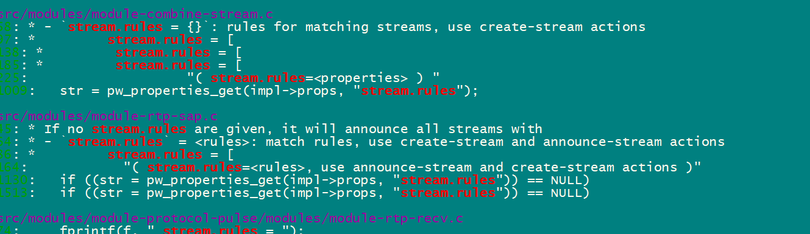

--

# spa_node_call_ready 

`spa_node_call_ready` 是一个函数，它用于通知节点（node）已经准备好处理数据。

具体来说，当一个节点完成了数据处理或准备好接受新的数据时，它会调用 `spa_node_call_ready` 函数来通知其他节点或客户端。

这个函数的作用是：

1. 通知其他节点或客户端：节点已经准备好处理数据，可以接受新的数据或继续处理当前数据。
2. 触发事件：当节点调用 `spa_node_call_ready` 函数时，会触发一个事件，通知其他节点或客户端进行相应的处理。

在 PipeWire 项目中，`spa_node_call_ready` 函数通常用于以下场景：

1. 节点完成数据处理：当一个节点完成了数据处理时，它会调用 `spa_node_call_ready` 函数来通知其他节点或客户端。
2. 节点准备好接受新数据：当一个节点准备好接受新数据时，它会调用 `spa_node_call_ready` 函数来通知其他节点或客户端。

通过 `spa_node_call_ready` 函数，节点可以与其他节点或客户端进行通信，实现数据处理和传输的协调。

# spa_system

这个更加适合作为理解spa_interface接口与实现分离的设计理念。

这个对接了2种系统：linux和evl。

就看linux的就好了。

对上层提供了一样的接口。

spa_system_pollfd_create 这种风格的接口。

对应的methods结构体定义：

```
struct spa_system_methods {
	int (*pollfd_create) (void *object, int flags);
}
```

spa_system

```
struct spa_system { struct spa_interface iface; };
```

对应一个spa_handle_factory。

```
const struct spa_handle_factory spa_support_system_factory = {
	SPA_VERSION_HANDLE_FACTORY,
	SPA_NAME_SUPPORT_SYSTEM,
	NULL,
	impl_get_size,
	impl_init,
	impl_enum_interface_info
};
```

```
static const struct spa_system_methods impl_system = {
.pollfd_create = impl_pollfd_create,
```

```
static int impl_pollfd_create(void *object, int flags)
{
	struct impl *impl = object;
	int fl = 0, res;
	if (flags & SPA_FD_CLOEXEC)
		fl |= EPOLL_CLOEXEC;
	res = epoll_create1(fl);
	spa_log_debug(impl->log, "%p: new fd:%d", impl, res);
	return res < 0 ? -errno : res;
}
```

有4种fd：

* pollfd
* timerfd
* eventfd
* signalfd

然后加上：read/write/ioctl/close。

还有2个clock函数。

# volume插件使用

PipeWire 的 `volume` 插件用于调整音频流的音量，通常可以作为音频链的一部分动态插入使用。以下是使用 `volume` 插件的方式及其相关配置说明：

------

### **1. `volume` 插件的功能**

- **动态音量调整**：通过设置音量参数调整输入音频流的增益（gain）。
- **支持链路插入**：可插入在任何支持 SPA 节点的音频处理链中。
- **简单高效**：适合对音量进行实时调节的场景。

------

### **2. 插件加载方式**

在 PipeWire 的配置中，`volume` 插件通常以 `filter-chain` 的形式加载，并注册为一个处理节点。

------

### **3. 使用方法**

#### **方法一：通过 `filter-chain` 配置加载**

编辑或创建 `~/.config/pipewire/filter-chain.conf` 文件，添加 `volume` 节点配置。

```ini
context.objects = [
    {
        factory = spa-node-factory
        args = {
            node.name = "volume"
            factory.name = "support.volume"
            node.description = "Volume Control"
            node.properties = {
                volume = 0.8  # 设置默认音量（范围 0.0 到 1.0）
            }
        }
    }
]
```

在此配置中：

- **`volume`**：设置音量，默认范围为 `0.0`（静音）到 `1.0`（原始音量），也可以超过 1.0（增益）。

保存配置后，重启 PipeWire：

```bash
systemctl --user restart pipewire
```

------

#### **方法二：通过 CLI 动态创建**

可以使用 `pw-cli` 动态加载 `volume` 插件并连接到现有节点。

1. **创建 `volume` 节点**：

   ```bash
   pw-cli create-node support.volume volume=0.5
   ```

2. **连接节点**： 使用 `pw-link` 将 `volume` 节点连接到输入或输出设备：

   ```bash
   pw-link <input-node> <volume-node>
   pw-link <volume-node> <output-node>
   ```

------

#### **方法三：通过 API 动态管理**

在开发中，可以通过 PipeWire 的 API 动态加载 `volume` 插件并设置参数。

```c
#include <pipewire/pipewire.h>

void setup_volume_node(struct pw_context *context) {
    struct pw_properties *props = pw_properties_new(
        "factory.name", "support.volume",
        "node.name", "volume",
        "volume", "0.5", // 初始音量
        NULL
    );
    struct pw_node *volume_node = pw_context_create_node(context, "volume", props, NULL);

    if (volume_node) {
        pw_node_add_listener(volume_node, ...);  // 添加监听器处理事件
    }
}
```

------

### **4. 动态调节音量**

可以通过 `pw-cli` 或其他工具动态更改音量参数。

#### **使用 `pw-cli` 修改音量**

```bash
pw-cli set-param <volume-node-id> Props volume=0.7
```

#### **使用 API 修改音量**

```c
struct pw_proxy *proxy = pw_node_get_proxy(volume_node);
pw_proxy_set_param(proxy, SPA_TYPE_PARAM_Props, "volume", SPA_POD_Float(0.7));
```

------

### **5. 配置文件示例**

完整的 `filter-chain` 配置文件示例：

```ini
context.objects = [
    {
        factory = spa-node-factory
        args = {
            node.name = "volume"
            factory.name = "support.volume"
            node.description = "Volume Control"
            node.properties = {
                volume = 0.8
            }
        }
    }
]
```

------

### **6. 检查节点状态**

加载完成后，可以使用 `pw-cli` 或 `pw-dump` 检查 `volume` 节点是否生效。

```bash
pw-cli ls Node
```

输出示例：

```
id 42: Node "volume"
    Props:
        volume = 0.8
```

------

### **7. 实现动态效果**

- **场景 1**：对流媒体播放进行音量动态调节。
- **场景 2**：与其他过滤器（如 `echo`、`equalizer`）组合使用，实现更复杂的音频效果链。

------

### **总结**

| 步骤             | 操作                                         |
| ---------------- | -------------------------------------------- |
| **加载插件**     | 使用配置文件或 `pw-cli` 加载 `volume` 节点。 |
| **连接节点**     | 使用 `pw-link` 连接输入输出设备。            |
| **动态调整音量** | 使用 CLI 或 API 修改 `volume` 参数。         |

`volume` 插件是 PipeWire 中重要的基础工具，灵活使用可以满足各种实时音量调节需求。

# pw_context_create_link

```
pw_core_create_object
	create_object
```

# pw_filter

`pw_filter` 是 PipeWire 提供的一个高级 API，用于在客户端应用中实现音频或视频数据的流式处理和动态过滤。它是 **PipeWire 简化客户端开发** 的工具之一，专注于处理数据流（输入或输出）。

------

### **`pw_filter` 的主要用途**

| 用途                   | 描述                                                         |
| ---------------------- | ------------------------------------------------------------ |
| **数据流处理**         | 用于处理从 PipeWire 节点发送或接收的音频/视频数据。          |
| **实时过滤**           | 可应用自定义的滤波器、音量调节、效果处理等功能。             |
| **轻量级节点创建**     | 客户端应用可使用 `pw_filter` 轻松创建动态处理节点。          |
| **高效数据交互**       | 支持低延迟和高效率的数据流交互，适合实时性要求高的场景。     |
| **易用的事件驱动模型** | 提供回调机制处理数据和事件，无需直接操作低级别的 PipeWire 接口。 |

------

### **常见使用场景**

#### **1. 音频数据的实时处理**

- 创建一个 `pw_filter` 作为数据处理节点，接收音频流进行动态滤波或效果处理。
- 示例：自定义均衡器、音量控制、混音。

#### **2. 视频数据的实时处理**

- 用于处理视频流，比如应用滤镜、调整分辨率等。
- 示例：实时流媒体传输或视频处理。

#### **3. 音频/视频录制或播放**

- 使用 `pw_filter` 直接从设备采集音频/视频数据，或者将数据输出到指定设备。

------

### **`pw_filter` 的核心接口**

以下是 `pw_filter` 的核心 API 和用途：

| 函数                       | 用途                                                    |
| -------------------------- | ------------------------------------------------------- |
| `pw_filter_new()`          | 创建一个新的 `pw_filter` 对象。                         |
| `pw_filter_add_listener()` | 为 `pw_filter` 添加事件监听器（如状态改变、数据接收）。 |
| `pw_filter_connect()`      | 将 `pw_filter` 连接到 PipeWire 中的设备或流。           |
| `pw_filter_destroy()`      | 销毁 `pw_filter` 对象，释放资源。                       |
| `pw_filter_set_param()`    | 设置参数，如采样率、格式等。                            |
| `pw_filter_emit_process()` | 回调处理函数，用于处理音频或视频数据。                  |

------

### **典型用法**

以下是一个使用 `pw_filter` 实现简单音频处理的例子：

#### **1. 初始化 PipeWire 和上下文**

```c
struct pw_main_loop *loop = pw_main_loop_new(NULL);
struct pw_context *context = pw_context_new(pw_main_loop_get_loop(loop), NULL, 0);
```

#### **2. 创建 `pw_filter`**

```c
struct pw_filter *filter = pw_filter_new(context, "My Filter", NULL);
```

#### **3. 添加事件回调**

```c
static void on_process(void *data) {
    struct pw_buffer *buffer;
    struct spa_buffer *spa_buf;

    if ((buffer = pw_filter_dequeue_buffer(filter)) == NULL) {
        return;
    }

    spa_buf = buffer->buffer;
    if (spa_buf->datas[0].data != NULL) {
        // 处理音频数据
        memset(spa_buf->datas[0].data, 0, spa_buf->datas[0].chunk->size); // 简单静音处理
    }

    pw_filter_queue_buffer(filter, buffer);
}

struct pw_filter_events filter_events = {
    PW_VERSION_FILTER_EVENTS,
    .process = on_process, // 注册数据处理回调
};

pw_filter_add_listener(filter, &listener, &filter_events, NULL);
```

#### **4. 连接到目标节点**

```c
pw_filter_connect(filter,
    PW_DIRECTION_INPUT,  // 数据流方向
    PW_FILTER_FLAG_DRIVER,  // 标志位
    NULL, 0);
```

#### **5. 启动主循环**

```c
pw_main_loop_run(loop);
```

#### **6. 清理资源**

```c
pw_filter_destroy(filter);
pw_context_destroy(context);
pw_main_loop_destroy(loop);
```

------

### **回调机制**

- `pw_filter` 的核心是事件驱动模型，用户需要提供回调处理音频或视频数据。
- 典型回调包括：
  - **`process`**：每当有新数据到达时触发，用户在这里实现自定义数据处理逻辑。
  - **`state_changed`**：过滤器状态改变时触发，通常用于监控连接状态。

------

### **优点**

| 优点       | 描述                                                      |
| ---------- | --------------------------------------------------------- |
| **易用性** | 提供封装好的接口，开发者无需直接操作低级别 PipeWire API。 |
| **实时性** | 支持高效的实时数据处理，满足音频/视频应用的需求。         |
| **灵活性** | 可用于音频和视频流的多种场景，支持自定义参数和逻辑。      |
| **模块化** | 可以作为独立的过滤模块，方便与 PipeWire 的其他组件集成。  |

------

### **总结**

`pw_filter` 是 PipeWire 为简化客户端开发提供的重要工具，适用于音频或视频流的实时处理。它通过事件驱动模型和灵活的配置接口，使开发者可以高效构建各种数据处理应用，如音频特效、流媒体处理和实时采集等。

# adapter-control

```
audiotestsrc -> adapter -> alsa-pcm-sink 
```


# pipewire的spa plugin ffmpeg怎么使用

PipeWire 的 `SPA plugin ffmpeg` 是一种插件，用于通过 SPA (Simple Plugin API) 框架集成 FFmpeg 功能，提供对多种媒体格式的支持。这种插件主要用于处理音视频的编码、解码和格式转换。

------

### **主要用途**

| 用途           | 描述                                                         |
| -------------- | ------------------------------------------------------------ |
| **音视频解码** | 使用 FFmpeg 解码音频或视频流，例如 MP3、AAC、H264 等常见格式。 |
| **音视频编码** | 将原始音频或视频数据编码为特定格式，比如 MP3 或 H264。       |
| **格式转换**   | 在不同的音频/视频格式之间进行转码或重采样。                  |
| **管道集成**   | 将 FFmpeg 的强大功能直接集成到 PipeWire 流处理中，支持更多的格式。 |

------

### **启用插件**

1. **插件安装**
    确保系统已经安装了 PipeWire 并且其构建时启用了 FFmpeg 插件支持。通常需要以下依赖：

   - FFmpeg 库（例如 `libavcodec`、`libavformat`、`libswresample` 等）

   - 包管理器安装 FFmpeg 开发头文件：

     ```bash
     sudo apt install libavcodec-dev libavformat-dev libswresample-dev
     ```

2. **检查插件是否可用**
    确认插件是否被 PipeWire 加载：

   ```bash
   pw-cli dump spa-plugin | grep ffmpeg
   ```

   输出中应包含 `ffmpeg` 相关信息。

3. **插件配置文件**

   - 通常，FFmpeg 插件在 PipeWire 的配置文件中自动加载。

   - 检查 `/usr/share/pipewire` 或 `/etc/pipewire` 目录下是否存在加载配置。

   - 如果插件未加载，可以在 

     ```
     pipewire.conf
     ```

      或自定义配置文件中添加：

     ```ini
     context.spa-libs = {
         "support/libspa-ffmpeg" = "/usr/lib/spa-0.2/ffmpeg/libspa-ffmpeg.so"
     }
     ```

------

### **典型用法**

#### **1. 使用 FFmpeg 插件进行解码**

- 假设需要通过 PipeWire 处理 MP3 文件。
- 使用 `pw-cli` 或编写程序将数据通过 PipeWire 的 FFmpeg 节点解码为原始 PCM 数据。

示例步骤：

1. 创建 FFmpeg 节点

   ```bash
   pw-cli create-node support.libspa-ffmpeg
   ```

2. 连接数据源和目标

   - 数据源：MP3 文件或流媒体。
   - 目标：音频输出节点（如 ALSA 或蓝牙设备）。

#### **2. 在客户端程序中使用**

PipeWire 的客户端 API 可直接与 FFmpeg 插件交互。例如：

```c
#include <pipewire/pipewire.h>
#include <spa/param/audio/format-utils.h>

void setup_ffmpeg_node(struct pw_context *context) {
    struct pw_properties *props = pw_properties_new(
        PW_KEY_MEDIA_TYPE, "Audio",
        PW_KEY_MEDIA_CATEGORY, "Playback",
        PW_KEY_MEDIA_ROLE, "Music",
        NULL);

    struct pw_core *core = pw_context_connect_self(context, NULL, 0);

    struct pw_node *node = pw_node_new(context, "ffmpeg-decoder", props);
    pw_node_register(node, NULL);
    pw_core_add_object(core, (struct pw_global *)node);
}
```

------

### **3. 配置格式转换**

可以通过 `pw-cli` 设置目标格式，例如将音频从 MP3 转为 PCM：

```bash
pw-cli set-param <node-id> spa:audio/format '{ "format": "S16LE", "rate": 44100, "channels": 2 }'
```

------

### **优点**

| 特性             | 描述                                                 |
| ---------------- | ---------------------------------------------------- |
| **多格式支持**   | 凭借 FFmpeg，支持广泛的音视频格式。                  |
| **高效流式处理** | 与 PipeWire 的流处理机制结合，实现低延迟和高效解码。 |
| **模块化设计**   | 可单独加载或卸载，不影响其他 PipeWire 模块。         |

------

### **常见问题**

1. 插件未加载
   - 确保插件库路径正确，并检查 `pipewire.conf` 是否配置了 `ffmpeg`。
2. 缺少依赖
   - 安装 FFmpeg 所需的库和开发头文件。
3. 性能问题
   - 检查系统是否启用了适当的硬件加速（如 VAAPI 或 CUDA）。

------

### **总结**

`SPA plugin ffmpeg` 为 PipeWire 提供了强大的音视频处理能力，支持多种格式的解码、编码和格式转换。通过加载和配置此插件，可以轻松扩展 PipeWire 的多媒体功能，满足复杂的音视频处理需求。

# 依次加载的pw module

```
rt
protocol-native

libpipewire-module-spa-device-factory
	这个是用于创建在server context里运行的device。
libpipewire-module-spa-node-factory
	这个是用于创建在server context里运行的node。
libpipewire-module-client-node
	创建在client context运行的node。
libpipewire-module-client-device 
	创建在client context运行的device。
```

# pipewire的metadata到底是指什么

在 PipeWire 中，**Metadata** 是一种机制，

用于存储和共享系统中与节点或链接相关的附加信息。

这些信息并不直接影响音频或视频流的处理，

但对管理、显示和控制非常重要。

------

### **Metadata 的作用**

1. **附加信息存储**
    为节点、链接或其他对象存储==额外的键值对信息。==
2. **集中共享**
    使多个应用或插件可以访问和使用这些信息。
3. **动态更新**
    Metadata 可在运行时动态更改，并通知相关组件。
4. **控制和调试**
    提供关于系统状态的描述性信息，例如优先级、位置、用途等。

------

### **Metadata 的典型使用场景**

| 场景           | 示例                                          |
| -------------- | --------------------------------------------- |
| **设备描述**   | 存储节点的描述性信息，如设备名称或型号。      |
| **优先级设置** | 指定某个节点为首选设备，例如 "默认音频输出"。 |
| **位置标识**   | 标记设备的物理位置，例如 "左前置扬声器"。     |
| **应用间协作** | 在应用间共享配置数据，例如 EQ 设置。          |

------

### **Metadata 的结构**

Metadata 是以键值对形式存储，通常基于以下结构：

- **对象**：特定的 PipeWire 对象（如节点、设备或链接）。
- **键值对**：附加信息的键和值。

------

### **如何使用 Metadata**

#### **1. 启用 Metadata 模块**

确保配置文件中加载了 `libpipewire-module-metadata` 模块（默认已启用）。

在 `pipewire.conf` 中：

```ini
{ name = libpipewire-module-metadata }
```

#### **2. 查看现有 Metadata**

使用 `pw-cli` 查看 Metadata 信息：

```bash
pw-metadata
```

输出示例：

```plaintext
object 0 type PipeWire:Interface:Metadata/3
update: id: 32, key: "default.audio.sink", value: "alsa_output.pci-0000_00_1b.0.analog-stereo"
update: id: 45, key: "default.audio.source", value: "alsa_input.pci-0000_00_1b.0.analog-stereo"
```

解释：

- `default.audio.sink`: 默认音频输出设备。
- `default.audio.source`: 默认音频输入设备。

#### **3. 设置 Metadata**

使用 `pw-cli` 添加或更新 Metadata：

```bash
pw-metadata set default.audio.sink "my-audio-device"
```

------

### **代码示例**

通过 C API 操作 Metadata：

```c
#include <pipewire/pipewire.h>

void set_metadata(struct pw_core *core) {
    struct pw_metadata *metadata = pw_context_create_metadata(core, NULL, 0);
    if (metadata) {
        pw_metadata_set(metadata, 0, "default.audio.sink", "alsa_output.my_device", NULL);
        pw_metadata_set(metadata, 0, "device.description", "My Custom Audio Output", NULL);
    }
}
```

------

### **动态切换设备**

通过设置 Metadata，可以动态更改系统的默认音频设备：

1. 查看设备列表：

   ```bash
   pw-cli dump Node
   ```

2. 更新默认输出：

   ```bash
   pw-metadata set default.audio.sink "alsa_output.new_device"
   ```

------

### **总结**

Metadata 是 PipeWire 中强大的辅助机制，用于存储和共享系统中附加信息。通过 Metadata，用户和应用可以更好地协作、控制和定制系统的行为，而不会直接影响音视频流的处理逻辑。

# pw_thread_loop 使用

`pw_thread_loop` 是 PipeWire 提供的一个线程化事件循环，用于在专用线程中运行任务，例如音频处理或设备管理。通过这种机制，可以避免与主线程的竞争，并保证实时性任务的执行效率。

------

### **主要功能**

| 功能           | 描述                                       |
| -------------- | ------------------------------------------ |
| **线程化循环** | 独立线程运行事件循环。                     |
| **线程安全**   | 提供锁机制以安全地在主线程和子线程间通信。 |
| **实时处理**   | 支持实时优先级的任务调度。                 |

------

### **核心 API**

| 函数                      | 描述                                         |
| ------------------------- | -------------------------------------------- |
| `pw_thread_loop_new`      | 创建一个新的线程事件循环。                   |
| `pw_thread_loop_start`    | 启动事件循环线程。                           |
| `pw_thread_loop_stop`     | 停止事件循环线程。                           |
| `pw_thread_loop_lock`     | 加锁，阻止其他线程修改共享资源。             |
| `pw_thread_loop_unlock`   | 解锁，允许其他线程继续操作。                 |
| `pw_thread_loop_signal`   | 唤醒事件循环线程。                           |
| `pw_thread_loop_wait`     | 等待信号，通常用于线程间同步。               |
| `pw_thread_loop_destroy`  | 销毁事件循环并释放资源。                     |
| `pw_thread_loop_get_loop` | 获取底层的 `pw_loop`，用于附加事件源等操作。 |

------

### **基本使用流程**

#### **1. 创建事件循环**

使用 `pw_thread_loop_new` 创建一个新的线程事件循环：

```c
struct pw_thread_loop *loop = pw_thread_loop_new("my-loop", NULL);
if (!loop) {
    fprintf(stderr, "Failed to create thread loop\n");
    return -1;
}
```

#### **2. 启动事件循环**

调用 `pw_thread_loop_start` 启动线程和事件循环：

```c
if (pw_thread_loop_start(loop) != 0) {
    fprintf(stderr, "Failed to start thread loop\n");
    pw_thread_loop_destroy(loop);
    return -1;
}
```

#### **3. 在事件循环中执行任务**

使用 `pw_thread_loop_lock` 和 `pw_thread_loop_unlock` 保护共享资源操作：

```c
pw_thread_loop_lock(loop);

// 在锁定的上下文中执行任务，例如修改共享数据或注册事件。
do_some_shared_operation();

// 解锁以允许其他线程访问资源。
pw_thread_loop_unlock(loop);
```

#### **4. 信号与等待**

在线程间进行通信，例如通知任务完成：

```c
// 在主线程中唤醒事件循环线程。
pw_thread_loop_signal(loop, false);

// 在事件循环线程中等待信号。
pw_thread_loop_wait(loop);
```

#### **5. 停止与销毁**

完成工作后，停止事件循环并释放资源：

```c
pw_thread_loop_stop(loop);
pw_thread_loop_destroy(loop);
```

------

### **完整示例**

以下代码展示了如何使用 `pw_thread_loop` 在专用线程中执行任务：

```c
#include <pipewire/pipewire.h>
#include <stdio.h>

void *worker_task(void *data) {
    struct pw_thread_loop *loop = data;

    pw_thread_loop_lock(loop);
    printf("Task running in thread loop\n");
    // 模拟工作
    pw_thread_loop_signal(loop, false);
    pw_thread_loop_unlock(loop);

    return NULL;
}

int main() {
    struct pw_thread_loop *loop;

    // 初始化 PipeWire
    pw_init(NULL, NULL);

    // 创建线程循环
    loop = pw_thread_loop_new("example-loop", NULL);
    if (!loop) {
        fprintf(stderr, "Failed to create thread loop\n");
        return -1;
    }

    // 启动线程循环
    if (pw_thread_loop_start(loop) != 0) {
        fprintf(stderr, "Failed to start thread loop\n");
        pw_thread_loop_destroy(loop);
        return -1;
    }

    // 执行任务
    pw_thread_loop_lock(loop);
    printf("Main thread: scheduling task\n");
    pw_thread_loop_signal(loop, false);
    pw_thread_loop_unlock(loop);

    // 等待任务完成
    pw_thread_loop_wait(loop);

    // 停止并销毁循环
    pw_thread_loop_stop(loop);
    pw_thread_loop_destroy(loop);

    return 0;
}
```

------

### **注意事项**

1. **实时优先级**
    如果需要实时性能，可以在启动线程时配置优先级。

   ```c
   pw_thread_loop_set_priority(loop, 10);
   ```

2. **线程同步**
    避免在没有锁保护的情况下访问共享数据。

3. **事件源**
    可以将事件源（如定时器、文件描述符等）附加到 `pw_loop`，实现更复杂的功能。

------

### **总结**

`pw_thread_loop` 提供了一个安全、高效的线程化事件循环工具，适用于实时任务和多线程 PipeWire 应用。通过其锁机制和信号通信，开发者可以在复杂任务中保证线程安全和数据完整性。

# pw_stream

pw_stream是用来跟pipewire server交换数据用的。

它是一个wrapper，包装了pw_client_node的proxy，带有一个converter。

这个意味着stream可以自动转换server需要的格式。

pw_stream可以：

* 消费pipewire过来的stream。
* 生产pipewire需要的stream。

你可以连接到server的指定port上。也可以让pipewire自动帮你选择一个port。


对于复杂的node，例如filter或者有多个input和output的node，

你需要使用pw_filter，或者你自己写一个pw_node并且用pw_core_export暴露给pipewire。

## 关于stream的delay

```
pw_stream_get_time_n
	这个函数拿到时间戳。
pw_time.ticks 
	这个是一个递增的counter。
pw_time.delay
```

```
*           stream time domain           graph time domain
 *         /-----------------------\/-----------------------------\
 *
 * queue     +-+ +-+  +-----------+                 +--------+
 * ---->     | | | |->| converter | ->   graph  ->  | kernel | -> speaker
 * <----     +-+ +-+  +-----------+                 +--------+
 * dequeue   buffers                \-------------------/\--------/
 *                                     graph              internal
 *                                    latency             latency
 *         \--------/\-------------/\-----------------------------/
 *           queued      buffered            delay
```

# pw_resource用途

在 PipeWire 中，`pw_resource` 是一种用于管理客户端与服务端之间通信的对象。它代表了服务端中的一个资源（Resource），通常绑定到某个客户端，并为客户端提供访问服务端对象的接口。

------

### **主要用途**

| 用途               | 描述                                                         |
| ------------------ | ------------------------------------------------------------ |
| **客户端资源管理** | 每个客户端可以通过 `pw_resource` 与服务端的某些对象进行交互。 |
| **方法调用的代理** | 通过 `pw_resource` 将客户端请求映射到服务端的实际实现上。    |
| **权限控制**       | 资源可以检查客户端的权限，确保只有授权的客户端可以执行某些操作。 |
| **事件分发**       | 服务端可以通过资源向客户端发送事件通知，例如状态更新或错误。 |
| **接口绑定**       | `pw_resource` 绑定特定的接口类型，用于描述客户端可以调用的方法和接收的事件。 |

------

### **资源生命周期**

1. **创建**
    资源由 `pw_client` 创建，通常是某个服务端对象（如 `pw_node`、`pw_link`）的代理。

   ```c
   struct pw_resource *resource = pw_resource_new(client, id, permissions, type, version, user_data);
   ```

2. **方法调用**
    客户端调用资源上的方法，资源会将调用映射到服务端对应的实现。

3. **事件分发**
    服务端通过资源向客户端发送事件，例如通过接口中定义的回调方法。

4. **销毁**
    当资源或客户端断开连接时，资源被销毁。

------

### **主要 API**

| 函数                              | 描述                                         |
| --------------------------------- | -------------------------------------------- |
| `pw_resource_new`                 | 创建新的资源对象。                           |
| `pw_resource_add_listener`        | 添加资源监听器，用于接收客户端调用的事件。   |
| `pw_resource_add_object_listener` | 添加资源对象监听器，绑定特定接口类型的回调。 |
| `pw_resource_set_bound_id`        | 设置资源绑定的服务端对象的全局 ID。          |
| `pw_resource_get_client`          | 获取该资源绑定的客户端对象。                 |
| `pw_resource_error`               | 向客户端报告资源错误。                       |
| `pw_resource_remove`              | 手动移除资源。                               |
| `pw_resource_get_bound_id`        | 获取资源绑定的服务端对象的全局 ID。          |

------

### **代码示例**

#### **1. 创建资源**

以下代码展示了如何在服务端为客户端创建一个资源：

```c
struct pw_resource *resource;
uint32_t id = 42; // 客户端请求的对象 ID

resource = pw_resource_new(client, id, PW_PERM_ALL, PW_TYPE_INTERFACE_Node, PW_VERSION_NODE, NULL);
if (!resource) {
    fprintf(stderr, "Failed to create resource\n");
    return -1;
}
```

#### **2. 添加接口回调**

为资源绑定接口方法的实现：

```c
static const struct pw_node_methods node_methods = {
    .add_listener = my_node_add_listener,
    .set_param = my_node_set_param,
    // 其他方法实现...
};

pw_resource_add_object_listener(resource, &node_methods, user_data);
```

#### **3. 分发事件**

服务端通过资源向客户端发送事件：

```c
static void send_event(struct pw_resource *resource) {
    struct pw_node_events *events = pw_resource_get_user_data(resource);
    if (events && events->info) {
        events->info(resource, &node_info);
    }
}
```

#### **4. 销毁资源**

当资源不再需要时，手动销毁：

```c
pw_resource_remove(resource);
```

------

### **常见使用场景**

1. **客户端请求服务端对象**
    客户端通过 `pw_core` 请求一个对象（如 Node 或 Link），服务端会为其创建一个对应的 `pw_resource`。
2. **服务端通知客户端**
    服务端通过资源向客户端发送事件，例如节点状态变化或参数更新。
3. **动态权限管理**
    `pw_resource` 可以根据客户端的权限检查是否允许其执行某些操作。

------

### **示例：Node 资源绑定**

以下展示了一个为 `Node` 创建资源并绑定方法的完整流程：

```c
// 创建 Node 资源
struct pw_resource *node_resource = pw_resource_new(client, id, PW_PERM_ALL, PW_TYPE_INTERFACE_Node, PW_VERSION_NODE, NULL);

// 设置绑定的 Node 对象
pw_resource_set_bound_id(node_resource, node->global->id);

// 添加回调
pw_resource_add_object_listener(node_resource, &node_methods, node);
```

客户端可以通过该资源调用与 `Node` 相关的方法，服务端通过绑定的接口实现提供响应。

------

### **总结**

`pw_resource` 是 PipeWire 服务端与客户端通信的重要桥梁，主要用于管理资源、分发事件和处理客户端请求。通过其灵活的设计，开发者可以为不同的服务端对象创建统一的接口代理，实现高效、可扩展的系统架构。

# pw_proxy

```
 * The proxy object is a client side representation of a resource
 * that lives on a remote PipeWire instance.
```

pw_proxy就是在client这一边用来访问存放在server上的资源的代理。

用来跟远程object通信的。

# core_hello

这个函数`core_hello`是PipeWire的一个核心函数，用于处理客户端的hello消息。它的主要功能是：

1. 记录调试日志，显示客户端的hello消息。
2. 遍历客户端的对象列表，销毁所有资源。
3. 更新资源的版本号。
4. 清空客户端的内存池。
5. 获取核心信息，并更新客户端的信息。
6. 如果客户端版本号大于或等于3，则绑定全局对象。

函数返回0表示成功，否则返回错误码。

# PIPEWIRE_INTERNAL环境变量的用途

`PIPEWIRE_INTERNAL` 是 PipeWire 中一个特殊的环境变量，主要用于标识内部或特殊运行模式，而非用户或外部应用常规使用的模式。

------

### **用途和作用**

| **用途**         | **描述**                                                     |
| ---------------- | ------------------------------------------------------------ |
| **调试和开发**   | 在开发或调试 PipeWire 内部组件时，标识某些特定的运行路径或行为。 |
| **内部实例隔离** | 在某些情况下，需要运行一个与正常用户会话隔离的 PipeWire 实例，这时可以通过设置该变量实现。 |
| **模块加载控制** | 限制或调整 PipeWire 加载模块的方式，避免加载某些非必要模块，从而简化调试环境。 |
| **减少干扰**     | 防止内部 PipeWire 实例与系统范围的服务（如主 PipeWire 实例或客户端）发生冲突。 |

------

### **具体实现逻辑**

在 PipeWire 的代码中，`PIPEWIRE_INTERNAL` 可能会通过以下方式发挥作用：

1. **检查是否设置该变量**
    某些模块或代码路径会判断 `PIPEWIRE_INTERNAL` 是否存在，从而决定是否启用某些功能或模块。

   ```c
   const char *env = getenv("PIPEWIRE_INTERNAL");
   if (env) {
       // 内部模式逻辑
   }
   ```

2. **限制全局资源访问**
    内部模式下，PipeWire 可能会避免注册全局资源，如系统范围的音频设备或外部客户端。

3. **定制化行为**
    可以通过该环境变量，触发特定的调试行为，例如更详细的日志输出或跳过某些复杂的初始化步骤。

------

### **使用场景**

以下是 `PIPEWIRE_INTERNAL` 的常见使用场景：

1. **开发人员测试内部功能**
    用于 PipeWire 核心开发者在调试模块或协议实现时，启动内部实例。

   ```bash
   PIPEWIRE_INTERNAL=1 pipewire
   ```

2. **隔离实例运行**
    在运行 PipeWire 的多个实例时，确保它们互不干扰，例如在容器化环境或沙盒环境中使用。

3. **实验性功能**
    某些实验性功能可能仅在内部模式下启用，而不会对普通用户可见。

------

### **注意事项**

- **普通用户不需要设置**：`PIPEWIRE_INTERNAL` 主要是为了内部使用或开发者测试，普通用户使用 PipeWire 时无需设置。
- **影响行为**：设置该变量可能导致 PipeWire 不按预期加载某些模块，或与正常用户会话不兼容，因此建议仅用于特定场景。
- **文档较少**：由于其是内部使用的功能，官方文档中对其描述可能较少，需要参考源码了解具体实现。

------

### **总结**

`PIPEWIRE_INTERNAL` 是一个用于控制 PipeWire 内部运行模式的环境变量，主要用于开发、调试或隔离实例运行。它的设置会影响 PipeWire 的行为，普通用户无需关心，开发者可以用它来简化内部测试或实现定制化功能。

# pipewire和pipewire-pulse的关系

他们是一个程序，pipewire-pulse是指向pipewire的软链接。

程序名字会影响所使用的配置文件。是代码这里决定的：

```
	snprintf(path, sizeof(path), "%s.conf", argv[0]);
	config_name = basename(path);
```

配置文件名字是根据可执行程序的名字来决定的。


# 同时运行多个pipewire进程，他们之间是如何配合工作的？


在常规情况下，系统中通常只会运行一个 PipeWire 服务进程（`pipewire`），

它作为一个全局服务管理所有客户端的音频和视频资源。

然而，在某些场景下，可能需要同时运行多个 PipeWire 实例，

比如用于隔离、沙盒测试或多用户环境。

这些实例之间并不会直接配合工作，而是通过特定的机制实现互相隔离或独立运行。

------

### **多个 PipeWire 实例的典型运行场景**

| 场景               | 描述                                                         |
| ------------------ | ------------------------------------------------------------ |
| **用户隔离**       | 每个用户会话运行独立的 PipeWire 实例，例如在多用户服务器环境中，每个用户的实例互相隔离。 |
| **容器或沙盒环境** | 在容器中运行单独的 PipeWire 实例，避免与宿主机上的 PipeWire 产生冲突。 |
| **开发和调试**     | 开发者在不同的调试会话中运行多个实例，用于测试不同配置或模块功能。 |

------

### **实例之间的隔离与独立性**

1. **配置文件隔离**

   - 每个 PipeWire 实例加载独立的配置文件（默认是 `/etc/pipewire` 和 `~/.config/pipewire` 中的配置）。

   - 通过指定 

     ```
     PIPEWIRE_CONFIG_FILE
     ```

      环境变量可以显式指定每个实例的配置路径：

     ```bash
     PIPEWIRE_CONFIG_FILE=/path/to/config pipewire
     ```

2. **通信端点隔离**

   - PipeWire 使用 Unix 域套接字或共享内存进行通信，默认情况下，套接字会在 `/run/user/<UID>/pipewire-0` 中创建。

   - 每个实例可以通过 

     ```
     PIPEWIRE_RUNTIME_DIR
     ```

      环境变量指定不同的套接字目录，以避免冲突：

     ```bash
     PIPEWIRE_RUNTIME_DIR=/tmp/pipewire-instance-1 pipewire
     PIPEWIRE_RUNTIME_DIR=/tmp/pipewire-instance-2 pipewire
     ```

3. **资源命名隔离**

   - 每个实例注册的全局资源（如节点、链路）在其命名空间内是唯一的，不会与其他实例冲突。

4. **模块加载独立**

   - 每个实例可以加载不同的模块，模块配置由各自的配置文件控制。

------

### **实例之间的交互**

在正常情况下，多个 PipeWire 实例是相互隔离的，不会直接配合工作。然而，某些场景下可能需要它们之间进行通信或资源共享，可以通过以下方式实现：

1. **共享虚拟设备**
   - 一个实例可以通过虚拟设备（如 `pw-loopback`）将其资源输出到另一个实例中。
   - 配置示例：
     - 实例 A 运行一个虚拟 sink。
     - 实例 B 将其音频通过 `pw-link` 链接到实例 A 的虚拟 sink。
2. **通过 PulseAudio 插件间接共享**
   - 如果多个实例都支持 PulseAudio API，则可以通过 PulseAudio 插件间接实现交互。
   - 示例：实例 A 提供 PulseAudio 兼容的 sink，实例 B 使用 PulseAudio 客户端连接到该 sink。
3. **通过网络协议共享**
   - 使用 PipeWire 的 `libpipewire-module-protocol-native` 模块，允许一个实例通过网络向另一个实例共享资源。

------

### **实践示例**

#### **同时运行两个实例**

1. 启动第一个实例：

   ```bash
   PIPEWIRE_RUNTIME_DIR=/tmp/pipewire-instance-1 PIPEWIRE_CONFIG_FILE=/path/to/config1 pipewire
   ```

2. 启动第二个实例：

   ```bash
   PIPEWIRE_RUNTIME_DIR=/tmp/pipewire-instance-2 PIPEWIRE_CONFIG_FILE=/path/to/config2 pipewire
   ```

3. 使用 `pw-cli` 查看实例状态：

   ```bash
   PIPEWIRE_RUNTIME_DIR=/tmp/pipewire-instance-1 pw-cli info
   PIPEWIRE_RUNTIME_DIR=/tmp/pipewire-instance-2 pw-cli info
   ```

------

### **注意事项**

1. **性能开销**
   - 同时运行多个实例会消耗更多的系统资源，尤其是在处理高负载的音频或视频流时。
2. **数据一致性**
   - 如果需要实例间共享数据，需谨慎设计资源同步机制，以避免数据竞争或冲突。
3. **调试复杂度**
   - 多实例运行可能导致调试难度增加，建议在开发和调试时使用清晰的日志配置。

------

### **总结**

多个 PipeWire 实例通常是互相独立运行的，使用不同的配置文件、通信端点和资源命名空间。如果需要交互，可以通过虚拟设备、网络协议或其他间接方式实现。在实际应用中，这种多实例架构适用于隔离需求较高的场景，例如多用户环境、容器化部署或开发调试。

# 同时运行pipewire和pipewire-pluse呢？

同时运行 `pipewire` 和 `pipewire-pulse` 是一种常见的场景，特别是为了兼容 PulseAudio 客户端。`pipewire-pulse` 是 PipeWire 的一个模块，旨在为基于 PulseAudio 的应用程序提供兼容层。通过这种方式，使用 PulseAudio 的应用程序可以无缝地与 PipeWire 协同工作，从而利用 PipeWire 提供的更强大和灵活的音频处理功能。

### **如何同时运行 `pipewire` 和 `pipewire-pulse`**

1. `pipewire` 进程

   ：

   - `pipewire` 是 PipeWire 的核心进程，负责处理音频和视频流。它充当整个系统中音频和视频的中央管理器。

2. `pipewire-pulse` 模块

   ：

   - `pipewire-pulse` 是一个兼容 PulseAudio 的模块，允许 PulseAudio 客户端（如传统的桌面应用程序）通过 PipeWire 管理音频流。
   - 它实现了 PulseAudio API，因此大多数使用 PulseAudio 的应用程序可以透明地切换到 PipeWire 上。

### **启动顺序**

通常，PipeWire 和 `pipewire-pulse` 模块会作为一个整体启动，但你也可以手动启动它们。

1. **启动 PipeWire**： `pipewire` 进程需要首先启动，它会初始化音频和视频流的处理。

   ```bash
   pipewire
   ```

2. **启动 `pipewire-pulse`**： `pipewire-pulse` 作为一个独立的进程或模块运行，通常它会在启动 `pipewire` 后自动启动，但如果没有，可以手动启动：

   ```bash
   pipewire-pulse
   ```

3. **同时运行（手动方式）**： 如果你希望分别控制这两个进程，你可以在终端中分别启动它们，确保它们运行在不同的进程中：

   ```bash
   pipewire  # 启动 PipeWire 核心进程
   pipewire-pulse  # 启动 PulseAudio 兼容层
   ```

### **配置文件**

在某些情况下，你可能希望自定义这两个进程的行为。你可以编辑它们的配置文件，特别是 `pipewire-pulse` 的配置文件，通常位于：

- `/etc/pipewire/pipewire-pulse.conf`（系统级配置）
- `~/.config/pipewire/pipewire-pulse.conf`（用户级配置）

这些文件允许你配置 PipeWire 和 PulseAudio 兼容层的详细行为，例如，PulseAudio 客户端的行为或共享音频设备的配置。

### **如何协同工作**

- **音频流共享**：`pipewire-pulse` 提供 PulseAudio 客户端与 PipeWire 系统之间的桥梁，使得 PulseAudio 客户端可以透明地使用 PipeWire 管理的音频设备。音频流从 PulseAudio 客户端经过 `pipewire-pulse` 转发到 PipeWire 核心。
- **虚拟设备**：`pipewire-pulse` 会提供一个名为 PulseAudio 的虚拟设备，它与传统的 PulseAudio 的 `alsa-sink` 等设备类似，允许应用程序与之交互。

### **调试和验证**

- **验证 `pipewire-pulse` 是否正在运行**： 你可以通过检查 `pipewire-pulse` 进程是否启动来确认它是否在运行。

  ```bash
  ps aux | grep pipewire-pulse
  ```

- **检查 PulseAudio 的状态**： 你可以使用 `pactl` 命令检查 PipeWire 是否作为 PulseAudio 后端正常工作：

  ```bash
  pactl info
  ```

- **查看 PipeWire 状态**： 如果 `pipewire-pulse` 正常运行，你可以使用 `pw-cli` 或 `pw-top` 查看 PipeWire 的运行状态：

  ```bash
  pw-cli info
  pw-top
  ```

### **为什么要同时运行 PipeWire 和 `pipewire-pulse`？**

1. **兼容性**：
   - 许多现有的桌面应用程序和软件（例如浏览器、媒体播放器）依赖于 PulseAudio 作为音频后端。使用 `pipewire-pulse` 可以确保这些应用程序在 PipeWire 环境中正常工作，而不需要重构或更改现有代码。
2. **迁移**：
   - 对于已经依赖 PulseAudio 的系统和应用程序，`pipewire-pulse` 提供了平滑的过渡到 PipeWire 的路径。用户可以在不改变应用程序的情况下享受 PipeWire 的优势，如更低延迟、更高效的多媒体处理和更强大的音频流管理。
3. **性能优化**：
   - PipeWire 提供的 API 比 PulseAudio 更加灵活和强大，可以更好地处理复杂的音频路由、音效处理等，用户可以利用这些功能，同时保持对传统应用程序的支持。

### **总结**

- **`pipewire`** 是 PipeWire 的核心进程，负责处理所有音频和视频流。
- **`pipewire-pulse`** 是一个兼容 PulseAudio 的模块，使基于 PulseAudio 的应用程序能够使用 PipeWire 作为音频管理后端。
- 你可以分别启动这两个进程，确保它们正常工作并互不干扰。
- 使用 `pipewire-pulse` 可以确保传统的 PulseAudio 应用程序能在 PipeWire 环境中运行，同时享受 PipeWire 的先进特性。

这种配置非常适用于迁移到 PipeWire 系统，特别是在需要兼容大量基于 PulseAudio 的应用程序的情况下。


# 概念辨析

一个模块是一个共享对象，

用于向 PipeWire 客户端添加功能。

它有一个初始化函数，在模块加载时会被调用。

模块可以在核心进程中加载，

也可以在任何客户端进程中加载。

==客户端不会将加载的模块导出到注册表中。==

稍后我们将看到模块的示例以及如何加载它们。


设备是一个表示底层 API 的句柄，

然后用于创建节点或其他设备。

设备的例子是 ALSA PCM 卡或 V4L2 设备。

设备有一个配置文件。


权限目前还没有用起来。

因为所有客户端都默认具有 `rwxm` 权限：读取、写入、执行、元数据。


每个对象至少实现 `add_listener` 方法，允许任何客户端注册事件监听器。事件通过 PipeWire API 来暴露可能随时间变化的对象信息（例如节点的状态）。


一旦在一个process中创建了一个对象，

就可以将其导出到核心的注册表中，

使其成为图的一部分。

导出后，对象将被暴露并可以被其他客户端访问；

这将我们带入了新的部分：客户端如何获取访问权限并与图进行交互。


与 PipeWire 实例交互的最简单方式是依赖 `libpipewire` 共享对象库。

这是一个 C 库，允许连接到核心。

连接步骤如下：

* 初始化库使用 `pw_init` ，其主要目标是设置日志。
* 创建一个事件循环实例
* 使用 `pw_context_new` 创建一个 PipeWire 上下文实例。该上下文将处理与 PipeWire 的通信过程，在事件循环中添加所需的内容。它还将从文件系统中查找并解析配置文件。
* 将上下文连接到核心守护进程使用 `pw_context_connect` 。这做了两件事：初始化通信方式并返回核心对象的代理。


事件监听器因此是客户端可以使用 `pw_*_add_listener` 注册在代理对象上的回调， `pw_*_add_listener` 接受一个定义函数指针列表的 `struct pw_*_events` ；星号应被对象类型替换。 `libpipewire` 库会将这个新监听器告知远程对象，以便在发生新事件时通知客户端。


client.conf 和 client-rt.conf 之间的区别在于 client-rt.conf 加载了 libpipewire-module-rt，这使得进程及其线程启用了实时优先级。


`context.objects` 允许通过提供与参数关联的工厂名称来静态创建对象。

这正是 daemon 的 pipewire.conf 用于创建虚拟节点，

或 minimal.conf 用于静态创建 ALSA 设备和节点以及静态节点的方式。


# minimal.conf

minimal.conf，作为那些希望在没有会话管理器的情况下运行 PipeWire 的示例（静态配置的 ALSA 设备、节点和链接）。


# portal

Flatpaks 是桌面沙盒应用程序，

依赖于 portal（一个暴露 D-Bus 接口的过程）来访问系统级功能，如打印和音频。

在我们的情况下， `libpipewire-module-portal` 允许 portal 进程处理 Flatpak 应用程序相关的音频权限管理。

更多信息请参见 module-portal.c 和 xdg-desktop-portal。

# quantum

一个周期处理的样本数量称为量子quantum。


# node分类

一个节点可以有两种类型：它可以是驱动节点（driver node）或跟随节点（follower node）。

对于每个子图，有一个单一的驱动节点，

除了处理样本之外，

还负责提供时间信息：

图执行周期应该在何时开始。

其他节点是跟随节点；它们在每个周期中执行。


大多数跟随节点支持不连接到驱动节点。

它们处于挂起状态，其处理回调不会被调用。

然而，有些节点（特别是 JACK 节点）不支持这一点，

这也是为什么图表中总是包含一个“Dummy-Driver”节点的原因之一。

另一个非常特定的节点是“Freewheel-Driver”，它用于尽可能快地录制样本：

这是一个驱动节点，一旦上一个周期结束就会立即开始下一个周期。


每个节点，无论是驱动节点还是跟随节点，

都可以通过分析模块在每次执行周期中获得以下三种时间信息：

* 信号：节点被要求运行的时间。驱动节点的信号时间是新图执行周期的开始。
* 觉醒：节点的采样处理开始的时间。对于驱动节点，那是超时发生的时间，意味着底层设备期望在它是接收端（或发送端）时读取（或写入）采样。驱动节点可以在执行完成之前自行觉醒：这会导致缓冲区下溢。
* 完成时间：节点样本处理完成的时间。对于驱动节点而言，这意味着下一执行周期将运行（等于下一周期的信号）。

# pw-profiler

https://bootlin.com/blog/a-custom-pipewire-node/

我强烈建议你运行 `pw-profiler` ，即使是在你的桌面电脑上，并研究其输出。它目前输出 5 个图表，表示如下：

* “音频驱动延迟”是当前音频位置与硬件之间的报告总延迟。“音频周期”是从一个周期开始到下一个周期开始之间的时间。“音频估计”是当前周期持续时间的估计。
* “Driver 结束时间”是从一个周期开始到驱动程序执行结束的时间。
* 客户结束日期显示从周期开始到每次客户执行结束的时间。这与客户执行时间不同，因为其中包含了执行前的时间：等待其依赖项运行和信号时间。
* 客户端调度延迟是从客户端被调度到开始运行之间的时间。此图表可以突出显示系统 IPC 延迟方面的问题。
* 客户端运行时间是客户端运行的时间。它可以突出显示节点处理时间中的峰值。


# module-combine-stream

combine stream可以做：

* 一个新的virtual sink，用来转发音频。
* 一个新的virtual source，把从其他source来的音频放到一起。

选中source和sink，可以使用通配符的方式。


# pw_core_create_object 用途

`pw_core_create_object` 是 PipeWire 的一个核心函数，用于在 PipeWire 系统中动态创建对象（例如节点、链路等）。这是一个通用接口，允许客户端通过 `pw_core` 来请求创建各种类型的资源对象。

------

### **函数原型**

```c
struct pw_proxy *pw_core_create_object(
    struct pw_core *core,
    const char *factory_name,
    const char *type,
    uint32_t version,
    const struct spa_dict *props,
    size_t user_data_size
);
```

------

### **参数解释**

| 参数             | 描述                                                         |
| ---------------- | ------------------------------------------------------------ |
| `core`           | 指向 PipeWire 核心对象（`pw_core`）。客户端通过该核心与服务交互。 |
| `factory_name`   | 工厂名称，用于指定创建对象的工厂。                           |
| `type`           | 要创建的对象的接口类型，例如 `PW_TYPE_INTERFACE_Node`。      |
| `version`        | 接口类型的版本号，用于兼容性检查。                           |
| `props`          | 属性字典，用于配置对象（如键值对形式的初始化参数）。         |
| `user_data_size` | 附加的用户数据大小，可用于存储与对象相关的上下文信息。       |

------

### **用途**

`pw_core_create_object` 的核心用途是动态创建 PipeWire 中的资源对象。这些对象通常由 PipeWire 工厂（`pw_factory`）创建，工厂根据指定的类型和属性生成对应的资源。

#### **常见用途**

1. **创建音频/视频节点**： 创建处理音频或视频流的节点（如设备节点或自定义滤波节点）。
   - 例如，创建一个 `audiotestsrc` 节点，用于生成音频测试信号。
2. **创建链路**： 创建链路，用于连接两个节点，建立音频或视频流的传输路径。
3. **动态插件或扩展**： 使用自定义工厂加载动态插件，扩展 PipeWire 的功能。
4. **创建自定义资源**： 用户可以通过自己的工厂注册新类型的资源，然后通过该接口创建这些资源。

------

### **代码示例**

以下示例展示如何使用 `pw_core_create_object` 创建一个简单的音频节点。

```c
#include <pipewire/pipewire.h>

void create_audio_node(struct pw_core *core) {
    struct pw_proxy *proxy;
    struct spa_dict_item props[] = {
        SPA_DICT_ITEM_INIT("media.class", "Audio/Source"),
        SPA_DICT_ITEM_INIT("node.name", "TestAudioSource")
    };

    proxy = pw_core_create_object(
        core,
        "audiotestsrc",                      // 工厂名称
        PW_TYPE_INTERFACE_Node,             // 对象类型
        PW_VERSION_NODE,                    // 类型版本
        &SPA_DICT_INIT_ARRAY(props),        // 属性配置
        0                                   // 不需要额外的用户数据
    );

    if (proxy == NULL) {
        fprintf(stderr, "Failed to create object\n");
        return;
    }

    printf("Audio node created successfully!\n");
}
```

------

### **返回值**

- 成功：返回一个 `pw_proxy` 指针，表示创建的对象代理。
- 失败：返回 `NULL`，通常由于工厂不存在、参数错误或其他内部问题导致。

------

### **实现细节**

1. **核心模块交互**：
   - `pw_core_create_object` 调用会触发 PipeWire 服务中的工厂（`pw_factory`）接口。
   - 工厂根据客户端请求创建相应的资源。
2. **对象管理**：
   - 创建的对象通常会自动注册到 PipeWire 核心上下文中，并分配唯一的全局 ID。
   - 客户端可以通过返回的 `pw_proxy` 与对象进行进一步交互。
3. **动态性**：
   - 该接口允许客户端动态创建资源，而无需预定义配置，适用于动态场景（如用户实时需求调整）。

------

### **常见工厂及用途**

| 工厂名称       | 用途                                     |
| -------------- | ---------------------------------------- |
| `audiotestsrc` | 生成音频测试信号。                       |
| `videotestsrc` | 生成视频测试信号。                       |
| `support.node` | 创建支持节点，用于实现各种特定功能。     |
| `adapter`      | 创建适配器节点，用于桥接不同接口或格式。 |

------

### **总结**

`pw_core_create_object` 是 PipeWire 提供的通用接口，用于动态创建各种资源对象。它通过工厂模式实现灵活的资源创建，适合用于动态生成节点、链路或自定义资源的场景。在音频或视频处理管道中，这个接口是构建自定义流程的重要工具。


# pw_core_sync(core, 0, 0);

在这个函数中，`pw_core_sync` 被调用时传入了三个参数：`data.current->core`（当前核心对象）、`0`（无效的参数）和`0`（无效的参数）。这意味着函数会阻塞当前线程，直到核心对象完成所有未完成的操作。

# global

global表示的是对所有的client都可见的对象。

代表了server这边的资源。

client bind到registry的时候，会收到一个global 的list。

# pipewire在没有session-manager的时候，可以正常工作吗？

在没有 **Session Manager** 的情况下，**PipeWire** 可以部分正常工作，但许多高级功能将受到限制或完全不可用。这取决于 PipeWire 如何被使用以及系统的配置方式。

------

### **什么是 Session Manager？**

Session Manager（如 **WirePlumber** 或 **pipewire-media-session**）负责管理 PipeWire 的会话，包括：

- 自动创建和管理节点（如设备、应用程序等）之间的链接。
- 配置音频路由（例如，将麦克风连接到录音应用，将播放器连接到扬声器）。
- 提供策略管理（如优先级、设备热插拔响应等）。

------

### **没有 Session Manager 时的影响**

1. **基本功能仍然可用**：
   - PipeWire 的核心服务和模块可以正常运行。
   - 可以手动使用 `pw-cli` 或其他低级工具来管理节点和链接。
   - 客户端可以直接与 PipeWire 通信，例如通过 ALSA 或 PulseAudio 的兼容接口。
2. **丢失自动化和策略管理**：
   - 设备插入后不会自动创建节点或链接。
   - 无法自动切换音频路由，例如外接耳机时不会自动切换输出。
   - 需要手动管理所有链接和节点配置。
3. **高级功能不可用**：
   - 无法使用动态规则（如优先使用某些设备）。
   - 多客户端协调和音频路由将变得困难。
   - 蓝牙音频设备等复杂场景可能无法正常工作。

------

### **如何在没有 Session Manager 时使用 PipeWire**

1. **手动管理节点和链接**： 使用 `pw-cli` 或其他 PipeWire 工具手动创建节点和链接。例如：

   ```bash
   pw-cli create-node audiotestsrc
   pw-cli create-link ...
   ```

2. **加载固定配置**： 配置文件可以预先指定固定的链接和路由。例如：

   - 编辑 `pipewire.conf` 或其他模块配置文件。
   - 手动指定默认的输入和输出设备。

3. **通过 API 直接操作**： 如果是开发环境，可以使用 PipeWire 提供的 API 来手动管理链接和设备。

------

### **适用场景**

- **开发/调试**：在需要对 PipeWire 核心行为进行调试时，可以不加载 Session Manager。
- **极简配置**：在嵌入式系统或无需动态管理的环境中，可以通过手动配置替代 Session Manager。

------

### **总结**

在没有 Session Manager 的情况下，PipeWire 可以工作，但失去自动化和高级功能。适合调试或极简使用场景。如果需要动态音频路由和设备管理，建议运行一个 Session Manager（如 **WirePlumber**）。


# pipewire是怎样做到在连接蓝牙时自动切换到蓝牙输出的

PipeWire 在连接蓝牙设备时能够自动切换到蓝牙输出，主要依赖以下组件的协同工作：

------

### **核心机制**

1. **蓝牙模块的加载**：
   - PipeWire 的 **蓝牙模块（`libpipewire-module-bluez5`）** 提供了对蓝牙设备的支持。
   - 它负责与 **BlueZ** 通信（Linux 的蓝牙协议栈实现），探测蓝牙设备的连接和断开状态。
2. **设备管理与节点创建**：
   - 当蓝牙设备连接时，PipeWire 通过 BlueZ 获得设备信息，并为设备创建对应的 **节点（Node）**，如音频输出或输入节点。
   - 每个蓝牙音频设备通常会被创建为一个新的 sink（输出）或 source（输入）。
3. **Session Manager 的自动化逻辑**：
   - **WirePlumber** 或 **pipewire-media-session** 是 PipeWire 的会话管理器，负责设备的优先级和路由规则。
   - 当检测到新的音频设备（如蓝牙耳机）连接时，Session Manager 自动将音频流从当前设备切换到新连接的设备。
4. **策略管理**：
   - Session Manager 会根据策略规则判断是否切换输出。例如：
     - 蓝牙设备通常优先于内置扬声器。
     - 如果用户手动选择设备，Session Manager 会记住用户偏好。

------

### **实现流程**

以下是 PipeWire 自动切换到蓝牙输出的大致过程：

| 步骤                        | 描述                                                         |
| --------------------------- | ------------------------------------------------------------ |
| 1. 蓝牙设备连接             | 蓝牙耳机通过 BlueZ 连接到系统，触发 `DeviceConnected` 事件。 |
| 2. PipeWire 蓝牙模块接管    | **`libpipewire-module-bluez5`** 监听到 BlueZ 的事件，开始与设备建立通信。 |
| 3. 创建设备节点             | PipeWire 为新设备创建节点（Node），如 `bluez_sink.XX` 或 `bluez_source.XX`。 |
| 4. Session Manager 检测设备 | Session Manager 收到新设备事件，并根据策略决定是否切换音频路由到蓝牙设备。 |
| 5. 切换音频流               | 如果切换规则匹配，Session Manager 将所有音频流重新路由到新的蓝牙节点。 |

------

### **关键配置**

1. **启用蓝牙模块**： 在 PipeWire 配置文件（如 `/etc/pipewire/pipewire.conf` 或 `~/.config/pipewire/pipewire.conf`）中，确保加载了蓝牙模块：

   ```ini
   { name = libpipewire-module-bluez5 }
   ```

2. **策略规则**： **WirePlumber** 或 **pipewire-media-session** 通常在其配置文件中定义设备优先级和路由规则。例如：

   - 在 WirePlumber 的配置文件中（如 `/usr/share/wireplumber/policy.lua.d/`），可以修改优先级规则。

3. **用户偏好设置**： 用户手动切换设备时，Session Manager 会记录用户选择。例如，WirePlumber 会保存在 `~/.config/wireplumber/persistent-state`。

------

### **调试与验证**

1. **检查节点创建**： 使用以下命令查看蓝牙设备节点是否被创建：

   ```bash
   pw-cli list-objects
   ```

   找到 `bluez_sink` 或 `bluez_source` 类型的节点。

2. **查看设备切换日志**： 启用 PipeWire 和 WirePlumber 的调试日志，观察切换过程：

   ```bash
   PIPEWIRE_DEBUG=3 wireplumber
   ```

3. **测试设备优先级**： 手动插拔蓝牙设备，确认音频流是否自动切换。

------

### **总结**

PipeWire 自动切换到蓝牙输出主要依靠以下几点：

- 蓝牙模块与 BlueZ 通信，探测设备连接。
- 会话管理器（WirePlumber 或 pipewire-media-session）根据策略自动切换音频路由。
- 用户手动选择优先级可被持久化为偏好。

通过调整配置文件和策略规则，可以灵活控制自动切换行为。


# pw-profiler 用途

**`pw-profiler`** 是 PipeWire 系统中的一个模块，主要用于动态监控和调整音频设备的性能参数（如缓冲大小、采样率等），以确保在各种运行条件下的性能稳定性。

------

### **用途**

1. **动态调整音频设备参数**：
   - 根据系统负载或设备性能需求，动态调整缓冲大小、采样率等参数，以减少延迟或提高性能。
   - 适用于实时音频处理场景，例如音乐制作或低延迟通话。
2. **监控设备性能**：
   - 收集音频设备运行时的性能数据，包括 XRuns（缓冲区溢出/欠载）统计、CPU 占用率等。
3. **优化音频体验**：
   - 在运行条件恶化时（如高系统负载），调整音频流的配置以避免中断或质量下降。
   - 自动适应不同的硬件设备性能差异。
4. **支持多设备协调**：
   - 在复杂音频场景中（如多设备同时使用），通过 `pw-profiler` 确保所有设备能以最佳状态运行。

------

### **典型场景**

1. **实时音频优化**：
   - 例如，在音频制作软件中，减少延迟是关键。`pw-profiler` 可以监测实时性能并根据需要调整缓冲参数。
2. **高负载环境**：
   - 在系统负载过高时，增加缓冲区以防止音频断裂。
3. **硬件差异化调整**：
   - 不同的音频硬件可能具有不同的性能特性，`pw-profiler` 会根据硬件能力自动调整配置。

------

### **配置方法**

#### 1. 启用模块

在 PipeWire 的配置文件中加载 `pw-profiler` 模块，例如在 `pipewire.conf` 中添加：

```ini
context.modules = [
    { name = libpipewire-module-profiler }
]
```

#### 2. 配置参数

创建或修改配置文件 `pw-profiler.conf`，指定性能调整策略。例如：

```ini
settings = {
    "default.buffer-size" = 1024  # 默认缓冲大小
    "min.buffer-size" = 256      # 最小缓冲大小
    "max.buffer-size" = 4096     # 最大缓冲大小
    "xrun-recovery" = true       # 启用 XRuns 恢复
}
```

------

### **验证运行**

1. **查看模块加载**： 确认 `pw-profiler` 模块已加载：

   ```bash
   pw-cli dump
   ```

2. **监控性能**： 查看 `pw-profiler` 的调整结果，例如设备缓冲大小和采样率的动态变化。

------

### **总结**

- `pw-profiler` 是一个自动化的性能调优工具，适合实时音频处理的场景。
- 它通过监控运行时性能数据（如 XRuns）并动态调整音频流参数，来优化系统性能和用户体验。
- 配置灵活，可根据具体硬件和使用场景进行定制化调整。


# pw-link -l的输出内容应该怎么理解：

我现在就是通过

```
speaker-test -D pipewire -t sine
```

来播放测试音频。

`pw-link -l` 的输出描述了 **PipeWire** 中音频节点（Node）之间的连接关系，包括它们的 **端口（Port）** 以及连接的方向。以下是对输出的详细解读：

------

### **原始输出分析**

```text
my-default-sink:playback_1
  |<- alsa_playback.speaker-test:output_FL
my-default-sink:playback_2
  |<- alsa_playback.speaker-test:output_FR
alsa_playback.speaker-test:output_FL
  |-> my-default-sink:playback_1
alsa_playback.speaker-test:output_FR
  |-> my-default-sink:playback_2
```

------

### **关键术语**

| 项目                     | 含义                                                         |
| ------------------------ | ------------------------------------------------------------ |
| **Node**                 | 音频节点（例如音频设备、应用或流）。                         |
| **Port**                 | 节点的端口（如输入/输出端口），用于连接其他节点。            |
| **Connection Direction** | 指定连接方向：`                                              |
| **Node Name**            | 节点的名字，如 `my-default-sink` 和 `alsa_playback.speaker-test`。 |
| **Port Name**            | 端口的名字，如 `playback_1` 和 `output_FL`。                 |

------

### **逐行解读**

1. **`my-default-sink:playback_1`**
   - 节点 `my-default-sink` 的端口 `playback_1` 是 **输入端口**。
   - 它接收来自 `alsa_playback.speaker-test` 节点的 `output_FL`（左声道）输出。
   - `|<- alsa_playback.speaker-test:output_FL` 表示连接方向是从 `output_FL` 输出到 `playback_1`。
2. **`my-default-sink:playback_2`**
   - 节点 `my-default-sink` 的端口 `playback_2` 是 **输入端口**。
   - 它接收来自 `alsa_playback.speaker-test` 节点的 `output_FR`（右声道）输出。
3. **`alsa_playback.speaker-test:output_FL`**
   - 节点 `alsa_playback.speaker-test` 的端口 `output_FL` 是 **输出端口**。
   - 它连接到 `my-default-sink` 的 `playback_1` 输入端口。
   - `|-> my-default-sink:playback_1` 表示连接方向是从 `output_FL` 输出到 `playback_1`。
4. **`alsa_playback.speaker-test:output_FR`**
   - 节点 `alsa_playback.speaker-test` 的端口 `output_FR` 是 **输出端口**。
   - 它连接到 `my-default-sink` 的 `playback_2` 输入端口。

------

### **总结**

这段输出展示了一个典型的立体声音频流连接：

- **来源节点**：`alsa_playback.speaker-test`（假设是一个音频生成工具，比如 `speaker-test` 命令）。
  - 左声道（`output_FL`）连接到目标节点的第一个输入端口（`my-default-sink:playback_1`）。
  - 右声道（`output_FR`）连接到目标节点的第二个输入端口（`my-default-sink:playback_2`）。
- **目标节点**：`my-default-sink`（假设是默认的音频输出设备）。
  - 接收来自 `alsa_playback.speaker-test` 的音频数据。

这种连接通常用于将音频流从一个生成源路由到播放设备。

# 每个pipewire client的conf里都有context.modules 字段，里面相同的模块，会被加载多次吗？加载多次是生成多个模块的实例吗？

在 PipeWire 中，每个客户端的配置文件（conf）里的 `context.modules` 字段用于指定需要加载的模块。对于相同的模块，**是否会被加载多次**以及**是否生成多个模块实例**，取决于模块本身的设计和加载方式：

------

### **情况分析**

1. **模块是否可以多次加载**：
   - 大部分模块是单实例的（Singleton），例如 `libpipewire-module-metadata` 等。
   - 如果尝试重复加载这些单实例模块，PipeWire 会检测并忽略多余的加载请求。
   - 部分模块设计为支持多实例加载，例如 `libpipewire-module-filter-chain`，可以通过不同的配置创建多个独立的实例。
2. **相同模块是否被加载多次**：
   - 如果不同的客户端（或配置文件）指定加载同一个模块，PipeWire 的核心会判断模块是否已经被加载：
     - **全局模块**：某些模块只会被加载一次（比如管理核心功能的模块）。
     - **本地实例**：某些模块可能会为每个客户端单独加载（如特定用途的处理模块）。
3. **加载多次是否生成多个实例**：
   - 具体行为取决于模块的实现：
     - **支持多实例的模块**：每次加载都会创建新的实例，例如 `filter-chain` 模块。
     - **单实例模块**：即使在多个地方配置加载，也只会创建一个实例。

------

### **举例**

#### 单实例模块

```ini
context.modules = [
    { name = libpipewire-module-metadata }
]
```

- 模块 `libpipewire-module-metadata` 通常是单实例的，无论配置加载多少次，只会创建一个。

#### 多实例模块

```ini
context.modules = [
    { name = libpipewire-module-filter-chain args = { node.name = "filter1" ... } }
    { name = libpipewire-module-filter-chain args = { node.name = "filter2" ... } }
]
```

- `libpipewire-module-filter-chain` 可以多次加载，每次加载都会创建一个独立的实例，且通过 `args` 指定不同的参数。

------

### **注意事项**

1. **资源消耗**：加载多实例模块会增加资源消耗，应根据需求合理配置。

2. **模块名称唯一性**：多实例模块通常需要通过 `args` 设置唯一的标识符（如 `node.name`），以避免命名冲突。

3. 调试加载情况

   ：

   - 使用 `pw-cli dump` 或 `journalctl -xe` 查看模块加载详情。
   - 确保无重复加载或冲突。

------

### **总结**

- **是否加载多次**：取决于模块设计，大多数核心模块不会被多次加载。
- **是否生成多个实例**：支持多实例的模块会生成独立实例，单实例模块则不会。
- **实践建议**：明确模块功能需求，避免不必要的多次加载，合理配置多实例模块参数。


# 组建环绕声音响系统

https://denilson.sa.nom.br/blog/2023-12-26/pipewire-conf-examples

理论上，你可以添加一两个蓝牙音箱作为后置扬声器，

而将有线音箱作为前置扬声器。

这样，你就可以搭建一个临时的环绕声系统，而不需要专用硬件。

鉴于蓝牙音箱相对便宜，且非常 versatile（可以重新利用为任何设备的主要扬声器），

如果你想要观看带环绕声的电影但没有预算购买专用硬件，

或者没有意愿在整个房间内拉长线缆，

这听起来像是一个不错的周末项目。

我没有试过这种虚拟环绕声设置。

我不知道它的音质如何。

肯定需要做一些调整来校正延迟，可能还需要做一些均衡处理。

你可能还需要一些电池容量足够大的扬声器，

或者不会在几分钟不活动后自动关机的扬声器。

就像我说的，这听起来像是一个不错的周末项目，可以找出可能出现的问题并解决它们。

如果扬声器与虚拟环绕声卡断开且未连接，你可以始终通过使用 pw-link（你可以将其添加到 shell 脚本中以自动化虚拟环绕声的设置）或通过 qpwgraph 或 Helvum 进行视觉连接来重新连接它们。

# 单声道操作

https://denilson.sa.nom.br/blog/2023-12-26/pipewire-conf-examples

这个virtual source将多声道输入的FL声道路由到单声道通道。

这对于拆分尚未完全支持的 USB 音频接口的多声道输入非常有用。

```
context.modules = [
{
    name = libpipewire-module-loopback
    args = {
        node.name = "virtual_mono_microphone"
        node.description = "Virtual mono microphone"
        capture.props = {
            audio.position = [ FL ]
            stream.dont-remix = true
            node.target = "alsa_input.pci-0000_00_1f.3.analog-stereo.5"
            node.passive = true
        }
        playback.props = {
            media.class = "Audio/Source"
            audio.position = [ MONO ]
        }
    }
}
]
```

如果你不想修改配置文件并重启 PipeWire 声音服务器，你也可以使用 pw-loopback 工具：

```
pw-loopback \
    -n virtual_mono_microphone \
    --capture-props  'audio.position=[FL]   node.target=alsa_input.pci-0000_00_1f.3.analog-stereo.5' \
    --playback-props 'audio.position=[MONO] media.class=Audio/Source'
```


通过一些调整，你可以将立体声输入分成两个单声道输入。因此，如果你有两个单声道麦克风，并将它们分别作为立体声输入的单独通道连接起来（使用合适的电缆和适配器），你仍然可以通过软件将它们分开。

# libpipewire-module-spa-node-factory 这个跟libpipewire-module-client-node是什么关系

### **`libpipewire-module-spa-node-factory` 和 `libpipewire-module-client-node` 的关系与区别**

这两个模块都涉及节点（Node）的创建和管理，但它们的用途和工作机制有所不同。

------

### **`libpipewire-module-spa-node-factory`**

- **作用**：

  - 用于创建和管理 SPA (Simple Plugin API) 类型的节点。
  - 主要用于将基于 SPA 插件的节点实例化到 PipeWire 中，比如音频或视频处理节点。
  - 它负责加载和创建基于 `SPA_PLUGIN` 的节点对象。

- **工作原理**：

  - 提供了一个**工厂模式**（Factory）的实现，可以通过配置指定的插件类型动态创建节点。
  - 典型使用场景是通过 JSON 配置文件或 API 动态创建节点。

- **适用场景**：

  - 系统内部的节点，例如 ALSA 音频设备、蓝牙设备等，通常是通过 `libpipewire-module-spa-node-factory` 创建的。
  - 这些节点主要运行在 PipeWire 的服务端，不直接依赖客户端交互。

- **配置方式**：

  - 通过 JSON 文件指定，例如：

    ```json
    {
      "factory.name": "support.node",
      "args": {
        "node.name": "alsa_output.pci-0000_00_1f.3.analog-stereo",
        "media.class": "Audio/Sink",
        "factory.name": "api.alsa.pcm.sink",
        "node.description": "Built-in Audio Analog Stereo"
      }
    }
    ```

------

### **`libpipewire-module-client-node`**

- **作用**：

  - 用于实现客户端与 PipeWire 服务端之间的节点交互。
  - 允许客户端在 PipeWire 中注册一个“虚拟节点”，将客户端的数据源或接收器表现为一个标准的 PipeWire 节点。

- **工作原理**：

  - 创建一个“虚拟节点”，这实际上是 PipeWire 服务端和客户端之间的桥梁。
  - 客户端通过 `pw_stream` API 或其他接口，将数据流送到服务端的节点中，或者从服务端节点中接收数据。
  - 这种机制允许外部应用（如媒体播放器、音频处理应用等）直接与 PipeWire 集成。

- **适用场景**：

  - 客户端程序需要注册节点时，例如媒体播放器（GStreamer、FFmpeg）或音频处理应用（Audacity）。
  - 客户端通过 `libpipewire-module-client-node` 模块创建节点，与服务端管道系统交互。

- **示例**：

  - 客户端创建一个节点作为音频输入：

    ```c
    pw_stream_connect(stream, PW_DIRECTION_INPUT, NULL, PW_STREAM_FLAG_AUTOCONNECT, NULL, 0);
    ```

------

### **两者关系**

- **核心区别**：
  - `libpipewire-module-spa-node-factory`：用于服务端创建本地的 SPA 节点，通常是系统设备或插件节点。
  - `libpipewire-module-client-node`：用于客户端在服务端注册虚拟节点，通常代表客户端应用程序的数据流。
- **配合使用**：
  - 服务端可以通过 `libpipewire-module-spa-node-factory` 创建内置节点（如硬件设备）。
  - 客户端通过 `libpipewire-module-client-node` 提供自己的数据源或接收器，并连接到这些服务端节点，实现数据流的处理和传输。

------

### **总结对比表**

| 模块名称                              | 主要功能                                          | 使用场景                                       | 是否依赖客户端 |
| ------------------------------------- | ------------------------------------------------- | ---------------------------------------------- | -------------- |
| `libpipewire-module-spa-node-factory` | 创建和管理 SPA 插件节点，通常是硬件或内部设备节点 | 创建 ALSA、蓝牙等设备节点                      | 否             |
| `libpipewire-module-client-node`      | 为客户端创建虚拟节点，允许客户端与服务端交互      | 媒体播放器、音频处理工具等客户端应用的节点注册 | 是             |

两者在 PipeWire 的节点管理体系中分别承担不同的角色，服务端管理硬件节点，客户端提供动态虚拟节点，最终共同构建完整的音频/视频处理管道。

# spa_loop_invoke 用法

`spa_loop_invoke` 是 PipeWire 中用于异步任务执行的一个 API，它允许在特定的 `spa_loop` 上运行回调函数，从而实现线程间的安全通信。

------

### **函数定义**

```c
int spa_loop_invoke(
    struct spa_loop *loop,
    spa_loop_invoke_func_t func,
    uint32_t seq,
    const void *data,
    size_t size,
    bool block,
    void *user_data
);
```

### **参数说明**

| 参数        | 描述                                                         |
| ----------- | ------------------------------------------------------------ |
| `loop`      | 指向目标 `spa_loop` 的指针。                                 |
| `func`      | 要执行的回调函数，其类型为 `spa_loop_invoke_func_t`。        |
| `seq`       | 自定义的序列号，用于标识此调用，可用于日志或调试。           |
| `data`      | 传递给回调函数的数据指针。                                   |
| `size`      | `data` 的大小（字节）。                                      |
| `block`     | 是否等待回调执行完成：`true` 会阻塞调用线程，`false` 则不会阻塞。 |
| `user_data` | 传递给回调函数的用户自定义数据。                             |

------

### **回调函数类型**

回调函数的定义如下：

```c
typedef void (*spa_loop_invoke_func_t)(
    void *data,
    int seq,
    const void *arg,
    size_t size,
    void *user_data
);
```

| 参数        | 描述                                         |
| ----------- | -------------------------------------------- |
| `data`      | `spa_loop_invoke` 调用时传递的 `data`。      |
| `seq`       | 调用时传入的序列号。                         |
| `arg`       | 同 `data`，可用作输入参数。                  |
| `size`      | 数据的大小。                                 |
| `user_data` | `spa_loop_invoke` 调用时传递的 `user_data`。 |

------

### **使用场景**

`spa_loop_invoke` 常用于需要跨线程与 `spa_loop` 执行的事件交互，例如：

1. **跨线程事件通知**：从一个线程请求在另一个线程中执行某些操作。
2. **数据处理调度**：将特定的数据处理任务调度到特定的 `spa_loop` 中。
3. **资源清理或初始化**：跨线程执行资源的安全清理或初始化操作。

------

### **使用示例**

以下代码展示了如何在一个 `spa_loop` 上调用回调函数：

#### **完整代码**

```c
#include <pipewire/pipewire.h>
#include <spa/utils/loop.h>
#include <stdio.h>
#include <stdlib.h>

// 回调函数
void my_invoke_func(void *data, int seq, const void *arg, size_t size, void *user_data) {
    printf("Invoke function called: seq=%d, data=%s\n", seq, (const char *)arg);
}

int main() {
    struct spa_loop loop;  // 示例中的 spa_loop
    struct spa_source *source;
    const char *message = "Hello from spa_loop_invoke!";
    int seq = 1;

    // 初始化 PipeWire（通常需要一个上下文）
    pw_init(NULL, NULL);

    // 假设 loop 已经初始化并运行（如通过 pipewire-loop 中的 spa_loop_create）

    // 在 loop 中调用回调函数
    spa_loop_invoke(&loop, my_invoke_func, seq, message, strlen(message) + 1, true, NULL);

    // 清理和退出
    pw_deinit();
    return 0;
}
```

#### **输出结果**

```
Invoke function called: seq=1, data=Hello from spa_loop_invoke!
```

------

### **注意事项**

1. **线程安全性**：
   - `spa_loop_invoke` 的设计目的是在跨线程调用时保持线程安全性，确保 `loop` 的回调在正确的线程中执行。
2. **阻塞选项**：
   - 如果 `block` 设置为 `true`，调用线程会等待目标线程中的回调执行完毕再继续执行。
   - 如果设置为 `false`，调用线程会立即返回，而不等待回调完成。
3. **性能影响**：
   - 如果 `block` 为 `true`，调用方可能会因为等待而阻塞，建议谨慎使用，尤其是在性能关键的场景中。

通过以上示例和说明，可以利用 `spa_loop_invoke` 在 PipeWire 的多线程环境中高效地实现安全的异步任务调度。

# spa support工作原理

```
SPA_SUPPORT_INIT
	这个应该一个进程里只需要调用一个support的一次就可以了。
	例如SPA_SUPPORT_INIT(SPA_TYPE_INTERFACE_DataLoop, data.loop)
	在一个进程里只需要调用一次。
	本质就是结构体赋值。
	#define SPA_SUPPORT_INIT(type,data) ((struct spa_support) { (type), (data) })
```

# spa_graph

```
struct spa_graph;
struct spa_graph_node;
struct spa_graph_link;
struct spa_graph_port;

struct spa_graph_state 
```


# `struct spa_meta` 和 `struct spa_meta_header` 

`struct spa_meta` 和 `struct spa_meta_header` 是 PipeWire 的 SPA（Simple Plugin API）框架中，用于处理元数据的结构体。它们主要用于在音频/视频缓冲区中传递额外的信息，例如时间戳、序列号或特定格式的标记数据。

------

### **`struct spa_meta`**

`spa_meta` 是通用元数据描述符的结构体，用于描述一段元数据的类型和内存位置。

#### **结构体定义**

```c
struct spa_meta {
    uint32_t type;       /**< 元数据类型（例如时间戳、序列号等） */
    uint32_t size;       /**< 元数据的大小 */
    void *data;          /**< 指向元数据内容的指针 */
};
```

#### **用途**

`spa_meta` 用于在缓冲区中定义和管理元数据。一个缓冲区可以包含多个元数据，通过 `type` 字段区分不同的元数据类型。

#### **常见元数据类型**

这些类型通常由 SPA 中的 `spa_type_meta` 定义，例如：

- `SPA_META_Header`：缓冲区的通用头部信息。
- `SPA_META_VideoCrop`：视频裁剪信息。
- `SPA_META_Cursor`：光标信息（用于显示）。
- `SPA_META_Ringbuffer`：环形缓冲区信息。

------

### **`struct spa_meta_header`**

`spa_meta_header` 是一种具体的元数据类型（`SPA_META_Header`），用于描述缓冲区的基本信息，例如时间戳和序列号。

#### **结构体定义**

```c
struct spa_meta_header {
    uint32_t flags;          /**< 标志位，例如缓冲区是否为关键帧 */
    int64_t pts;             /**< 演示时间戳（Presentation Timestamp） */
    uint64_t dts_offset;     /**< 解码时间戳（Decode Timestamp）偏移 */
    uint32_t seq;            /**< 缓冲区序列号 */
};
```

#### **用途**

- **时间戳管理**：提供缓冲区的时间信息（`pts` 和 `dts_offset`），通常用于同步音频或视频。
- **标志管理**：通过 `flags` 描述缓冲区的特性，例如是否为关键帧。
- **序列号**：提供缓冲区的顺序标识，用于排序或检测丢失。

------

### **`metas` 和 `meta_header` 的配合使用**

在 PipeWire 的 SPA 缓冲区（`spa_buffer`）中，`metas` 是一个数组，用于存储多个 `spa_meta`，而 `spa_meta_header` 是其中一个具体的元数据类型。

#### **缓冲区中的元数据关系**

```c
struct spa_buffer {
    uint32_t n_metas;              /**< 元数据数量 */
    struct spa_meta *metas;        /**< 指向元数据数组的指针 */
    // 其他缓冲区内容省略...
};
```

1. **元数据存储：**
   - `spa_buffer` 包含多个 `spa_meta`。
   - 每个 `spa_meta` 描述一种特定的元数据类型，例如 `SPA_META_Header`。
2. **头部元数据（`spa_meta_header`）：**
   - 当 `spa_meta` 的 `type` 为 `SPA_META_Header` 时，其 `data` 指针指向一个 `spa_meta_header` 结构体。
   - `spa_meta_header` 提供缓冲区的时间戳、序列号等关键信息。

------

### **使用示例**

#### **获取缓冲区元数据**

假设你已经有一个 `spa_buffer` 对象：

```c
struct spa_buffer *buffer;

// 遍历缓冲区中的元数据
for (uint32_t i = 0; i < buffer->n_metas; i++) {
    struct spa_meta *meta = &buffer->metas[i];

    if (meta->type == SPA_META_Header) {
        // 将数据解析为 spa_meta_header
        struct spa_meta_header *header = (struct spa_meta_header *)meta->data;

        printf("Flags: %u\n", header->flags);
        printf("PTS: %lld\n", header->pts);
        printf("DTS Offset: %llu\n", header->dts_offset);
        printf("Sequence: %u\n", header->seq);
    }
}
```

#### **设置缓冲区元数据**

当你需要为缓冲区设置头部信息时：

```c
struct spa_meta *meta = &buffer->metas[0];
if (meta->type == SPA_META_Header) {
    struct spa_meta_header *header = (struct spa_meta_header *)meta->data;

    header->flags = 0;
    header->pts = 123456789;       // 设置 PTS
    header->dts_offset = 0;        // 设置 DTS 偏移
    header->seq = 42;              // 设置序列号
}
```

------

### **总结**

- `struct spa_meta` 是通用元数据描述符，用于描述元数据类型、大小和内容位置。
- `struct spa_meta_header` 是具体的元数据类型之一，提供缓冲区的时间戳、标志和序列号等信息。
- 它们配合用于在缓冲区中管理额外信息，常用于音频/视频数据的同步、排序和特性描述。

# spa_support工作原理

### **`spa_support` 的工作原理**

`spa_support` 是 PipeWire 中的一个关键结构，用于管理和查询系统中可用的接口实现。它的主要功能是为其他模块提供一种通用的方式来获取系统中支持的功能或服务。

------

### **1. 定义结构**

`spa_support` 是一个简单的结构体，用于存储接口类型及其实现。

```c
struct spa_support {
    const char *type;   // 接口类型 (字符串)
    void *data;         // 对应接口的实现指针
};
```

- **type**: 指定接口的类型，例如 `SPA_TYPE_INTERFACE_Log`、`SPA_TYPE_INTERFACE_System` 等。
- **data**: 存储具体的接口实现实例，例如日志接口的实例、系统管理接口的实例等。

------

### **2. 工作机制**

`spa_support` 机制通过一组接口类型和实现指针，==实现对模块间功能的动态查询和绑定。==

#### **核心流程**

1. **注册接口**:
   - 当系统初始化时，各种模块会向 `spa_support` 中注册它们的接口及实现。
   - 这些实现可能是 PipeWire 提供的，也可能是插件扩展的。
2. **查找接口**:
   - 模块在需要某个功能（例如日志、事件循环、内存管理等）时，会通过 `spa_support_find` 查询。
   - ==如果接口存在且实现可用，模块可以直接调用其功能。==
3. **动态扩展**:
   - 新模块可以动态扩展接口，只需将实现注册到 `spa_support` 中即可。

------

### **3. 主要 API**

以下是 `spa_support` 的相关操作和使用方式：

#### **`spa_support_find`**

用于查询 `spa_support` 中的接口。

```c
const void *spa_support_find(const struct spa_support *support, uint32_t n_support, const char *type);
```

- 参数

  :

  - `support`: 支持的接口列表（通常由上层模块提供）。
  - `n_support`: 列表中接口的数量。
  - `type`: 要查询的接口类型。

- 返回值

  :

  - 如果找到匹配的接口类型，返回其实现指针；否则返回 `NULL`。

------

### **4. 使用场景**

以下是 `spa_support` 的典型使用场景：

#### **（1）日志系统**

初始化时，日志模块会向 `spa_support` 注册日志接口 `SPA_TYPE_INTERFACE_Log` 的实现。其他模块通过 `spa_support_find` 获取日志接口的指针，并调用其方法记录日志。

```c
struct spa_log *log = spa_support_find(support, n_support, SPA_TYPE_INTERFACE_Log);
spa_log_debug(log, "This is a debug message");
```

#### **（2）事件循环**

PipeWire 中使用 `SPA_TYPE_INTERFACE_Loop` 管理事件循环，模块通过查询该接口来访问事件调度功能。

```c
struct spa_loop *loop = spa_support_find(support, n_support, SPA_TYPE_INTERFACE_Loop);
spa_loop_invoke(loop, some_callback, 0, NULL, 0, true);
```

#### **（3）内存管理**

通过接口 `SPA_TYPE_INTERFACE_DataSystem` 提供内存分配与管理功能，供节点或其他模块使用。

```c
struct spa_data_system *data_system = spa_support_find(support, n_support, SPA_TYPE_INTERFACE_DataSystem);
data_system->alloc(data_system, size);
```

------

### **5. 示例代码**

以下是一个完整的示例代码展示如何使用 `spa_support`：

```c
#include <spa/support/log.h>
#include <spa/support/loop.h>
#include <spa/support/system.h>

void example_usage(struct spa_support *support, uint32_t n_support) {
    // 查询日志接口
    struct spa_log *log = spa_support_find(support, n_support, SPA_TYPE_INTERFACE_Log);
    if (log) {
        spa_log_info(log, "Log interface initialized successfully.");
    }

    // 查询事件循环接口
    struct spa_loop *loop = spa_support_find(support, n_support, SPA_TYPE_INTERFACE_Loop);
    if (loop) {
        spa_log_debug(log, "Event loop found.");
        // 调用事件循环功能
        spa_loop_invoke(loop, some_callback, 0, NULL, 0, true);
    }

    // 查询内存管理接口
    struct spa_data_system *data_system = spa_support_find(support, n_support, SPA_TYPE_INTERFACE_DataSystem);
    if (data_system) {
        spa_log_debug(log, "Data system found.");
        void *data = data_system->alloc(data_system, 1024);
        spa_log_debug(log, "Allocated memory: %p", data);
    }
}
```

------

### **6. 设计优势**

- **模块化设计**: 通过 `spa_support`，==不同模块间的依赖变得松散，仅需约定接口类型和实现方式。==
- **扩展性**: 新模块或功能只需注册到 `spa_support` 中，即可被其他模块动态使用。
- **动态查询**: 接口的实现可以根据需求按需加载，提高资源利用率。

------

### **7. 总结**

`spa_support` 是一个核心的依赖注入机制，用于将接口类型与其实现解耦，使 PipeWire 的模块设计更灵活、更可扩展。通过动态查询机制，模块可以在运行时按需访问系统功能，而不需要在编译时直接绑定具体实现。

# **`spa_device` 和 `spa_node` 的关系**

### **`spa_device` 和 `spa_node` 的关系**

`spa_device` 和 `spa_node` 是 PipeWire 和 SPA (Simple Plugin API) 中的重要概念，它们分别代表了设备和节点的抽象。两者有明确的分工和层级关系，以下是它们的定义及联系：

------

### **1. 定义**

| 对象             | 描述                                                         |
| ---------------- | ------------------------------------------------------------ |
| **`spa_device`** | 表示一个设备的抽象，比如声卡、蓝牙适配器等硬件设备，或者虚拟设备（如 PulseAudio 虚拟设备）。它负责管理设备的生命周期，并发现/创建子节点。 |
| **`spa_node`**   | 表示设备或处理流的一个具体功能单元，比如音频输入/输出端口、信号处理模块等。它通常由 `spa_device` 创建并管理，是音频流的基本单元。 |

------

### **2. 工作流程**

1. **设备发现与管理**:
   - `spa_device` 代表实际的物理设备或虚拟设备。
   - 系统通过 `spa_device` 接口发现设备的属性和功能。
2. **节点创建与管理**:
   - `spa_device` 负责生成一个或多个 `spa_node`。
   - 每个 `spa_node` 代表该设备的一个具体功能，例如音频输入、输出或数据处理。
   - 节点是流的终端，负责与音频数据直接交互。
3. **连接音频流**:
   - `spa_node` 是音频流中的具体处理或传输单元。
   - 节点之间通过 `spa_link` 连接，实现音频流从一个节点到另一个节点的传输。

------

### **3. 典型关系举例**

以一个声卡设备为例：

1. 一个声卡被表示为一个 `spa_device`。

2. 该 

   ```
   spa_device
   ```

    下可能会创建多个 

   ```
   spa_node
   ```

   ：

   - 一个 `spa_node` 代表声卡的音频输出端（如扬声器）。
   - 一个 `spa_node` 代表声卡的音频输入端（如麦克风）。
   - 如果声卡支持环回设备，可能还有一个 `spa_node` 表示环回功能。

------

### **4. 代码示例**

#### **设备发现与节点创建**

以下是伪代码展示 `spa_device` 与 `spa_node` 的交互：

```c
#include <spa/device/device.h>
#include <spa/node/node.h>

void setup_device(struct spa_device *device) {
    struct spa_hook device_listener;
    struct spa_device_events device_events = {
        .version = SPA_VERSION_DEVICE_EVENTS,
        .object_info = on_object_info, // 当设备发现对象时回调
    };

    // 添加设备监听器
    spa_device_add_listener(device, &device_listener, &device_events, NULL);

    // 设备通常会自动发现节点
}

void on_object_info(void *data, uint32_t id, const struct spa_device_object_info *info) {
    printf("Device created object with ID: %u\n", id);

    // 如果对象类型是节点
    if (strcmp(info->type, SPA_TYPE_INTERFACE_Node) == 0) {
        struct spa_node *node = get_node_from_info(info);
        setup_node(node);
    }
}

void setup_node(struct spa_node *node) {
    // 配置和启动节点，例如设置音频格式或连接流
    struct spa_hook node_listener;
    struct spa_node_events node_events = {
        .version = SPA_VERSION_NODE_EVENTS,
        .info = on_node_info, // 当节点信息更新时回调
    };

    spa_node_add_listener(node, &node_listener, &node_events, NULL);
}

void on_node_info(void *data, const struct spa_node_info *info) {
    printf("Node updated info\n");
    // 处理节点属性更新
}
```

------

### **5. `spa_device` 与 `spa_node` 的接口差异**

| 特性         | `spa_device`                        | `spa_node`                               |
| ------------ | ----------------------------------- | ---------------------------------------- |
| **职责**     | 设备管理，发现和创建子节点          | 音频处理单元，处理和传递音频流           |
| **接口类型** | `SPA_TYPE_INTERFACE_Device`         | `SPA_TYPE_INTERFACE_Node`                |
| **管理功能** | 提供设备属性、支持动态添加/移除节点 | 提供端口管理、设置音频格式、处理音频数据 |
| **典型实例** | 声卡、蓝牙适配器、虚拟设备          | 输入端口、输出端口、DSP 处理节点         |

------

### **6. 管理上的层级关系**

1. `spa_device` 是顶层设备抽象，管理多个 `spa_node`。
2. 每个 `spa_node` 是设备的具体功能单元，完成音频流处理。
3. 节点之间通过连接形成完整的音频流管道。

------

### **7. 总结**

- **`spa_device`**: 负责设备的发现和管理，是物理设备或虚拟设备的抽象。
- **`spa_node`**: 是设备的具体功能单元，负责处理音频流。
- 两者关系类似父子：`spa_device` 创建并管理 `spa_node`，而 `spa_node` 执行实际的音频处理任务。

# 在pipewire里没有看到使用spa_graph的函数

在 PipeWire 中，`spa_graph` 是一个底层的图形结构，用于表示各个音频或视频节点之间的连接关系。`spa_graph` 主要用于处理流数据的传输和调度，涉及到数据流的路径以及计算节点之间的关系。在 PipeWire 的实现中，`spa_graph` 被用于低层次的图形管理和计算，而高层次的 API（如 `pw_node` 或 `pw_stream`）则封装了这一实现。

### 为什么 `spa_graph` 没有直接暴露

1. **抽象层次不同**： `spa_graph` 主要用于底层的节点连接和数据传输控制，而 PipeWire 提供的是更高层次的抽象，用户主要与 `pw_node`、`pw_stream` 等交互。这些高级接口封装了底层的图形管理，使得开发者无需直接与 `spa_graph` 交互。
2. **接口设计的灵活性**： `spa_graph` 提供了一个灵活的图形数据结构，用来描述节点（如音频设备、流等）之间的连接和数据流。然而，它并不直接暴露给应用程序开发者，因为大多数应用并不需要直接操作图形结构，而是通过 `pw_node` 和 `pw_stream` 等对象来管理流。
3. **管道管理和调度机制**： 管道的管理和调度工作通常由 PipeWire 的调度器和代理（如 `pw_core`、`pw_impl_node`）来处理，数据的流动和节点的连接被自动管理。开发者通常不会需要手动管理图形（例如 `spa_graph`）的连接，除非在更底层的开发中。

### `spa_graph` 的实际使用场景

尽管 `spa_graph` 没有直接暴露给开发者，但它在 PipeWire 内部的使用依然重要。它的作用主要集中在：

- **节点的连接与数据流**：`spa_graph` 用来描述不同节点（如音频输入设备、输出设备、过滤器等）之间的连接关系。
- **数据流的调度**：通过 `spa_graph`，系统可以知道音频流或视频流从哪里来，应该发送到哪里去。
- **流控制和图形遍历**：它提供了图形的遍历和操作接口，以便进行节点间的数据流管理和调度。

### 结论

虽然 `spa_graph` 在 PipeWire 内部扮演着重要角色，但它并没有被直接暴露出来供用户操作。大多数用户只需要通过高层次的 API（如 `pw_node` 和 `pw_stream`）来管理音频流和节点的连接。`spa_graph` 主要用于底层实现和调度，它使得 PipeWire 能够高效地处理音频和视频的流动。

# audio设计

audio device作为一个spa device object来实现。


audio adapter

称为“adapter”的SPA node

通常与SPA device node作为internal节点一起使用。

adapter的功能是将device的本机格式转换为所需的外部格式。

这可以包括格式或采样率转换，

也可以包括通道重新混音/重新映射。

adapter还负责将音频通道暴露为单独的单声道端口。

这称为DSP设置。

音频适配器也可以在**直通模式**下进行配置，

此时它不会进行任何转换，

而是简单地通过内部节点的端口信息。

**这可用于实现独占访问。**

适配器不同配置的设置可以通过PortConfig参数完成。

# core-api和impl-api

这个是从wayland那边借鉴来的api设计。

core-api相当于wayland的libwayland-client。

impl-api相当于wayland的libwayland-server。

# pipewire/keys.h

这个里面定义的key名字。

是用来给object添加额外信息的。

以pipewire开头的那些key，只设置一次，而且是只读的。

通常是用来做security相关的配置。

```
object开头的属性
	这些都是在代码里动态配置的，不会写在配置文件里。
config开头的属性
	
```


# filter-chain怎么使用

https://docs.pipewire.org/page_module_filter_chain.html

src\daemon\filter-chain\sink-mix-FL-FR.conf

这个比较简单，值得研究。

一个示例filter chain，用来把一个stereo sink转成FL 单声道。

filter chain允许您从LADSPA、LV2和内置filter创建任意处理图。

该filter可以制作成虚拟接收器/源或图中任意2个节点之间。

filter chain由2个流构建，

一个捕获流提供filter chain的输入，

一个回放流将过滤后的流发送到图中的下一个节点。

因为filter chain的两端都由流构建，

所以会话管理器可以自动管理配置以及与接收器和源的连接。

filter相关的示例代码。

```
src/examples/audio-dsp-src.c
104:    data.filter = pw_filter_new_simple(

src/examples/audio-dsp-filter.c
103:    data.filter = pw_filter_new_simple(

src/examples/video-dsp-play.c
240:    data.filter = pw_filter_new_simple(
```

感觉实际代码里没有怎么看到filter的。

主要是给jack用了。

那应该filter默认就是不用的。

# pw_stream_events 的process事件在什么时候触发？

`pw_stream_events` 的 `process` 事件在 PipeWire 中用于处理音频数据流。具体来说，它会在 **需要应用程序处理新的音频数据（输出）或消费音频数据（输入）时触发**。触发的时机与音频流的类型（播放或捕获）以及音频缓冲的状态密切相关。

### **`process` 事件的触发时机**

1. **播放（Playback）音频流：**
   - 当 PipeWire 需要新的音频数据时触发。
   - 应用程序需要填充缓冲区，将音频数据写入流。
   - 典型场景：
     - 音频播放器需要持续提供 PCM 数据给 PipeWire。
     - Buffer underrun（缓冲不足）需要更多数据时。
2. **捕获（Capture）音频流：**
   - 当 PipeWire 有新的音频数据可供读取时触发。
   - 应用程序需要从缓冲区中读取数据进行处理或存储。
   - 典型场景：
     - 录音程序需要从音频设备获取 PCM 数据。
     - Buffer overrun（缓冲过多）数据被消费时。
3. **双工（Duplex）流：**
   - 同时支持播放和捕获，可能会分别为输入和输出触发 `process` 事件。

------

### **触发机制的关键点**

- **时间驱动：** 触发是基于 PipeWire 的内部调度机制，通常由音频时钟（例如 ALSA 的时钟源）驱动。
- **缓冲区状态：** 当流的缓冲区达到预设的阈值（例如空闲缓冲区或新数据准备就绪）时，PipeWire 调用此事件。
- **实时要求：** 如果 `PW_STREAM_FLAG_RT_PROCESS` 标志被设置，`process` 事件可能运行在一个实时线程中，需要特别注意不要在此事件中调用可能阻塞的操作。

------

### **示例代码：使用`process`事件**

以下是一个简单的 `pw_stream` 示例，用于捕获音频数据：

```c
#include <pipewire/pipewire.h>

static void on_process(void *data) {
    struct pw_buffer *buffer;
    struct pw_stream *stream = data;

    buffer = pw_stream_dequeue_buffer(stream);
    if (!buffer) {
        pw_log_warn("Buffer dequeue failed");
        return;
    }

    // 处理缓冲区中的数据
    struct spa_data *datas = buffer->buffer->datas;
    void *data_ptr = datas[0].data;
    uint32_t size = datas[0].chunk->size;

    // 用户自定义处理，例如保存数据或进一步处理
    process_audio_data(data_ptr, size);

    // 归还缓冲区
    pw_stream_queue_buffer(stream, buffer);
}

int main(int argc, char *argv[]) {
    pw_init(&argc, &argv);

    struct pw_loop *loop = pw_main_loop_new(NULL);
    struct pw_context *context = pw_context_new(pw_main_loop_get_loop(loop), NULL, 0);
    struct pw_stream *stream = pw_stream_new_simple(
        pw_main_loop_get_loop(loop),
        "Capture Stream",
        pw_properties_new(
            PW_KEY_MEDIA_TYPE, "Audio",
            PW_KEY_MEDIA_CATEGORY, "Capture",
            PW_KEY_MEDIA_ROLE, "Communication",
            NULL),
        &(struct pw_stream_events){
            .version = PW_VERSION_STREAM_EVENTS,
            .process = on_process, // 注册 process 回调
        },
        stream);

    pw_stream_connect(stream, PW_DIRECTION_INPUT, PW_ID_ANY,
                      PW_STREAM_FLAG_AUTOCONNECT |
                      PW_STREAM_FLAG_MAP_BUFFERS,
                      NULL, 0);

    pw_main_loop_run(loop);

    pw_stream_destroy(stream);
    pw_context_destroy(context);
    pw_main_loop_destroy(loop);
    return 0;
}
```

------

### **注意事项**

1. **实时线程：**
   - `process` 事件通常运行在低延迟的实时线程中。
   - 避免调用会阻塞的函数（如文件操作、网络通信）。
2. **音频缓冲处理：**
   - 确保及时处理或填充缓冲区，避免缓冲区 underrun 或 overrun。
3. **数据流方向：**
   - 根据 `pw_stream` 的方向（`PW_DIRECTION_INPUT` 或 `PW_DIRECTION_OUTPUT`），处理捕获或播放的数据。

通过正确实现 `process` 事件回调，你可以高效处理实时音频流的捕获和播放。


# 跟alsa接口的交互

spa\plugins\alsa\alsa-pcm.c


# pipewire-aes67.conf这个配置文件是给谁用的？

`pipewire-aes67.conf` 是 PipeWire 的一个模块配置文件，专门用于配置和启用 **AES67** 音频传输协议的功能。

------

### **AES67 简介**

AES67 是一种音频网络传输协议，广泛应用于专业音频和广播领域，用于在局域网中实现高质量、低延迟的音频传输。它基于 IP 网络和 RTP（实时传输协议），并支持互操作性，因此可以在不同厂商的设备之间传输音频。

------

### **`pipewire-aes67.conf` 的用途**

1. **配置 AES67 模块：**
   - 该文件为 PipeWire 提供了对 AES67 音频流的支持。
   - 配置文件包含网络音频流的参数，如网络接口、流格式、延迟等。
2. **网络音频传输：**
   - 通过 PipeWire 将本地音频输出发送到支持 AES67 的设备或系统。
   - 或从 AES67 网络流中捕获音频输入到 PipeWire。
3. **互操作性：**
   - 实现与其他基于 AES67 的音频系统（例如 Dante、Ravenna）互联。

------

### **主要受众**

`pipewire-aes67.conf` 的主要目标用户是：

| **用户类型**       | **使用场景**                                          |
| ------------------ | ----------------------------------------------------- |
| 专业音频工程师     | 配置网络音频流用于广播或录音棚中的多设备同步传输。    |
| 音频软件开发者     | 集成 AES67 协议到应用程序中，测试 PipeWire 的兼容性。 |
| 网络音频系统管理员 | 设置和管理支持 AES67 的音频设备与 PipeWire 的互操作。 |
| 音频爱好者         | 在支持的家庭音响或网络设备中启用 AES67 功能进行播放。 |

------

### **配置内容**

`pipewire-aes67.conf` 中的配置通常包括以下部分：

| **配置项**          | **说明**                                     | **示例**       |
| ------------------- | -------------------------------------------- | -------------- |
| `node.name`         | 定义 AES67 模块的节点名称，便于识别。        | `"AES67-Sink"` |
| `audio.format`      | 音频流的格式（如 S16LE, S32LE）。            | `"S16LE"`      |
| `audio.rate`        | 音频采样率（如 44100 Hz, 48000 Hz）。        | `48000`        |
| `audio.channels`    | 通道数量（如单声道、立体声、5.1 环绕声等）。 | `2`            |
| `network.interface` | 指定网络接口（如 eth0, wlan0）。             | `"eth0"`       |
| `latency.ms`        | 网络音频传输的延迟时间（以毫秒为单位）。     | `2`            |
| `stream.format`     | 配置 RTP 流的音频格式，如是否包含时间戳等。  | `"RTP"`        |

------

### **如何启用**

1. **检查模块是否安装：** 确保系统中 PipeWire 已支持 `AES67`（通常需要特定模块支持，如 RTP 模块）。

2. **编辑配置文件：** 修改 `/etc/pipewire/pipewire-aes67.conf`，根据需要调整网络接口、采样率等参数。

3. **启动 AES67 模块：** 使用以下命令加载 AES67 功能：

   ```bash
   pw-cli create-node pipewire-aes67.conf
   ```

4. **测试音频传输：**

   - 播放音频：

     ```bash
     pw-play --target=AES67-Sink test.wav
     ```

   - 捕获网络音频流：

     ```bash
     pw-cat --target=AES67-Source > output.wav
     ```

------

### **典型用例**

1. **局域网音频广播：** 使用 PipeWire 将音频通过 AES67 发送到多个网络设备。
2. **录音或监听：** 捕获 AES67 网络音频流到本地，用于实时监听或录制。
3. **与硬件设备协作：** 将 PipeWire 集成到支持 AES67 的硬件（如广播音频接口）。

通过正确配置 `pipewire-aes67.conf`，可以高效实现高质量网络音频传输。

# bap context宏定义

这些宏定义是蓝牙 LE Audio 的 BAP（Basic Audio Profile）中 **Audio Contexts** 的预定义值，用于描述音频流的上下文类型。每个值表示特定类型的音频内容，用于区分不同用途的音频流，便于设备之间的协作和配置。下面逐一解释：

| 宏定义                         | 值     | 描述                                                       | 示例用途                                     |
| ------------------------------ | ------ | ---------------------------------------------------------- | -------------------------------------------- |
| **BAP_CONTEXT_PROHIBITED**     | 0x0000 | 禁用此上下文类型，不允许音频流使用。                       | 用于限制某些特定情景下的音频流传输。         |
| **BAP_CONTEXT_UNSPECIFIED**    | 0x0001 | 未指定上下文类型，默认值。                                 | 尚未分类的音频流，或未定义明确用途的情况下。 |
| **BAP_CONTEXT_CONVERSATIONAL** | 0x0002 | 会话音频，例如电话、视频通话。                             | 电话通话、Zoom会议。                         |
| **BAP_CONTEXT_MEDIA**          | 0x0004 | 媒体播放，例如音乐、广播、电影、电视剧的音轨。             | Spotify播放、电影音频。                      |
| **BAP_CONTEXT_GAME**           | 0x0008 | 游戏音频，包括游戏媒体、音效、背景音乐和语音聊天。         | 游戏音效、队内语音聊天。                     |
| **BAP_CONTEXT_INSTRUCTIONAL**  | 0x0010 | 指导性音频，例如导航提示、公告和用户引导。                 | GPS导航指令、乘车语音公告。                  |
| **BAP_CONTEXT_VOICE**          | 0x0020 | 人机交互的语音，例如语音识别、虚拟助手。                   | Alexa、Siri、语音命令控制。                  |
| **BAP_CONTEXT_LIVE**           | 0x0040 | 实时音频，通常是直接声学路径和通过音频广播传递的声音组合。 | 现场音乐会的伴随音频广播。                   |
| **BAP_CONTEXT_SOUND_EFFECTS**  | 0x0080 | 系统音效，例如按键音、触摸反馈、菜单提示音。               | 手机按键音、触摸屏点击音。                   |
| **BAP_CONTEXT_NOTIFICATIONS**  | 0x0100 | 通知音频，例如消息到达提醒、提醒事项提示。                 | 短信通知、邮件提示音。                       |
| **BAP_CONTEXT_RINGTONE**       | 0x0200 | 来电铃声。                                                 | 手机来电提示音。                             |
| **BAP_CONTEXT_ALERTS**         | 0x0400 | 警报音，例如闹钟、定时器、低电量警报。                     | 闹钟铃声、厨房定时器音效。                   |
| **BAP_CONTEXT_EMERGENCY**      | 0x0800 | 紧急警报，例如火灾警报、其他紧急提醒。                     | 火灾报警器、地震警告音。                     |

### 应用场景

1. **设备匹配：** 蓝牙音频设备可以通过这些上下文来识别流的用途，确保正确的设备使用正确的音频输出。例如，车载系统可以优先处理导航音频（INSTRUCTIONAL）而不是媒体播放（MEDIA）。
2. **优先级管理：**
    某些音频上下文可能需要更高的优先级（例如 EMERGENCY），蓝牙设备可以基于上下文切换当前活动的音频流。
3. **广播音频场景：**
    在蓝牙广播音频中（例如 Auracast），发送设备可以标记流的上下文，接收设备根据用户需求选择订阅对应的音频流。

这些上下文在实际开发中通常用于配置音频流属性、设备音频策略和用户体验优化。

# bap_endpoint_qos 

这个结构体 `bap_endpoint_qos` 描述了蓝牙 LE Audio 中一个音频端点的 **质量服务（QoS，Quality of Service）参数**。每个字段表示特定的音频传输要求或能力，用于配置和优化音频流的传输。以下是字段的逐一解释：

| 字段名称                | 数据类型   | 描述                                                         |
| ----------------------- | ---------- | ------------------------------------------------------------ |
| **framing**             | `uint8_t`  | 帧格式：指定音频数据的封装方式，可能是帧化（framed）或未帧化（unframed）。 |
| **phy**                 | `uint8_t`  | 物理层配置：指定使用的蓝牙物理层（PHY），如 1M PHY、2M PHY 或 LE Coded PHY。 |
| **retransmission**      | `uint8_t`  | 重传次数：指定音频数据包允许的最大重传次数，用于提高可靠性。 |
| **latency**             | `uint16_t` | 端到端延迟（单位：毫秒）：音频从源头到接收设备的最大允许延迟。 |
| **delay_min**           | `uint32_t` | 最小延迟（单位：微秒）：接收端可以接受的最小传输延迟。       |
| **delay_max**           | `uint32_t` | 最大延迟（单位：微秒）：接收端可以接受的最大传输延迟。       |
| **preferred_delay_min** | `uint32_t` | 首选最小延迟（单位：微秒）：理想的最小传输延迟，用于偏好配置。 |
| **preferred_delay_max** | `uint32_t` | 首选最大延迟（单位：微秒）：理想的最大传输延迟，用于偏好配置。 |
| **locations**           | `uint32_t` | 音频位置：定义音频流的逻辑位置，例如左耳、右耳或其他多通道音频位置。 |
| **supported_context**   | `uint16_t` | 支持的上下文：标记端点支持的音频上下文类型（例如媒体、通知、紧急警报），使用预定义的 BAP 上下文值。 |
| **context**             | `uint16_t` | 当前上下文：端点正在使用的具体音频上下文类型，用于指示当前音频流的用途。 |
| **channel_allocation**  | `uint32_t` | 通道分配：表示音频数据使用的逻辑通道配置，通常与音频位置（locations）相关。 |

### 详细说明

1. **时间参数（延迟和重传）**
   - `latency`、`delay_min` 和 `delay_max` 表示音频数据从源头到接收端的延迟要求，延迟过大可能影响同步性和用户体验。
   - `retransmission` 用于平衡可靠性和延迟，重传次数越多可靠性越高，但延迟可能增加。
2. **物理层和帧格式**
   - `phy` 选择了传输使用的物理层，可以影响数据速率和传输范围。
   - `framing` 指定数据是以帧为单位还是以流的形式传输，适合不同的应用需求。
3. **上下文和支持能力**
   - `supported_context` 和 `context` 定义了端点的功能范围和当前音频流的应用场景，便于设备协同工作。
   - 例如：耳机可以同时支持 **MEDIA** 和 **NOTIFICATIONS**，但当前可能只播放 **MEDIA**。
4. **位置和通道**
   - `locations` 和 `channel_allocation` 用于定义和管理多通道音频（如双声道或环绕声）的位置分配。

### 应用场景

- **配置音频质量：**
   在配置蓝牙音频流时，使用此结构体设置延迟、重传、物理层等参数，以满足应用需求。
- **上下文切换：**
   设备可以根据不同场景调整 `context`，例如从媒体播放切换到电话通话。
- **多设备协作：**
   多个设备通过 `locations` 和 `channel_allocation` 协同工作，实现空间化音频。

该结构体是实现高质量蓝牙音频传输的重要配置工具。

# pipewire protocol解析

https://docs.pipewire.org/page_native_protocol.html

PipeWire 协议用于在音频、视频和其他多媒体流的处理和路由中进行通信，它提供了高效的多媒体数据流的管理。PipeWire 协议是一种基于 `WireProtocol` 的通信机制，用于客户端和 PipeWire 服务器之间的交互。

### PipeWire 协议解析的核心概念

1. **PipeWire 服务器和客户端**：
   - **PipeWire 服务器**：负责管理音频和视频流的输入输出、路由、设备管理等。
   - **客户端**：可以是应用程序、音频设备、视频设备等，它们通过 PipeWire 协议与服务器通信。
2. **协议结构**：
   - PipeWire 协议使用一种基于消息的通信方式，类似于其他 IPC（进程间通信）协议。数据通过 **消息队列** 和 **信号** 进行传递。客户端与服务器之间通过 Unix 域套接字进行通信。
3. **主要协议类型**：
   - **SPA（Simple Plugin API）协议**：用于在 PipeWire 中定义和描述插件的接口。插件可以是音频、视频的处理模块，或者是特定硬件设备的接口（如音频卡、摄像头等）。
   - **WireProtocol**：用于客户端与 PipeWire 服务器之间的通信，主要定义了如何交换消息、事件等。
   - **Port、Node 和 NodeInfo**：Port 表示音频/视频流的输入输出端口，Node 是 PipeWire 的一个组件，可能是音频设备、视频设备等，它包含了多个 Port，NodeInfo 则描述了 Node 的元数据。
4. **消息和事件**：
   - **请求消息**：客户端向 PipeWire 服务器发送请求，如创建节点、连接端口等。
   - **响应消息**：服务器对客户端请求的响应，包含操作结果或数据。
   - **事件**：服务器向客户端发送的事件消息，用于通知客户端状态变化，如设备连接、断开，流状态变更等。
5. **序列化和反序列化**：
   - PipeWire 协议的数据通常是二进制格式的消息，客户端和服务器需要对这些消息进行序列化和反序列化。协议中的消息格式通常基于 protobuf 或其他类似的序列化机制，确保数据在通信中能够正确传递和解析。

### 典型的协议解析流程

1. **建立连接**： 客户端通过 Unix 域套接字连接到 PipeWire 服务器。这时，客户端与服务器之间会建立一个消息通道。
2. **发送请求**： 客户端发送请求消息到 PipeWire 服务器，请求创建资源或获取信息（例如，查询设备列表或创建音频流）。
3. **处理响应**： 服务器处理客户端请求后，返回响应消息。响应内容可能包括请求的资源（如设备的详细信息）或操作的结果（如成功或失败）。
4. **订阅事件**： 客户端可以订阅事件，以便接收 PipeWire 服务器发送的异步事件通知。事件通常用于通知设备的状态变化，音频流的变化等。
5. **处理数据流**： 在实际的数据流传输过程中，客户端和服务器之间会持续交换音频、视频数据的流信息，如流的状态、缓冲区的管理等。

### 解析协议消息的工具和方法

- **libpipewire**：PipeWire 提供的 C 库，包含了处理协议消息的工具和 API。开发者可以使用该库来解析协议消息、处理请求和响应等。
- **WirePlumber**：作为 PipeWire 的会话管理器，WirePlumber 也会参与到协议的解析中，负责客户端和设备的管理与配置。

### 总结

PipeWire 协议的解析过程主要涉及消息的发送与接收、事件的订阅和数据流的管理。协议本身基于二进制消息，客户端和服务器之间通过这些消息进行交互。开发者通常通过 `libpipewire` 来进行协议消息的解析和处理，从而实现音频和视频设备的控制、流的管理等功能。


msg的结构

```
 0                   1                   2                   3
 0 1 2 3 4 5 6 7 8 9 0 1 2 3 4 5 6 7 8 9 0 1 2 3 4 5 6 7 8 9 0 1
+-+-+-+-+-+-+-+-+-+-+-+-+-+-+-+-+-+-+-+-+-+-+-+-+-+-+-+-+-+-+-+-+
|                     Id                                        |
+-+-+-+-+-+-+-+-+-+-+-+-+-+-+-+-+-+-+-+-+-+-+-+-+-+-+-+-+-+-+-+-+
|    opcode     |                   size                        |
+-+-+-+-+-+-+-+-+-+-+-+-+-+-+-+-+-+-+-+-+-+-+-+-+-+-+-+-+-+-+-+-+
|                         seq                                   |
+-+-+-+-+-+-+-+-+-+-+-+-+-+-+-+-+-+-+-+-+-+-+-+-+-+-+-+-+-+-+-+-+
|                         n_fds                                 |
+-+-+-+-+-+-+-+-+-+-+-+-+-+-+-+-+-+-+-+-+-+-+-+-+-+-+-+-+-+-+-+-+
|                     payload POD                               |
.                                                               .
+-+-+-+-+-+-+-+-+-+-+-+-+-+-+-+-+-+-+-+-+-+-+-+-+-+-+-+-+-+-+-+-+
|                     optional footer POD                       |
.                                                               .
+-+-+-+-+-+-+-+-+-+-+-+-+-+-+-+-+-+-+-+-+-+-+-+-+-+-+-+-+-+-+-+-+
```

n_fds是指这个msg里的fd的个数。

发送者应与每条消息一起发送属于该消息的fd。

如果消息中的fd数量超过了一条消息所能容纳的最大数量，则将消息拆分为多个部分。

根据 [PipeWire 官方文档](https://docs.pipewire.org/page_native_protocol.html)，PipeWire 的原生协议 (`WireProtocol`) 用于客户端与服务器之间的通信，主要通过消息进行交互。下面是该协议的总结：

| **概念**             | **描述**                                                     |
| -------------------- | ------------------------------------------------------------ |
| **协议类型**         | 基于二进制消息的协议。客户端与服务器通过这种协议进行请求、响应和事件通知。 |
| **消息类型**         | 主要分为请求、响应和事件消息。                               |
| **请求消息**         | 客户端向服务器发送，通常包含创建、获取、修改资源的操作，如音频流、视频流、设备等。 |
| **响应消息**         | 服务器返回给客户端的消息，表示操作的结果或请求的详细数据，如成功、失败或数据（设备信息等）。 |
| **事件消息**         | 服务器发送给客户端的通知消息，通常用于通知设备的变化、流的状态变更等异步事件。 |
| **消息结构**         | - **消息类型**：标识消息的类型（请求、响应、事件）。         |
|                      | - **序列号**：消息的顺序标识符，用于确保消息的正确排序。     |
|                      | - **参数**：消息内容，根据类型不同，可能是资源 ID、设备信息、状态或其他操作数据。 |
| **通信方式**         | 客户端通过 Unix 域套接字与 PipeWire 服务器进行通信，消息以二进制格式传输。 |
| **序列化与反序列化** | 消息数据是二进制格式，需要进行序列化和反序列化，以便在客户端和服务器之间正确交换。 |
| **资源类型**         | - **Node**：表示 PipeWire 中的一个组件，可能是设备、流等。   |
|                      | - **Port**：表示输入输出端口，用于与其他 Node 进行连接。     |
|                      | - **Resource**：表示一个资源，通常与设备或流关联，客户端可以请求和操作这些资源。 |
| **事件**             | 客户端通过监听事件消息来获取服务器的状态变化，如音频流的开始、停止，设备的连接、断开等。 |
| **协议用途**         | 主要用于设备管理、流管理、音频和视频的实时处理、连接管理等，确保多媒体数据流的顺畅和高效。 |
| **SPA**              | **SPA (Simple Plugin API)** 用于定义插件与 PipeWire 的交互，允许动态加载和使用不同的插件。 |

此表格总结了 PipeWire 原生协议的关键概念，包括消息类型、结构、通信方式及其在多媒体流管理中的应用。


根据 [PipeWire 官方文档](https://docs.pipewire.org/page_native_protocol.html)，PipeWire 原生协议的消息设计非常详细，下面是一些关键概念和消息的细节总结，包括 `core` 和 `registry` 相关的消息，以及交互流程。

### PipeWire 原生协议消息细节

#### 1. **Core 相关消息**

`core` 是 PipeWire 服务器的核心对象，所有客户端与服务器的通信都通过 `core` 进行。以下是 `core` 消息的一些细节：

| **消息类型**                | **描述**                                                     |
| --------------------------- | ------------------------------------------------------------ |
| **CoreInfo**                | 向客户端发送核心信息，包含 PipeWire 服务器的版本和其他基本信息。 |
| **CoreError**               | 服务器响应客户端的错误，包含错误代码和错误描述。             |
| **CorePong**                | 响应客户端的心跳请求，用于保持连接活跃。                     |
| **CoreRegisterClient**      | 客户端注册到服务器的消息，告知服务器客户端的存在。           |
| **CoreUnregisterClient**    | 客户端注销的消息，告诉服务器客户端已经断开。                 |
| **CoreGetObject**           | 客户端请求获取 PipeWire 服务器中某个对象的信息。             |
| **CoreObjectAdded/Removed** | 通知客户端对象的添加或移除（例如，音频设备、流等）。         |
| **CorePing**                | 客户端向服务器发送心跳消息，确保连接仍然有效。               |

#### 2. **Registry 相关消息**

`registry` 是管理客户端与服务器交互的对象，用于注册和管理对象资源。以下是 `registry` 消息的一些细节：

| **消息类型**              | **描述**                                                     |
| ------------------------- | ------------------------------------------------------------ |
| **RegistryGlobal**        | 服务器向客户端发送所有可用全局对象的信息（例如，设备、流等）。 |
| **RegistryGlobalRemoved** | 通知客户端某个全局对象被移除。                               |
| **RegistryGetObject**     | 客户端请求获取特定全局对象的信息。                           |
| **RegistryBind**          | 请求绑定到某个特定的对象（例如，音频流、设备等），获得其资源句柄。 |
| **RegistryUnbind**        | 请求解除绑定。                                               |
| **RegistryGetVersion**    | 客户端请求获取服务器的版本信息。                             |

#### 3. **交互流程**

PipeWire 原生协议的交互流程通常包括以下步骤：

1. **客户端连接 PipeWire 服务器**：
   - 客户端通过 Unix 域套接字连接到 PipeWire 服务器。
2. **客户端注册到服务器**：
   - 客户端通过 `CoreRegisterClient` 消息将自己注册到服务器。
   - 服务器返回 `CoreInfo` 消息，提供服务器版本等信息。
3. **客户端请求全局资源**：
   - 客户端通过 `RegistryGlobal` 消息请求全局资源（例如音频设备、视频设备等）。
   - 服务器返回包含全局资源信息的消息。
   - 客户端可以使用 `RegistryGetObject` 来获取更多资源的详细信息。
4. **客户端绑定到特定对象**：
   - 客户端通过 `RegistryBind` 消息绑定到特定对象（例如绑定到音频设备、流等）。
   - 服务器返回绑定成功或失败的响应。
5. **资源管理**：
   - 服务器可能会发送 `CoreObjectAdded` 或 `CoreObjectRemoved` 消息，通知客户端资源的变化。
   - 客户端可以通过这些事件消息管理音频流、设备等资源。
6. **消息响应与事件**：
   - 客户端可以向服务器发送请求（如心跳消息 `CorePing`），保持连接的活跃性。
   - 服务器会根据需要向客户端发送 `CoreError` 或 `CorePong` 消息，响应请求或进行错误通知。
7. **客户端断开连接**：
   - 客户端通过 `CoreUnregisterClient` 消息向服务器注销。
   - 服务器处理注销，并清理与该客户端相关的资源。

#### 4. **消息和事件流程的总结**

| **步骤**            | **客户端操作**                                               | **服务器操作**                               |
| ------------------- | ------------------------------------------------------------ | -------------------------------------------- |
| **1. 连接建立**     | 客户端通过 Unix 域套接字连接 PipeWire 服务器。               | 服务器接受连接并等待客户端请求。             |
| **2. 客户端注册**   | 客户端发送 `CoreRegisterClient` 注册自己。                   | 服务器返回 `CoreInfo`，提供版本信息。        |
| **3. 请求资源**     | 客户端请求全局资源（`RegistryGlobal`）。                     | 服务器返回所有全局资源的信息。               |
| **4. 获取对象信息** | 客户端使用 `RegistryGetObject` 请求对象详细信息。            | 服务器返回请求对象的详细信息。               |
| **5. 绑定到资源**   | 客户端发送 `RegistryBind` 请求绑定到特定对象（设备、流等）。 | 服务器返回绑定成功或失败。                   |
| **6. 事件通知**     | 客户端订阅事件消息并处理。                                   | 服务器发送事件消息（如 `CoreObjectAdded`）。 |
| **7. 客户端注销**   | 客户端通过 `CoreUnregisterClient` 注销。                     | 服务器清理相关资源并注销客户端。             |
| **8. 断开连接**     | 客户端断开连接。                                             | 服务器处理客户端断开并清理资源。             |

#### 5. **总结**

PipeWire 的原生协议通过一系列的消息与事件来实现客户端和服务器之间的高效交互。核心的消息包括 `Core` 和 `Registry` 相关消息，它们分别处理基础连接管理和全局资源管理。通过这些消息，客户端能够与 PipeWire 服务器建立连接、获取资源信息、绑定资源、接收事件，并管理音频和视频流等设备资源。

# protocol client处理消息

```
main
	pw_context_connect
		core_new
			pw_protocol_new_client
				impl_new_client
					pw_protocol_native_connect_internal
						client_new
							connection_data
								process_messages 这里执行消息处理
									pw_protocol_native_connection_get_next
```

# 蓝牙设备连接时

```
filter_cb
	device_update_props
		device_set_connected
			device_connected
				emit_device_info
					生成名字为bluez_card的设备。
```


# pw_protocol_native0_init

`pw_protocol_native_init` 和 `pw_protocol_native0_init` 都是 PipeWire 中的初始化函数，用于初始化协议处理，但它们有不同的版本和功能。

### 1. `pw_protocol_native_init`

`pw_protocol_native_init` 是 PipeWire 协议的标准初始化函数，用于设置和初始化 PipeWire 服务器和客户端之间的协议通信。它是 PipeWire 协议栈的核心函数，通常在创建 PipeWire 会话时被调用。

- **功能**：初始化与服务器的协议层通信，包括处理协议消息、注册对象、资源等。
- **适用版本**：通常用于支持当前版本的 PipeWire 协议栈。

### 2. `pw_protocol_native0_init`

`pw_protocol_native0_init` 是一个较早版本的协议初始化函数，它与 `pw_protocol_native_init` 非常相似，但针对的是 PipeWire 的 **0.x 版本** 或兼容旧版本的协议栈。

- **功能**：与 `pw_protocol_native_init` 类似，但它支持的是 PipeWire 协议的旧版本（如 0.x 版本）。这个函数在 PipeWire 的早期版本中使用，用于处理协议的通信。
- **适用版本**：针对旧版本或兼容模式的协议栈，可能用于某些需要向后兼容的场景。

### 区别总结

| **函数名**                 | **功能**                                          | **适用版本**                               |
| -------------------------- | ------------------------------------------------- | ------------------------------------------ |
| `pw_protocol_native_init`  | 初始化标准协议通信，支持 PipeWire 当前版本。      | 当前 PipeWire 协议栈版本（通常是主版本）。 |
| `pw_protocol_native0_init` | 初始化协议通信，但支持 PipeWire 协议的 0.x 版本。 | 兼容旧版本的 PipeWire 协议栈（0.x）。      |

**总结**：`pw_protocol_native_init` 是用于当前版本 PipeWire 协议栈的初始化函数，而 `pw_protocol_native0_init` 是为兼容旧版协议栈（如 0.x 版本）设计的。


# pw_protocol_native_ext 

这个结构体 `pw_protocol_native_ext` 是 PipeWire 中用于扩展协议实现的结构体，它定义了与 `protocol_native` 相关的扩展函数。这些函数提供了操作协议的额外功能，特别是与代理（proxy）和资源（resource）之间的文件描述符（file descriptor）相关的操作。

### 结构体解析

```c
static const struct pw_protocol_native_ext protocol_ext_impl = {
	PW_VERSION_PROTOCOL_NATIVE_EXT,   // 版本号，表示结构体的版本
	.begin_proxy = impl_ext_begin_proxy,  // 开始代理操作
	.add_proxy_fd = impl_ext_add_proxy_fd, // 添加代理文件描述符
	.get_proxy_fd = impl_ext_get_proxy_fd, // 获取代理文件描述符
	.end_proxy = impl_ext_end_proxy,     // 结束代理操作
	.begin_resource = impl_ext_begin_resource, // 开始资源操作
	.add_resource_fd = impl_ext_add_resource_fd, // 添加资源文件描述符
	.get_resource_fd = impl_ext_get_resource_fd, // 获取资源文件描述符
	.end_resource = impl_ext_end_resource, // 结束资源操作
};
```

### 字段说明

| **字段**                         | **描述**                                                     |
| -------------------------------- | ------------------------------------------------------------ |
| `PW_VERSION_PROTOCOL_NATIVE_EXT` | 版本号，用于标识 `protocol_native_ext` 结构体的版本。 PipeWire 使用版本控制来管理协议扩展，以便在协议变化时确保兼容性。 |
| `.begin_proxy`                   | 代理开始的回调函数。这个函数用于初始化与代理相关的操作（例如，设置代理对象）。 |
| `.add_proxy_fd`                  | 添加代理文件描述符的回调函数。用于在代理操作中将文件描述符添加到事件循环中，以便进行非阻塞 I/O 操作。 |
| `.get_proxy_fd`                  | 获取代理文件描述符的回调函数。用于在代理需要与客户端或服务器通信时获取文件描述符。 |
| `.end_proxy`                     | 结束代理操作的回调函数。用于清理或结束与代理相关的操作。     |
| `.begin_resource`                | 资源开始的回调函数。用于初始化与资源相关的操作（例如，创建资源对象）。 |
| `.add_resource_fd`               | 添加资源文件描述符的回调函数。用于在资源操作中将文件描述符添加到事件循环中，以便进行非阻塞 I/O 操作。 |
| `.get_resource_fd`               | 获取资源文件描述符的回调函数。用于获取与资源相关的文件描述符，用于 I/O 操作。 |
| `.end_resource`                  | 结束资源操作的回调函数。用于清理或结束与资源相关的操作。     |

### 功能

1. **版本控制**：`PW_VERSION_PROTOCOL_NATIVE_EXT` 版本号用于确保扩展功能与 PipeWire 协议的版本兼容，支持后续可能的扩展或修改。
2. **代理管理**：代理（proxy）是 PipeWire 协议中的一种客户端与服务器间的通信对象，这些回调函数用于代理的初始化、文件描述符管理以及结束操作。
3. **资源管理**：资源（resource）通常指客户端与 PipeWire 服务器间的各种资源（例如设备、流等）。这些回调函数处理资源的初始化、文件描述符管理以及清理操作。
4. **文件描述符管理**：`add_proxy_fd`、`get_proxy_fd`、`add_resource_fd` 和 `get_resource_fd` 主要用于管理文件描述符，这对于支持非阻塞 I/O 和异步事件循环非常重要，能够提高效率和响应速度。

### 总结

`pw_protocol_native_ext` 结构体定义了 PipeWire 协议扩展的操作，包括代理和资源相关的文件描述符管理。通过这些回调函数，PipeWire 能够灵活地处理不同类型的协议扩展需求，尤其是在涉及到低层 I/O 操作时。

# pipewire里的mempool用途

在 PipeWire 中，`pw_mempool_new` 函数用于创建一个新的内存池（memory pool）。内存池（`mempool`）的主要用途是高效地管理和分配内存，尤其是在实时系统或多线程环境中，用于减少内存分配的开销，提高性能。

### `pw_mempool_new` 的用途

`pw_mempool_new` 是 PipeWire 中内存池的创建函数。它用于创建一个内存池，池中的内存块可以在应用程序中高效地分配和释放。该内存池通常被用于管理和优化大量的内存分配和回收操作，避免频繁的 `malloc` 和 `free` 操作，从而提高性能。

### 内存池的主要用途

1. **减少内存分配开销**： 内存池的使用可以避免频繁地进行内存分配和释放操作，减少 `malloc` 和 `free` 操作的开销，尤其是在实时或低延迟的应用场景中。
2. **提高内存管理效率**： 内存池通过预先分配一大块内存并将其拆分成较小的块，能够有效管理内存的分配和回收。池中的内存块可以反复使用，避免了频繁的内存分配和释放。
3. **适用于实时系统**： 在实时系统中，内存的分配和回收需要保证在严格的时间限制内完成。内存池提供了一种固定的内存区域，避免了动态内存分配带来的不确定性，能够确保内存分配过程具有较小的延迟。
4. **避免内存碎片**： 在长时间运行的程序中，频繁的动态内存分配和释放可能会导致内存碎片化，影响系统性能。内存池通过提供一个固定大小的内存块池，帮助避免内存碎片问题。

### `pw_mempool_new` 的常见用途场景

- **音频流处理**：PipeWire 是一个音视频流处理系统，其中涉及大量的音频数据缓冲区分配。内存池可以高效地管理音频缓冲区的内存，减少分配和释放的开销，提高音频处理的性能。
- **事件循环和多线程环境**：在 PipeWire 的多线程环境中，内存池可以用于管理多线程之间共享的数据结构，避免每个线程都进行独立的内存分配，从而减少锁竞争和内存分配延迟。
- **插件和模块**：在 PipeWire 中，插件和模块可能会频繁地分配和释放内存，内存池可以帮助减少内存分配的性能影响，保证系统的响应速度。

### 总结

`pw_mempool_new` 在 PipeWire 中用于创建内存池，它的主要用途是提高内存分配和回收的效率，减少实时系统中的延迟和开销。内存池能够避免频繁的动态内存分配，减少内存碎片，并且在多线程和实时系统中具有显著的性能优势。

# spa_loop_utils_methods 

`impl_loop_utils` 是一个结构体，定义了与事件循环相关的各种方法。这些方法封装了事件循环的操作，如 I/O 事件、定时器、信号处理等。结构体中的方法可以被用于管理 PipeWire 中的事件循环（`spa_loop`）。这些方法有助于在 PipeWire 中实现非阻塞 I/O 操作、事件处理和资源管理。

### `impl_loop_utils` 结构体

```c
static const struct spa_loop_utils_methods impl_loop_utils = {
	SPA_VERSION_LOOP_UTILS_METHODS,  // 版本号，用于标识接口的版本
	.add_io = loop_add_io,           // 添加 I/O 事件源
	.update_io = loop_update_io,     // 更新 I/O 事件源
	.add_idle = loop_add_idle,       // 添加空闲事件源
	.enable_idle = loop_enable_idle, // 启用空闲事件源
	.add_event = loop_add_event,     // 添加普通事件源
	.signal_event = loop_signal_event, // 发出信号来触发事件
	.add_timer = loop_add_timer,     // 添加定时器事件源
	.update_timer = loop_update_timer, // 更新定时器事件源
	.add_signal = loop_add_signal,   // 添加信号事件源
	.destroy_source = loop_destroy_source, // 销毁事件源
};
```

### 字段说明

| **字段**                         | **描述**                                                   |
| -------------------------------- | ---------------------------------------------------------- |
| `SPA_VERSION_LOOP_UTILS_METHODS` | 版本号，标识 `spa_loop_utils` 接口的版本，确保接口兼容性。 |
| `.add_io`                        | 添加 I/O 事件源的方法，用于监听 I/O 事件（如文件描述符）。 |
| `.update_io`                     | 更新 I/O 事件源的方法，修改已经添加的 I/O 事件源的属性。   |
| `.add_idle`                      | 添加空闲事件源的方法，用于在事件循环空闲时执行操作。       |
| `.enable_idle`                   | 启用空闲事件源的方法，当没有其他事件时，执行空闲事件。     |
| `.add_event`                     | 添加普通事件源的方法，适用于非 I/O 和定时器类型的事件。    |
| `.signal_event`                  | 触发事件源的方法，通过信号触发某个事件。                   |
| `.add_timer`                     | 添加定时器事件源的方法，用于定时触发操作。                 |
| `.update_timer`                  | 更新定时器事件源的方法，修改定时器事件的属性。             |
| `.add_signal`                    | 添加信号事件源的方法，用于监听和处理信号事件。             |
| `.destroy_source`                | 销毁事件源的方法，删除某个已添加的事件源。                 |

### 方法功能详细说明

1. **`add_io`**：此方法用于将一个 I/O 事件源添加到事件循环中。常用于文件描述符的监听，例如用于监控网络套接字或管道的事件。
2. **`update_io`**：如果已经存在一个 I/O 事件源，可以使用该方法来更新该源的属性（例如，修改事件的类型或优先级）。
3. **`add_idle`**：这个方法用于添加一个空闲事件源。当事件循环没有其他活动时，空闲事件源会被触发并执行相关操作。
4. **`enable_idle`**：启用空闲事件源。如果事件循环没有其他事件待处理，这时就会执行空闲事件源的回调。
5. **`add_event`**：此方法用于添加非 I/O 或定时器类型的事件源。一般用于定期执行任务或特定事件触发。
6. **`signal_event`**：通过信号触发某个事件源。信号事件源通常用于在接收到信号时执行某些操作。
7. **`add_timer`**：添加定时器事件源，定时器事件源会在特定的时间间隔后被触发，用于周期性执行任务。
8. **`update_timer`**：此方法用于更新定时器事件源的属性（例如修改定时器的触发时间或间隔）。
9. **`add_signal`**：添加信号事件源，通常用于处理操作系统信号（如 `SIGINT` 或 `SIGTERM`）的事件源。
10. **`destroy_source`**：销毁一个事件源，停止监听某个事件源并从事件循环中移除。

### 使用场景

这些方法是 PipeWire 中实现事件循环机制的基础，适用于以下场景：

- **I/O 事件管理**：用于监听文件描述符、套接字等 I/O 事件，帮助 PipeWire 管理音频和视频流的传输。
- **定时任务**：用于定时执行某些操作，如刷新数据、执行周期性检查等。
- **空闲处理**：在事件循环空闲时执行一些清理或优化操作。
- **信号处理**：用于捕获操作系统信号，并处理与信号相关的操作，如程序终止等。

这些方法封装了对事件源的管理，使得 PipeWire 的事件循环能够高效、灵活地处理多种类型的事件。

# bluez5.bcast_source.config

```
bluez5.bcast_source.config = [
  {
    "broadcast_code": [ 1, 2, 104, 5, 83, 241, 65, 90, 162, 101, 187, 175, 198, 234, 3, 184 ],
    "bis": [
      { # BIS configuration
        "qos_preset": "16_2_1", # QOS preset name from table Table 6.4 from BAP_v1.0.1.
        "audio_channel_allocation": 1, # audio channel allocation configuration for the BIS
        "metadata": [ # metadata configurations for the BIS
           { "type": 1, "value": [ 1, 1 ] }
        ]
      }
    ]
  }
]
```


```
	this->default_audio_info.rate = A2DP_CODEC_DEFAULT_RATE;
	this->default_audio_info.channels = A2DP_CODEC_DEFAULT_CHANNELS;
```

# spa bt相关结构体

```
struct spa_bt_monitor;
	这个是全局结构体。
struct spa_bt_backend;
struct spa_bt_player;
	这个里面只有一个state枚举。
struct spa_bt_adapter
	里面都是一些普通成员。各种id。一些bit flag。
	
struct spa_bt_device
	这个是重要结构体。
struct spa_bt_remote_endpoint
	
struct spa_bt_metadata 
	
struct spa_bt_bis
struct spa_bt_big

enum spa_bt_transport_state

struct spa_bt_iso_io;

```


```
adapter_create
	创建的时候，就创建了一个dummy_player。没有什么实际用途。
	
```


# spa_bt_ptp

这个类定义了一个名为`spa_bt_ptp`的结构体，它用于存储蓝牙设备的时间戳信息。下面是每个成员变量的简要说明：

*   `min`/`mins[4]`：存储最小时间戳值，可以作为单个值或4个值的数组访问。
*   `max`/`maxs[4]`：存储最大时间戳值，可以作为单个值或4个值的数组访问。
*   `pos`：存储当前时间戳的位置。
*   `left`：存储剩余时间戳的数量。
*   `period`：存储时间戳的周期。


# spa_node_emit_result

`spa_node_emit_result` 是 PipeWire 的 Simple Plugin API (SPA) 中的一个函数，用于向注册的监听者（listeners）发出某个操作的结果事件。

### 函数原型

```c
static inline void spa_node_emit_result(struct spa_node *node, int seq, int res)
```

### 参数解析

| **参数** | **类型**           | **描述**                                                     |
| -------- | ------------------ | ------------------------------------------------------------ |
| `node`   | `struct spa_node*` | 指向触发事件的 `spa_node` 实例的指针。                       |
| `seq`    | `int`              | 操作的序列号，用于标识触发事件的操作，与 `spa_node::process` 等函数调用相关。 |
| `res`    | `int`              | 操作的结果代码（通常是 `SPA_RESULT_OK` 或一个负的错误代码）。 |

### 功能描述

`spa_node_emit_result` 用于发出一个事件，表明特定的操作已经完成，并携带完成的结果。它主要用于：

1. 通知事件监听者某个异步操作的结果。
2. 将操作的状态或错误代码传递给监听者。

### 使用场景

- **异步操作的结果通知**：
   当一个 `spa_node` 内的操作（例如数据处理或属性更新）完成时，可以使用 `spa_node_emit_result` 通知注册的监听者操作的完成情况。
- **错误报告**：
   如果操作失败，可以通过此函数发出负的错误码，让监听者了解失败的原因。

### 典型的实现流程

1. **异步操作启动**：某个函数调用触发了异步操作，例如 `spa_node::process` 或其他定制方法。
2. **监听者注册**：通过 `spa_hook_list` 注册的监听者会被回调。
3. **结果通知**：操作完成时，通过 `spa_node_emit_result` 将结果和序列号发给监听者。

### 示例代码

假设一个 `spa_node` 实现需要在异步操作完成时通知结果：

```c
#include <spa/node/node.h>

// 假设这是某个 spa_node 的操作函数
int my_node_process(struct spa_node *node) {
    int seq = 42;  // 模拟的序列号
    int result = SPA_RESULT_OK;  // 假设操作成功

    // 执行操作逻辑
    // 如果操作成功或失败，调用 emit_result 通知结果
    spa_node_emit_result(node, seq, result);

    return result;
}
```

### 内部机制

`spa_node_emit_result` 内部使用了 `spa_hook_list_call`，它会遍历所有通过 `spa_node` 注册的监听者，逐一回调对应的 `result` 方法：

```c
spa_hook_list_call(&node->hooks, struct spa_node_events, result, seq, res);
```

这段代码会调用所有监听者的 `result` 回调函数，将 `seq` 和 `res` 作为参数传递。

### 总结

`spa_node_emit_result` 是 SPA 中用于事件驱动模型的重要工具，它通过发出操作结果的事件，完成了组件间的解耦，简化了异步操作的管理，同时让监听者能够及时获取操作的状态和结果。

# create-node

https://gitlab.freedesktop.org/pipewire/pipewire/-/wikis/Virtual-devices/diff?version_id=b1090e18dd20ed6b510561c14c79bedb2026960e

 写不对。格式不对。不会生成节点。

```
pw-cli create-node adapter \
    factory.name="support.null-audio-sink" \
    node.name="test-null-sink" \
    media.class="Audio/Sink"
```

这样写才对：

```
pw-cli create-node adapter '{ factory.name=support.null-audio-sink node.name=my-sink media.class=Audio/Sink object.linger=true audio.position=[FL FR ] }'
```

查看：

```
pw-cli ls Node 
```

```
        id 57, type PipeWire:Interface:Node/3
                object.serial = "58"
                factory.id = "19"
                node.name = "my-sink"
                media.class = "Audio/Sink"
```

上面命令还缺少了node.description=my-sink，

这样导致的后果就是wpctl status查看到的设备名是null。


# 同时运行2个pipewire

如果你只是简单执行dbus-run-session pipewire 2次，那么第二次就会报错。

```
[E][02188.067348] mod.protocol-native | [module-protocol-:  784 lock_socket()] server 0x12c82b0: unable to lock lockfile '/run/pipewire-0.lock': Resource temporarily unavailable (maybe another daemon is running)
[E][02188.067532] pw.conf      | [          conf.c:  603 load_module()] 0x12bb240: could not load mandatory module "libpipewire-module-protocol-native": Resource temporarily unavailable
[E][02188.067837] default      | [      pipewire.c:  124 main()] failed to create context: Resource temporarily unavailable

```

应该是unix socket是独占的。

如果你第二个是pipewire-pulse，则可以成功。

因为pipewire-pulse使用的是pipewire-pulse.conf这个配置文件，这个里面只有少量的配置，而且没有unix socket那个。

# 关于source和sink的理解

```
    # This creates a new Source node. It will have input ports
    # that you can link, to provide audio for this source.
    #{ factory = adapter
    #    args = {
    #        factory.name     = support.null-audio-sink
    #        node.name        = "my-mic"
    #        node.description = "Microphone"
    #        media.class      = "Audio/Source/Virtual"
    #        audio.position   = "FL,FR"
    #        monitor.passthrough = true
    #    }
    #}
```

pipewire.conf里这个配置让我有点晕。

为什么null-audio-sink创建的对象，是一个mic呢？mic不应该是source设备吗？

这里关键是不要被null-audio-sink这个名字迷惑。

是source还是sink，是看media.class里的内容。这里配置的是"Audio/Source/Virtual"，所以是source。


# pw-metadata

常用命令：

## 查看有哪些metadata

```
pw-metadata -l
```

输出：

```
# pw-metadata -l
Found "settings" metadata 33
Found "schema-sm-settings" metadata 38
Found "persistent-sm-settings" metadata 39
Found "sm-settings" metadata 40
Found "sm-objects" metadata 41
Found "default" metadata 42
Found "filters" metadata 43
Found "route-settings" metadata 44
```

```
schema-sm-settings 
	这个是wireplumber注册进来的。
	名字里有sm的都是wireplumber注册的。
```


## 查看具体某一项metadata

```
pw-metadata -n xx
```

-n表示name，xx是上面-l查看到的那些名字。

```
# pw-metadata -n settings
Found "settings" metadata 33
update: id:0 key:'log.level' value:'2' type:''
update: id:0 key:'clock.rate' value:'48000' type:''
update: id:0 key:'clock.allowed-rates' value:'[ 48000 ]' type:''
update: id:0 key:'clock.quantum' value:'1024' type:''
update: id:0 key:'clock.min-quantum' value:'32' type:''
update: id:0 key:'clock.max-quantum' value:'2048' type:''
update: id:0 key:'clock.force-quantum' value:'0' type:''
update: id:0 key:'clock.force-rate' value:'0' type:''
```


**pw-metadata** -n settings 0

这个0表示global的意思。


# spa_node_port_use_buffers

### 函数：`port_use_buffers`

#### **功能概述**

`port_use_buffers` 用于为指定的端口设置缓冲区或移除缓冲区引用。缓冲区配置决定了数据如何在端口之间传输。

#### **参数说明**

| 参数        | 类型                  | 描述                                                         |
| ----------- | --------------------- | ------------------------------------------------------------ |
| `object`    | `void*`               | 实现该接口的对象指针。                                       |
| `direction` | `enum spa_direction`  | 端口方向（输入或输出）。                                     |
| `port_id`   | `uint32_t`            | 端口的唯一标识符。                                           |
| `flags`     | `uint32_t`            | 附加标志，可能包括 `SPA_NODE_BUFFERS_FLAG_ALLOC`（指示缓冲区需要分配）。 |
| `buffers`   | `struct spa_buffer**` | 指向缓冲区指针的数组。如果为 `NULL`，将移除端口对缓冲区的引用。 |
| `n_buffers` | `uint32_t`            | 缓冲区数组中的缓冲区数量。                                   |

#### **返回值**

- `0`: 成功。
- 其他值: 错误代码。

#### **关键行为**

1. 分配缓冲区

   ：

   - 如果 `flags` 包含 `SPA_NODE_BUFFERS_FLAG_ALLOC`，缓冲区指针中的数据会指向至少 1 个期望类型的条目，由该函数填充。

2. 输入端口行为

   ：

   - 缓冲区初始化后会保持未入队状态。
   - 缓冲区需要通过 `spa_io_buffers` 进行入队。
   - 缓冲区不可重复使用，直到收到 `reuse_buffer` 回调或缓冲区被重新返回到 `spa_io_buffers`。

3. 输出端口行为

   ：

   - 缓冲区初始化后会自动入队。
   - 当 `process` 函数返回 `SPA_STATUS_HAVE_DATA` 时，可在 `spa_io_buffers` 获取数据。
   - 如果缓冲区可以重复使用，调用 `port_reuse_buffer` 或在 `spa_io_buffers` 放置 `buffer_id`。

4. 缓冲区移除

   ：

   - 如果 `buffers` 为 `NULL`，移除端口对缓冲区的引用。

5. 异步处理

   ：

   - 如果函数返回异步状态，需通过 `spa_node_sync` 等待操作完成。

6. 线程与状态要求

   ：

   - 必须在主线程中调用。
   - 调用时节点应为暂停状态，或者端口的 `SPA_IO_Buffers` 区域为 `NULL`。

#### **使用场景**

- 配置输入/输出端口的缓冲区，管理数据流。
- 移除缓冲区引用以释放资源。
- 与异步操作结合，确保缓冲区设置完成。

# spa对多态的模拟

这么复杂的分层，希望达到的最终效果就是应用层接口一样，根据不同的node，自动调用到对应的实现的。
那这个就是在实现c++的多态啊。

创建一个node，然后调用node的统一接口。然后根据node的不同，会调用到对应的spa plugin内部的回调里去。

所以的node都是一套上层接口。

所有的device都是一套上层接口。


PipeWire 的 SPA (Simple Plugin API) 是一个轻量级的模块化框架，虽然是用 C 实现的，但它在设计上采用了一些技巧来模拟面向对象编程的特性，例如 C++ 的多态。

以下是 SPA 对 C++ 多态的模拟方式：

------

### **核心思想**

1. **接口模拟**
   - SPA 使用 C 语言的结构体和函数指针来模拟接口和类。
   - 接口通常定义为一组函数指针，类似于虚函数表（vtable）。
2. **运行时多态**
   - 对象通过指针访问其关联的接口（vtable），从而实现不同实现之间的动态分派。
3. **继承与扩展**
   - 通过将一个结构体嵌套在另一个结构体中，实现基类和派生类的功能扩展。

------

### **实现方式**

#### 1. 接口定义

在 SPA 中，接口通常是用函数指针定义的。例如，一个简单的音频节点接口：

```c
struct spa_node_methods {
    int (*add_port)(void *object, int direction, int port_id);
    int (*remove_port)(void *object, int direction, int port_id);
    int (*process)(void *object);
};
```

#### 2. 对象定义

一个具体的节点对象需要实现这些方法，并将方法绑定到接口。

```c
struct my_node {
    struct spa_node_methods *methods; // 指向接口
    // 自定义数据
    int port_count;
};

// 实现接口方法
int my_node_add_port(void *object, int direction, int port_id) {
    struct my_node *node = object;
    node->port_count++;
    return 0;
}

int my_node_remove_port(void *object, int direction, int port_id) {
    struct my_node *node = object;
    node->port_count--;
    return 0;
}

int my_node_process(void *object) {
    // 具体处理逻辑
    return 0;
}
```

#### 3. 接口绑定与调用

实例化一个 `my_node` 对象，并为其绑定接口。

```c
struct spa_node_methods my_node_methods = {
    .add_port = my_node_add_port,
    .remove_port = my_node_remove_port,
    .process = my_node_process,
};

struct my_node node = {
    .methods = &my_node_methods,
    .port_count = 0,
};

// 使用接口方法
node.methods->add_port(&node, 0, 1);
```

#### 4. 多态模拟

不同的对象可以使用同样的接口，而实现可以有所不同。

```c
struct other_node {
    struct spa_node_methods *methods;
    int some_other_data;
};

int other_node_process(void *object) {
    // 不同的处理逻辑
    return 1;
}

struct spa_node_methods other_node_methods = {
    .add_port = NULL, // 不支持此功能
    .remove_port = NULL, // 不支持此功能
    .process = other_node_process,
};

struct other_node o_node = {
    .methods = &other_node_methods,
    .some_other_data = 42,
};
```

调用时，可以通过 `spa_node_methods` 指针动态分派到正确的实现：

```c
struct spa_node_methods *methods = o_node.methods;
methods->process(&o_node); // 调用的是 `other_node_process`
```

------

### **关键特性对比**

| 特性       | C++ 多态                         | SPA 模拟多态           |
| ---------- | -------------------------------- | ---------------------- |
| 接口       | 使用抽象类和虚函数表             | 使用函数指针集合       |
| 动态分派   | 通过虚函数表在运行时分派方法调用 | 通过函数指针动态分派   |
| 继承与扩展 | 子类继承父类，并重载虚函数       | 嵌套结构体，扩展功能   |
| 类型安全   | 编译时检查                       | 需要手动类型转换和检查 |

------

### **总结**

SPA 使用 C 语言模拟了类似 C++ 多态的特性，主要通过函数指针实现接口，通过结构体嵌套实现扩展。虽然这种方式没有 C++ 那样简洁和安全，但它为在低层系统编程中提供了强大的灵活性，同时保持了较低的性能开销。

# spa node梳理

```
spa_node_methods
	add_listener 给node添加一个event监听器。
	set_callbacks
		这个函数必须在main thread里调用，而callback必须在data thread里被调用。
	sync
		执行一个sync操作。用来等待node上的所有操作完成。
	enum_params
		枚举一个node的参数。
		一个param一定有一个id，可能有多个value。
		这个函数必须在main thread里调用。
	set_param
		设置node的参数。
		靠id和pod结构来设置。
	set_io
		必须在main thread里调用。
		配置一块mem区域给node。在host进程里。
	send_command
		向node发送命令。
		必须在main thread里调用。
	add_port、remove_port
		向node添加port。
		参数：id和direction。props
	
	port_enum_params
	port_set_param
	port_use_buffers
		告诉port去使用指定的buffer。
	port_set_io
		为指定端口配置内存区域，以便交换数据或参数。
	port_reuse_buffer
		必须要在data thread里调用。
	process
		用于处理节点的数据交换。它由data thread调用，负责管理输入和输出端口的缓冲区状态。
		
```


# spa_io_type

`spa_io_type` 枚举定义了不同的 I/O 区域类型，

这些区域用于在节点之间交换数据或控制信息。

每种类型的 I/O 区域与特定的数据结构关联，用于特定的功能。

下面是每个类型的简要说明：

| `spa_io_type`         | 描述                                                         |
| --------------------- | ------------------------------------------------------------ |
| `SPA_IO_Invalid`      | 无效的 I/O 区域类型。                                        |
| `SPA_IO_Buffers`      | 用于交换缓冲区的 I/O 区域，关联的数据结构是 `spa_io_buffers`，用于传输音频或视频数据。 |
| `SPA_IO_Range`        | 预期的字节范围，但在 PipeWire 中当前未使用，关联的数据结构是 `spa_io_range`。 |
| `SPA_IO_Clock`        | 用于更新时钟信息的 I/O 区域，关联的数据结构是 `spa_io_clock`，用于时钟同步或时间戳信息。 |
| `SPA_IO_Latency`      | 用于报告延迟的 I/O 区域，关联的数据结构是 `spa_io_latency`，但在 PipeWire 中目前未使用。 |
| `SPA_IO_Control`      | 用于控制消息的 I/O 区域，关联的数据结构是 `spa_io_sequence`，用于发送控制命令或配置。 |
| `SPA_IO_Notify`       | 用于通知消息的 I/O 区域，关联的数据结构是 `spa_io_sequence`，用于发送通知类型的消息。 |
| `SPA_IO_Position`     | 用于图形中位置信息的 I/O 区域，关联的数据结构是 `spa_io_position`，通常用于流处理中的位置指示。 |
| `SPA_IO_RateMatch`    | 用于节点间速率匹配的 I/O 区域，关联的数据结构是 `spa_io_rate_match`，用于同步数据流的速率。 |
| `SPA_IO_Memory`       | 内存指针的 I/O 区域，关联的数据结构是 `spa_io_memory`，但在 PipeWire 中当前未使用。 |
| `SPA_IO_AsyncBuffers` | 用于异步缓冲区交换的 I/O 区域，关联的数据结构是 `spa_io_async_buffers`，通常用于异步数据传输。 |

### 具体含义和用途：

- **`SPA_IO_Buffers`**：这是最常见的类型，用于实际的数据交换，如音频或视频流的传输。它通过缓冲区（`spa_io_buffers`）交换数据。
- **`SPA_IO_Clock`**：与时钟同步相关的 I/O 区域，常用于处理需要精确时间控制的场景，如音视频同步。
- **`SPA_IO_Control`** 和 **`SPA_IO_Notify`**：这两个类型用于传输控制消息或通知消息，适用于需要实时反馈的控制系统。
- **`SPA_IO_RateMatch`**：用于确保数据流速率匹配的场景，例如在多个流之间进行速率协调。

总的来说，`spa_io_type` 主要决定了数据交换或控制信息的类型和格式，提供了用于处理不同需求的灵活接口。

# pw_context_create_node

这个是创建pw_impl_node。只有几个地方调用：

```
src/pipewire/stream.c
src/pipewire/filter.c
src/pipewire/impl-node.c  这里定义
src/pipewire/impl-device.c
src/modules/spa/spa-node.c
src/modules/module-client-node/remote-node.c
```


# src\pipewire\resource.h


# pw_export_type  用途说明

`pw_export_type` 结构体用于注册和管理导出功能（export functions）。

这些功能与 PipeWire 中的对象和端口等组件的外部接口交互，

允许在 `pw_core` 中注册新的类型和对应的导出函数。

### 结构体成员

| 成员   | 类型                                      | 描述                                                         |
| ------ | ----------------------------------------- | ------------------------------------------------------------ |
| `link` | `struct spa_list`                         | 该成员是一个链表指针，通常用于将多个 `pw_export_type` 结构体连接在一起。 |
| `type` | `const char*`                             | 注册的导出类型的名称。它是一个字符串，标识该导出的功能类型。 |
| `func` | 指向函数的指针 (`pw_proxy* (*func)(...)`) | 一个指向导出函数的指针，该函数负责为指定类型创建和配置 `pw_proxy` 实例。 |

### 主要用途

`pw_export_type` 结构体的主要用途是在 `pw_core` 中注册一种类型，并关联一个导出函数。在 PipeWire 中，组件（如节点、端口、协议等）可能需要与外部系统进行交互或暴露接口，这时可以通过注册导出类型来实现。

1. **类型注册**：`type` 字段用于指定导出功能的类型，允许系统识别不同的导出功能。
2. **函数注册**：`func` 字段指向一个函数，该函数负责根据提供的参数创建和配置一个新的 `pw_proxy` 对象。`pw_proxy` 是一个 PipeWire 对象，它可以用于通信和资源管理。
3. **链表管理**：`link` 字段使得多个 `pw_export_type` 实例可以按链表形式组织，便于管理和扩展不同类型的导出功能。

### 例子

假设你想注册一个新的输出设备类型，每个设备的导出函数会负责创建一个 `pw_proxy`，该代理可以用于与该设备进行通信和数据交换。通过将 `pw_export_type` 结构体链接到 `pw_core`，就可以动态注册多个输出设备类型，并通过对应的 `func` 函数来处理设备相关的初始化和配置。

### 总结

`pw_export_type` 结构体的主要作用是：

- 提供一种机制来注册和管理新的导出类型。
- 通过关联的函数提供对这些类型的具体实现，通常涉及 `pw_proxy` 对象的创建与配置。


# pw_context_load_module

这个函数调用的地方不多。

主要就这些。

```

src/tools/pw-top.c
866:    pw_context_load_module(data.context, PW_EXTENSION_MODULE_PROFILER, NULL, NULL);

src/tools/pw-loopback.c
250:    data.module = pw_context_load_module(data.context,

src/tools/pw-profiler.c
593:    pw_context_load_module(data.context, PW_EXTENSION_MODULE_PROFILER, NULL, NULL);

src/tools/pw-cli.c
252:    module = pw_context_load_module(data->context, a[0], n == 2 ? a[1] : NULL, NULL);
2355:   pw_context_load_module(data.context, "libpipewire-module-link-factory", NULL, NULL);

src/examples/export-spa.c
139:    pw_context_load_module(data.context, "libpipewire-module-spa-node-factory", NULL, NULL);

src/pipewire/conf.c
598:    if (pw_context_load_module(context, key, args, NULL) == NULL) {
```

实际使用中，主要是src/pipewire/conf.c 这个循环load 配置文件里的。


# pw_impl_factory_create_object

配置文件里的object，是靠这个函数来创建的。

例如node的，src\modules\module-client-node.c 这里的create_object函数。


# `pw_context_load_spa_handle` 和 `pw_context_load_module`

在 PipeWire 中，`pw_context_load_spa_handle` 和 `pw_context_load_module` 是两个不同的函数，

它们虽然都涉及模块的加载，但具体作用和机制有所不同。

下面是这两个函数的详细解释和它们的关系：

### 1. `pw_context_load_spa_handle`

`pw_context_load_spa_handle` 用于加载一个动态共享库（SPA 插件）。这个函数加载的是 **SPA（Simple Plugin API）** 的插件，通常是 PipeWire 中的音频或视频处理插件，或者其他特定功能的插件。SPA 插件在 PipeWire 中广泛使用，例如处理音频流的编码、解码、滤波器等。

#### 参数：

- `context`：指向 PipeWire 上下文的指针。
- `handle`：表示要加载的动态共享库的文件路径（通常是 `.so` 文件）。
- `module`：这是一个输出参数，表示加载的模块对象。

#### 作用：

- 加载一个 SPA 插件，返回一个模块句柄（通过 `module` 参数）。
- 该模块句柄可用于在 PipeWire 中与加载的插件进行交互，例如获取插件的功能、执行特定操作等。

### 2. `pw_context_load_module`

`pw_context_load_module` 是一个用于加载 PipeWire 模块的函数。PipeWire 模块通常是 PipeWire 的核心组件，如音频设备的处理、网络协议支持、蓝牙音频管理等。这些模块通常会被 `pw_context` 加载并添加到 PipeWire 的系统中，以提供特定的功能。

#### 参数：

- `context`：指向 PipeWire 上下文的指针。
- `module_name`：模块的名称，这通常是一个与功能相关的字符串，例如 `"module-loopback"`。
- `args`：模块的参数，可以是空的或包含特定模块初始化所需的参数。
- `props`：额外的属性或配置，通常是一个字典，用于传递模块配置。

#### 作用：

- 加载指定名称的 PipeWire 模块，并将其添加到 PipeWire 系统中以启用相关功能。
- 例如，加载 `"module-loopback"` 会创建一个 Loopback 功能，用于在 PipeWire 中进行音频流的回放。

### 它们之间的关系

- **不同的目的**：`pw_context_load_spa_handle` 主要用于加载 SPA 插件，而 `pw_context_load_module` 用于加载 PipeWire 的核心模块。虽然它们都涉及到动态加载，但 `SPA` 插件通常提供更低层次的功能，直接影响音频处理、图像处理等方面，而 PipeWire 模块则通常用于配置和管理 PipeWire 系统的特性和服务。
- **加载方式不同**：`pw_context_load_spa_handle` 加载的是 `.so` 文件，通常是与处理功能直接相关的插件，而 `pw_context_load_module` 加载的是由 PipeWire 提供的模块，这些模块通常是通过模块名称来引用的。
- **功能扩展**：加载 SPA 插件通常用于增强 PipeWire 的处理能力（如音频解码、音频过滤等），而加载模块则通常是为了配置 PipeWire 系统、启动额外的服务或实现某种协议（如蓝牙音频、V4L2 视频设备支持等）。

### 总结

- `pw_context_load_spa_handle` 用于加载 **SPA 插件**，主要扩展 PipeWire 的处理能力。
- `pw_context_load_module` 用于加载 **PipeWire 模块**，提供系统服务或协议支持。

它们在功能上是互补的，虽然都与加载插件或模块有关，但分别侧重于不同层次的功能扩展和系统配置。

# stream.rules

这个属性没有在keys.h里用宏定义。反而是在代码里各个地方写死的。



这个就不是很合理。因为其他的stream的属性都有在keys.h里定义了宏定义。

但是先不管吧。可能后面会优化。


# channelmix

这个也是没有在keys.h里宏定义的。

```
src/pipewire/stream.c
2056:           pw_properties_set(props, "channelmix.normalize", "true");
```

src\daemon\minimal.conf.in这个里面有channelmix的配置。

```
			#channelmix.normalize   = false
            #channelmix.mix-lfe     = true
            #channelmix.upmix       = true
            #channelmix.upmix-method = psd  # none, simple
            #channelmix.lfe-cutoff  = 150
            #channelmix.fc-cutoff   = 12000
            #channelmix.rear-delay  = 12.0
            #channelmix.stereo-widen = 0.0
            #channelmix.hilbert-taps = 0
            #channelmix.disable     = false
```

`channelmix` 是 PipeWire 的一个模块，

用于处理音频信号的通道混合（Channel Mixing），

比如从立体声转为多声道，

或者从多声道转为立体声等。

配置选项控制通道混合的行为，包括是否对低频增强、延迟、混合方法等进行调整。

### 选项解析

| 配置项                    | 默认值  | 说明                                                         |
| ------------------------- | ------- | ------------------------------------------------------------ |
| `channelmix.normalize`    | `false` | 是否对混合后的音频进行归一化处理。启用时会确保输出音频的音量保持一致，不至于过大或过小。 |
| `channelmix.mix-lfe`      | `true`  | 是否混合 LFE（低频效果）通道。如果为 `false`，低频通道将不会参与混合。 |
| `channelmix.upmix`        | `true`  | 是否进行上混（Upmix）。上混是指从较少通道扩展为更多通道，例如从立体声扩展到 5.1 声道。 |
| `channelmix.upmix-method` | `psd`   | 上混的方法：`none`（禁用上混）、`simple`（简单混合）、`psd`（相位分离）。 |
| `channelmix.lfe-cutoff`   | `150`   | LFE 通道的频率截止值（单位：Hz）。低于此频率的信号会发送到 LFE 通道。 |
| `channelmix.fc-cutoff`    | `12000` | 中置通道的频率截止值（单位：Hz）。高于此频率的信号会被削减。 |
| `channelmix.rear-delay`   | `12.0`  | 后置通道的延迟时间（单位：毫秒），用于模拟声音的空间效果。   |
| `channelmix.stereo-widen` | `0.0`   | 立体声的宽度调整，取值范围从 0.0 到 1.0，数值越高立体声效果越显著。 |
| `channelmix.hilbert-taps` | `0`     | 用于相位分离的 Hilbert 滤波器的抽头数，控制频率响应的精度。`0` 表示禁用。 |
| `channelmix.disable`      | `false` | 是否禁用通道混合功能。为 `true` 时，直接传递原始信号，不进行任何混合处理。 |

------

### 用法说明

- **归一化**：
   如果你希望输出音频音量一致，可以启用 `channelmix.normalize = true`。适用于需要混合多个音频信号的场景。

- **低频混合**：
   `channelmix.mix-lfe` 是多声道音频中的关键选项。如果你的音频系统支持低频通道（如 5.1 或 7.1 系统），建议启用。

- **上混和方法选择**：

  - `channelmix.upmix = true` 可将较低通道数的音频信号扩展为高通道数。

  - ```
    channelmix.upmix-method
    ```

     选择扩展方式：

    - `none`: 不进行上混。
    - `simple`: 简单的线性混合。
    - `psd`: 使用相位分离技术，效果更自然。

- **频率截止**：

  - `channelmix.lfe-cutoff` 决定低频的分离程度，适合调整低音效果。
  - `channelmix.fc-cutoff` 则控制中置通道的频率范围，调整对白清晰度。

- **延迟和立体声宽度**：

  - `channelmix.rear-delay` 用于调整后置通道的延迟，模拟声音的空间深度。
  - `channelmix.stereo-widen` 适合在立体声模式下增强空间感。

- **禁用通道混合**：
   如果你的音频系统不需要任何混合处理，直接设置 `channelmix.disable = true`，可降低系统资源消耗。

------

### 示例配置

假设我们需要将立体声信号混合为 5.1 多声道，同时增强低频和立体声效果：

```ini
channelmix.normalize       = true
channelmix.mix-lfe         = true
channelmix.upmix           = true
channelmix.upmix-method    = psd
channelmix.lfe-cutoff      = 100
channelmix.fc-cutoff       = 15000
channelmix.rear-delay      = 15.0
channelmix.stereo-widen    = 0.8
channelmix.hilbert-taps    = 64
channelmix.disable         = false
```

此配置适合对音质有较高要求，同时有多声道设备的场景。

# `pipewire` 和 `pipewire-pulse` 

在PipeWire的架构中，`pipewire`和`pipewire-pulse`进程是紧密相关的，通常会协作共享资源，但它们具体如何创建和使用对象取决于配置和使用场景。

### **两者对象关系**

1. **共享核心资源**
   - `pipewire` 是核心服务，负责管理所有资源，包括设备节点、音频流、视频流等。
   - `pipewire-pulse` 是一个兼容PulseAudio的服务，它通过连接到`pipewire`来访问和管理资源。
   - `pipewire-pulse` 不直接创建独立资源，而是通过`pipewire`核心访问共享的资源。
2. **模块与实例**
   - 如 `log` 模块，这些是 PipeWire 的全局模块，`pipewire` 服务启动时会加载，所有子进程（包括`pipewire-pulse`）共享这些模块。
   - `pipewire-pulse` 本身并不会创建独立的 `log` 实例，而是依赖于`pipewire`核心的实现。
3. **设备节点管理**
   - `pipewire` 管理所有设备节点（如 ALSA PCM 设备），避免重复使用。
   - `pipewire-pulse` 请求访问设备时，实际上是通过`pipewire`完成设备分配的，这防止了直接冲突。

------

### **冲突情况分析**

由于 `pipewire-pulse` 是通过 `pipewire` 核心访问资源，通常不会产生冲突。但如果配置不当，可能出现以下问题：

| **场景**             | **冲突风险**                                         | **解决办法**                       |
| -------------------- | ---------------------------------------------------- | ---------------------------------- |
| **设备多实例访问**   | 如果一个设备被其他应用直接占用，PipeWire可能无法使用 | 确保所有应用都通过PipeWire访问设备 |
| **模块重复加载**     | 如果`pipewire`和`pipewire-pulse`尝试独立加载模块     | 检查配置，避免重复加载             |
| **PulseAudio兼容性** | 同时运行PulseAudio和`pipewire-pulse`可能冲突         | 确保PulseAudio服务已禁用           |

------

### **总结**

`pipewire` 和 `pipewire-pulse` 的对象是共享的，`pipewire-pulse` 作为客户端连接到`pipewire`核心。只要配置正确，它们不会对设备节点或模块产生冲突。配置中需要特别注意避免重复加载模块或直接访问设备。
